# Research-LLM factor comparison — `2025-06`

Comparing the **factor output of different research LLMs** on three axes (raw factor quality → factors as ML features → factors through the full agentic fund). The panel, IS/OOS split, horizon and model hyper-parameters are held identical across preruns — the *only* variable is the factor set.

## Preruns compared

| prerun | research_model | usable_factors | dropped_factors |
| --- | --- | --- | --- |
| gpt4omini120650 | gpt-4o-mini | 66 | 0 |
| gpt5.4mini120650 | gpt-5.4-mini | 69 | 0 |
| main | seed library | 78 | 10 |

> Dropped factors declare fields the current data doesn't have yet (e.g. fundamentals); they light up unchanged once that data is downloaded.

*Usable vs awaiting-data factors per research model*

## Key findings

- **Best ML-combined OOS Sharpe:** `gpt4omini120650` with `lasso` (OOS Sharpe = 35.850).
- **Mean OOS Sharpe across models, by research set:** `gpt4omini120650` = 10.160, `gpt5.4mini120650` = 5.980, `main` = 4.011.
- **Highest mean single-factor |IC| (h=6):** `main` (mean |IC| = 0.0246).
- **Most diverse zoo (highest effective/raw factor ratio):** `gpt5.4mini120650` (eff 51.1 of 69, ratio 0.74).
- **Best selection-deflated single-factor |IC|:** `gpt4omini120650` (deflated |IC| = 0.0728 from 64 factors tried).

## 1. Single-factor IC (raw factor quality)

Per-underlying time-series Spearman rank-IC of every researched factor, recomputed on the shared panel at horizons h=1, h=6, h=60. The per-underlying IC correlates each factor's value vector with the underlying's own forward-return vector (pooled across underlyings); the cross-sectional IC ranks across underlyings per timestamp.

| prerun | n_factors | mean_abs_ic_1 | mean_abs_ic_6 | mean_abs_ic_60 | mean_abs_icir_6 | best_factor_h6 | best_abs_ic_h6 |
| --- | --- | --- | --- | --- | --- | --- | --- |
| gpt4omini120650 | 66 | 0.0271 | 0.0184 | 0.0079 | 0.8983 | limit_order_book_imbalance_surge | 0.0805 |
| gpt5.4mini120650 | 69 | 0.0169 | 0.0142 | 0.0091 | 0.9077 | orderflow_imbalance_divergence | 0.0537 |
| main | 78 | 0.0214 | 0.0246 | 0.014 | 1.0824 | alpha_066 | 0.0616 |

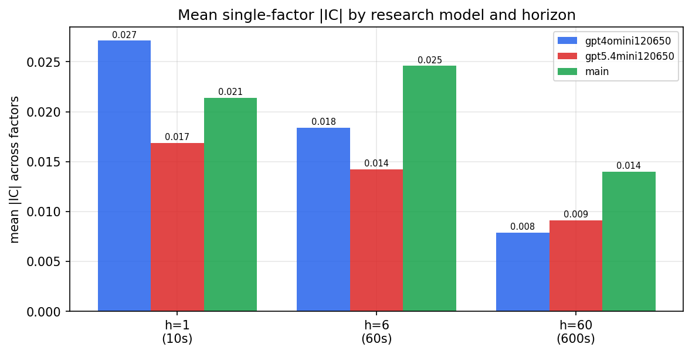

*Mean |IC| by research model and horizon*

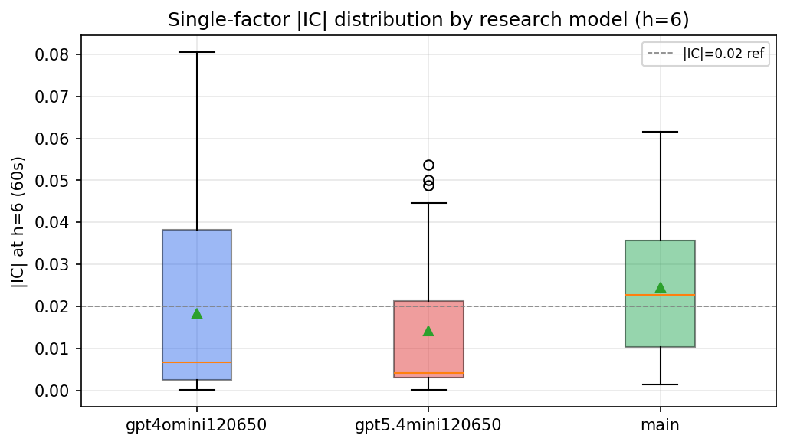

*Per-factor |IC| distribution by research model*

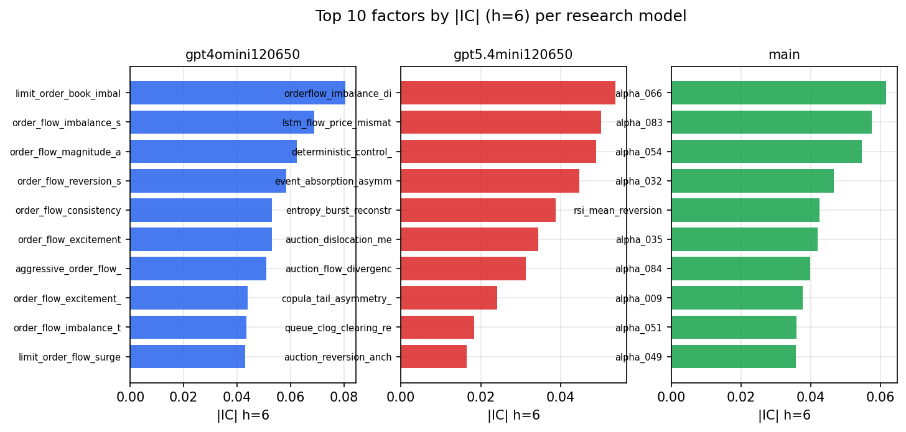

*Top factors by |IC| per research model*

## 2. Factor diversity & redundancy

Pairwise correlation of each zoo's *signals*. `eff_n_factors` is the effective number of independent factors (participation ratio of the correlation eigenvalues); `eff_ratio` and `redundancy` summarise how much unique information the zoo holds vs. how much is duplicated; `n_clusters` groups factors at |corr| ≥ 0.7.

| prerun | n_factors | eff_n_factors | eff_ratio | mean_abs_corr | n_clusters | redundancy |
| --- | --- | --- | --- | --- | --- | --- |
| gpt4omini120650 | 66 | 30.8991 | 0.4682 | 0.0446 | 55 | 0.5318 |
| gpt5.4mini120650 | 69 | 51.0934 | 0.7405 | 0.0131 | 63 | 0.2595 |
| main | 78 | 41.5425 | 0.5326 | 0.0316 | 72 | 0.4674 |

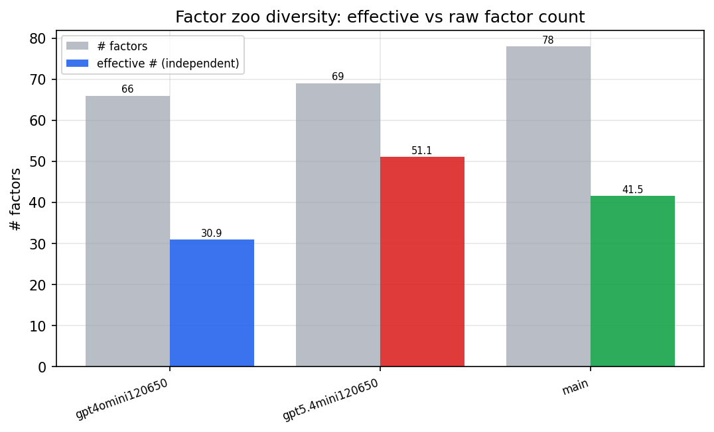

*Effective vs raw factor count per research model*

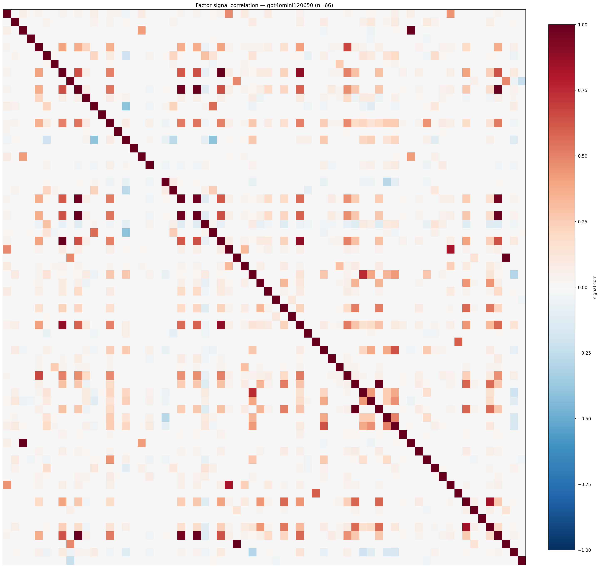

*Signal correlation matrix — gpt4omini120650*

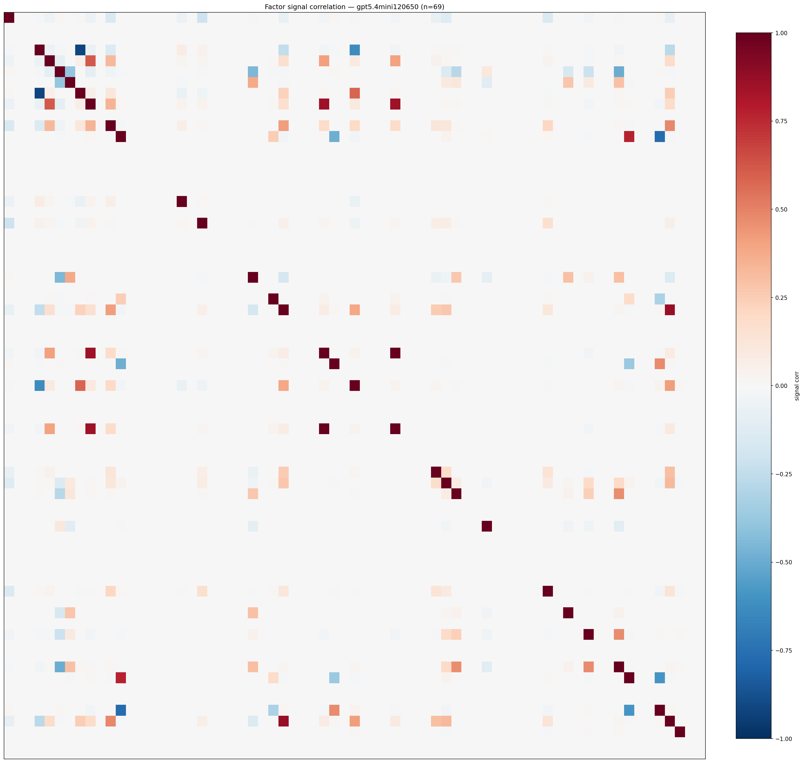

*Signal correlation matrix — gpt5.4mini120650*

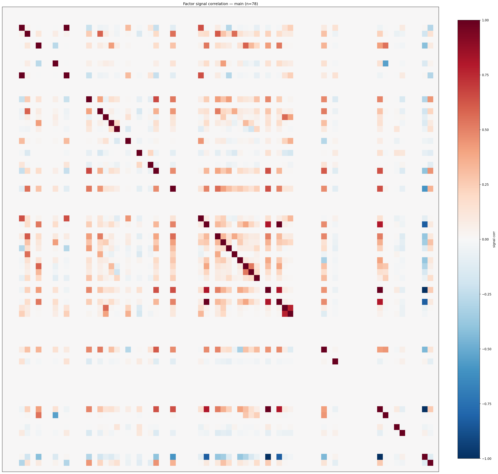

*Signal correlation matrix — main*

## 3. Deflation & model-based importance

`deflated_best_ic` haircuts each zoo's best |IC| for the number of factors tried (`ic_n_tested`) — a bigger zoo's best factor is more likely to be lucky. `lasso_n_nonzero` / `lasso_sparsity` show how many factors a sparse linear model actually keeps (model-view redundancy).

| prerun | best_ic | deflated_best_ic | deflated_best_t | ic_n_tested | ic_n_obs | lasso_n_nonzero | lasso_sparsity |
| --- | --- | --- | --- | --- | --- | --- | --- |
| gpt4omini120650 | 0.0805 | 0.0728 | 27.5146 | 64 | 142738 | 0 | 1.0 |
| gpt5.4mini120650 | 0.0537 | 0.0468 | 17.6722 | 31 | 142738 | 15 | 0.7826 |
| main | 0.0616 | 0.0545 | 20.5928 | 37 | 142738 | 36 | 0.5385 |

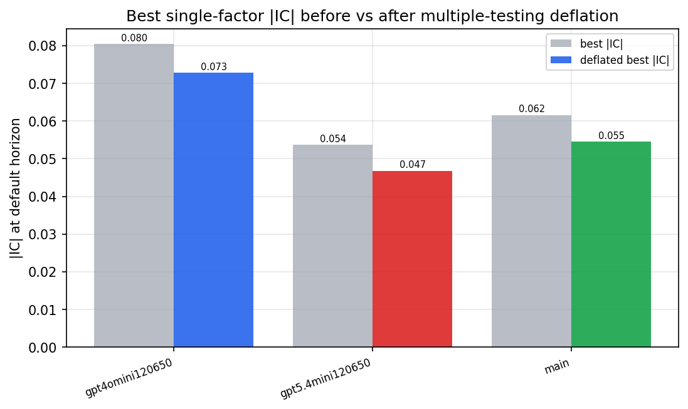

*Best |IC| before vs after multiple-testing deflation*

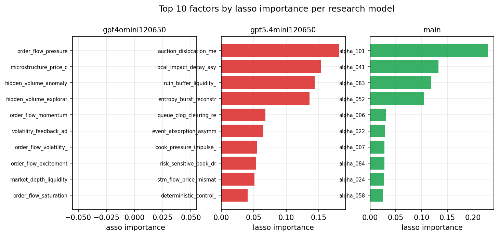

*Top factors by lasso importance per zoo*

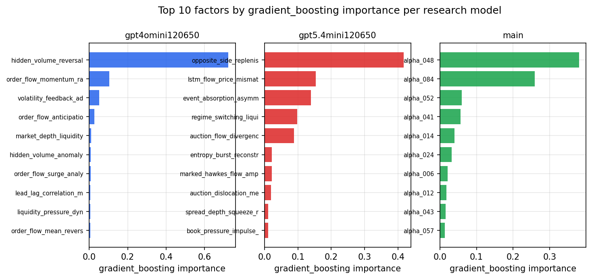

*Top factors by gradient_boosting importance per zoo*

## 4. ML-combined signal — per-underlying vectorised backtest

Each model combines a prerun's factors into ONE signal (fit `factors → forward return` on IS, predict per (bar, underlying)), then that combined signal is run through a simple vectorised backtest — `position(signal) × the underlying's own forward return` — on the held-out OOS tail (+ an equal-weight ensemble). No cross-sectional ranking.

> Config: position=**threshold** (t=1.0, z-score `expanding`), aggregation=**portfolio**, fit-standardise=**per_underlying**, horizon=6.

| prerun | model | n_factors_used | oos_ic | oos_sharpe | is_sharpe | oos_ann_return | oos_max_drawdown |
| --- | --- | --- | --- | --- | --- | --- | --- |
| gpt4omini120650 | linear_regression | 66 | 0.1051 | 7.8825 | 10.0281 | 0.5914 | -0.0055 |
| gpt4omini120650 | ridge | 66 | 0.1094 | 15.2456 | 10.9078 | 0.645 | -0.0058 |
| gpt4omini120650 | lasso | 66 | 0.1138 | 35.8503 | 19.7106 | 0.8694 | -0.0025 |
| gpt4omini120650 | elastic_net | 66 | 0.1138 | 35.8503 | 19.7106 | 0.8694 | -0.0025 |
| gpt4omini120650 | random_forest | 66 | 0.1012 | -2.9257 | 9.0135 | -0.101 | -0.0123 |
| gpt4omini120650 | gradient_boosting | 66 | -0.0048 | -1.9007 | 5.6999 | -0.0299 | -0.0046 |
| gpt4omini120650 | xgboost | 66 | 0.0913 | -8.524 | 7.5739 | -0.2519 | -0.0205 |
| gpt4omini120650 | lightgbm | 66 | 0.1049 | -2.5429 | 14.8965 | -0.1179 | -0.0217 |
| gpt4omini120650 | ensemble | 66 | 0.1205 | 12.5016 | 13.368 | 0.3853 | -0.0054 |
| gpt5.4mini120650 | linear_regression | 69 | 0.0957 | 9.0058 | 6.5674 | 0.6336 | -0.0033 |
| gpt5.4mini120650 | ridge | 69 | 0.0936 | 8.25 | 7.8493 | 0.5743 | -0.0037 |
| gpt5.4mini120650 | lasso | 69 | 0.1049 | 10.309 | 13.3408 | 0.8287 | -0.0059 |
| gpt5.4mini120650 | elastic_net | 69 | 0.1042 | 10.0048 | 12.6262 | 0.8038 | -0.0059 |
| gpt5.4mini120650 | random_forest | 69 | 0.0916 | 4.9879 | 9.7768 | 0.2256 | -0.008 |
| gpt5.4mini120650 | gradient_boosting | 69 | 0.0883 | 1.0798 | 6.585 | 0.0223 | -0.0072 |
| gpt5.4mini120650 | xgboost | 69 | 0.1182 | 3.4476 | 9.5776 | 0.0914 | -0.0053 |
| gpt5.4mini120650 | lightgbm | 69 | 0.1203 | -4.0038 | 14.4468 | -0.1377 | -0.0165 |
| gpt5.4mini120650 | ensemble | 69 | 0.1099 | 10.7417 | 13.4512 | 0.7719 | -0.0033 |
| main | linear_regression | 78 | 0.0526 | 4.1585 | 7.9694 | 0.2343 | -0.0079 |
| main | ridge | 78 | 0.0536 | 3.3406 | 8.1043 | 0.1802 | -0.0105 |
| main | lasso | 78 | 0.0635 | 4.7049 | 5.1114 | 0.2033 | -0.0056 |
| main | elastic_net | 78 | 0.0635 | 4.7049 | 5.1114 | 0.2033 | -0.0056 |
| main | random_forest | 78 | 0.0615 | 2.0509 | 9.8812 | 0.0311 | -0.0028 |
| main | gradient_boosting | 78 | 0.0505 | 4.9033 | 10.5126 | 0.035 | -0.0017 |
| main | xgboost | 78 | 0.0443 | 5.2099 | 11.6571 | 0.044 | -0.0009 |
| main | lightgbm | 78 | 0.0458 | -0.1054 | 14.9366 | -0.0015 | -0.003 |
| main | ensemble | 78 | 0.061 | 7.1287 | 10.5328 | 0.2871 | -0.0031 |

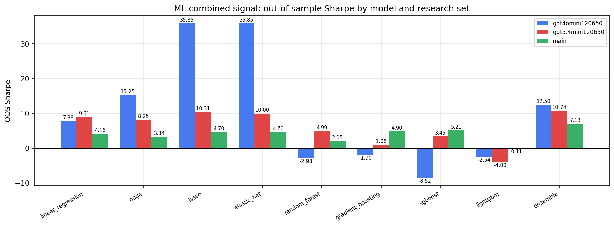

*ML-combined OOS Sharpe by model and research set*

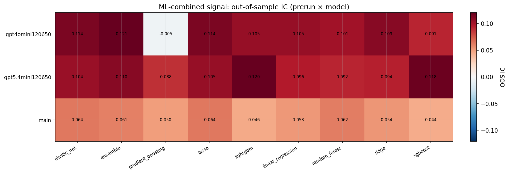

*ML-combined OOS IC (prerun × model)*

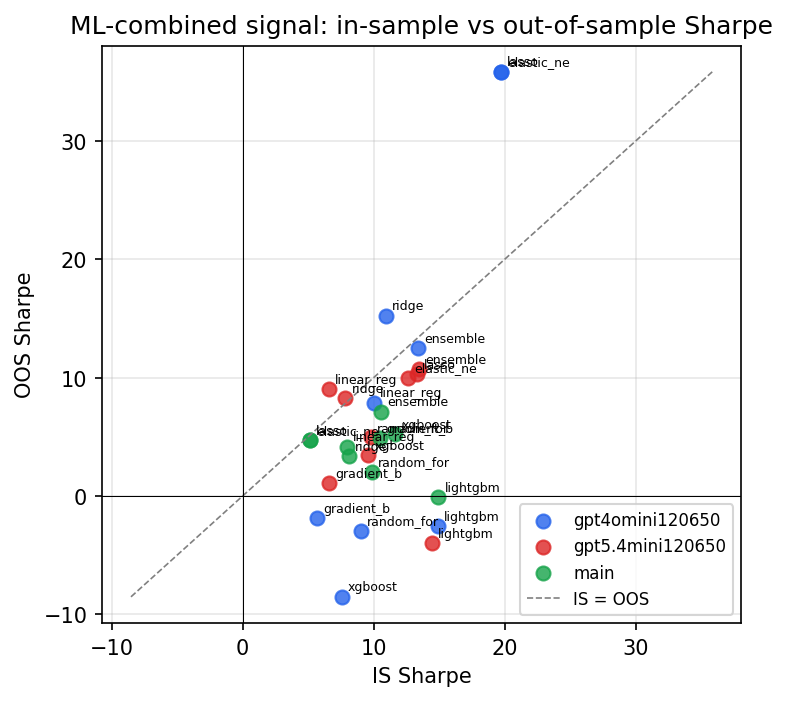

*IS vs OOS Sharpe (overfitting diagnostic)*

---
*Generated by `run_model_comparison.py`. Tables: `*.csv`; interactive: `comparison.ipynb`.*
