# Research-LLM factor comparison — `2025-07`

Comparing the **factor output of different research LLMs** on three axes (raw factor quality → factors as ML features → factors through the full agentic fund). The panel, IS/OOS split, horizon and model hyper-parameters are held identical across preruns — the *only* variable is the factor set.

## Preruns compared

| prerun | research_model | usable_factors | dropped_factors |
| --- | --- | --- | --- |
| gpt4omini120650 | gpt-4o-mini | 66 | 0 |
| gpt5.4mini120650 | gpt-5.4-mini | 69 | 0 |
| main | seed library | 78 | 10 |

> Dropped factors declare fields the current data doesn't have yet (e.g. fundamentals); they light up unchanged once that data is downloaded.

*Usable vs awaiting-data factors per research model*

## Key findings

- **Best ML-combined OOS Sharpe:** `gpt5.4mini120650` with `random_forest` (OOS Sharpe = 36.468).
- **Mean OOS Sharpe across models, by research set:** `gpt4omini120650` = 17.351, `gpt5.4mini120650` = 14.057, `main` = 5.362.
- **Highest mean single-factor |IC| (h=6):** `main` (mean |IC| = 0.0312).
- **Most diverse zoo (highest effective/raw factor ratio):** `gpt5.4mini120650` (eff 52.3 of 69, ratio 0.76).
- **Best selection-deflated single-factor |IC|:** `gpt4omini120650` (deflated |IC| = 0.1013 from 64 factors tried).

## 1. Single-factor IC (raw factor quality)

Per-underlying time-series Spearman rank-IC of every researched factor, recomputed on the shared panel at horizons h=1, h=6, h=60. The per-underlying IC correlates each factor's value vector with the underlying's own forward-return vector (pooled across underlyings); the cross-sectional IC ranks across underlyings per timestamp.

| prerun | n_factors | mean_abs_ic_1 | mean_abs_ic_6 | mean_abs_ic_60 | mean_abs_icir_6 | best_factor_h6 | best_abs_ic_h6 |
| --- | --- | --- | --- | --- | --- | --- | --- |
| gpt4omini120650 | 66 | 0.0354 | 0.026 | 0.01 | 1.3101 | limit_order_book_imbalance_surge | 0.1089 |
| gpt5.4mini120650 | 69 | 0.0275 | 0.022 | 0.0122 | 1.223 | orderflow_imbalance_divergence | 0.0848 |
| main | 78 | 0.039 | 0.0312 | 0.0233 | 1.5922 | alpha_054 | 0.0838 |

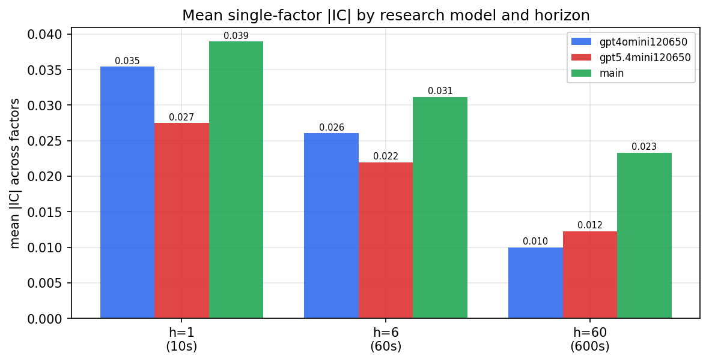

*Mean |IC| by research model and horizon*

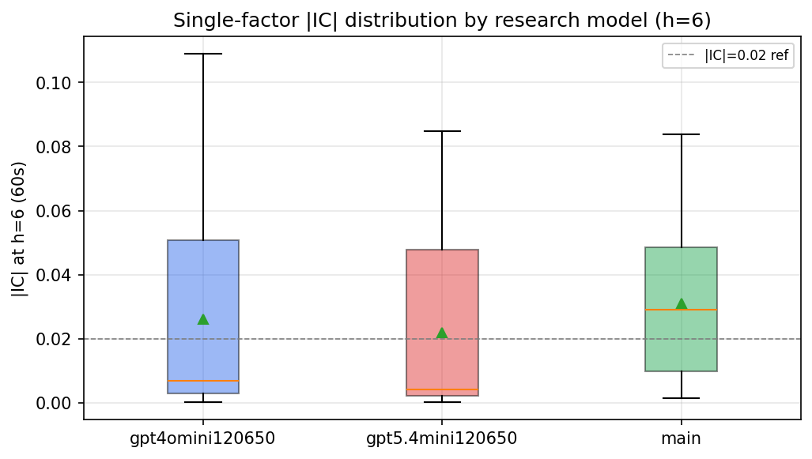

*Per-factor |IC| distribution by research model*

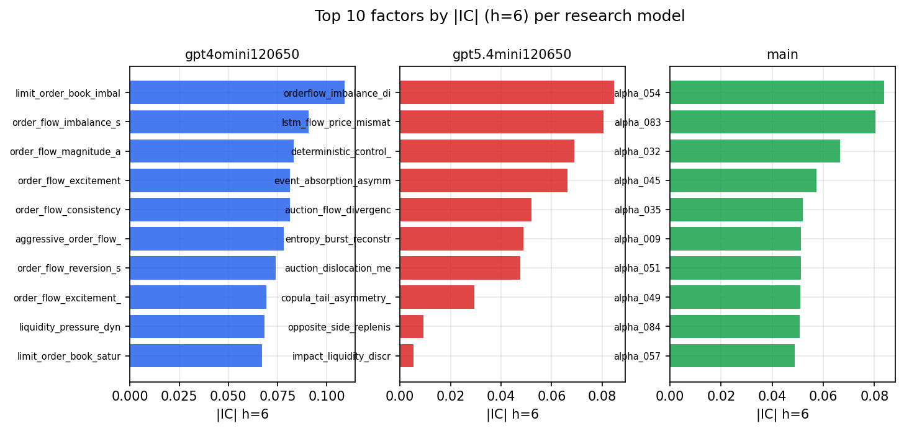

*Top factors by |IC| per research model*

## 2. Factor diversity & redundancy

Pairwise correlation of each zoo's *signals*. `eff_n_factors` is the effective number of independent factors (participation ratio of the correlation eigenvalues); `eff_ratio` and `redundancy` summarise how much unique information the zoo holds vs. how much is duplicated; `n_clusters` groups factors at |corr| ≥ 0.7.

| prerun | n_factors | eff_n_factors | eff_ratio | mean_abs_corr | n_clusters | redundancy |
| --- | --- | --- | --- | --- | --- | --- |
| gpt4omini120650 | 66 | 29.5298 | 0.4474 | 0.0459 | 53 | 0.5526 |
| gpt5.4mini120650 | 69 | 52.2894 | 0.7578 | 0.013 | 63 | 0.2422 |
| main | 78 | 36.7292 | 0.4709 | 0.0389 | 69 | 0.5291 |

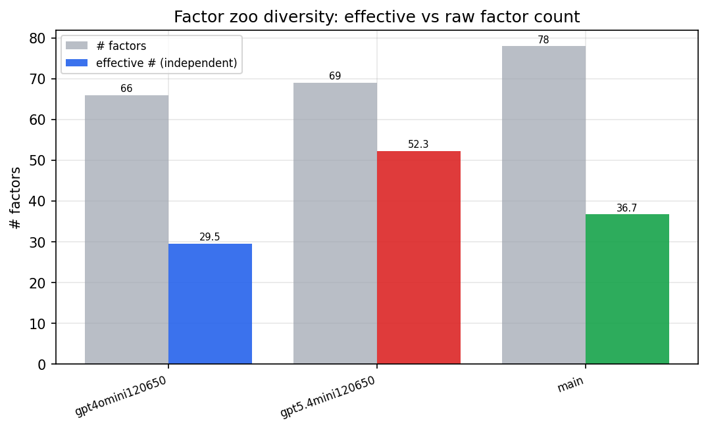

*Effective vs raw factor count per research model*

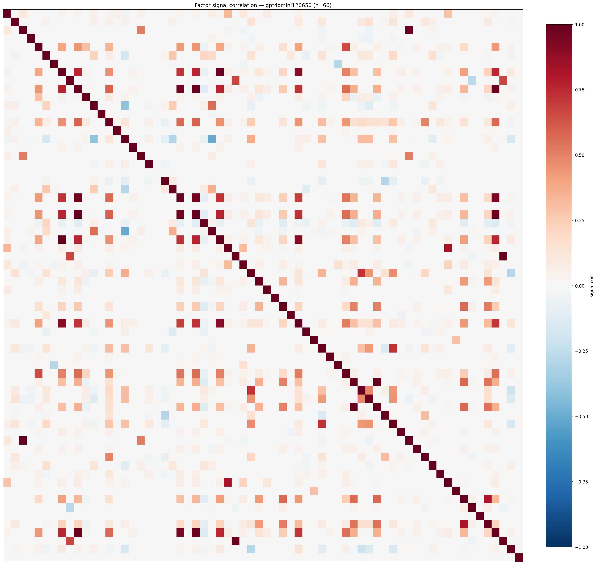

*Signal correlation matrix — gpt4omini120650*

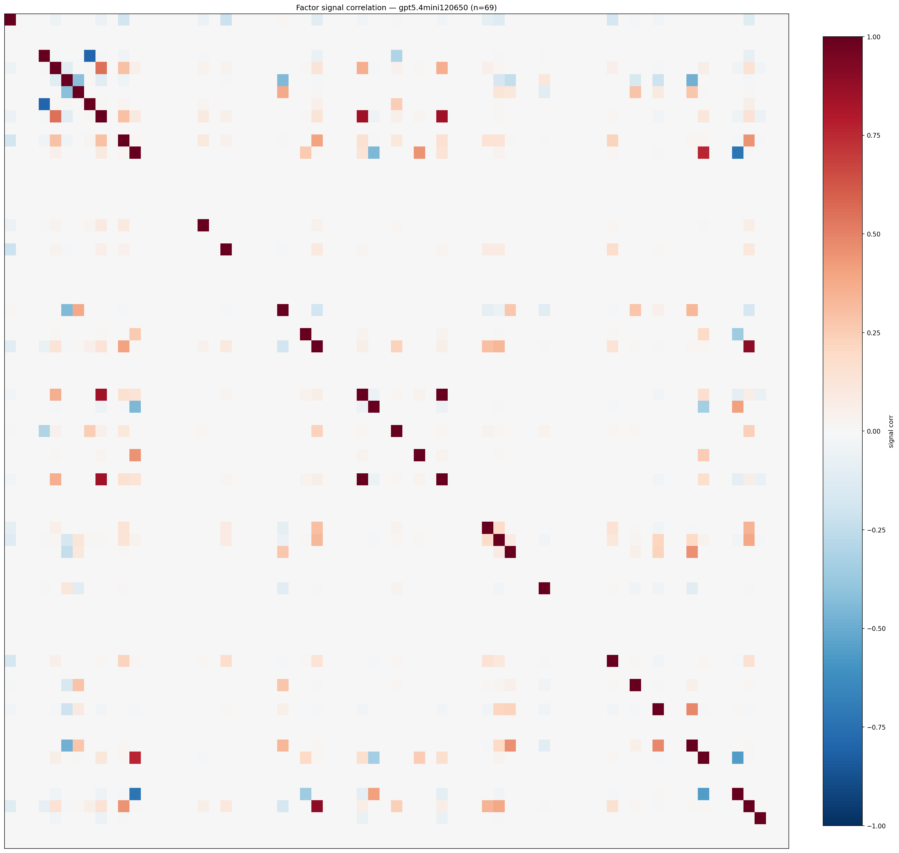

*Signal correlation matrix — gpt5.4mini120650*

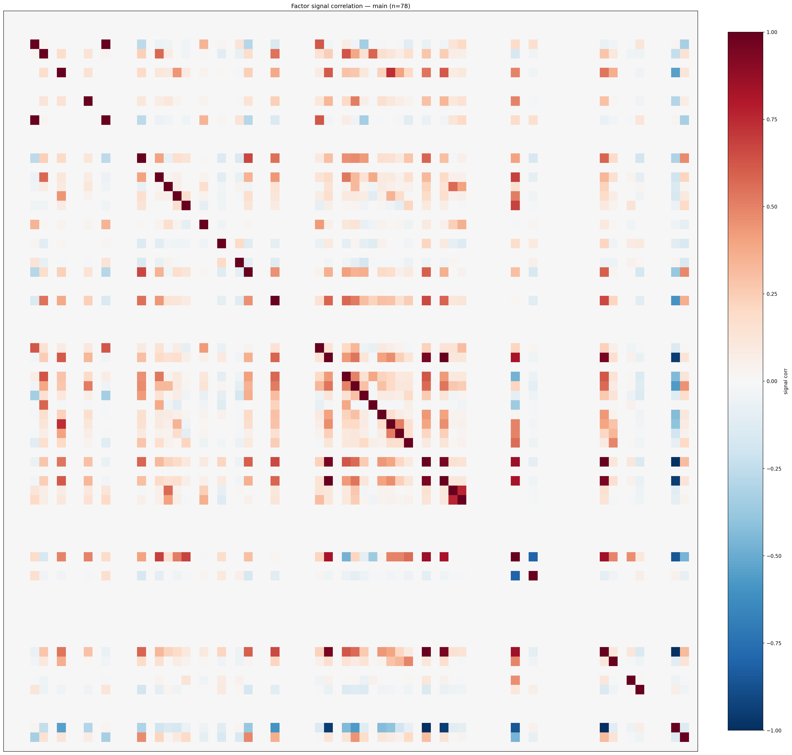

*Signal correlation matrix — main*

## 3. Deflation & model-based importance

`deflated_best_ic` haircuts each zoo's best |IC| for the number of factors tried (`ic_n_tested`) — a bigger zoo's best factor is more likely to be lucky. `lasso_n_nonzero` / `lasso_sparsity` show how many factors a sparse linear model actually keeps (model-view redundancy).

| prerun | best_ic | deflated_best_ic | deflated_best_t | ic_n_tested | ic_n_obs | lasso_n_nonzero | lasso_sparsity |
| --- | --- | --- | --- | --- | --- | --- | --- |
| gpt4omini120650 | 0.1089 | 0.1013 | 38.4311 | 64 | 143999 | 8 | 0.8788 |
| gpt5.4mini120650 | 0.0848 | 0.0782 | 29.6571 | 24 | 143999 | 10 | 0.8551 |
| main | 0.0838 | 0.0768 | 29.1301 | 37 | 143999 | 10 | 0.8718 |

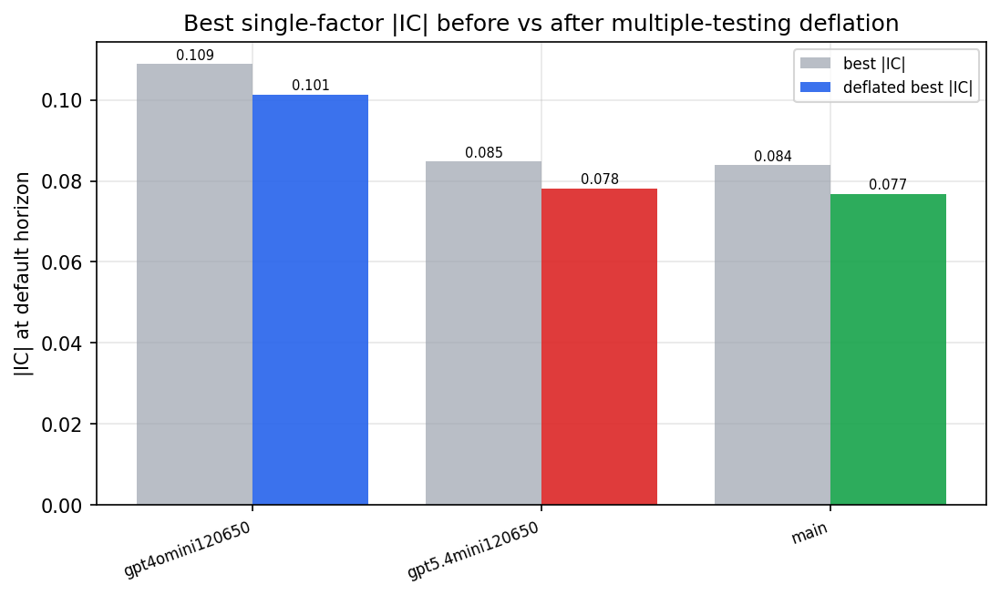

*Best |IC| before vs after multiple-testing deflation*

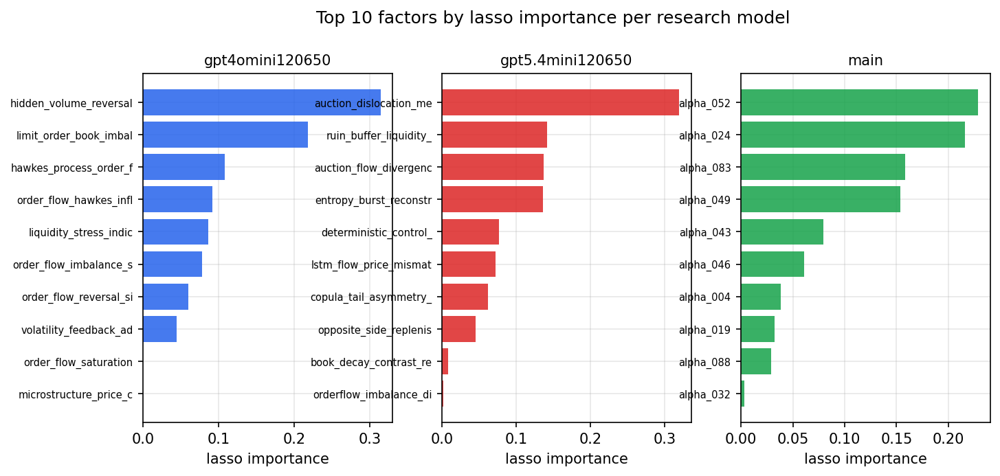

*Top factors by lasso importance per zoo*

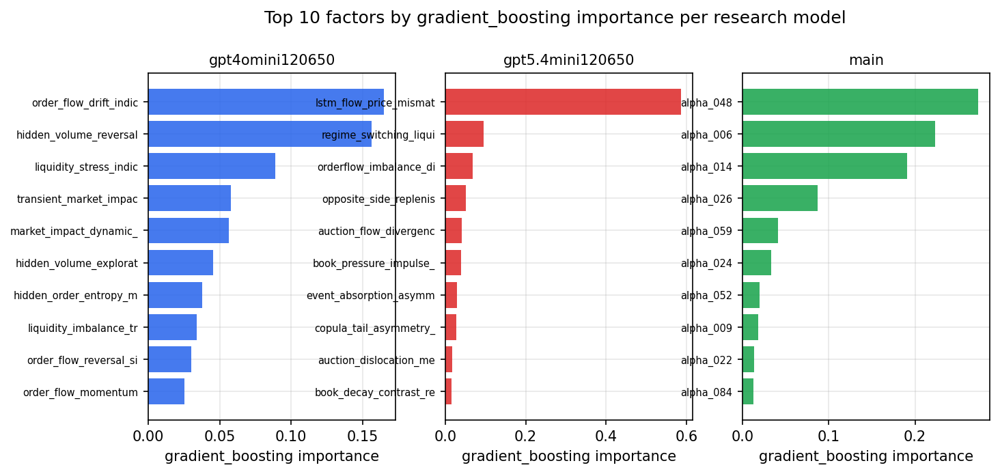

*Top factors by gradient_boosting importance per zoo*

## 4. ML-combined signal — per-underlying vectorised backtest

Each model combines a prerun's factors into ONE signal (fit `factors → forward return` on IS, predict per (bar, underlying)), then that combined signal is run through a simple vectorised backtest — `position(signal) × the underlying's own forward return` — on the held-out OOS tail (+ an equal-weight ensemble). No cross-sectional ranking.

> Config: position=**threshold** (t=1.0, z-score `expanding`), aggregation=**portfolio**, fit-standardise=**per_underlying**, horizon=6.

| prerun | model | n_factors_used | oos_ic | oos_sharpe | is_sharpe | oos_ann_return | oos_max_drawdown |
| --- | --- | --- | --- | --- | --- | --- | --- |
| gpt4omini120650 | linear_regression | 66 | 0.138 | 26.5723 | 21.0567 | 1.2856 | -0.0061 |
| gpt4omini120650 | ridge | 66 | 0.138 | 29.8097 | 23.3778 | 1.2781 | -0.006 |
| gpt4omini120650 | lasso | 66 | 0.1477 | 28.9007 | 20.2869 | 1.2464 | -0.0076 |
| gpt4omini120650 | elastic_net | 66 | 0.1483 | 34.059 | 21.269 | 1.2932 | -0.0059 |
| gpt4omini120650 | random_forest | 66 | 0.1422 | 29.1154 | 24.6074 | 1.6096 | -0.0085 |
| gpt4omini120650 | gradient_boosting | 66 | 0.1391 | -5.3948 | 11.1179 | -0.1614 | -0.0151 |
| gpt4omini120650 | xgboost | 66 | 0.1451 | -4.2112 | 12.3244 | -0.2816 | -0.0294 |
| gpt4omini120650 | lightgbm | 66 | 0.1522 | 0.769 | 14.2318 | 0.0375 | -0.0081 |
| gpt4omini120650 | ensemble | 66 | 0.1481 | 16.5389 | 18.036 | 0.9973 | -0.0094 |
| gpt5.4mini120650 | linear_regression | 69 | 0.1402 | -2.4507 | 1.3964 | -0.0262 | -0.0031 |
| gpt5.4mini120650 | ridge | 69 | 0.138 | -4.1682 | 1.1397 | -0.0423 | -0.0038 |
| gpt5.4mini120650 | lasso | 69 | 0.1408 | 22.8258 | 22.4487 | 1.325 | -0.0118 |
| gpt5.4mini120650 | elastic_net | 69 | 0.1408 | 22.8258 | 22.4487 | 1.325 | -0.0118 |
| gpt5.4mini120650 | random_forest | 69 | 0.1495 | 36.4677 | 22.1032 | 2.0064 | -0.0063 |
| gpt5.4mini120650 | gradient_boosting | 69 | 0.1519 | 0.8155 | 12.8339 | 0.0267 | -0.0086 |
| gpt5.4mini120650 | xgboost | 69 | 0.1607 | 19.842 | 16.9611 | 0.8886 | -0.0062 |
| gpt5.4mini120650 | lightgbm | 69 | 0.1657 | 3.748 | 15.5356 | 0.1324 | -0.0087 |
| gpt5.4mini120650 | ensemble | 69 | 0.1636 | 26.6105 | 19.1686 | 1.3148 | -0.0095 |
| main | linear_regression | 78 | 0.037 | 5.1874 | 13.6265 | 0.2346 | -0.007 |
| main | ridge | 78 | 0.0358 | 3.5916 | 13.6779 | 0.1626 | -0.0067 |
| main | lasso | 78 | 0.039 | 7.0245 | 11.2666 | 0.2981 | -0.0066 |
| main | elastic_net | 78 | 0.0399 | 6.937 | 11.4104 | 0.2954 | -0.0066 |
| main | random_forest | 78 | 0.0495 | 7.4076 | 13.4437 | 0.2284 | -0.0081 |
| main | gradient_boosting | 78 | 0.0434 | 3.8304 | 9.9704 | 0.1103 | -0.0104 |
| main | xgboost | 78 | 0.0443 | 3.2818 | 12.3686 | 0.0932 | -0.0083 |
| main | lightgbm | 78 | 0.0416 | 4.9154 | 16.0606 | 0.1354 | -0.0073 |
| main | ensemble | 78 | 0.0425 | 6.0799 | 14.2804 | 0.2468 | -0.0064 |

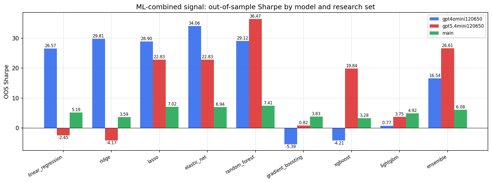

*ML-combined OOS Sharpe by model and research set*

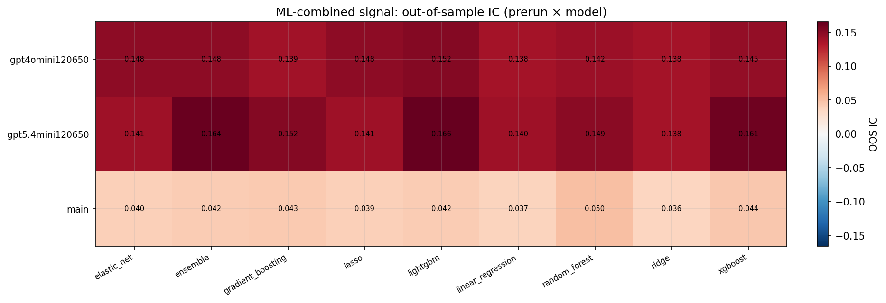

*ML-combined OOS IC (prerun × model)*

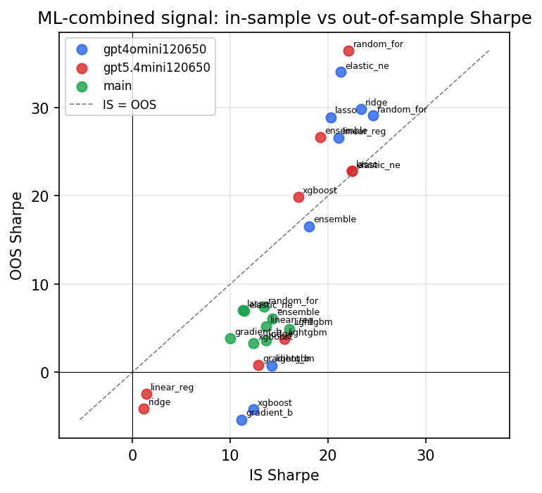

*IS vs OOS Sharpe (overfitting diagnostic)*

---
*Generated by `run_model_comparison.py`. Tables: `*.csv`; interactive: `comparison.ipynb`.*
