# Research-LLM factor comparison — `2025-08`

Comparing the **factor output of different research LLMs** on three axes (raw factor quality → factors as ML features → factors through the full agentic fund). The panel, IS/OOS split, horizon and model hyper-parameters are held identical across preruns — the *only* variable is the factor set.

## Preruns compared

| prerun | research_model | usable_factors | dropped_factors |
| --- | --- | --- | --- |
| gpt4omini120650 | gpt-4o-mini | 66 | 0 |
| gpt5.4mini120650 | gpt-5.4-mini | 69 | 0 |
| main | seed library | 78 | 10 |

> Dropped factors declare fields the current data doesn't have yet (e.g. fundamentals); they light up unchanged once that data is downloaded.

*Usable vs awaiting-data factors per research model*

## Key findings

- **Best ML-combined OOS Sharpe:** `gpt5.4mini120650` with `linear_regression` (OOS Sharpe = 30.820).
- **Mean OOS Sharpe across models, by research set:** `gpt5.4mini120650` = 19.230, `gpt4omini120650` = 12.915, `main` = 3.062.
- **Highest mean single-factor |IC| (h=6):** `main` (mean |IC| = 0.0348).
- **Most diverse zoo (highest effective/raw factor ratio):** `gpt5.4mini120650` (eff 52.9 of 69, ratio 0.77).
- **Best selection-deflated single-factor |IC|:** `gpt4omini120650` (deflated |IC| = 0.1104 from 64 factors tried).

## 1. Single-factor IC (raw factor quality)

Per-underlying time-series Spearman rank-IC of every researched factor, recomputed on the shared panel at horizons h=1, h=6, h=60. The per-underlying IC correlates each factor's value vector with the underlying's own forward-return vector (pooled across underlyings); the cross-sectional IC ranks across underlyings per timestamp.

| prerun | n_factors | mean_abs_ic_1 | mean_abs_ic_6 | mean_abs_ic_60 | mean_abs_icir_6 | best_factor_h6 | best_abs_ic_h6 |
| --- | --- | --- | --- | --- | --- | --- | --- |
| gpt4omini120650 | 66 | 0.0397 | 0.0311 | 0.0149 | 1.7136 | limit_order_book_imbalance_surge | 0.1179 |
| gpt5.4mini120650 | 69 | 0.0237 | 0.0207 | 0.0112 | 1.5178 | lstm_flow_price_mismatch | 0.0993 |
| main | 78 | 0.0369 | 0.0348 | 0.0203 | 1.8656 | alpha_066 | 0.0928 |

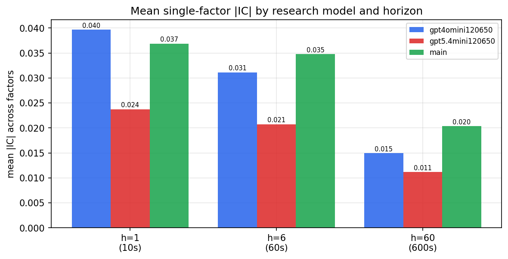

*Mean |IC| by research model and horizon*

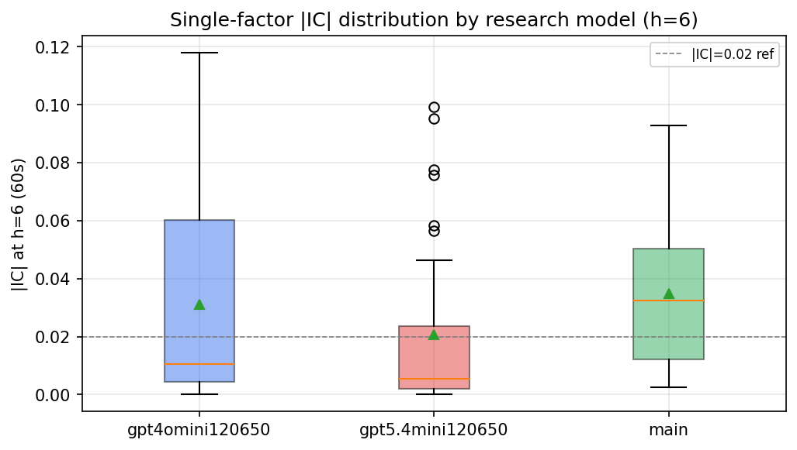

*Per-factor |IC| distribution by research model*

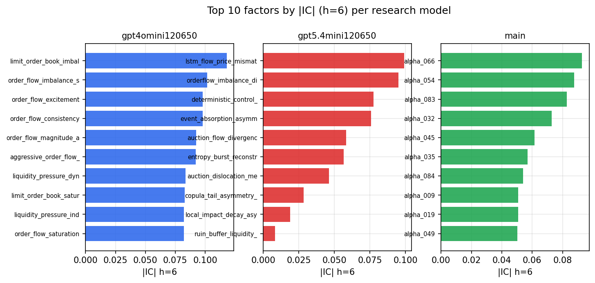

*Top factors by |IC| per research model*

## 2. Factor diversity & redundancy

Pairwise correlation of each zoo's *signals*. `eff_n_factors` is the effective number of independent factors (participation ratio of the correlation eigenvalues); `eff_ratio` and `redundancy` summarise how much unique information the zoo holds vs. how much is duplicated; `n_clusters` groups factors at |corr| ≥ 0.7.

| prerun | n_factors | eff_n_factors | eff_ratio | mean_abs_corr | n_clusters | redundancy |
| --- | --- | --- | --- | --- | --- | --- |
| gpt4omini120650 | 66 | 28.0752 | 0.4254 | 0.0482 | 51 | 0.5746 |
| gpt5.4mini120650 | 69 | 52.8901 | 0.7665 | 0.0123 | 64 | 0.2335 |
| main | 78 | 37.495 | 0.4807 | 0.0383 | 63 | 0.5193 |

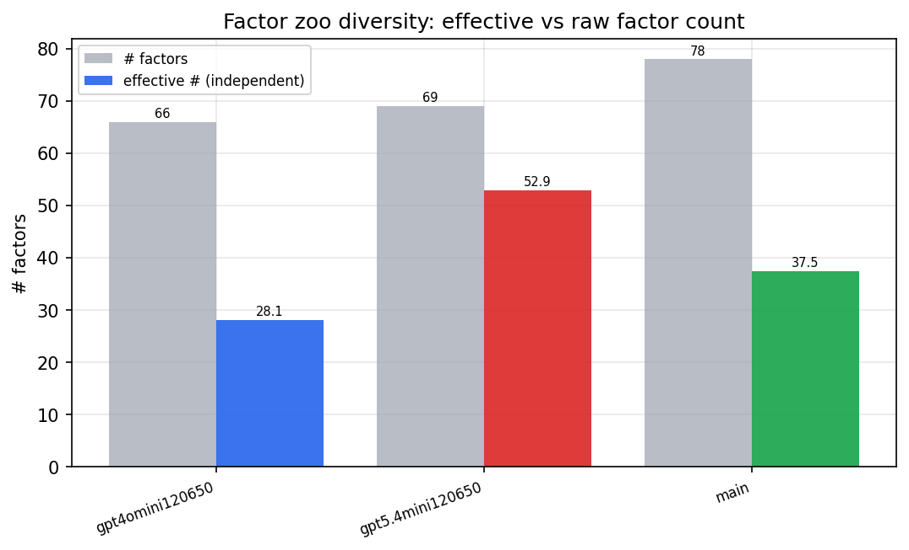

*Effective vs raw factor count per research model*

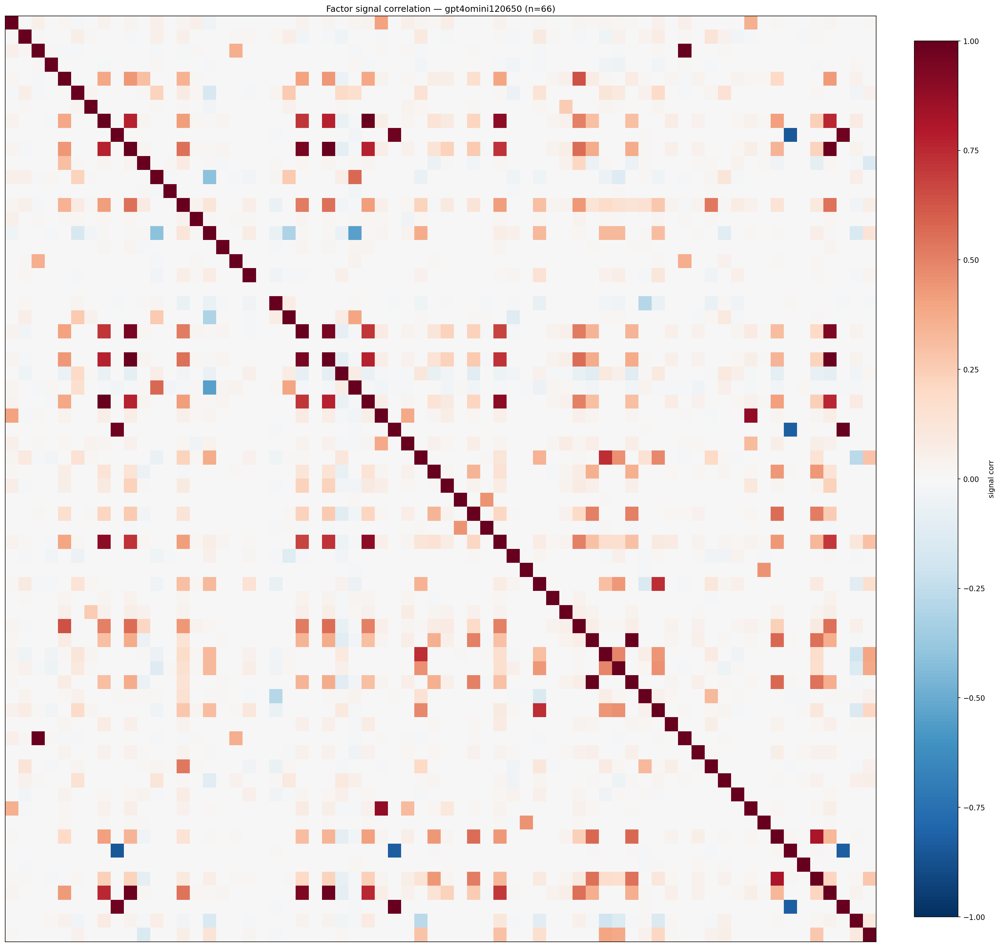

*Signal correlation matrix — gpt4omini120650*

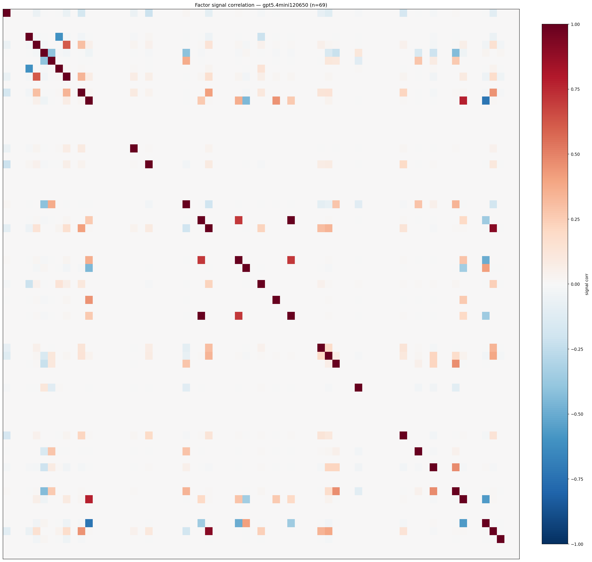

*Signal correlation matrix — gpt5.4mini120650*

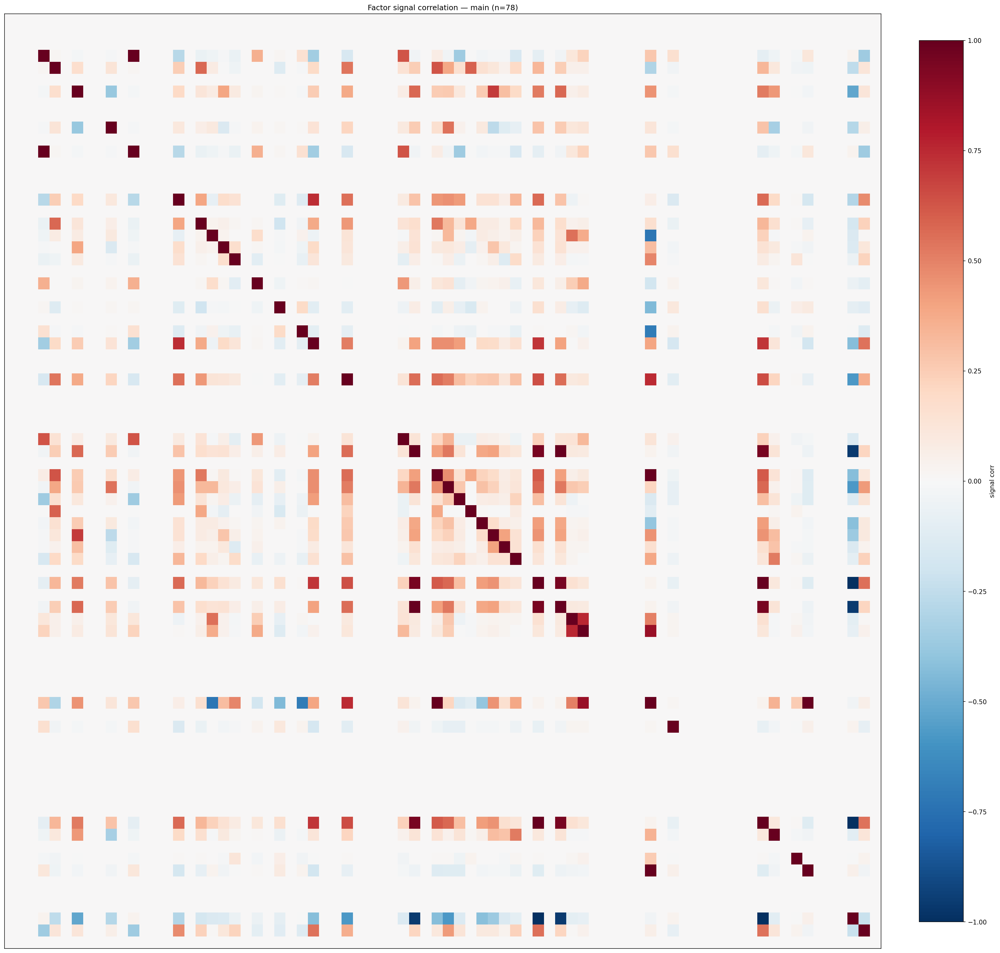

*Signal correlation matrix — main*

## 3. Deflation & model-based importance

`deflated_best_ic` haircuts each zoo's best |IC| for the number of factors tried (`ic_n_tested`) — a bigger zoo's best factor is more likely to be lucky. `lasso_n_nonzero` / `lasso_sparsity` show how many factors a sparse linear model actually keeps (model-view redundancy).

| prerun | best_ic | deflated_best_ic | deflated_best_t | ic_n_tested | ic_n_obs | lasso_n_nonzero | lasso_sparsity |
| --- | --- | --- | --- | --- | --- | --- | --- |
| gpt4omini120650 | 0.1179 | 0.1104 | 42.2153 | 64 | 146339 | 14 | 0.7879 |
| gpt5.4mini120650 | 0.0993 | 0.0924 | 35.3484 | 31 | 146339 | 10 | 0.8551 |
| main | 0.0928 | 0.0858 | 32.8281 | 37 | 146339 | 0 | 1.0 |

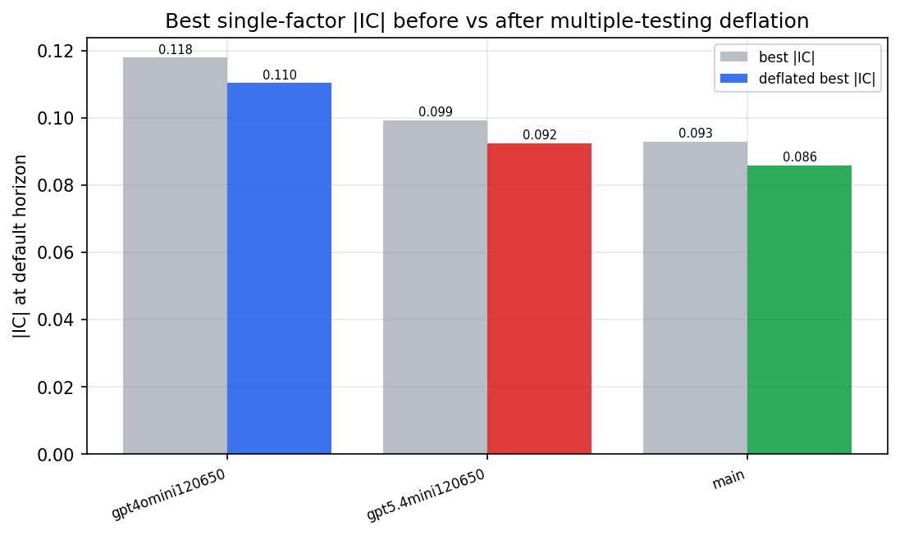

*Best |IC| before vs after multiple-testing deflation*

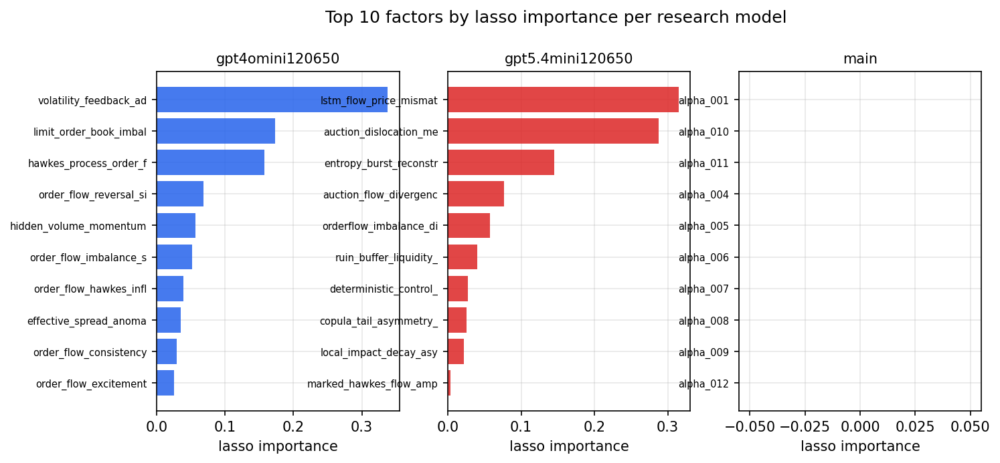

*Top factors by lasso importance per zoo*

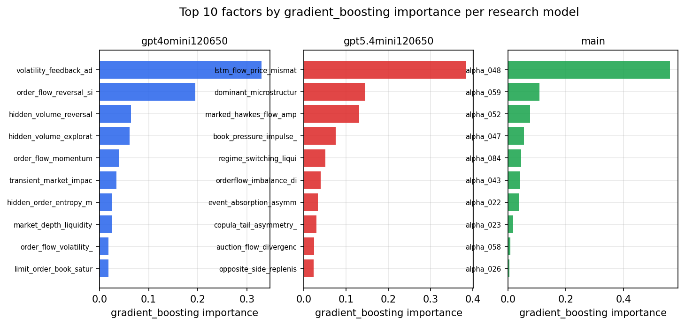

*Top factors by gradient_boosting importance per zoo*

## 4. ML-combined signal — per-underlying vectorised backtest

Each model combines a prerun's factors into ONE signal (fit `factors → forward return` on IS, predict per (bar, underlying)), then that combined signal is run through a simple vectorised backtest — `position(signal) × the underlying's own forward return` — on the held-out OOS tail (+ an equal-weight ensemble). No cross-sectional ranking.

> Config: position=**threshold** (t=1.0, z-score `expanding`), aggregation=**portfolio**, fit-standardise=**per_underlying**, horizon=6.

| prerun | model | n_factors_used | oos_ic | oos_sharpe | is_sharpe | oos_ann_return | oos_max_drawdown |
| --- | --- | --- | --- | --- | --- | --- | --- |
| gpt4omini120650 | linear_regression | 66 | 0.1462 | 28.0837 | 21.625 | 1.6224 | -0.0023 |
| gpt4omini120650 | ridge | 66 | 0.1478 | 27.4256 | 22.1461 | 1.6001 | -0.0034 |
| gpt4omini120650 | lasso | 66 | 0.1529 | 22.6633 | 23.8435 | 1.8665 | -0.0026 |
| gpt4omini120650 | elastic_net | 66 | 0.1534 | 22.5476 | 24.1646 | 1.856 | -0.0026 |
| gpt4omini120650 | random_forest | 66 | 0.1515 | 8.6474 | 27.6417 | 1.0001 | -0.0278 |
| gpt4omini120650 | gradient_boosting | 66 | 0.1306 | -2.6393 | 9.9439 | -0.1825 | -0.0218 |
| gpt4omini120650 | xgboost | 66 | 0.1607 | -2.2054 | 13.8395 | -0.2546 | -0.0348 |
| gpt4omini120650 | lightgbm | 66 | 0.1655 | -0.3955 | 16.0932 | -0.0281 | -0.0161 |
| gpt4omini120650 | ensemble | 66 | 0.1628 | 12.1069 | 23.3996 | 1.0034 | -0.0177 |
| gpt5.4mini120650 | linear_regression | 69 | 0.157 | 30.8199 | 25.2192 | 1.8807 | -0.0054 |
| gpt5.4mini120650 | ridge | 69 | 0.1587 | 26.4079 | 25.5843 | 1.9078 | -0.0054 |
| gpt5.4mini120650 | lasso | 69 | 0.1628 | 23.8569 | 23.0633 | 2.0118 | -0.0052 |
| gpt5.4mini120650 | elastic_net | 69 | 0.1628 | 23.8569 | 23.0633 | 2.0118 | -0.0052 |
| gpt5.4mini120650 | random_forest | 69 | 0.1678 | 20.4069 | 32.974 | 2.0359 | -0.0199 |
| gpt5.4mini120650 | gradient_boosting | 69 | 0.1683 | -1.4155 | 10.1916 | -0.0399 | -0.0075 |
| gpt5.4mini120650 | xgboost | 69 | 0.1878 | 18.463 | 23.5038 | 1.1102 | -0.0129 |
| gpt5.4mini120650 | lightgbm | 69 | 0.1853 | 5.1627 | 18.3831 | 0.3611 | -0.017 |
| gpt5.4mini120650 | ensemble | 69 | 0.182 | 25.5123 | 28.9137 | 1.875 | -0.0163 |
| main | linear_regression | 78 | 0.0331 | 3.5773 | 12.5641 | 0.3051 | -0.024 |
| main | ridge | 78 | 0.037 | 2.8645 | 12.2568 | 0.2426 | -0.0246 |
| main | lasso | 78 | 0.0437 | 5.6005 | 10.4277 | 0.3871 | -0.0169 |
| main | elastic_net | 78 | 0.0436 | 7.8146 | 10.5624 | 0.4464 | -0.0126 |
| main | random_forest | 78 | 0.0471 | 4.7708 | 15.2009 | 0.2708 | -0.0147 |
| main | gradient_boosting | 78 | 0.0342 | 1.095 | 12.6618 | 0.0459 | -0.0102 |
| main | xgboost | 78 | 0.0389 | -0.5787 | 16.6042 | -0.038 | -0.0179 |
| main | lightgbm | 78 | 0.046 | -0.7154 | 17.4297 | -0.0262 | -0.0157 |
| main | ensemble | 78 | 0.0467 | 3.1291 | 16.3411 | 0.2155 | -0.0179 |

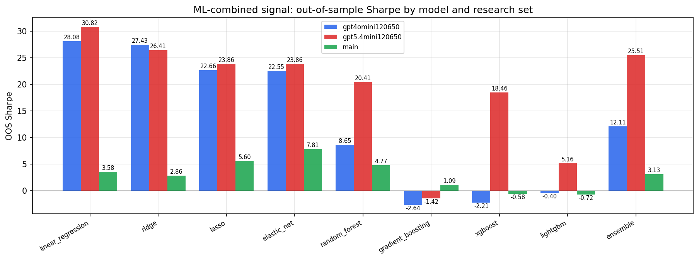

*ML-combined OOS Sharpe by model and research set*

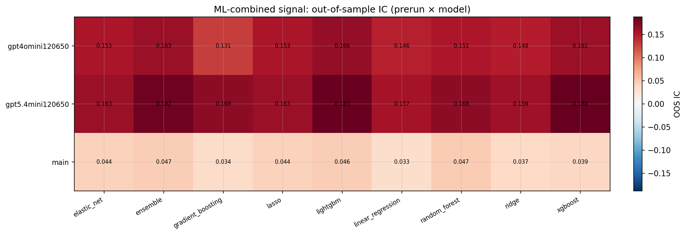

*ML-combined OOS IC (prerun × model)*

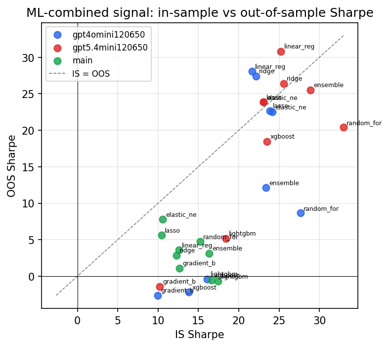

*IS vs OOS Sharpe (overfitting diagnostic)*

---
*Generated by `run_model_comparison.py`. Tables: `*.csv`; interactive: `comparison.ipynb`.*
