# Research-LLM factor comparison — `2025-09`

Comparing the **factor output of different research LLMs** on three axes (raw factor quality → factors as ML features → factors through the full agentic fund). The panel, IS/OOS split, horizon and model hyper-parameters are held identical across preruns — the *only* variable is the factor set.

## Preruns compared

| prerun | research_model | usable_factors | dropped_factors |
| --- | --- | --- | --- |
| gpt4omini120650 | gpt-4o-mini | 66 | 0 |
| gpt5.4mini120650 | gpt-5.4-mini | 69 | 0 |
| main | seed library | 78 | 10 |

> Dropped factors declare fields the current data doesn't have yet (e.g. fundamentals); they light up unchanged once that data is downloaded.

*Usable vs awaiting-data factors per research model*

## Key findings

- **Best ML-combined OOS Sharpe:** `gpt4omini120650` with `random_forest` (OOS Sharpe = 41.420).
- **Mean OOS Sharpe across models, by research set:** `gpt5.4mini120650` = 19.993, `gpt4omini120650` = 16.583, `main` = 3.951.
- **Highest mean single-factor |IC| (h=6):** `gpt4omini120650` (mean |IC| = 0.0344).
- **Most diverse zoo (highest effective/raw factor ratio):** `gpt5.4mini120650` (eff 56.3 of 69, ratio 0.82).
- **Best selection-deflated single-factor |IC|:** `main` (deflated |IC| = 0.3267 from 37 factors tried).

## 1. Single-factor IC (raw factor quality)

Per-underlying time-series Spearman rank-IC of every researched factor, recomputed on the shared panel at horizons h=1, h=6, h=60. The per-underlying IC correlates each factor's value vector with the underlying's own forward-return vector (pooled across underlyings); the cross-sectional IC ranks across underlyings per timestamp.

| prerun | n_factors | mean_abs_ic_1 | mean_abs_ic_6 | mean_abs_ic_60 | mean_abs_icir_6 | best_factor_h6 | best_abs_ic_h6 |
| --- | --- | --- | --- | --- | --- | --- | --- |
| gpt4omini120650 | 66 | 0.0421 | 0.0344 | 0.0143 | 1.8789 | limit_order_book_imbalance_surge | 0.1177 |
| gpt5.4mini120650 | 69 | 0.0251 | 0.0219 | 0.013 | 1.5458 | lstm_flow_price_mismatch | 0.1221 |
| main | 78 | 0.0318 | 0.0328 | 0.0125 | 1.1135 | alpha_066 | 0.3337 |

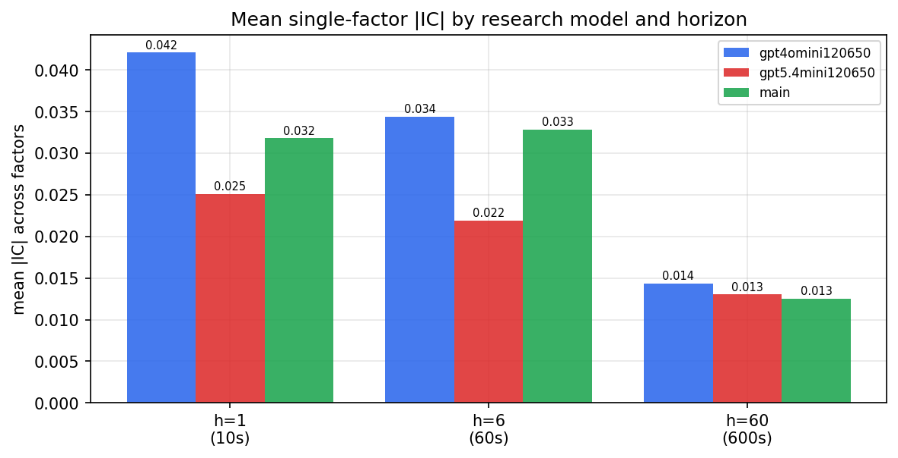

*Mean |IC| by research model and horizon*

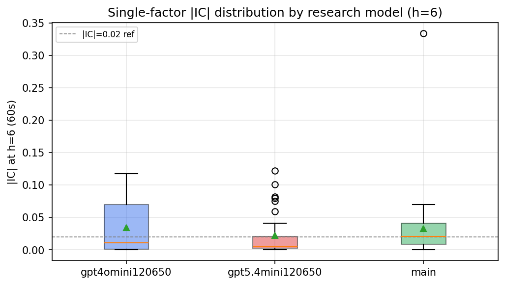

*Per-factor |IC| distribution by research model*

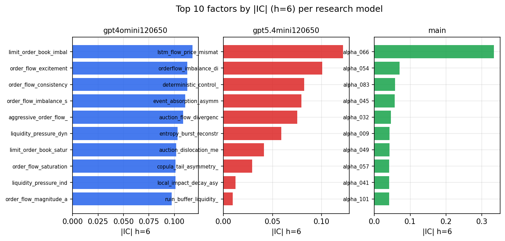

*Top factors by |IC| per research model*

## 2. Factor diversity & redundancy

Pairwise correlation of each zoo's *signals*. `eff_n_factors` is the effective number of independent factors (participation ratio of the correlation eigenvalues); `eff_ratio` and `redundancy` summarise how much unique information the zoo holds vs. how much is duplicated; `n_clusters` groups factors at |corr| ≥ 0.7.

| prerun | n_factors | eff_n_factors | eff_ratio | mean_abs_corr | n_clusters | redundancy |
| --- | --- | --- | --- | --- | --- | --- |
| gpt4omini120650 | 66 | 28.8712 | 0.4374 | 0.0462 | 51 | 0.5626 |
| gpt5.4mini120650 | 69 | 56.3142 | 0.8161 | 0.0102 | 66 | 0.1839 |
| main | 78 | 36.4052 | 0.4667 | 0.0395 | 56 | 0.5333 |

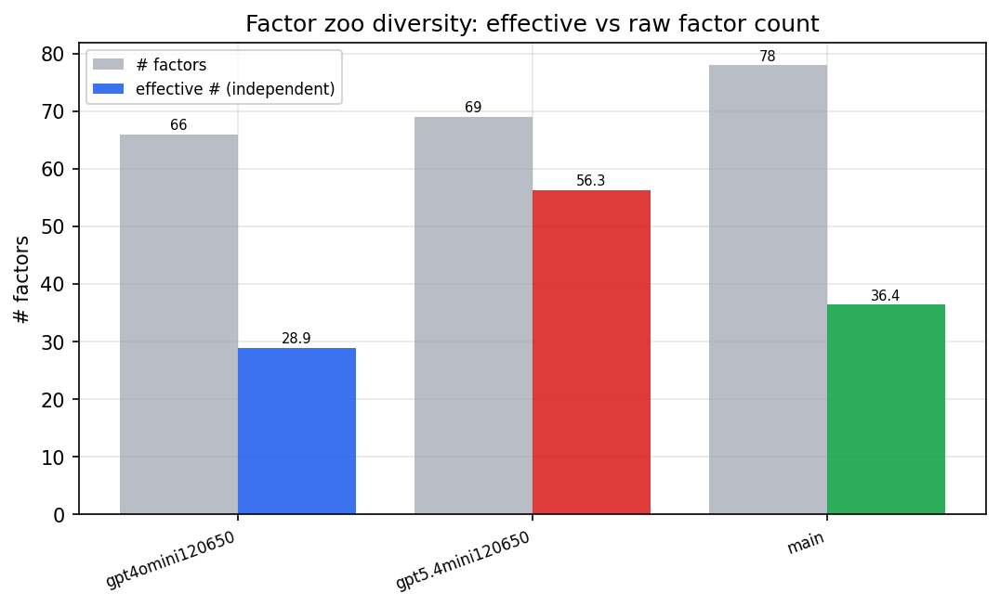

*Effective vs raw factor count per research model*

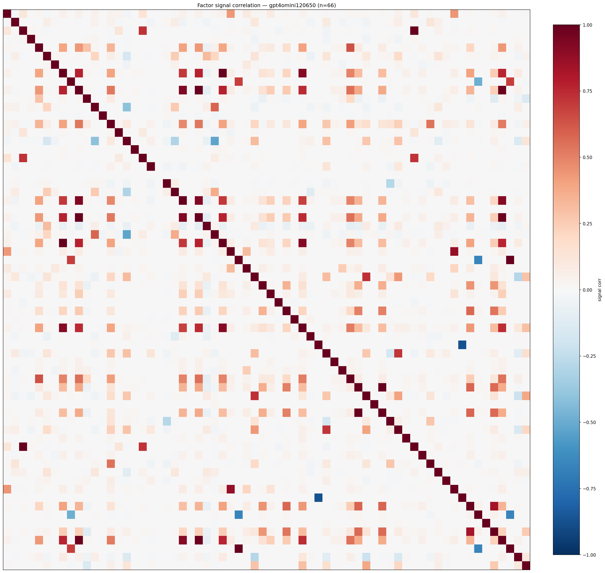

*Signal correlation matrix — gpt4omini120650*

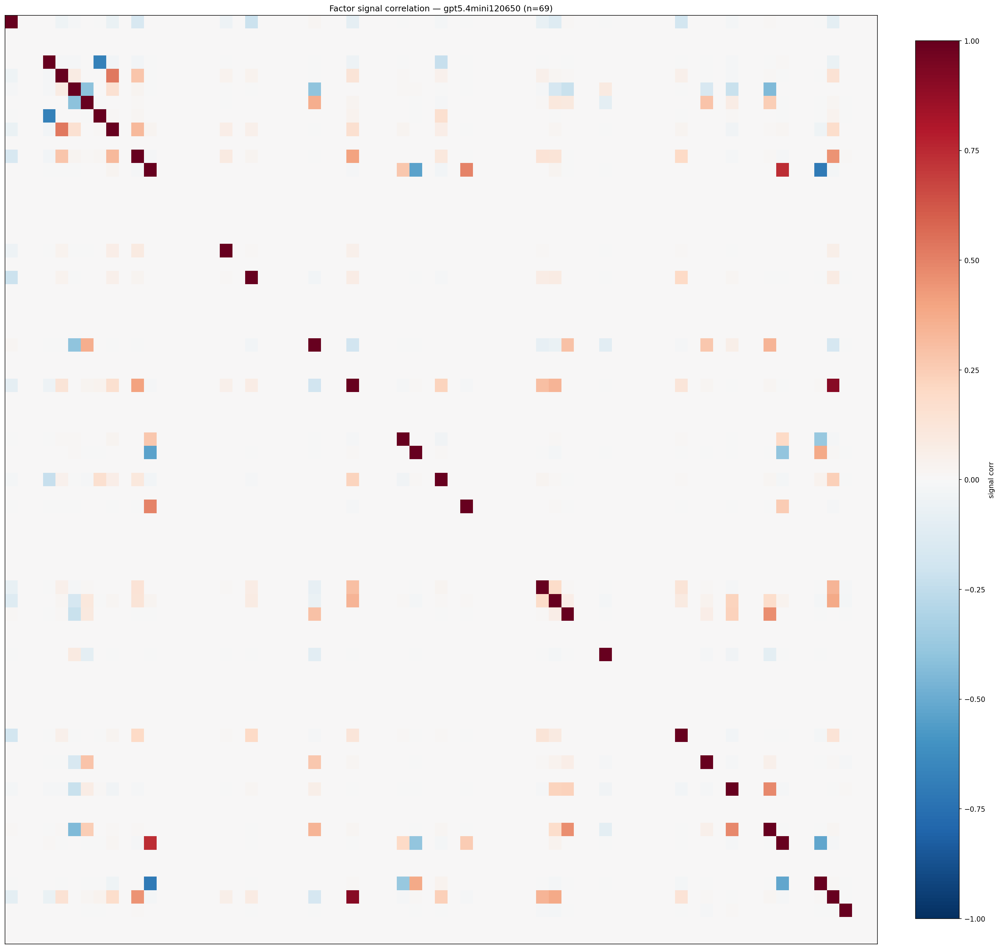

*Signal correlation matrix — gpt5.4mini120650*

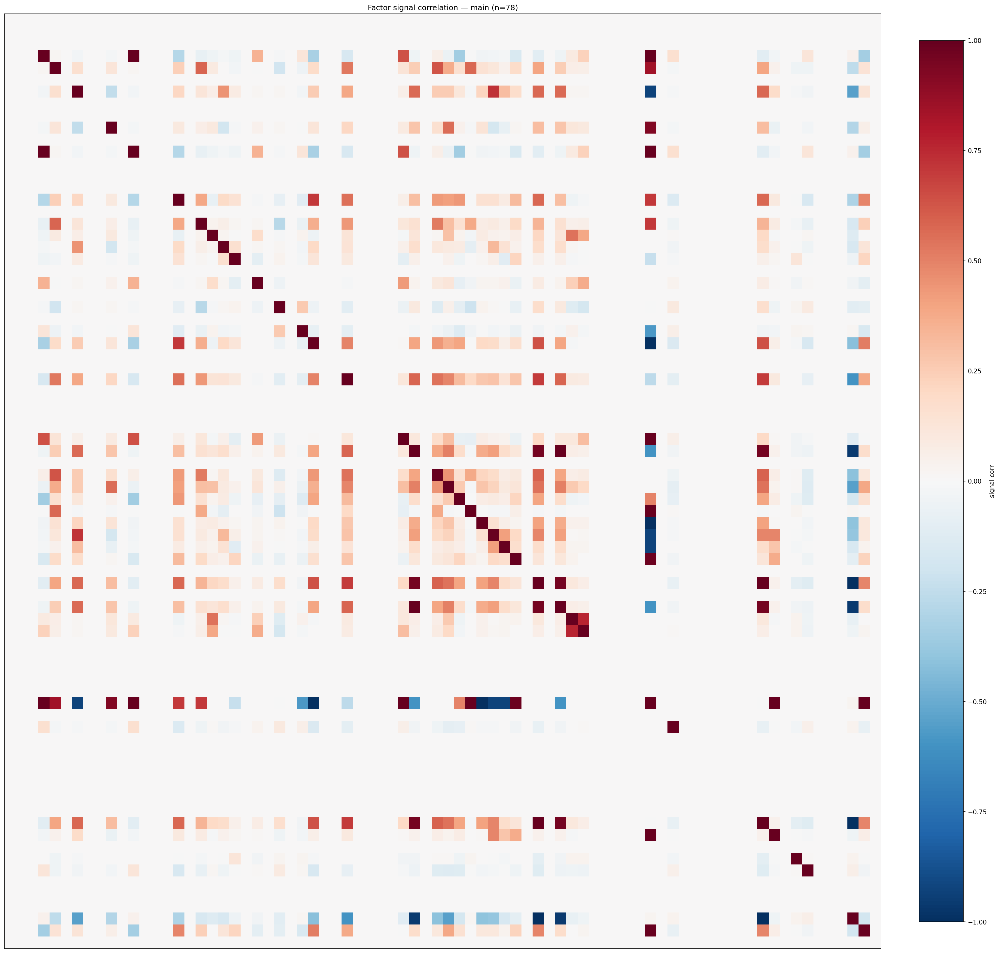

*Signal correlation matrix — main*

## 3. Deflation & model-based importance

`deflated_best_ic` haircuts each zoo's best |IC| for the number of factors tried (`ic_n_tested`) — a bigger zoo's best factor is more likely to be lucky. `lasso_n_nonzero` / `lasso_sparsity` show how many factors a sparse linear model actually keeps (model-view redundancy).

| prerun | best_ic | deflated_best_ic | deflated_best_t | ic_n_tested | ic_n_obs | lasso_n_nonzero | lasso_sparsity |
| --- | --- | --- | --- | --- | --- | --- | --- |
| gpt4omini120650 | 0.1177 | 0.1102 | 42.4907 | 64 | 148679 | 6 | 0.9091 |
| gpt5.4mini120650 | 0.1221 | 0.1153 | 44.4657 | 31 | 148679 | 21 | 0.6957 |
| main | 0.3337 | 0.3267 | 125.9737 | 37 | 148679 | 0 | 1.0 |

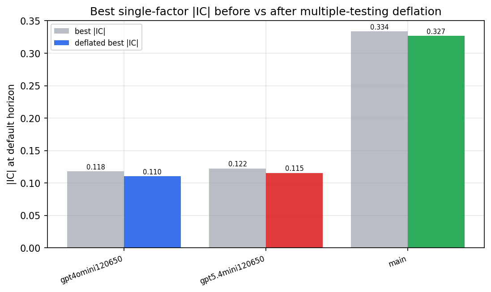

*Best |IC| before vs after multiple-testing deflation*

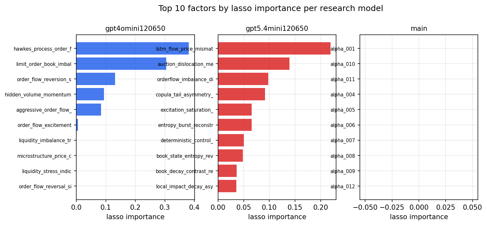

*Top factors by lasso importance per zoo*

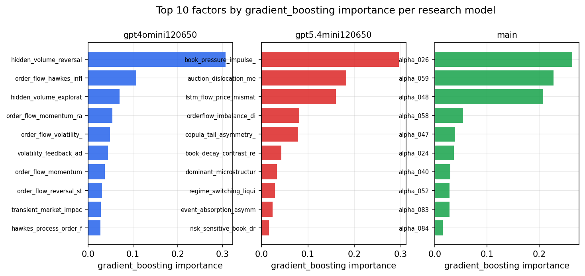

*Top factors by gradient_boosting importance per zoo*

## 4. ML-combined signal — per-underlying vectorised backtest

Each model combines a prerun's factors into ONE signal (fit `factors → forward return` on IS, predict per (bar, underlying)), then that combined signal is run through a simple vectorised backtest — `position(signal) × the underlying's own forward return` — on the held-out OOS tail (+ an equal-weight ensemble). No cross-sectional ranking.

> Config: position=**threshold** (t=1.0, z-score `expanding`), aggregation=**portfolio**, fit-standardise=**per_underlying**, horizon=6.

| prerun | model | n_factors_used | oos_ic | oos_sharpe | is_sharpe | oos_ann_return | oos_max_drawdown |
| --- | --- | --- | --- | --- | --- | --- | --- |
| gpt4omini120650 | linear_regression | 66 | 0.1525 | 18.6352 | 18.2142 | 1.5996 | -0.0067 |
| gpt4omini120650 | ridge | 66 | 0.1558 | 19.1461 | 18.7236 | 1.7322 | -0.0067 |
| gpt4omini120650 | lasso | 66 | 0.1517 | 23.0566 | 19.3044 | 1.7195 | -0.0053 |
| gpt4omini120650 | elastic_net | 66 | 0.1535 | 23.3901 | 19.6179 | 1.7483 | -0.0051 |
| gpt4omini120650 | random_forest | 66 | 0.1734 | 41.4204 | 21.6685 | 2.0904 | -0.0045 |
| gpt4omini120650 | gradient_boosting | 66 | 0.1537 | 2.9716 | 7.5948 | 0.1082 | -0.0082 |
| gpt4omini120650 | xgboost | 66 | 0.1811 | -2.8183 | 11.7391 | -0.0909 | -0.0137 |
| gpt4omini120650 | lightgbm | 66 | 0.1808 | 1.0701 | 12.6102 | 0.0571 | -0.0118 |
| gpt4omini120650 | ensemble | 66 | 0.1674 | 22.3708 | 20.0101 | 1.444 | -0.0052 |
| gpt5.4mini120650 | linear_regression | 69 | 0.1688 | 26.6085 | 18.8805 | 1.6046 | -0.0092 |
| gpt5.4mini120650 | ridge | 69 | 0.1686 | 26.5894 | 18.9669 | 1.6912 | -0.0092 |
| gpt5.4mini120650 | lasso | 69 | 0.1683 | 27.4532 | 19.6181 | 1.6297 | -0.0087 |
| gpt5.4mini120650 | elastic_net | 69 | 0.1683 | 27.4532 | 19.6181 | 1.6297 | -0.0087 |
| gpt5.4mini120650 | random_forest | 69 | 0.1789 | 31.9071 | 25.5235 | 2.3487 | -0.0077 |
| gpt5.4mini120650 | gradient_boosting | 69 | 0.1719 | -5.1816 | 17.1171 | -0.0591 | -0.0051 |
| gpt5.4mini120650 | xgboost | 69 | 0.1862 | 10.6856 | 17.0125 | 0.3977 | -0.0049 |
| gpt5.4mini120650 | lightgbm | 69 | 0.1845 | 5.849 | 15.8248 | 0.1917 | -0.0062 |
| gpt5.4mini120650 | ensemble | 69 | 0.1838 | 28.5684 | 22.2567 | 1.7611 | -0.0061 |
| main | linear_regression | 78 | 0.0137 | 1.7866 | 13.5313 | 0.0989 | -0.0119 |
| main | ridge | 78 | 0.0183 | 0.8081 | 14.2143 | 0.0413 | -0.0139 |
| main | lasso | 78 | 0.0266 | 7.3959 | 15.3734 | 0.2916 | -0.006 |
| main | elastic_net | 78 | 0.0266 | 7.7812 | 16.1062 | 0.3084 | -0.0063 |
| main | random_forest | 78 | 0.0286 | 10.3758 | 12.1606 | 0.5376 | -0.0062 |
| main | gradient_boosting | 78 | 0.0259 | 0.0513 | 10.6602 | 0.0023 | -0.0093 |
| main | xgboost | 78 | 0.0249 | 2.4359 | 12.2381 | 0.117 | -0.0107 |
| main | lightgbm | 78 | 0.0266 | 0.2734 | 13.7607 | 0.0163 | -0.0146 |
| main | ensemble | 78 | 0.0248 | 4.6546 | 12.1844 | 0.2447 | -0.0083 |

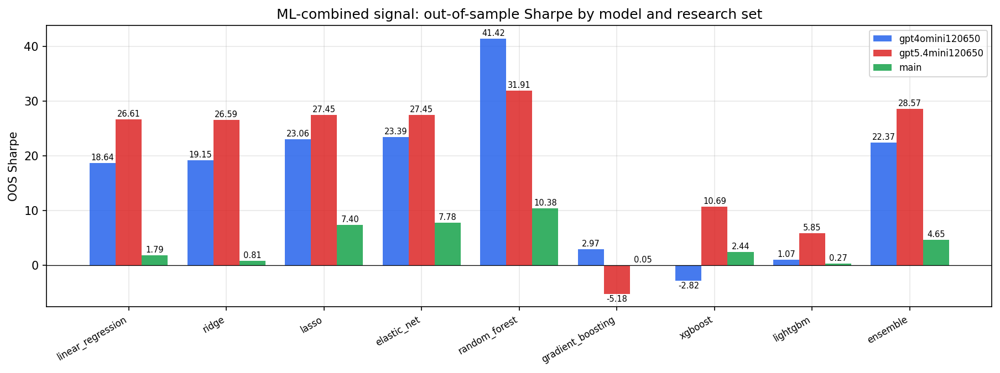

*ML-combined OOS Sharpe by model and research set*

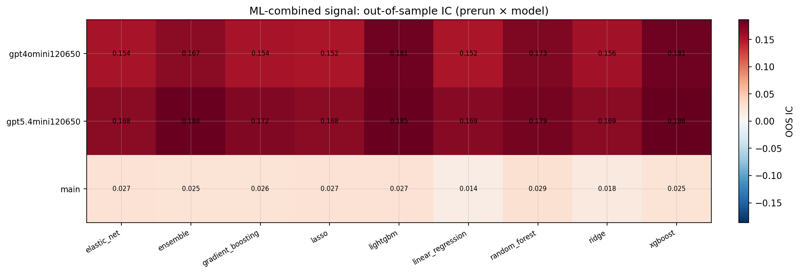

*ML-combined OOS IC (prerun × model)*

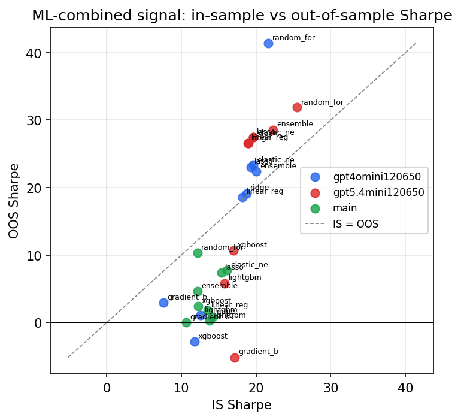

*IS vs OOS Sharpe (overfitting diagnostic)*

---
*Generated by `run_model_comparison.py`. Tables: `*.csv`; interactive: `comparison.ipynb`.*
