# Research-LLM factor comparison — `2025-10`

Comparing the **factor output of different research LLMs** on three axes (raw factor quality → factors as ML features → factors through the full agentic fund). The panel, IS/OOS split, horizon and model hyper-parameters are held identical across preruns — the *only* variable is the factor set.

## Preruns compared

| prerun | research_model | usable_factors | dropped_factors |
| --- | --- | --- | --- |
| gpt4omini120650 | gpt-4o-mini | 66 | 0 |
| gpt5.4mini120650 | gpt-5.4-mini | 69 | 0 |
| main | seed library | 78 | 10 |

> Dropped factors declare fields the current data doesn't have yet (e.g. fundamentals); they light up unchanged once that data is downloaded.

*Usable vs awaiting-data factors per research model*

## Key findings

- **Best ML-combined OOS Sharpe:** `gpt5.4mini120650` with `random_forest` (OOS Sharpe = 14.773).
- **Mean OOS Sharpe across models, by research set:** `gpt4omini120650` = 4.977, `gpt5.4mini120650` = 4.394, `main` = 1.914.
- **Highest mean single-factor |IC| (h=6):** `gpt4omini120650` (mean |IC| = 0.0302).
- **Most diverse zoo (highest effective/raw factor ratio):** `gpt5.4mini120650` (eff 56.3 of 69, ratio 0.82).
- **Best selection-deflated single-factor |IC|:** `gpt5.4mini120650` (deflated |IC| = 0.0965 from 31 factors tried).

## 1. Single-factor IC (raw factor quality)

Per-underlying time-series Spearman rank-IC of every researched factor, recomputed on the shared panel at horizons h=1, h=6, h=60. The per-underlying IC correlates each factor's value vector with the underlying's own forward-return vector (pooled across underlyings); the cross-sectional IC ranks across underlyings per timestamp.

| prerun | n_factors | mean_abs_ic_1 | mean_abs_ic_6 | mean_abs_ic_60 | mean_abs_icir_6 | best_factor_h6 | best_abs_ic_h6 |
| --- | --- | --- | --- | --- | --- | --- | --- |
| gpt4omini120650 | 66 | 0.0389 | 0.0302 | 0.0129 | 1.1769 | order_flow_imbalance_strength | 0.1021 |
| gpt5.4mini120650 | 69 | 0.0236 | 0.0204 | 0.0116 | 0.9828 | lstm_flow_price_mismatch | 0.1032 |
| main | 78 | 0.0327 | 0.0232 | 0.0152 | 0.9067 | alpha_054 | 0.0544 |

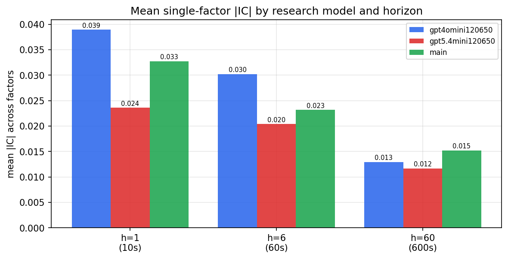

*Mean |IC| by research model and horizon*

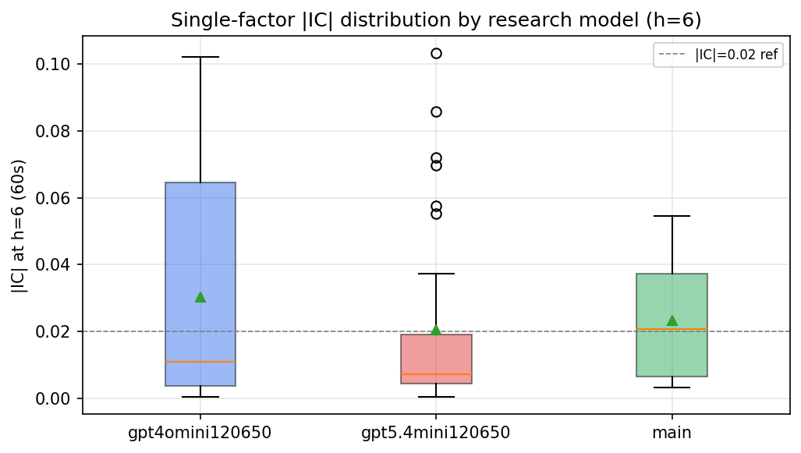

*Per-factor |IC| distribution by research model*

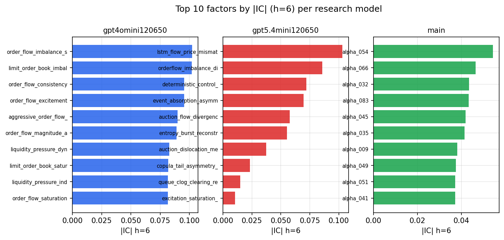

*Top factors by |IC| per research model*

## 2. Factor diversity & redundancy

Pairwise correlation of each zoo's *signals*. `eff_n_factors` is the effective number of independent factors (participation ratio of the correlation eigenvalues); `eff_ratio` and `redundancy` summarise how much unique information the zoo holds vs. how much is duplicated; `n_clusters` groups factors at |corr| ≥ 0.7.

| prerun | n_factors | eff_n_factors | eff_ratio | mean_abs_corr | n_clusters | redundancy |
| --- | --- | --- | --- | --- | --- | --- |
| gpt4omini120650 | 66 | 30.2959 | 0.459 | 0.0443 | 53 | 0.541 |
| gpt5.4mini120650 | 69 | 56.2547 | 0.8153 | 0.0101 | 66 | 0.1847 |
| main | 78 | 38.4516 | 0.493 | 0.0352 | 68 | 0.507 |

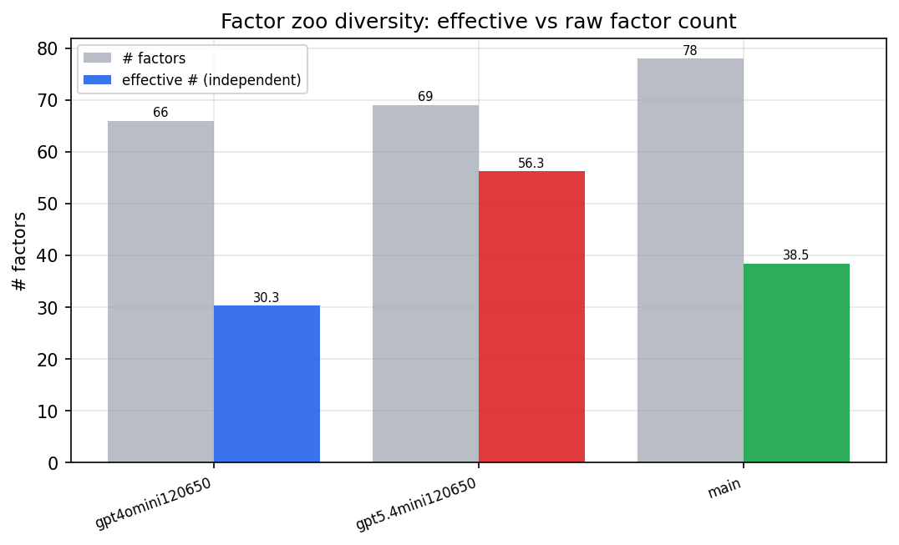

*Effective vs raw factor count per research model*

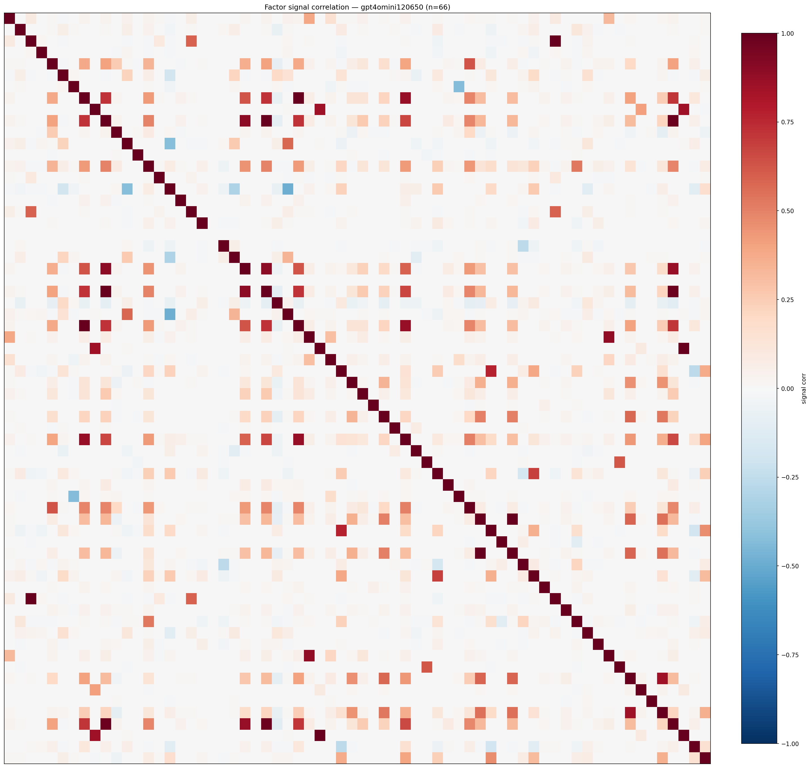

*Signal correlation matrix — gpt4omini120650*

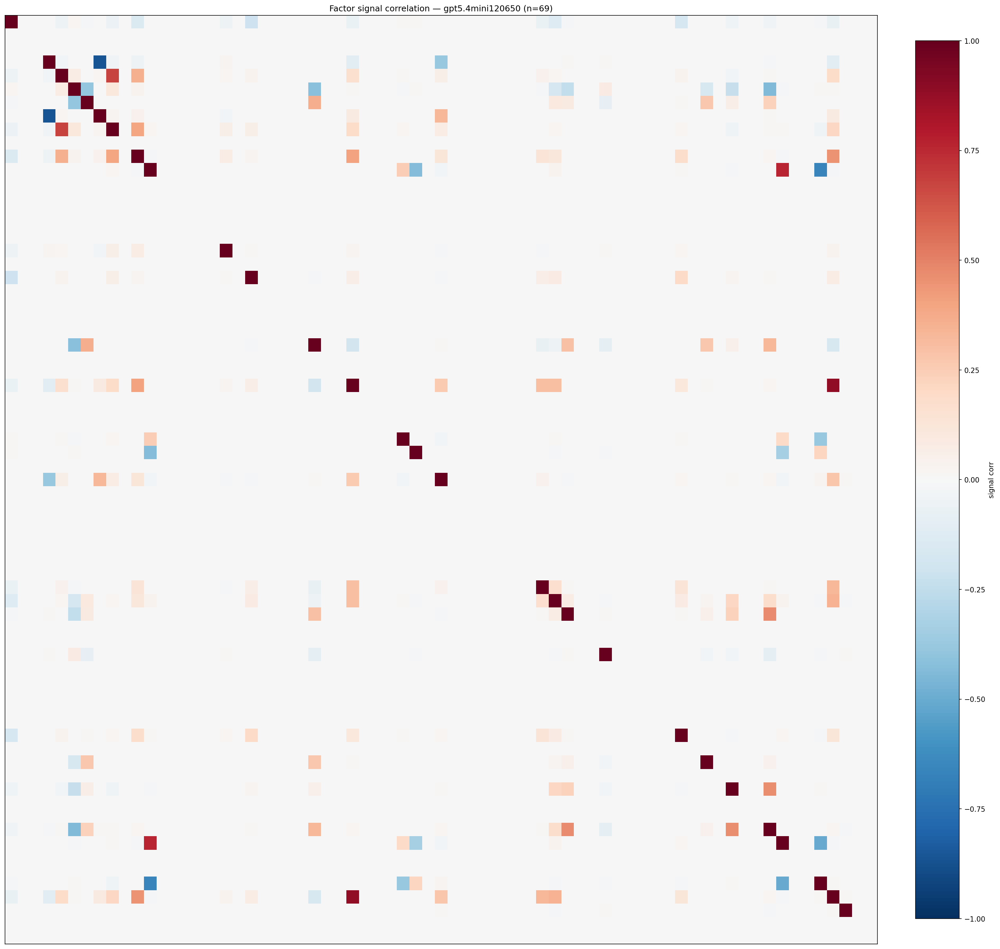

*Signal correlation matrix — gpt5.4mini120650*

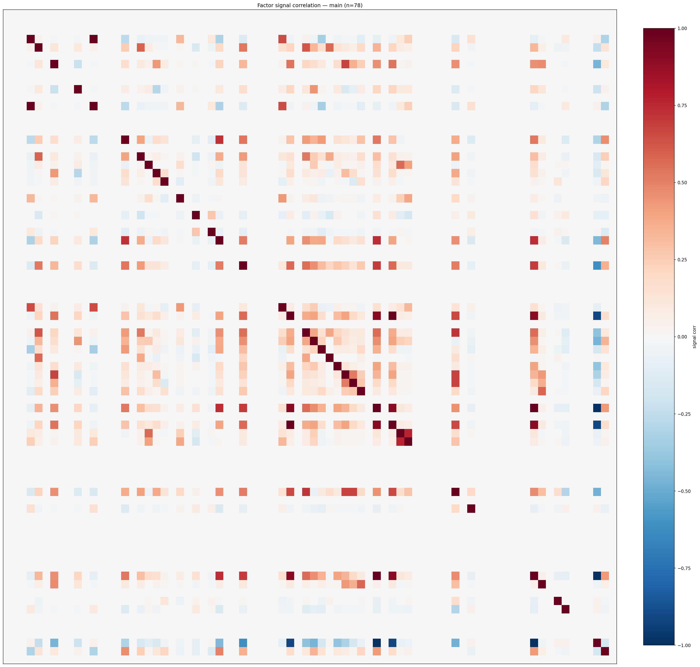

*Signal correlation matrix — main*

## 3. Deflation & model-based importance

`deflated_best_ic` haircuts each zoo's best |IC| for the number of factors tried (`ic_n_tested`) — a bigger zoo's best factor is more likely to be lucky. `lasso_n_nonzero` / `lasso_sparsity` show how many factors a sparse linear model actually keeps (model-view redundancy).

| prerun | best_ic | deflated_best_ic | deflated_best_t | ic_n_tested | ic_n_obs | lasso_n_nonzero | lasso_sparsity |
| --- | --- | --- | --- | --- | --- | --- | --- |
| gpt4omini120650 | 0.1021 | 0.0947 | 36.9315 | 64 | 152099 | 10 | 0.8485 |
| gpt5.4mini120650 | 0.1032 | 0.0965 | 37.6351 | 31 | 152099 | 11 | 0.8406 |
| main | 0.0544 | 0.0475 | 18.5386 | 37 | 152099 | 0 | 1.0 |

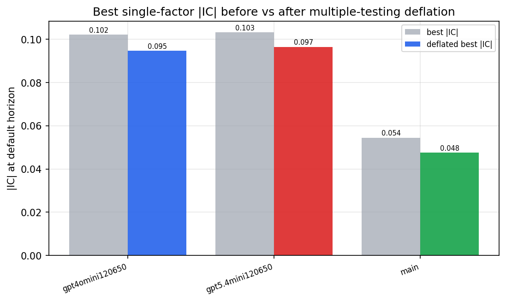

*Best |IC| before vs after multiple-testing deflation*

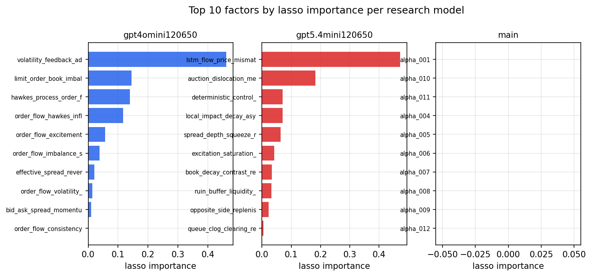

*Top factors by lasso importance per zoo*

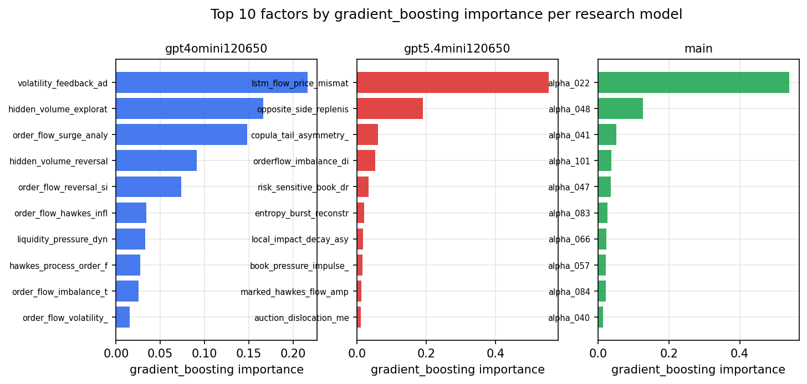

*Top factors by gradient_boosting importance per zoo*

## 4. ML-combined signal — per-underlying vectorised backtest

Each model combines a prerun's factors into ONE signal (fit `factors → forward return` on IS, predict per (bar, underlying)), then that combined signal is run through a simple vectorised backtest — `position(signal) × the underlying's own forward return` — on the held-out OOS tail (+ an equal-weight ensemble). No cross-sectional ranking.

> Config: position=**threshold** (t=1.0, z-score `expanding`), aggregation=**portfolio**, fit-standardise=**per_underlying**, horizon=6.

| prerun | model | n_factors_used | oos_ic | oos_sharpe | is_sharpe | oos_ann_return | oos_max_drawdown |
| --- | --- | --- | --- | --- | --- | --- | --- |
| gpt4omini120650 | linear_regression | 66 | 0.0676 | 5.0981 | 16.1505 | 0.7875 | -0.019 |
| gpt4omini120650 | ridge | 66 | 0.0693 | 5.8127 | 16.1551 | 0.8975 | -0.0179 |
| gpt4omini120650 | lasso | 66 | 0.0674 | 5.7229 | 16.1992 | 0.8906 | -0.0163 |
| gpt4omini120650 | elastic_net | 66 | 0.0689 | 5.6535 | 16.3179 | 0.8789 | -0.0189 |
| gpt4omini120650 | random_forest | 66 | 0.0851 | 9.9877 | 13.4042 | 0.8925 | -0.0144 |
| gpt4omini120650 | gradient_boosting | 66 | 0.0779 | 4.7687 | 7.9872 | 0.2845 | -0.0082 |
| gpt4omini120650 | xgboost | 66 | 0.1033 | 1.5071 | 9.5924 | 0.0993 | -0.0157 |
| gpt4omini120650 | lightgbm | 66 | 0.1114 | 1.3927 | 11.3909 | 0.0901 | -0.0132 |
| gpt4omini120650 | ensemble | 66 | 0.0801 | 4.8525 | 13.9159 | 0.6995 | -0.0239 |
| gpt5.4mini120650 | linear_regression | 69 | 0.0871 | 4.8235 | 18.2684 | 0.7253 | -0.0335 |
| gpt5.4mini120650 | ridge | 69 | 0.0873 | 4.8612 | 18.2764 | 0.731 | -0.0335 |
| gpt5.4mini120650 | lasso | 69 | 0.0884 | 5.1698 | 18.2704 | 0.7767 | -0.0337 |
| gpt5.4mini120650 | elastic_net | 69 | 0.0884 | 5.1698 | 18.2704 | 0.7767 | -0.0337 |
| gpt5.4mini120650 | random_forest | 69 | 0.0886 | 14.7732 | 22.6152 | 0.9626 | -0.0083 |
| gpt5.4mini120650 | gradient_boosting | 69 | 0.0878 | -2.0837 | 6.2309 | -0.0453 | -0.0088 |
| gpt5.4mini120650 | xgboost | 69 | 0.0955 | 0.0765 | 9.6903 | 0.0043 | -0.0144 |
| gpt5.4mini120650 | lightgbm | 69 | 0.0975 | 1.814 | 11.6536 | 0.2011 | -0.0208 |
| gpt5.4mini120650 | ensemble | 69 | 0.0953 | 4.9453 | 17.92 | 0.7241 | -0.0339 |
| main | linear_regression | 78 | 0.0027 | 0.3318 | 10.4964 | 0.0182 | -0.0248 |
| main | ridge | 78 | 0.0066 | -2.2871 | 11.8484 | -0.1199 | -0.0273 |
| main | lasso | 78 | 0.032 | -1.5889 | -1.7108 | -0.0454 | -0.0115 |
| main | elastic_net | 78 | 0.032 | -1.4932 | -1.4012 | -0.0424 | -0.0111 |
| main | random_forest | 78 | 0.0237 | 6.5883 | 13.0225 | 0.3849 | -0.0082 |
| main | gradient_boosting | 78 | 0.0248 | 5.6246 | 11.1912 | 0.2608 | -0.0074 |
| main | xgboost | 78 | 0.0201 | 2.3611 | 12.0725 | 0.1413 | -0.0109 |
| main | lightgbm | 78 | 0.0231 | 3.0732 | 13.6377 | 0.1347 | -0.0177 |
| main | ensemble | 78 | 0.0156 | 4.6174 | 11.4729 | 0.2489 | -0.0086 |

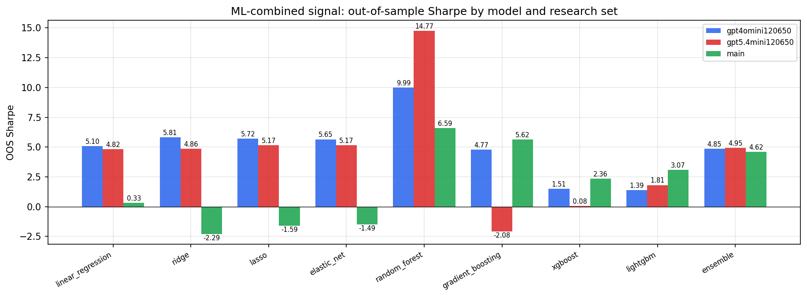

*ML-combined OOS Sharpe by model and research set*

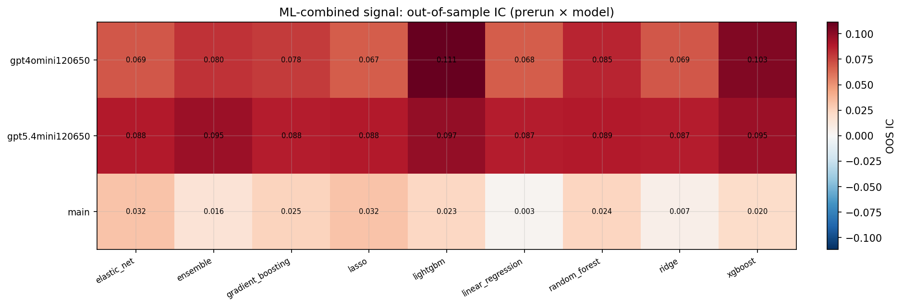

*ML-combined OOS IC (prerun × model)*

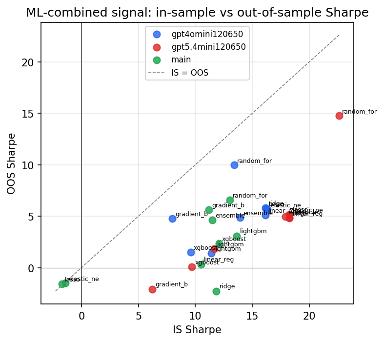

*IS vs OOS Sharpe (overfitting diagnostic)*

---
*Generated by `run_model_comparison.py`. Tables: `*.csv`; interactive: `comparison.ipynb`.*
