# Research-LLM factor comparison — `2025-11`

Comparing the **factor output of different research LLMs** on three axes (raw factor quality → factors as ML features → factors through the full agentic fund). The panel, IS/OOS split, horizon and model hyper-parameters are held identical across preruns — the *only* variable is the factor set.

## Preruns compared

| prerun | research_model | usable_factors | dropped_factors |
| --- | --- | --- | --- |
| gpt4omini120650 | gpt-4o-mini | 66 | 0 |
| gpt5.4mini120650 | gpt-5.4-mini | 69 | 0 |
| main | seed library | 78 | 10 |

> Dropped factors declare fields the current data doesn't have yet (e.g. fundamentals); they light up unchanged once that data is downloaded.

*Usable vs awaiting-data factors per research model*

## Key findings

- **Best ML-combined OOS Sharpe:** `gpt5.4mini120650` with `random_forest` (OOS Sharpe = 20.634).
- **Mean OOS Sharpe across models, by research set:** `gpt5.4mini120650` = 7.566, `gpt4omini120650` = 7.472, `main` = 3.122.
- **Highest mean single-factor |IC| (h=6):** `gpt4omini120650` (mean |IC| = 0.0248).
- **Most diverse zoo (highest effective/raw factor ratio):** `gpt5.4mini120650` (eff 52.1 of 69, ratio 0.76).
- **Best selection-deflated single-factor |IC|:** `gpt4omini120650` (deflated |IC| = 0.0812 from 64 factors tried).

## 1. Single-factor IC (raw factor quality)

Per-underlying time-series Spearman rank-IC of every researched factor, recomputed on the shared panel at horizons h=1, h=6, h=60. The per-underlying IC correlates each factor's value vector with the underlying's own forward-return vector (pooled across underlyings); the cross-sectional IC ranks across underlyings per timestamp.

| prerun | n_factors | mean_abs_ic_1 | mean_abs_ic_6 | mean_abs_ic_60 | mean_abs_icir_6 | best_factor_h6 | best_abs_ic_h6 |
| --- | --- | --- | --- | --- | --- | --- | --- |
| gpt4omini120650 | 66 | 0.0369 | 0.0248 | 0.0107 | 0.8896 | order_flow_imbalance_strength | 0.0887 |
| gpt5.4mini120650 | 69 | 0.0219 | 0.0174 | 0.0097 | 0.7874 | lstm_flow_price_mismatch | 0.0793 |
| main | 78 | 0.032 | 0.0228 | 0.017 | 0.8942 | alpha_066 | 0.0592 |

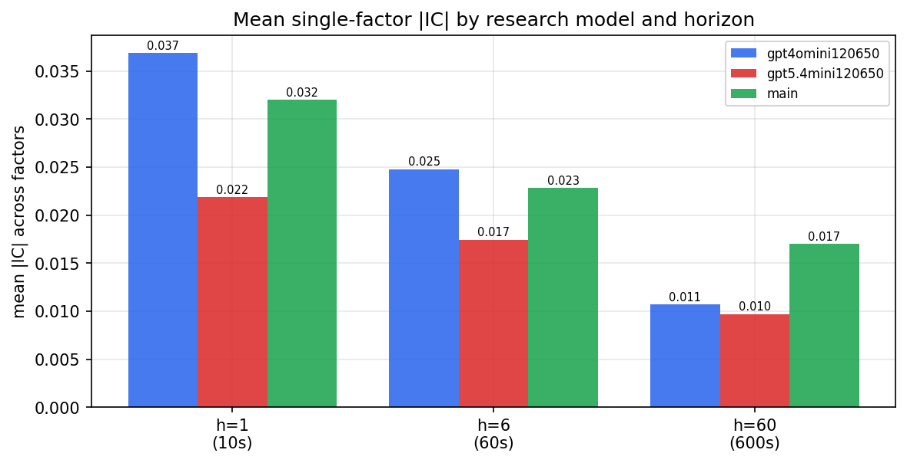

*Mean |IC| by research model and horizon*

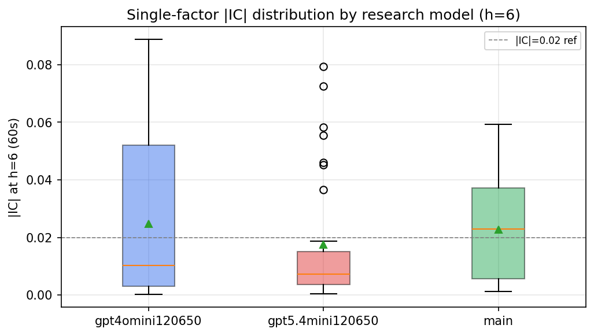

*Per-factor |IC| distribution by research model*

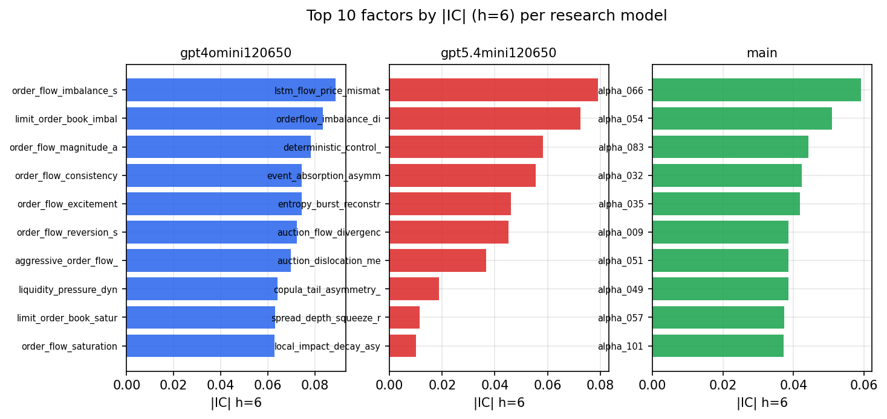

*Top factors by |IC| per research model*

## 2. Factor diversity & redundancy

Pairwise correlation of each zoo's *signals*. `eff_n_factors` is the effective number of independent factors (participation ratio of the correlation eigenvalues); `eff_ratio` and `redundancy` summarise how much unique information the zoo holds vs. how much is duplicated; `n_clusters` groups factors at |corr| ≥ 0.7.

| prerun | n_factors | eff_n_factors | eff_ratio | mean_abs_corr | n_clusters | redundancy |
| --- | --- | --- | --- | --- | --- | --- |
| gpt4omini120650 | 66 | 29.7545 | 0.4508 | 0.0454 | 53 | 0.5492 |
| gpt5.4mini120650 | 69 | 52.1462 | 0.7557 | 0.0127 | 62 | 0.2443 |
| main | 78 | 38.675 | 0.4958 | 0.0347 | 71 | 0.5042 |

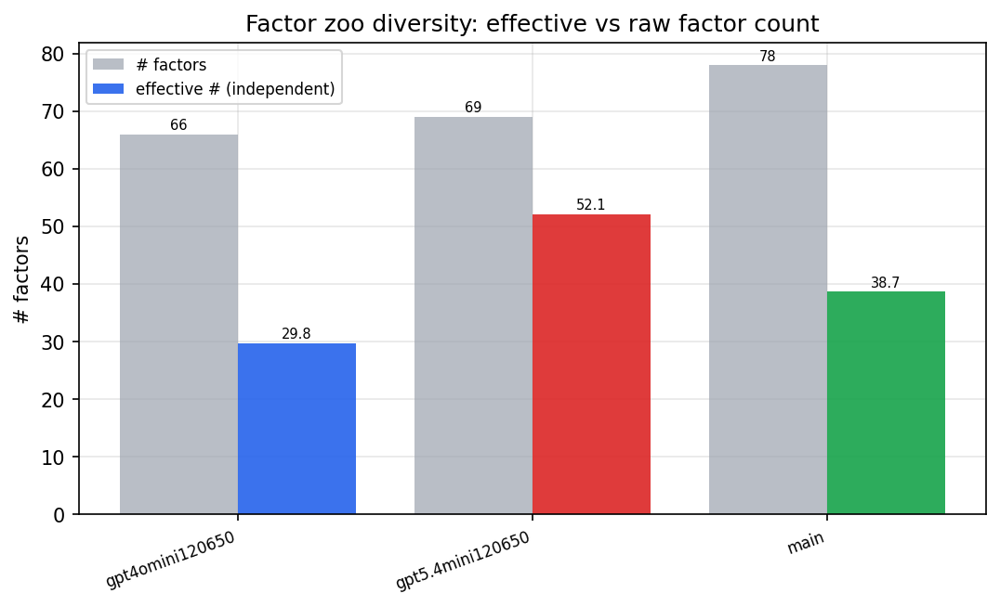

*Effective vs raw factor count per research model*

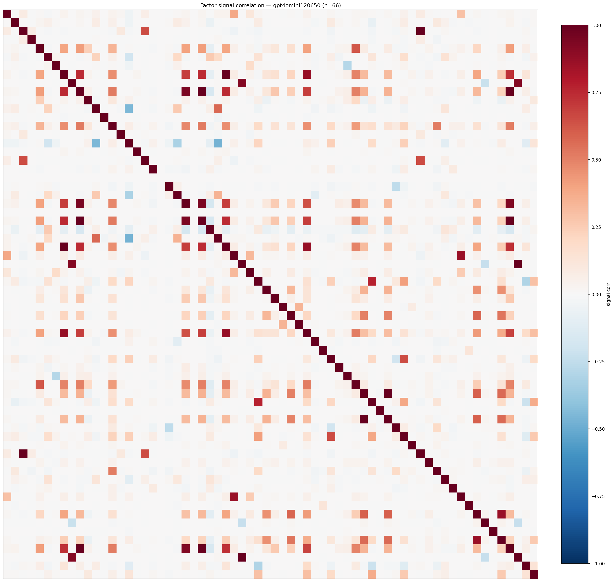

*Signal correlation matrix — gpt4omini120650*

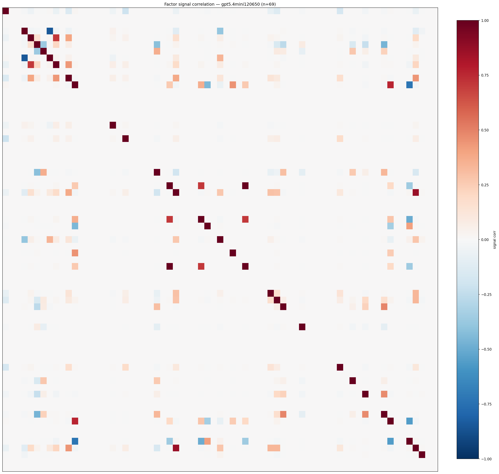

*Signal correlation matrix — gpt5.4mini120650*

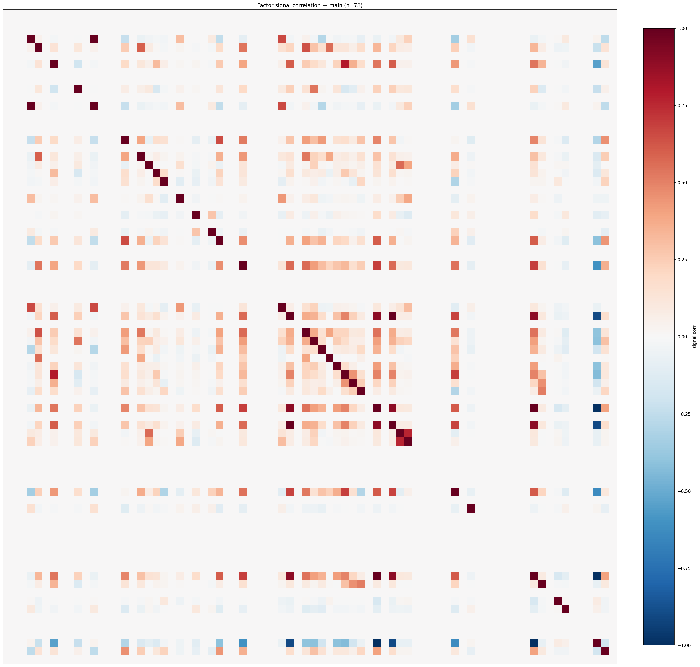

*Signal correlation matrix — main*

## 3. Deflation & model-based importance

`deflated_best_ic` haircuts each zoo's best |IC| for the number of factors tried (`ic_n_tested`) — a bigger zoo's best factor is more likely to be lucky. `lasso_n_nonzero` / `lasso_sparsity` show how many factors a sparse linear model actually keeps (model-view redundancy).

| prerun | best_ic | deflated_best_ic | deflated_best_t | ic_n_tested | ic_n_obs | lasso_n_nonzero | lasso_sparsity |
| --- | --- | --- | --- | --- | --- | --- | --- |
| gpt4omini120650 | 0.0887 | 0.0812 | 31.0471 | 64 | 146339 | 0 | 1.0 |
| gpt5.4mini120650 | 0.0793 | 0.0724 | 27.6992 | 31 | 146339 | 12 | 0.8261 |
| main | 0.0592 | 0.0522 | 19.9585 | 37 | 146339 | 0 | 1.0 |

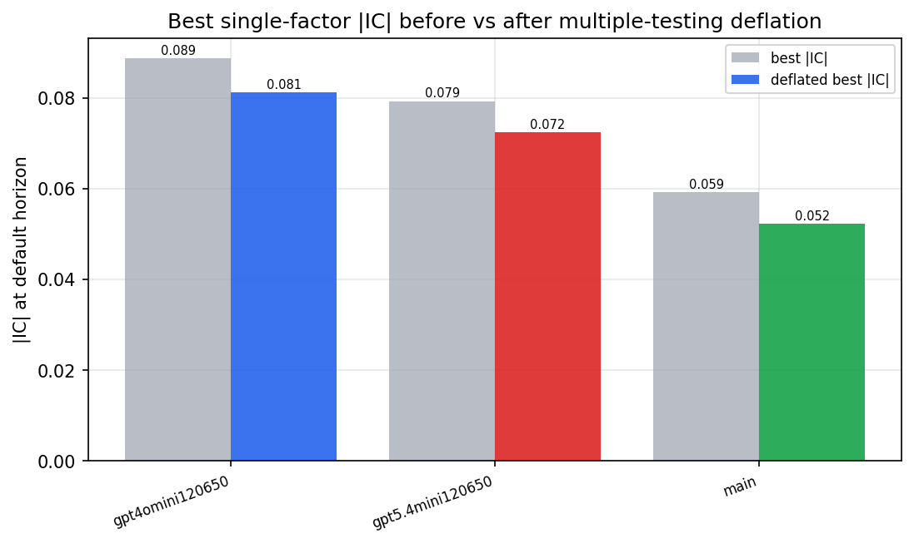

*Best |IC| before vs after multiple-testing deflation*

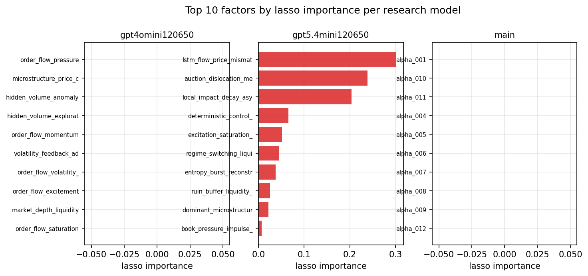

*Top factors by lasso importance per zoo*

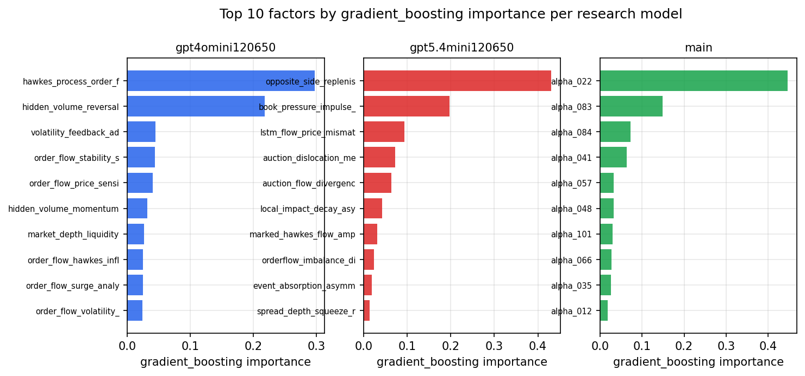

*Top factors by gradient_boosting importance per zoo*

## 4. ML-combined signal — per-underlying vectorised backtest

Each model combines a prerun's factors into ONE signal (fit `factors → forward return` on IS, predict per (bar, underlying)), then that combined signal is run through a simple vectorised backtest — `position(signal) × the underlying's own forward return` — on the held-out OOS tail (+ an equal-weight ensemble). No cross-sectional ranking.

> Config: position=**threshold** (t=1.0, z-score `expanding`), aggregation=**portfolio**, fit-standardise=**per_underlying**, horizon=6.

| prerun | model | n_factors_used | oos_ic | oos_sharpe | is_sharpe | oos_ann_return | oos_max_drawdown |
| --- | --- | --- | --- | --- | --- | --- | --- |
| gpt4omini120650 | linear_regression | 66 | 0.0745 | 4.4693 | 13.747 | 0.5461 | -0.0335 |
| gpt4omini120650 | ridge | 66 | 0.0807 | 12.3978 | 14.05 | 0.8394 | -0.0125 |
| gpt4omini120650 | lasso | 66 | 0.0871 | 17.2491 | 14.9528 | 0.9119 | -0.007 |
| gpt4omini120650 | elastic_net | 66 | 0.0873 | 17.6395 | 15.4852 | 0.9401 | -0.0074 |
| gpt4omini120650 | random_forest | 66 | 0.0844 | 8.3744 | 19.3425 | 0.4616 | -0.0112 |
| gpt4omini120650 | gradient_boosting | 66 | 0.0759 | 3.392 | 8.5241 | 0.0647 | -0.0024 |
| gpt4omini120650 | xgboost | 66 | 0.0953 | -3.9481 | 11.7942 | -0.1309 | -0.013 |
| gpt4omini120650 | lightgbm | 66 | 0.1008 | -3.0872 | 15.6173 | -0.1008 | -0.01 |
| gpt4omini120650 | ensemble | 66 | 0.0884 | 10.7598 | 18.724 | 0.6784 | -0.0098 |
| gpt5.4mini120650 | linear_regression | 69 | 0.0931 | 9.6392 | 11.8715 | 1.0786 | -0.0287 |
| gpt5.4mini120650 | ridge | 69 | 0.0926 | 8.9602 | 11.7936 | 1.021 | -0.0297 |
| gpt5.4mini120650 | lasso | 69 | 0.0893 | 8.9193 | 13.3018 | 1.0061 | -0.0292 |
| gpt5.4mini120650 | elastic_net | 69 | 0.0893 | 8.9193 | 13.3018 | 1.0061 | -0.0292 |
| gpt5.4mini120650 | random_forest | 69 | 0.1049 | 20.634 | 23.499 | 1.1519 | -0.0094 |
| gpt5.4mini120650 | gradient_boosting | 69 | 0.0981 | -0.9736 | 11.1659 | -0.0181 | -0.0071 |
| gpt5.4mini120650 | xgboost | 69 | 0.1099 | 6.3096 | 20.7249 | 0.1225 | -0.0042 |
| gpt5.4mini120650 | lightgbm | 69 | 0.1132 | -3.3675 | 18.0993 | -0.0989 | -0.0145 |
| gpt5.4mini120650 | ensemble | 69 | 0.1052 | 9.0496 | 23.5635 | 1.0089 | -0.0275 |
| main | linear_regression | 78 | 0.043 | 4.0562 | 8.4129 | 0.4634 | -0.0255 |
| main | ridge | 78 | 0.0422 | 0.8244 | 6.3844 | 0.0886 | -0.026 |
| main | lasso | 78 | nan | nan | nan | nan | nan |
| main | elastic_net | 78 | nan | nan | nan | nan | nan |
| main | random_forest | 78 | 0.0436 | 4.9718 | 9.5527 | 0.1556 | -0.0066 |
| main | gradient_boosting | 78 | 0.0453 | 2.7126 | 9.6464 | 0.2778 | -0.0124 |
| main | xgboost | 78 | 0.0381 | 1.6284 | 11.7808 | 0.1663 | -0.0118 |
| main | lightgbm | 78 | 0.0344 | 2.4989 | 16.9238 | 0.2573 | -0.0112 |
| main | ensemble | 78 | 0.0362 | 5.1648 | 9.245 | 0.0769 | -0.0021 |

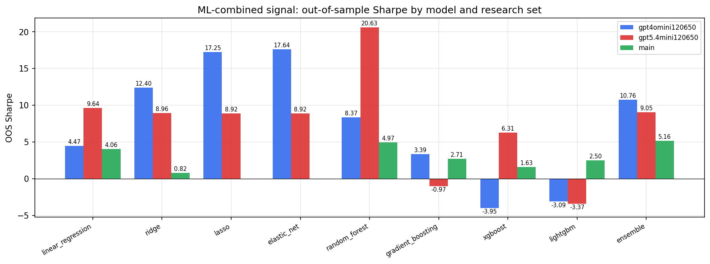

*ML-combined OOS Sharpe by model and research set*

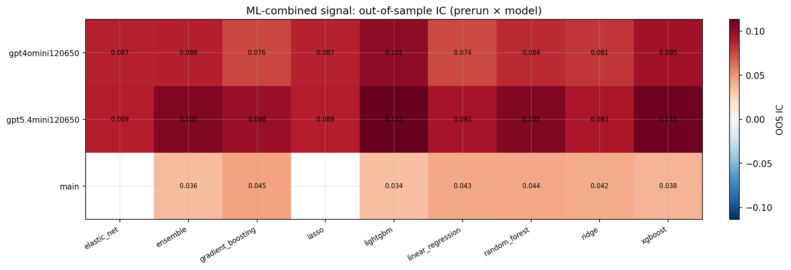

*ML-combined OOS IC (prerun × model)*

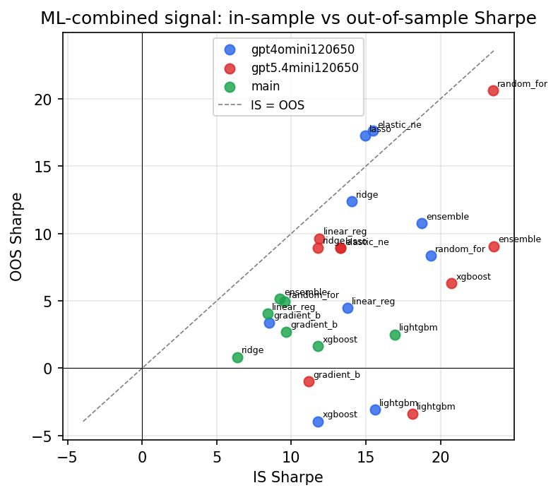

*IS vs OOS Sharpe (overfitting diagnostic)*

---
*Generated by `run_model_comparison.py`. Tables: `*.csv`; interactive: `comparison.ipynb`.*
