# Research-LLM factor comparison — `2025-12`

Comparing the **factor output of different research LLMs** on three axes (raw factor quality → factors as ML features → factors through the full agentic fund). The panel, IS/OOS split, horizon and model hyper-parameters are held identical across preruns — the *only* variable is the factor set.

## Preruns compared

| prerun | research_model | usable_factors | dropped_factors |
| --- | --- | --- | --- |
| gpt4omini120650 | gpt-4o-mini | 66 | 0 |
| gpt5.4mini120650 | gpt-5.4-mini | 69 | 0 |
| main | seed library | 78 | 10 |

> Dropped factors declare fields the current data doesn't have yet (e.g. fundamentals); they light up unchanged once that data is downloaded.

*Usable vs awaiting-data factors per research model*

## Key findings

- **Best ML-combined OOS Sharpe:** `gpt5.4mini120650` with `ensemble` (OOS Sharpe = 33.735).
- **Mean OOS Sharpe across models, by research set:** `gpt5.4mini120650` = 15.096, `gpt4omini120650` = 14.227, `main` = 2.681.
- **Highest mean single-factor |IC| (h=6):** `main` (mean |IC| = 0.0256).
- **Most diverse zoo (highest effective/raw factor ratio):** `gpt5.4mini120650` (eff 52.3 of 69, ratio 0.76).
- **Best selection-deflated single-factor |IC|:** `gpt4omini120650` (deflated |IC| = 0.0817 from 64 factors tried).

## 1. Single-factor IC (raw factor quality)

Per-underlying time-series Spearman rank-IC of every researched factor, recomputed on the shared panel at horizons h=1, h=6, h=60. The per-underlying IC correlates each factor's value vector with the underlying's own forward-return vector (pooled across underlyings); the cross-sectional IC ranks across underlyings per timestamp.

| prerun | n_factors | mean_abs_ic_1 | mean_abs_ic_6 | mean_abs_ic_60 | mean_abs_icir_6 | best_factor_h6 | best_abs_ic_h6 |
| --- | --- | --- | --- | --- | --- | --- | --- |
| gpt4omini120650 | 66 | 0.0369 | 0.0255 | 0.0118 | 0.9665 | order_flow_imbalance_strength | 0.0893 |
| gpt5.4mini120650 | 69 | 0.0223 | 0.0187 | 0.0094 | 0.8017 | lstm_flow_price_mismatch | 0.0754 |
| main | 78 | 0.0317 | 0.0256 | 0.0171 | 1.0733 | alpha_066 | 0.0595 |

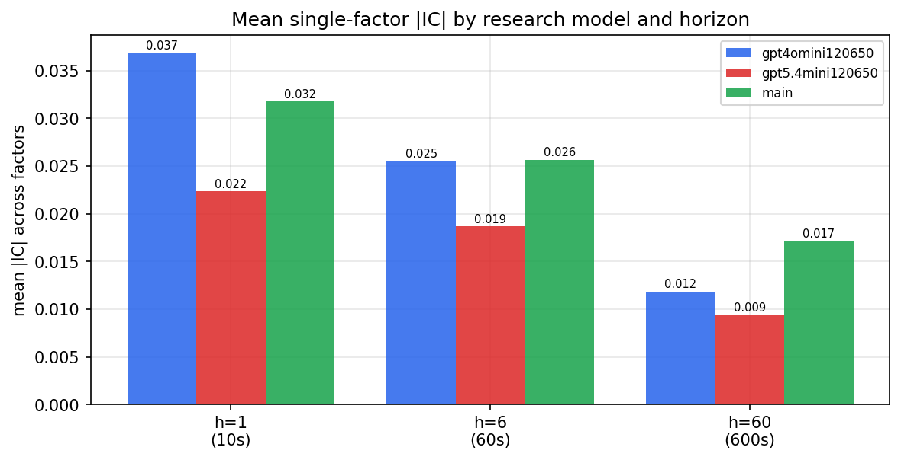

*Mean |IC| by research model and horizon*

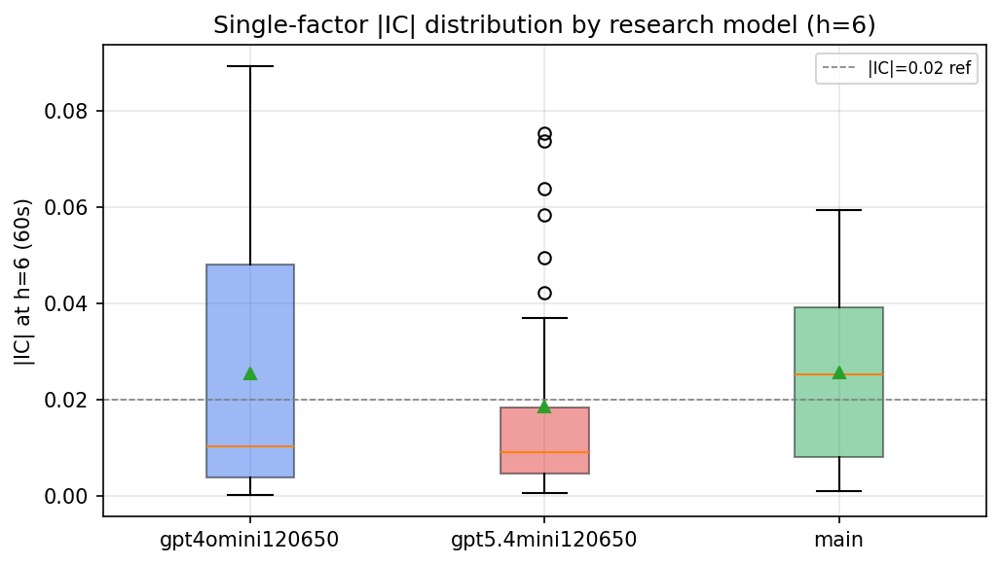

*Per-factor |IC| distribution by research model*

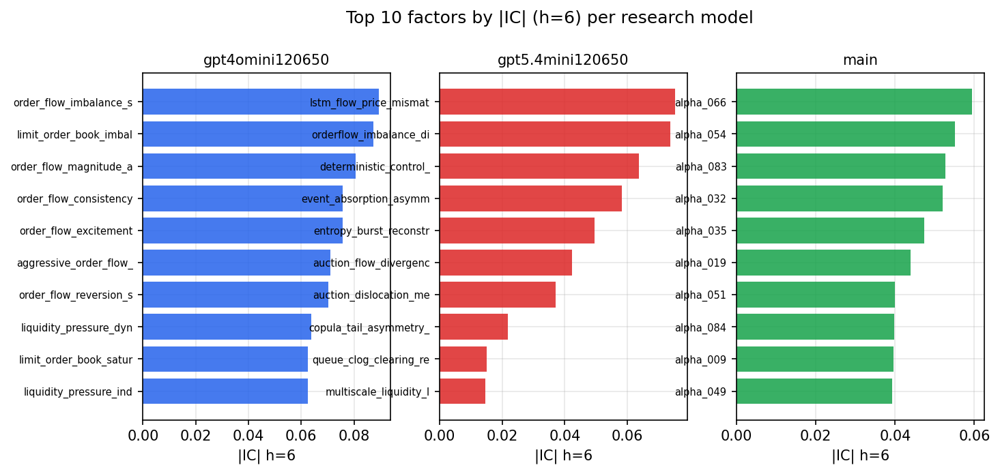

*Top factors by |IC| per research model*

## 2. Factor diversity & redundancy

Pairwise correlation of each zoo's *signals*. `eff_n_factors` is the effective number of independent factors (participation ratio of the correlation eigenvalues); `eff_ratio` and `redundancy` summarise how much unique information the zoo holds vs. how much is duplicated; `n_clusters` groups factors at |corr| ≥ 0.7.

| prerun | n_factors | eff_n_factors | eff_ratio | mean_abs_corr | n_clusters | redundancy |
| --- | --- | --- | --- | --- | --- | --- |
| gpt4omini120650 | 66 | 28.5712 | 0.4329 | 0.0474 | 50 | 0.5671 |
| gpt5.4mini120650 | 69 | 52.2555 | 0.7573 | 0.0127 | 63 | 0.2427 |
| main | 78 | 39.4638 | 0.5059 | 0.0336 | 71 | 0.4941 |

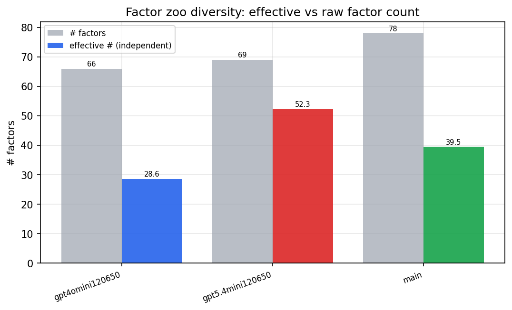

*Effective vs raw factor count per research model*

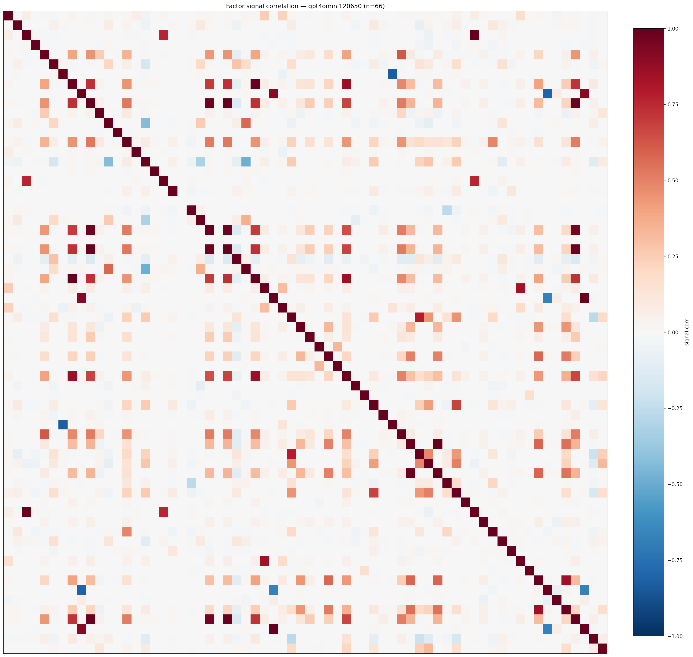

*Signal correlation matrix — gpt4omini120650*

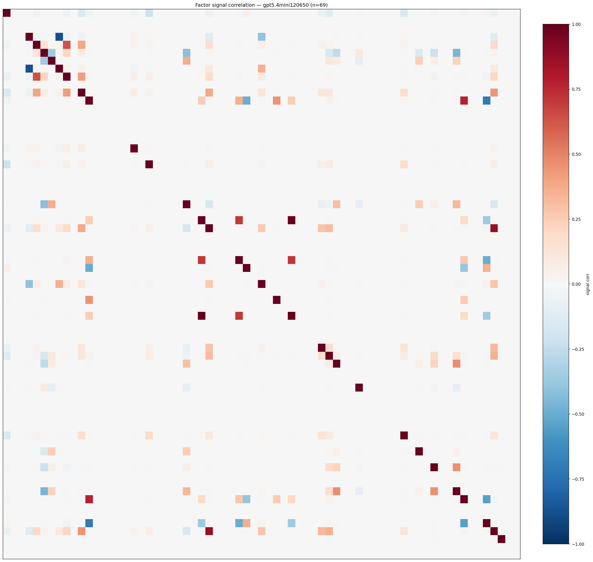

*Signal correlation matrix — gpt5.4mini120650*

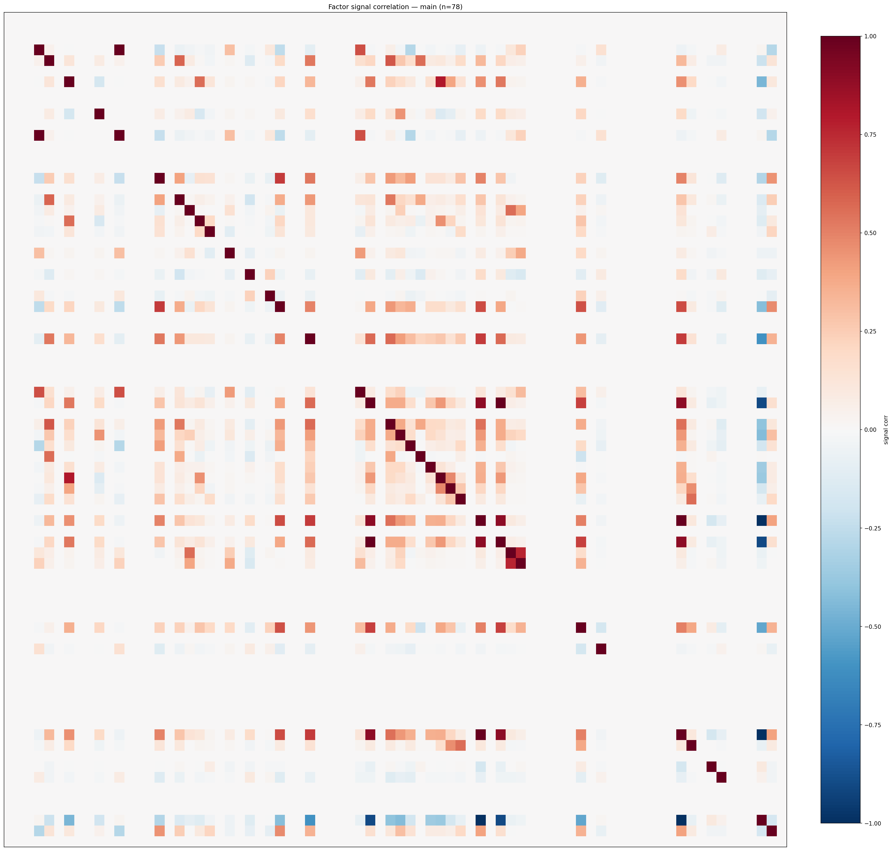

*Signal correlation matrix — main*

## 3. Deflation & model-based importance

`deflated_best_ic` haircuts each zoo's best |IC| for the number of factors tried (`ic_n_tested`) — a bigger zoo's best factor is more likely to be lucky. `lasso_n_nonzero` / `lasso_sparsity` show how many factors a sparse linear model actually keeps (model-view redundancy).

| prerun | best_ic | deflated_best_ic | deflated_best_t | ic_n_tested | ic_n_obs | lasso_n_nonzero | lasso_sparsity |
| --- | --- | --- | --- | --- | --- | --- | --- |
| gpt4omini120650 | 0.0893 | 0.0817 | 31.406 | 64 | 147599 | 6 | 0.9091 |
| gpt5.4mini120650 | 0.0754 | 0.0686 | 26.3376 | 31 | 147599 | 15 | 0.7826 |
| main | 0.0595 | 0.0525 | 20.1581 | 37 | 147599 | 18 | 0.7692 |

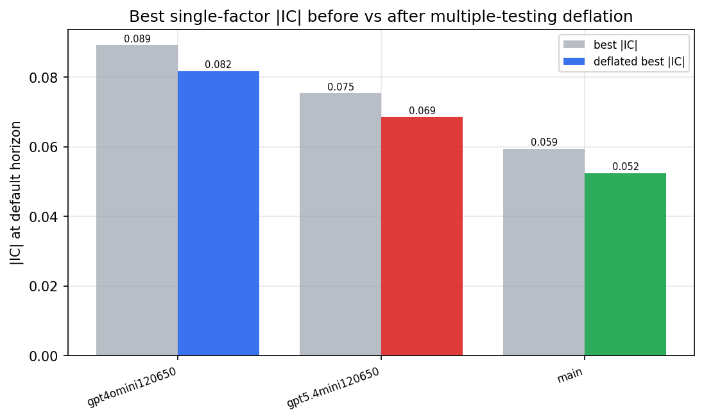

*Best |IC| before vs after multiple-testing deflation*

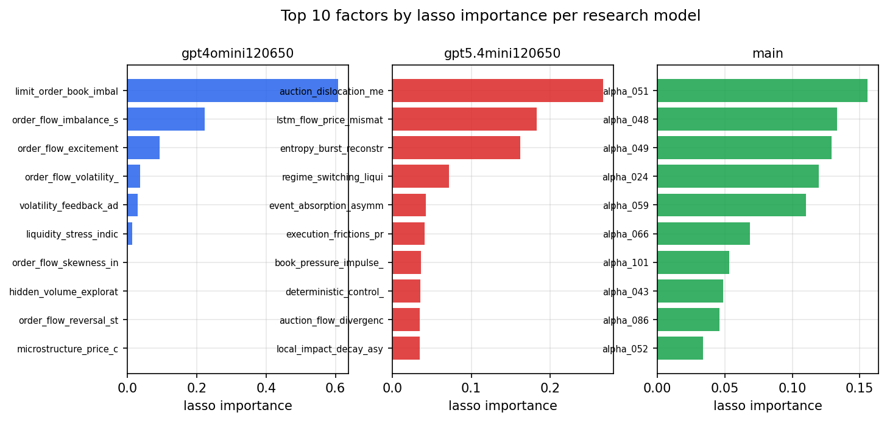

*Top factors by lasso importance per zoo*

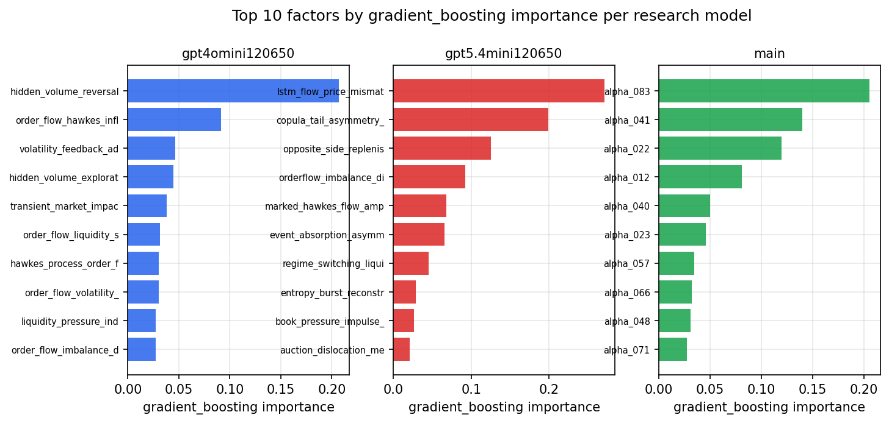

*Top factors by gradient_boosting importance per zoo*

## 4. ML-combined signal — per-underlying vectorised backtest

Each model combines a prerun's factors into ONE signal (fit `factors → forward return` on IS, predict per (bar, underlying)), then that combined signal is run through a simple vectorised backtest — `position(signal) × the underlying's own forward return` — on the held-out OOS tail (+ an equal-weight ensemble). No cross-sectional ranking.

> Config: position=**threshold** (t=1.0, z-score `expanding`), aggregation=**portfolio**, fit-standardise=**per_underlying**, horizon=6.

| prerun | model | n_factors_used | oos_ic | oos_sharpe | is_sharpe | oos_ann_return | oos_max_drawdown |
| --- | --- | --- | --- | --- | --- | --- | --- |
| gpt4omini120650 | linear_regression | 66 | 0.1446 | 15.2649 | 16.6398 | 0.9951 | -0.0134 |
| gpt4omini120650 | ridge | 66 | 0.1517 | 18.2803 | 17.8564 | 1.0337 | -0.0131 |
| gpt4omini120650 | lasso | 66 | 0.1313 | 24.9586 | 13.6811 | 1.0281 | -0.0066 |
| gpt4omini120650 | elastic_net | 66 | 0.1314 | 24.9383 | 14.3081 | 1.023 | -0.0066 |
| gpt4omini120650 | random_forest | 66 | 0.1415 | 17.0654 | 16.5549 | 1.41 | -0.0079 |
| gpt4omini120650 | gradient_boosting | 66 | 0.1326 | 2.6355 | 8.8784 | 0.1405 | -0.0087 |
| gpt4omini120650 | xgboost | 66 | 0.1568 | 2.2874 | 12.3236 | 0.1499 | -0.0094 |
| gpt4omini120650 | lightgbm | 66 | 0.158 | 3.5473 | 16.6911 | 0.244 | -0.0076 |
| gpt4omini120650 | ensemble | 66 | 0.1495 | 19.062 | 18.7887 | 1.4439 | -0.0053 |
| gpt5.4mini120650 | linear_regression | 69 | 0.1423 | 16.8444 | 11.7253 | 1.2305 | -0.0134 |
| gpt5.4mini120650 | ridge | 69 | 0.147 | 16.8329 | 11.0462 | 1.231 | -0.0136 |
| gpt5.4mini120650 | lasso | 69 | 0.1554 | 19.1242 | 13.8071 | 1.5242 | -0.0134 |
| gpt5.4mini120650 | elastic_net | 69 | 0.155 | 18.9735 | 10.6276 | 1.5143 | -0.0134 |
| gpt5.4mini120650 | random_forest | 69 | 0.173 | 31.8803 | 23.2195 | 2.1018 | -0.0047 |
| gpt5.4mini120650 | gradient_boosting | 69 | 0.1727 | -2.999 | 8.6636 | -0.0643 | -0.0089 |
| gpt5.4mini120650 | xgboost | 69 | 0.1748 | 0.2269 | 13.6876 | 0.007 | -0.0066 |
| gpt5.4mini120650 | lightgbm | 69 | 0.1748 | 1.2455 | 16.2982 | 0.0373 | -0.0044 |
| gpt5.4mini120650 | ensemble | 69 | 0.1758 | 33.7347 | 21.9058 | 1.5321 | -0.0019 |
| main | linear_regression | 78 | 0.0314 | 3.8122 | 14.4314 | 0.2275 | -0.0101 |
| main | ridge | 78 | 0.0327 | 4.4883 | 14.5303 | 0.2666 | -0.0098 |
| main | lasso | 78 | 0.0352 | 2.3979 | 11.6562 | 0.0983 | -0.0077 |
| main | elastic_net | 78 | 0.0358 | 0.2551 | 11.2112 | 0.0128 | -0.0122 |
| main | random_forest | 78 | 0.038 | 2.3832 | 12.8401 | 0.078 | -0.0079 |
| main | gradient_boosting | 78 | 0.0363 | 2.3947 | 10.7769 | 0.0238 | -0.0025 |
| main | xgboost | 78 | 0.0325 | 4.0164 | 12.9416 | 0.0421 | -0.0029 |
| main | lightgbm | 78 | 0.0327 | 1.2763 | 15.695 | 0.0305 | -0.0052 |
| main | ensemble | 78 | 0.0356 | 3.1089 | 14.713 | 0.1316 | -0.0074 |

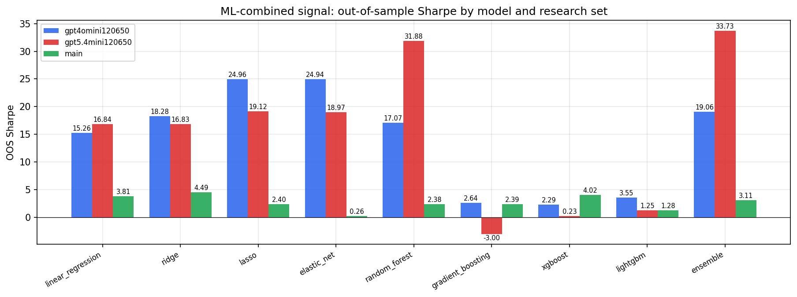

*ML-combined OOS Sharpe by model and research set*

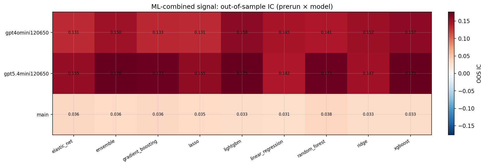

*ML-combined OOS IC (prerun × model)*

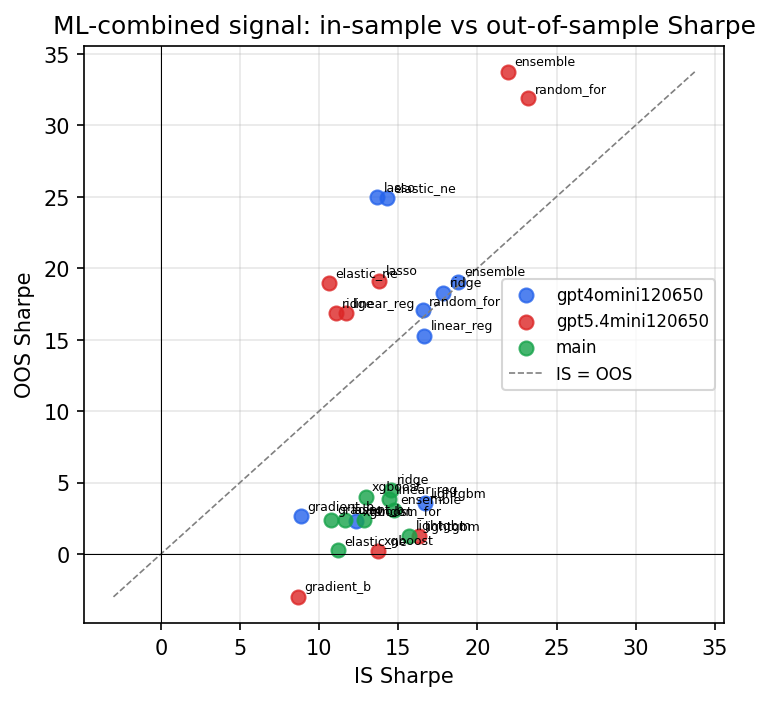

*IS vs OOS Sharpe (overfitting diagnostic)*

---
*Generated by `run_model_comparison.py`. Tables: `*.csv`; interactive: `comparison.ipynb`.*
