# Research-LLM factor comparison — `2026-01`

Comparing the **factor output of different research LLMs** on three axes (raw factor quality → factors as ML features → factors through the full agentic fund). The panel, IS/OOS split, horizon and model hyper-parameters are held identical across preruns — the *only* variable is the factor set.

## Preruns compared

| prerun | research_model | usable_factors | dropped_factors |
| --- | --- | --- | --- |
| gpt4omini120650 | gpt-4o-mini | 66 | 0 |
| gpt5.4mini120650 | gpt-5.4-mini | 69 | 0 |
| main | seed library | 78 | 10 |

> Dropped factors declare fields the current data doesn't have yet (e.g. fundamentals); they light up unchanged once that data is downloaded.

*Usable vs awaiting-data factors per research model*

## Key findings

- **Best ML-combined OOS Sharpe:** `gpt5.4mini120650` with `random_forest` (OOS Sharpe = 27.392).
- **Mean OOS Sharpe across models, by research set:** `gpt5.4mini120650` = 19.712, `gpt4omini120650` = 8.154, `main` = 6.240.
- **Highest mean single-factor |IC| (h=6):** `main` (mean |IC| = 0.0291).
- **Most diverse zoo (highest effective/raw factor ratio):** `gpt5.4mini120650` (eff 52.3 of 69, ratio 0.76).
- **Best selection-deflated single-factor |IC|:** `gpt4omini120650` (deflated |IC| = 0.0865 from 64 factors tried).

## 1. Single-factor IC (raw factor quality)

Per-underlying time-series Spearman rank-IC of every researched factor, recomputed on the shared panel at horizons h=1, h=6, h=60. The per-underlying IC correlates each factor's value vector with the underlying's own forward-return vector (pooled across underlyings); the cross-sectional IC ranks across underlyings per timestamp.

| prerun | n_factors | mean_abs_ic_1 | mean_abs_ic_6 | mean_abs_ic_60 | mean_abs_icir_6 | best_factor_h6 | best_abs_ic_h6 |
| --- | --- | --- | --- | --- | --- | --- | --- |
| gpt4omini120650 | 66 | 0.0381 | 0.0269 | 0.0123 | 1.0759 | limit_order_book_imbalance_surge | 0.0942 |
| gpt5.4mini120650 | 69 | 0.0214 | 0.0182 | 0.0114 | 0.9445 | orderflow_imbalance_divergence | 0.0834 |
| main | 78 | 0.0311 | 0.0291 | 0.0094 | 1.4219 | alpha_066 | 0.0775 |

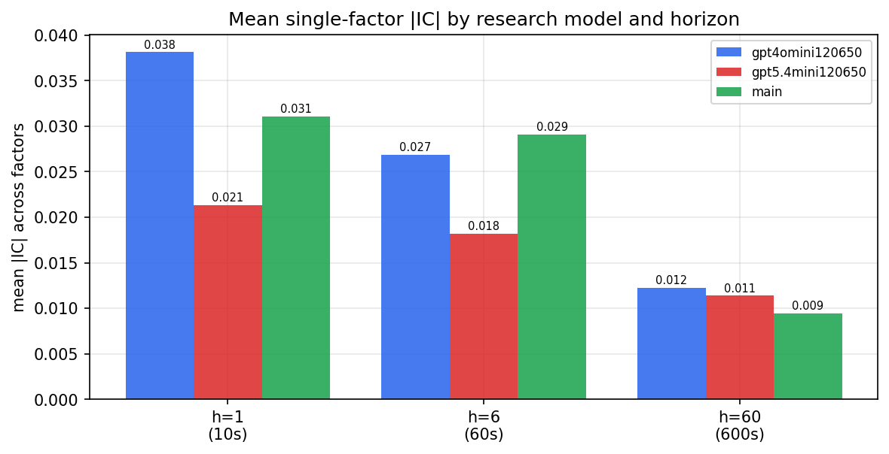

*Mean |IC| by research model and horizon*

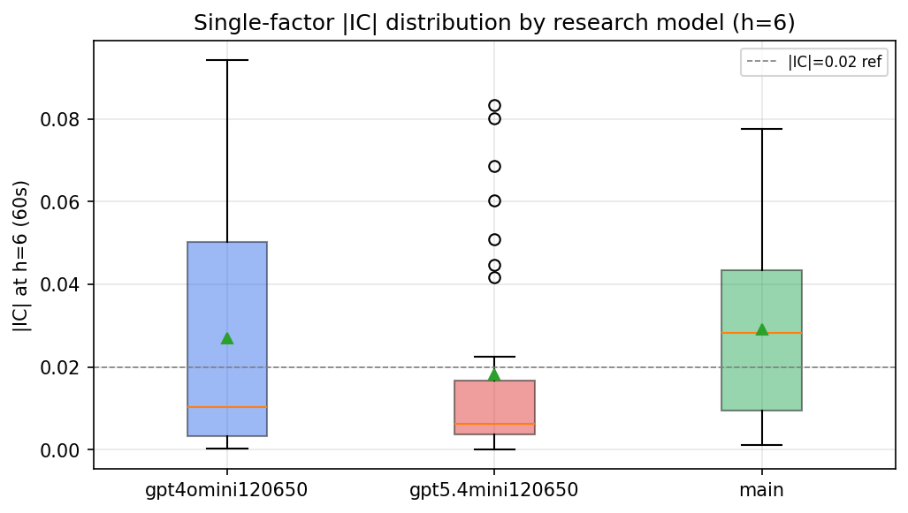

*Per-factor |IC| distribution by research model*

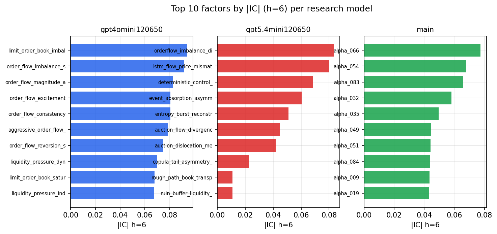

*Top factors by |IC| per research model*

## 2. Factor diversity & redundancy

Pairwise correlation of each zoo's *signals*. `eff_n_factors` is the effective number of independent factors (participation ratio of the correlation eigenvalues); `eff_ratio` and `redundancy` summarise how much unique information the zoo holds vs. how much is duplicated; `n_clusters` groups factors at |corr| ≥ 0.7.

| prerun | n_factors | eff_n_factors | eff_ratio | mean_abs_corr | n_clusters | redundancy |
| --- | --- | --- | --- | --- | --- | --- |
| gpt4omini120650 | 66 | 28.7514 | 0.4356 | 0.0459 | 51 | 0.5644 |
| gpt5.4mini120650 | 69 | 52.2672 | 0.7575 | 0.0125 | 63 | 0.2425 |
| main | 78 | 38.3796 | 0.492 | 0.0357 | 70 | 0.508 |

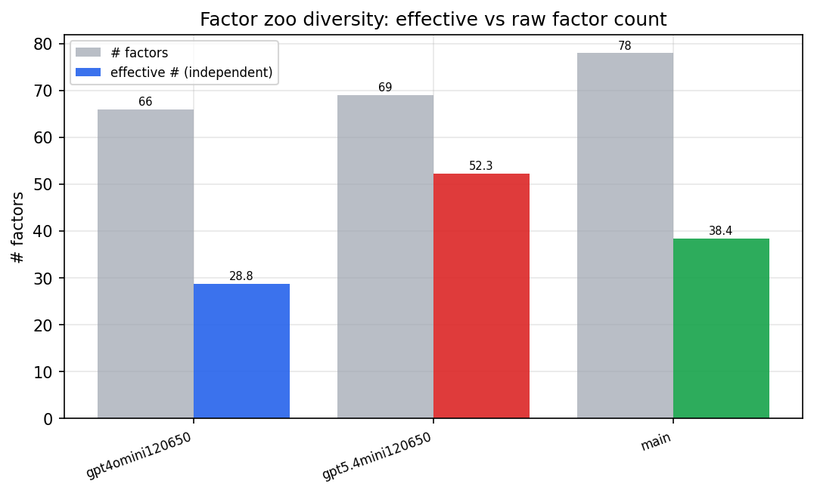

*Effective vs raw factor count per research model*

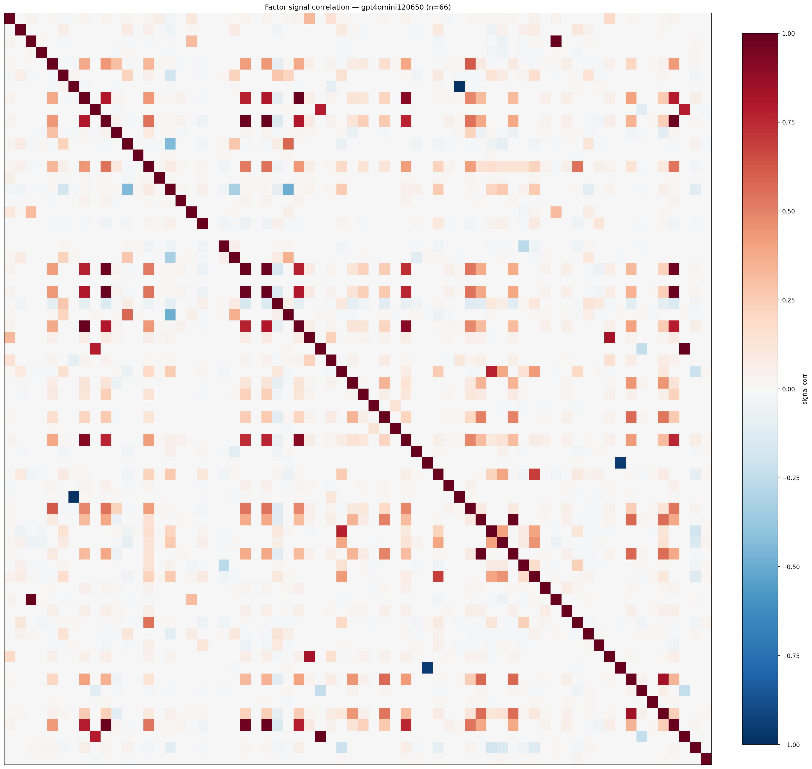

*Signal correlation matrix — gpt4omini120650*

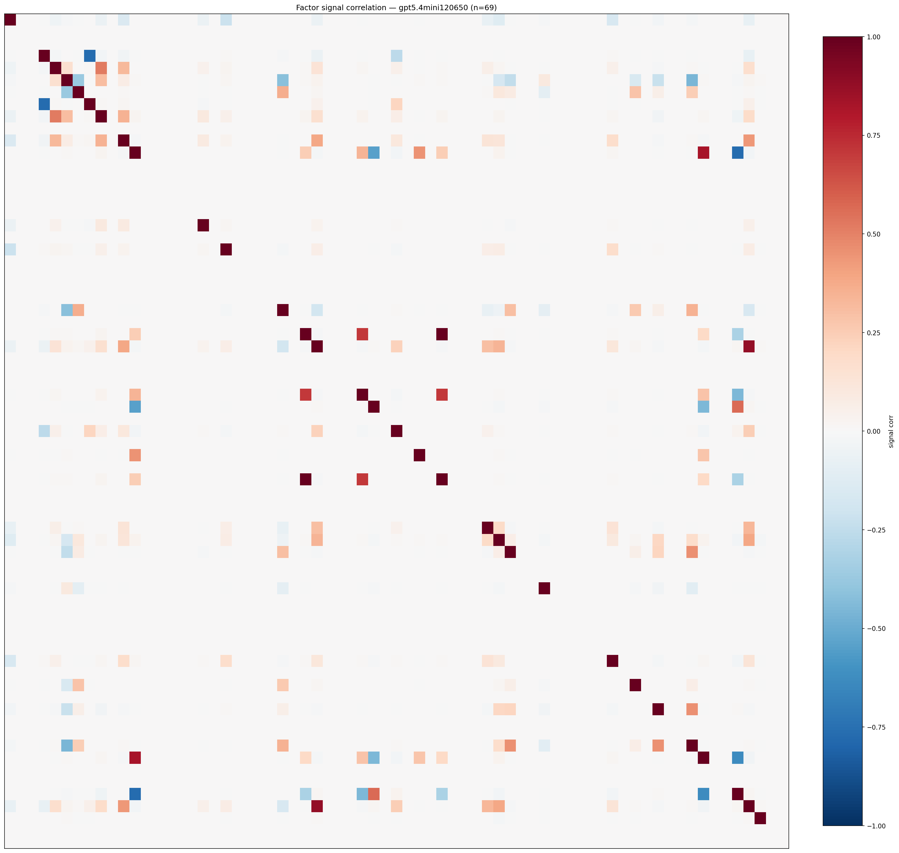

*Signal correlation matrix — gpt5.4mini120650*

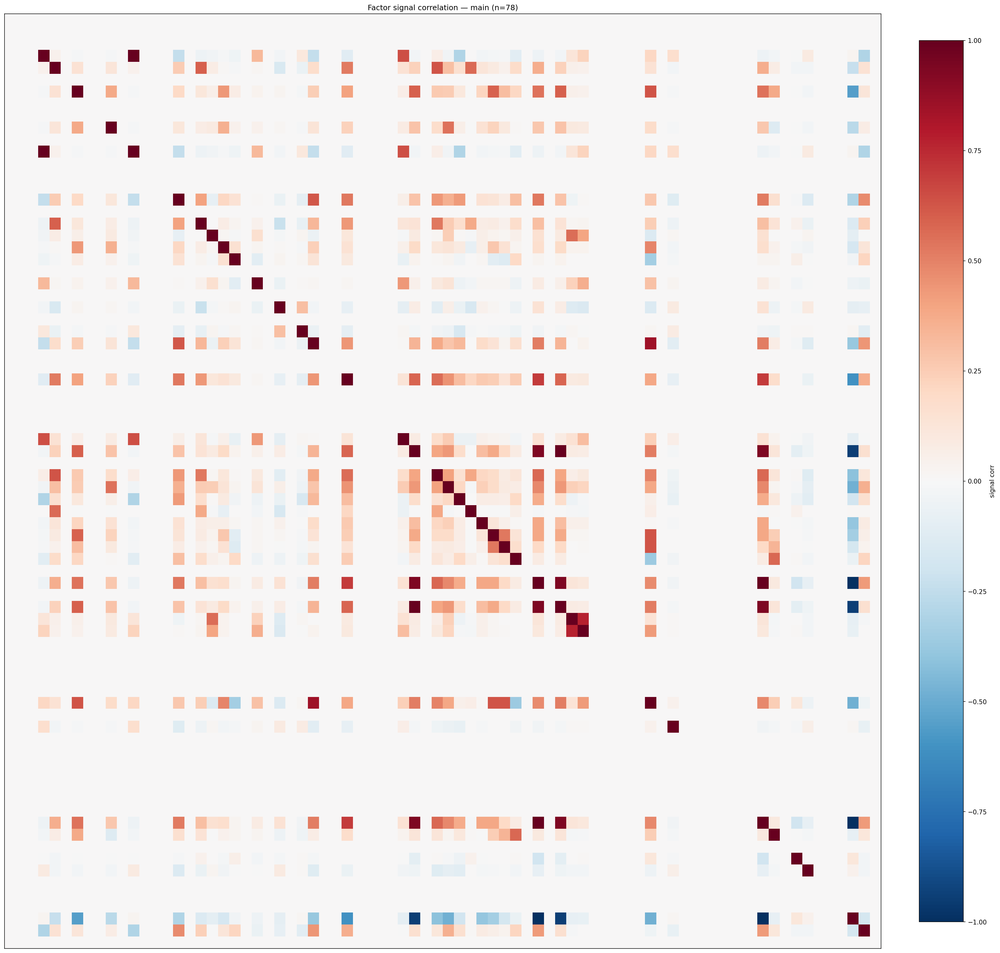

*Signal correlation matrix — main*

## 3. Deflation & model-based importance

`deflated_best_ic` haircuts each zoo's best |IC| for the number of factors tried (`ic_n_tested`) — a bigger zoo's best factor is more likely to be lucky. `lasso_n_nonzero` / `lasso_sparsity` show how many factors a sparse linear model actually keeps (model-view redundancy).

| prerun | best_ic | deflated_best_ic | deflated_best_t | ic_n_tested | ic_n_obs | lasso_n_nonzero | lasso_sparsity |
| --- | --- | --- | --- | --- | --- | --- | --- |
| gpt4omini120650 | 0.0942 | 0.0865 | 32.4178 | 64 | 140579 | 2 | 0.9697 |
| gpt5.4mini120650 | 0.0834 | 0.0764 | 28.6432 | 31 | 140579 | 9 | 0.8696 |
| main | 0.0775 | 0.0703 | 26.3637 | 37 | 140579 | 5 | 0.9359 |

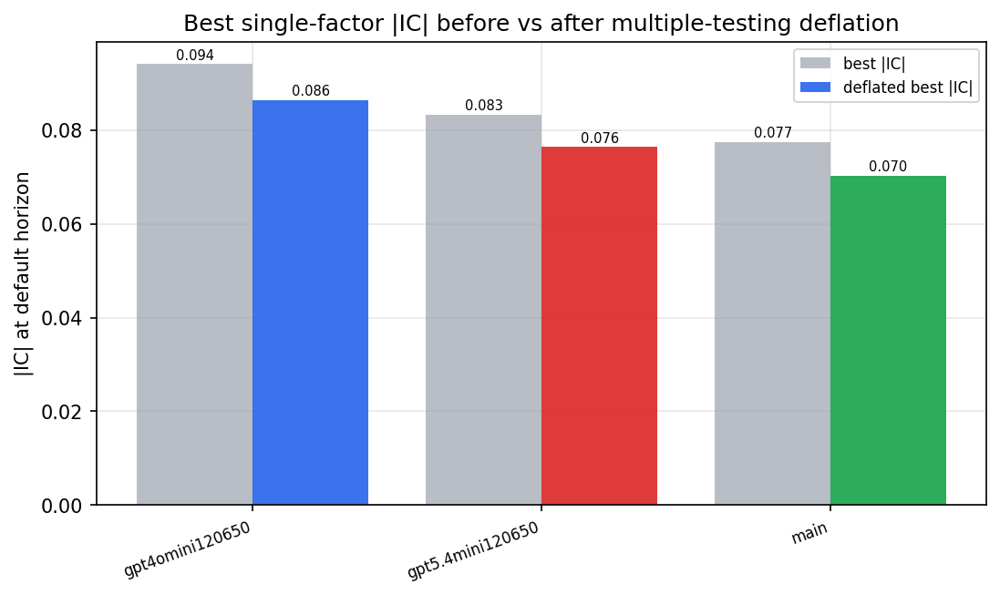

*Best |IC| before vs after multiple-testing deflation*

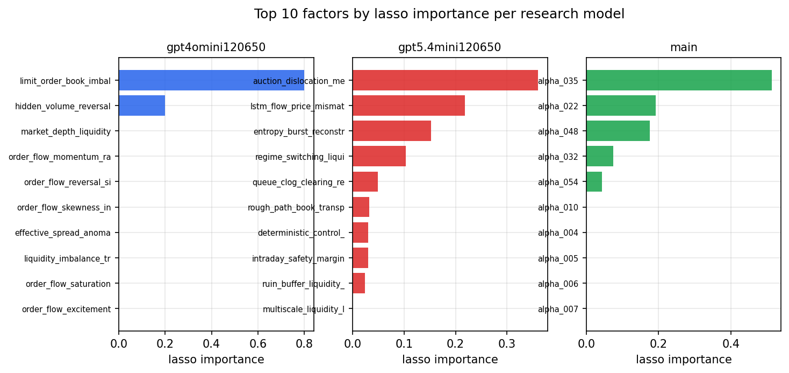

*Top factors by lasso importance per zoo*

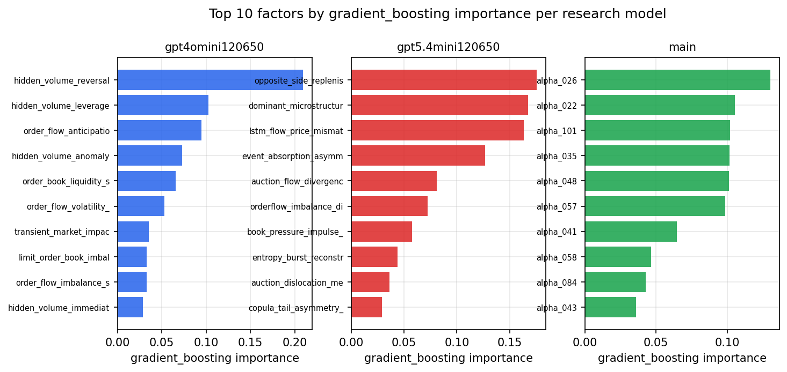

*Top factors by gradient_boosting importance per zoo*

## 4. ML-combined signal — per-underlying vectorised backtest

Each model combines a prerun's factors into ONE signal (fit `factors → forward return` on IS, predict per (bar, underlying)), then that combined signal is run through a simple vectorised backtest — `position(signal) × the underlying's own forward return` — on the held-out OOS tail (+ an equal-weight ensemble). No cross-sectional ranking.

> Config: position=**threshold** (t=1.0, z-score `expanding`), aggregation=**portfolio**, fit-standardise=**per_underlying**, horizon=6.

| prerun | model | n_factors_used | oos_ic | oos_sharpe | is_sharpe | oos_ann_return | oos_max_drawdown |
| --- | --- | --- | --- | --- | --- | --- | --- |
| gpt4omini120650 | linear_regression | 66 | 0.1013 | 10.9933 | 20.5191 | 0.4649 | -0.0077 |
| gpt4omini120650 | ridge | 66 | 0.0965 | 11.1958 | 20.9029 | 0.4663 | -0.0079 |
| gpt4omini120650 | lasso | 66 | 0.1152 | 18.7053 | 19.5159 | 0.9861 | -0.0055 |
| gpt4omini120650 | elastic_net | 66 | 0.1153 | 19.2805 | 18.8778 | 1.019 | -0.0055 |
| gpt4omini120650 | random_forest | 66 | 0.1004 | 2.7584 | 16.7727 | 0.2566 | -0.0122 |
| gpt4omini120650 | gradient_boosting | 66 | 0.0814 | 4.5944 | 9.704 | 0.2529 | -0.0044 |
| gpt4omini120650 | xgboost | 66 | 0.1017 | -1.7173 | 12.4607 | -0.0888 | -0.0193 |
| gpt4omini120650 | lightgbm | 66 | 0.1094 | -0.3318 | 14.4904 | -0.0202 | -0.0183 |
| gpt4omini120650 | ensemble | 66 | 0.107 | 7.9072 | 19.2357 | 0.593 | -0.0105 |
| gpt5.4mini120650 | linear_regression | 69 | 0.1177 | 23.5734 | 26.087 | 1.3187 | -0.0083 |
| gpt5.4mini120650 | ridge | 69 | 0.1175 | 23.878 | 26.3863 | 1.3379 | -0.0082 |
| gpt5.4mini120650 | lasso | 69 | 0.1196 | 25.2638 | 27.4372 | 1.4033 | -0.0083 |
| gpt5.4mini120650 | elastic_net | 69 | 0.1196 | 25.2638 | 27.4372 | 1.4033 | -0.0083 |
| gpt5.4mini120650 | random_forest | 69 | 0.1259 | 27.3916 | 24.6786 | 1.5321 | -0.0082 |
| gpt5.4mini120650 | gradient_boosting | 69 | 0.1202 | 9.9847 | 15.486 | 0.381 | -0.0043 |
| gpt5.4mini120650 | xgboost | 69 | 0.1298 | 14.9881 | 20.8456 | 0.516 | -0.0057 |
| gpt5.4mini120650 | lightgbm | 69 | 0.1279 | 2.2644 | 17.4428 | 0.0995 | -0.0131 |
| gpt5.4mini120650 | ensemble | 69 | 0.1348 | 24.8003 | 23.3793 | 1.4288 | -0.0064 |
| main | linear_regression | 78 | 0.0178 | 4.5171 | 8.8483 | 0.2877 | -0.0154 |
| main | ridge | 78 | 0.0212 | 5.7296 | 8.7042 | 0.363 | -0.0147 |
| main | lasso | 78 | nan | nan | nan | nan | nan |
| main | elastic_net | 78 | nan | nan | nan | nan | nan |
| main | random_forest | 78 | 0.0407 | 15.4992 | 11.0959 | 0.6361 | -0.0081 |
| main | gradient_boosting | 78 | 0.0369 | 4.9725 | 9.9743 | 0.1169 | -0.0023 |
| main | xgboost | 78 | 0.0378 | 4.3132 | 10.4703 | 0.0976 | -0.0025 |
| main | lightgbm | 78 | 0.0371 | 3.0831 | 15.8691 | 0.1242 | -0.0043 |
| main | ensemble | 78 | 0.0212 | 5.5654 | 8.1114 | 0.1258 | -0.0022 |

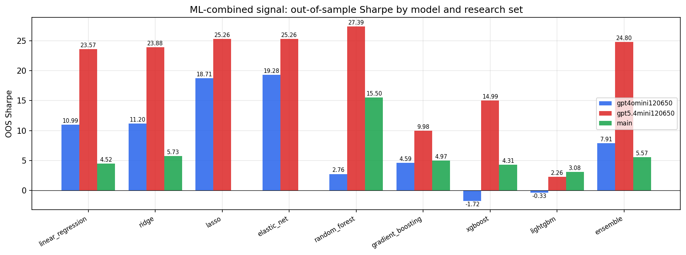

*ML-combined OOS Sharpe by model and research set*

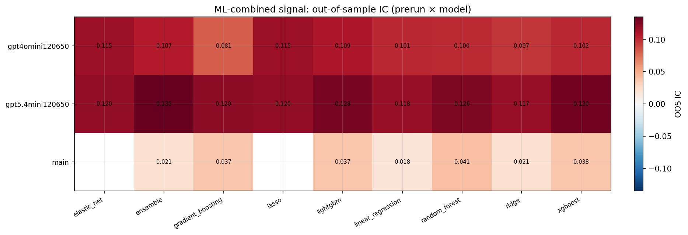

*ML-combined OOS IC (prerun × model)*

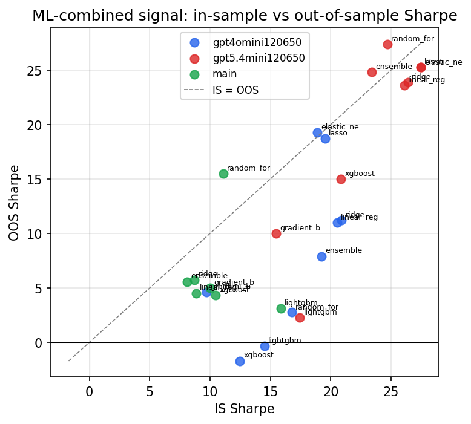

*IS vs OOS Sharpe (overfitting diagnostic)*

---
*Generated by `run_model_comparison.py`. Tables: `*.csv`; interactive: `comparison.ipynb`.*
