# Research-LLM factor comparison — `2026-02`

Comparing the **factor output of different research LLMs** on three axes (raw factor quality → factors as ML features → factors through the full agentic fund). The panel, IS/OOS split, horizon and model hyper-parameters are held identical across preruns — the *only* variable is the factor set.

## Preruns compared

| prerun | research_model | usable_factors | dropped_factors |
| --- | --- | --- | --- |
| gpt4omini120650 | gpt-4o-mini | 66 | 0 |
| gpt5.4mini120650 | gpt-5.4-mini | 69 | 0 |
| main | seed library | 78 | 10 |

> Dropped factors declare fields the current data doesn't have yet (e.g. fundamentals); they light up unchanged once that data is downloaded.

*Usable vs awaiting-data factors per research model*

## Key findings

- **Best ML-combined OOS Sharpe:** `gpt5.4mini120650` with `ensemble` (OOS Sharpe = 32.520).
- **Mean OOS Sharpe across models, by research set:** `gpt5.4mini120650` = 22.252, `gpt4omini120650` = 10.539, `main` = 9.113.
- **Highest mean single-factor |IC| (h=6):** `main` (mean |IC| = 0.0358).
- **Most diverse zoo (highest effective/raw factor ratio):** `gpt5.4mini120650` (eff 52.6 of 69, ratio 0.76).
- **Best selection-deflated single-factor |IC|:** `main` (deflated |IC| = 0.3953 from 37 factors tried).

## 1. Single-factor IC (raw factor quality)

Per-underlying time-series Spearman rank-IC of every researched factor, recomputed on the shared panel at horizons h=1, h=6, h=60. The per-underlying IC correlates each factor's value vector with the underlying's own forward-return vector (pooled across underlyings); the cross-sectional IC ranks across underlyings per timestamp.

| prerun | n_factors | mean_abs_ic_1 | mean_abs_ic_6 | mean_abs_ic_60 | mean_abs_icir_6 | best_factor_h6 | best_abs_ic_h6 |
| --- | --- | --- | --- | --- | --- | --- | --- |
| gpt4omini120650 | 66 | 0.0377 | 0.0272 | 0.0119 | 1.2351 | limit_order_book_imbalance_surge | 0.0962 |
| gpt5.4mini120650 | 69 | 0.0214 | 0.0186 | 0.0115 | 1.082 | orderflow_imbalance_divergence | 0.0857 |
| main | 78 | 0.0317 | 0.0358 | 0.0159 | 1.3705 | alpha_066 | 0.4025 |

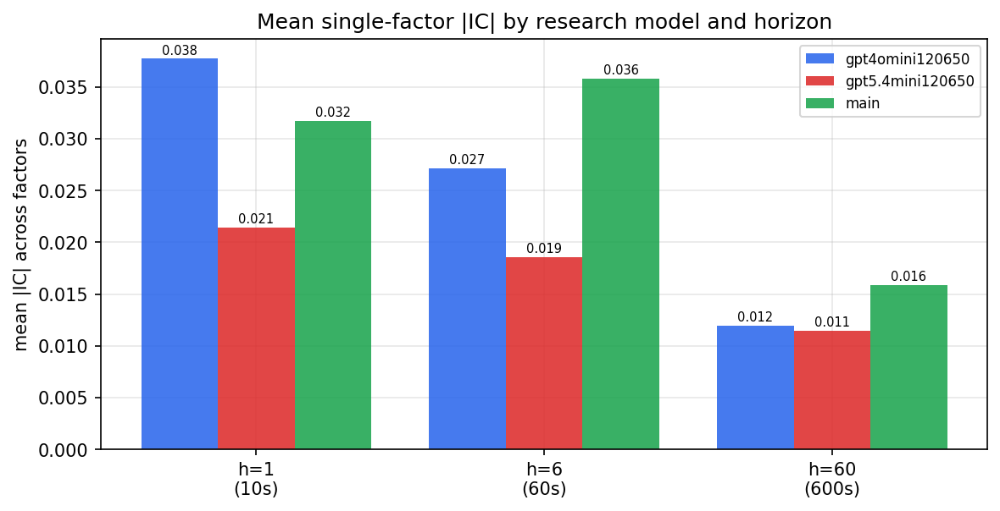

*Mean |IC| by research model and horizon*

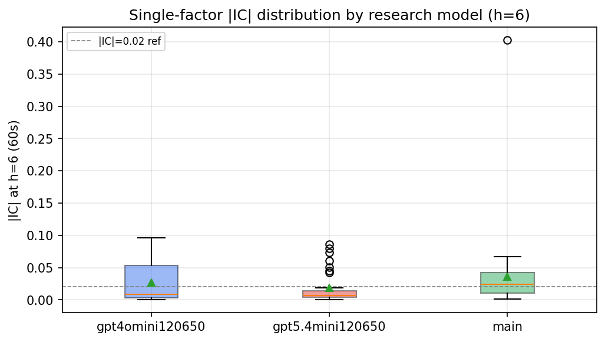

*Per-factor |IC| distribution by research model*

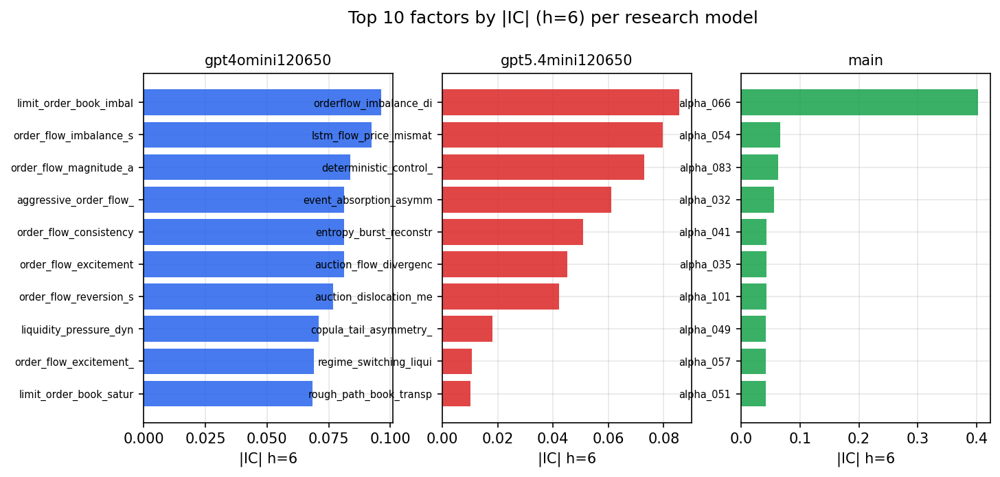

*Top factors by |IC| per research model*

## 2. Factor diversity & redundancy

Pairwise correlation of each zoo's *signals*. `eff_n_factors` is the effective number of independent factors (participation ratio of the correlation eigenvalues); `eff_ratio` and `redundancy` summarise how much unique information the zoo holds vs. how much is duplicated; `n_clusters` groups factors at |corr| ≥ 0.7.

| prerun | n_factors | eff_n_factors | eff_ratio | mean_abs_corr | n_clusters | redundancy |
| --- | --- | --- | --- | --- | --- | --- |
| gpt4omini120650 | 66 | 28.672 | 0.4344 | 0.045 | 52 | 0.5656 |
| gpt5.4mini120650 | 69 | 52.6358 | 0.7628 | 0.0124 | 63 | 0.2372 |
| main | 78 | 38.3616 | 0.4918 | 0.0364 | 68 | 0.5082 |

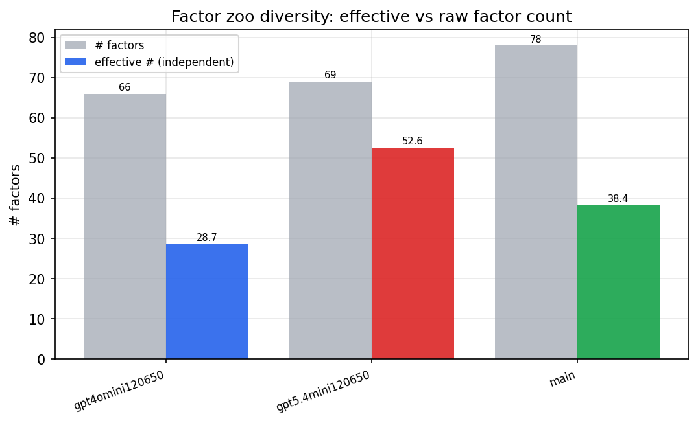

*Effective vs raw factor count per research model*

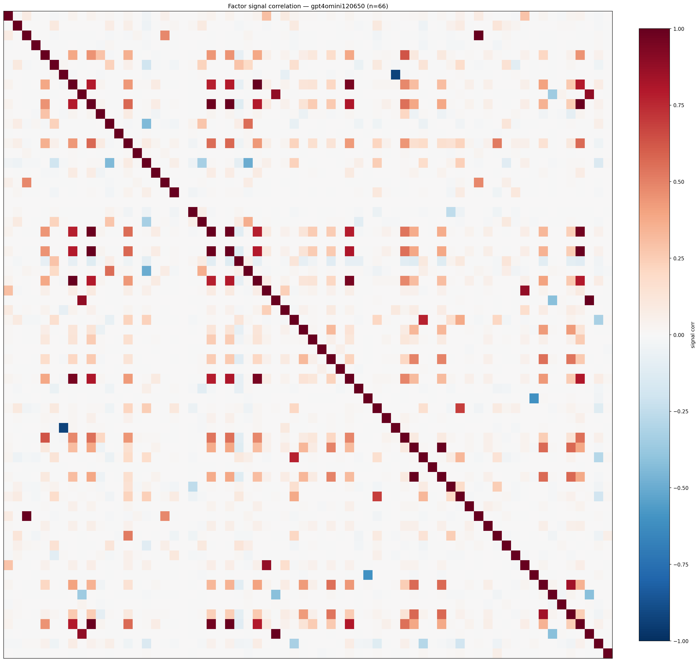

*Signal correlation matrix — gpt4omini120650*

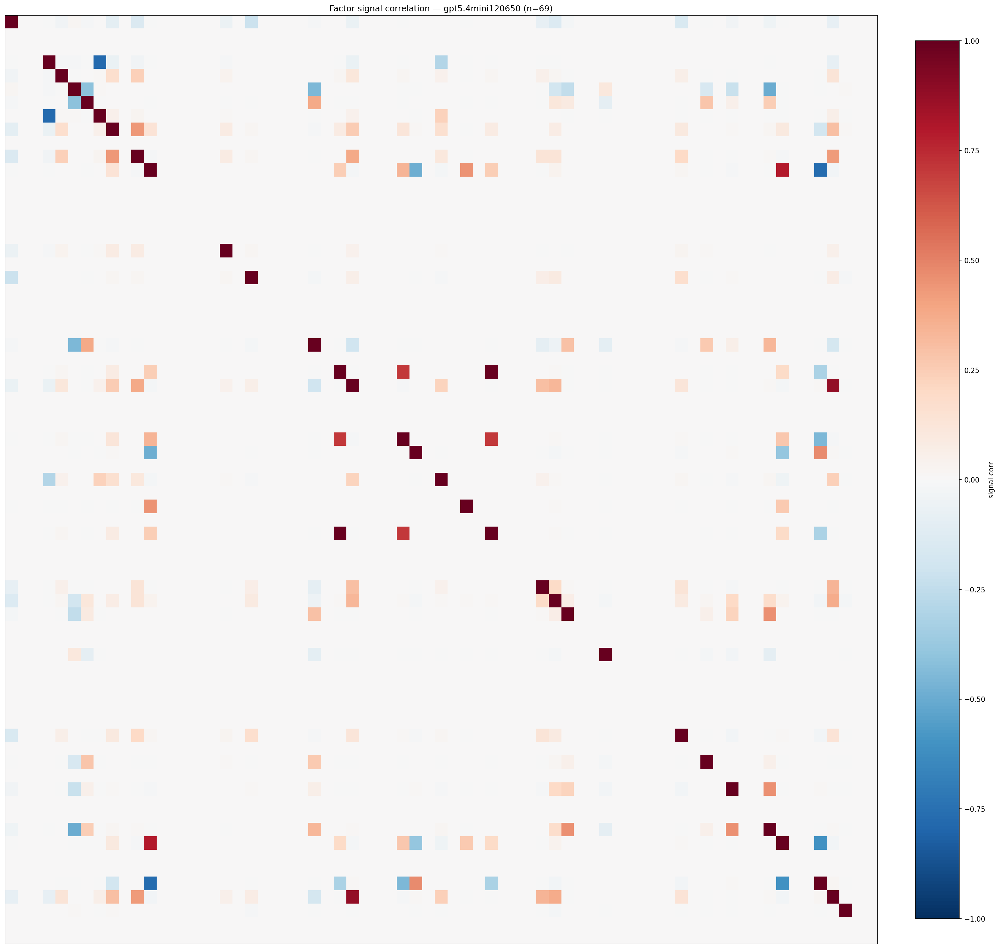

*Signal correlation matrix — gpt5.4mini120650*

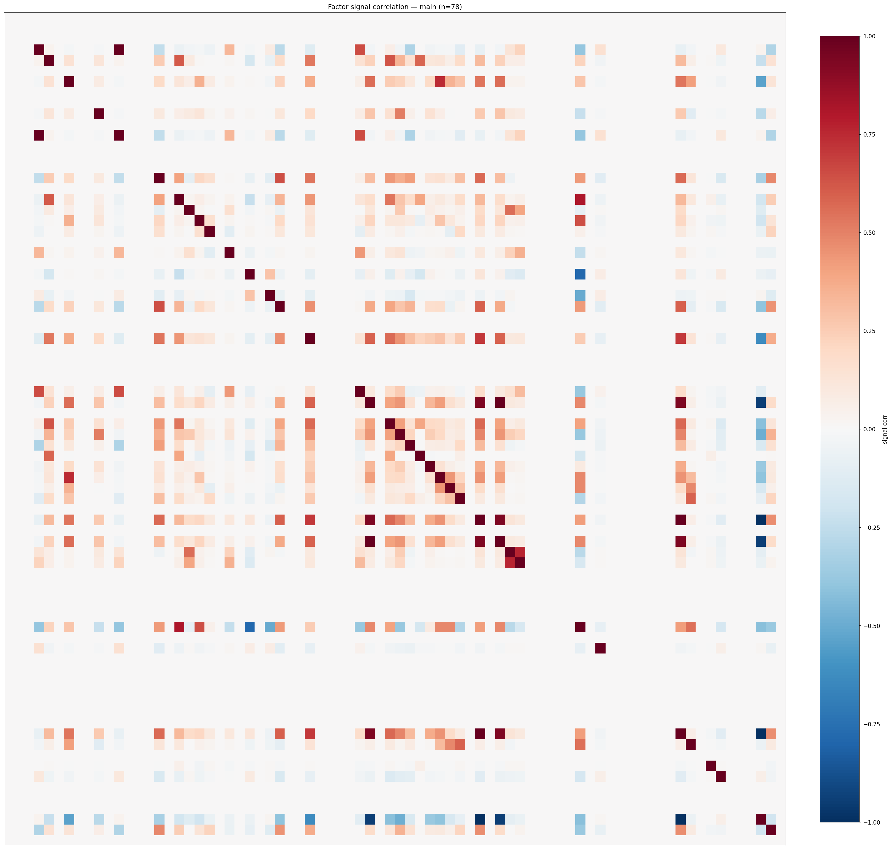

*Signal correlation matrix — main*

## 3. Deflation & model-based importance

`deflated_best_ic` haircuts each zoo's best |IC| for the number of factors tried (`ic_n_tested`) — a bigger zoo's best factor is more likely to be lucky. `lasso_n_nonzero` / `lasso_sparsity` show how many factors a sparse linear model actually keeps (model-view redundancy).

| prerun | best_ic | deflated_best_ic | deflated_best_t | ic_n_tested | ic_n_obs | lasso_n_nonzero | lasso_sparsity |
| --- | --- | --- | --- | --- | --- | --- | --- |
| gpt4omini120650 | 0.0962 | 0.0885 | 33.3105 | 64 | 141659 | 2 | 0.9697 |
| gpt5.4mini120650 | 0.0857 | 0.0788 | 29.6425 | 31 | 141659 | 13 | 0.8116 |
| main | 0.4025 | 0.3953 | 148.7948 | 37 | 141659 | 5 | 0.9359 |

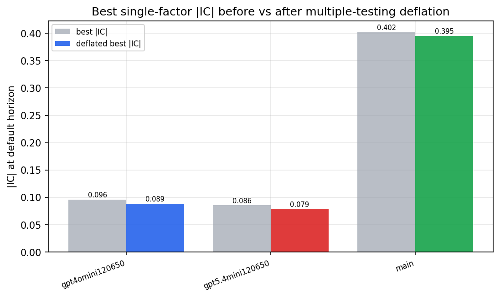

*Best |IC| before vs after multiple-testing deflation*

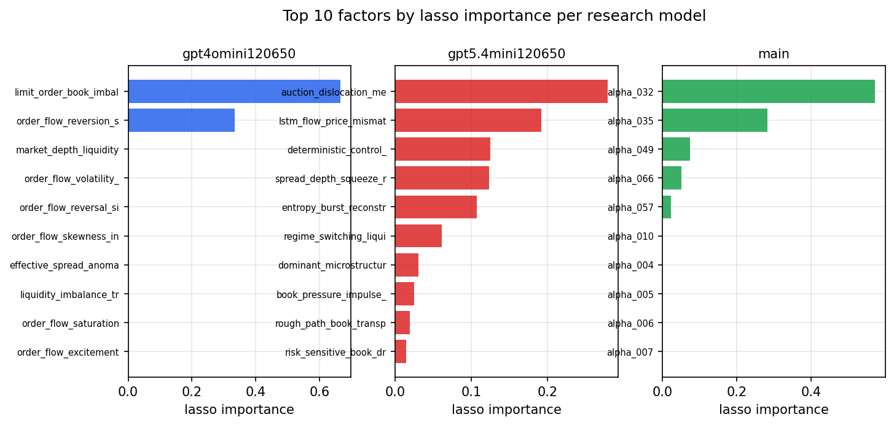

*Top factors by lasso importance per zoo*

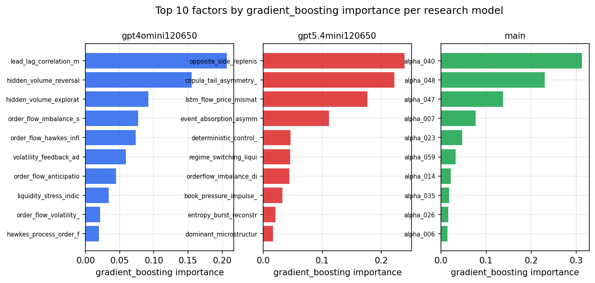

*Top factors by gradient_boosting importance per zoo*

## 4. ML-combined signal — per-underlying vectorised backtest

Each model combines a prerun's factors into ONE signal (fit `factors → forward return` on IS, predict per (bar, underlying)), then that combined signal is run through a simple vectorised backtest — `position(signal) × the underlying's own forward return` — on the held-out OOS tail (+ an equal-weight ensemble). No cross-sectional ranking.

> Config: position=**threshold** (t=1.0, z-score `expanding`), aggregation=**portfolio**, fit-standardise=**per_underlying**, horizon=6.

| prerun | model | n_factors_used | oos_ic | oos_sharpe | is_sharpe | oos_ann_return | oos_max_drawdown |
| --- | --- | --- | --- | --- | --- | --- | --- |
| gpt4omini120650 | linear_regression | 66 | 0.0987 | 13.7796 | 17.9024 | 0.9605 | -0.0127 |
| gpt4omini120650 | ridge | 66 | 0.0997 | 15.3996 | 18.7366 | 1.1291 | -0.0127 |
| gpt4omini120650 | lasso | 66 | 0.1017 | 16.1695 | 17.8205 | 1.1147 | -0.0126 |
| gpt4omini120650 | elastic_net | 66 | 0.1019 | 15.9485 | 17.9931 | 1.1027 | -0.0125 |
| gpt4omini120650 | random_forest | 66 | 0.104 | 18.332 | 23.9962 | 1.2778 | -0.0128 |
| gpt4omini120650 | gradient_boosting | 66 | 0.0851 | 0.7872 | 8.6363 | 0.0223 | -0.0057 |
| gpt4omini120650 | xgboost | 66 | 0.1054 | 1.6277 | 11.0025 | 0.0516 | -0.0072 |
| gpt4omini120650 | lightgbm | 66 | 0.1183 | -0.6332 | 14.0083 | -0.0257 | -0.017 |
| gpt4omini120650 | ensemble | 66 | 0.1082 | 13.4435 | 18.942 | 0.9317 | -0.0124 |
| gpt5.4mini120650 | linear_regression | 69 | 0.1125 | 29.9232 | 24.6433 | 1.7665 | -0.0036 |
| gpt5.4mini120650 | ridge | 69 | 0.1125 | 30.5044 | 24.4959 | 1.8111 | -0.0036 |
| gpt5.4mini120650 | lasso | 69 | 0.1126 | 29.8292 | 25.9009 | 1.8053 | -0.0068 |
| gpt5.4mini120650 | elastic_net | 69 | 0.1126 | 29.8292 | 25.9009 | 1.8053 | -0.0068 |
| gpt5.4mini120650 | random_forest | 69 | 0.1137 | 25.0285 | 26.1911 | 1.7942 | -0.0078 |
| gpt5.4mini120650 | gradient_boosting | 69 | 0.1132 | 0.0343 | 14.6389 | 0.0013 | -0.0105 |
| gpt5.4mini120650 | xgboost | 69 | 0.1269 | 15.8115 | 20.7198 | 0.7497 | -0.0057 |
| gpt5.4mini120650 | lightgbm | 69 | 0.1266 | 6.7899 | 15.1555 | 0.2092 | -0.0056 |
| gpt5.4mini120650 | ensemble | 69 | 0.1305 | 32.52 | 25.0595 | 1.9816 | -0.0052 |
| main | linear_regression | 78 | 0.044 | 4.9085 | 10.4392 | 0.3595 | -0.0166 |
| main | ridge | 78 | 0.0465 | 7.0773 | 10.3946 | 0.4526 | -0.0123 |
| main | lasso | 78 | 0.0525 | 15.5887 | 8.8807 | 0.7289 | -0.006 |
| main | elastic_net | 78 | 0.0526 | 17.015 | 9.2674 | 0.7528 | -0.0057 |
| main | random_forest | 78 | 0.0417 | 6.816 | 13.1303 | 0.1714 | -0.0038 |
| main | gradient_boosting | 78 | 0.0395 | 5.4318 | 8.8076 | 0.068 | -0.0033 |
| main | xgboost | 78 | 0.0353 | 5.9641 | 10.9043 | 0.1135 | -0.0029 |
| main | lightgbm | 78 | 0.0403 | 7.5506 | 13.2022 | 0.2037 | -0.0055 |
| main | ensemble | 78 | 0.0562 | 11.6671 | 14.6137 | 0.695 | -0.0115 |

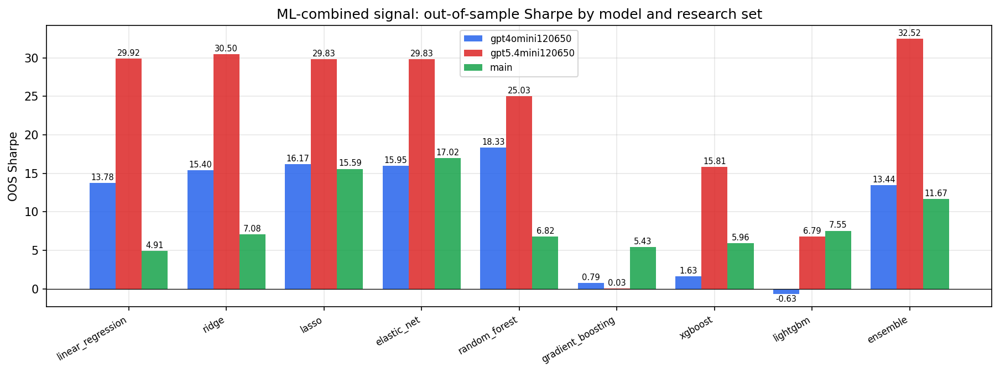

*ML-combined OOS Sharpe by model and research set*

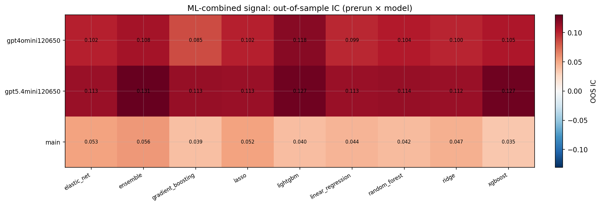

*ML-combined OOS IC (prerun × model)*

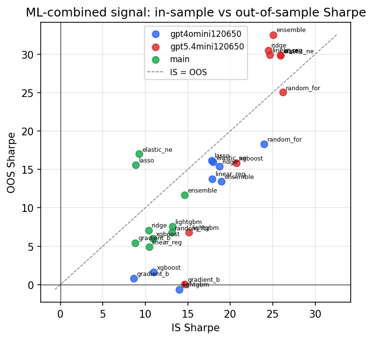

*IS vs OOS Sharpe (overfitting diagnostic)*

---
*Generated by `run_model_comparison.py`. Tables: `*.csv`; interactive: `comparison.ipynb`.*
