# Research-LLM factor comparison — `2026-03`

Comparing the **factor output of different research LLMs** on three axes (raw factor quality → factors as ML features → factors through the full agentic fund). The panel, IS/OOS split, horizon and model hyper-parameters are held identical across preruns — the *only* variable is the factor set.

## Preruns compared

| prerun | research_model | usable_factors | dropped_factors |
| --- | --- | --- | --- |
| gpt4omini120650 | gpt-4o-mini | 66 | 0 |
| gpt5.4mini120650 | gpt-5.4-mini | 69 | 0 |
| main | seed library | 78 | 10 |

> Dropped factors declare fields the current data doesn't have yet (e.g. fundamentals); they light up unchanged once that data is downloaded.

*Usable vs awaiting-data factors per research model*

## Key findings

- **Best ML-combined OOS Sharpe:** `gpt5.4mini120650` with `ensemble` (OOS Sharpe = 24.038).
- **Mean OOS Sharpe across models, by research set:** `gpt5.4mini120650` = 12.531, `main` = 8.802, `gpt4omini120650` = 6.389.
- **Highest mean single-factor |IC| (h=6):** `main` (mean |IC| = 0.0324).
- **Most diverse zoo (highest effective/raw factor ratio):** `gpt5.4mini120650` (eff 52.9 of 69, ratio 0.77).
- **Best selection-deflated single-factor |IC|:** `main` (deflated |IC| = 0.3588 from 37 factors tried).

## 1. Single-factor IC (raw factor quality)

Per-underlying time-series Spearman rank-IC of every researched factor, recomputed on the shared panel at horizons h=1, h=6, h=60. The per-underlying IC correlates each factor's value vector with the underlying's own forward-return vector (pooled across underlyings); the cross-sectional IC ranks across underlyings per timestamp.

| prerun | n_factors | mean_abs_ic_1 | mean_abs_ic_6 | mean_abs_ic_60 | mean_abs_icir_6 | best_factor_h6 | best_abs_ic_h6 |
| --- | --- | --- | --- | --- | --- | --- | --- |
| gpt4omini120650 | 66 | 0.0345 | 0.0203 | 0.0106 | 0.9754 | order_flow_imbalance_strength | 0.075 |
| gpt5.4mini120650 | 69 | 0.0188 | 0.0133 | 0.0096 | 0.8069 | orderflow_imbalance_divergence | 0.0592 |
| main | 78 | 0.0319 | 0.0324 | 0.0183 | 1.3439 | alpha_066 | 0.3659 |

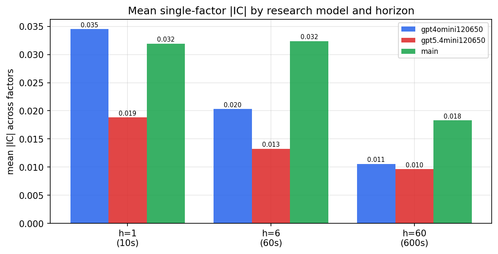

*Mean |IC| by research model and horizon*

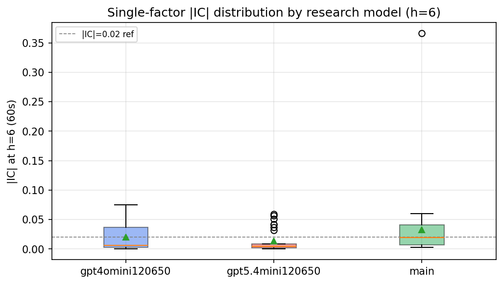

*Per-factor |IC| distribution by research model*

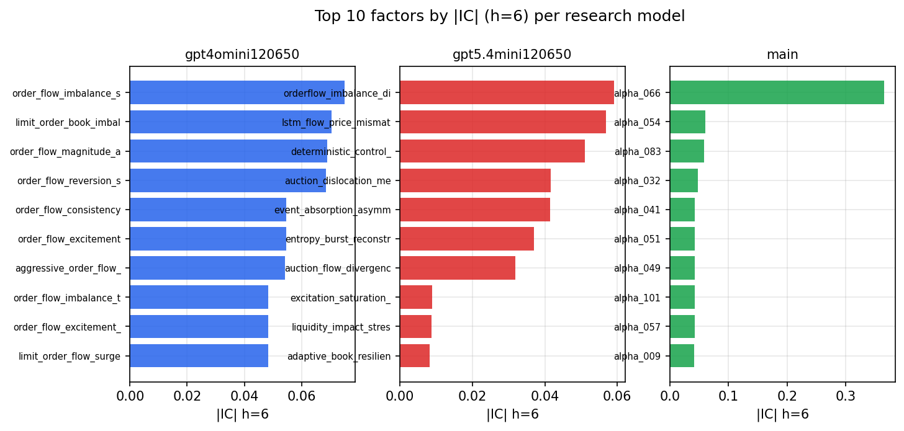

*Top factors by |IC| per research model*

## 2. Factor diversity & redundancy

Pairwise correlation of each zoo's *signals*. `eff_n_factors` is the effective number of independent factors (participation ratio of the correlation eigenvalues); `eff_ratio` and `redundancy` summarise how much unique information the zoo holds vs. how much is duplicated; `n_clusters` groups factors at |corr| ≥ 0.7.

| prerun | n_factors | eff_n_factors | eff_ratio | mean_abs_corr | n_clusters | redundancy |
| --- | --- | --- | --- | --- | --- | --- |
| gpt4omini120650 | 66 | 28.8973 | 0.4378 | 0.0446 | 53 | 0.5622 |
| gpt5.4mini120650 | 69 | 52.8559 | 0.766 | 0.0122 | 63 | 0.234 |
| main | 78 | 37.4499 | 0.4801 | 0.0358 | 67 | 0.5199 |

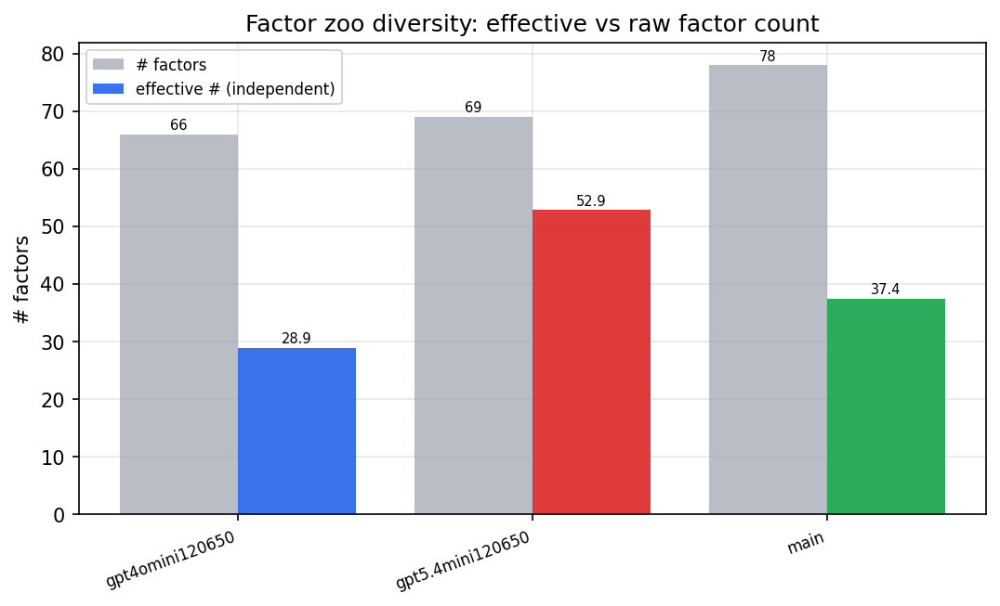

*Effective vs raw factor count per research model*

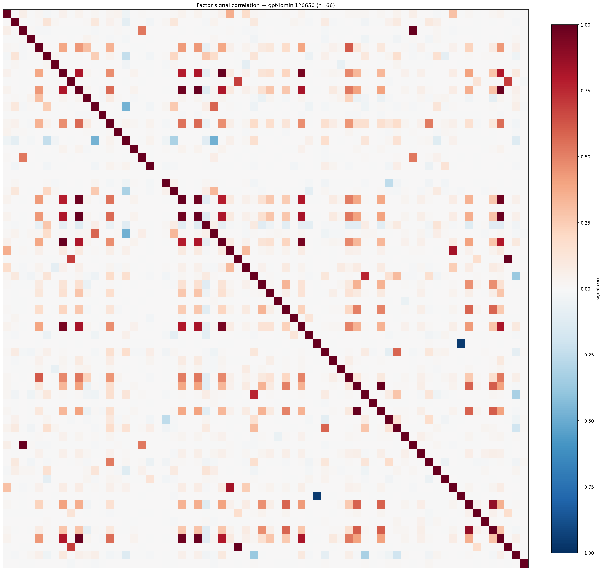

*Signal correlation matrix — gpt4omini120650*

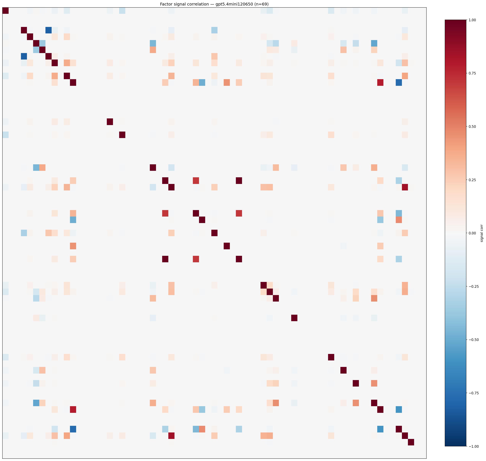

*Signal correlation matrix — gpt5.4mini120650*

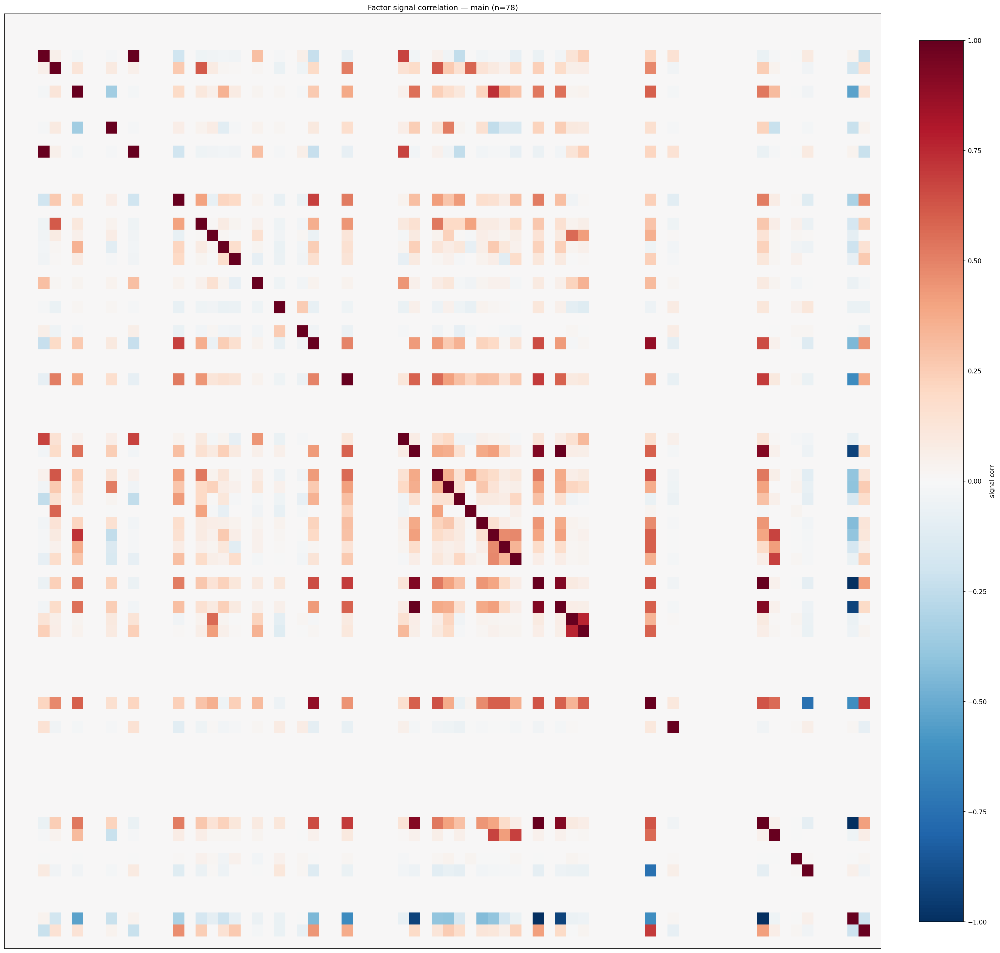

*Signal correlation matrix — main*

## 3. Deflation & model-based importance

`deflated_best_ic` haircuts each zoo's best |IC| for the number of factors tried (`ic_n_tested`) — a bigger zoo's best factor is more likely to be lucky. `lasso_n_nonzero` / `lasso_sparsity` show how many factors a sparse linear model actually keeps (model-view redundancy).

| prerun | best_ic | deflated_best_ic | deflated_best_t | ic_n_tested | ic_n_obs | lasso_n_nonzero | lasso_sparsity |
| --- | --- | --- | --- | --- | --- | --- | --- |
| gpt4omini120650 | 0.075 | 0.0673 | 25.4345 | 64 | 142739 | 5 | 0.9242 |
| gpt5.4mini120650 | 0.0592 | 0.0523 | 19.7415 | 31 | 142739 | 8 | 0.8841 |
| main | 0.3659 | 0.3588 | 135.571 | 37 | 142739 | 1 | 0.9872 |

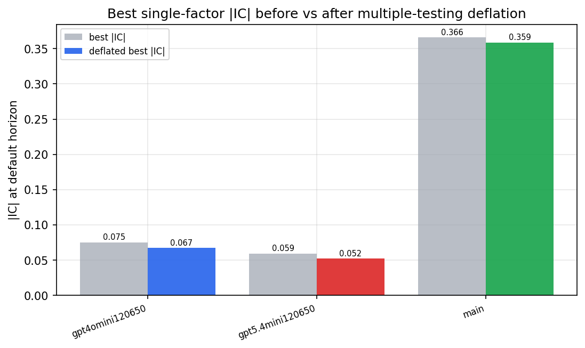

*Best |IC| before vs after multiple-testing deflation*

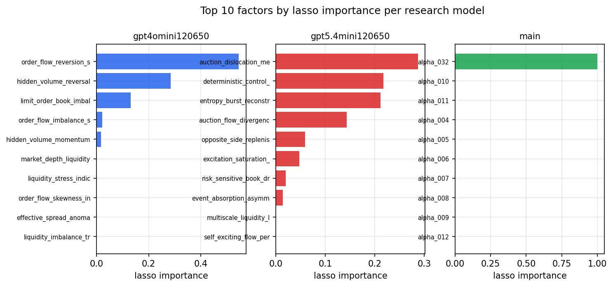

*Top factors by lasso importance per zoo*

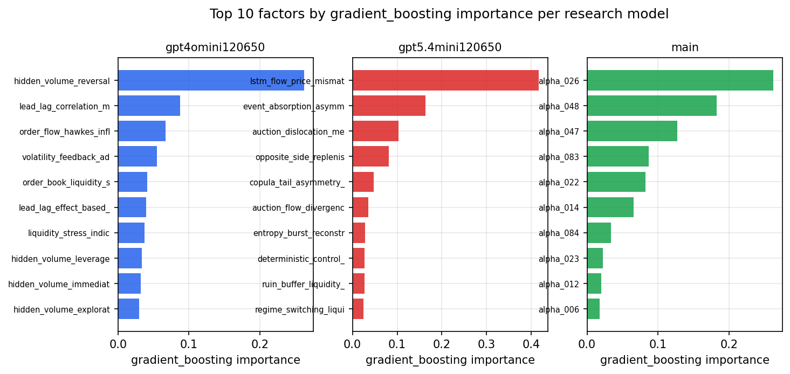

*Top factors by gradient_boosting importance per zoo*

## 4. ML-combined signal — per-underlying vectorised backtest

Each model combines a prerun's factors into ONE signal (fit `factors → forward return` on IS, predict per (bar, underlying)), then that combined signal is run through a simple vectorised backtest — `position(signal) × the underlying's own forward return` — on the held-out OOS tail (+ an equal-weight ensemble). No cross-sectional ranking.

> Config: position=**threshold** (t=1.0, z-score `expanding`), aggregation=**portfolio**, fit-standardise=**per_underlying**, horizon=6.

| prerun | model | n_factors_used | oos_ic | oos_sharpe | is_sharpe | oos_ann_return | oos_max_drawdown |
| --- | --- | --- | --- | --- | --- | --- | --- |
| gpt4omini120650 | linear_regression | 66 | 0.0574 | 6.1495 | 16.9264 | 0.6343 | -0.0172 |
| gpt4omini120650 | ridge | 66 | 0.0604 | 8.4512 | 16.4975 | 0.9095 | -0.0136 |
| gpt4omini120650 | lasso | 66 | 0.0633 | 11.047 | 18.8201 | 0.8615 | -0.0128 |
| gpt4omini120650 | elastic_net | 66 | 0.0645 | 12.068 | 18.8878 | 0.964 | -0.0122 |
| gpt4omini120650 | random_forest | 66 | 0.0939 | 12.4317 | 22.0191 | 1.3358 | -0.0144 |
| gpt4omini120650 | gradient_boosting | 66 | 0.0712 | -6.4823 | 10.9357 | -0.2073 | -0.0189 |
| gpt4omini120650 | xgboost | 66 | 0.1014 | -2.3943 | 13.6348 | -0.1312 | -0.0235 |
| gpt4omini120650 | lightgbm | 66 | 0.0981 | 3.2366 | 15.6441 | 0.1934 | -0.0128 |
| gpt4omini120650 | ensemble | 66 | 0.0796 | 12.9909 | 21.7231 | 1.1044 | -0.0108 |
| gpt5.4mini120650 | linear_regression | 69 | 0.0767 | 11.7824 | 23.5686 | 1.0057 | -0.0163 |
| gpt5.4mini120650 | ridge | 69 | 0.0767 | 11.8066 | 23.7414 | 1.0023 | -0.0163 |
| gpt5.4mini120650 | lasso | 69 | 0.079 | 11.3931 | 26.9727 | 1.0066 | -0.0163 |
| gpt5.4mini120650 | elastic_net | 69 | 0.0786 | 10.7668 | 27.1555 | 0.9549 | -0.0164 |
| gpt5.4mini120650 | random_forest | 69 | 0.0827 | 19.1287 | 28.1284 | 1.7227 | -0.0144 |
| gpt5.4mini120650 | gradient_boosting | 69 | 0.0745 | 3.9945 | 19.2437 | 0.1505 | -0.0076 |
| gpt5.4mini120650 | xgboost | 69 | 0.0848 | 12.9961 | 26.8651 | 1.3086 | -0.0128 |
| gpt5.4mini120650 | lightgbm | 69 | 0.0863 | 6.8746 | 19.051 | 0.4937 | -0.0071 |
| gpt5.4mini120650 | ensemble | 69 | 0.0889 | 24.0379 | 26.6475 | 1.5677 | -0.0088 |
| main | linear_regression | 78 | 0.023 | 6.8741 | 16.9171 | 0.3521 | -0.0128 |
| main | ridge | 78 | 0.0284 | 10.9058 | 17.8259 | 0.6644 | -0.0081 |
| main | lasso | 78 | 0.0394 | 16.9225 | 15.8486 | 0.9423 | -0.0101 |
| main | elastic_net | 78 | 0.0397 | 17.0039 | 15.7104 | 0.9437 | -0.0101 |
| main | random_forest | 78 | 0.0214 | 8.2269 | 17.9661 | 0.474 | -0.009 |
| main | gradient_boosting | 78 | 0.0189 | 5.6561 | 16.8211 | 0.1133 | -0.0023 |
| main | xgboost | 78 | 0.0159 | 5.7834 | 16.3983 | 0.2054 | -0.0075 |
| main | lightgbm | 78 | 0.0144 | -1.7899 | 18.2921 | -0.0721 | -0.016 |
| main | ensemble | 78 | 0.0315 | 9.6343 | 18.6031 | 0.5446 | -0.01 |

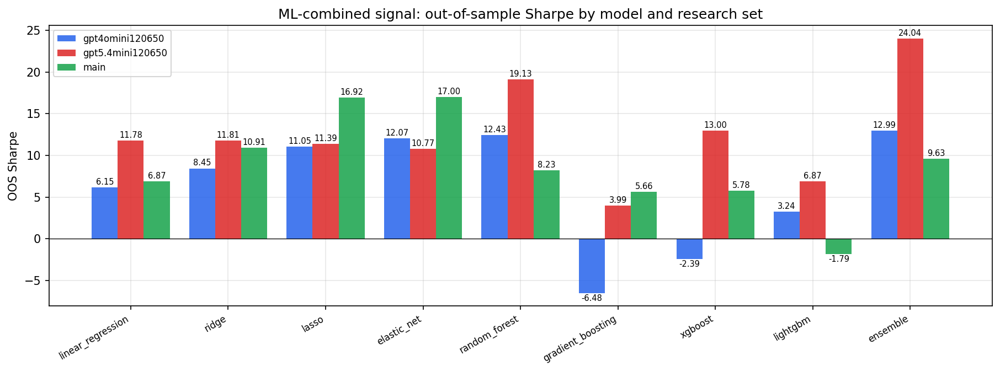

*ML-combined OOS Sharpe by model and research set*

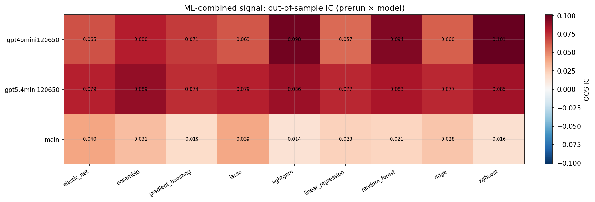

*ML-combined OOS IC (prerun × model)*

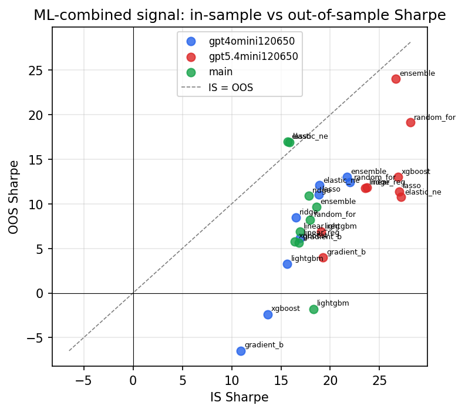

*IS vs OOS Sharpe (overfitting diagnostic)*

---
*Generated by `run_model_comparison.py`. Tables: `*.csv`; interactive: `comparison.ipynb`.*
