# Research-LLM factor comparison — `2026-05`

Comparing the **factor output of different research LLMs** on three axes (raw factor quality → factors as ML features → factors through the full agentic fund). The panel, IS/OOS split, horizon and model hyper-parameters are held identical across preruns — the *only* variable is the factor set.

## Preruns compared

| prerun | research_model | usable_factors | dropped_factors |
| --- | --- | --- | --- |
| gpt4omini120650 | gpt-4o-mini | 66 | 0 |
| gpt5.4mini120650 | gpt-5.4-mini | 69 | 0 |
| main | seed library | 78 | 10 |

> Dropped factors declare fields the current data doesn't have yet (e.g. fundamentals); they light up unchanged once that data is downloaded.

*Usable vs awaiting-data factors per research model*

## Key findings

- **Best ML-combined OOS Sharpe:** `gpt4omini120650` with `random_forest` (OOS Sharpe = 37.390).
- **Mean OOS Sharpe across models, by research set:** `gpt5.4mini120650` = 19.425, `gpt4omini120650` = 16.219, `main` = 4.404.
- **Highest mean single-factor |IC| (h=6):** `main` (mean |IC| = 0.0351).
- **Most diverse zoo (highest effective/raw factor ratio):** `gpt5.4mini120650` (eff 53.5 of 69, ratio 0.77).
- **Best selection-deflated single-factor |IC|:** `main` (deflated |IC| = 0.4939 from 37 factors tried).

## 1. Single-factor IC (raw factor quality)

Per-underlying time-series Spearman rank-IC of every researched factor, recomputed on the shared panel at horizons h=1, h=6, h=60. The per-underlying IC correlates each factor's value vector with the underlying's own forward-return vector (pooled across underlyings); the cross-sectional IC ranks across underlyings per timestamp.

| prerun | n_factors | mean_abs_ic_1 | mean_abs_ic_6 | mean_abs_ic_60 | mean_abs_icir_6 | best_factor_h6 | best_abs_ic_h6 |
| --- | --- | --- | --- | --- | --- | --- | --- |
| gpt4omini120650 | 66 | 0.0397 | 0.0266 | 0.0126 | 1.0696 | order_flow_imbalance_strength | 0.0868 |
| gpt5.4mini120650 | 69 | 0.0226 | 0.0182 | 0.012 | 0.944 | lstm_flow_price_mismatch | 0.0852 |
| main | 78 | 0.0391 | 0.0351 | 0.014 | 0.9728 | alpha_066 | 0.5009 |

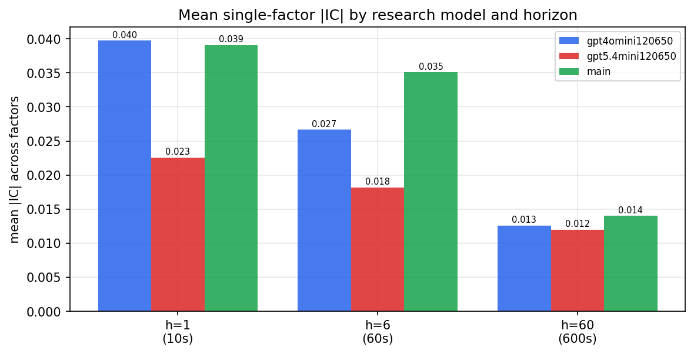

*Mean |IC| by research model and horizon*

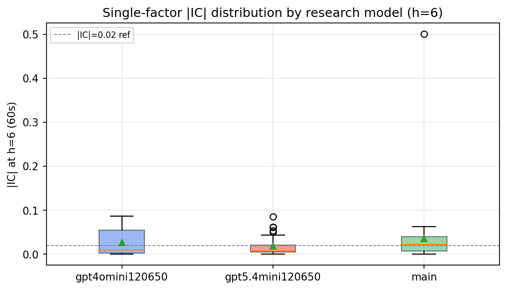

*Per-factor |IC| distribution by research model*

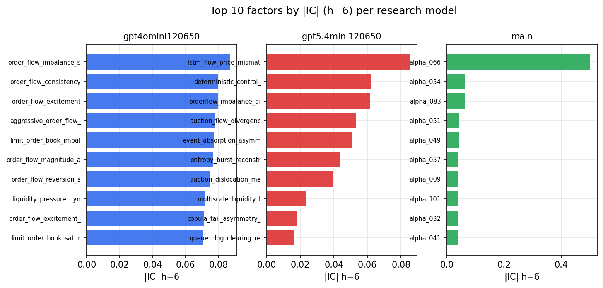

*Top factors by |IC| per research model*

## 2. Factor diversity & redundancy

Pairwise correlation of each zoo's *signals*. `eff_n_factors` is the effective number of independent factors (participation ratio of the correlation eigenvalues); `eff_ratio` and `redundancy` summarise how much unique information the zoo holds vs. how much is duplicated; `n_clusters` groups factors at |corr| ≥ 0.7.

| prerun | n_factors | eff_n_factors | eff_ratio | mean_abs_corr | n_clusters | redundancy |
| --- | --- | --- | --- | --- | --- | --- |
| gpt4omini120650 | 66 | 28.9533 | 0.4387 | 0.0452 | 53 | 0.5613 |
| gpt5.4mini120650 | 69 | 53.4744 | 0.775 | 0.0119 | 63 | 0.225 |
| main | 78 | 36.388 | 0.4665 | 0.038 | 66 | 0.5335 |

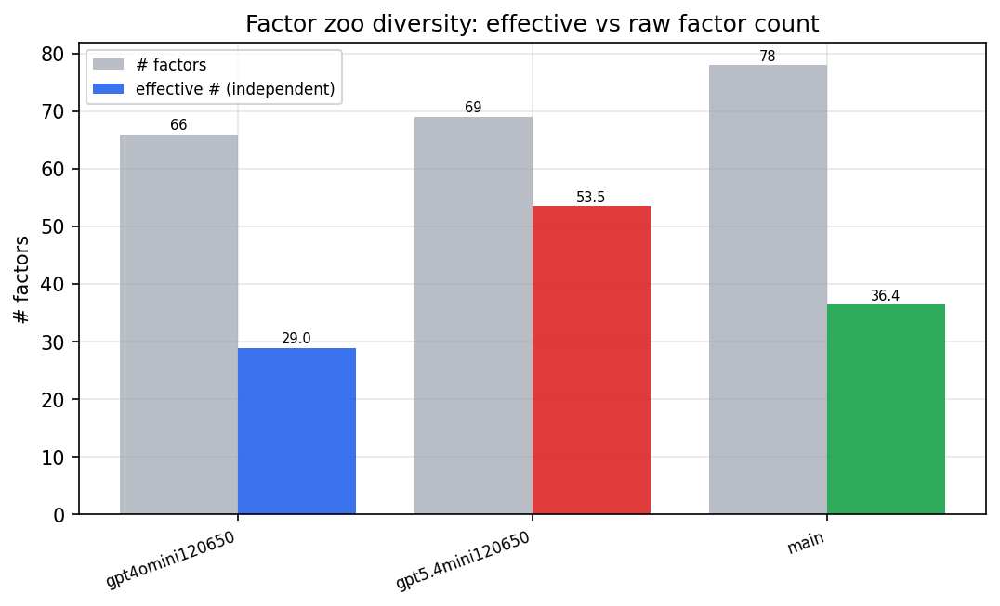

*Effective vs raw factor count per research model*

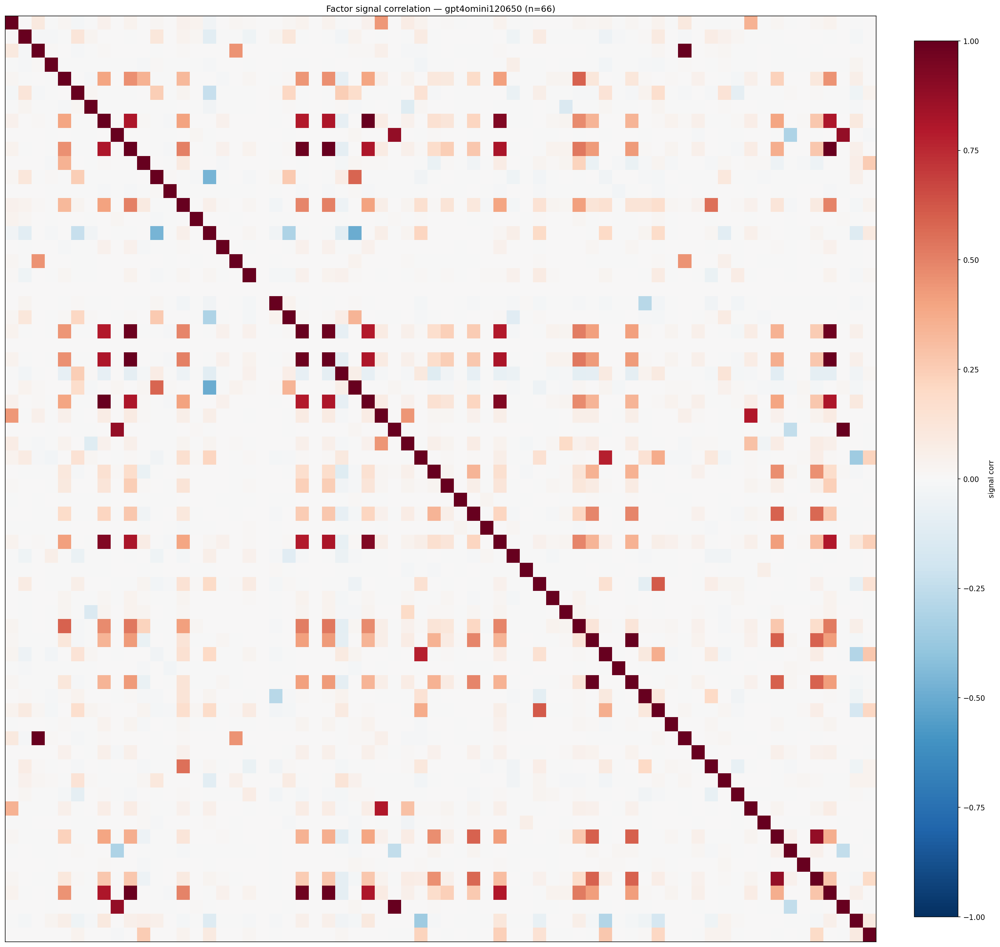

*Signal correlation matrix — gpt4omini120650*

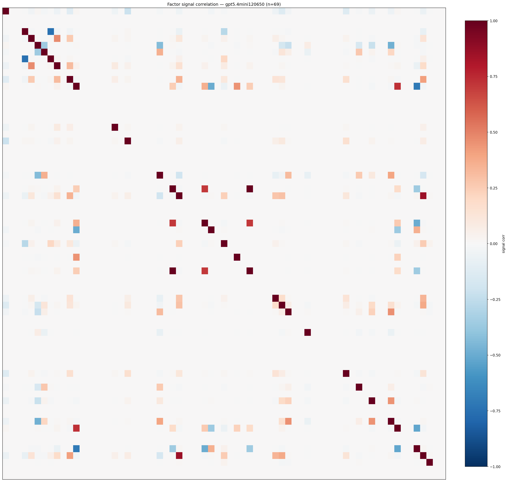

*Signal correlation matrix — gpt5.4mini120650*

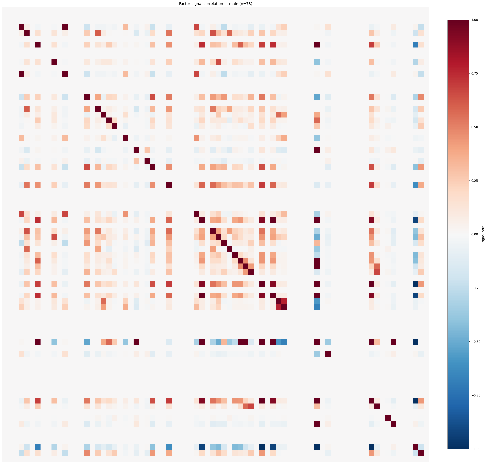

*Signal correlation matrix — main*

## 3. Deflation & model-based importance

`deflated_best_ic` haircuts each zoo's best |IC| for the number of factors tried (`ic_n_tested`) — a bigger zoo's best factor is more likely to be lucky. `lasso_n_nonzero` / `lasso_sparsity` show how many factors a sparse linear model actually keeps (model-view redundancy).

| prerun | best_ic | deflated_best_ic | deflated_best_t | ic_n_tested | ic_n_obs | lasso_n_nonzero | lasso_sparsity |
| --- | --- | --- | --- | --- | --- | --- | --- |
| gpt4omini120650 | 0.0868 | 0.0793 | 30.4331 | 64 | 147419 | 4 | 0.9394 |
| gpt5.4mini120650 | 0.0852 | 0.0784 | 30.0878 | 31 | 147419 | 25 | 0.6377 |
| main | 0.5009 | 0.4939 | 189.6485 | 37 | 147419 | 0 | 1.0 |

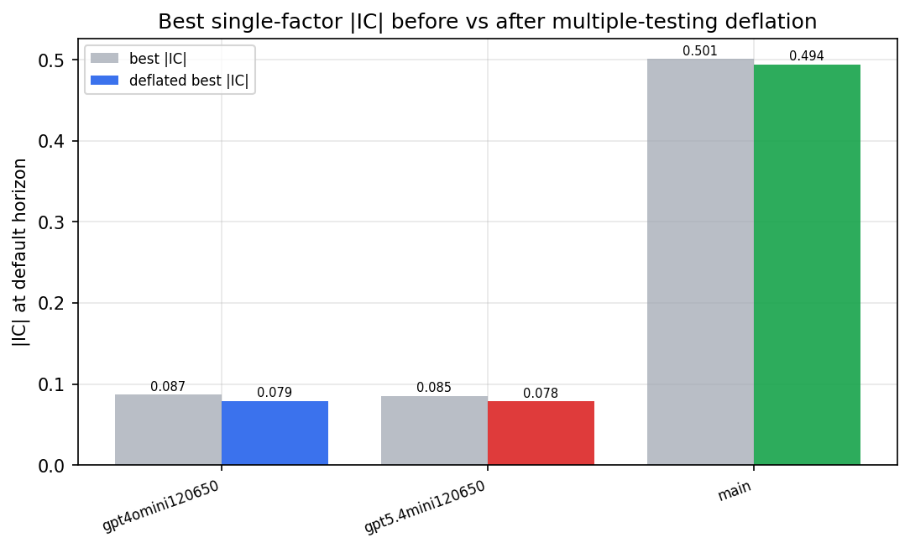

*Best |IC| before vs after multiple-testing deflation*

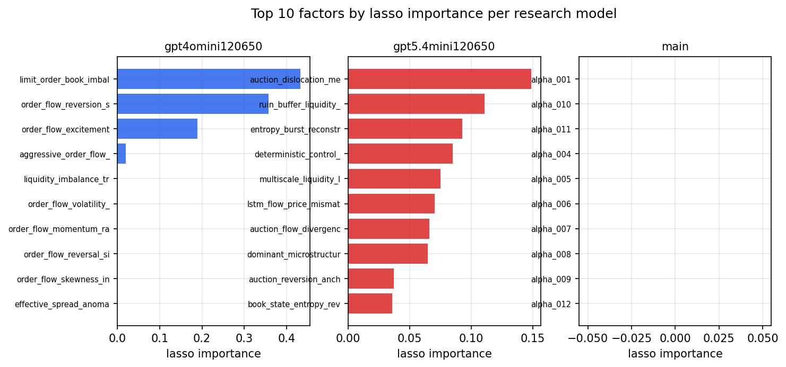

*Top factors by lasso importance per zoo*

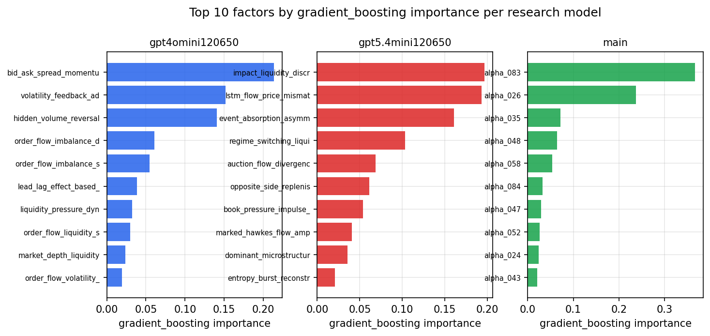

*Top factors by gradient_boosting importance per zoo*

## 4. ML-combined signal — per-underlying vectorised backtest

Each model combines a prerun's factors into ONE signal (fit `factors → forward return` on IS, predict per (bar, underlying)), then that combined signal is run through a simple vectorised backtest — `position(signal) × the underlying's own forward return` — on the held-out OOS tail (+ an equal-weight ensemble). No cross-sectional ranking.

> Config: position=**threshold** (t=1.0, z-score `expanding`), aggregation=**portfolio**, fit-standardise=**per_underlying**, horizon=6.

| prerun | model | n_factors_used | oos_ic | oos_sharpe | is_sharpe | oos_ann_return | oos_max_drawdown |
| --- | --- | --- | --- | --- | --- | --- | --- |
| gpt4omini120650 | linear_regression | 66 | 0.1051 | 12.552 | 21.5659 | 0.3305 | -0.0026 |
| gpt4omini120650 | ridge | 66 | 0.1086 | 12.1755 | 22.0195 | 0.3204 | -0.0028 |
| gpt4omini120650 | lasso | 66 | 0.1035 | 24.0611 | 25.2411 | 1.311 | -0.0065 |
| gpt4omini120650 | elastic_net | 66 | 0.1035 | 24.0611 | 25.2411 | 1.311 | -0.0065 |
| gpt4omini120650 | random_forest | 66 | 0.1175 | 37.39 | 26.6091 | 2.0308 | -0.0033 |
| gpt4omini120650 | gradient_boosting | 66 | 0.1329 | 3.5002 | 8.2832 | 0.0983 | -0.0091 |
| gpt4omini120650 | xgboost | 66 | 0.1396 | 7.1695 | 10.4452 | 0.6134 | -0.0042 |
| gpt4omini120650 | lightgbm | 66 | 0.1393 | 7.5481 | 13.1784 | 0.8029 | -0.0041 |
| gpt4omini120650 | ensemble | 66 | 0.1182 | 17.5092 | 17.893 | 1.4868 | -0.004 |
| gpt5.4mini120650 | linear_regression | 69 | 0.113 | 20.749 | 27.1011 | 1.1043 | -0.0102 |
| gpt5.4mini120650 | ridge | 69 | 0.1133 | 21.2589 | 25.6802 | 1.1402 | -0.0099 |
| gpt5.4mini120650 | lasso | 69 | 0.1208 | 28.2443 | 26.1921 | 1.1267 | -0.0069 |
| gpt5.4mini120650 | elastic_net | 69 | 0.1208 | 28.2443 | 26.1921 | 1.1267 | -0.0069 |
| gpt5.4mini120650 | random_forest | 69 | 0.1551 | 28.533 | 20.2038 | 1.5903 | -0.0029 |
| gpt5.4mini120650 | gradient_boosting | 69 | 0.1515 | 5.4526 | 7.8498 | 0.0998 | -0.0048 |
| gpt5.4mini120650 | xgboost | 69 | 0.156 | 6.9106 | 9.931 | 0.1911 | -0.003 |
| gpt5.4mini120650 | lightgbm | 69 | 0.1548 | 5.2145 | 12.3927 | 0.1639 | -0.0062 |
| gpt5.4mini120650 | ensemble | 69 | 0.1402 | 30.215 | 19.6 | 1.5108 | -0.0051 |
| main | linear_regression | 78 | 0.0099 | 2.4841 | 14.3957 | 0.1659 | -0.0139 |
| main | ridge | 78 | 0.0083 | 3.4843 | 11.0365 | 0.2279 | -0.0099 |
| main | lasso | 78 | 0.0163 | 6.0661 | 13.1693 | 0.2362 | -0.0065 |
| main | elastic_net | 78 | 0.0163 | 6.0661 | 13.1693 | 0.2362 | -0.0065 |
| main | random_forest | 78 | 0.0242 | 7.8702 | 13.2269 | 0.3337 | -0.0058 |
| main | gradient_boosting | 78 | 0.019 | 3.5326 | 12.1231 | 0.1508 | -0.0048 |
| main | xgboost | 78 | 0.019 | 2.1996 | 12.7007 | 0.1 | -0.0105 |
| main | lightgbm | 78 | 0.0186 | 2.2441 | 14.0388 | 0.0919 | -0.0093 |
| main | ensemble | 78 | 0.019 | 5.6893 | 14.5143 | 0.3025 | -0.0078 |

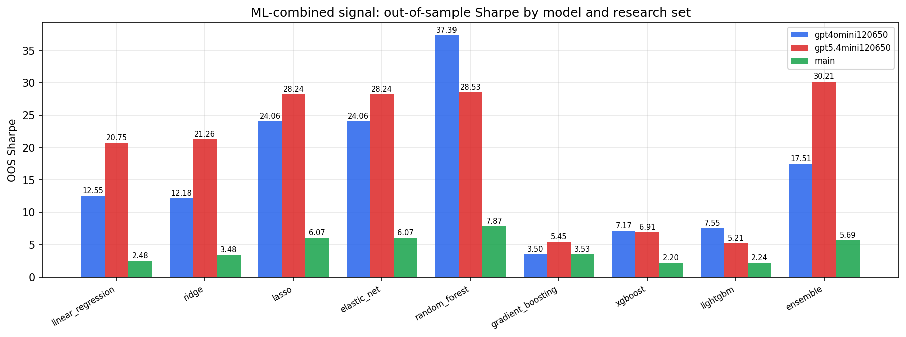

*ML-combined OOS Sharpe by model and research set*

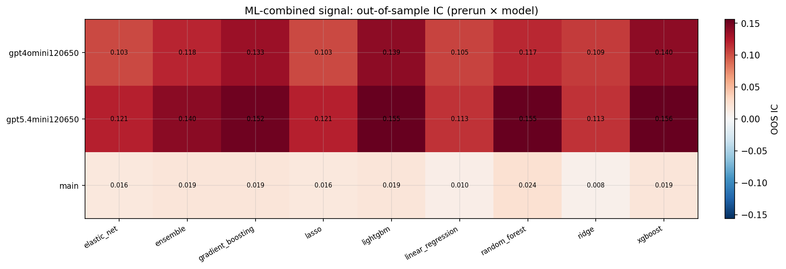

*ML-combined OOS IC (prerun × model)*

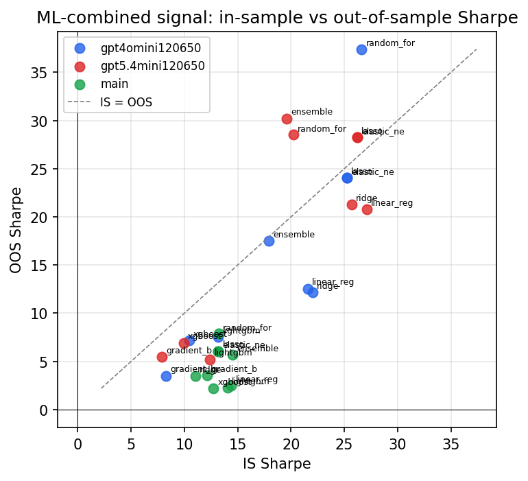

*IS vs OOS Sharpe (overfitting diagnostic)*

---
*Generated by `run_model_comparison.py`. Tables: `*.csv`; interactive: `comparison.ipynb`.*
