# Research-LLM factor comparison — `2026-06`

Comparing the **factor output of different research LLMs** on three axes (raw factor quality → factors as ML features → factors through the full agentic fund). The panel, IS/OOS split, horizon and model hyper-parameters are held identical across preruns — the *only* variable is the factor set.

## Preruns compared

| prerun | research_model | usable_factors | dropped_factors |
| --- | --- | --- | --- |
| gpt4omini120650 | gpt-4o-mini | 66 | 0 |
| gpt5.4mini120650 | gpt-5.4-mini | 69 | 0 |
| main | seed library | 78 | 10 |

> Dropped factors declare fields the current data doesn't have yet (e.g. fundamentals); they light up unchanged once that data is downloaded.

*Usable vs awaiting-data factors per research model*

## Key findings

- **Best ML-combined OOS Sharpe:** `gpt5.4mini120650` with `random_forest` (OOS Sharpe = 61.441).
- **Mean OOS Sharpe across models, by research set:** `gpt5.4mini120650` = 39.998, `gpt4omini120650` = 34.976, `main` = 32.484.
- **Highest mean single-factor |IC| (h=6):** `gpt4omini120650` (mean |IC| = 0.0336).
- **Most diverse zoo (highest effective/raw factor ratio):** `gpt5.4mini120650` (eff 52.4 of 69, ratio 0.76).
- **Best selection-deflated single-factor |IC|:** `gpt5.4mini120650` (deflated |IC| = 0.1038 from 31 factors tried).

## 1. Single-factor IC (raw factor quality)

Per-underlying time-series Spearman rank-IC of every researched factor, recomputed on the shared panel at horizons h=1, h=6, h=60. The per-underlying IC correlates each factor's value vector with the underlying's own forward-return vector (pooled across underlyings); the cross-sectional IC ranks across underlyings per timestamp.

| prerun | n_factors | mean_abs_ic_1 | mean_abs_ic_6 | mean_abs_ic_60 | mean_abs_icir_6 | best_factor_h6 | best_abs_ic_h6 |
| --- | --- | --- | --- | --- | --- | --- | --- |
| gpt4omini120650 | 66 | 0.0452 | 0.0336 | 0.017 | 1.4081 | order_flow_excitement | 0.1036 |
| gpt5.4mini120650 | 69 | 0.027 | 0.023 | 0.0122 | 1.1857 | lstm_flow_price_mismatch | 0.1122 |
| main | 78 | 0.0612 | 0.0254 | 0.0364 | 0.8241 | alpha_054 | 0.0771 |

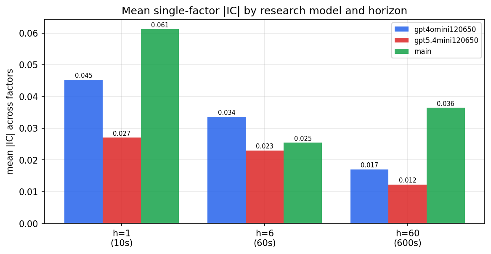

*Mean |IC| by research model and horizon*

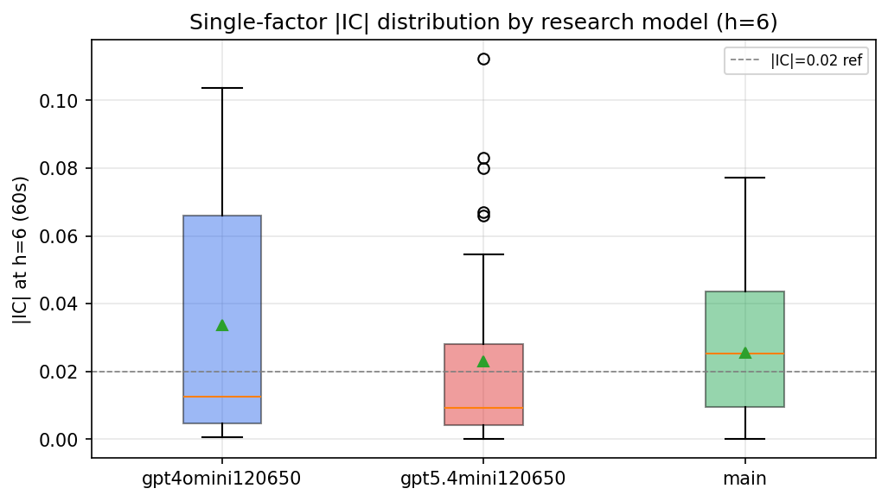

*Per-factor |IC| distribution by research model*

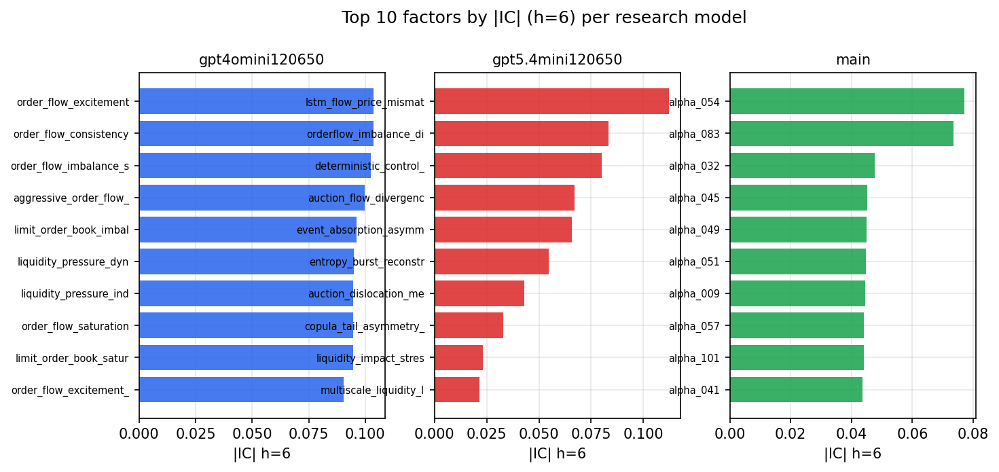

*Top factors by |IC| per research model*

## 2. Factor diversity & redundancy

Pairwise correlation of each zoo's *signals*. `eff_n_factors` is the effective number of independent factors (participation ratio of the correlation eigenvalues); `eff_ratio` and `redundancy` summarise how much unique information the zoo holds vs. how much is duplicated; `n_clusters` groups factors at |corr| ≥ 0.7.

| prerun | n_factors | eff_n_factors | eff_ratio | mean_abs_corr | n_clusters | redundancy |
| --- | --- | --- | --- | --- | --- | --- |
| gpt4omini120650 | 66 | 28.5058 | 0.4319 | 0.0474 | 52 | 0.5681 |
| gpt5.4mini120650 | 69 | 52.4005 | 0.7594 | 0.0121 | 64 | 0.2406 |
| main | 78 | 39.4127 | 0.5053 | 0.0329 | 71 | 0.4947 |

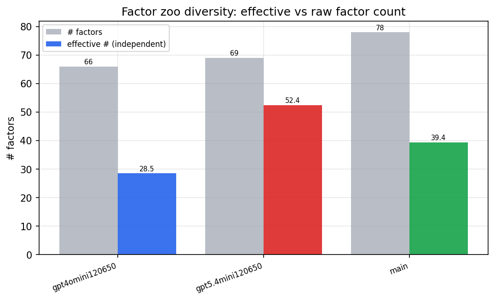

*Effective vs raw factor count per research model*

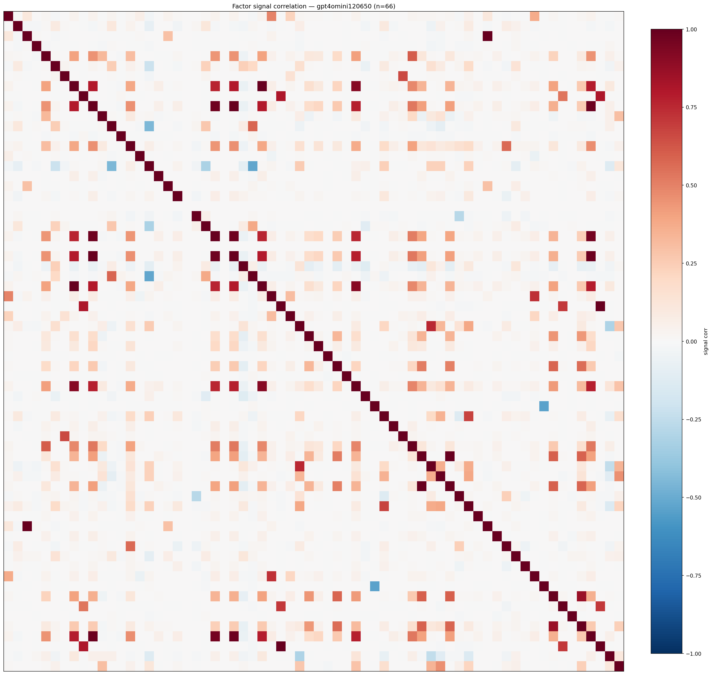

*Signal correlation matrix — gpt4omini120650*

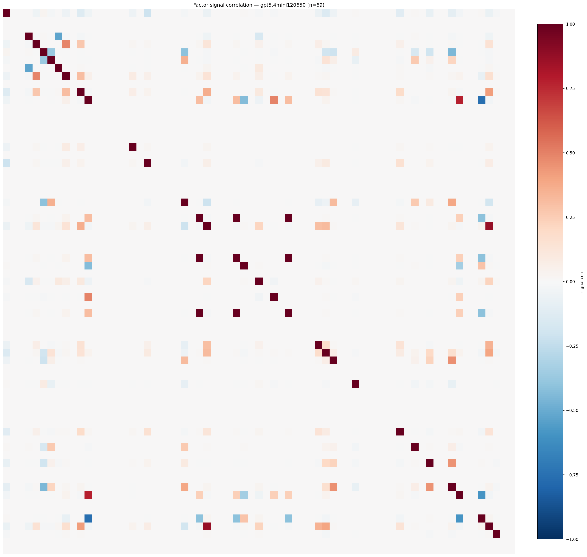

*Signal correlation matrix — gpt5.4mini120650*

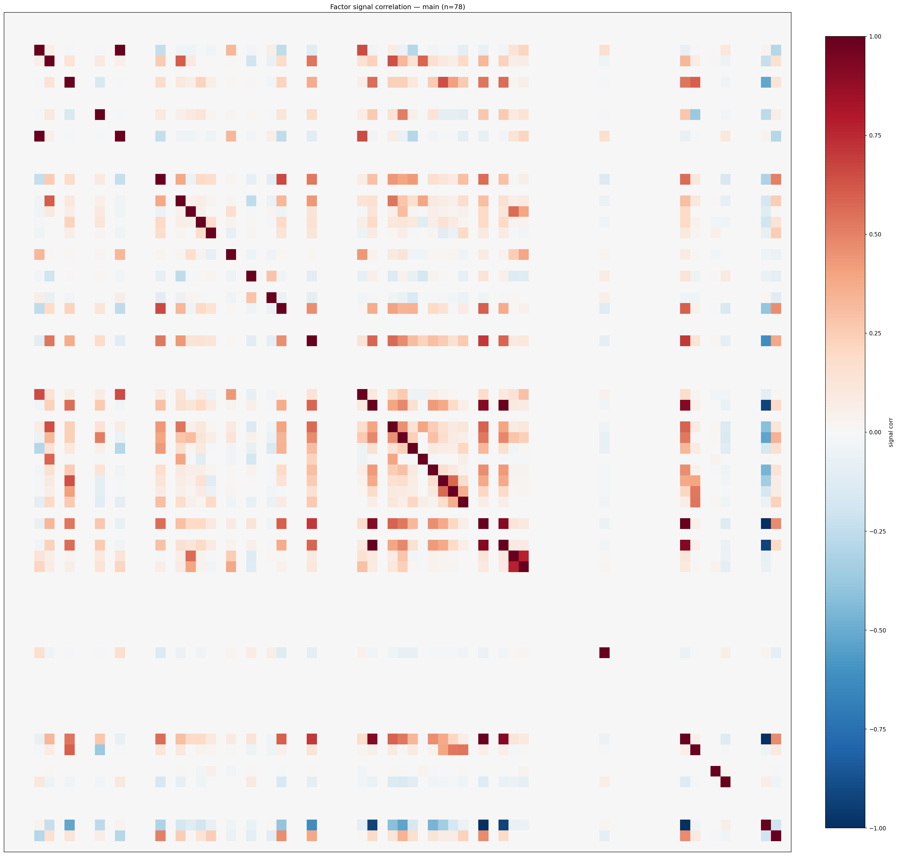

*Signal correlation matrix — main*

## 3. Deflation & model-based importance

`deflated_best_ic` haircuts each zoo's best |IC| for the number of factors tried (`ic_n_tested`) — a bigger zoo's best factor is more likely to be lucky. `lasso_n_nonzero` / `lasso_sparsity` show how many factors a sparse linear model actually keeps (model-view redundancy).

| prerun | best_ic | deflated_best_ic | deflated_best_t | ic_n_tested | ic_n_obs | lasso_n_nonzero | lasso_sparsity |
| --- | --- | --- | --- | --- | --- | --- | --- |
| gpt4omini120650 | 0.1036 | 0.0944 | 29.6079 | 64 | 98279 | 8 | 0.8788 |
| gpt5.4mini120650 | 0.1122 | 0.1038 | 32.5546 | 31 | 98279 | 21 | 0.6957 |
| main | 0.0771 | 0.0685 | 21.4712 | 37 | 98279 | 3 | 0.9615 |

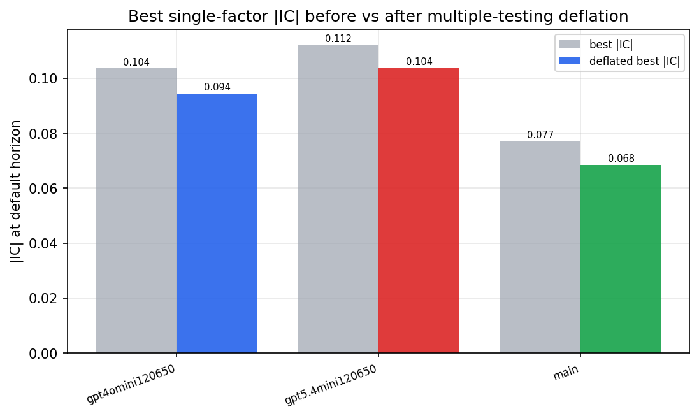

*Best |IC| before vs after multiple-testing deflation*

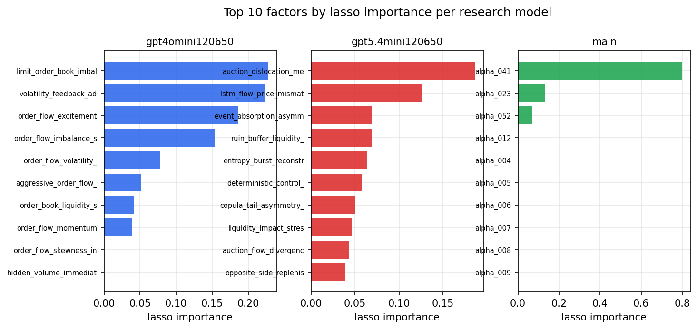

*Top factors by lasso importance per zoo*

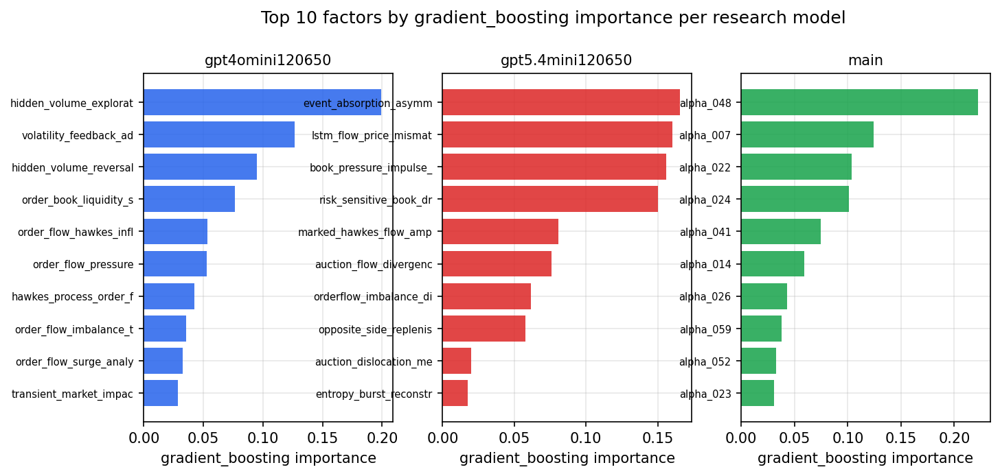

*Top factors by gradient_boosting importance per zoo*

## 4. ML-combined signal — per-underlying vectorised backtest

Each model combines a prerun's factors into ONE signal (fit `factors → forward return` on IS, predict per (bar, underlying)), then that combined signal is run through a simple vectorised backtest — `position(signal) × the underlying's own forward return` — on the held-out OOS tail (+ an equal-weight ensemble). No cross-sectional ranking.

> Config: position=**threshold** (t=1.0, z-score `expanding`), aggregation=**portfolio**, fit-standardise=**per_underlying**, horizon=6.

| prerun | model | n_factors_used | oos_ic | oos_sharpe | is_sharpe | oos_ann_return | oos_max_drawdown |
| --- | --- | --- | --- | --- | --- | --- | --- |
| gpt4omini120650 | linear_regression | 66 | 0.1144 | 41.2787 | 17.5727 | 1.7587 | -0.0022 |
| gpt4omini120650 | ridge | 66 | 0.1132 | 36.4397 | 17.5344 | 1.5853 | -0.0023 |
| gpt4omini120650 | lasso | 66 | 0.1256 | 53.5808 | 18.5656 | 1.7522 | -0.0008 |
| gpt4omini120650 | elastic_net | 66 | 0.126 | 56.061 | 18.8313 | 1.8596 | -0.0008 |
| gpt4omini120650 | random_forest | 66 | 0.1322 | 55.7566 | 19.49 | 1.7232 | -0.001 |
| gpt4omini120650 | gradient_boosting | 66 | 0.1298 | 7.8781 | 9.6837 | 0.0955 | -0.0005 |
| gpt4omini120650 | xgboost | 66 | 0.138 | 9.9048 | 12.5833 | 0.1912 | -0.0005 |
| gpt4omini120650 | lightgbm | 66 | 0.1525 | 3.7145 | 14.6705 | 0.084 | -0.001 |
| gpt4omini120650 | ensemble | 66 | 0.1308 | 50.1658 | 18.9212 | 1.5261 | -0.0011 |
| gpt5.4mini120650 | linear_regression | 69 | 0.1197 | 40.9737 | 23.9005 | 1.2515 | -0.001 |
| gpt5.4mini120650 | ridge | 69 | 0.1184 | 42.5078 | 24.5289 | 1.329 | -0.0011 |
| gpt5.4mini120650 | lasso | 69 | 0.1204 | 36.4075 | 27.1818 | 1.1917 | -0.0013 |
| gpt5.4mini120650 | elastic_net | 69 | 0.1198 | 40.9418 | 27.3094 | 1.3347 | -0.0012 |
| gpt5.4mini120650 | random_forest | 69 | 0.1456 | 61.4415 | 25.1619 | 2.6689 | -0.0014 |
| gpt5.4mini120650 | gradient_boosting | 69 | 0.1453 | 24.9269 | 15.6015 | 0.4235 | -0.0006 |
| gpt5.4mini120650 | xgboost | 69 | 0.1431 | 43.1113 | 17.8253 | 1.3817 | -0.0012 |
| gpt5.4mini120650 | lightgbm | 69 | 0.1406 | 13.6424 | 13.9306 | 0.2332 | -0.0011 |
| gpt5.4mini120650 | ensemble | 69 | 0.1414 | 56.0307 | 21.4579 | 2.0621 | -0.0008 |
| main | linear_regression | 78 | 0.068 | 36.7587 | 9.1254 | 0.8709 | -0.001 |
| main | ridge | 78 | 0.0607 | 45.0201 | 9.7404 | 1.2771 | -0.0011 |
| main | lasso | 78 | 0.0504 | 31.624 | 15.6947 | 0.9493 | -0.0013 |
| main | elastic_net | 78 | 0.0487 | 31.624 | 15.3584 | 0.9493 | -0.0013 |
| main | random_forest | 78 | 0.0717 | 8.218 | 10.5668 | 0.1734 | -0.0012 |
| main | gradient_boosting | 78 | 0.0806 | 32.0199 | 8.8717 | 0.6085 | -0.0009 |
| main | xgboost | 78 | 0.0877 | 27.7935 | 8.9227 | 0.3221 | -0.0004 |
| main | lightgbm | 78 | 0.0763 | 30.238 | 12.6775 | 0.5372 | -0.0008 |
| main | ensemble | 78 | 0.0703 | 49.0563 | 11.7488 | 1.2173 | -0.0007 |

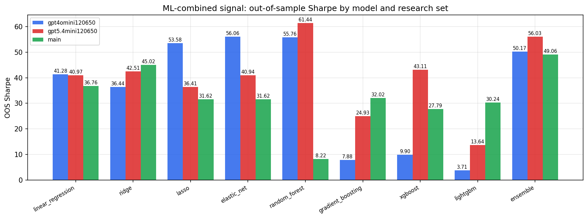

*ML-combined OOS Sharpe by model and research set*

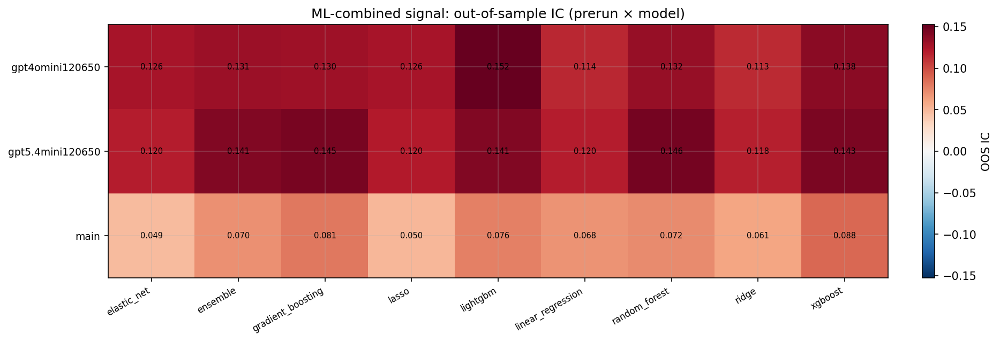

*ML-combined OOS IC (prerun × model)*

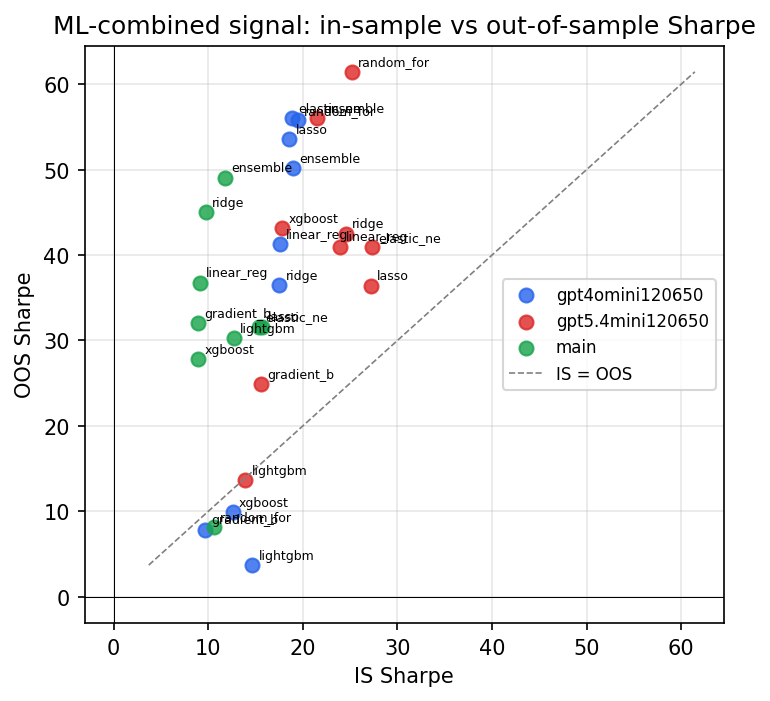

*IS vs OOS Sharpe (overfitting diagnostic)*

---
*Generated by `run_model_comparison.py`. Tables: `*.csv`; interactive: `comparison.ipynb`.*
