# Research-LLM factor comparison — `2024-03`

Comparing the **factor output of different research LLMs** on three axes (raw factor quality → factors as ML features → factors through the full agentic fund). The panel, IS/OOS split, horizon and model hyper-parameters are held identical across preruns — the *only* variable is the factor set.

## Preruns compared

| prerun | research_model | usable_factors | dropped_factors |
| --- | --- | --- | --- |
| gpt4omini120650 | gpt-4o-mini | 66 | 0 |
| gpt5.4mini120650 | gpt-5.4-mini | 69 | 0 |
| main | seed library | 78 | 10 |

> Dropped factors declare fields the current data doesn't have yet (e.g. fundamentals); they light up unchanged once that data is downloaded.

*Usable vs awaiting-data factors per research model*

## Key findings

- **Best ML-combined OOS Sharpe:** `main` with `ridge` (OOS Sharpe = 1.414).
- **Mean OOS Sharpe across models, by research set:** `main` = -2.630, `gpt4omini120650` = -3.491, `gpt5.4mini120650` = -3.685.
- **Highest mean single-factor |IC| (h=6):** `main` (mean |IC| = 0.0097).
- **Most diverse zoo (highest effective/raw factor ratio):** `gpt5.4mini120650` (eff 53.5 of 69, ratio 0.78).
- **Best selection-deflated single-factor |IC|:** `main` (deflated |IC| = 0.0263 from 38 factors tried).

## 1. Single-factor IC (raw factor quality)

Per-underlying time-series Spearman rank-IC of every researched factor, recomputed on the shared panel at horizons h=1, h=6, h=60. The per-underlying IC correlates each factor's value vector with the underlying's own forward-return vector (pooled across underlyings); the cross-sectional IC ranks across underlyings per timestamp.

| prerun | n_factors | mean_abs_ic_1 | mean_abs_ic_6 | mean_abs_ic_60 | mean_abs_icir_6 | best_factor_h6 | best_abs_ic_h6 |
| --- | --- | --- | --- | --- | --- | --- | --- |
| gpt4omini120650 | 66 | 0.0052 | 0.0047 | 0.0038 | 0.284 | limit_order_book_imbalance_surge | 0.018 |
| gpt5.4mini120650 | 69 | 0.0049 | 0.0044 | 0.0061 | 0.2645 | auction_dislocation_mean_reversion | 0.0156 |
| main | 78 | 0.0088 | 0.0097 | 0.0049 | 0.4763 | alpha_066 | 0.0334 |

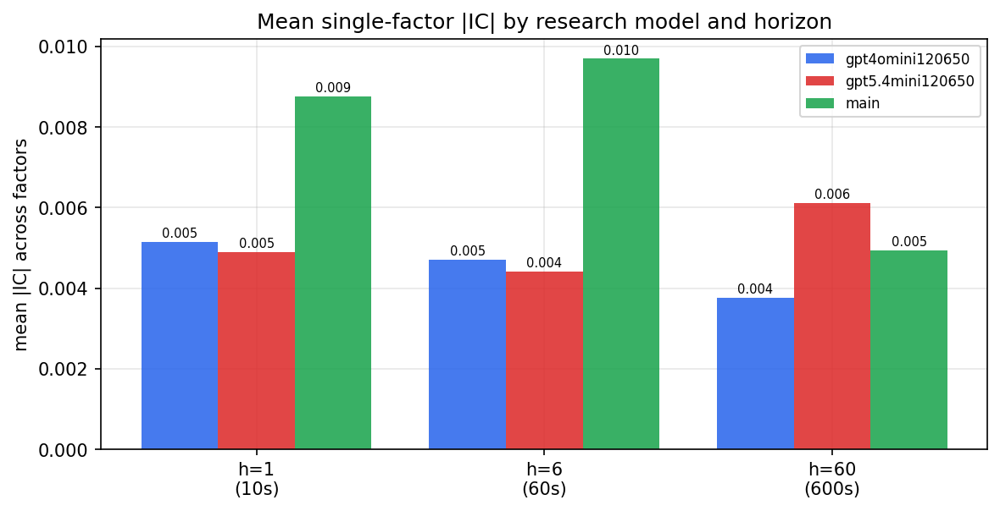

*Mean |IC| by research model and horizon*

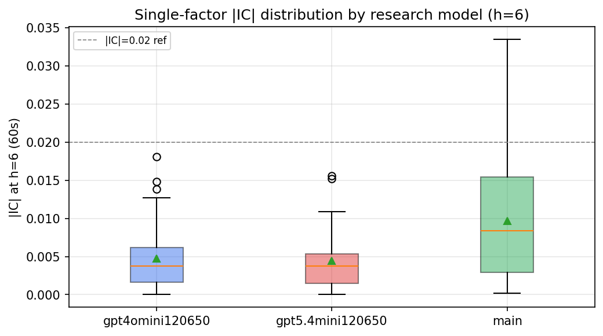

*Per-factor |IC| distribution by research model*

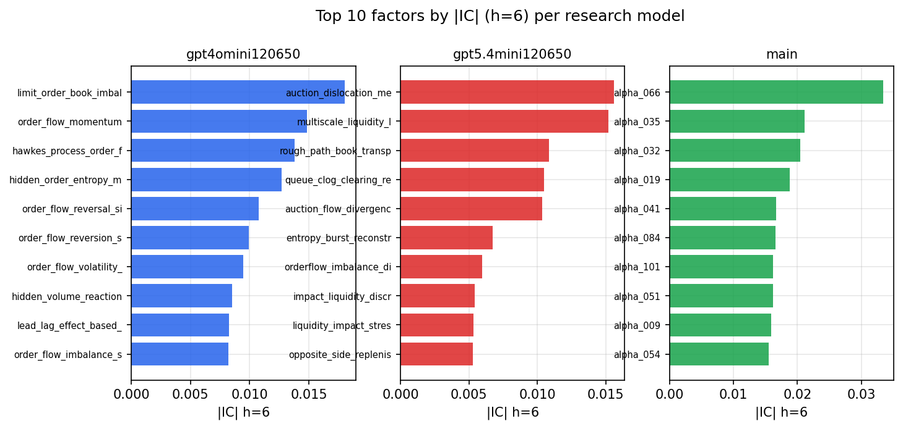

*Top factors by |IC| per research model*

## 2. Factor diversity & redundancy

Pairwise correlation of each zoo's *signals*. `eff_n_factors` is the effective number of independent factors (participation ratio of the correlation eigenvalues); `eff_ratio` and `redundancy` summarise how much unique information the zoo holds vs. how much is duplicated; `n_clusters` groups factors at |corr| ≥ 0.7.

| prerun | n_factors | eff_n_factors | eff_ratio | mean_abs_corr | n_clusters | redundancy |
| --- | --- | --- | --- | --- | --- | --- |
| gpt4omini120650 | 66 | 27.2663 | 0.4131 | 0.0497 | 52 | 0.5869 |
| gpt5.4mini120650 | 69 | 53.4753 | 0.775 | 0.0112 | 64 | 0.225 |
| main | 78 | 43.4582 | 0.5572 | 0.0273 | 70 | 0.4428 |

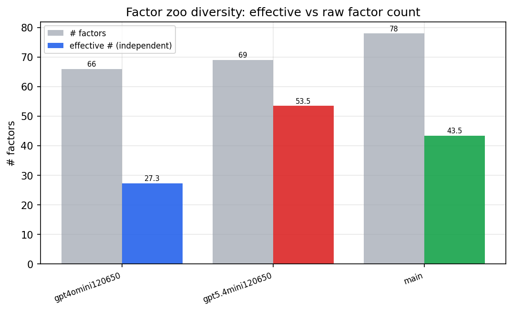

*Effective vs raw factor count per research model*

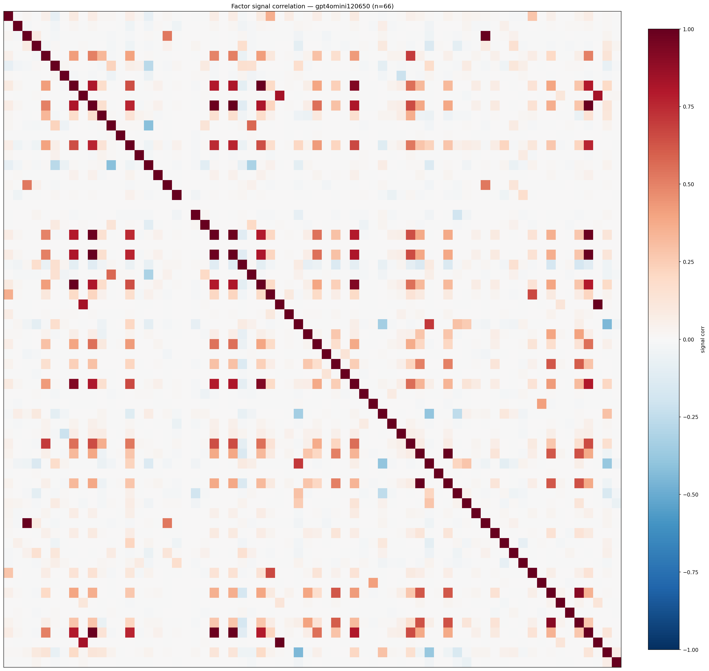

*Signal correlation matrix — gpt4omini120650*

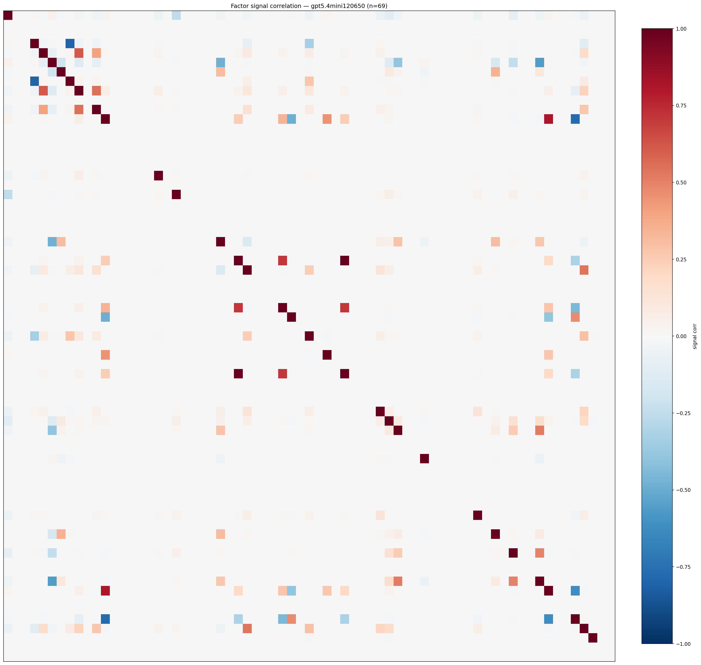

*Signal correlation matrix — gpt5.4mini120650*

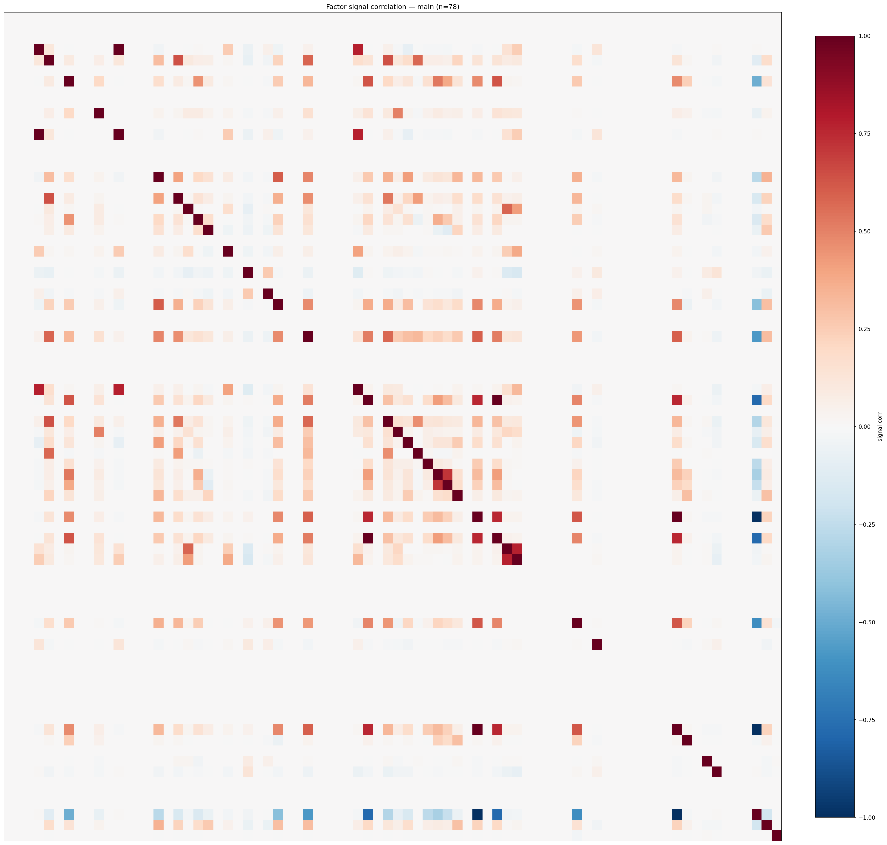

*Signal correlation matrix — main*

## 3. Deflation & model-based importance

`deflated_best_ic` haircuts each zoo's best |IC| for the number of factors tried (`ic_n_tested`) — a bigger zoo's best factor is more likely to be lucky. `lasso_n_nonzero` / `lasso_sparsity` show how many factors a sparse linear model actually keeps (model-view redundancy).

| prerun | best_ic | deflated_best_ic | deflated_best_t | ic_n_tested | ic_n_obs | lasso_n_nonzero | lasso_sparsity |
| --- | --- | --- | --- | --- | --- | --- | --- |
| gpt4omini120650 | 0.018 | 0.0104 | 3.9351 | 64 | 142739 | 0 | 1.0 |
| gpt5.4mini120650 | 0.0156 | 0.0087 | 3.2734 | 31 | 142739 | 0 | 1.0 |
| main | 0.0334 | 0.0263 | 9.9329 | 38 | 142739 | 0 | 1.0 |

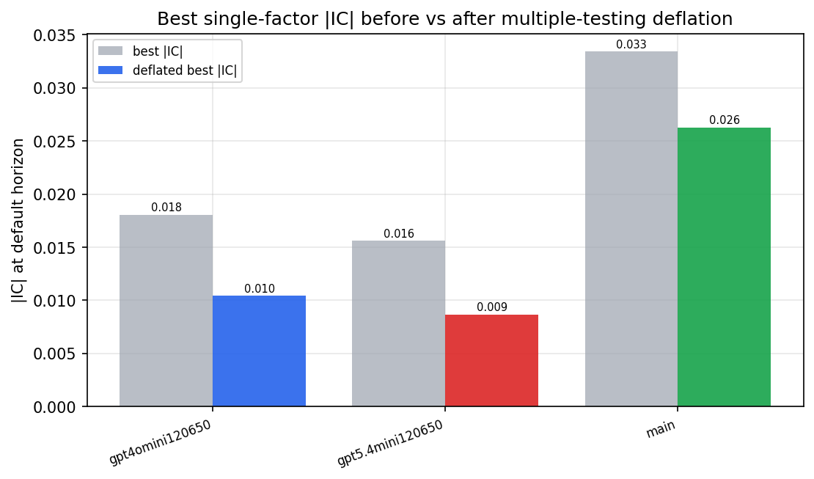

*Best |IC| before vs after multiple-testing deflation*

*Top factors by lasso importance per zoo*

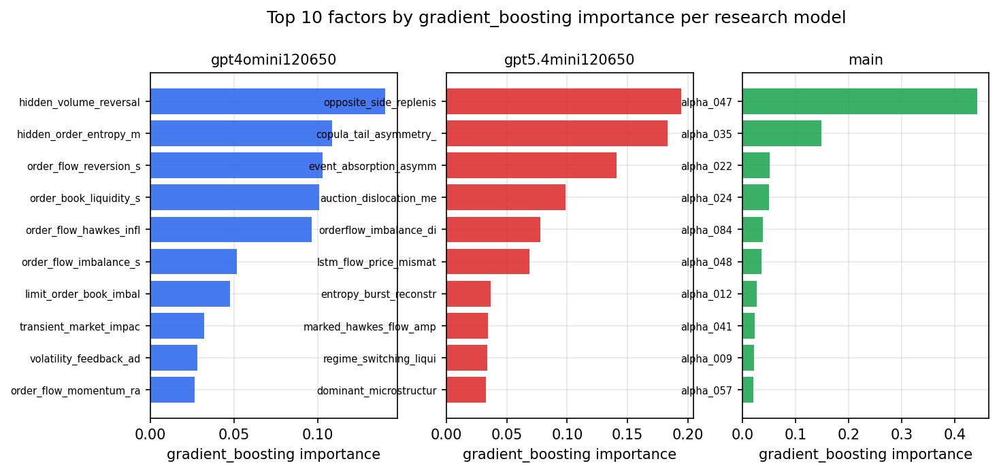

*Top factors by gradient_boosting importance per zoo*

## 4. ML-combined signal — per-underlying vectorised backtest

Each model combines a prerun's factors into ONE signal (fit `factors → forward return` on IS, predict per (bar, underlying)), then that combined signal is run through a simple vectorised backtest — `position(signal) × the underlying's own forward return` — on the held-out OOS tail (+ an equal-weight ensemble). No cross-sectional ranking.

> Config: position=**threshold** (t=1.0, z-score `expanding`), aggregation=**portfolio**, fit-standardise=**per_underlying**, horizon=6.

| prerun | model | n_factors_used | oos_ic | oos_sharpe | is_sharpe | oos_ann_return | oos_max_drawdown |
| --- | --- | --- | --- | --- | --- | --- | --- |
| gpt4omini120650 | linear_regression | 66 | -0.0077 | -6.3085 | 11.5566 | -0.385 | -0.037 |
| gpt4omini120650 | ridge | 66 | -0.0117 | -2.4112 | 12.0368 | -0.1544 | -0.0266 |
| gpt4omini120650 | lasso | 66 | nan | nan | nan | nan | nan |
| gpt4omini120650 | elastic_net | 66 | nan | nan | nan | nan | nan |
| gpt4omini120650 | random_forest | 66 | -0.0047 | -3.3671 | 11.4344 | -0.1567 | -0.018 |
| gpt4omini120650 | gradient_boosting | 66 | -0.0081 | -1.2438 | 10.0281 | -0.0321 | -0.0089 |
| gpt4omini120650 | xgboost | 66 | -0.0004 | -4.6484 | 12.0349 | -0.1739 | -0.0165 |
| gpt4omini120650 | lightgbm | 66 | -0.0018 | -0.7417 | 14.991 | -0.0233 | -0.0105 |
| gpt4omini120650 | ensemble | 66 | -0.0095 | -5.7187 | 12.9425 | -0.2272 | -0.0204 |
| gpt5.4mini120650 | linear_regression | 69 | -0.0032 | 0.3466 | 6.9628 | 0.0209 | -0.0185 |
| gpt5.4mini120650 | ridge | 69 | -0.0046 | 0.2776 | 6.7034 | 0.0167 | -0.0193 |
| gpt5.4mini120650 | lasso | 69 | nan | nan | nan | nan | nan |
| gpt5.4mini120650 | elastic_net | 69 | nan | nan | nan | nan | nan |
| gpt5.4mini120650 | random_forest | 69 | -0.0031 | -4.6519 | 11.2839 | -0.204 | -0.0195 |
| gpt5.4mini120650 | gradient_boosting | 69 | -0.0046 | -5.2524 | 10.3181 | -0.0895 | -0.0088 |
| gpt5.4mini120650 | xgboost | 69 | -0.0058 | -5.5852 | 12.0161 | -0.2114 | -0.021 |
| gpt5.4mini120650 | lightgbm | 69 | -0.0057 | -4.7732 | 16.6017 | -0.1493 | -0.0144 |
| gpt5.4mini120650 | ensemble | 69 | 0.0002 | -6.1563 | 12.4796 | -0.3127 | -0.0301 |
| main | linear_regression | 78 | -0.0103 | 0.8817 | 10.9549 | 0.049 | -0.015 |
| main | ridge | 78 | -0.0074 | 1.414 | 11.5612 | 0.0786 | -0.0131 |
| main | lasso | 78 | nan | nan | nan | nan | nan |
| main | elastic_net | 78 | nan | nan | nan | nan | nan |
| main | random_forest | 78 | 0.0015 | -4.9761 | 15.4196 | -0.2948 | -0.0308 |
| main | gradient_boosting | 78 | -0.0041 | -5.9255 | 14.0141 | -0.3214 | -0.0347 |
| main | xgboost | 78 | -0.0007 | -4.0757 | 15.9058 | -0.2051 | -0.0299 |
| main | lightgbm | 78 | -0.0012 | -1.7913 | 16.8314 | -0.0568 | -0.0136 |
| main | ensemble | 78 | -0.0057 | -3.9395 | 10.7622 | -0.0696 | -0.0101 |

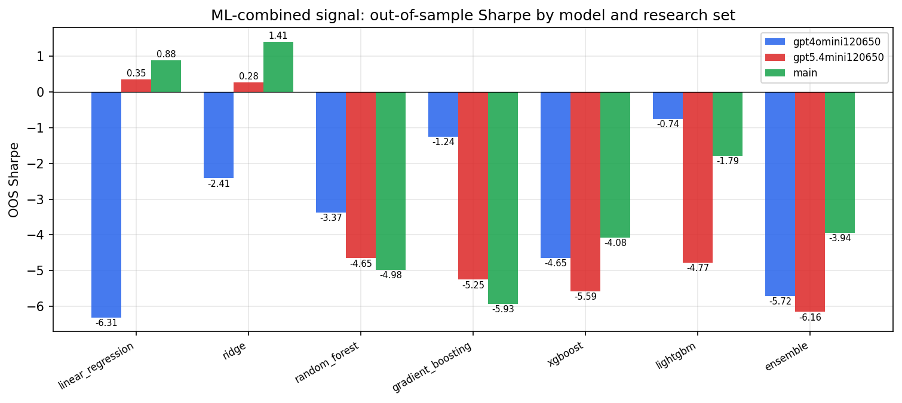

*ML-combined OOS Sharpe by model and research set*

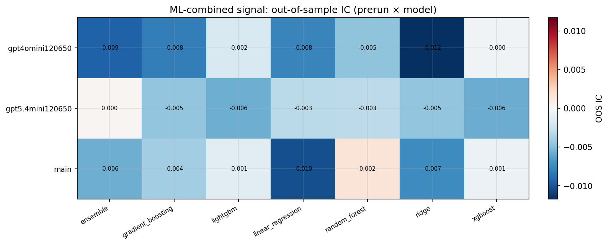

*ML-combined OOS IC (prerun × model)*

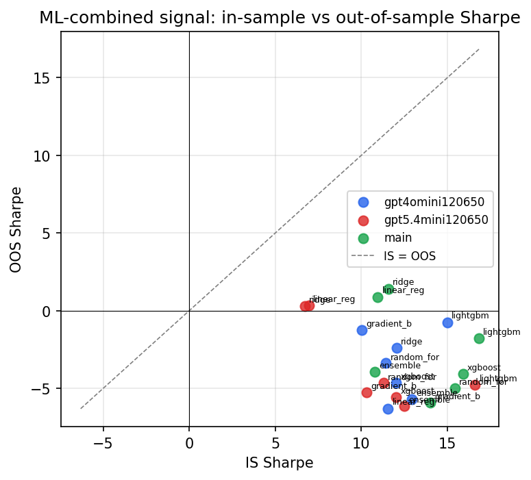

*IS vs OOS Sharpe (overfitting diagnostic)*

---
*Generated by `run_model_comparison.py`. Tables: `*.csv`; interactive: `comparison.ipynb`.*
