# Research-LLM factor comparison — `2024-04`

Comparing the **factor output of different research LLMs** on three axes (raw factor quality → factors as ML features → factors through the full agentic fund). The panel, IS/OOS split, horizon and model hyper-parameters are held identical across preruns — the *only* variable is the factor set.

## Preruns compared

| prerun | research_model | usable_factors | dropped_factors |
| --- | --- | --- | --- |
| gpt4omini120650 | gpt-4o-mini | 66 | 0 |
| gpt5.4mini120650 | gpt-5.4-mini | 69 | 0 |
| main | seed library | 78 | 10 |

> Dropped factors declare fields the current data doesn't have yet (e.g. fundamentals); they light up unchanged once that data is downloaded.

*Usable vs awaiting-data factors per research model*

## Key findings

- **Best ML-combined OOS Sharpe:** `main` with `lightgbm` (OOS Sharpe = 4.982).
- **Mean OOS Sharpe across models, by research set:** `gpt4omini120650` = 0.469, `main` = 0.464, `gpt5.4mini120650` = -1.959.
- **Highest mean single-factor |IC| (h=6):** `main` (mean |IC| = 0.0054).
- **Most diverse zoo (highest effective/raw factor ratio):** `gpt5.4mini120650` (eff 52.3 of 69, ratio 0.76).
- **Best selection-deflated single-factor |IC|:** `gpt5.4mini120650` (deflated |IC| = 0.0068 from 31 factors tried).

## 1. Single-factor IC (raw factor quality)

Per-underlying time-series Spearman rank-IC of every researched factor, recomputed on the shared panel at horizons h=1, h=6, h=60. The per-underlying IC correlates each factor's value vector with the underlying's own forward-return vector (pooled across underlyings); the cross-sectional IC ranks across underlyings per timestamp.

| prerun | n_factors | mean_abs_ic_1 | mean_abs_ic_6 | mean_abs_ic_60 | mean_abs_icir_6 | best_factor_h6 | best_abs_ic_h6 |
| --- | --- | --- | --- | --- | --- | --- | --- |
| gpt4omini120650 | 66 | 0.0051 | 0.0036 | 0.006 | 0.2213 | order_flow_volatility_spread | 0.014 |
| gpt5.4mini120650 | 69 | 0.0046 | 0.0038 | 0.0065 | 0.241 | auction_reversion_anchor_gap | 0.0136 |
| main | 78 | 0.0056 | 0.0054 | 0.0039 | 0.3011 | alpha_052 | 0.0104 |

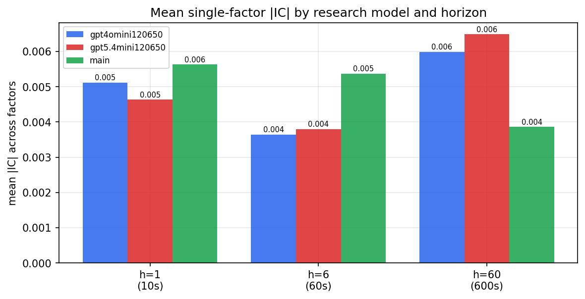

*Mean |IC| by research model and horizon*

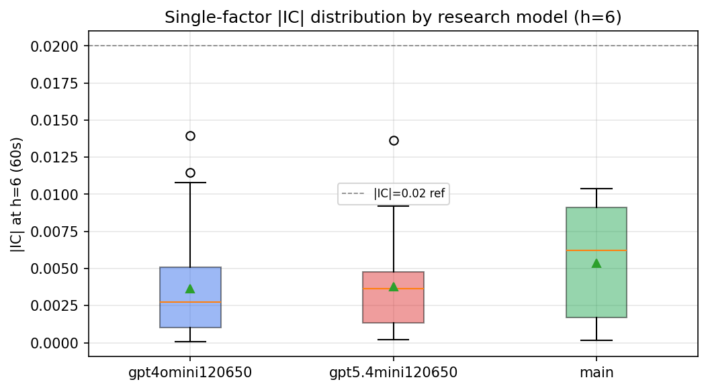

*Per-factor |IC| distribution by research model*

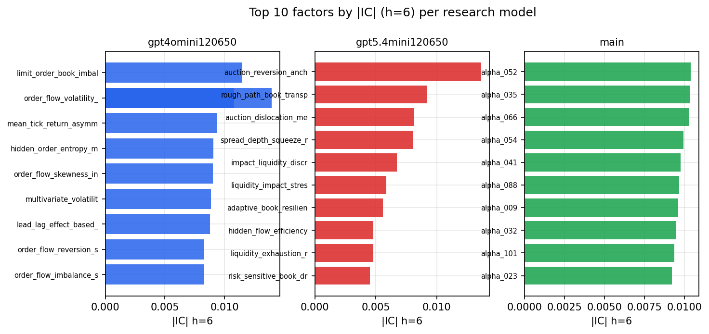

*Top factors by |IC| per research model*

## 2. Factor diversity & redundancy

Pairwise correlation of each zoo's *signals*. `eff_n_factors` is the effective number of independent factors (participation ratio of the correlation eigenvalues); `eff_ratio` and `redundancy` summarise how much unique information the zoo holds vs. how much is duplicated; `n_clusters` groups factors at |corr| ≥ 0.7.

| prerun | n_factors | eff_n_factors | eff_ratio | mean_abs_corr | n_clusters | redundancy |
| --- | --- | --- | --- | --- | --- | --- |
| gpt4omini120650 | 66 | 26.8305 | 0.4065 | 0.0519 | 51 | 0.5935 |
| gpt5.4mini120650 | 69 | 52.2692 | 0.7575 | 0.0114 | 62 | 0.2425 |
| main | 78 | 43.3628 | 0.5559 | 0.0273 | 70 | 0.4441 |

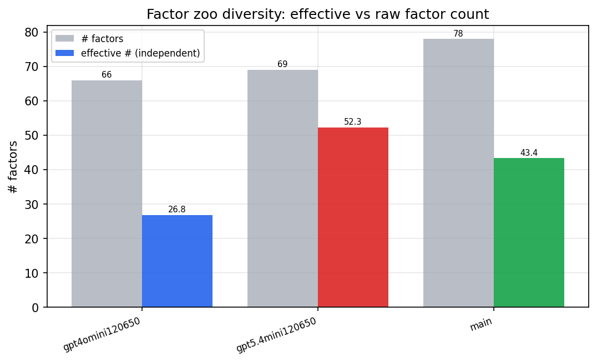

*Effective vs raw factor count per research model*

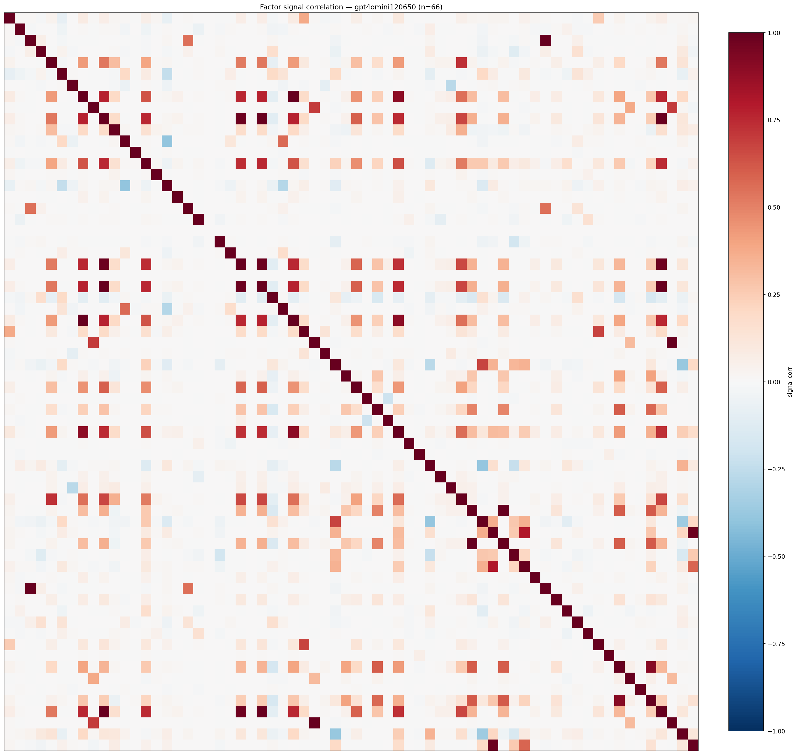

*Signal correlation matrix — gpt4omini120650*

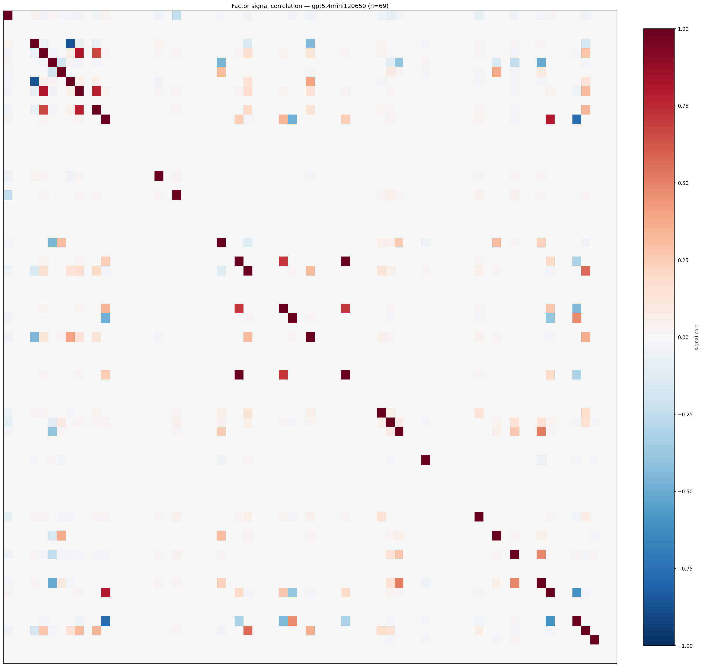

*Signal correlation matrix — gpt5.4mini120650*

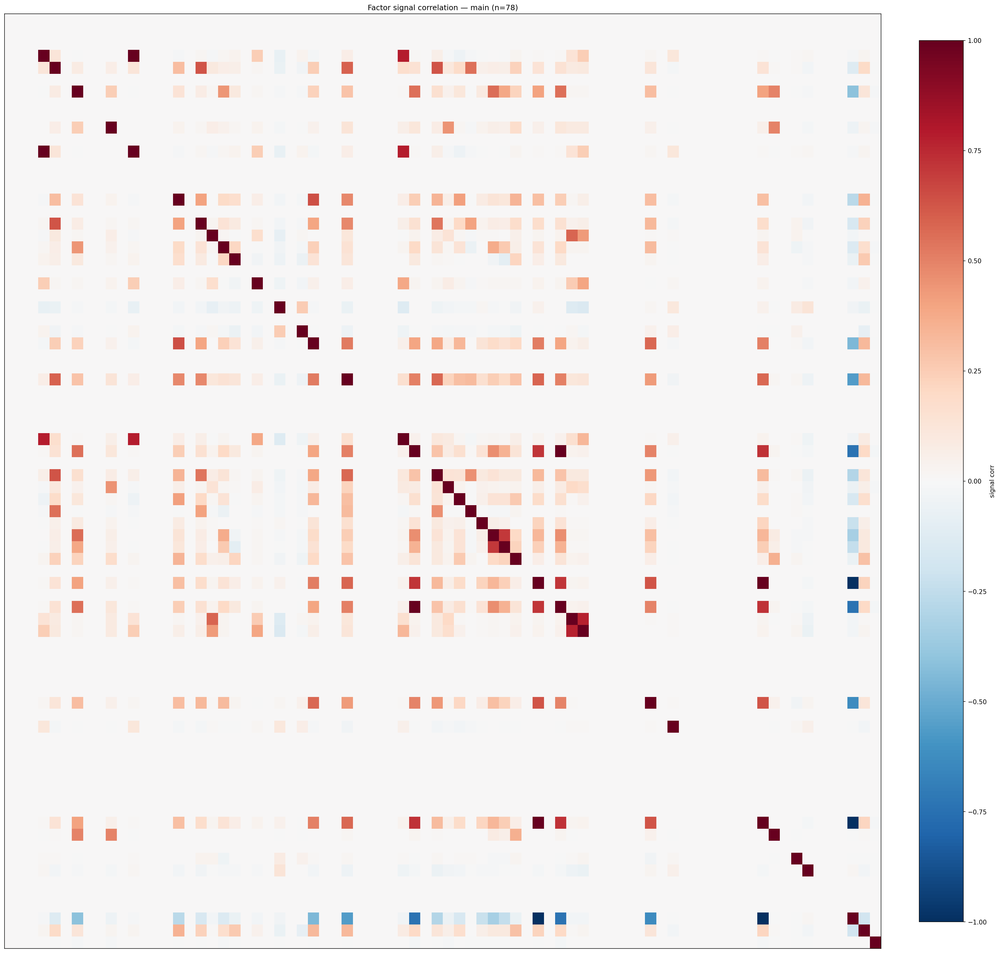

*Signal correlation matrix — main*

## 3. Deflation & model-based importance

`deflated_best_ic` haircuts each zoo's best |IC| for the number of factors tried (`ic_n_tested`) — a bigger zoo's best factor is more likely to be lucky. `lasso_n_nonzero` / `lasso_sparsity` show how many factors a sparse linear model actually keeps (model-view redundancy).

| prerun | best_ic | deflated_best_ic | deflated_best_t | ic_n_tested | ic_n_obs | lasso_n_nonzero | lasso_sparsity |
| --- | --- | --- | --- | --- | --- | --- | --- |
| gpt4omini120650 | 0.014 | 0.0064 | 2.4318 | 64 | 145079 | 0 | 1.0 |
| gpt5.4mini120650 | 0.0136 | 0.0068 | 2.5734 | 31 | 145079 | 0 | 1.0 |
| main | 0.0104 | 0.0033 | 1.2547 | 38 | 145079 | 0 | 1.0 |

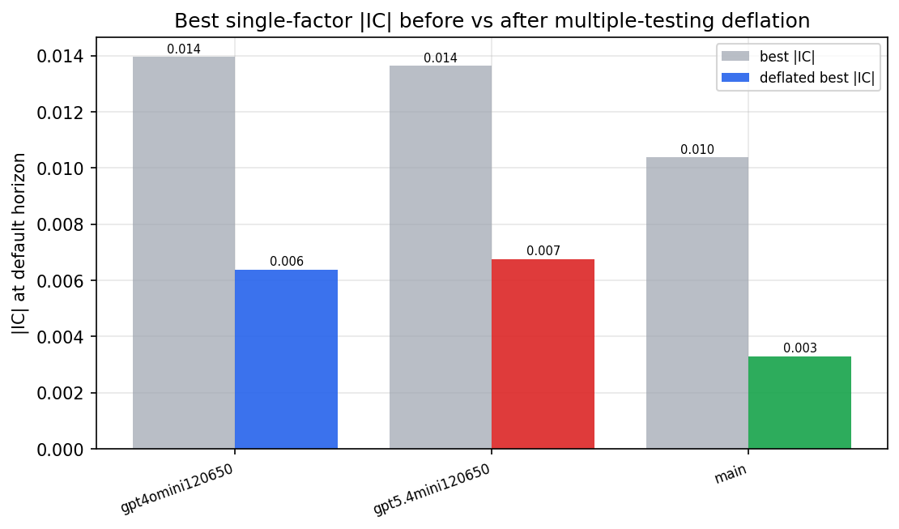

*Best |IC| before vs after multiple-testing deflation*

*Top factors by lasso importance per zoo*

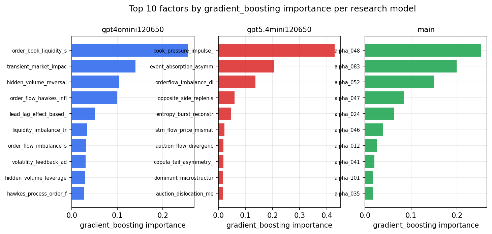

*Top factors by gradient_boosting importance per zoo*

## 4. ML-combined signal — per-underlying vectorised backtest

Each model combines a prerun's factors into ONE signal (fit `factors → forward return` on IS, predict per (bar, underlying)), then that combined signal is run through a simple vectorised backtest — `position(signal) × the underlying's own forward return` — on the held-out OOS tail (+ an equal-weight ensemble). No cross-sectional ranking.

> Config: position=**threshold** (t=1.0, z-score `expanding`), aggregation=**portfolio**, fit-standardise=**per_underlying**, horizon=6.

| prerun | model | n_factors_used | oos_ic | oos_sharpe | is_sharpe | oos_ann_return | oos_max_drawdown |
| --- | --- | --- | --- | --- | --- | --- | --- |
| gpt4omini120650 | linear_regression | 66 | -0.0032 | -3.1472 | 8.2281 | -0.0508 | -0.0074 |
| gpt4omini120650 | ridge | 66 | -0.0028 | -0.0182 | 6.9553 | -0.0004 | -0.0055 |
| gpt4omini120650 | lasso | 66 | nan | nan | nan | nan | nan |
| gpt4omini120650 | elastic_net | 66 | nan | nan | nan | nan | nan |
| gpt4omini120650 | random_forest | 66 | 0.0011 | 1.8468 | 10.3605 | 0.1552 | -0.0248 |
| gpt4omini120650 | gradient_boosting | 66 | -0.0007 | 2.5944 | 13.3418 | 0.1559 | -0.0203 |
| gpt4omini120650 | xgboost | 66 | 0.003 | 1.3513 | 14.8687 | 0.0855 | -0.0189 |
| gpt4omini120650 | lightgbm | 66 | -0.0012 | -1.1883 | 20.5356 | -0.0762 | -0.0205 |
| gpt4omini120650 | ensemble | 66 | 0.0011 | 1.8473 | 16.4639 | 0.1437 | -0.0248 |
| gpt5.4mini120650 | linear_regression | 69 | -0.01 | -2.2318 | 8.2042 | -0.1818 | -0.0275 |
| gpt5.4mini120650 | ridge | 69 | -0.0109 | -2.7945 | 7.705 | -0.2255 | -0.0291 |
| gpt5.4mini120650 | lasso | 69 | nan | nan | nan | nan | nan |
| gpt5.4mini120650 | elastic_net | 69 | nan | nan | nan | nan | nan |
| gpt5.4mini120650 | random_forest | 69 | -0.0083 | -1.5009 | 11.3314 | -0.1179 | -0.0235 |
| gpt5.4mini120650 | gradient_boosting | 69 | -0.0095 | -1.4178 | 8.1703 | -0.0554 | -0.0136 |
| gpt5.4mini120650 | xgboost | 69 | -0.0088 | -2.1063 | 13.5637 | -0.1244 | -0.0167 |
| gpt5.4mini120650 | lightgbm | 69 | -0.0053 | -0.54 | 19.9384 | -0.0269 | -0.018 |
| gpt5.4mini120650 | ensemble | 69 | -0.0075 | -3.123 | 14.5325 | -0.273 | -0.0349 |
| main | linear_regression | 78 | -0.0094 | -7.4657 | 7.7069 | -0.3299 | -0.0348 |
| main | ridge | 78 | -0.0075 | -7.467 | 8.1002 | -0.3462 | -0.0367 |
| main | lasso | 78 | nan | nan | nan | nan | nan |
| main | elastic_net | 78 | nan | nan | nan | nan | nan |
| main | random_forest | 78 | 0.0005 | 2.1381 | 11.4368 | 0.2869 | -0.0336 |
| main | gradient_boosting | 78 | 0.0029 | 3.0334 | 12.2997 | 0.2439 | -0.0186 |
| main | xgboost | 78 | 0.0006 | 3.6316 | 17.2417 | 0.3053 | -0.0196 |
| main | lightgbm | 78 | 0.0088 | 4.9818 | 24.0035 | 0.3722 | -0.0118 |
| main | ensemble | 78 | 0.0061 | 4.3989 | 17.7515 | 0.4654 | -0.0295 |

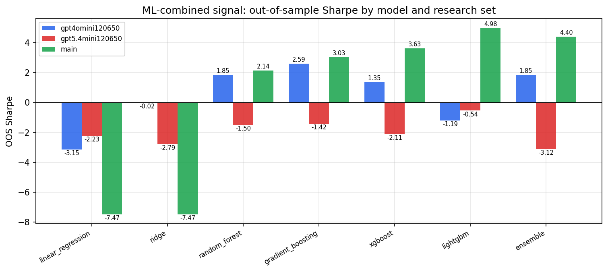

*ML-combined OOS Sharpe by model and research set*

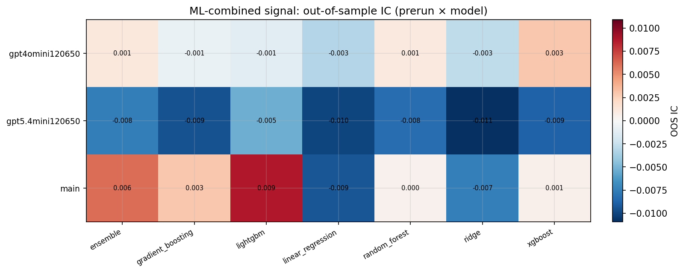

*ML-combined OOS IC (prerun × model)*

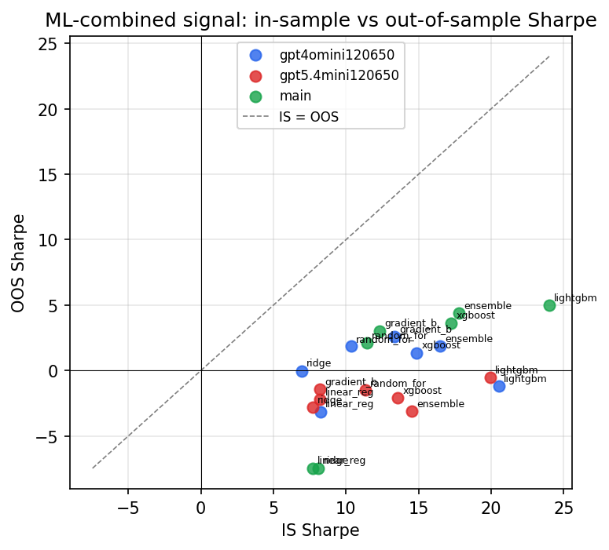

*IS vs OOS Sharpe (overfitting diagnostic)*

---
*Generated by `run_model_comparison.py`. Tables: `*.csv`; interactive: `comparison.ipynb`.*
