# Research-LLM factor comparison — `2024-06`

Comparing the **factor output of different research LLMs** on three axes (raw factor quality → factors as ML features → factors through the full agentic fund). The panel, IS/OOS split, horizon and model hyper-parameters are held identical across preruns — the *only* variable is the factor set.

## Preruns compared

| prerun | research_model | usable_factors | dropped_factors |
| --- | --- | --- | --- |
| gpt4omini120650 | gpt-4o-mini | 66 | 0 |
| gpt5.4mini120650 | gpt-5.4-mini | 69 | 0 |
| main | seed library | 78 | 10 |

> Dropped factors declare fields the current data doesn't have yet (e.g. fundamentals); they light up unchanged once that data is downloaded.

*Usable vs awaiting-data factors per research model*

## Key findings

- **Best ML-combined OOS Sharpe:** `gpt4omini120650` with `ensemble` (OOS Sharpe = 6.263).
- **Mean OOS Sharpe across models, by research set:** `gpt4omini120650` = 2.755, `main` = 1.993, `gpt5.4mini120650` = -1.279.
- **Highest mean single-factor |IC| (h=6):** `main` (mean |IC| = 0.0056).
- **Most diverse zoo (highest effective/raw factor ratio):** `gpt5.4mini120650` (eff 52.5 of 69, ratio 0.76).
- **Best selection-deflated single-factor |IC|:** `main` (deflated |IC| = 0.0135 from 38 factors tried).

## 1. Single-factor IC (raw factor quality)

Per-underlying time-series Spearman rank-IC of every researched factor, recomputed on the shared panel at horizons h=1, h=6, h=60. The per-underlying IC correlates each factor's value vector with the underlying's own forward-return vector (pooled across underlyings); the cross-sectional IC ranks across underlyings per timestamp.

| prerun | n_factors | mean_abs_ic_1 | mean_abs_ic_6 | mean_abs_ic_60 | mean_abs_icir_6 | best_factor_h6 | best_abs_ic_h6 |
| --- | --- | --- | --- | --- | --- | --- | --- |
| gpt4omini120650 | 66 | 0.0064 | 0.0044 | 0.0072 | 0.2905 | order_flow_momentum | 0.0119 |
| gpt5.4mini120650 | 69 | 0.0039 | 0.0033 | 0.0081 | 0.2111 | liquidity_impact_stress_ratio | 0.0097 |
| main | 78 | 0.0023 | 0.0056 | 0.0057 | 0.3075 | rsi_mean_reversion | 0.0205 |

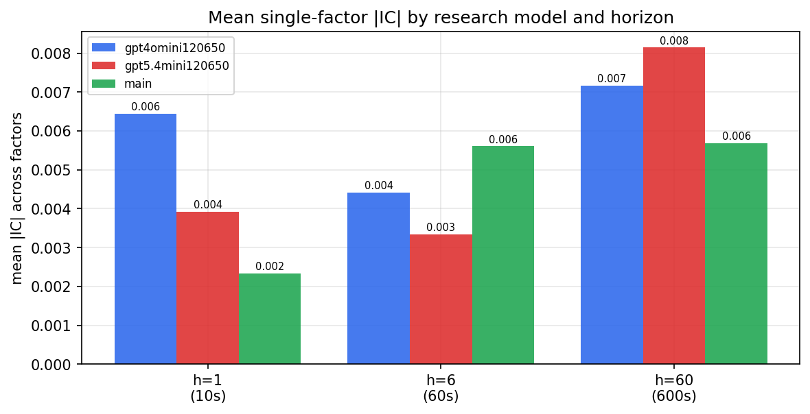

*Mean |IC| by research model and horizon*

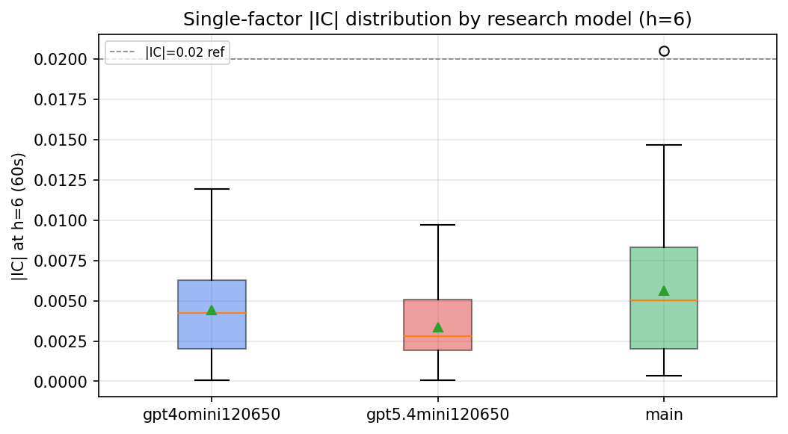

*Per-factor |IC| distribution by research model*

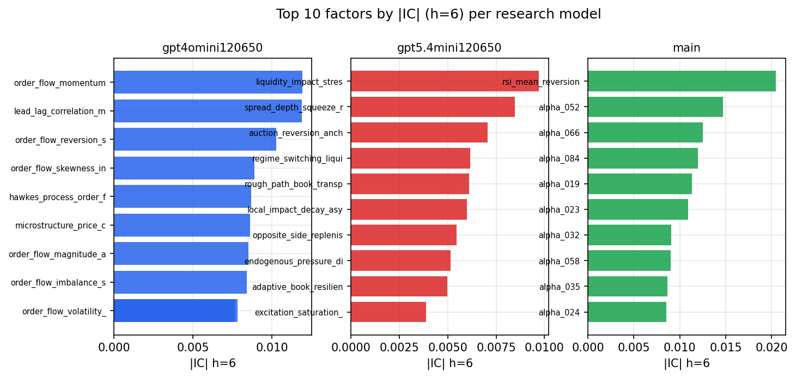

*Top factors by |IC| per research model*

## 2. Factor diversity & redundancy

Pairwise correlation of each zoo's *signals*. `eff_n_factors` is the effective number of independent factors (participation ratio of the correlation eigenvalues); `eff_ratio` and `redundancy` summarise how much unique information the zoo holds vs. how much is duplicated; `n_clusters` groups factors at |corr| ≥ 0.7.

| prerun | n_factors | eff_n_factors | eff_ratio | mean_abs_corr | n_clusters | redundancy |
| --- | --- | --- | --- | --- | --- | --- |
| gpt4omini120650 | 66 | 26.5751 | 0.4027 | 0.0518 | 49 | 0.5973 |
| gpt5.4mini120650 | 69 | 52.52 | 0.7612 | 0.0116 | 62 | 0.2388 |
| main | 78 | 43.7607 | 0.561 | 0.0264 | 71 | 0.439 |

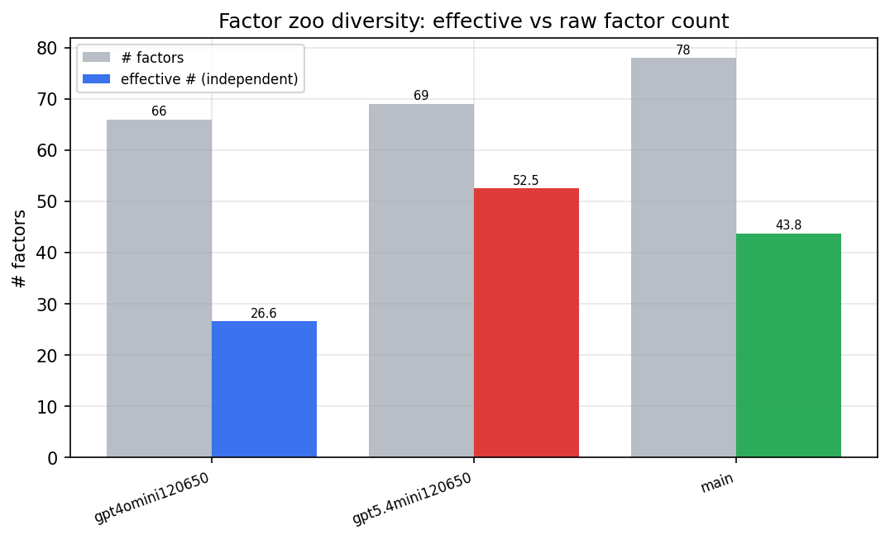

*Effective vs raw factor count per research model*

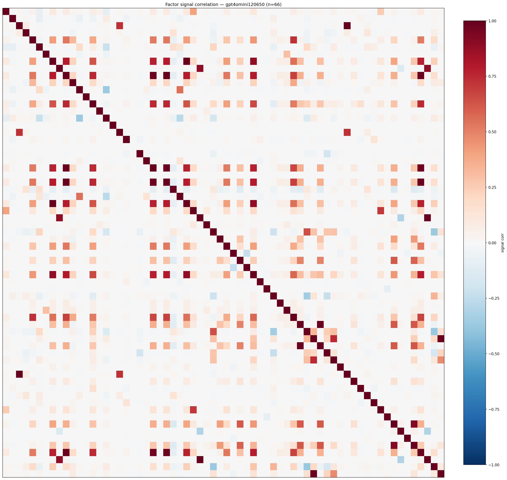

*Signal correlation matrix — gpt4omini120650*

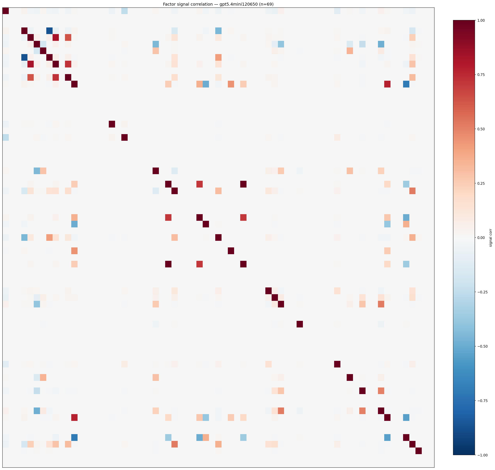

*Signal correlation matrix — gpt5.4mini120650*

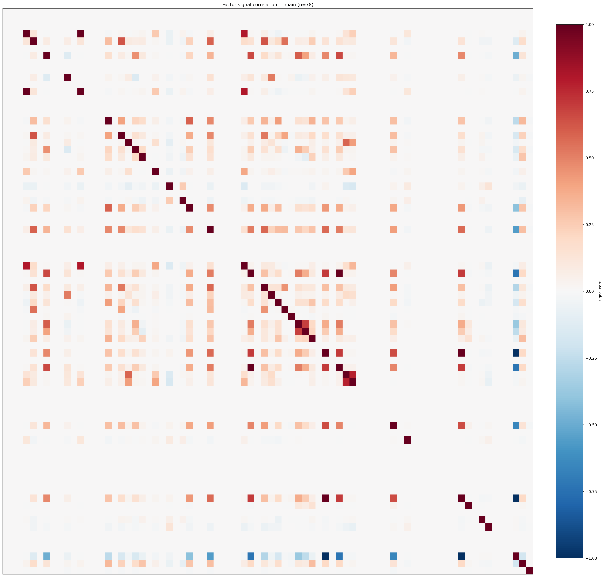

*Signal correlation matrix — main*

## 3. Deflation & model-based importance

`deflated_best_ic` haircuts each zoo's best |IC| for the number of factors tried (`ic_n_tested`) — a bigger zoo's best factor is more likely to be lucky. `lasso_n_nonzero` / `lasso_sparsity` show how many factors a sparse linear model actually keeps (model-view redundancy).

| prerun | best_ic | deflated_best_ic | deflated_best_t | ic_n_tested | ic_n_obs | lasso_n_nonzero | lasso_sparsity |
| --- | --- | --- | --- | --- | --- | --- | --- |
| gpt4omini120650 | 0.0119 | 0.0044 | 1.6883 | 64 | 147419 | 2 | 0.9697 |
| gpt5.4mini120650 | 0.0097 | 0.0029 | 1.1103 | 31 | 147419 | 0 | 1.0 |
| main | 0.0205 | 0.0135 | 5.1641 | 38 | 147419 | 0 | 1.0 |

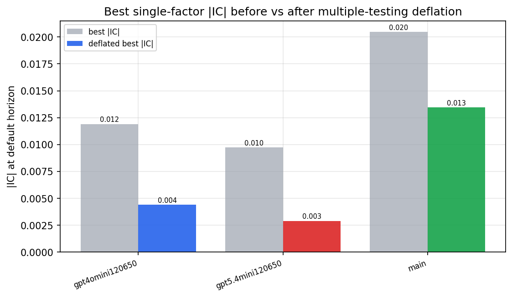

*Best |IC| before vs after multiple-testing deflation*

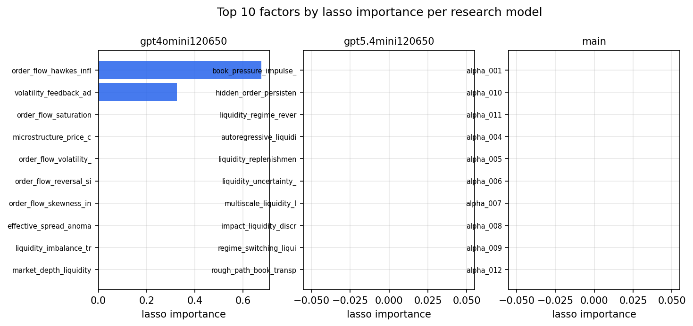

*Top factors by lasso importance per zoo*

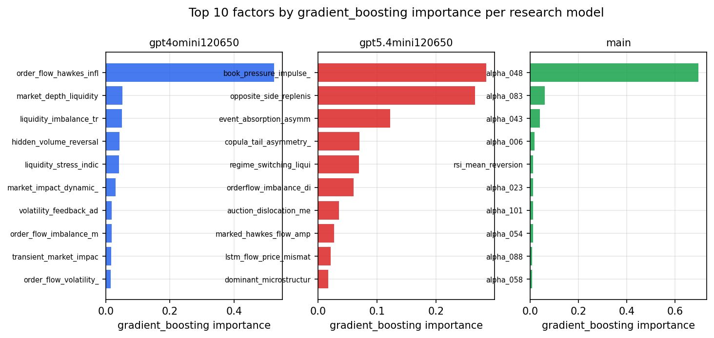

*Top factors by gradient_boosting importance per zoo*

## 4. ML-combined signal — per-underlying vectorised backtest

Each model combines a prerun's factors into ONE signal (fit `factors → forward return` on IS, predict per (bar, underlying)), then that combined signal is run through a simple vectorised backtest — `position(signal) × the underlying's own forward return` — on the held-out OOS tail (+ an equal-weight ensemble). No cross-sectional ranking.

> Config: position=**threshold** (t=1.0, z-score `expanding`), aggregation=**portfolio**, fit-standardise=**per_underlying**, horizon=6.

| prerun | model | n_factors_used | oos_ic | oos_sharpe | is_sharpe | oos_ann_return | oos_max_drawdown |
| --- | --- | --- | --- | --- | --- | --- | --- |
| gpt4omini120650 | linear_regression | 66 | 0.0034 | 2.4336 | 4.7063 | 0.1199 | -0.0114 |
| gpt4omini120650 | ridge | 66 | 0.0019 | 1.9798 | 4.9525 | 0.0981 | -0.0111 |
| gpt4omini120650 | lasso | 66 | -0.0098 | 3.9787 | 1.7669 | 0.2269 | -0.011 |
| gpt4omini120650 | elastic_net | 66 | -0.0098 | 3.9944 | 1.7976 | 0.2277 | -0.0108 |
| gpt4omini120650 | random_forest | 66 | 0.0033 | 0.0955 | 11.3726 | 0.0049 | -0.0115 |
| gpt4omini120650 | gradient_boosting | 66 | 0.0036 | 3.3501 | 10.6447 | 0.1268 | -0.0063 |
| gpt4omini120650 | xgboost | 66 | -0.0082 | 0.147 | 14.6768 | 0.0066 | -0.0116 |
| gpt4omini120650 | lightgbm | 66 | -0.0023 | 2.5545 | 19.4189 | 0.1239 | -0.0101 |
| gpt4omini120650 | ensemble | 66 | -0.01 | 6.2634 | 12.8729 | 0.3137 | -0.0047 |
| gpt5.4mini120650 | linear_regression | 69 | -0.009 | -6.167 | 6.0725 | -0.2379 | -0.0223 |
| gpt5.4mini120650 | ridge | 69 | -0.0094 | -7.5239 | 7.0011 | -0.2982 | -0.0266 |
| gpt5.4mini120650 | lasso | 69 | nan | nan | nan | nan | nan |
| gpt5.4mini120650 | elastic_net | 69 | nan | nan | nan | nan | nan |
| gpt5.4mini120650 | random_forest | 69 | -0.0039 | -0.2984 | 13.7915 | -0.0068 | -0.0069 |
| gpt5.4mini120650 | gradient_boosting | 69 | -0.0035 | 2.1634 | 12.4069 | 0.0217 | -0.002 |
| gpt5.4mini120650 | xgboost | 69 | 0.0005 | -0.5561 | 14.8152 | -0.0236 | -0.0166 |
| gpt5.4mini120650 | lightgbm | 69 | -0.0028 | 2.6834 | 20.736 | 0.0869 | -0.0067 |
| gpt5.4mini120650 | ensemble | 69 | -0.0076 | 0.7485 | 16.3288 | 0.0305 | -0.0093 |
| main | linear_regression | 78 | 0.0006 | 0.9941 | 8.427 | 0.0359 | -0.0098 |
| main | ridge | 78 | 0.0009 | 2.3936 | 10.8706 | 0.0831 | -0.0081 |
| main | lasso | 78 | nan | nan | nan | nan | nan |
| main | elastic_net | 78 | nan | nan | nan | nan | nan |
| main | random_forest | 78 | -0.0164 | 0.1632 | 18.9088 | 0.0044 | -0.0056 |
| main | gradient_boosting | 78 | -0.0096 | 6.1493 | 11.5773 | 0.0504 | -0.001 |
| main | xgboost | 78 | -0.0133 | -0.7453 | 16.4341 | -0.0192 | -0.0075 |
| main | lightgbm | 78 | -0.009 | 0.5498 | 26.4965 | 0.0091 | -0.0058 |
| main | ensemble | 78 | -0.0075 | 4.4469 | 19.3856 | 0.1745 | -0.0052 |

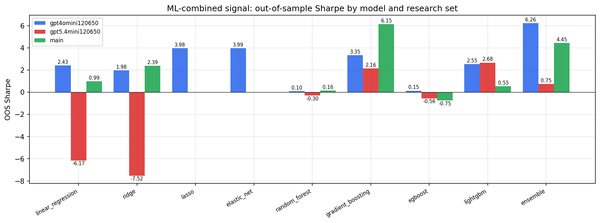

*ML-combined OOS Sharpe by model and research set*

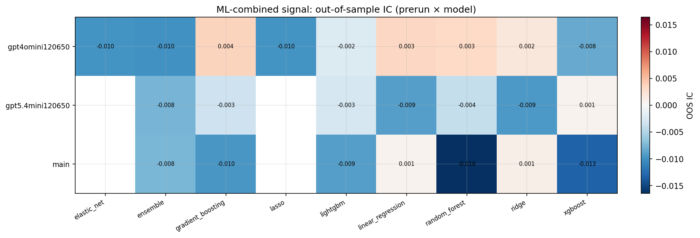

*ML-combined OOS IC (prerun × model)*

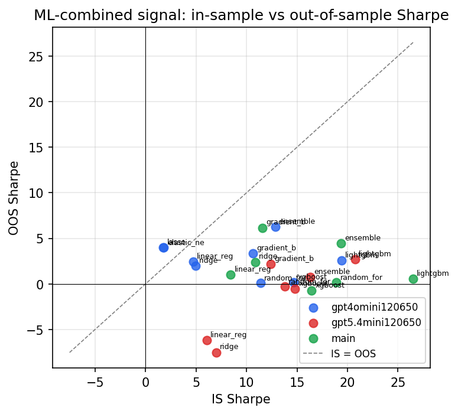

*IS vs OOS Sharpe (overfitting diagnostic)*

---
*Generated by `run_model_comparison.py`. Tables: `*.csv`; interactive: `comparison.ipynb`.*
