# Research-LLM factor comparison — `2024-07`

Comparing the **factor output of different research LLMs** on three axes (raw factor quality → factors as ML features → factors through the full agentic fund). The panel, IS/OOS split, horizon and model hyper-parameters are held identical across preruns — the *only* variable is the factor set.

## Preruns compared

| prerun | research_model | usable_factors | dropped_factors |
| --- | --- | --- | --- |
| gpt4omini120650 | gpt-4o-mini | 66 | 0 |
| gpt5.4mini120650 | gpt-5.4-mini | 69 | 0 |
| main | seed library | 78 | 10 |

> Dropped factors declare fields the current data doesn't have yet (e.g. fundamentals); they light up unchanged once that data is downloaded.

*Usable vs awaiting-data factors per research model*

## Key findings

- **Best ML-combined OOS Sharpe:** `gpt5.4mini120650` with `xgboost` (OOS Sharpe = 7.966).
- **Mean OOS Sharpe across models, by research set:** `gpt4omini120650` = 3.211, `gpt5.4mini120650` = 1.663, `main` = -1.896.
- **Highest mean single-factor |IC| (h=6):** `main` (mean |IC| = 0.0052).
- **Most diverse zoo (highest effective/raw factor ratio):** `gpt5.4mini120650` (eff 52.6 of 69, ratio 0.76).
- **Best selection-deflated single-factor |IC|:** `main` (deflated |IC| = 0.0138 from 38 factors tried).

## 1. Single-factor IC (raw factor quality)

Per-underlying time-series Spearman rank-IC of every researched factor, recomputed on the shared panel at horizons h=1, h=6, h=60. The per-underlying IC correlates each factor's value vector with the underlying's own forward-return vector (pooled across underlyings); the cross-sectional IC ranks across underlyings per timestamp.

| prerun | n_factors | mean_abs_ic_1 | mean_abs_ic_6 | mean_abs_ic_60 | mean_abs_icir_6 | best_factor_h6 | best_abs_ic_h6 |
| --- | --- | --- | --- | --- | --- | --- | --- |
| gpt4omini120650 | 66 | 0.0089 | 0.0043 | 0.0071 | 0.2985 | order_flow_reversion_strength | 0.0161 |
| gpt5.4mini120650 | 69 | 0.0045 | 0.004 | 0.0048 | 0.2086 | liquidity_impact_stress_ratio | 0.0104 |
| main | 78 | 0.0028 | 0.0052 | 0.0068 | 0.2858 | rsi_mean_reversion | 0.0209 |

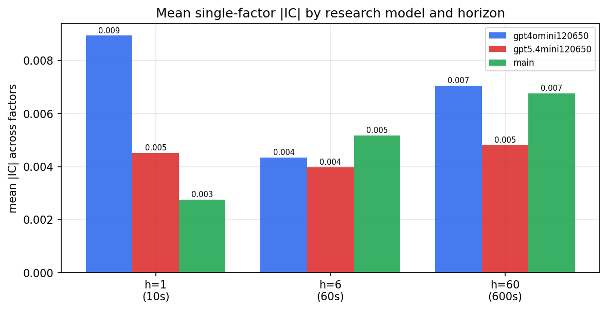

*Mean |IC| by research model and horizon*

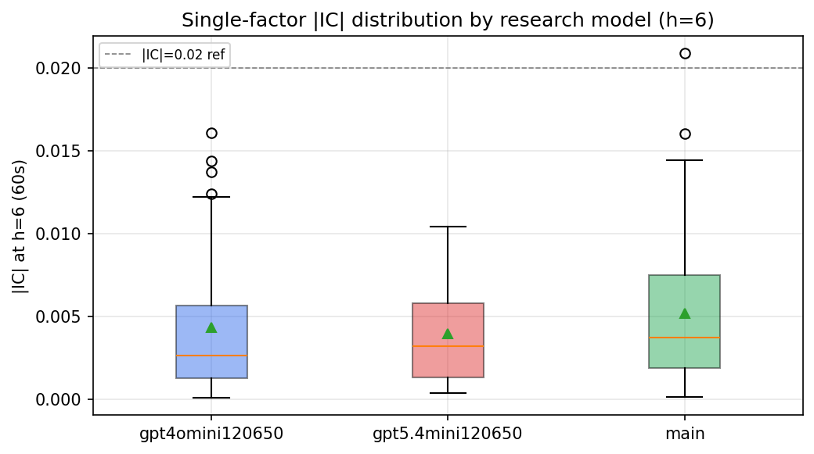

*Per-factor |IC| distribution by research model*

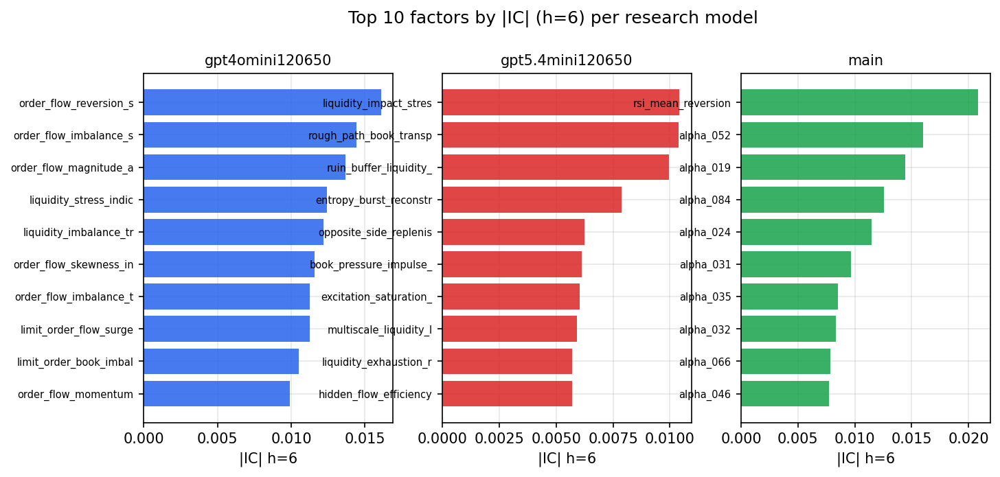

*Top factors by |IC| per research model*

## 2. Factor diversity & redundancy

Pairwise correlation of each zoo's *signals*. `eff_n_factors` is the effective number of independent factors (participation ratio of the correlation eigenvalues); `eff_ratio` and `redundancy` summarise how much unique information the zoo holds vs. how much is duplicated; `n_clusters` groups factors at |corr| ≥ 0.7.

| prerun | n_factors | eff_n_factors | eff_ratio | mean_abs_corr | n_clusters | redundancy |
| --- | --- | --- | --- | --- | --- | --- |
| gpt4omini120650 | 66 | 27.149 | 0.4113 | 0.0514 | 51 | 0.5887 |
| gpt5.4mini120650 | 69 | 52.5596 | 0.7617 | 0.0115 | 62 | 0.2383 |
| main | 78 | 43.8299 | 0.5619 | 0.0264 | 70 | 0.4381 |

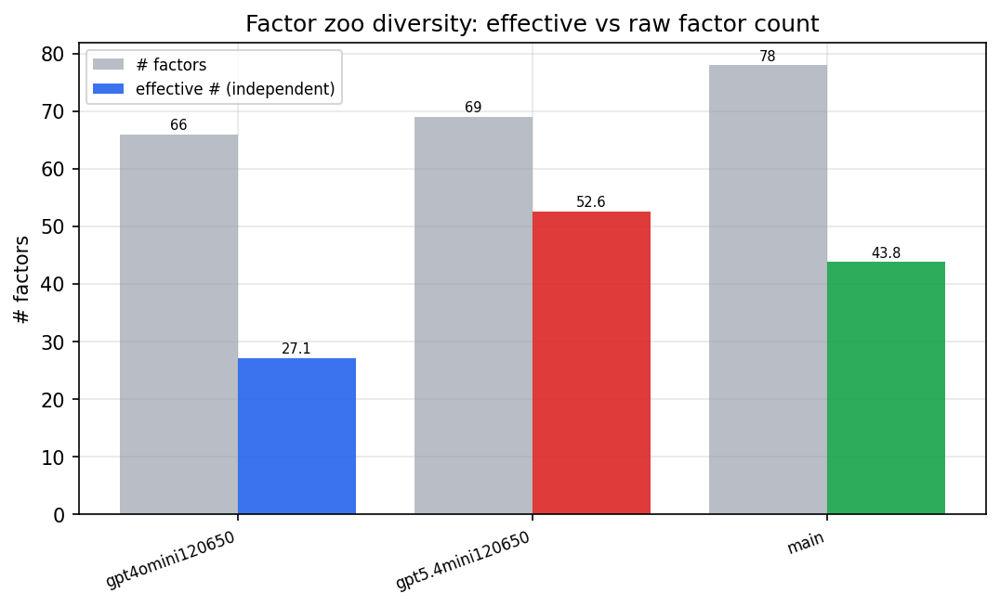

*Effective vs raw factor count per research model*

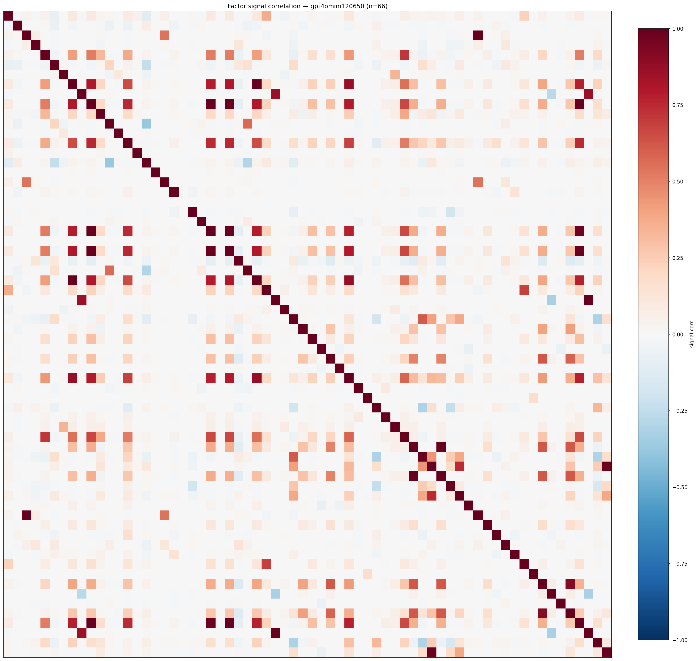

*Signal correlation matrix — gpt4omini120650*

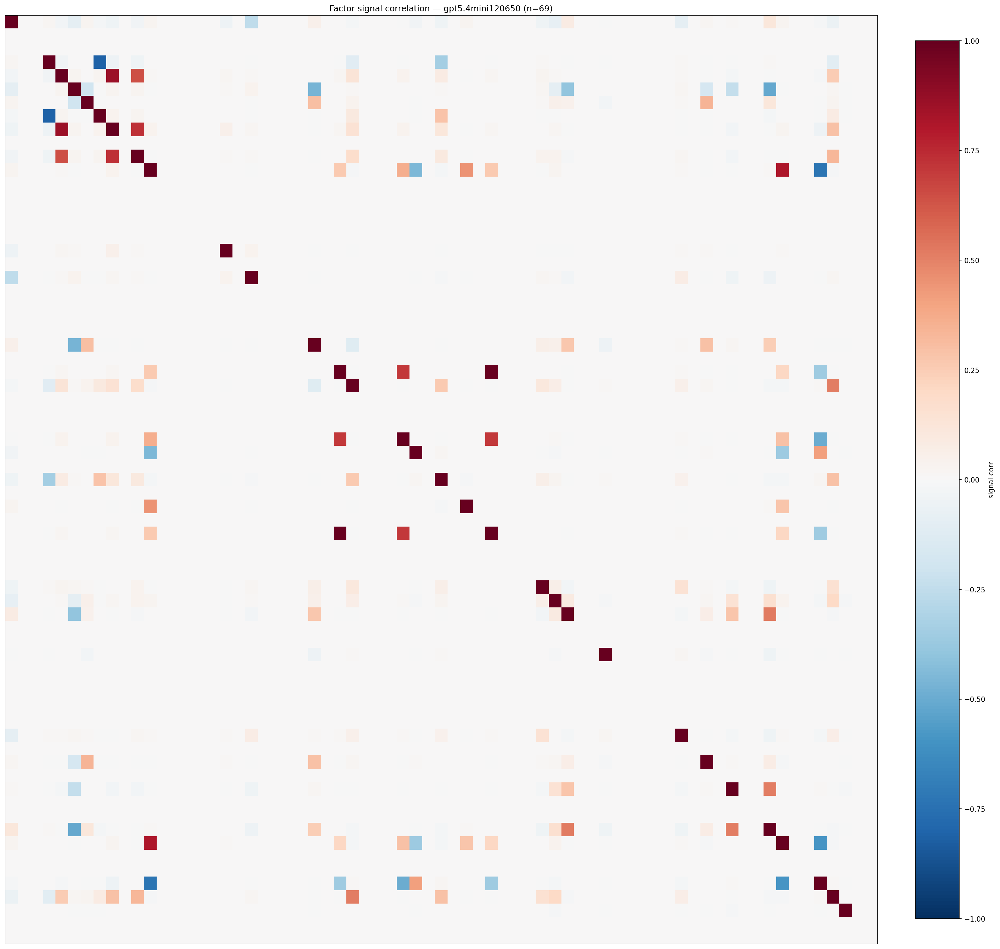

*Signal correlation matrix — gpt5.4mini120650*

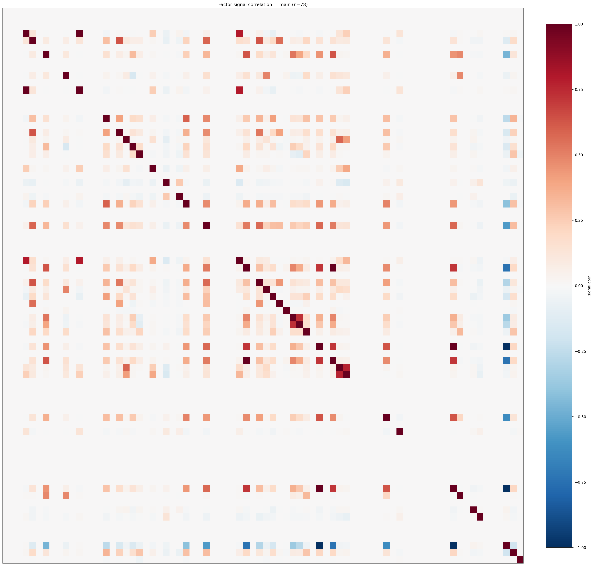

*Signal correlation matrix — main*

## 3. Deflation & model-based importance

`deflated_best_ic` haircuts each zoo's best |IC| for the number of factors tried (`ic_n_tested`) — a bigger zoo's best factor is more likely to be lucky. `lasso_n_nonzero` / `lasso_sparsity` show how many factors a sparse linear model actually keeps (model-view redundancy).

| prerun | best_ic | deflated_best_ic | deflated_best_t | ic_n_tested | ic_n_obs | lasso_n_nonzero | lasso_sparsity |
| --- | --- | --- | --- | --- | --- | --- | --- |
| gpt4omini120650 | 0.0161 | 0.0085 | 3.2667 | 64 | 146339 | 2 | 0.9697 |
| gpt5.4mini120650 | 0.0104 | 0.0036 | 1.3655 | 31 | 146339 | 0 | 1.0 |
| main | 0.0209 | 0.0138 | 5.2862 | 38 | 146339 | 0 | 1.0 |

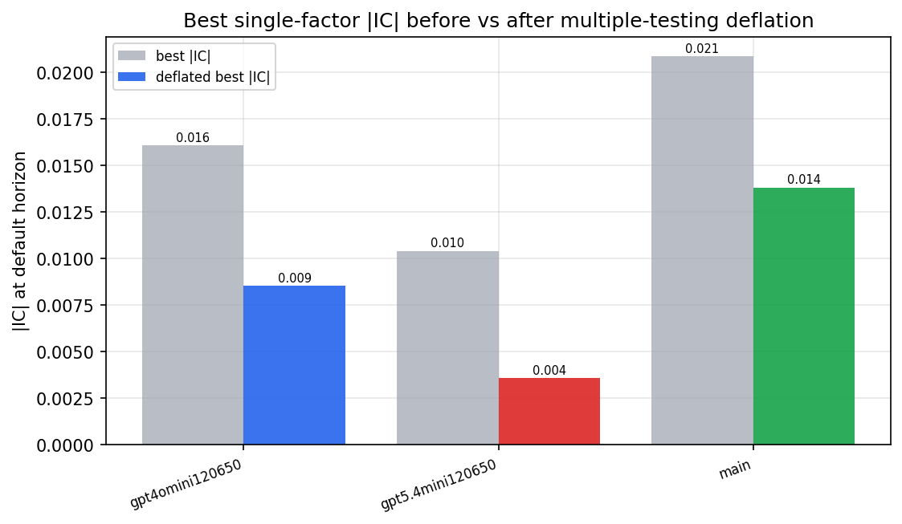

*Best |IC| before vs after multiple-testing deflation*

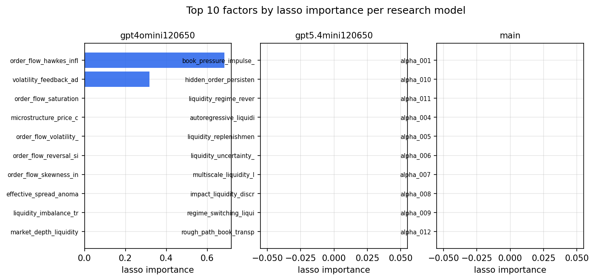

*Top factors by lasso importance per zoo*

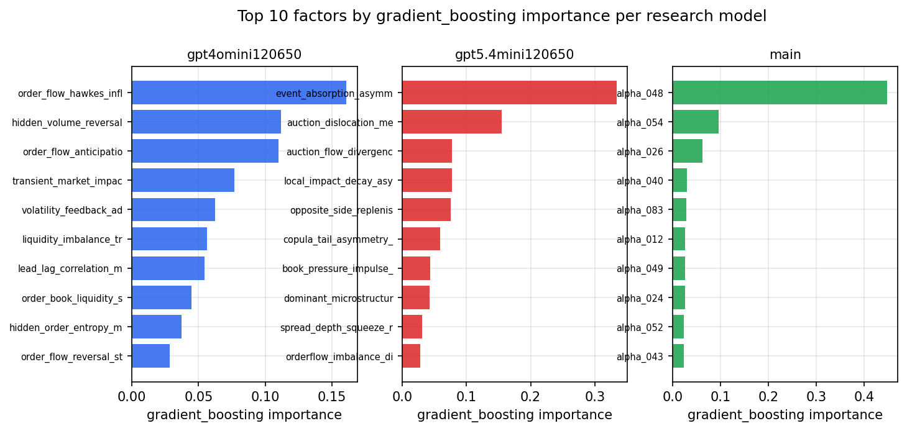

*Top factors by gradient_boosting importance per zoo*

## 4. ML-combined signal — per-underlying vectorised backtest

Each model combines a prerun's factors into ONE signal (fit `factors → forward return` on IS, predict per (bar, underlying)), then that combined signal is run through a simple vectorised backtest — `position(signal) × the underlying's own forward return` — on the held-out OOS tail (+ an equal-weight ensemble). No cross-sectional ranking.

> Config: position=**threshold** (t=1.0, z-score `expanding`), aggregation=**portfolio**, fit-standardise=**per_underlying**, horizon=6.

| prerun | model | n_factors_used | oos_ic | oos_sharpe | is_sharpe | oos_ann_return | oos_max_drawdown |
| --- | --- | --- | --- | --- | --- | --- | --- |
| gpt4omini120650 | linear_regression | 66 | -0.0033 | 4.7802 | 9.3383 | 0.3195 | -0.0092 |
| gpt4omini120650 | ridge | 66 | -0.0015 | 4.63 | 8.8882 | 0.3369 | -0.0106 |
| gpt4omini120650 | lasso | 66 | 0.0119 | 4.7241 | 6.2275 | 0.3089 | -0.0091 |
| gpt4omini120650 | elastic_net | 66 | 0.012 | 4.7231 | 6.3727 | 0.3087 | -0.0091 |
| gpt4omini120650 | random_forest | 66 | -0.0059 | 2.6411 | 9.4831 | 0.0864 | -0.0096 |
| gpt4omini120650 | gradient_boosting | 66 | 0.002 | 3.8295 | 11.1203 | 0.1764 | -0.0064 |
| gpt4omini120650 | xgboost | 66 | -0.0006 | 0.4133 | 12.7458 | 0.0332 | -0.0264 |
| gpt4omini120650 | lightgbm | 66 | 0.0001 | 0.9382 | 15.9943 | 0.052 | -0.0146 |
| gpt4omini120650 | ensemble | 66 | 0.0008 | 2.2197 | 12.7611 | 0.132 | -0.0158 |
| gpt5.4mini120650 | linear_regression | 69 | 0.011 | 0.9156 | 4.2302 | 0.0579 | -0.0197 |
| gpt5.4mini120650 | ridge | 69 | 0.0111 | 0.324 | 3.9673 | 0.0236 | -0.0231 |
| gpt5.4mini120650 | lasso | 69 | nan | nan | nan | nan | nan |
| gpt5.4mini120650 | elastic_net | 69 | nan | nan | nan | nan | nan |
| gpt5.4mini120650 | random_forest | 69 | -0.0034 | 2.5911 | 13.3458 | 0.1729 | -0.0231 |
| gpt5.4mini120650 | gradient_boosting | 69 | 0.0016 | -2.685 | 10.5346 | -0.0649 | -0.0094 |
| gpt5.4mini120650 | xgboost | 69 | -0.0085 | 7.966 | 14.8714 | 0.337 | -0.0058 |
| gpt5.4mini120650 | lightgbm | 69 | -0.0025 | 2.7732 | 18.6211 | 0.1059 | -0.0071 |
| gpt5.4mini120650 | ensemble | 69 | 0.0145 | -0.2429 | 11.2064 | -0.008 | -0.0115 |
| main | linear_regression | 78 | -0.0068 | 1.5708 | 9.2352 | 0.0897 | -0.012 |
| main | ridge | 78 | -0.0062 | 1.5279 | 9.6513 | 0.0873 | -0.0113 |
| main | lasso | 78 | nan | nan | nan | nan | nan |
| main | elastic_net | 78 | nan | nan | nan | nan | nan |
| main | random_forest | 78 | -0.0025 | -6.457 | 11.1758 | -0.1746 | -0.0174 |
| main | gradient_boosting | 78 | 0.0001 | -2.3573 | 10.4334 | -0.0362 | -0.0064 |
| main | xgboost | 78 | -0.0046 | -4.2824 | 15.4714 | -0.13 | -0.0165 |
| main | lightgbm | 78 | -0.0062 | -3.5428 | 20.284 | -0.0781 | -0.0083 |
| main | ensemble | 78 | -0.01 | 0.272 | 14.6961 | 0.0127 | -0.0144 |

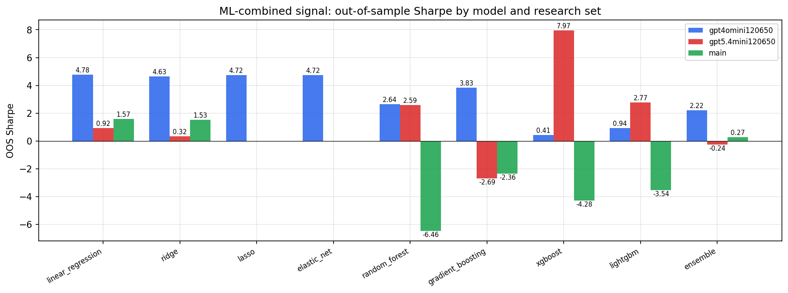

*ML-combined OOS Sharpe by model and research set*

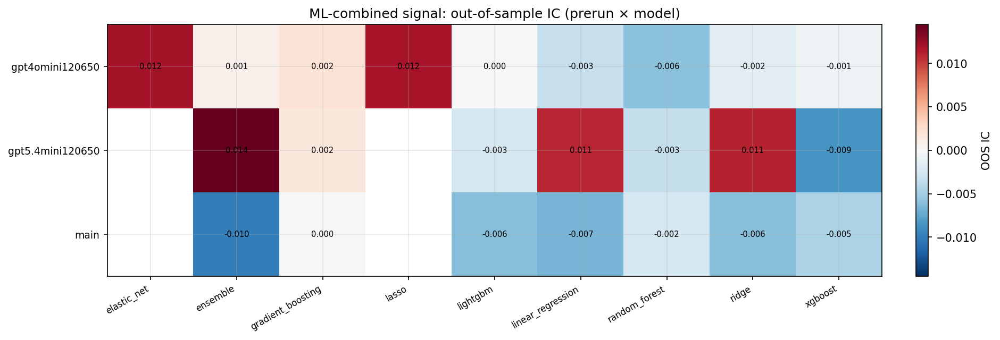

*ML-combined OOS IC (prerun × model)*

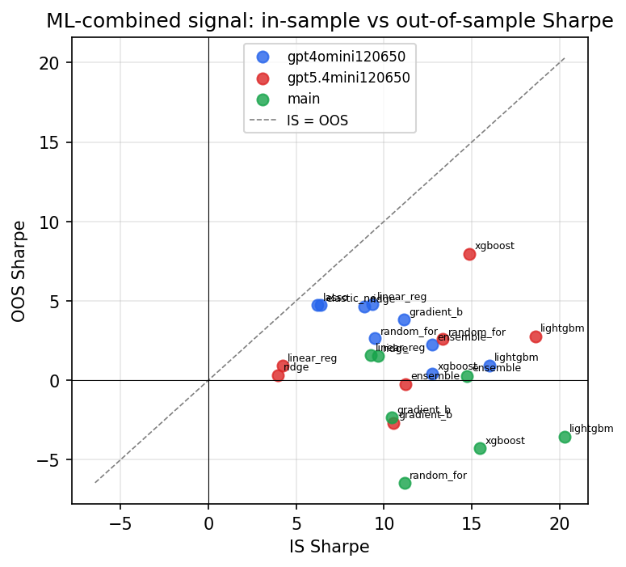

*IS vs OOS Sharpe (overfitting diagnostic)*

---
*Generated by `run_model_comparison.py`. Tables: `*.csv`; interactive: `comparison.ipynb`.*
