# Research-LLM factor comparison — `2024-08`

Comparing the **factor output of different research LLMs** on three axes (raw factor quality → factors as ML features → factors through the full agentic fund). The panel, IS/OOS split, horizon and model hyper-parameters are held identical across preruns — the *only* variable is the factor set.

## Preruns compared

| prerun | research_model | usable_factors | dropped_factors |
| --- | --- | --- | --- |
| gpt4omini120650 | gpt-4o-mini | 66 | 0 |
| gpt5.4mini120650 | gpt-5.4-mini | 69 | 0 |
| main | seed library | 78 | 10 |

> Dropped factors declare fields the current data doesn't have yet (e.g. fundamentals); they light up unchanged once that data is downloaded.

*Usable vs awaiting-data factors per research model*

## Key findings

- **Best ML-combined OOS Sharpe:** `gpt5.4mini120650` with `linear_regression` (OOS Sharpe = 5.978).
- **Mean OOS Sharpe across models, by research set:** `gpt5.4mini120650` = 0.661, `gpt4omini120650` = -0.079, `main` = -0.337.
- **Highest mean single-factor |IC| (h=6):** `main` (mean |IC| = 0.0076).
- **Most diverse zoo (highest effective/raw factor ratio):** `gpt5.4mini120650` (eff 51.7 of 69, ratio 0.75).
- **Best selection-deflated single-factor |IC|:** `main` (deflated |IC| = 0.0200 from 38 factors tried).

## 1. Single-factor IC (raw factor quality)

Per-underlying time-series Spearman rank-IC of every researched factor, recomputed on the shared panel at horizons h=1, h=6, h=60. The per-underlying IC correlates each factor's value vector with the underlying's own forward-return vector (pooled across underlyings); the cross-sectional IC ranks across underlyings per timestamp.

| prerun | n_factors | mean_abs_ic_1 | mean_abs_ic_6 | mean_abs_ic_60 | mean_abs_icir_6 | best_factor_h6 | best_abs_ic_h6 |
| --- | --- | --- | --- | --- | --- | --- | --- |
| gpt4omini120650 | 66 | 0.0084 | 0.0052 | 0.0042 | 0.2955 | order_flow_reversion_strength | 0.0144 |
| gpt5.4mini120650 | 69 | 0.0038 | 0.0044 | 0.0047 | 0.2401 | auction_flow_divergence_reversion | 0.0125 |
| main | 78 | 0.0027 | 0.0076 | 0.0052 | 0.3786 | alpha_066 | 0.0271 |

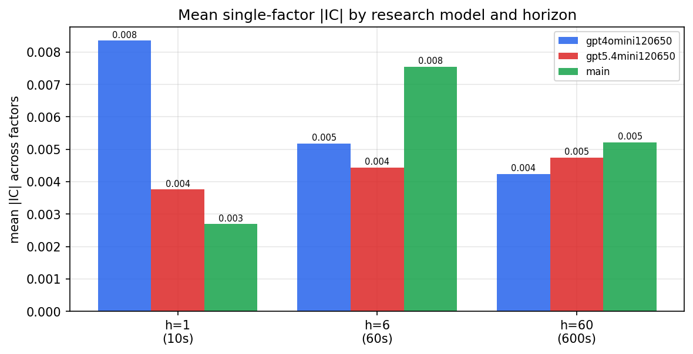

*Mean |IC| by research model and horizon*

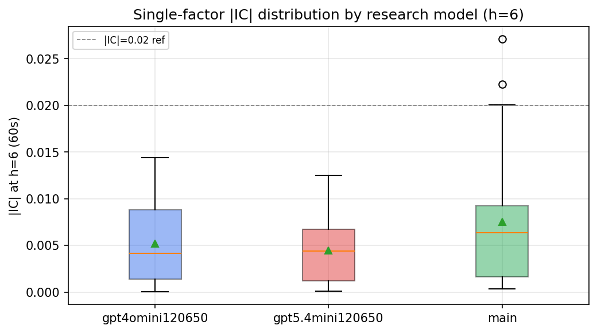

*Per-factor |IC| distribution by research model*

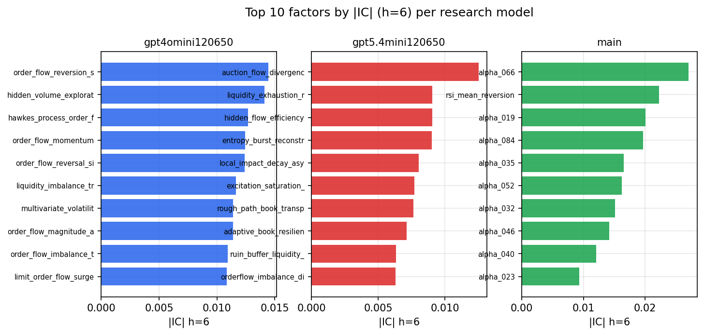

*Top factors by |IC| per research model*

## 2. Factor diversity & redundancy

Pairwise correlation of each zoo's *signals*. `eff_n_factors` is the effective number of independent factors (participation ratio of the correlation eigenvalues); `eff_ratio` and `redundancy` summarise how much unique information the zoo holds vs. how much is duplicated; `n_clusters` groups factors at |corr| ≥ 0.7.

| prerun | n_factors | eff_n_factors | eff_ratio | mean_abs_corr | n_clusters | redundancy |
| --- | --- | --- | --- | --- | --- | --- |
| gpt4omini120650 | 66 | 27.1667 | 0.4116 | 0.0524 | 50 | 0.5884 |
| gpt5.4mini120650 | 69 | 51.6621 | 0.7487 | 0.012 | 62 | 0.2513 |
| main | 78 | 43.8029 | 0.5616 | 0.0265 | 70 | 0.4384 |

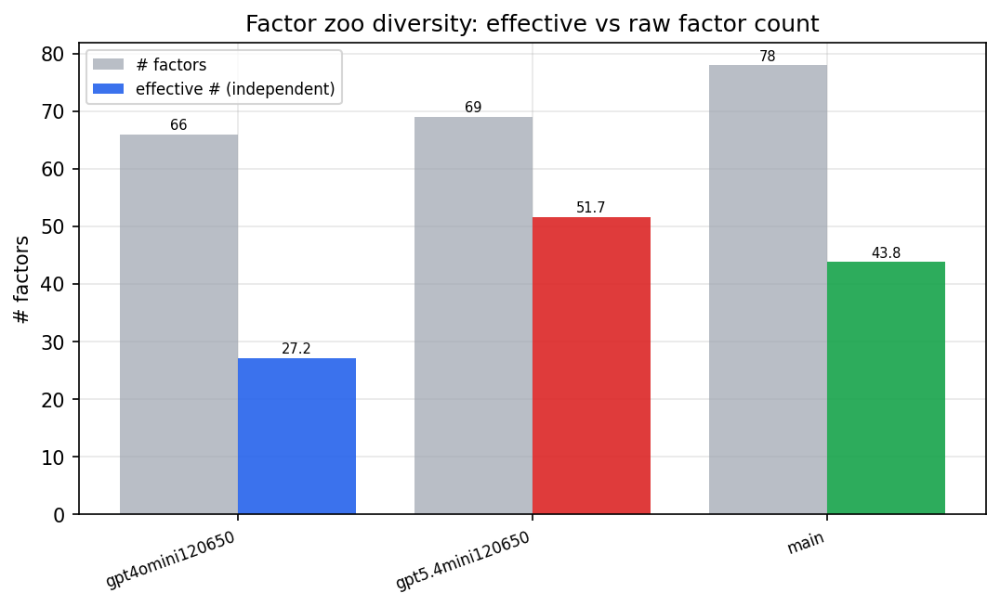

*Effective vs raw factor count per research model*

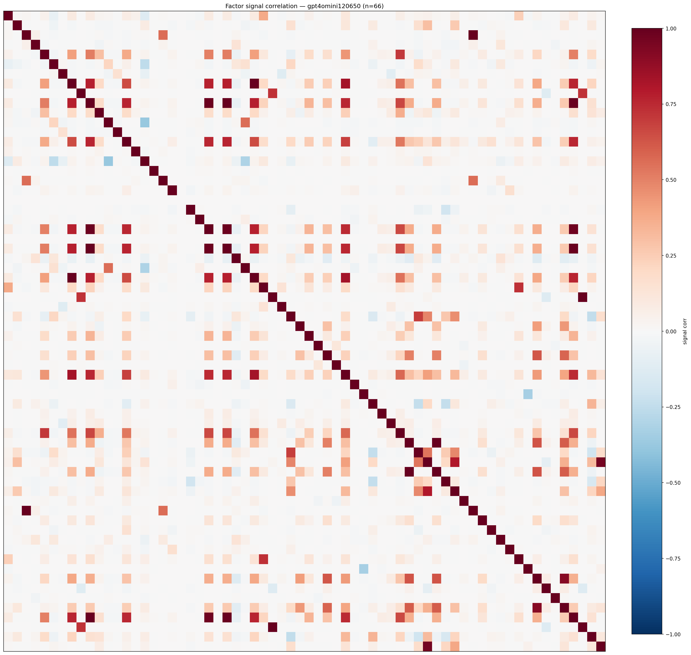

*Signal correlation matrix — gpt4omini120650*

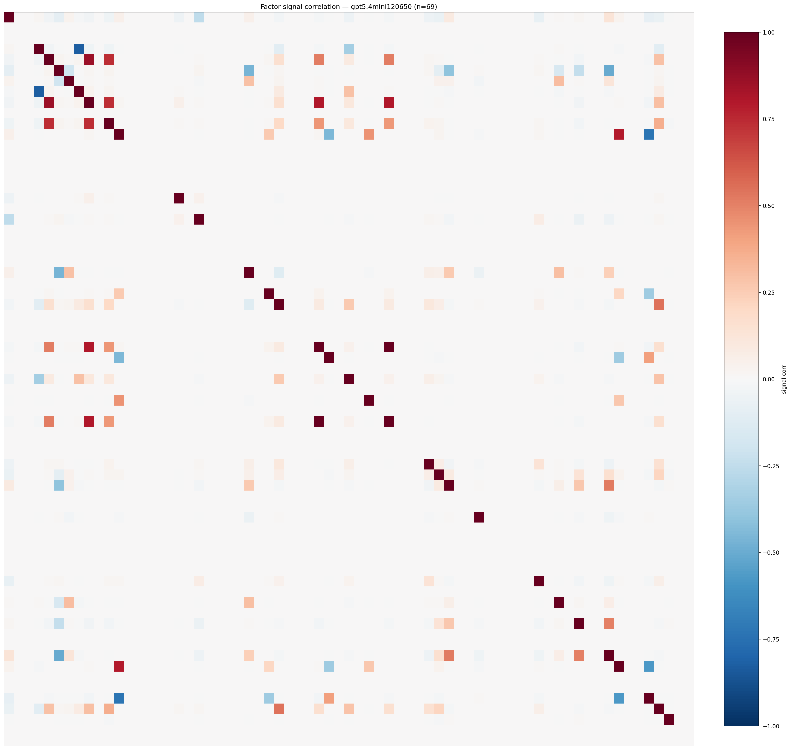

*Signal correlation matrix — gpt5.4mini120650*

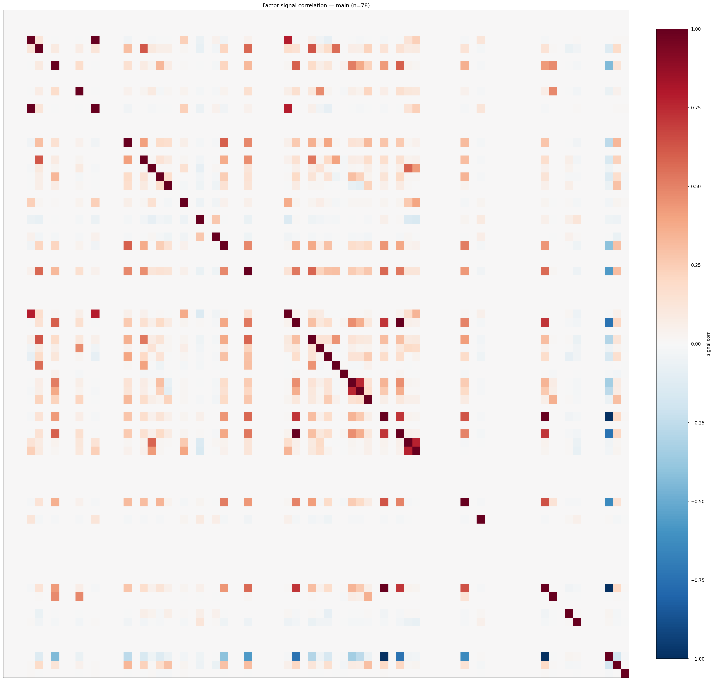

*Signal correlation matrix — main*

## 3. Deflation & model-based importance

`deflated_best_ic` haircuts each zoo's best |IC| for the number of factors tried (`ic_n_tested`) — a bigger zoo's best factor is more likely to be lucky. `lasso_n_nonzero` / `lasso_sparsity` show how many factors a sparse linear model actually keeps (model-view redundancy).

| prerun | best_ic | deflated_best_ic | deflated_best_t | ic_n_tested | ic_n_obs | lasso_n_nonzero | lasso_sparsity |
| --- | --- | --- | --- | --- | --- | --- | --- |
| gpt4omini120650 | 0.0144 | 0.0068 | 2.5906 | 64 | 143998 | 0 | 1.0 |
| gpt5.4mini120650 | 0.0125 | 0.0056 | 2.1319 | 31 | 143998 | 0 | 1.0 |
| main | 0.0271 | 0.02 | 7.5848 | 38 | 143998 | 0 | 1.0 |

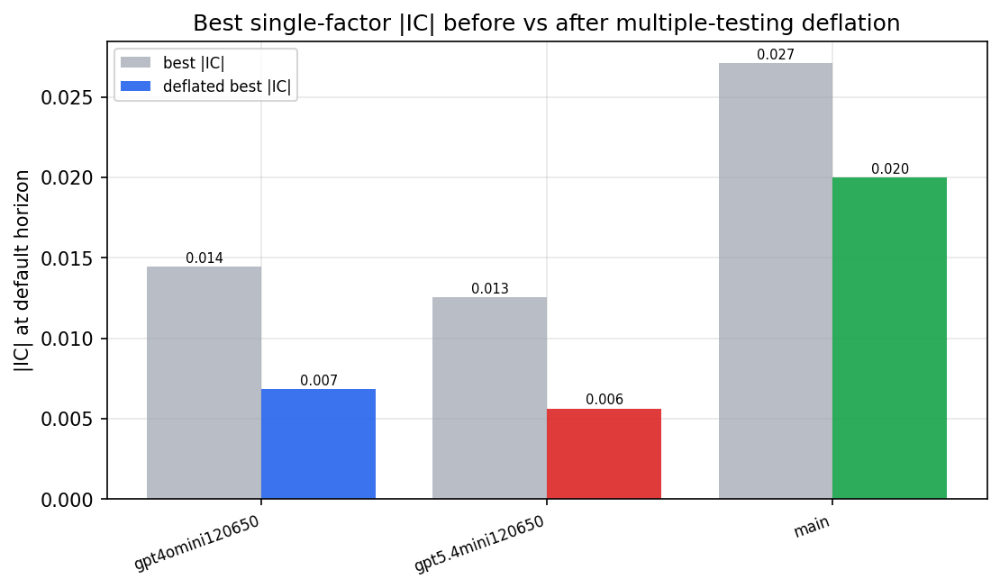

*Best |IC| before vs after multiple-testing deflation*

*Top factors by lasso importance per zoo*

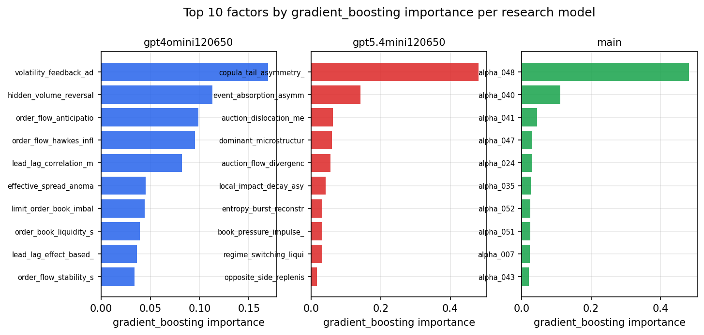

*Top factors by gradient_boosting importance per zoo*

## 4. ML-combined signal — per-underlying vectorised backtest

Each model combines a prerun's factors into ONE signal (fit `factors → forward return` on IS, predict per (bar, underlying)), then that combined signal is run through a simple vectorised backtest — `position(signal) × the underlying's own forward return` — on the held-out OOS tail (+ an equal-weight ensemble). No cross-sectional ranking.

> Config: position=**threshold** (t=1.0, z-score `expanding`), aggregation=**portfolio**, fit-standardise=**per_underlying**, horizon=6.

| prerun | model | n_factors_used | oos_ic | oos_sharpe | is_sharpe | oos_ann_return | oos_max_drawdown |
| --- | --- | --- | --- | --- | --- | --- | --- |
| gpt4omini120650 | linear_regression | 66 | 0.008 | 2.7831 | 9.4398 | 0.1983 | -0.0153 |
| gpt4omini120650 | ridge | 66 | 0.0112 | 4.0704 | 9.463 | 0.2696 | -0.0117 |
| gpt4omini120650 | lasso | 66 | nan | nan | nan | nan | nan |
| gpt4omini120650 | elastic_net | 66 | nan | nan | nan | nan | nan |
| gpt4omini120650 | random_forest | 66 | 0.004 | 0.5114 | 9.9091 | 0.0265 | -0.0113 |
| gpt4omini120650 | gradient_boosting | 66 | -0.0073 | -2.3139 | 7.6951 | -0.0547 | -0.008 |
| gpt4omini120650 | xgboost | 66 | -0.0041 | -5.2428 | 10.641 | -0.1794 | -0.0167 |
| gpt4omini120650 | lightgbm | 66 | 0.0063 | -1.0642 | 13.3837 | -0.0351 | -0.0093 |
| gpt4omini120650 | ensemble | 66 | 0.0079 | 0.7034 | 11.3415 | 0.0415 | -0.0128 |
| gpt5.4mini120650 | linear_regression | 69 | 0.0003 | 5.9784 | 5.0751 | 0.2319 | -0.0086 |
| gpt5.4mini120650 | ridge | 69 | -0.0001 | 5.1376 | 4.9409 | 0.2117 | -0.0112 |
| gpt5.4mini120650 | lasso | 69 | nan | nan | nan | nan | nan |
| gpt5.4mini120650 | elastic_net | 69 | nan | nan | nan | nan | nan |
| gpt5.4mini120650 | random_forest | 69 | 0.0087 | 2.6358 | 8.9401 | 0.1278 | -0.0121 |
| gpt5.4mini120650 | gradient_boosting | 69 | 0.0076 | 0.9628 | 5.5599 | 0.0359 | -0.0206 |
| gpt5.4mini120650 | xgboost | 69 | -0.0036 | -6.4623 | 9.9257 | -0.1428 | -0.0125 |
| gpt5.4mini120650 | lightgbm | 69 | 0.0036 | 1.3059 | 14.6724 | 0.04 | -0.0093 |
| gpt5.4mini120650 | ensemble | 69 | 0.0067 | -4.9345 | 8.1916 | -0.1033 | -0.0131 |
| main | linear_regression | 78 | 0.0066 | 3.4209 | 7.5459 | 0.0687 | -0.0049 |
| main | ridge | 78 | 0.0113 | 2.1432 | 7.6386 | 0.0465 | -0.0068 |
| main | lasso | 78 | nan | nan | nan | nan | nan |
| main | elastic_net | 78 | nan | nan | nan | nan | nan |
| main | random_forest | 78 | 0.0015 | 2.0761 | 14.7298 | 0.0937 | -0.0081 |
| main | gradient_boosting | 78 | -0.006 | -5.1095 | 8.3893 | -0.0738 | -0.0068 |
| main | xgboost | 78 | -0.0041 | -0.9203 | 14.3002 | -0.0219 | -0.0051 |
| main | lightgbm | 78 | -0.0086 | -0.9246 | 17.0975 | -0.03 | -0.007 |
| main | ensemble | 78 | -0.0048 | -3.0436 | 6.9214 | -0.0198 | -0.0025 |

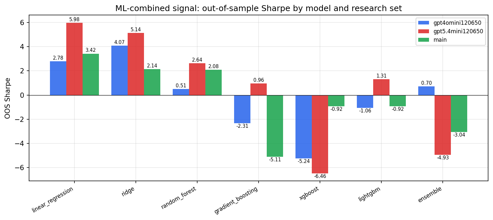

*ML-combined OOS Sharpe by model and research set*

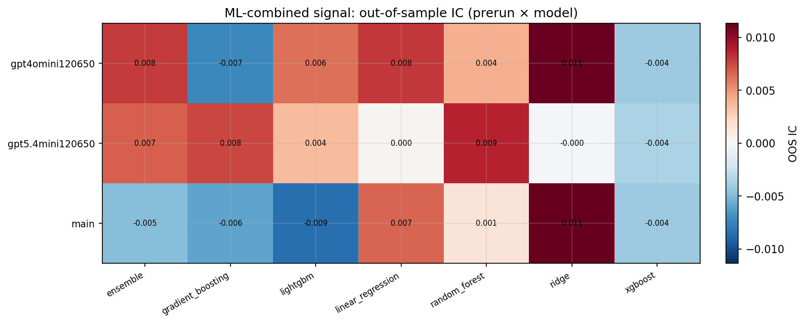

*ML-combined OOS IC (prerun × model)*

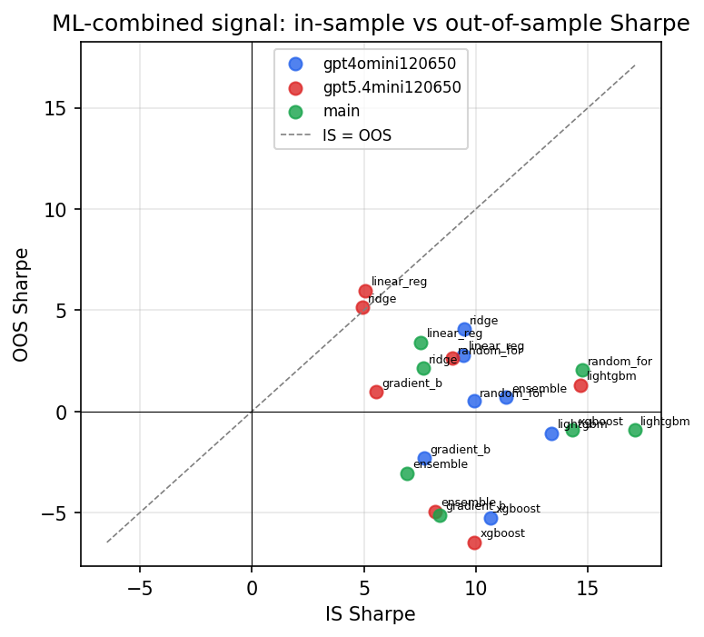

*IS vs OOS Sharpe (overfitting diagnostic)*

---
*Generated by `run_model_comparison.py`. Tables: `*.csv`; interactive: `comparison.ipynb`.*
