# Research-LLM factor comparison — `2024-09`

Comparing the **factor output of different research LLMs** on three axes (raw factor quality → factors as ML features → factors through the full agentic fund). The panel, IS/OOS split, horizon and model hyper-parameters are held identical across preruns — the *only* variable is the factor set.

## Preruns compared

| prerun | research_model | usable_factors | dropped_factors |
| --- | --- | --- | --- |
| gpt4omini120650 | gpt-4o-mini | 66 | 0 |
| gpt5.4mini120650 | gpt-5.4-mini | 69 | 0 |
| main | seed library | 78 | 10 |

> Dropped factors declare fields the current data doesn't have yet (e.g. fundamentals); they light up unchanged once that data is downloaded.

*Usable vs awaiting-data factors per research model*

## Key findings

- **Best ML-combined OOS Sharpe:** `main` with `lightgbm` (OOS Sharpe = 5.759).
- **Mean OOS Sharpe across models, by research set:** `main` = 3.463, `gpt4omini120650` = 2.708, `gpt5.4mini120650` = 0.278.
- **Highest mean single-factor |IC| (h=6):** `main` (mean |IC| = 0.0091).
- **Most diverse zoo (highest effective/raw factor ratio):** `gpt5.4mini120650` (eff 50.0 of 69, ratio 0.73).
- **Best selection-deflated single-factor |IC|:** `main` (deflated |IC| = 0.0256 from 38 factors tried).

## 1. Single-factor IC (raw factor quality)

Per-underlying time-series Spearman rank-IC of every researched factor, recomputed on the shared panel at horizons h=1, h=6, h=60. The per-underlying IC correlates each factor's value vector with the underlying's own forward-return vector (pooled across underlyings); the cross-sectional IC ranks across underlyings per timestamp.

| prerun | n_factors | mean_abs_ic_1 | mean_abs_ic_6 | mean_abs_ic_60 | mean_abs_icir_6 | best_factor_h6 | best_abs_ic_h6 |
| --- | --- | --- | --- | --- | --- | --- | --- |
| gpt4omini120650 | 66 | 0.0056 | 0.0062 | 0.0042 | 0.3223 | order_flow_saturation | 0.0157 |
| gpt5.4mini120650 | 69 | 0.0031 | 0.0047 | 0.0082 | 0.2657 | liquidity_impact_stress_ratio | 0.0125 |
| main | 78 | 0.0043 | 0.0091 | 0.0043 | 0.4716 | alpha_066 | 0.0327 |

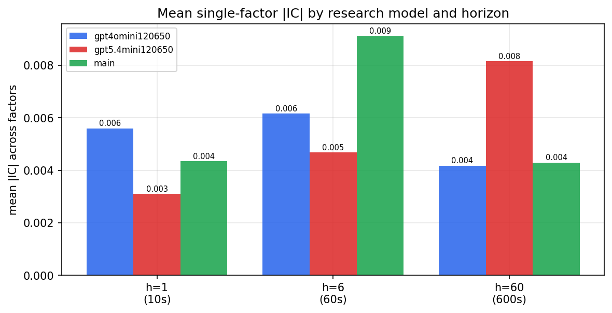

*Mean |IC| by research model and horizon*

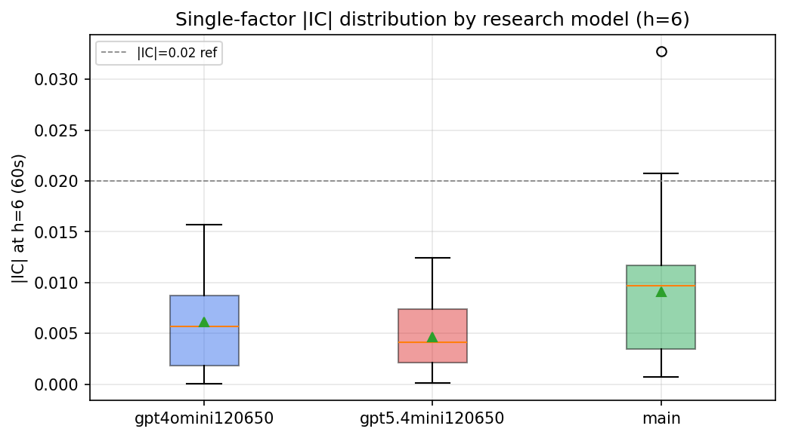

*Per-factor |IC| distribution by research model*

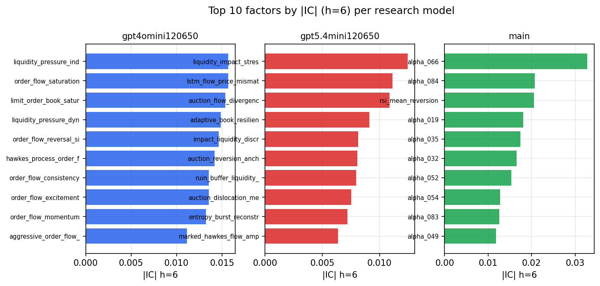

*Top factors by |IC| per research model*

## 2. Factor diversity & redundancy

Pairwise correlation of each zoo's *signals*. `eff_n_factors` is the effective number of independent factors (participation ratio of the correlation eigenvalues); `eff_ratio` and `redundancy` summarise how much unique information the zoo holds vs. how much is duplicated; `n_clusters` groups factors at |corr| ≥ 0.7.

| prerun | n_factors | eff_n_factors | eff_ratio | mean_abs_corr | n_clusters | redundancy |
| --- | --- | --- | --- | --- | --- | --- |
| gpt4omini120650 | 66 | 27.2382 | 0.4127 | 0.052 | 50 | 0.5873 |
| gpt5.4mini120650 | 69 | 50.0486 | 0.7253 | 0.0123 | 62 | 0.2747 |
| main | 78 | 43.9846 | 0.5639 | 0.0261 | 70 | 0.4361 |

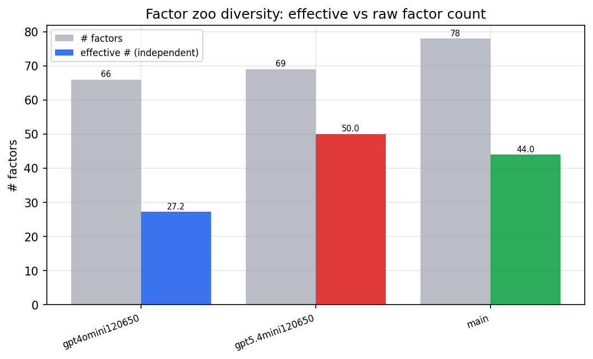

*Effective vs raw factor count per research model*

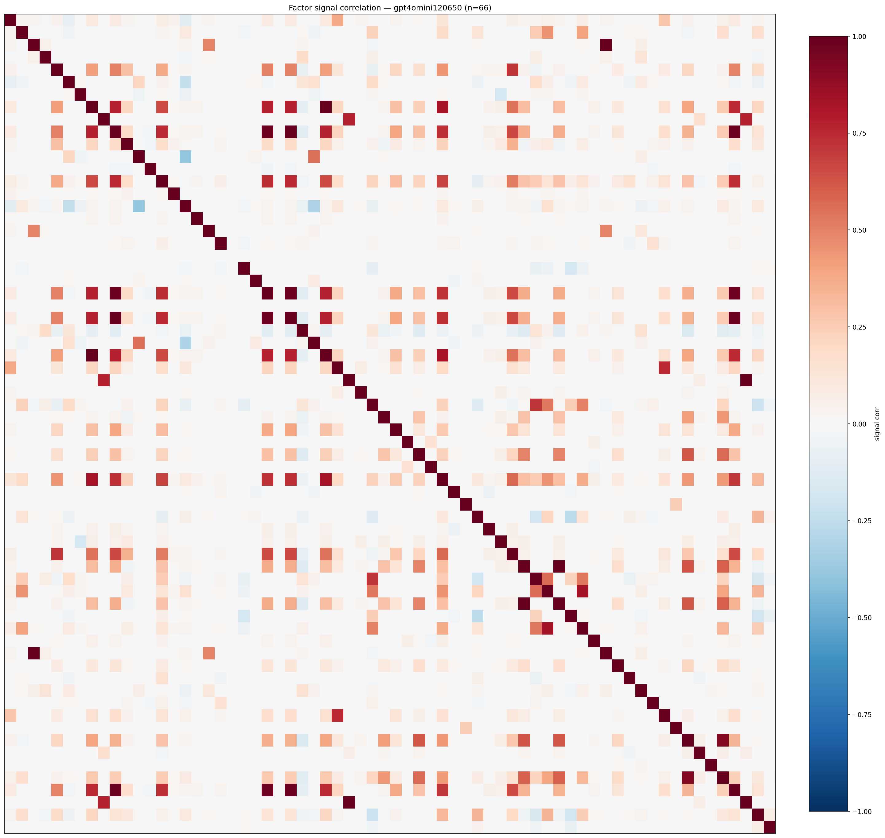

*Signal correlation matrix — gpt4omini120650*

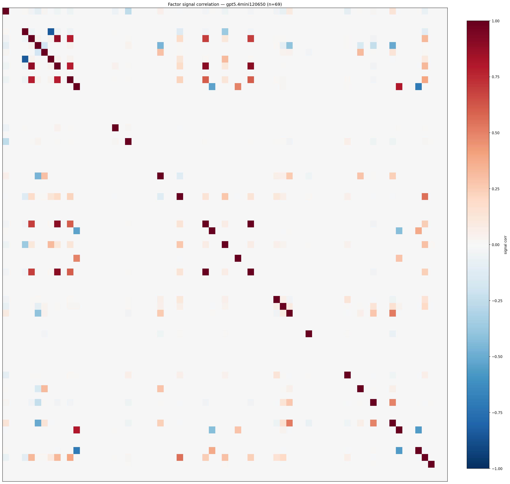

*Signal correlation matrix — gpt5.4mini120650*

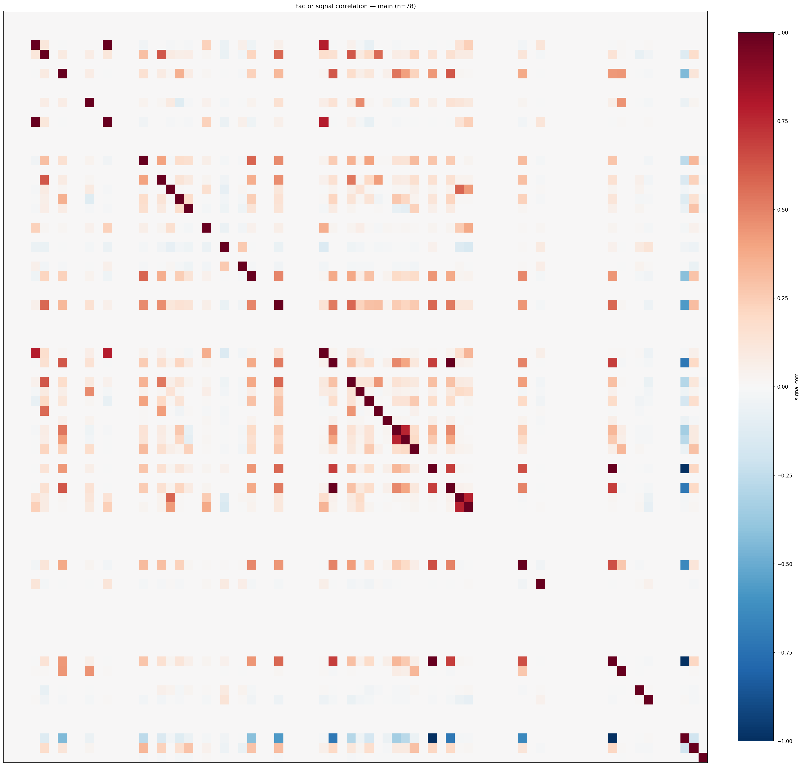

*Signal correlation matrix — main*

## 3. Deflation & model-based importance

`deflated_best_ic` haircuts each zoo's best |IC| for the number of factors tried (`ic_n_tested`) — a bigger zoo's best factor is more likely to be lucky. `lasso_n_nonzero` / `lasso_sparsity` show how many factors a sparse linear model actually keeps (model-view redundancy).

| prerun | best_ic | deflated_best_ic | deflated_best_t | ic_n_tested | ic_n_obs | lasso_n_nonzero | lasso_sparsity |
| --- | --- | --- | --- | --- | --- | --- | --- |
| gpt4omini120650 | 0.0157 | 0.0081 | 3.0608 | 64 | 143997 | 12 | 0.8182 |
| gpt5.4mini120650 | 0.0125 | 0.0056 | 2.1069 | 31 | 143997 | 0 | 1.0 |
| main | 0.0327 | 0.0256 | 9.7257 | 38 | 143997 | 0 | 1.0 |

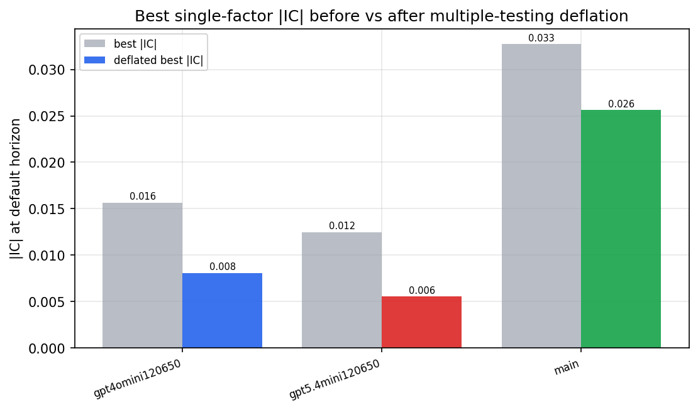

*Best |IC| before vs after multiple-testing deflation*

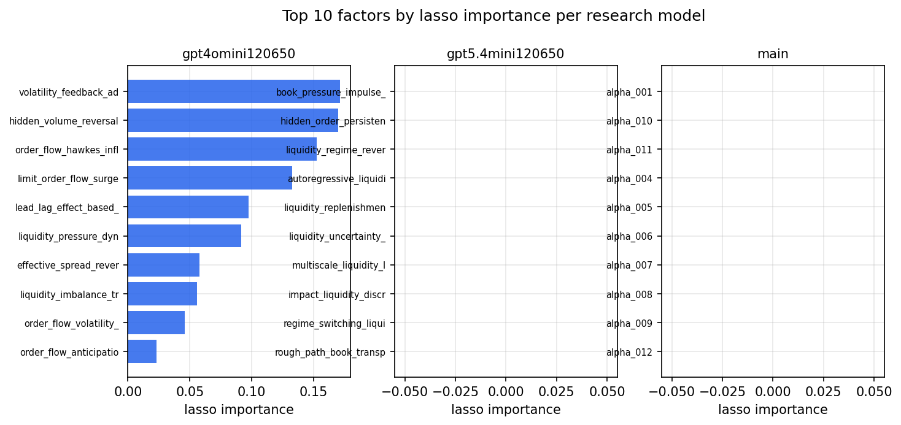

*Top factors by lasso importance per zoo*

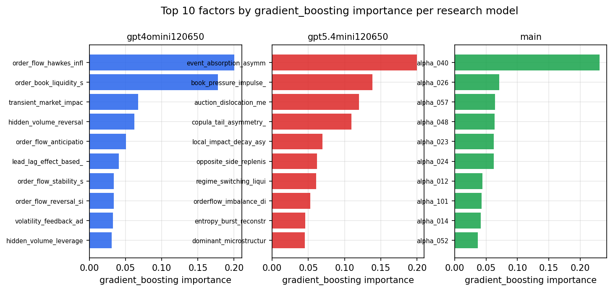

*Top factors by gradient_boosting importance per zoo*

## 4. ML-combined signal — per-underlying vectorised backtest

Each model combines a prerun's factors into ONE signal (fit `factors → forward return` on IS, predict per (bar, underlying)), then that combined signal is run through a simple vectorised backtest — `position(signal) × the underlying's own forward return` — on the held-out OOS tail (+ an equal-weight ensemble). No cross-sectional ranking.

> Config: position=**threshold** (t=1.0, z-score `expanding`), aggregation=**portfolio**, fit-standardise=**per_underlying**, horizon=6.

| prerun | model | n_factors_used | oos_ic | oos_sharpe | is_sharpe | oos_ann_return | oos_max_drawdown |
| --- | --- | --- | --- | --- | --- | --- | --- |
| gpt4omini120650 | linear_regression | 66 | -0.0089 | 2.1259 | 9.2455 | 0.145 | -0.0086 |
| gpt4omini120650 | ridge | 66 | -0.0077 | 2.8274 | 9.189 | 0.1903 | -0.0082 |
| gpt4omini120650 | lasso | 66 | nan | nan | nan | nan | nan |
| gpt4omini120650 | elastic_net | 66 | nan | nan | nan | nan | nan |
| gpt4omini120650 | random_forest | 66 | -0.0124 | 1.1381 | 9.3631 | 0.0638 | -0.0102 |
| gpt4omini120650 | gradient_boosting | 66 | -0.018 | 2.1088 | 8.6215 | 0.0649 | -0.0073 |
| gpt4omini120650 | xgboost | 66 | -0.0094 | 3.1722 | 12.5065 | 0.1779 | -0.0068 |
| gpt4omini120650 | lightgbm | 66 | -0.0133 | 3.6832 | 16.0221 | 0.2087 | -0.008 |
| gpt4omini120650 | ensemble | 66 | -0.0108 | 3.9034 | 13.104 | 0.2404 | -0.0071 |
| gpt5.4mini120650 | linear_regression | 69 | -0.0209 | -0.6757 | 7.0922 | -0.0609 | -0.0167 |
| gpt5.4mini120650 | ridge | 69 | -0.0205 | -0.4985 | 6.5242 | -0.0455 | -0.0174 |
| gpt5.4mini120650 | lasso | 69 | nan | nan | nan | nan | nan |
| gpt5.4mini120650 | elastic_net | 69 | nan | nan | nan | nan | nan |
| gpt5.4mini120650 | random_forest | 69 | -0.0171 | 1.4113 | 9.9842 | 0.1151 | -0.015 |
| gpt5.4mini120650 | gradient_boosting | 69 | -0.0121 | 1.219 | 6.7234 | 0.0355 | -0.0086 |
| gpt5.4mini120650 | xgboost | 69 | -0.0214 | -0.0958 | 10.06 | -0.0061 | -0.0136 |
| gpt5.4mini120650 | lightgbm | 69 | -0.0237 | 0.6889 | 15.4385 | 0.0368 | -0.0101 |
| gpt5.4mini120650 | ensemble | 69 | -0.0168 | -0.104 | 11.1595 | -0.0087 | -0.0162 |
| main | linear_regression | 78 | 0.0002 | 2.3847 | 8.2199 | 0.0395 | -0.0055 |
| main | ridge | 78 | -0.0013 | 3.2407 | 7.6859 | 0.055 | -0.0051 |
| main | lasso | 78 | nan | nan | nan | nan | nan |
| main | elastic_net | 78 | nan | nan | nan | nan | nan |
| main | random_forest | 78 | 0.0065 | 2.2091 | 17.6101 | 0.1455 | -0.0167 |
| main | gradient_boosting | 78 | 0.0125 | 1.3185 | 14.8833 | 0.0302 | -0.0054 |
| main | xgboost | 78 | 0.0043 | 3.6846 | 20.148 | 0.1817 | -0.0104 |
| main | lightgbm | 78 | 0.0069 | 5.7593 | 25.3877 | 0.2138 | -0.0074 |
| main | ensemble | 78 | 0.0027 | 5.6471 | 15.8911 | 0.1508 | -0.0049 |

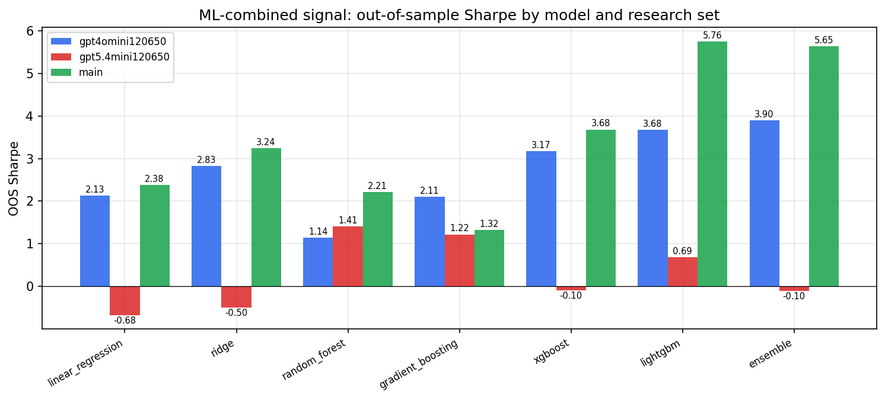

*ML-combined OOS Sharpe by model and research set*

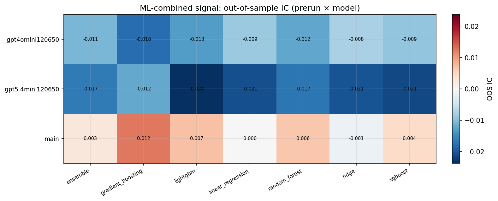

*ML-combined OOS IC (prerun × model)*

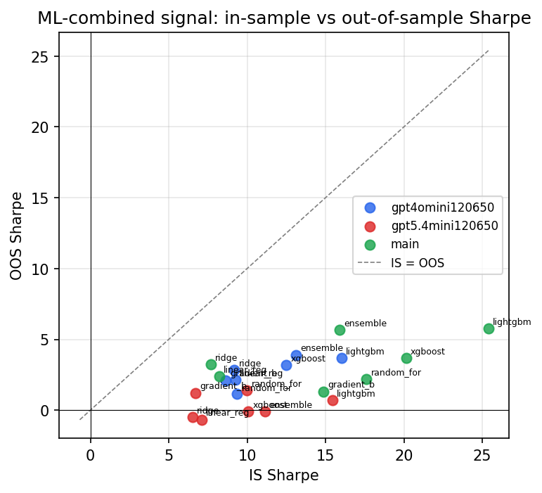

*IS vs OOS Sharpe (overfitting diagnostic)*

---
*Generated by `run_model_comparison.py`. Tables: `*.csv`; interactive: `comparison.ipynb`.*
