# Research-LLM factor comparison — `2024-10`

Comparing the **factor output of different research LLMs** on three axes (raw factor quality → factors as ML features → factors through the full agentic fund). The panel, IS/OOS split, horizon and model hyper-parameters are held identical across preruns — the *only* variable is the factor set.

## Preruns compared

| prerun | research_model | usable_factors | dropped_factors |
| --- | --- | --- | --- |
| gpt4omini120650 | gpt-4o-mini | 66 | 0 |
| gpt5.4mini120650 | gpt-5.4-mini | 69 | 0 |
| main | seed library | 78 | 10 |

> Dropped factors declare fields the current data doesn't have yet (e.g. fundamentals); they light up unchanged once that data is downloaded.

*Usable vs awaiting-data factors per research model*

## Key findings

- **Best ML-combined OOS Sharpe:** `gpt4omini120650` with `ridge` (OOS Sharpe = 7.264).
- **Mean OOS Sharpe across models, by research set:** `gpt4omini120650` = 4.224, `gpt5.4mini120650` = 3.710, `main` = 1.372.
- **Highest mean single-factor |IC| (h=6):** `main` (mean |IC| = 0.0089).
- **Most diverse zoo (highest effective/raw factor ratio):** `gpt5.4mini120650` (eff 49.8 of 69, ratio 0.72).
- **Best selection-deflated single-factor |IC|:** `main` (deflated |IC| = 0.0120 from 38 factors tried).

## 1. Single-factor IC (raw factor quality)

Per-underlying time-series Spearman rank-IC of every researched factor, recomputed on the shared panel at horizons h=1, h=6, h=60. The per-underlying IC correlates each factor's value vector with the underlying's own forward-return vector (pooled across underlyings); the cross-sectional IC ranks across underlyings per timestamp.

| prerun | n_factors | mean_abs_ic_1 | mean_abs_ic_6 | mean_abs_ic_60 | mean_abs_icir_6 | best_factor_h6 | best_abs_ic_h6 |
| --- | --- | --- | --- | --- | --- | --- | --- |
| gpt4omini120650 | 66 | 0.0038 | 0.006 | 0.0037 | 0.3063 | order_flow_saturation | 0.0184 |
| gpt5.4mini120650 | 69 | 0.0033 | 0.0045 | 0.0066 | 0.2473 | lstm_flow_price_mismatch | 0.0154 |
| main | 78 | 0.0053 | 0.0089 | 0.0037 | 0.4605 | alpha_084 | 0.019 |

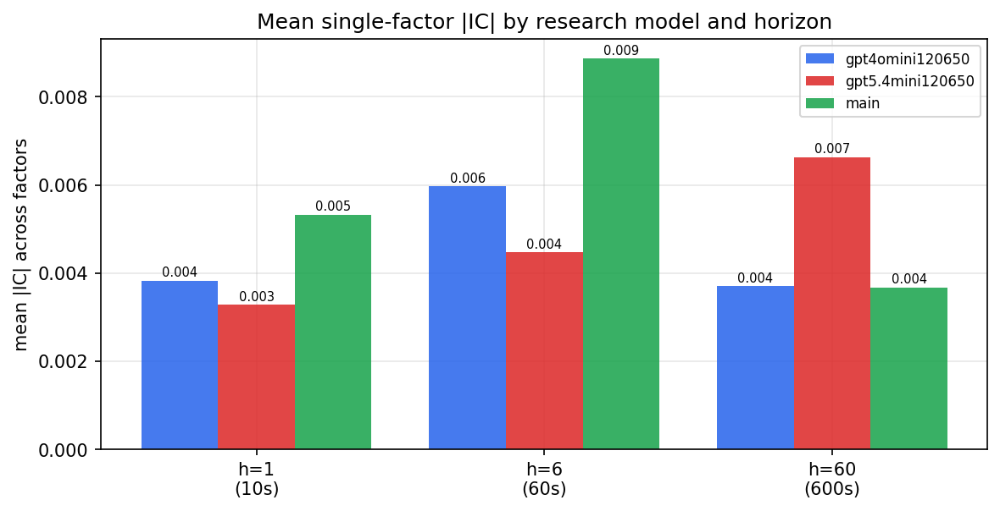

*Mean |IC| by research model and horizon*

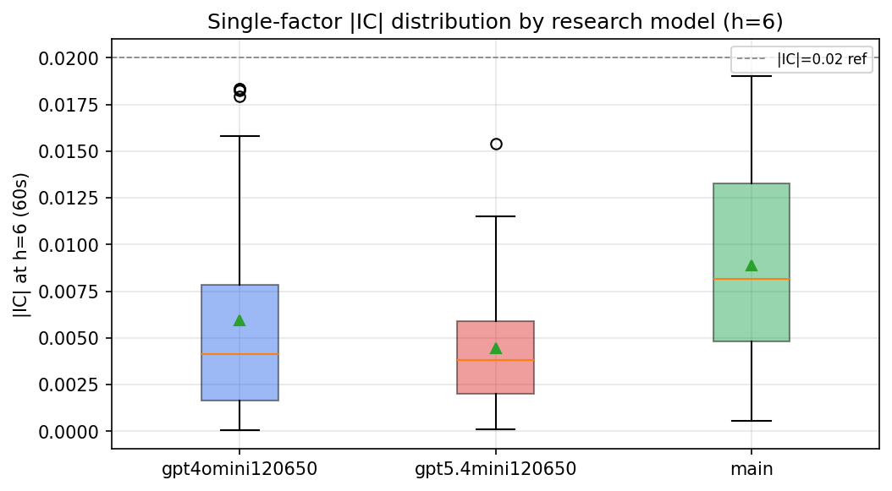

*Per-factor |IC| distribution by research model*

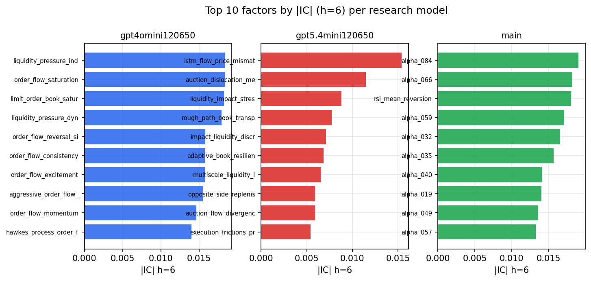

*Top factors by |IC| per research model*

## 2. Factor diversity & redundancy

Pairwise correlation of each zoo's *signals*. `eff_n_factors` is the effective number of independent factors (participation ratio of the correlation eigenvalues); `eff_ratio` and `redundancy` summarise how much unique information the zoo holds vs. how much is duplicated; `n_clusters` groups factors at |corr| ≥ 0.7.

| prerun | n_factors | eff_n_factors | eff_ratio | mean_abs_corr | n_clusters | redundancy |
| --- | --- | --- | --- | --- | --- | --- |
| gpt4omini120650 | 66 | 27.294 | 0.4135 | 0.0515 | 51 | 0.5865 |
| gpt5.4mini120650 | 69 | 49.8081 | 0.7219 | 0.0119 | 63 | 0.2781 |
| main | 78 | 43.3832 | 0.5562 | 0.0268 | 70 | 0.4438 |

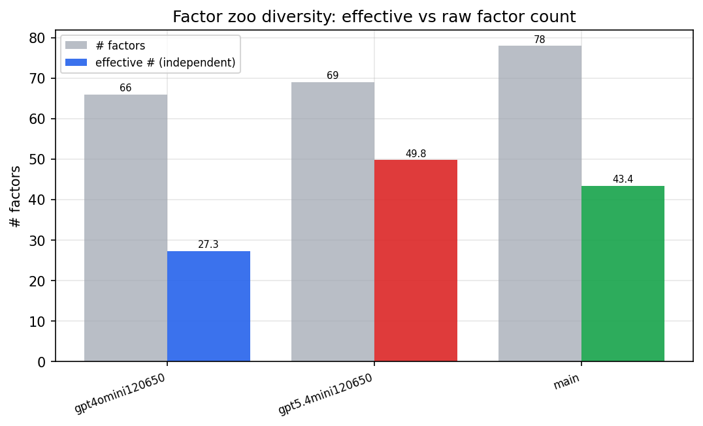

*Effective vs raw factor count per research model*

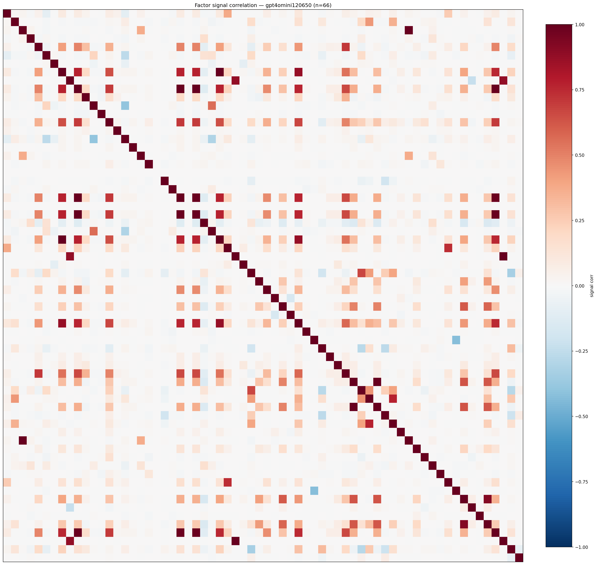

*Signal correlation matrix — gpt4omini120650*

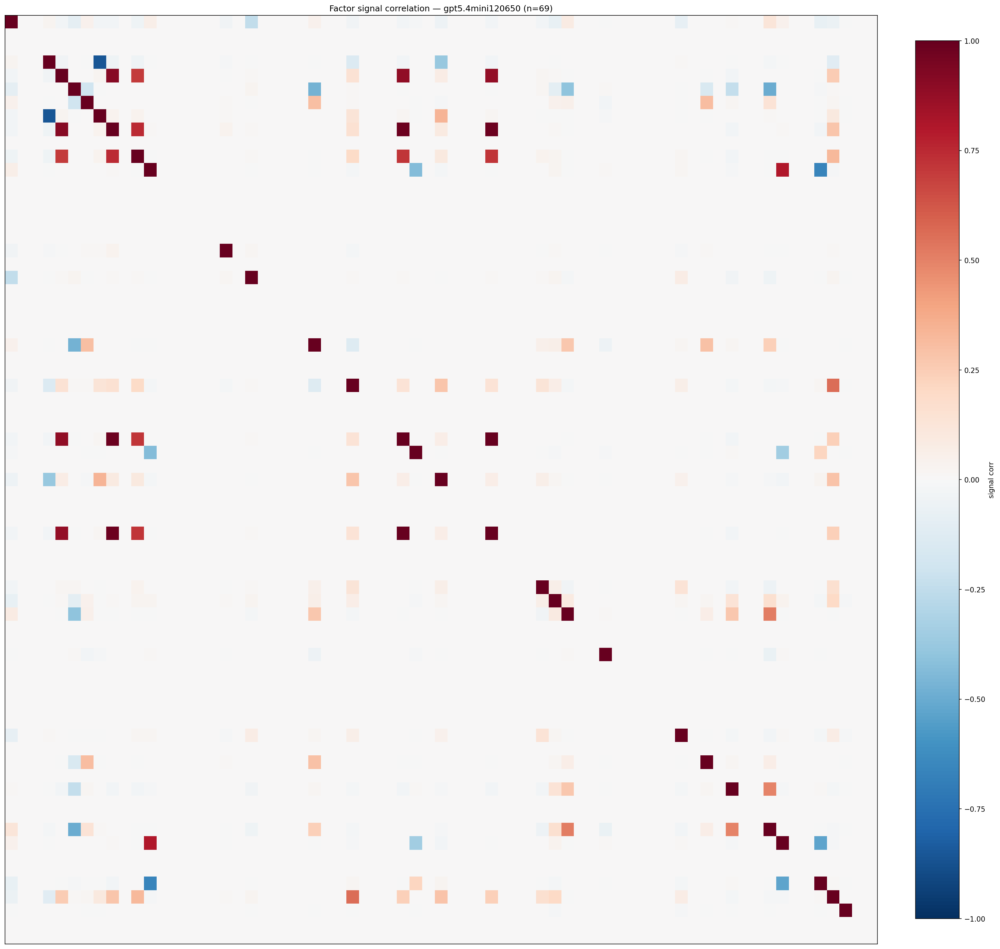

*Signal correlation matrix — gpt5.4mini120650*

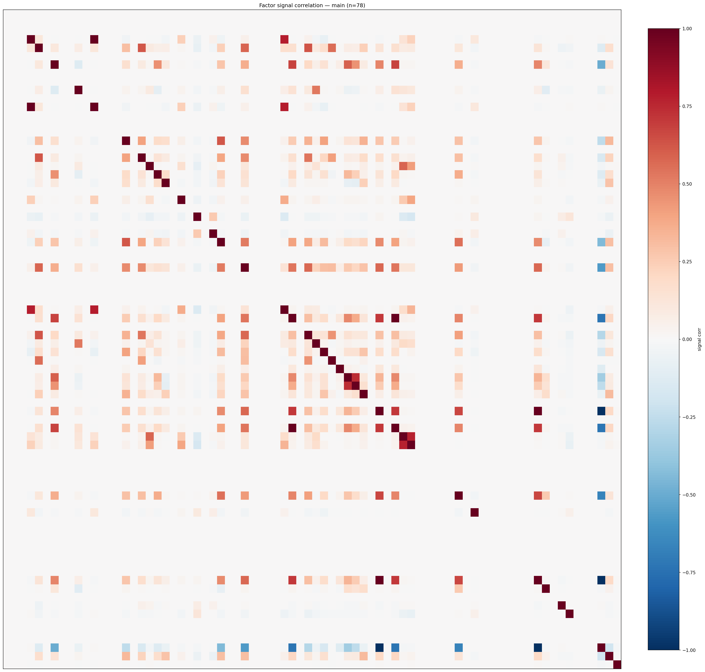

*Signal correlation matrix — main*

## 3. Deflation & model-based importance

`deflated_best_ic` haircuts each zoo's best |IC| for the number of factors tried (`ic_n_tested`) — a bigger zoo's best factor is more likely to be lucky. `lasso_n_nonzero` / `lasso_sparsity` show how many factors a sparse linear model actually keeps (model-view redundancy).

| prerun | best_ic | deflated_best_ic | deflated_best_t | ic_n_tested | ic_n_obs | lasso_n_nonzero | lasso_sparsity |
| --- | --- | --- | --- | --- | --- | --- | --- |
| gpt4omini120650 | 0.0184 | 0.0108 | 4.1655 | 64 | 147417 | 0 | 1.0 |
| gpt5.4mini120650 | 0.0154 | 0.0086 | 3.2853 | 31 | 147417 | 5 | 0.9275 |
| main | 0.019 | 0.012 | 4.6126 | 38 | 147417 | 27 | 0.6538 |

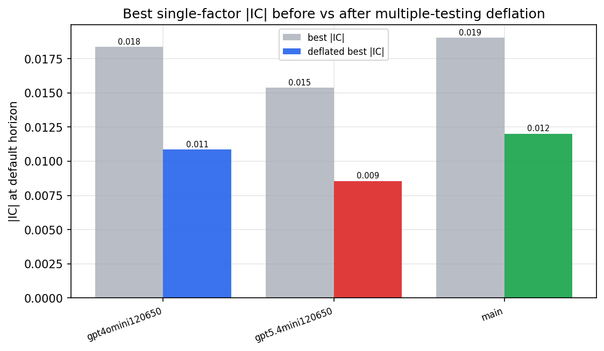

*Best |IC| before vs after multiple-testing deflation*

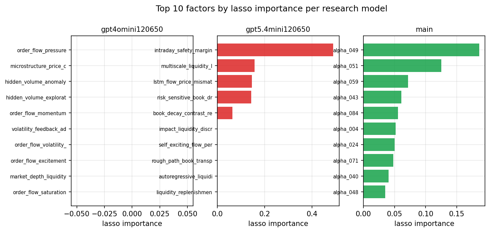

*Top factors by lasso importance per zoo*

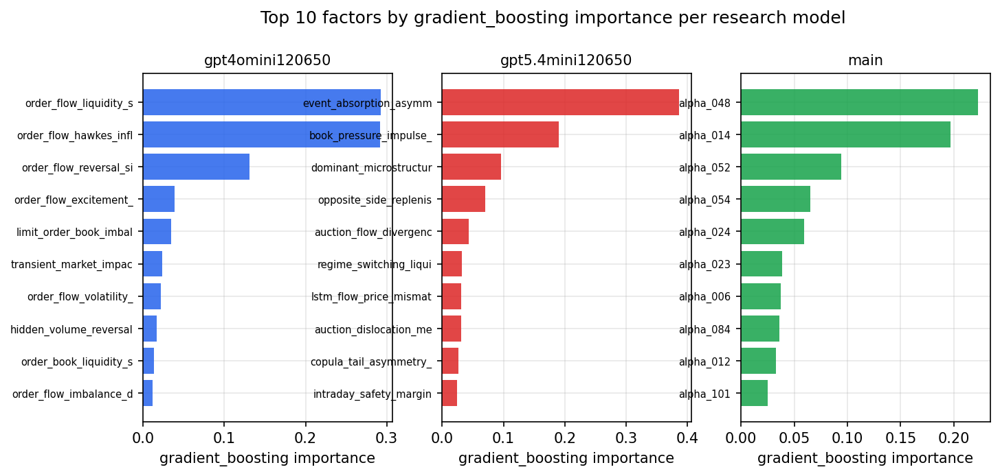

*Top factors by gradient_boosting importance per zoo*

## 4. ML-combined signal — per-underlying vectorised backtest

Each model combines a prerun's factors into ONE signal (fit `factors → forward return` on IS, predict per (bar, underlying)), then that combined signal is run through a simple vectorised backtest — `position(signal) × the underlying's own forward return` — on the held-out OOS tail (+ an equal-weight ensemble). No cross-sectional ranking.

> Config: position=**threshold** (t=1.0, z-score `expanding`), aggregation=**portfolio**, fit-standardise=**per_underlying**, horizon=6.

| prerun | model | n_factors_used | oos_ic | oos_sharpe | is_sharpe | oos_ann_return | oos_max_drawdown |
| --- | --- | --- | --- | --- | --- | --- | --- |
| gpt4omini120650 | linear_regression | 66 | 0.0084 | 6.6068 | 6.6027 | 0.4534 | -0.01 |
| gpt4omini120650 | ridge | 66 | 0.0085 | 7.2639 | 6.6075 | 0.4978 | -0.0095 |
| gpt4omini120650 | lasso | 66 | nan | nan | nan | nan | nan |
| gpt4omini120650 | elastic_net | 66 | nan | nan | nan | nan | nan |
| gpt4omini120650 | random_forest | 66 | -0.0054 | 3.2381 | 9.2293 | 0.1871 | -0.0119 |
| gpt4omini120650 | gradient_boosting | 66 | -0.0071 | 3.5859 | 11.482 | 0.1369 | -0.0053 |
| gpt4omini120650 | xgboost | 66 | 0.0035 | 3.2512 | 16.0562 | 0.1516 | -0.0119 |
| gpt4omini120650 | lightgbm | 66 | -0.0045 | 2.0559 | 21.9163 | 0.097 | -0.0116 |
| gpt4omini120650 | ensemble | 66 | 0.0041 | 3.5678 | 14.8328 | 0.228 | -0.0097 |
| gpt5.4mini120650 | linear_regression | 69 | -0.0106 | 2.5723 | 4.6828 | 0.0159 | -0.0014 |
| gpt5.4mini120650 | ridge | 69 | -0.0107 | 2.5824 | 3.6366 | 0.016 | -0.0014 |
| gpt5.4mini120650 | lasso | 69 | nan | nan | nan | nan | nan |
| gpt5.4mini120650 | elastic_net | 69 | nan | nan | nan | nan | nan |
| gpt5.4mini120650 | random_forest | 69 | -0.0175 | 2.8233 | 11.1227 | 0.1732 | -0.0136 |
| gpt5.4mini120650 | gradient_boosting | 69 | -0.0044 | 2.1097 | 8.6409 | 0.0189 | -0.002 |
| gpt5.4mini120650 | xgboost | 69 | -0.0147 | 4.8988 | 14.9583 | 0.2619 | -0.0095 |
| gpt5.4mini120650 | lightgbm | 69 | -0.0139 | 6.0607 | 21.1435 | 0.2846 | -0.0041 |
| gpt5.4mini120650 | ensemble | 69 | -0.0105 | 4.9224 | 10.9255 | 0.1912 | -0.003 |
| main | linear_regression | 78 | 0.0093 | 1.2834 | 8.8592 | 0.0191 | -0.0032 |
| main | ridge | 78 | 0.0081 | 2.9918 | 9.0265 | 0.0563 | -0.0027 |
| main | lasso | 78 | nan | nan | nan | nan | nan |
| main | elastic_net | 78 | nan | nan | nan | nan | nan |
| main | random_forest | 78 | -0.0042 | -0.1773 | 17.687 | -0.0075 | -0.0092 |
| main | gradient_boosting | 78 | -0.0052 | 0.9285 | 17.7278 | 0.0312 | -0.0102 |
| main | xgboost | 78 | -0.0023 | 0.6059 | 22.5197 | 0.024 | -0.011 |
| main | lightgbm | 78 | -0.0026 | 0.8758 | 28.9879 | 0.0262 | -0.0076 |
| main | ensemble | 78 | 0.0022 | 3.093 | 23.3541 | 0.1124 | -0.0068 |

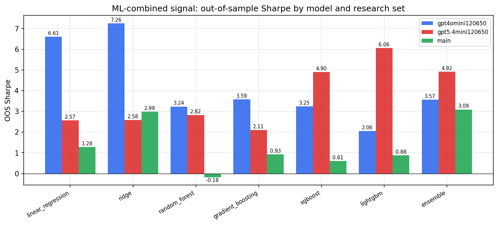

*ML-combined OOS Sharpe by model and research set*

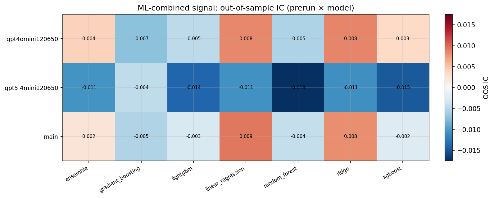

*ML-combined OOS IC (prerun × model)*

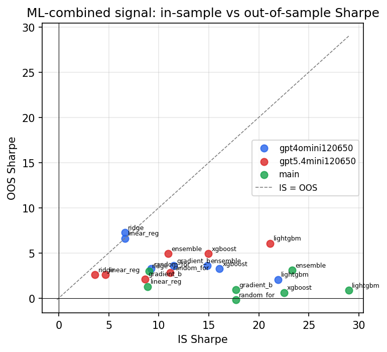

*IS vs OOS Sharpe (overfitting diagnostic)*

---
*Generated by `run_model_comparison.py`. Tables: `*.csv`; interactive: `comparison.ipynb`.*
