# Research-LLM factor comparison — `2024-11`

Comparing the **factor output of different research LLMs** on three axes (raw factor quality → factors as ML features → factors through the full agentic fund). The panel, IS/OOS split, horizon and model hyper-parameters are held identical across preruns — the *only* variable is the factor set.

## Preruns compared

| prerun | research_model | usable_factors | dropped_factors |
| --- | --- | --- | --- |
| gpt4omini120650 | gpt-4o-mini | 66 | 0 |
| gpt5.4mini120650 | gpt-5.4-mini | 69 | 0 |
| main | seed library | 78 | 10 |

> Dropped factors declare fields the current data doesn't have yet (e.g. fundamentals); they light up unchanged once that data is downloaded.

*Usable vs awaiting-data factors per research model*

## Key findings

- **Best ML-combined OOS Sharpe:** `gpt4omini120650` with `gradient_boosting` (OOS Sharpe = 5.160).
- **Mean OOS Sharpe across models, by research set:** `gpt4omini120650` = 0.769, `gpt5.4mini120650` = -0.822, `main` = -1.094.
- **Highest mean single-factor |IC| (h=6):** `main` (mean |IC| = 0.0057).
- **Most diverse zoo (highest effective/raw factor ratio):** `gpt5.4mini120650` (eff 50.6 of 69, ratio 0.73).
- **Best selection-deflated single-factor |IC|:** `main` (deflated |IC| = 0.0077 from 38 factors tried).

## 1. Single-factor IC (raw factor quality)

Per-underlying time-series Spearman rank-IC of every researched factor, recomputed on the shared panel at horizons h=1, h=6, h=60. The per-underlying IC correlates each factor's value vector with the underlying's own forward-return vector (pooled across underlyings); the cross-sectional IC ranks across underlyings per timestamp.

| prerun | n_factors | mean_abs_ic_1 | mean_abs_ic_6 | mean_abs_ic_60 | mean_abs_icir_6 | best_factor_h6 | best_abs_ic_h6 |
| --- | --- | --- | --- | --- | --- | --- | --- |
| gpt4omini120650 | 66 | 0.0047 | 0.0042 | 0.0066 | 0.2663 | hidden_volume_reaction_strength | 0.0098 |
| gpt5.4mini120650 | 69 | 0.004 | 0.0038 | 0.0092 | 0.2276 | auction_dislocation_mean_reversion | 0.0096 |
| main | 78 | 0.005 | 0.0057 | 0.0053 | 0.3792 | alpha_059 | 0.0148 |

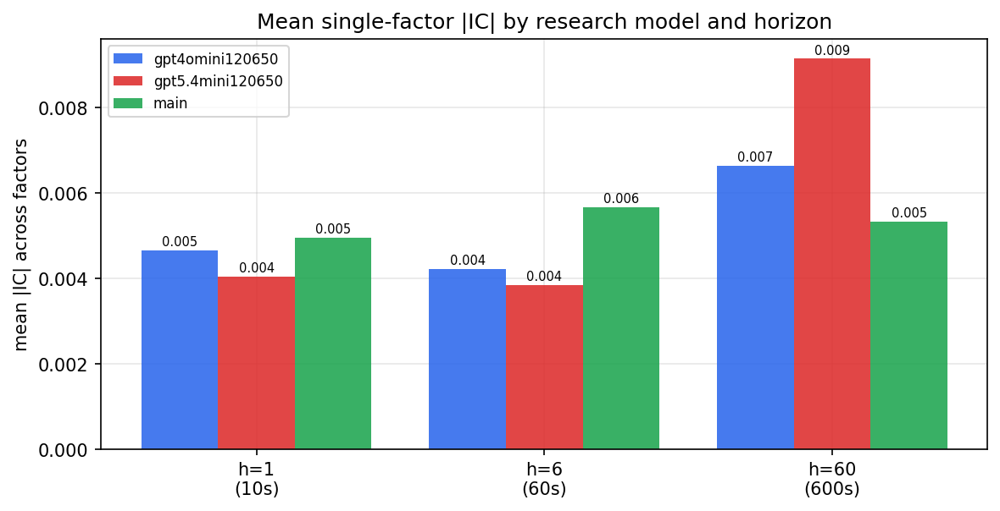

*Mean |IC| by research model and horizon*

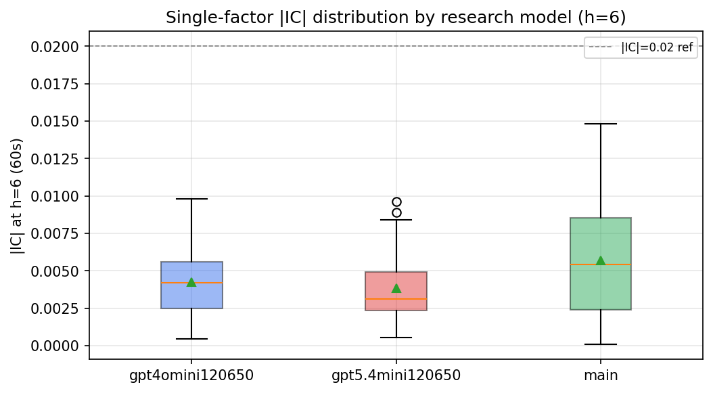

*Per-factor |IC| distribution by research model*

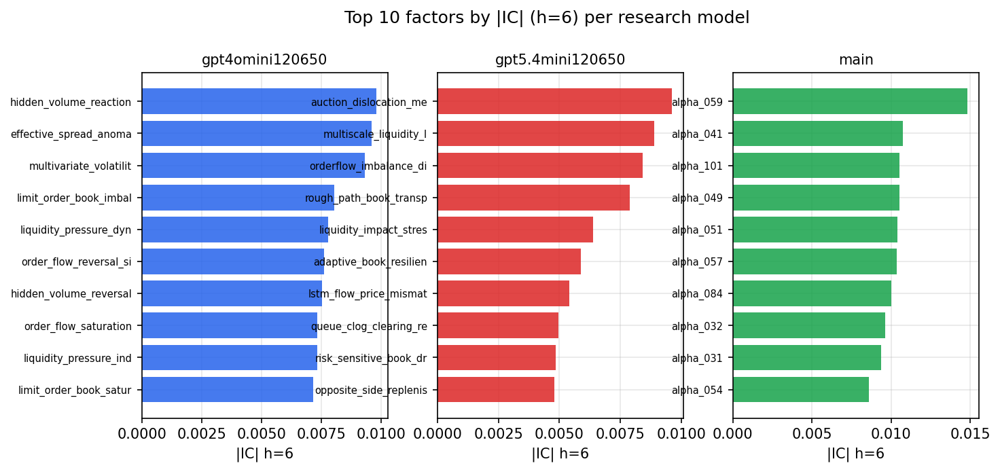

*Top factors by |IC| per research model*

## 2. Factor diversity & redundancy

Pairwise correlation of each zoo's *signals*. `eff_n_factors` is the effective number of independent factors (participation ratio of the correlation eigenvalues); `eff_ratio` and `redundancy` summarise how much unique information the zoo holds vs. how much is duplicated; `n_clusters` groups factors at |corr| ≥ 0.7.

| prerun | n_factors | eff_n_factors | eff_ratio | mean_abs_corr | n_clusters | redundancy |
| --- | --- | --- | --- | --- | --- | --- |
| gpt4omini120650 | 66 | 26.6738 | 0.4041 | 0.0527 | 49 | 0.5959 |
| gpt5.4mini120650 | 69 | 50.5936 | 0.7332 | 0.0123 | 62 | 0.2668 |
| main | 78 | 43.6154 | 0.5592 | 0.0265 | 70 | 0.4408 |

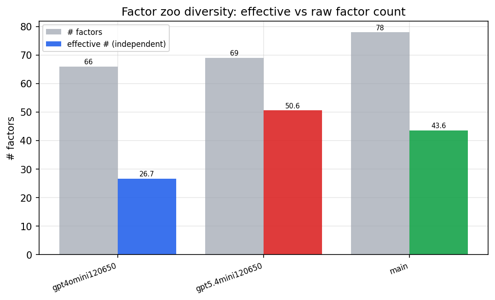

*Effective vs raw factor count per research model*

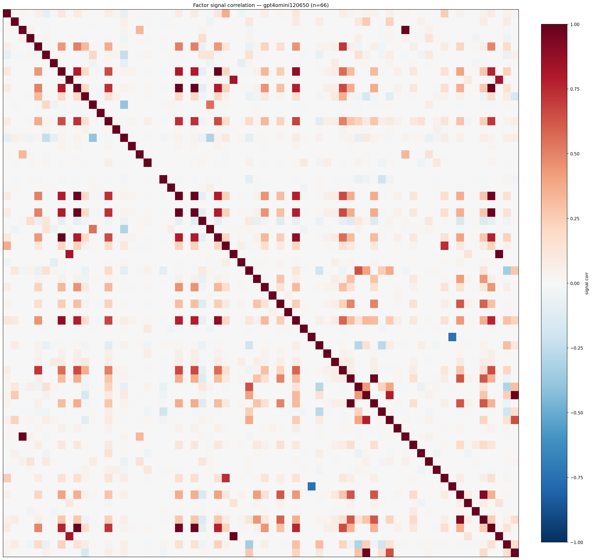

*Signal correlation matrix — gpt4omini120650*

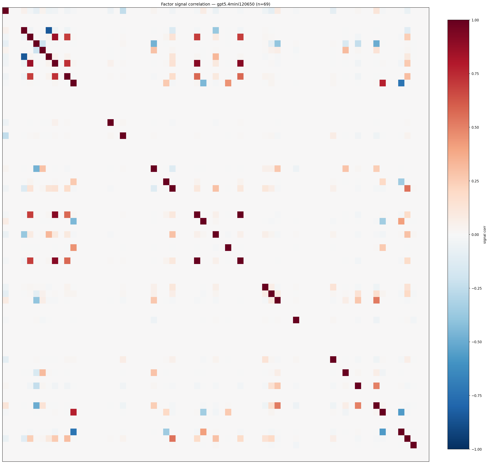

*Signal correlation matrix — gpt5.4mini120650*

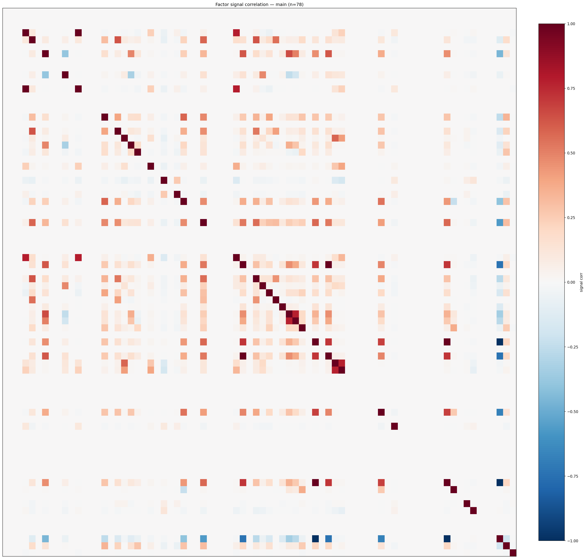

*Signal correlation matrix — main*

## 3. Deflation & model-based importance

`deflated_best_ic` haircuts each zoo's best |IC| for the number of factors tried (`ic_n_tested`) — a bigger zoo's best factor is more likely to be lucky. `lasso_n_nonzero` / `lasso_sparsity` show how many factors a sparse linear model actually keeps (model-view redundancy).

| prerun | best_ic | deflated_best_ic | deflated_best_t | ic_n_tested | ic_n_obs | lasso_n_nonzero | lasso_sparsity |
| --- | --- | --- | --- | --- | --- | --- | --- |
| gpt4omini120650 | 0.0098 | 0.0022 | 0.8346 | 64 | 143998 | 0 | 1.0 |
| gpt5.4mini120650 | 0.0096 | 0.0027 | 1.0236 | 31 | 143998 | 0 | 1.0 |
| main | 0.0148 | 0.0077 | 2.9243 | 38 | 143998 | 0 | 1.0 |

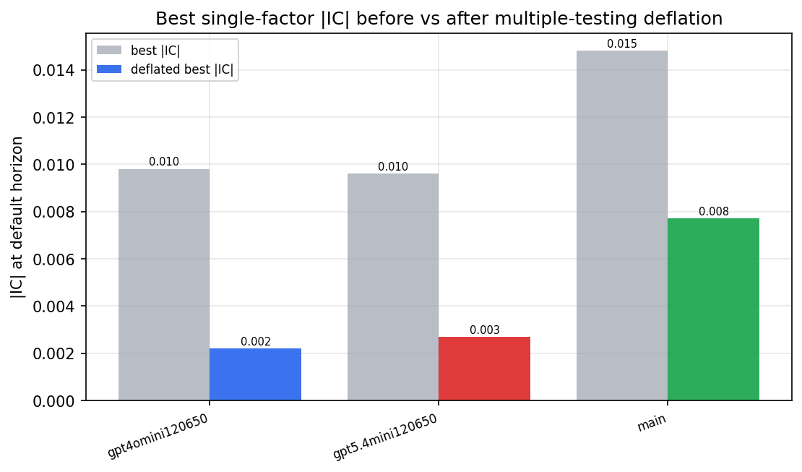

*Best |IC| before vs after multiple-testing deflation*

*Top factors by lasso importance per zoo*

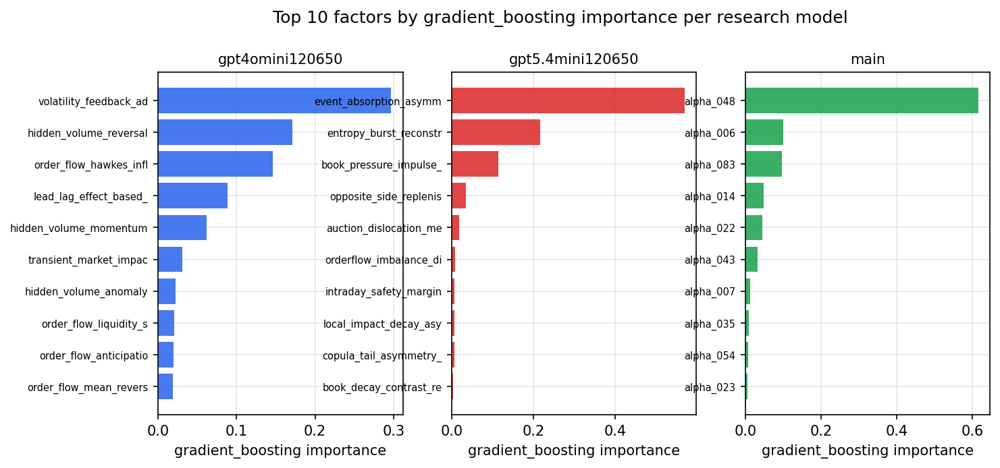

*Top factors by gradient_boosting importance per zoo*

## 4. ML-combined signal — per-underlying vectorised backtest

Each model combines a prerun's factors into ONE signal (fit `factors → forward return` on IS, predict per (bar, underlying)), then that combined signal is run through a simple vectorised backtest — `position(signal) × the underlying's own forward return` — on the held-out OOS tail (+ an equal-weight ensemble). No cross-sectional ranking.

> Config: position=**threshold** (t=1.0, z-score `expanding`), aggregation=**portfolio**, fit-standardise=**per_underlying**, horizon=6.

| prerun | model | n_factors_used | oos_ic | oos_sharpe | is_sharpe | oos_ann_return | oos_max_drawdown |
| --- | --- | --- | --- | --- | --- | --- | --- |
| gpt4omini120650 | linear_regression | 66 | 0.0091 | -4.1483 | 9.5002 | -0.429 | -0.039 |
| gpt4omini120650 | ridge | 66 | 0.0099 | -4.0988 | 9.3003 | -0.4238 | -0.0373 |
| gpt4omini120650 | lasso | 66 | 0.0123 | -0.2726 | 9.0368 | -0.0349 | -0.0358 |
| gpt4omini120650 | elastic_net | 66 | 0.012 | -0.3334 | 9.0437 | -0.0427 | -0.0358 |
| gpt4omini120650 | random_forest | 66 | 0.0104 | 2.6107 | 11.622 | 0.2645 | -0.018 |
| gpt4omini120650 | gradient_boosting | 66 | 0.0053 | 5.16 | 11.3994 | 0.3156 | -0.0063 |
| gpt4omini120650 | xgboost | 66 | 0.0106 | 0.5299 | 15.92 | 0.0447 | -0.017 |
| gpt4omini120650 | lightgbm | 66 | 0.0124 | 4.3514 | 22.5524 | 0.3134 | -0.0147 |
| gpt4omini120650 | ensemble | 66 | 0.0119 | 3.1221 | 16.0935 | 0.3417 | -0.0183 |
| gpt5.4mini120650 | linear_regression | 69 | -0.0 | -2.331 | 6.675 | -0.1984 | -0.0281 |
| gpt5.4mini120650 | ridge | 69 | -0.001 | -2.6686 | 6.1505 | -0.2216 | -0.0307 |
| gpt5.4mini120650 | lasso | 69 | -0.004 | -1.9633 | 6.2922 | -0.1794 | -0.0274 |
| gpt5.4mini120650 | elastic_net | 69 | -0.0038 | -1.9979 | 6.2081 | -0.1826 | -0.0278 |
| gpt5.4mini120650 | random_forest | 69 | 0.0019 | 0.7744 | 12.8011 | 0.0683 | -0.0175 |
| gpt5.4mini120650 | gradient_boosting | 69 | 0.0006 | 0.6458 | 9.9154 | 0.0215 | -0.0118 |
| gpt5.4mini120650 | xgboost | 69 | -0.0025 | 0.6414 | 14.9492 | 0.0501 | -0.0187 |
| gpt5.4mini120650 | lightgbm | 69 | -0.0065 | 1.3826 | 20.1252 | 0.1084 | -0.0158 |
| gpt5.4mini120650 | ensemble | 69 | -0.0038 | -1.8852 | 12.7334 | -0.232 | -0.0295 |
| main | linear_regression | 78 | -0.003 | -4.1236 | 5.3264 | -0.009 | -0.001 |
| main | ridge | 78 | -0.0037 | -4.6889 | 5.0107 | -0.0093 | -0.0009 |
| main | lasso | 78 | -0.006 | -0.9755 | 6.9971 | -0.0044 | -0.0012 |
| main | elastic_net | 78 | -0.006 | -0.3752 | 7.148 | -0.0017 | -0.0012 |
| main | random_forest | 78 | -0.0045 | 2.0463 | 19.3406 | 0.1953 | -0.0153 |
| main | gradient_boosting | 78 | -0.0032 | 0.6608 | 19.5857 | 0.0156 | -0.0062 |
| main | xgboost | 78 | -0.0043 | -0.5723 | 24.3769 | -0.0304 | -0.0124 |
| main | lightgbm | 78 | -0.0055 | -0.9559 | 27.6685 | -0.0224 | -0.0054 |
| main | ensemble | 78 | -0.0056 | -0.8623 | 24.8716 | -0.0203 | -0.0086 |

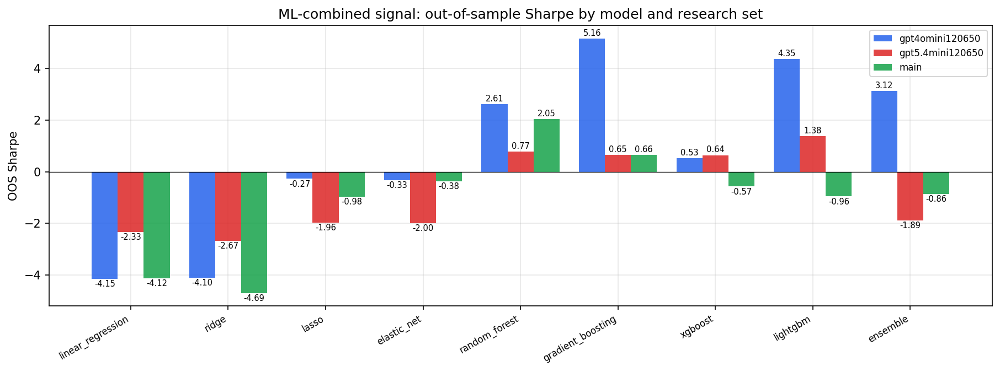

*ML-combined OOS Sharpe by model and research set*

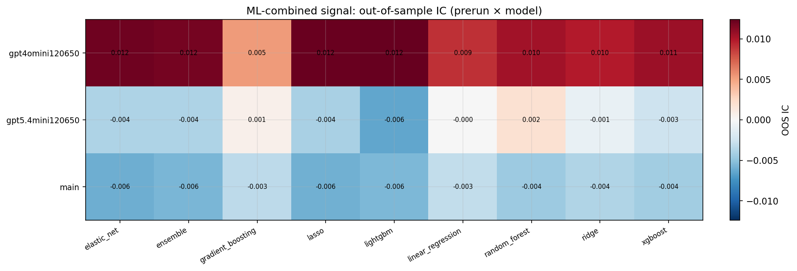

*ML-combined OOS IC (prerun × model)*

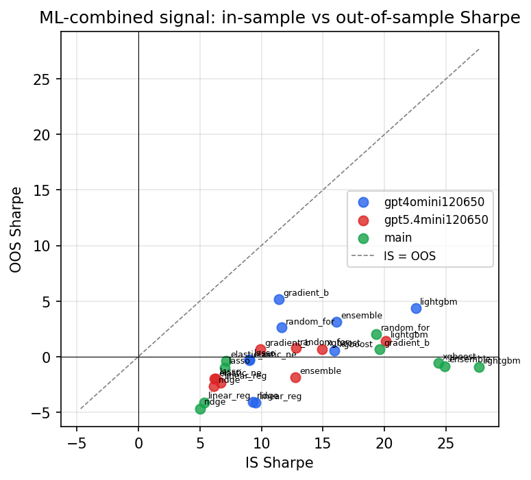

*IS vs OOS Sharpe (overfitting diagnostic)*

---
*Generated by `run_model_comparison.py`. Tables: `*.csv`; interactive: `comparison.ipynb`.*
