# Research-LLM factor comparison — `2024-12`

Comparing the **factor output of different research LLMs** on three axes (raw factor quality → factors as ML features → factors through the full agentic fund). The panel, IS/OOS split, horizon and model hyper-parameters are held identical across preruns — the *only* variable is the factor set.

## Preruns compared

| prerun | research_model | usable_factors | dropped_factors |
| --- | --- | --- | --- |
| gpt4omini120650 | gpt-4o-mini | 66 | 0 |
| gpt5.4mini120650 | gpt-5.4-mini | 69 | 0 |
| main | seed library | 78 | 10 |

> Dropped factors declare fields the current data doesn't have yet (e.g. fundamentals); they light up unchanged once that data is downloaded.

*Usable vs awaiting-data factors per research model*

## Key findings

- **Best ML-combined OOS Sharpe:** `gpt4omini120650` with `lightgbm` (OOS Sharpe = 5.921).
- **Mean OOS Sharpe across models, by research set:** `gpt4omini120650` = 3.668, `gpt5.4mini120650` = 2.941, `main` = 2.236.
- **Highest mean single-factor |IC| (h=6):** `main` (mean |IC| = 0.0047).
- **Most diverse zoo (highest effective/raw factor ratio):** `gpt5.4mini120650` (eff 53.4 of 69, ratio 0.77).
- **Best selection-deflated single-factor |IC|:** `gpt5.4mini120650` (deflated |IC| = 0.0072 from 31 factors tried).

## 1. Single-factor IC (raw factor quality)

Per-underlying time-series Spearman rank-IC of every researched factor, recomputed on the shared panel at horizons h=1, h=6, h=60. The per-underlying IC correlates each factor's value vector with the underlying's own forward-return vector (pooled across underlyings); the cross-sectional IC ranks across underlyings per timestamp.

| prerun | n_factors | mean_abs_ic_1 | mean_abs_ic_6 | mean_abs_ic_60 | mean_abs_icir_6 | best_factor_h6 | best_abs_ic_h6 |
| --- | --- | --- | --- | --- | --- | --- | --- |
| gpt4omini120650 | 66 | 0.0056 | 0.0034 | 0.0078 | 0.2236 | order_flow_anticipation_indicators | 0.0123 |
| gpt5.4mini120650 | 69 | 0.0049 | 0.0041 | 0.0078 | 0.2343 | queue_clog_clearing_reversion | 0.014 |
| main | 78 | 0.0032 | 0.0047 | 0.0066 | 0.2858 | alpha_043 | 0.0119 |

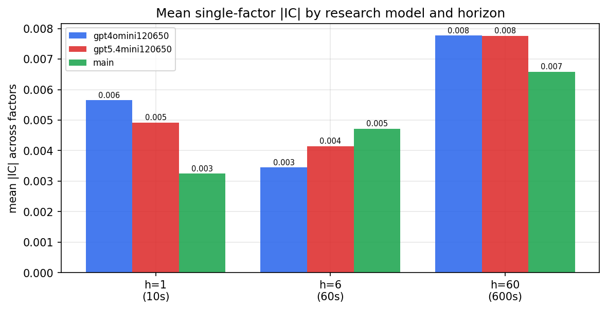

*Mean |IC| by research model and horizon*

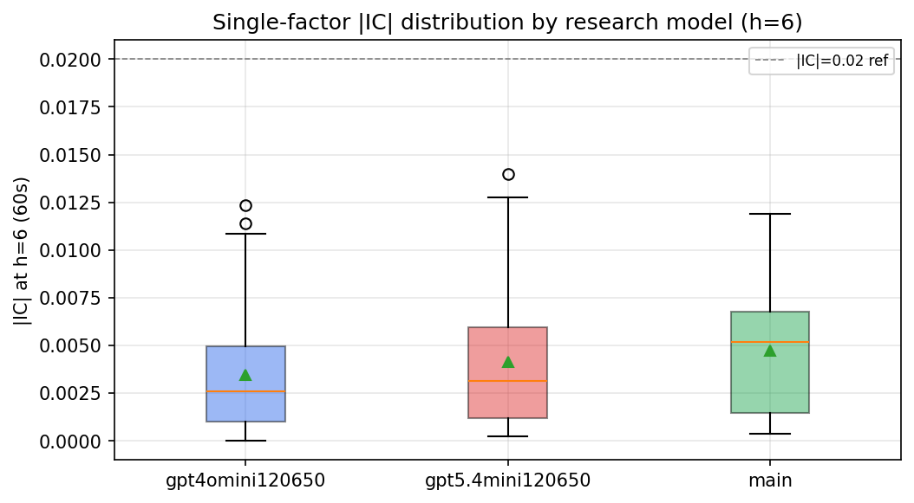

*Per-factor |IC| distribution by research model*

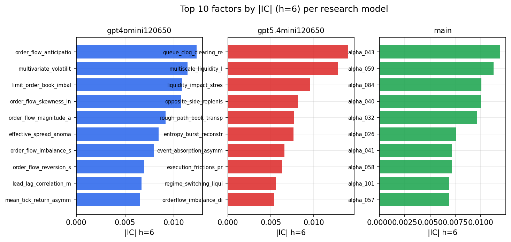

*Top factors by |IC| per research model*

## 2. Factor diversity & redundancy

Pairwise correlation of each zoo's *signals*. `eff_n_factors` is the effective number of independent factors (participation ratio of the correlation eigenvalues); `eff_ratio` and `redundancy` summarise how much unique information the zoo holds vs. how much is duplicated; `n_clusters` groups factors at |corr| ≥ 0.7.

| prerun | n_factors | eff_n_factors | eff_ratio | mean_abs_corr | n_clusters | redundancy |
| --- | --- | --- | --- | --- | --- | --- |
| gpt4omini120650 | 66 | 26.8375 | 0.4066 | 0.0508 | 51 | 0.5934 |
| gpt5.4mini120650 | 69 | 53.4383 | 0.7745 | 0.0114 | 63 | 0.2255 |
| main | 78 | 43.4899 | 0.5576 | 0.0265 | 70 | 0.4424 |

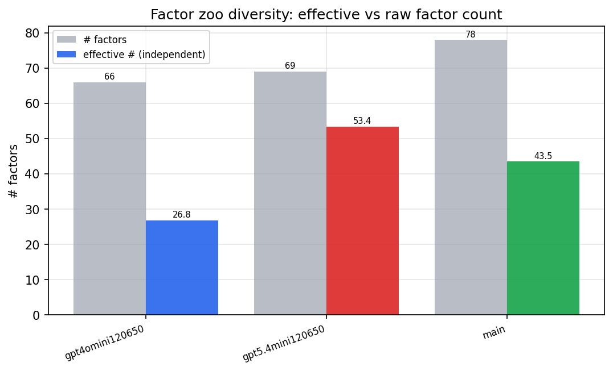

*Effective vs raw factor count per research model*

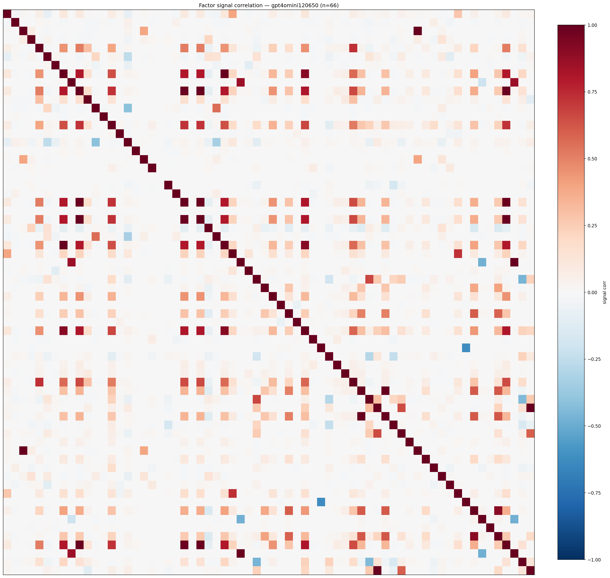

*Signal correlation matrix — gpt4omini120650*

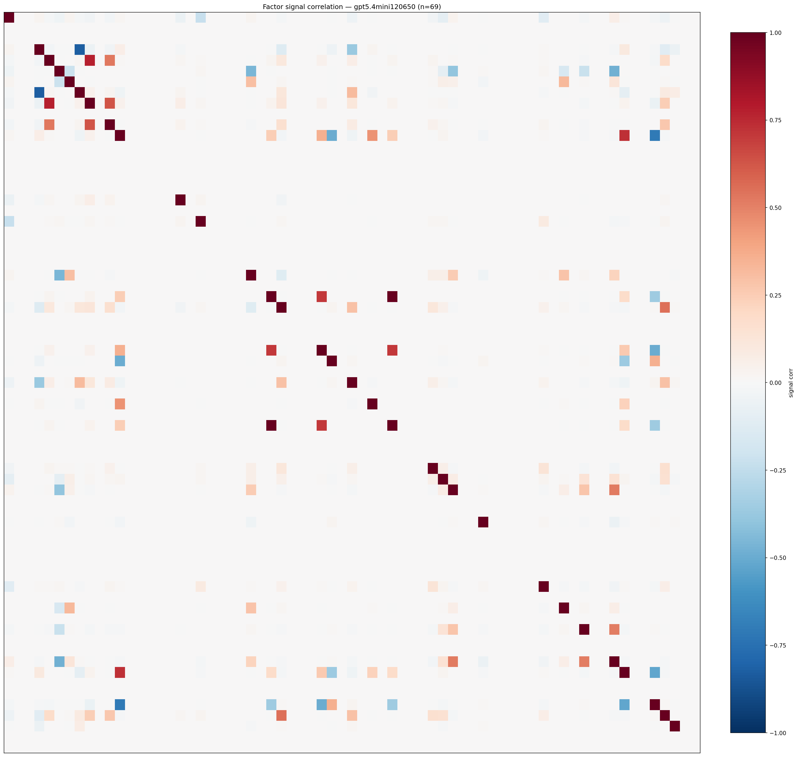

*Signal correlation matrix — gpt5.4mini120650*

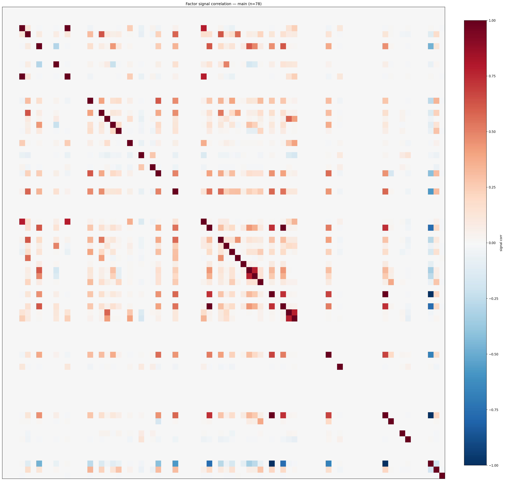

*Signal correlation matrix — main*

## 3. Deflation & model-based importance

`deflated_best_ic` haircuts each zoo's best |IC| for the number of factors tried (`ic_n_tested`) — a bigger zoo's best factor is more likely to be lucky. `lasso_n_nonzero` / `lasso_sparsity` show how many factors a sparse linear model actually keeps (model-view redundancy).

| prerun | best_ic | deflated_best_ic | deflated_best_t | ic_n_tested | ic_n_obs | lasso_n_nonzero | lasso_sparsity |
| --- | --- | --- | --- | --- | --- | --- | --- |
| gpt4omini120650 | 0.0123 | 0.0048 | 1.8549 | 64 | 147599 | 2 | 0.9697 |
| gpt5.4mini120650 | 0.014 | 0.0072 | 2.7539 | 31 | 147599 | 0 | 1.0 |
| main | 0.0119 | 0.0049 | 1.8743 | 38 | 147599 | 1 | 0.9872 |

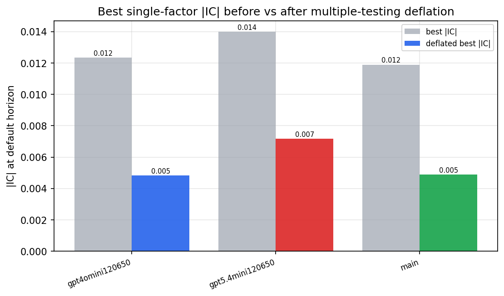

*Best |IC| before vs after multiple-testing deflation*

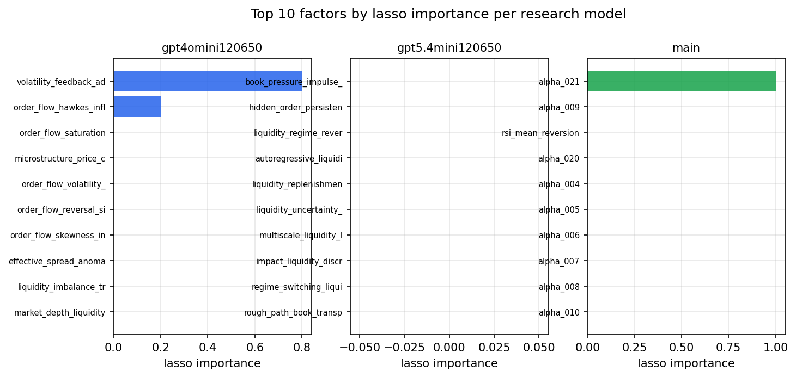

*Top factors by lasso importance per zoo*

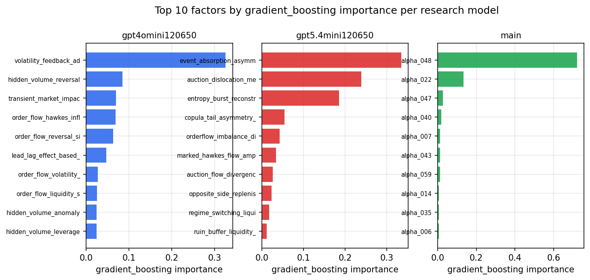

*Top factors by gradient_boosting importance per zoo*

## 4. ML-combined signal — per-underlying vectorised backtest

Each model combines a prerun's factors into ONE signal (fit `factors → forward return` on IS, predict per (bar, underlying)), then that combined signal is run through a simple vectorised backtest — `position(signal) × the underlying's own forward return` — on the held-out OOS tail (+ an equal-weight ensemble). No cross-sectional ranking.

> Config: position=**threshold** (t=1.0, z-score `expanding`), aggregation=**portfolio**, fit-standardise=**per_underlying**, horizon=6.

| prerun | model | n_factors_used | oos_ic | oos_sharpe | is_sharpe | oos_ann_return | oos_max_drawdown |
| --- | --- | --- | --- | --- | --- | --- | --- |
| gpt4omini120650 | linear_regression | 66 | -0.0057 | 4.6735 | 7.2216 | 0.2844 | -0.0162 |
| gpt4omini120650 | ridge | 66 | -0.0051 | 3.6065 | 7.8142 | 0.2312 | -0.0176 |
| gpt4omini120650 | lasso | 66 | nan | nan | nan | nan | nan |
| gpt4omini120650 | elastic_net | 66 | nan | nan | nan | nan | nan |
| gpt4omini120650 | random_forest | 66 | 0.0111 | -0.8377 | 8.78 | -0.0365 | -0.017 |
| gpt4omini120650 | gradient_boosting | 66 | -0.0017 | 2.5167 | 7.4374 | 0.0569 | -0.0046 |
| gpt4omini120650 | xgboost | 66 | 0.0081 | 5.3279 | 9.034 | 0.1767 | -0.0054 |
| gpt4omini120650 | lightgbm | 66 | 0.0104 | 5.9207 | 12.1112 | 0.2464 | -0.0059 |
| gpt4omini120650 | ensemble | 66 | -0.0017 | 4.4713 | 8.5708 | 0.0979 | -0.0038 |
| gpt5.4mini120650 | linear_regression | 69 | 0.0151 | 2.0352 | 4.986 | 0.077 | -0.0092 |
| gpt5.4mini120650 | ridge | 69 | 0.0151 | 2.0192 | 4.8549 | 0.0762 | -0.0089 |
| gpt5.4mini120650 | lasso | 69 | nan | nan | nan | nan | nan |
| gpt5.4mini120650 | elastic_net | 69 | nan | nan | nan | nan | nan |
| gpt5.4mini120650 | random_forest | 69 | 0.0078 | 2.7451 | 8.7759 | 0.0962 | -0.0072 |
| gpt5.4mini120650 | gradient_boosting | 69 | 0.0075 | 5.2546 | 8.3175 | 0.0385 | -0.0008 |
| gpt5.4mini120650 | xgboost | 69 | 0.0045 | 3.8048 | 8.9088 | 0.1289 | -0.0048 |
| gpt5.4mini120650 | lightgbm | 69 | 0.0061 | 3.7213 | 10.9401 | 0.0868 | -0.0038 |
| gpt5.4mini120650 | ensemble | 69 | 0.0089 | 1.0073 | 5.4518 | 0.0005 | -0.0001 |
| main | linear_regression | 78 | 0.0078 | 5.6007 | 5.8323 | 0.2507 | -0.0052 |
| main | ridge | 78 | 0.0083 | 5.1057 | 6.2711 | 0.2341 | -0.007 |
| main | lasso | 78 | nan | nan | nan | nan | nan |
| main | elastic_net | 78 | nan | nan | nan | nan | nan |
| main | random_forest | 78 | 0.003 | 2.2594 | 8.3609 | 0.064 | -0.0089 |
| main | gradient_boosting | 78 | 0.0033 | -3.6656 | 5.753 | -0.028 | -0.003 |
| main | xgboost | 78 | -0.0054 | 2.2797 | 8.048 | 0.0464 | -0.0042 |
| main | lightgbm | 78 | -0.0056 | 3.7608 | 10.9686 | 0.0498 | -0.003 |
| main | ensemble | 78 | 0.005 | 0.3139 | 3.9893 | 0.0002 | -0.0001 |

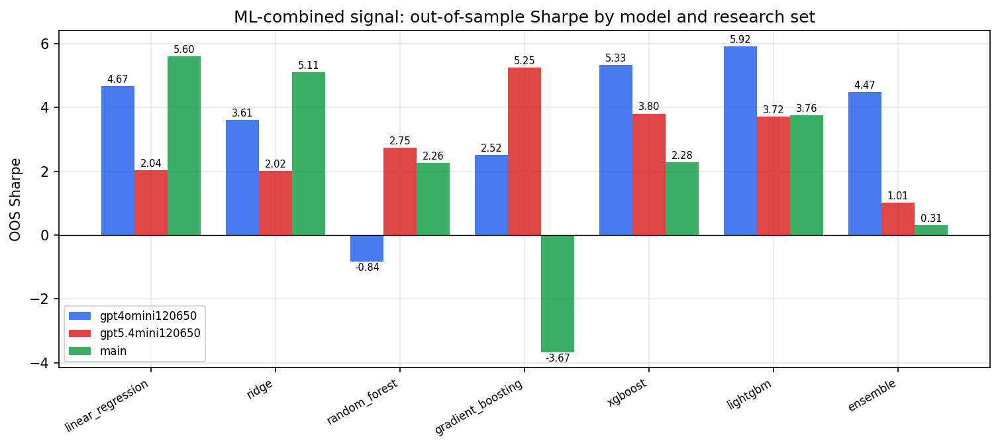

*ML-combined OOS Sharpe by model and research set*

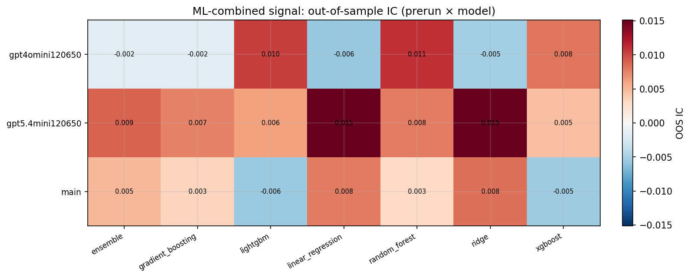

*ML-combined OOS IC (prerun × model)*

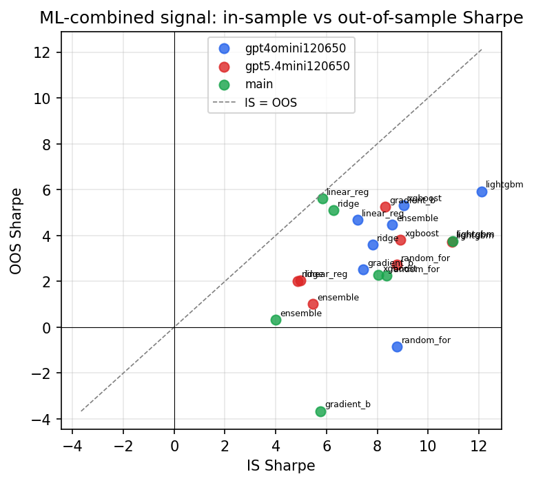

*IS vs OOS Sharpe (overfitting diagnostic)*

---
*Generated by `run_model_comparison.py`. Tables: `*.csv`; interactive: `comparison.ipynb`.*
