# Research-LLM factor comparison — `2025-01`

Comparing the **factor output of different research LLMs** on three axes (raw factor quality → factors as ML features → factors through the full agentic fund). The panel, IS/OOS split, horizon and model hyper-parameters are held identical across preruns — the *only* variable is the factor set.

## Preruns compared

| prerun | research_model | usable_factors | dropped_factors |
| --- | --- | --- | --- |
| gpt4omini120650 | gpt-4o-mini | 66 | 0 |
| gpt5.4mini120650 | gpt-5.4-mini | 69 | 0 |
| main | seed library | 78 | 10 |

> Dropped factors declare fields the current data doesn't have yet (e.g. fundamentals); they light up unchanged once that data is downloaded.

*Usable vs awaiting-data factors per research model*

## Key findings

- **Best ML-combined OOS Sharpe:** `gpt4omini120650` with `ridge` (OOS Sharpe = 5.491).
- **Mean OOS Sharpe across models, by research set:** `main` = 2.231, `gpt4omini120650` = 0.801, `gpt5.4mini120650` = 0.513.
- **Highest mean single-factor |IC| (h=6):** `main` (mean |IC| = 0.0063).
- **Most diverse zoo (highest effective/raw factor ratio):** `gpt5.4mini120650` (eff 53.4 of 69, ratio 0.77).
- **Best selection-deflated single-factor |IC|:** `main` (deflated |IC| = 0.0105 from 38 factors tried).

## 1. Single-factor IC (raw factor quality)

Per-underlying time-series Spearman rank-IC of every researched factor, recomputed on the shared panel at horizons h=1, h=6, h=60. The per-underlying IC correlates each factor's value vector with the underlying's own forward-return vector (pooled across underlyings); the cross-sectional IC ranks across underlyings per timestamp.

| prerun | n_factors | mean_abs_ic_1 | mean_abs_ic_6 | mean_abs_ic_60 | mean_abs_icir_6 | best_factor_h6 | best_abs_ic_h6 |
| --- | --- | --- | --- | --- | --- | --- | --- |
| gpt4omini120650 | 66 | 0.0079 | 0.0056 | 0.0112 | 0.3184 | order_flow_skewness_indicator | 0.0165 |
| gpt5.4mini120650 | 69 | 0.0054 | 0.0045 | 0.0098 | 0.2597 | entropy_burst_reconstruction | 0.0115 |
| main | 78 | 0.0026 | 0.0063 | 0.0082 | 0.327 | alpha_043 | 0.0177 |

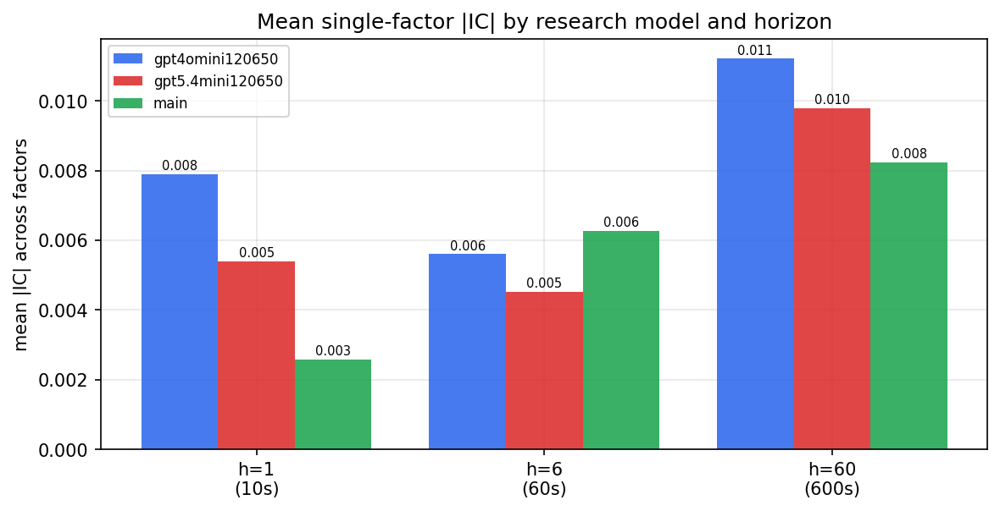

*Mean |IC| by research model and horizon*

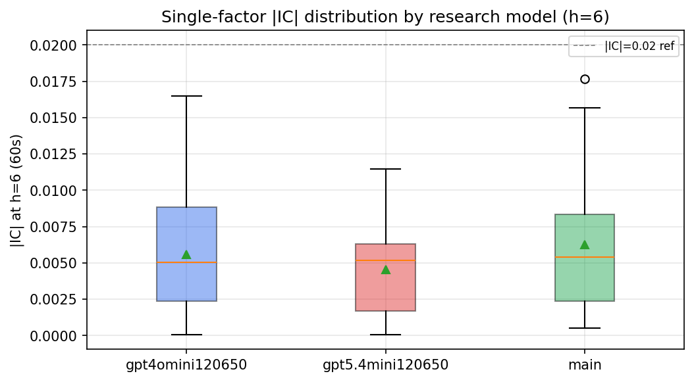

*Per-factor |IC| distribution by research model*

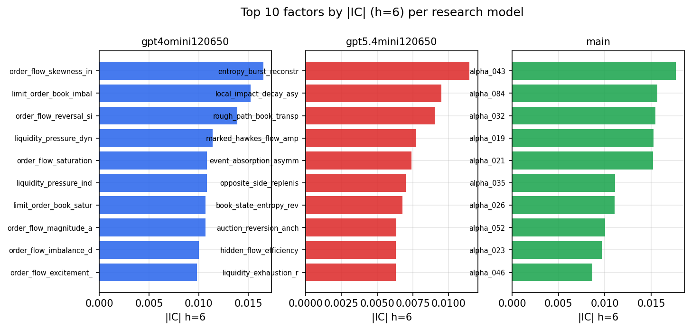

*Top factors by |IC| per research model*

## 2. Factor diversity & redundancy

Pairwise correlation of each zoo's *signals*. `eff_n_factors` is the effective number of independent factors (participation ratio of the correlation eigenvalues); `eff_ratio` and `redundancy` summarise how much unique information the zoo holds vs. how much is duplicated; `n_clusters` groups factors at |corr| ≥ 0.7.

| prerun | n_factors | eff_n_factors | eff_ratio | mean_abs_corr | n_clusters | redundancy |
| --- | --- | --- | --- | --- | --- | --- |
| gpt4omini120650 | 66 | 27.5566 | 0.4175 | 0.0486 | 50 | 0.5825 |
| gpt5.4mini120650 | 69 | 53.4237 | 0.7743 | 0.0109 | 64 | 0.2257 |
| main | 78 | 44.0922 | 0.5653 | 0.0259 | 70 | 0.4347 |

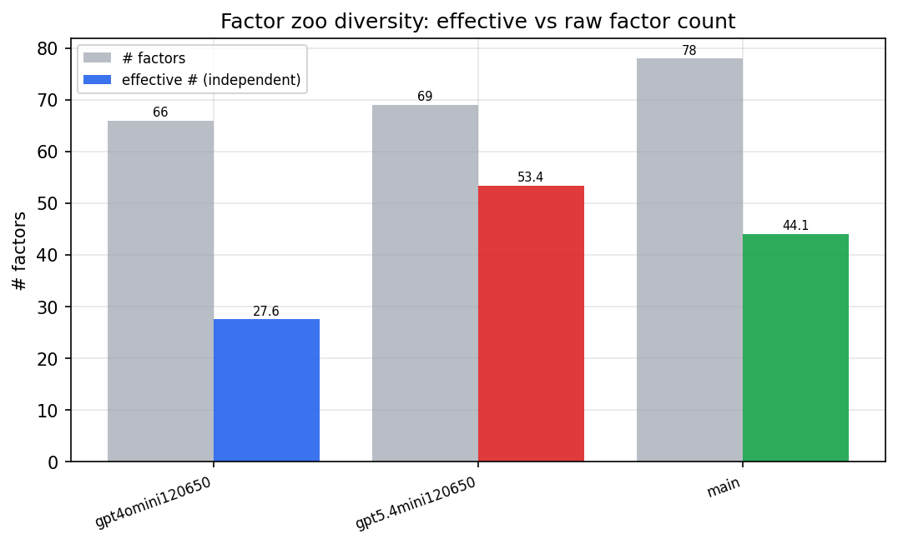

*Effective vs raw factor count per research model*

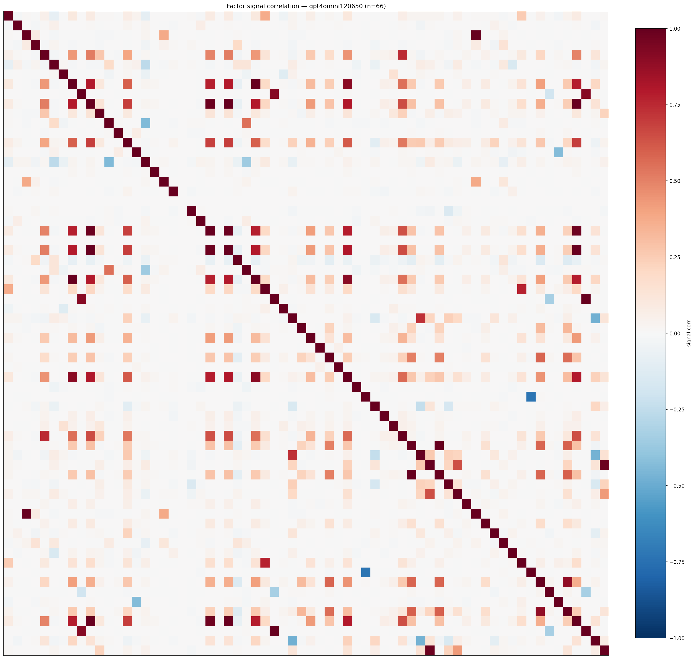

*Signal correlation matrix — gpt4omini120650*

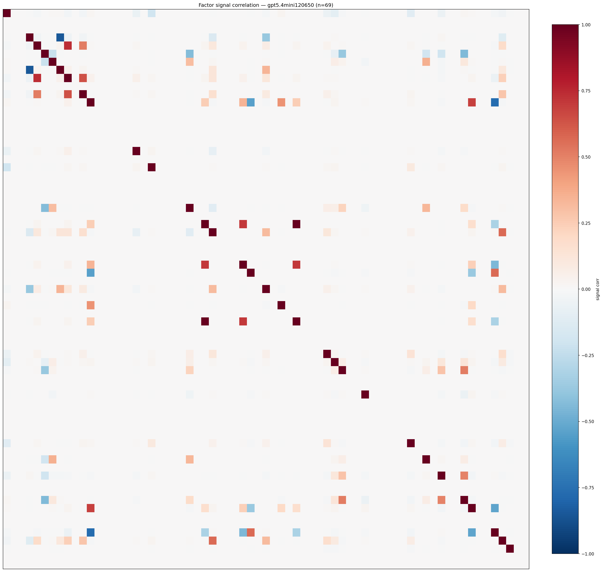

*Signal correlation matrix — gpt5.4mini120650*

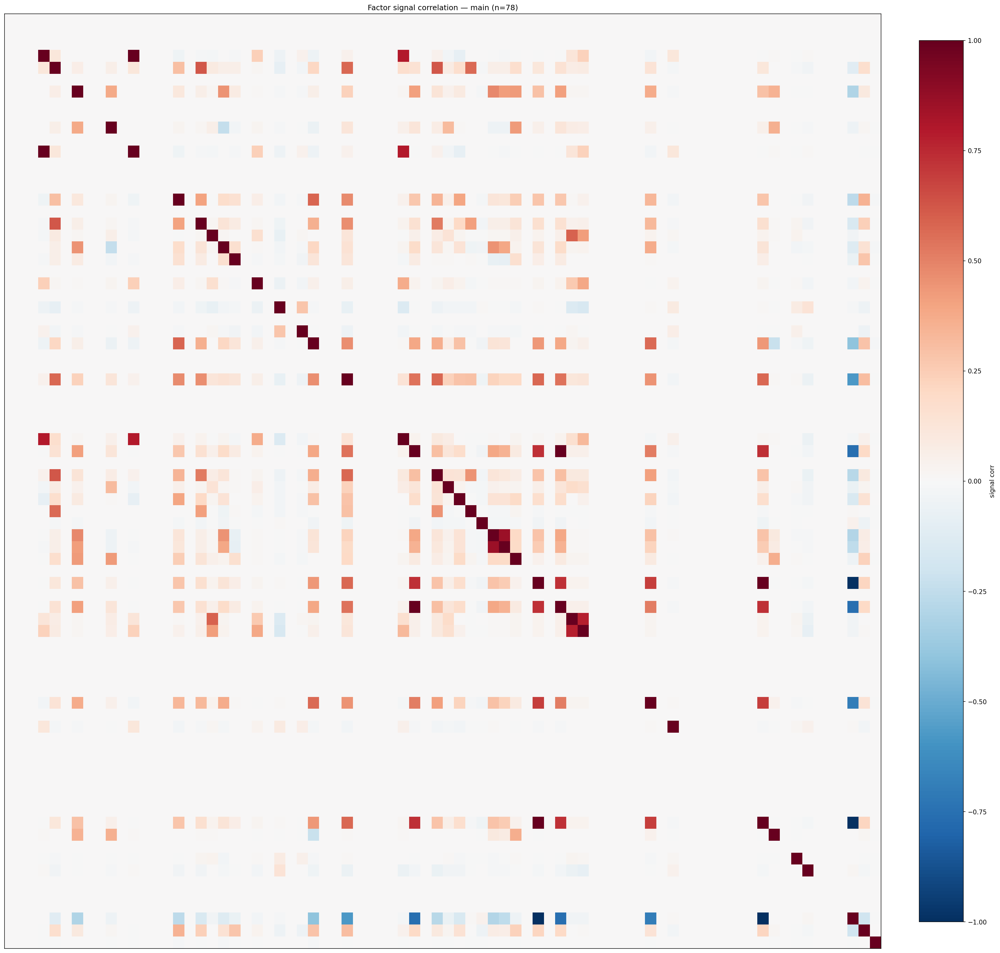

*Signal correlation matrix — main*

## 3. Deflation & model-based importance

`deflated_best_ic` haircuts each zoo's best |IC| for the number of factors tried (`ic_n_tested`) — a bigger zoo's best factor is more likely to be lucky. `lasso_n_nonzero` / `lasso_sparsity` show how many factors a sparse linear model actually keeps (model-view redundancy).

| prerun | best_ic | deflated_best_ic | deflated_best_t | ic_n_tested | ic_n_obs | lasso_n_nonzero | lasso_sparsity |
| --- | --- | --- | --- | --- | --- | --- | --- |
| gpt4omini120650 | 0.0165 | 0.0088 | 3.2953 | 64 | 140579 | 2 | 0.9697 |
| gpt5.4mini120650 | 0.0115 | 0.0045 | 1.6826 | 31 | 140579 | 0 | 1.0 |
| main | 0.0177 | 0.0105 | 3.9294 | 38 | 140579 | 2 | 0.9744 |

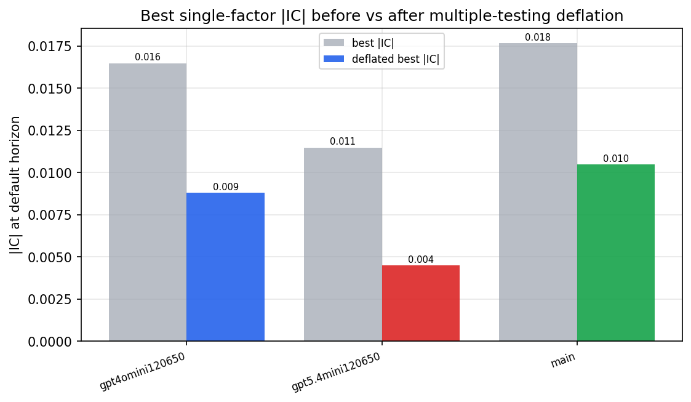

*Best |IC| before vs after multiple-testing deflation*

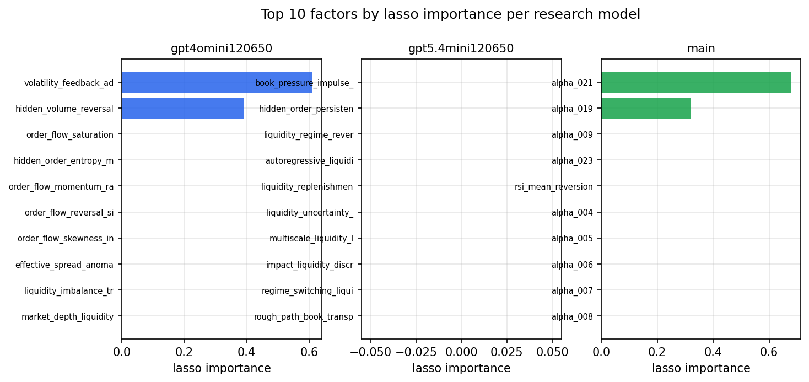

*Top factors by lasso importance per zoo*

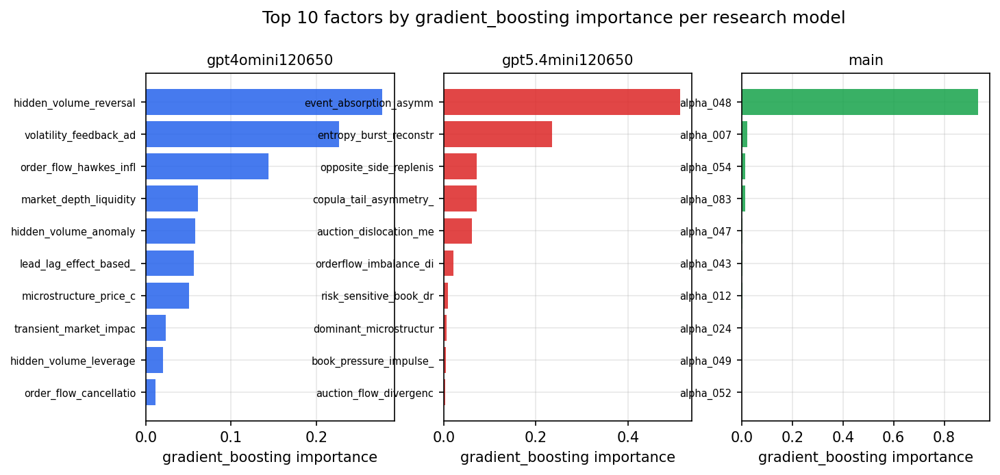

*Top factors by gradient_boosting importance per zoo*

## 4. ML-combined signal — per-underlying vectorised backtest

Each model combines a prerun's factors into ONE signal (fit `factors → forward return` on IS, predict per (bar, underlying)), then that combined signal is run through a simple vectorised backtest — `position(signal) × the underlying's own forward return` — on the held-out OOS tail (+ an equal-weight ensemble). No cross-sectional ranking.

> Config: position=**threshold** (t=1.0, z-score `expanding`), aggregation=**portfolio**, fit-standardise=**per_underlying**, horizon=6.

| prerun | model | n_factors_used | oos_ic | oos_sharpe | is_sharpe | oos_ann_return | oos_max_drawdown |
| --- | --- | --- | --- | --- | --- | --- | --- |
| gpt4omini120650 | linear_regression | 66 | 0.0133 | 4.3698 | 5.9064 | 0.3264 | -0.0107 |
| gpt4omini120650 | ridge | 66 | 0.0149 | 5.4908 | 5.5384 | 0.389 | -0.0092 |
| gpt4omini120650 | lasso | 66 | nan | nan | nan | nan | nan |
| gpt4omini120650 | elastic_net | 66 | nan | nan | nan | nan | nan |
| gpt4omini120650 | random_forest | 66 | 0.016 | 3.1467 | 9.5675 | 0.1718 | -0.0169 |
| gpt4omini120650 | gradient_boosting | 66 | 0.0066 | -4.1632 | 7.983 | -0.1037 | -0.0137 |
| gpt4omini120650 | xgboost | 66 | 0.0106 | -1.2553 | 10.2751 | -0.0554 | -0.0186 |
| gpt4omini120650 | lightgbm | 66 | 0.0119 | -3.4523 | 11.2804 | -0.1465 | -0.021 |
| gpt4omini120650 | ensemble | 66 | 0.0172 | 1.4691 | 10.6403 | 0.0578 | -0.0126 |
| gpt5.4mini120650 | linear_regression | 69 | 0.0092 | 1.0574 | 5.7849 | 0.0317 | -0.0056 |
| gpt5.4mini120650 | ridge | 69 | 0.0106 | 2.6631 | 5.4056 | 0.0738 | -0.0037 |
| gpt5.4mini120650 | lasso | 69 | 0.0066 | 0.7014 | 4.9907 | 0.0116 | -0.0047 |
| gpt5.4mini120650 | elastic_net | 69 | 0.0066 | 0.7014 | 4.9907 | 0.0116 | -0.0047 |
| gpt5.4mini120650 | random_forest | 69 | -0.0066 | -2.344 | 8.9001 | -0.1273 | -0.0156 |
| gpt5.4mini120650 | gradient_boosting | 69 | -0.0035 | 0.6354 | 6.5576 | 0.0079 | -0.002 |
| gpt5.4mini120650 | xgboost | 69 | -0.0036 | -0.7637 | 9.0756 | -0.0416 | -0.0152 |
| gpt5.4mini120650 | lightgbm | 69 | -0.0024 | 1.718 | 9.7499 | 0.0728 | -0.0107 |
| gpt5.4mini120650 | ensemble | 69 | 0.0061 | 0.2479 | 8.8287 | 0.012 | -0.0103 |
| main | linear_regression | 78 | 0.0192 | 1.0246 | 6.2053 | 0.0621 | -0.0125 |
| main | ridge | 78 | 0.0216 | 1.6528 | 6.4381 | 0.1005 | -0.0124 |
| main | lasso | 78 | nan | nan | nan | nan | nan |
| main | elastic_net | 78 | nan | nan | nan | nan | nan |
| main | random_forest | 78 | 0.014 | 4.083 | 8.1766 | 0.2067 | -0.0096 |
| main | gradient_boosting | 78 | 0.0107 | 1.3379 | 5.1948 | 0.0183 | -0.0039 |
| main | xgboost | 78 | 0.0131 | 5.2386 | 6.599 | 0.0919 | -0.0036 |
| main | lightgbm | 78 | 0.0217 | 0.9209 | 8.9447 | 0.0252 | -0.007 |
| main | ensemble | 78 | 0.0179 | 1.3612 | 8.6686 | 0.0722 | -0.0123 |

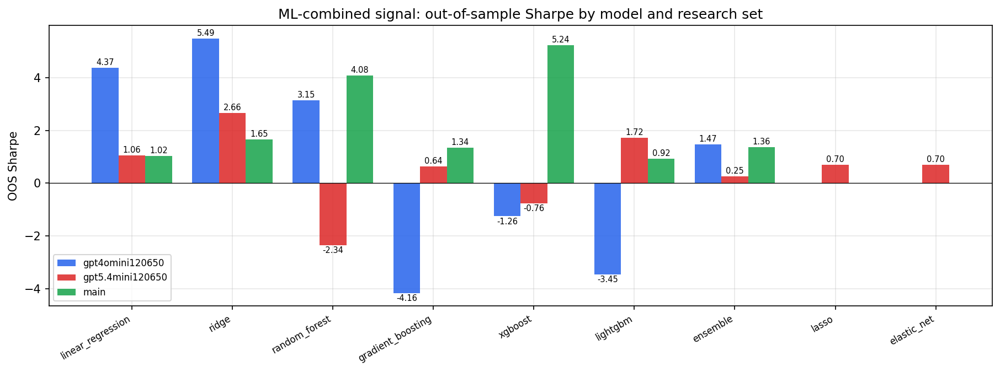

*ML-combined OOS Sharpe by model and research set*

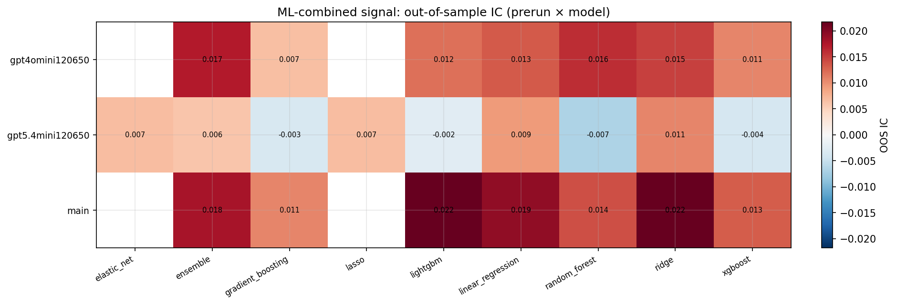

*ML-combined OOS IC (prerun × model)*

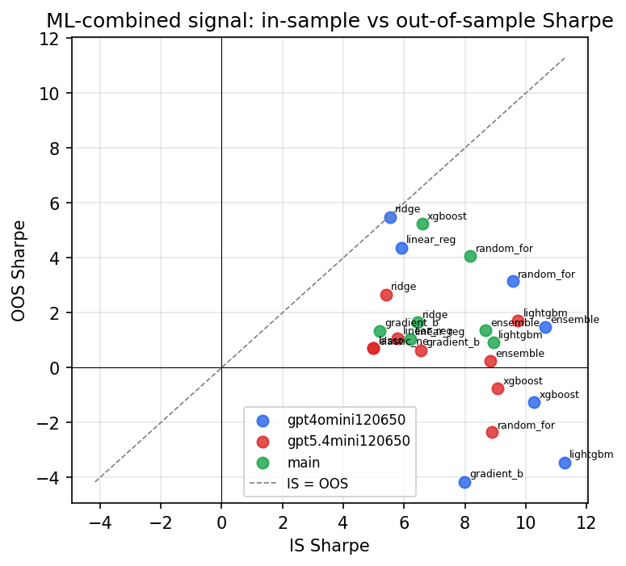

*IS vs OOS Sharpe (overfitting diagnostic)*

---
*Generated by `run_model_comparison.py`. Tables: `*.csv`; interactive: `comparison.ipynb`.*
