# Research-LLM factor comparison — `2025-02`

Comparing the **factor output of different research LLMs** on three axes (raw factor quality → factors as ML features → factors through the full agentic fund). The panel, IS/OOS split, horizon and model hyper-parameters are held identical across preruns — the *only* variable is the factor set.

## Preruns compared

| prerun | research_model | usable_factors | dropped_factors |
| --- | --- | --- | --- |
| gpt4omini120650 | gpt-4o-mini | 66 | 0 |
| gpt5.4mini120650 | gpt-5.4-mini | 69 | 0 |
| main | seed library | 78 | 10 |

> Dropped factors declare fields the current data doesn't have yet (e.g. fundamentals); they light up unchanged once that data is downloaded.

*Usable vs awaiting-data factors per research model*

## Key findings

- **Best ML-combined OOS Sharpe:** `gpt5.4mini120650` with `random_forest` (OOS Sharpe = 7.223).
- **Mean OOS Sharpe across models, by research set:** `gpt5.4mini120650` = 4.919, `gpt4omini120650` = 3.766, `main` = 0.958.
- **Highest mean single-factor |IC| (h=6):** `main` (mean |IC| = 0.0075).
- **Most diverse zoo (highest effective/raw factor ratio):** `gpt5.4mini120650` (eff 52.3 of 69, ratio 0.76).
- **Best selection-deflated single-factor |IC|:** `gpt5.4mini120650` (deflated |IC| = 0.0126 from 31 factors tried).

## 1. Single-factor IC (raw factor quality)

Per-underlying time-series Spearman rank-IC of every researched factor, recomputed on the shared panel at horizons h=1, h=6, h=60. The per-underlying IC correlates each factor's value vector with the underlying's own forward-return vector (pooled across underlyings); the cross-sectional IC ranks across underlyings per timestamp.

| prerun | n_factors | mean_abs_ic_1 | mean_abs_ic_6 | mean_abs_ic_60 | mean_abs_icir_6 | best_factor_h6 | best_abs_ic_h6 |
| --- | --- | --- | --- | --- | --- | --- | --- |
| gpt4omini120650 | 66 | 0.0081 | 0.0069 | 0.009 | 0.416 | limit_order_book_imbalance_surge | 0.017 |
| gpt5.4mini120650 | 69 | 0.0059 | 0.0052 | 0.0101 | 0.3184 | local_impact_decay_asymmetry | 0.0196 |
| main | 78 | 0.0038 | 0.0075 | 0.0065 | 0.4082 | alpha_019 | 0.0195 |

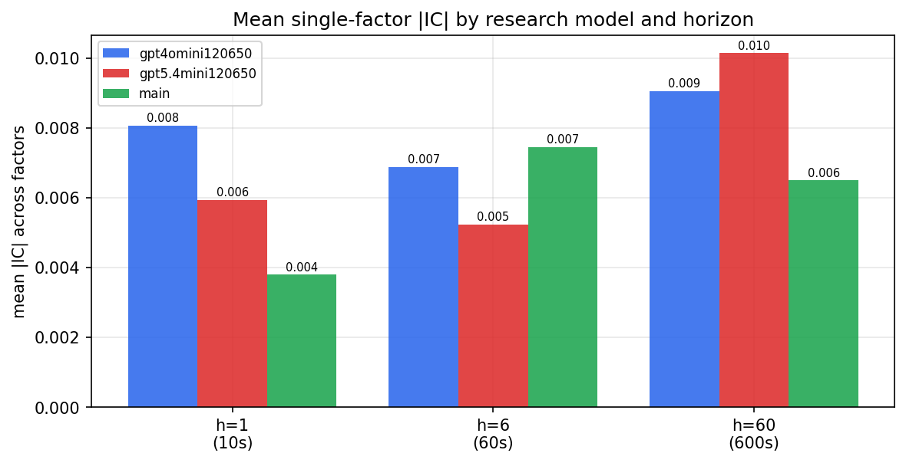

*Mean |IC| by research model and horizon*

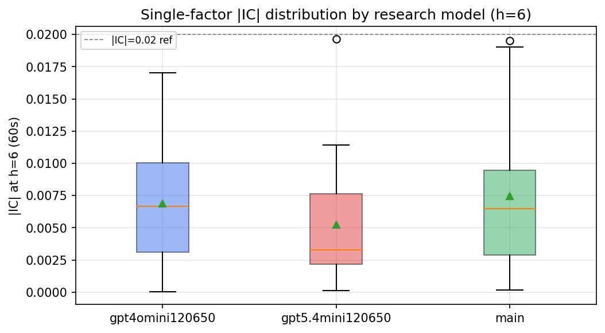

*Per-factor |IC| distribution by research model*

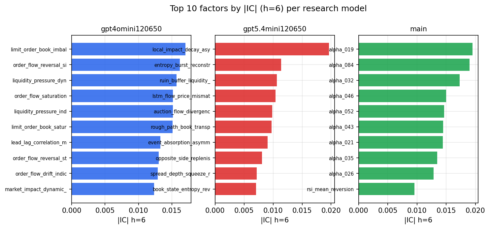

*Top factors by |IC| per research model*

## 2. Factor diversity & redundancy

Pairwise correlation of each zoo's *signals*. `eff_n_factors` is the effective number of independent factors (participation ratio of the correlation eigenvalues); `eff_ratio` and `redundancy` summarise how much unique information the zoo holds vs. how much is duplicated; `n_clusters` groups factors at |corr| ≥ 0.7.

| prerun | n_factors | eff_n_factors | eff_ratio | mean_abs_corr | n_clusters | redundancy |
| --- | --- | --- | --- | --- | --- | --- |
| gpt4omini120650 | 66 | 28.5971 | 0.4333 | 0.0464 | 52 | 0.5667 |
| gpt5.4mini120650 | 69 | 52.3145 | 0.7582 | 0.0113 | 63 | 0.2418 |
| main | 78 | 43.8356 | 0.562 | 0.0267 | 70 | 0.438 |

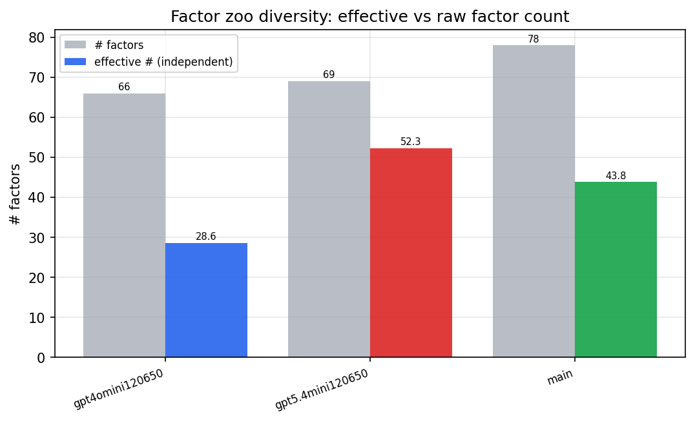

*Effective vs raw factor count per research model*

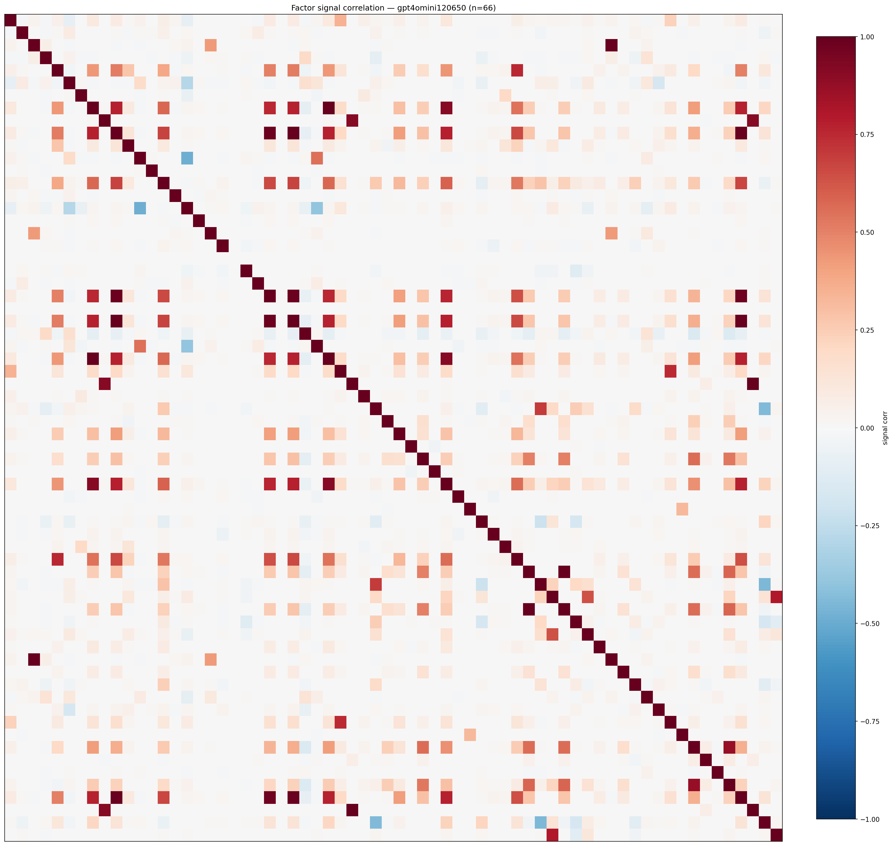

*Signal correlation matrix — gpt4omini120650*

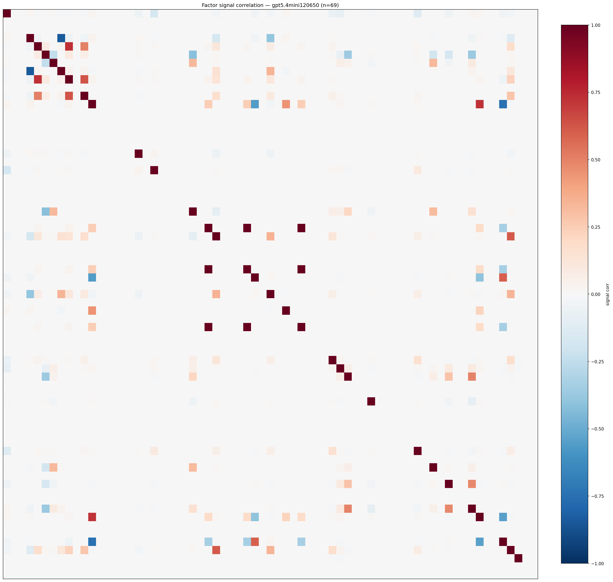

*Signal correlation matrix — gpt5.4mini120650*

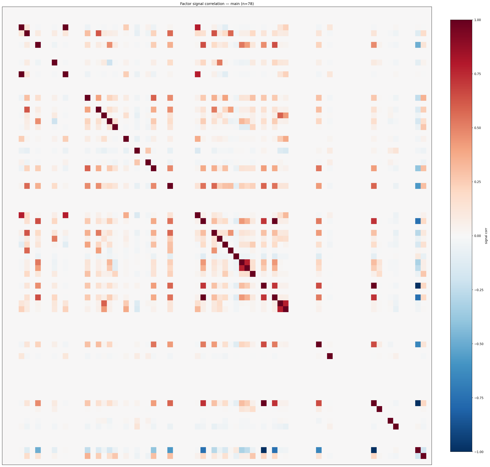

*Signal correlation matrix — main*

## 3. Deflation & model-based importance

`deflated_best_ic` haircuts each zoo's best |IC| for the number of factors tried (`ic_n_tested`) — a bigger zoo's best factor is more likely to be lucky. `lasso_n_nonzero` / `lasso_sparsity` show how many factors a sparse linear model actually keeps (model-view redundancy).

| prerun | best_ic | deflated_best_ic | deflated_best_t | ic_n_tested | ic_n_obs | lasso_n_nonzero | lasso_sparsity |
| --- | --- | --- | --- | --- | --- | --- | --- |
| gpt4omini120650 | 0.017 | 0.0093 | 3.4737 | 64 | 139319 | 2 | 0.9697 |
| gpt5.4mini120650 | 0.0196 | 0.0126 | 4.7093 | 31 | 139319 | 5 | 0.9275 |
| main | 0.0195 | 0.0123 | 4.5845 | 38 | 139319 | 0 | 1.0 |

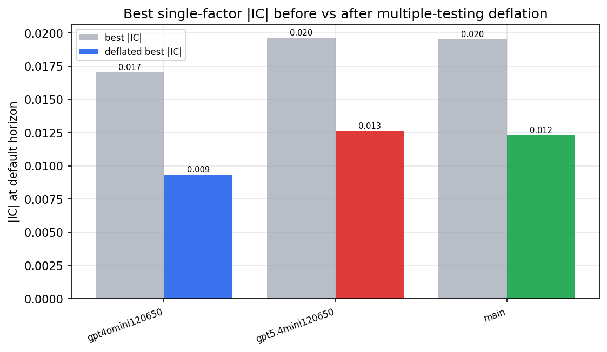

*Best |IC| before vs after multiple-testing deflation*

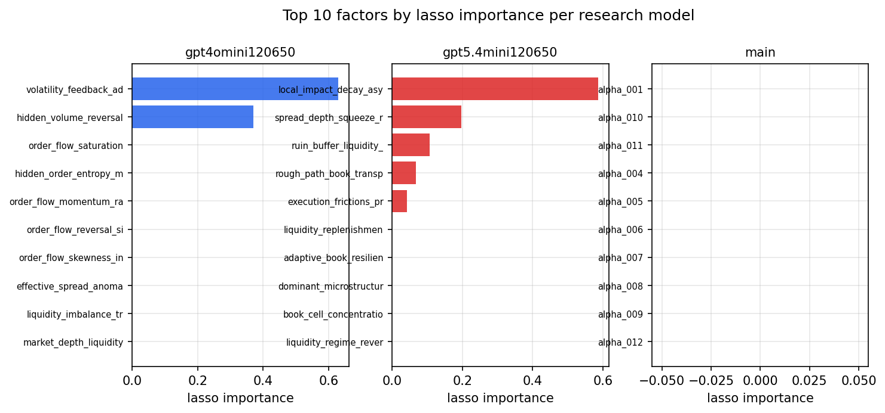

*Top factors by lasso importance per zoo*

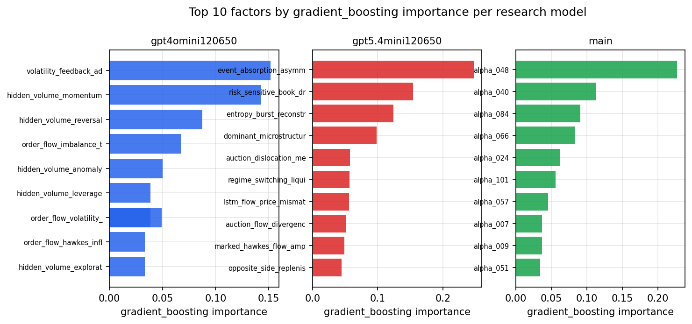

*Top factors by gradient_boosting importance per zoo*

## 4. ML-combined signal — per-underlying vectorised backtest

Each model combines a prerun's factors into ONE signal (fit `factors → forward return` on IS, predict per (bar, underlying)), then that combined signal is run through a simple vectorised backtest — `position(signal) × the underlying's own forward return` — on the held-out OOS tail (+ an equal-weight ensemble). No cross-sectional ranking.

> Config: position=**threshold** (t=1.0, z-score `expanding`), aggregation=**portfolio**, fit-standardise=**per_underlying**, horizon=6.

| prerun | model | n_factors_used | oos_ic | oos_sharpe | is_sharpe | oos_ann_return | oos_max_drawdown |
| --- | --- | --- | --- | --- | --- | --- | --- |
| gpt4omini120650 | linear_regression | 66 | 0.0127 | 4.3817 | 6.4794 | 0.2504 | -0.0089 |
| gpt4omini120650 | ridge | 66 | 0.0106 | 3.5905 | 6.8289 | 0.1933 | -0.0092 |
| gpt4omini120650 | lasso | 66 | -0.0002 | 3.3808 | 4.316 | 0.1682 | -0.0105 |
| gpt4omini120650 | elastic_net | 66 | -0.0002 | 3.3808 | 4.316 | 0.1682 | -0.0105 |
| gpt4omini120650 | random_forest | 66 | 0.0099 | 4.2748 | 11.3229 | 0.1551 | -0.0066 |
| gpt4omini120650 | gradient_boosting | 66 | 0.0036 | -0.824 | 10.4642 | -0.0215 | -0.008 |
| gpt4omini120650 | xgboost | 66 | 0.0146 | 4.676 | 12.7553 | 0.1567 | -0.0045 |
| gpt4omini120650 | lightgbm | 66 | 0.011 | 5.9924 | 16.4651 | 0.2851 | -0.0041 |
| gpt4omini120650 | ensemble | 66 | 0.0041 | 5.0438 | 13.0649 | 0.2279 | -0.0087 |
| gpt5.4mini120650 | linear_regression | 69 | 0.0191 | 5.177 | 5.5538 | 0.4167 | -0.0143 |
| gpt5.4mini120650 | ridge | 69 | 0.0181 | 4.4525 | 4.967 | 0.3575 | -0.0176 |
| gpt5.4mini120650 | lasso | 69 | nan | nan | nan | nan | nan |
| gpt5.4mini120650 | elastic_net | 69 | nan | nan | nan | nan | nan |
| gpt5.4mini120650 | random_forest | 69 | 0.0157 | 7.2234 | 11.457 | 0.5522 | -0.0109 |
| gpt5.4mini120650 | gradient_boosting | 69 | 0.018 | 4.9615 | 11.6974 | 0.3182 | -0.0103 |
| gpt5.4mini120650 | xgboost | 69 | 0.0139 | 4.9174 | 12.8351 | 0.2913 | -0.0104 |
| gpt5.4mini120650 | lightgbm | 69 | 0.0083 | 2.6914 | 15.839 | 0.1081 | -0.0093 |
| gpt5.4mini120650 | ensemble | 69 | 0.0268 | 5.0075 | 11.8076 | 0.3346 | -0.0102 |
| main | linear_regression | 78 | 0.0087 | 3.3132 | 7.9884 | 0.1109 | -0.0108 |
| main | ridge | 78 | 0.0106 | 3.2891 | 7.8523 | 0.1119 | -0.0117 |
| main | lasso | 78 | nan | nan | nan | nan | nan |
| main | elastic_net | 78 | nan | nan | nan | nan | nan |
| main | random_forest | 78 | 0.0144 | -0.131 | 14.0824 | -0.0048 | -0.0119 |
| main | gradient_boosting | 78 | 0.0089 | -0.298 | 10.743 | -0.0035 | -0.0047 |
| main | xgboost | 78 | 0.0044 | -0.5886 | 14.5069 | -0.0149 | -0.0088 |
| main | lightgbm | 78 | 0.0029 | 1.3744 | 18.6352 | 0.0292 | -0.0059 |
| main | ensemble | 78 | 0.0115 | -0.2527 | 10.7938 | -0.0027 | -0.0031 |

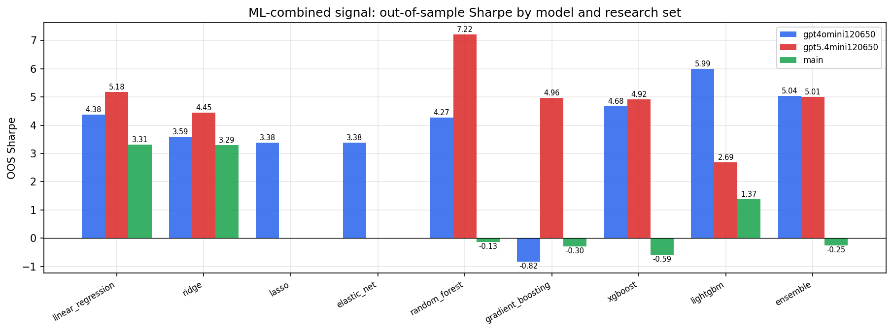

*ML-combined OOS Sharpe by model and research set*

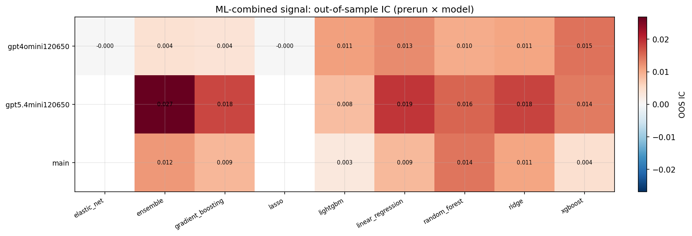

*ML-combined OOS IC (prerun × model)*

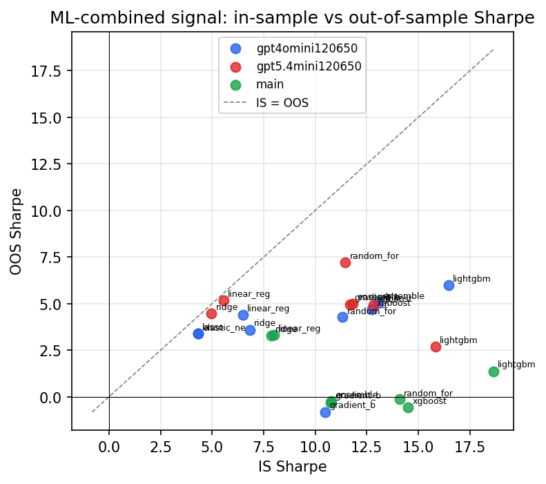

*IS vs OOS Sharpe (overfitting diagnostic)*

---
*Generated by `run_model_comparison.py`. Tables: `*.csv`; interactive: `comparison.ipynb`.*
