# Research-LLM factor comparison — `2025-03`

Comparing the **factor output of different research LLMs** on three axes (raw factor quality → factors as ML features → factors through the full agentic fund). The panel, IS/OOS split, horizon and model hyper-parameters are held identical across preruns — the *only* variable is the factor set.

## Preruns compared

| prerun | research_model | usable_factors | dropped_factors |
| --- | --- | --- | --- |
| gpt4omini120650 | gpt-4o-mini | 66 | 0 |
| gpt5.4mini120650 | gpt-5.4-mini | 69 | 0 |
| main | seed library | 78 | 10 |

> Dropped factors declare fields the current data doesn't have yet (e.g. fundamentals); they light up unchanged once that data is downloaded.

*Usable vs awaiting-data factors per research model*

## Key findings

- **Best ML-combined OOS Sharpe:** `gpt4omini120650` with `ensemble` (OOS Sharpe = 7.606).
- **Mean OOS Sharpe across models, by research set:** `gpt4omini120650` = 4.873, `gpt5.4mini120650` = 4.287, `main` = 0.292.
- **Highest mean single-factor |IC| (h=6):** `main` (mean |IC| = 0.0089).
- **Most diverse zoo (highest effective/raw factor ratio):** `gpt5.4mini120650` (eff 52.6 of 69, ratio 0.76).
- **Best selection-deflated single-factor |IC|:** `gpt4omini120650` (deflated |IC| = 0.0124 from 64 factors tried).

## 1. Single-factor IC (raw factor quality)

Per-underlying time-series Spearman rank-IC of every researched factor, recomputed on the shared panel at horizons h=1, h=6, h=60. The per-underlying IC correlates each factor's value vector with the underlying's own forward-return vector (pooled across underlyings); the cross-sectional IC ranks across underlyings per timestamp.

| prerun | n_factors | mean_abs_ic_1 | mean_abs_ic_6 | mean_abs_ic_60 | mean_abs_icir_6 | best_factor_h6 | best_abs_ic_h6 |
| --- | --- | --- | --- | --- | --- | --- | --- |
| gpt4omini120650 | 66 | 0.0057 | 0.0078 | 0.0089 | 0.406 | limit_order_book_saturation | 0.0201 |
| gpt5.4mini120650 | 69 | 0.0049 | 0.0064 | 0.0084 | 0.2885 | lstm_flow_price_mismatch | 0.0185 |
| main | 78 | 0.0037 | 0.0089 | 0.0072 | 0.4452 | alpha_084 | 0.0195 |

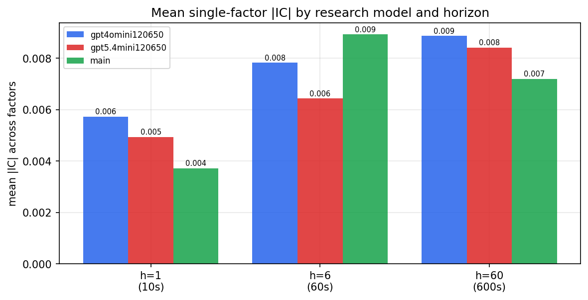

*Mean |IC| by research model and horizon*

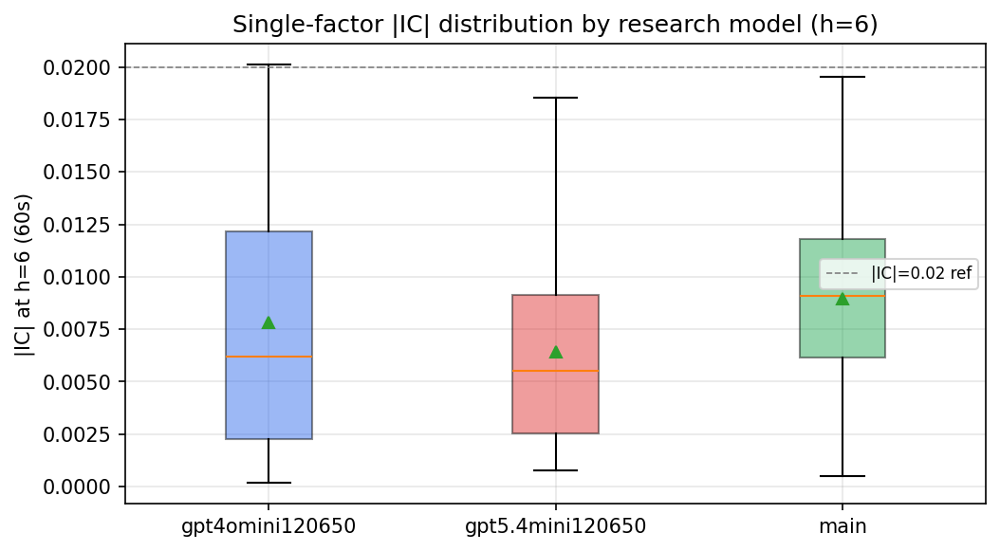

*Per-factor |IC| distribution by research model*

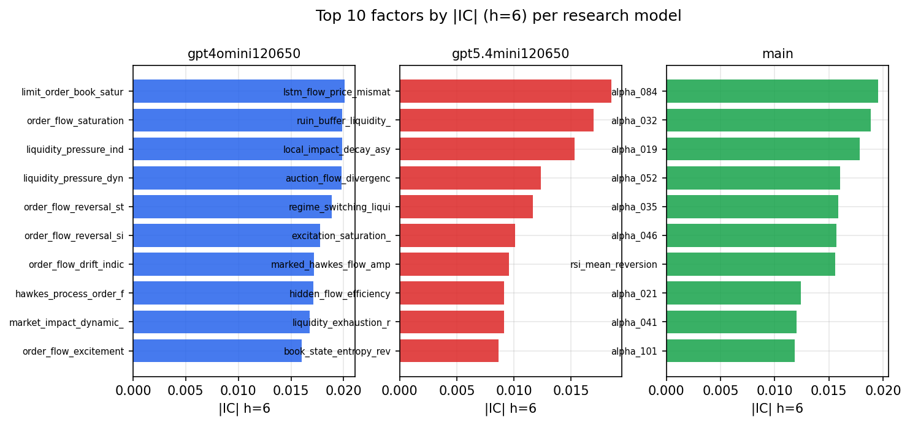

*Top factors by |IC| per research model*

## 2. Factor diversity & redundancy

Pairwise correlation of each zoo's *signals*. `eff_n_factors` is the effective number of independent factors (participation ratio of the correlation eigenvalues); `eff_ratio` and `redundancy` summarise how much unique information the zoo holds vs. how much is duplicated; `n_clusters` groups factors at |corr| ≥ 0.7.

| prerun | n_factors | eff_n_factors | eff_ratio | mean_abs_corr | n_clusters | redundancy |
| --- | --- | --- | --- | --- | --- | --- |
| gpt4omini120650 | 66 | 27.1146 | 0.4108 | 0.0504 | 51 | 0.5892 |
| gpt5.4mini120650 | 69 | 52.5972 | 0.7623 | 0.0114 | 63 | 0.2377 |
| main | 78 | 44.6228 | 0.5721 | 0.0256 | 70 | 0.4279 |

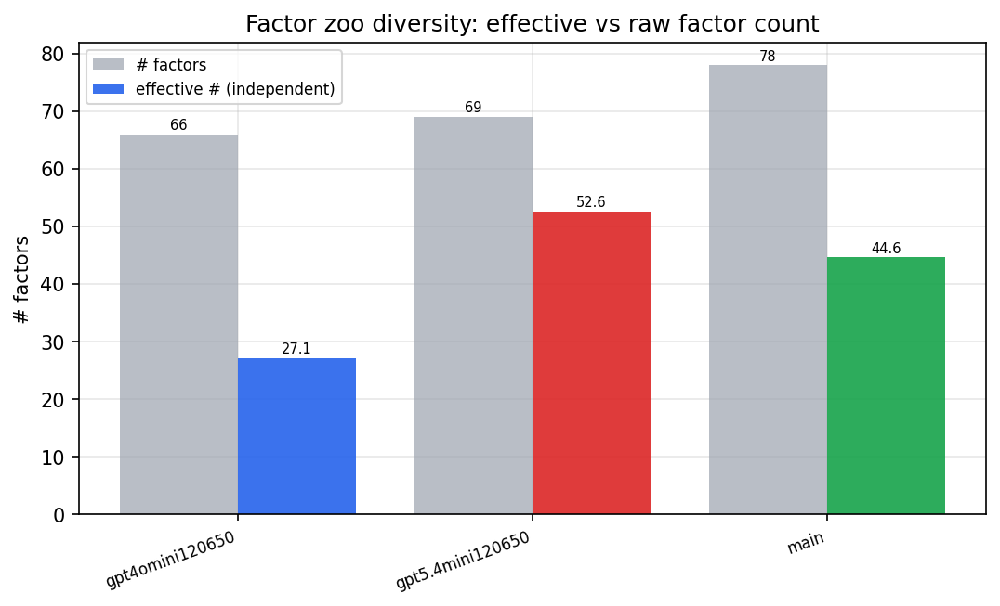

*Effective vs raw factor count per research model*

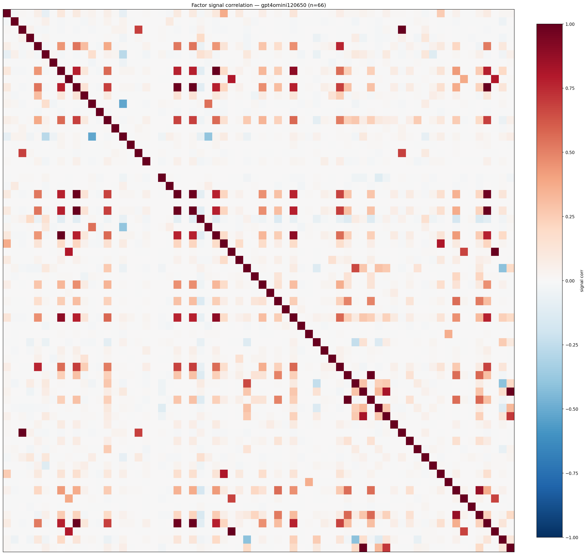

*Signal correlation matrix — gpt4omini120650*

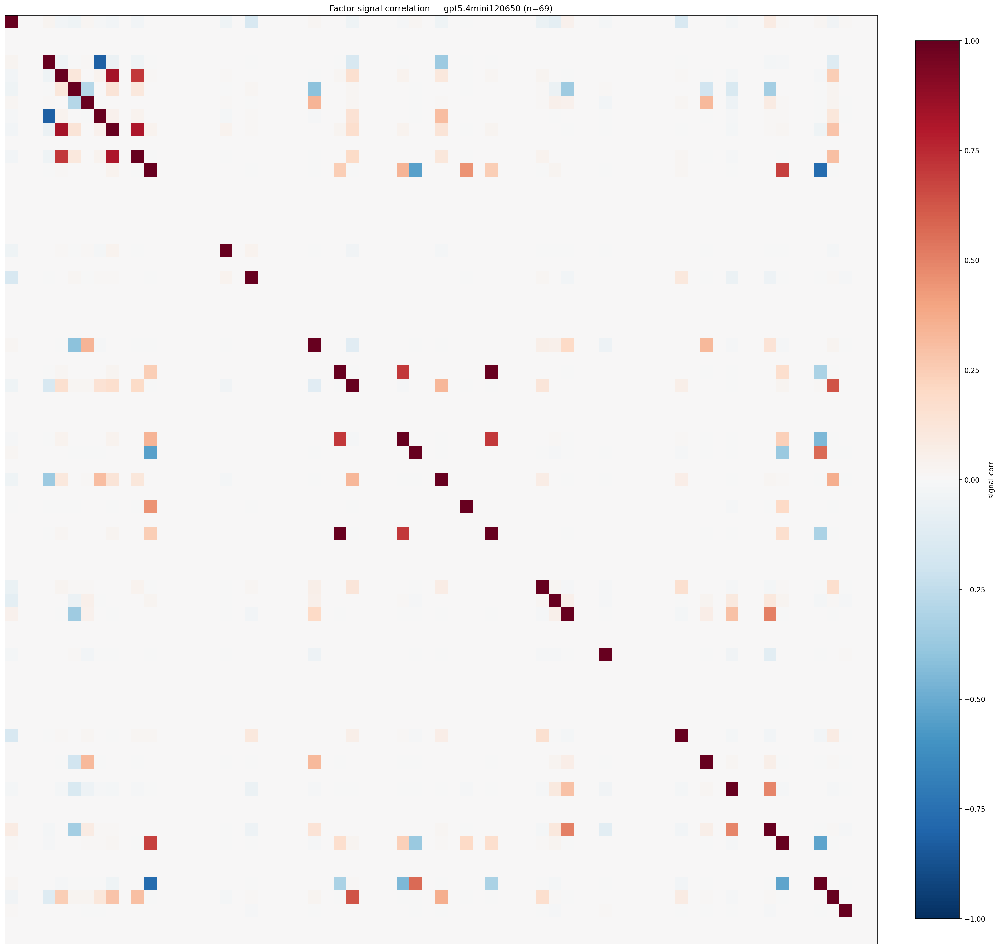

*Signal correlation matrix — gpt5.4mini120650*

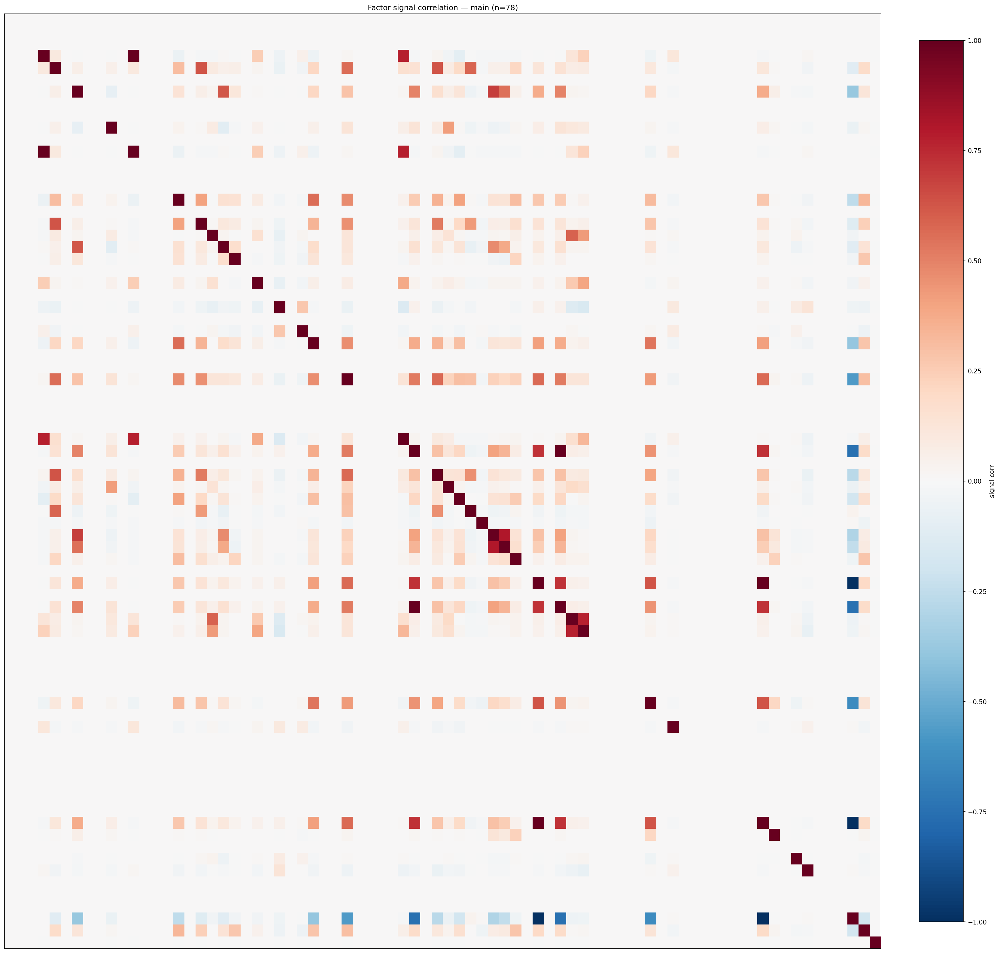

*Signal correlation matrix — main*

## 3. Deflation & model-based importance

`deflated_best_ic` haircuts each zoo's best |IC| for the number of factors tried (`ic_n_tested`) — a bigger zoo's best factor is more likely to be lucky. `lasso_n_nonzero` / `lasso_sparsity` show how many factors a sparse linear model actually keeps (model-view redundancy).

| prerun | best_ic | deflated_best_ic | deflated_best_t | ic_n_tested | ic_n_obs | lasso_n_nonzero | lasso_sparsity |
| --- | --- | --- | --- | --- | --- | --- | --- |
| gpt4omini120650 | 0.0201 | 0.0124 | 4.6468 | 64 | 140399 | 21 | 0.6818 |
| gpt5.4mini120650 | 0.0185 | 0.0115 | 4.3194 | 31 | 140399 | 2 | 0.971 |
| main | 0.0195 | 0.0123 | 4.6229 | 38 | 140399 | 0 | 1.0 |

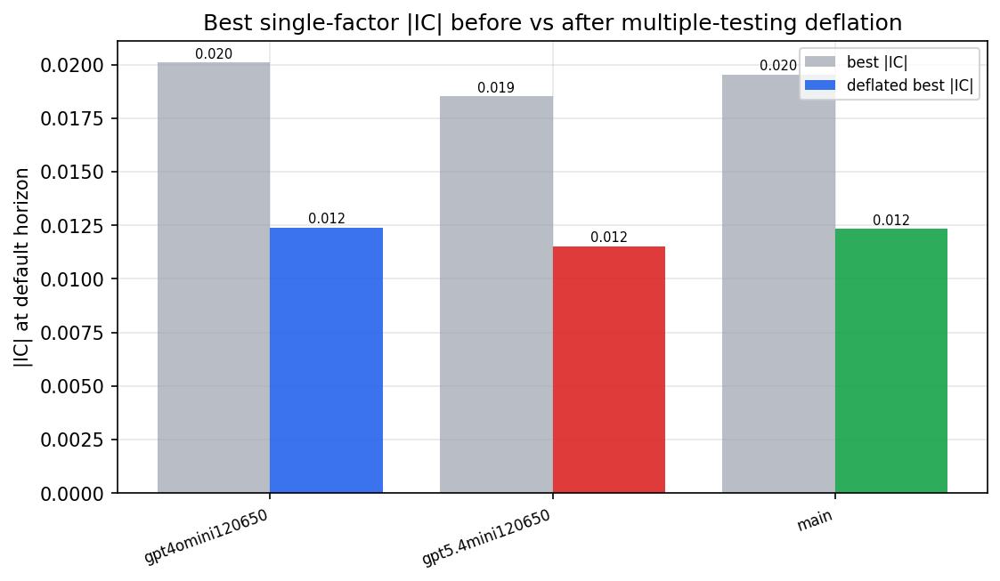

*Best |IC| before vs after multiple-testing deflation*

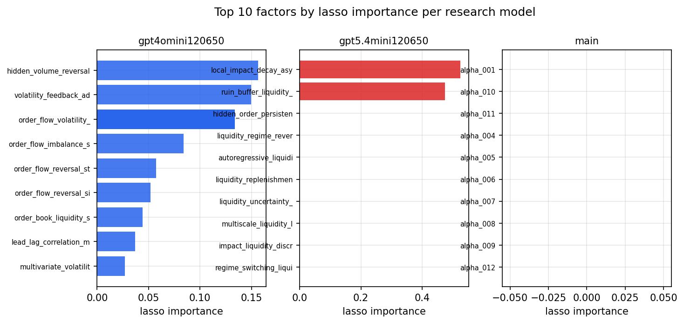

*Top factors by lasso importance per zoo*

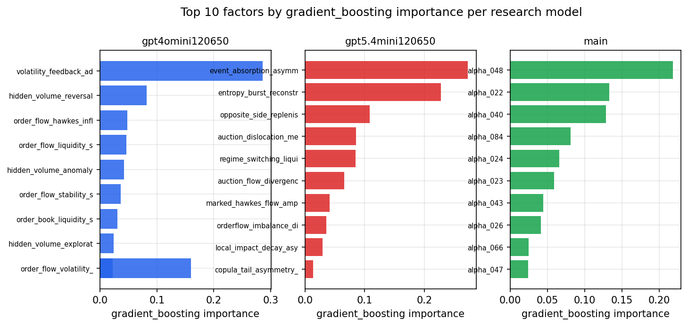

*Top factors by gradient_boosting importance per zoo*

## 4. ML-combined signal — per-underlying vectorised backtest

Each model combines a prerun's factors into ONE signal (fit `factors → forward return` on IS, predict per (bar, underlying)), then that combined signal is run through a simple vectorised backtest — `position(signal) × the underlying's own forward return` — on the held-out OOS tail (+ an equal-weight ensemble). No cross-sectional ranking.

> Config: position=**threshold** (t=1.0, z-score `expanding`), aggregation=**portfolio**, fit-standardise=**per_underlying**, horizon=6.

| prerun | model | n_factors_used | oos_ic | oos_sharpe | is_sharpe | oos_ann_return | oos_max_drawdown |
| --- | --- | --- | --- | --- | --- | --- | --- |
| gpt4omini120650 | linear_regression | 66 | 0.0036 | 6.322 | 7.5751 | 0.3352 | -0.0072 |
| gpt4omini120650 | ridge | 66 | 0.0055 | 6.7493 | 6.9877 | 0.4518 | -0.0098 |
| gpt4omini120650 | lasso | 66 | -0.0016 | 4.7838 | 5.1146 | 0.2153 | -0.012 |
| gpt4omini120650 | elastic_net | 66 | -0.0016 | 4.7838 | 5.1051 | 0.2153 | -0.012 |
| gpt4omini120650 | random_forest | 66 | -0.0033 | 3.8713 | 11.6574 | 0.204 | -0.0148 |
| gpt4omini120650 | gradient_boosting | 66 | -0.0043 | 5.7168 | 9.9503 | 0.0897 | -0.0024 |
| gpt4omini120650 | xgboost | 66 | 0.0008 | 2.7207 | 13.7062 | 0.0673 | -0.0061 |
| gpt4omini120650 | lightgbm | 66 | -0.0001 | 1.3032 | 18.8522 | 0.0485 | -0.0109 |
| gpt4omini120650 | ensemble | 66 | 0.002 | 7.6059 | 12.7121 | 0.5038 | -0.0111 |
| gpt5.4mini120650 | linear_regression | 69 | -0.0066 | 5.504 | 8.3338 | 0.4396 | -0.0115 |
| gpt5.4mini120650 | ridge | 69 | -0.0076 | 5.322 | 8.2002 | 0.4292 | -0.0126 |
| gpt5.4mini120650 | lasso | 69 | -0.0077 | 5.7752 | 5.9406 | 0.5281 | -0.0143 |
| gpt5.4mini120650 | elastic_net | 69 | -0.007 | 5.8406 | 5.9866 | 0.5354 | -0.014 |
| gpt5.4mini120650 | random_forest | 69 | -0.0061 | 3.5476 | 10.7317 | 0.2544 | -0.0137 |
| gpt5.4mini120650 | gradient_boosting | 69 | -0.0175 | 3.7409 | 11.4401 | 0.231 | -0.0085 |
| gpt5.4mini120650 | xgboost | 69 | -0.0041 | 2.2314 | 12.3912 | 0.115 | -0.0096 |
| gpt5.4mini120650 | lightgbm | 69 | -0.0051 | 1.1782 | 16.2079 | 0.0399 | -0.0073 |
| gpt5.4mini120650 | ensemble | 69 | -0.0081 | 5.4405 | 12.074 | 0.4592 | -0.0127 |
| main | linear_regression | 78 | -0.0084 | -2.4351 | 9.2747 | -0.1272 | -0.0214 |
| main | ridge | 78 | -0.0155 | -3.5853 | 8.3632 | -0.2212 | -0.0311 |
| main | lasso | 78 | nan | nan | nan | nan | nan |
| main | elastic_net | 78 | nan | nan | nan | nan | nan |
| main | random_forest | 78 | -0.0047 | -1.7254 | 16.3689 | -0.07 | -0.0184 |
| main | gradient_boosting | 78 | -0.007 | 2.3569 | 7.6276 | 0.0182 | -0.002 |
| main | xgboost | 78 | -0.0011 | -2.6608 | 16.5676 | -0.0724 | -0.011 |
| main | lightgbm | 78 | -0.0076 | 2.8084 | 19.8086 | 0.1052 | -0.0046 |
| main | ensemble | 78 | -0.0076 | 7.283 | 5.2704 | 0.0139 | -0.0003 |

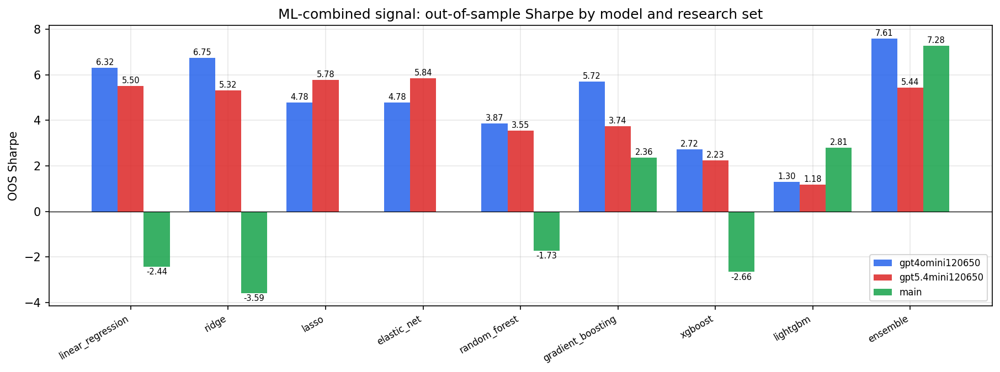

*ML-combined OOS Sharpe by model and research set*

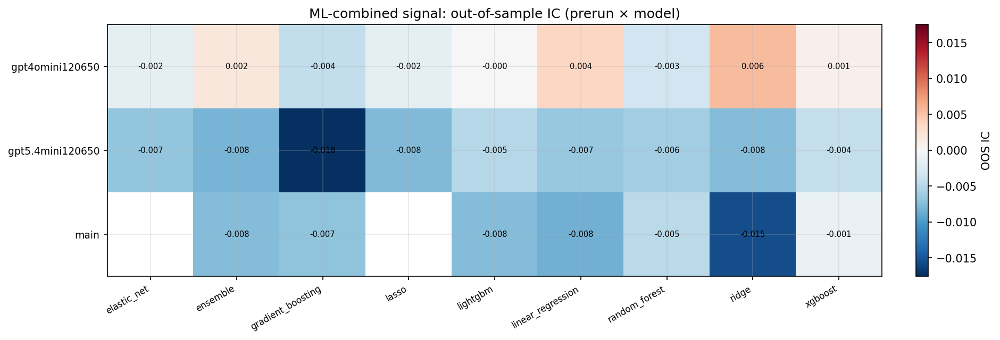

*ML-combined OOS IC (prerun × model)*

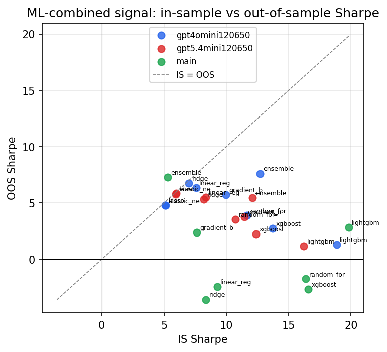

*IS vs OOS Sharpe (overfitting diagnostic)*

---
*Generated by `run_model_comparison.py`. Tables: `*.csv`; interactive: `comparison.ipynb`.*
