# Research-LLM factor comparison — `2025-04`

Comparing the **factor output of different research LLMs** on three axes (raw factor quality → factors as ML features → factors through the full agentic fund). The panel, IS/OOS split, horizon and model hyper-parameters are held identical across preruns — the *only* variable is the factor set.

## Preruns compared

| prerun | research_model | usable_factors | dropped_factors |
| --- | --- | --- | --- |
| gpt4omini120650 | gpt-4o-mini | 66 | 0 |
| gpt5.4mini120650 | gpt-5.4-mini | 69 | 0 |
| main | seed library | 78 | 10 |

> Dropped factors declare fields the current data doesn't have yet (e.g. fundamentals); they light up unchanged once that data is downloaded.

*Usable vs awaiting-data factors per research model*

## Key findings

- **Best ML-combined OOS Sharpe:** `gpt5.4mini120650` with `xgboost` (OOS Sharpe = 2.612).
- **Mean OOS Sharpe across models, by research set:** `gpt5.4mini120650` = 0.834, `gpt4omini120650` = -0.315, `main` = -2.057.
- **Highest mean single-factor |IC| (h=6):** `main` (mean |IC| = 0.0053).
- **Most diverse zoo (highest effective/raw factor ratio):** `gpt5.4mini120650` (eff 52.1 of 69, ratio 0.75).
- **Best selection-deflated single-factor |IC|:** `main` (deflated |IC| = 0.0133 from 38 factors tried).

## 1. Single-factor IC (raw factor quality)

Per-underlying time-series Spearman rank-IC of every researched factor, recomputed on the shared panel at horizons h=1, h=6, h=60. The per-underlying IC correlates each factor's value vector with the underlying's own forward-return vector (pooled across underlyings); the cross-sectional IC ranks across underlyings per timestamp.

| prerun | n_factors | mean_abs_ic_1 | mean_abs_ic_6 | mean_abs_ic_60 | mean_abs_icir_6 | best_factor_h6 | best_abs_ic_h6 |
| --- | --- | --- | --- | --- | --- | --- | --- |
| gpt4omini120650 | 66 | 0.0045 | 0.0045 | 0.0045 | 0.2266 | order_flow_skewness_indicator | 0.0184 |
| gpt5.4mini120650 | 69 | 0.0034 | 0.0046 | 0.007 | 0.1993 | auction_reversion_anchor_gap | 0.0126 |
| main | 78 | 0.0031 | 0.0053 | 0.0051 | 0.293 | alpha_066 | 0.0205 |

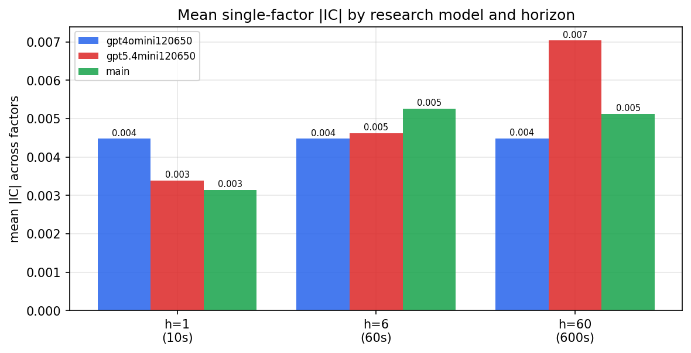

*Mean |IC| by research model and horizon*

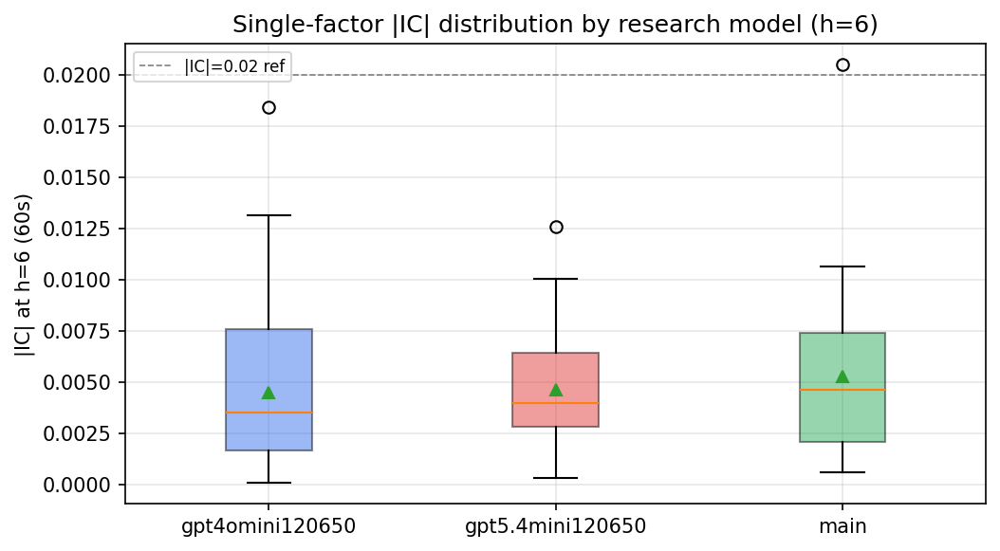

*Per-factor |IC| distribution by research model*

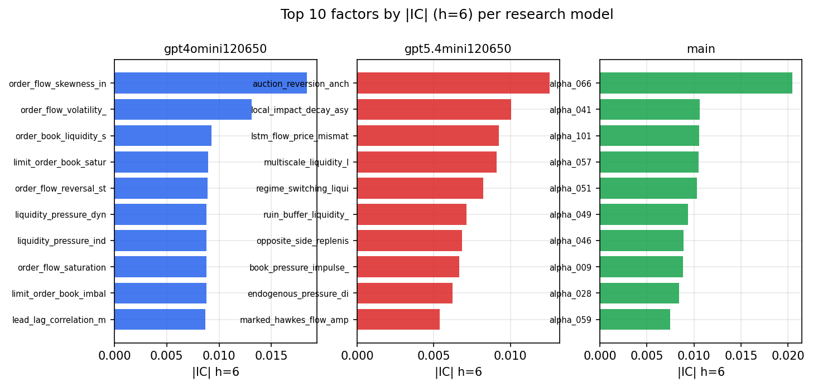

*Top factors by |IC| per research model*

## 2. Factor diversity & redundancy

Pairwise correlation of each zoo's *signals*. `eff_n_factors` is the effective number of independent factors (participation ratio of the correlation eigenvalues); `eff_ratio` and `redundancy` summarise how much unique information the zoo holds vs. how much is duplicated; `n_clusters` groups factors at |corr| ≥ 0.7.

| prerun | n_factors | eff_n_factors | eff_ratio | mean_abs_corr | n_clusters | redundancy |
| --- | --- | --- | --- | --- | --- | --- |
| gpt4omini120650 | 66 | 27.3828 | 0.4149 | 0.0496 | 50 | 0.5851 |
| gpt5.4mini120650 | 69 | 52.0527 | 0.7544 | 0.0118 | 63 | 0.2456 |
| main | 78 | 44.9766 | 0.5766 | 0.0256 | 71 | 0.4234 |

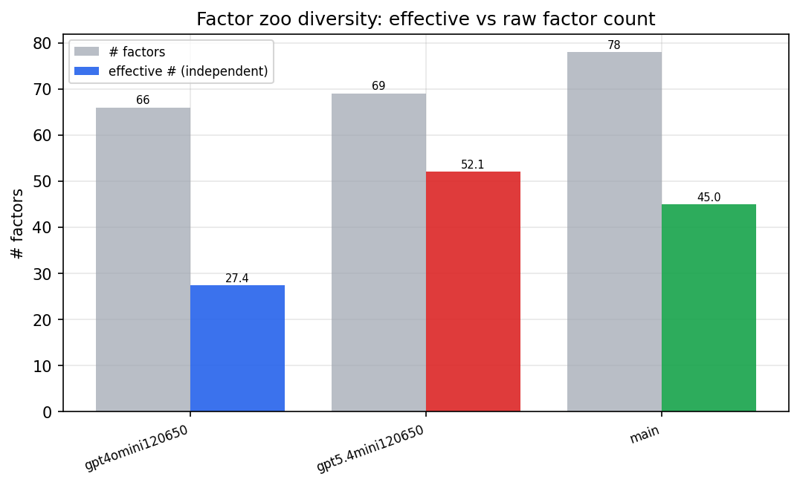

*Effective vs raw factor count per research model*

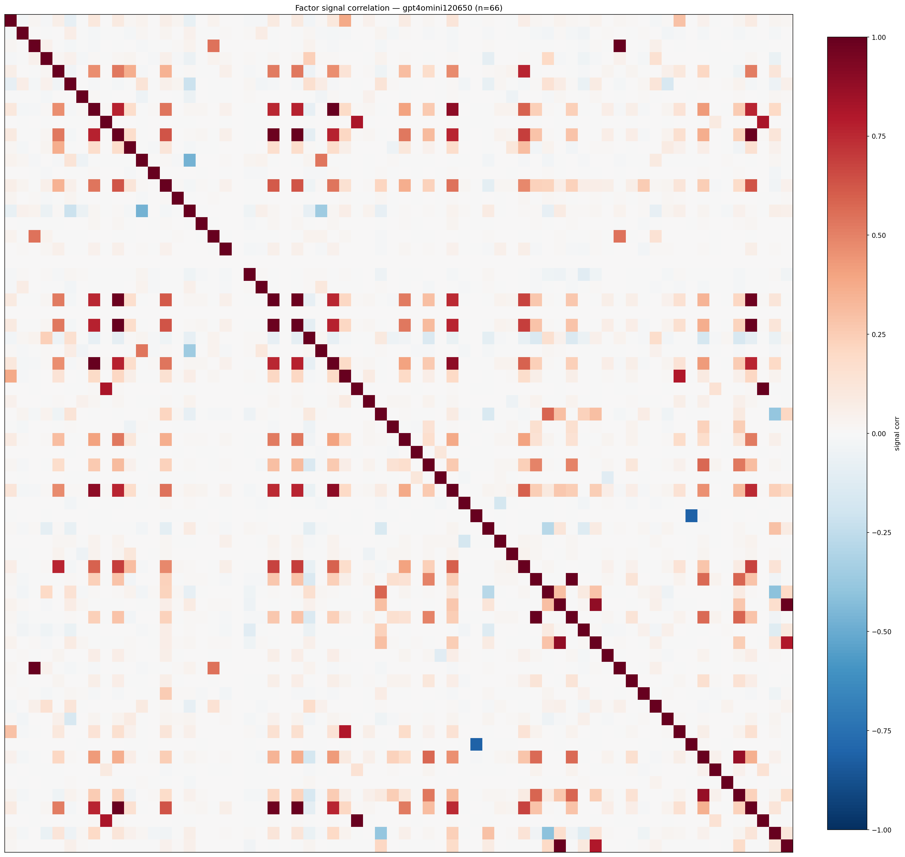

*Signal correlation matrix — gpt4omini120650*

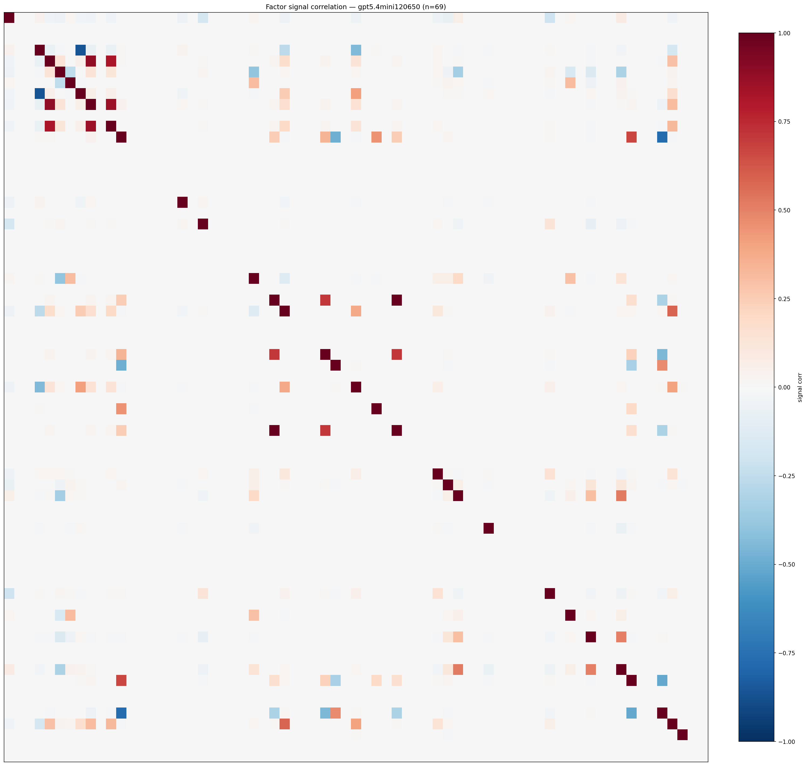

*Signal correlation matrix — gpt5.4mini120650*

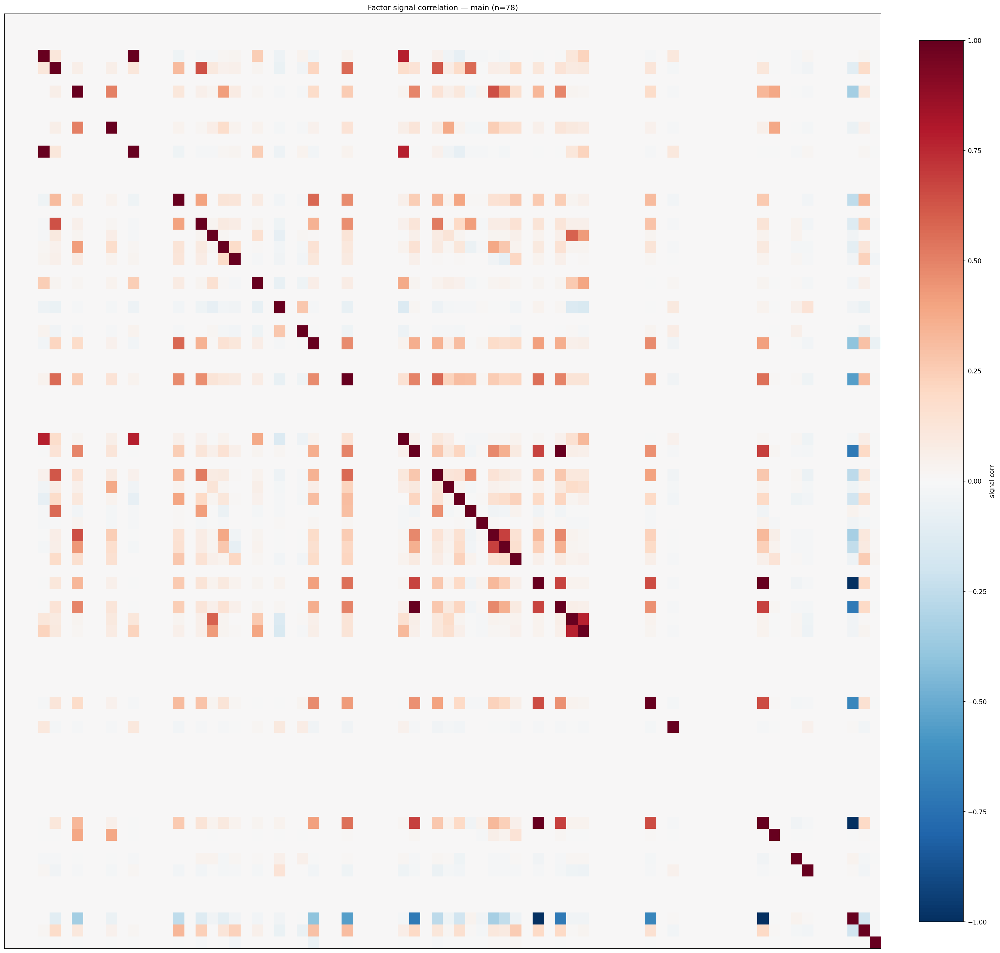

*Signal correlation matrix — main*

## 3. Deflation & model-based importance

`deflated_best_ic` haircuts each zoo's best |IC| for the number of factors tried (`ic_n_tested`) — a bigger zoo's best factor is more likely to be lucky. `lasso_n_nonzero` / `lasso_sparsity` show how many factors a sparse linear model actually keeps (model-view redundancy).

| prerun | best_ic | deflated_best_ic | deflated_best_t | ic_n_tested | ic_n_obs | lasso_n_nonzero | lasso_sparsity |
| --- | --- | --- | --- | --- | --- | --- | --- |
| gpt4omini120650 | 0.0184 | 0.0108 | 4.0742 | 64 | 142739 | 0 | 1.0 |
| gpt5.4mini120650 | 0.0126 | 0.0056 | 2.1289 | 31 | 142739 | 0 | 1.0 |
| main | 0.0205 | 0.0133 | 5.0371 | 38 | 142739 | 0 | 1.0 |

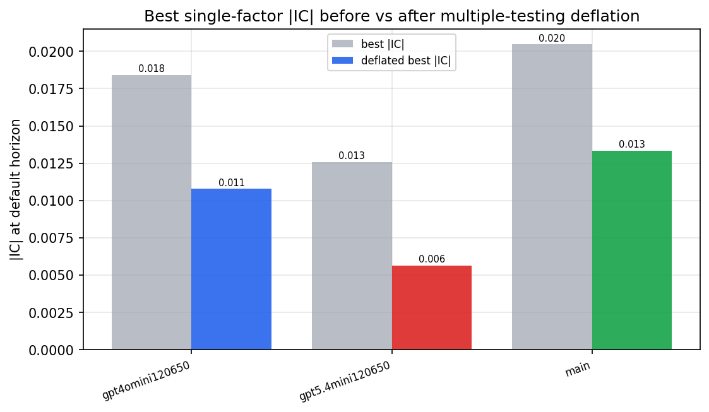

*Best |IC| before vs after multiple-testing deflation*

*Top factors by lasso importance per zoo*

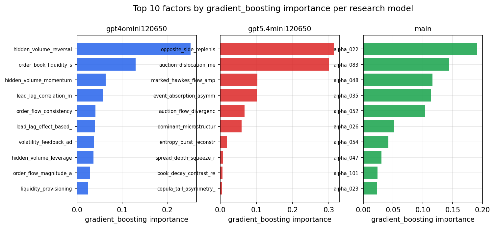

*Top factors by gradient_boosting importance per zoo*

## 4. ML-combined signal — per-underlying vectorised backtest

Each model combines a prerun's factors into ONE signal (fit `factors → forward return` on IS, predict per (bar, underlying)), then that combined signal is run through a simple vectorised backtest — `position(signal) × the underlying's own forward return` — on the held-out OOS tail (+ an equal-weight ensemble). No cross-sectional ranking.

> Config: position=**threshold** (t=1.0, z-score `expanding`), aggregation=**portfolio**, fit-standardise=**per_underlying**, horizon=6.

| prerun | model | n_factors_used | oos_ic | oos_sharpe | is_sharpe | oos_ann_return | oos_max_drawdown |
| --- | --- | --- | --- | --- | --- | --- | --- |
| gpt4omini120650 | linear_regression | 66 | -0.0051 | -0.8246 | 11.0633 | -0.1236 | -0.0428 |
| gpt4omini120650 | ridge | 66 | -0.0039 | -1.5875 | 10.8122 | -0.2373 | -0.0488 |
| gpt4omini120650 | lasso | 66 | nan | nan | nan | nan | nan |
| gpt4omini120650 | elastic_net | 66 | nan | nan | nan | nan | nan |
| gpt4omini120650 | random_forest | 66 | 0.0008 | 0.5433 | 11.8772 | 0.0564 | -0.0255 |
| gpt4omini120650 | gradient_boosting | 66 | -0.0032 | 0.1791 | 11.1378 | 0.0134 | -0.0152 |
| gpt4omini120650 | xgboost | 66 | -0.002 | 0.0772 | 13.0618 | 0.0065 | -0.0158 |
| gpt4omini120650 | lightgbm | 66 | -0.01 | -1.0062 | 17.6347 | -0.0873 | -0.0247 |
| gpt4omini120650 | ensemble | 66 | -0.0049 | 0.4118 | 13.5626 | 0.0472 | -0.0219 |
| gpt5.4mini120650 | linear_regression | 69 | -0.0041 | -1.2512 | 7.9007 | -0.2499 | -0.0623 |
| gpt5.4mini120650 | ridge | 69 | -0.0041 | -1.2123 | 7.6407 | -0.243 | -0.0635 |
| gpt5.4mini120650 | lasso | 69 | nan | nan | nan | nan | nan |
| gpt5.4mini120650 | elastic_net | 69 | nan | nan | nan | nan | nan |
| gpt5.4mini120650 | random_forest | 69 | -0.0087 | 1.9646 | 10.0149 | 0.2875 | -0.0253 |
| gpt5.4mini120650 | gradient_boosting | 69 | -0.0035 | 2.0889 | 10.8635 | 0.2228 | -0.0215 |
| gpt5.4mini120650 | xgboost | 69 | -0.0116 | 2.6124 | 15.0025 | 0.392 | -0.0233 |
| gpt5.4mini120650 | lightgbm | 69 | -0.0076 | 1.2688 | 16.7276 | 0.1336 | -0.0188 |
| gpt5.4mini120650 | ensemble | 69 | -0.006 | 0.3681 | 8.4578 | 0.0132 | -0.01 |
| main | linear_regression | 78 | -0.0023 | -4.2668 | 9.9674 | -0.1465 | -0.0133 |
| main | ridge | 78 | -0.0054 | -6.2187 | 8.2059 | -0.0923 | -0.0091 |
| main | lasso | 78 | nan | nan | nan | nan | nan |
| main | elastic_net | 78 | nan | nan | nan | nan | nan |
| main | random_forest | 78 | -0.0086 | -2.4959 | 13.4861 | -0.2437 | -0.034 |
| main | gradient_boosting | 78 | -0.0044 | -0.0504 | 10.8382 | -0.0019 | -0.0111 |
| main | xgboost | 78 | 0.0007 | -1.7768 | 16.1457 | -0.126 | -0.0186 |
| main | lightgbm | 78 | -0.0038 | 1.6051 | 19.3905 | 0.0811 | -0.0142 |
| main | ensemble | 78 | -0.0089 | -1.1956 | 8.3398 | -0.015 | -0.0049 |

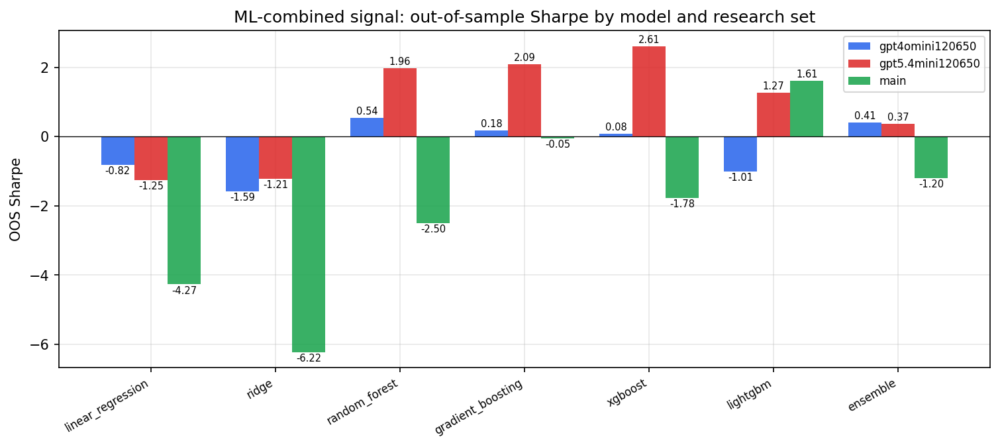

*ML-combined OOS Sharpe by model and research set*

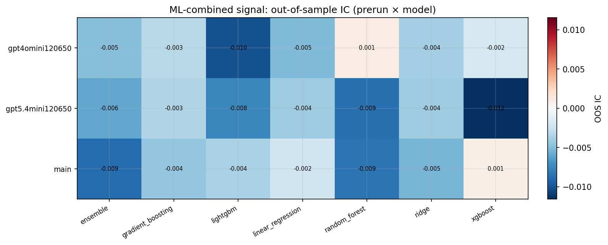

*ML-combined OOS IC (prerun × model)*

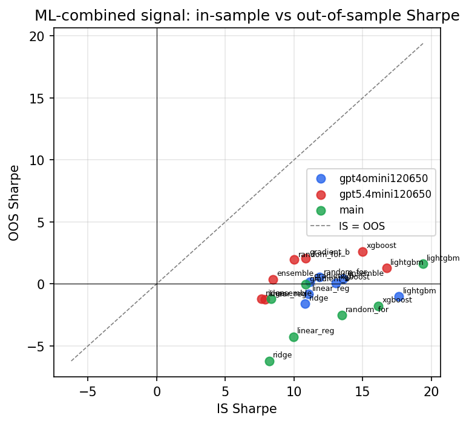

*IS vs OOS Sharpe (overfitting diagnostic)*

---
*Generated by `run_model_comparison.py`. Tables: `*.csv`; interactive: `comparison.ipynb`.*
