# Research-LLM factor comparison — `2025-05`

Comparing the **factor output of different research LLMs** on three axes (raw factor quality → factors as ML features → factors through the full agentic fund). The panel, IS/OOS split, horizon and model hyper-parameters are held identical across preruns — the *only* variable is the factor set.

## Preruns compared

| prerun | research_model | usable_factors | dropped_factors |
| --- | --- | --- | --- |
| gpt4omini120650 | gpt-4o-mini | 66 | 0 |
| gpt5.4mini120650 | gpt-5.4-mini | 69 | 0 |
| main | seed library | 78 | 10 |

> Dropped factors declare fields the current data doesn't have yet (e.g. fundamentals); they light up unchanged once that data is downloaded.

*Usable vs awaiting-data factors per research model*

## Key findings

- **Best ML-combined OOS Sharpe:** `gpt4omini120650` with `lightgbm` (OOS Sharpe = 7.562).
- **Mean OOS Sharpe across models, by research set:** `gpt4omini120650` = 3.360, `main` = 2.745, `gpt5.4mini120650` = -1.561.
- **Highest mean single-factor |IC| (h=6):** `gpt5.4mini120650` (mean |IC| = 0.0072).
- **Most diverse zoo (highest effective/raw factor ratio):** `gpt5.4mini120650` (eff 50.4 of 69, ratio 0.73).
- **Best selection-deflated single-factor |IC|:** `main` (deflated |IC| = 0.0150 from 38 factors tried).

## 1. Single-factor IC (raw factor quality)

Per-underlying time-series Spearman rank-IC of every researched factor, recomputed on the shared panel at horizons h=1, h=6, h=60. The per-underlying IC correlates each factor's value vector with the underlying's own forward-return vector (pooled across underlyings); the cross-sectional IC ranks across underlyings per timestamp.

| prerun | n_factors | mean_abs_ic_1 | mean_abs_ic_6 | mean_abs_ic_60 | mean_abs_icir_6 | best_factor_h6 | best_abs_ic_h6 |
| --- | --- | --- | --- | --- | --- | --- | --- |
| gpt4omini120650 | 66 | 0.0029 | 0.0041 | 0.0063 | 0.2529 | order_flow_skewness_indicator | 0.0166 |
| gpt5.4mini120650 | 69 | 0.0038 | 0.0072 | 0.0094 | 0.3717 | multiscale_liquidity_leadlag_reversal | 0.0178 |
| main | 78 | 0.0058 | 0.0065 | 0.0075 | 0.4139 | alpha_066 | 0.022 |

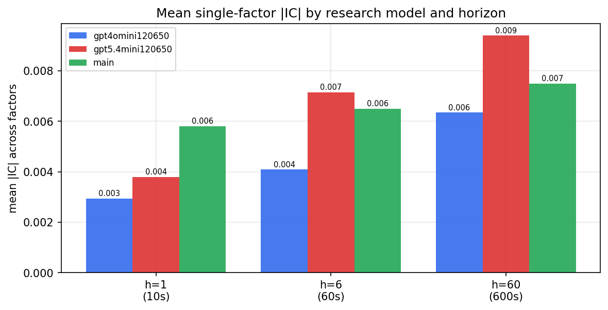

*Mean |IC| by research model and horizon*

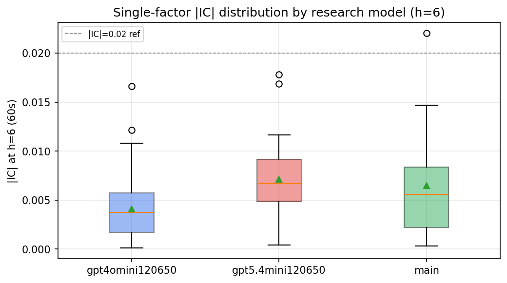

*Per-factor |IC| distribution by research model*

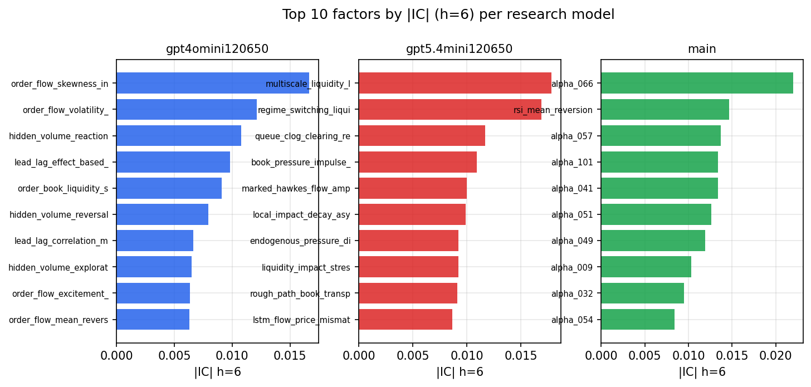

*Top factors by |IC| per research model*

## 2. Factor diversity & redundancy

Pairwise correlation of each zoo's *signals*. `eff_n_factors` is the effective number of independent factors (participation ratio of the correlation eigenvalues); `eff_ratio` and `redundancy` summarise how much unique information the zoo holds vs. how much is duplicated; `n_clusters` groups factors at |corr| ≥ 0.7.

| prerun | n_factors | eff_n_factors | eff_ratio | mean_abs_corr | n_clusters | redundancy |
| --- | --- | --- | --- | --- | --- | --- |
| gpt4omini120650 | 66 | 27.113 | 0.4108 | 0.0502 | 51 | 0.5892 |
| gpt5.4mini120650 | 69 | 50.3862 | 0.7302 | 0.0126 | 63 | 0.2698 |
| main | 78 | 44.9958 | 0.5769 | 0.0255 | 71 | 0.4231 |

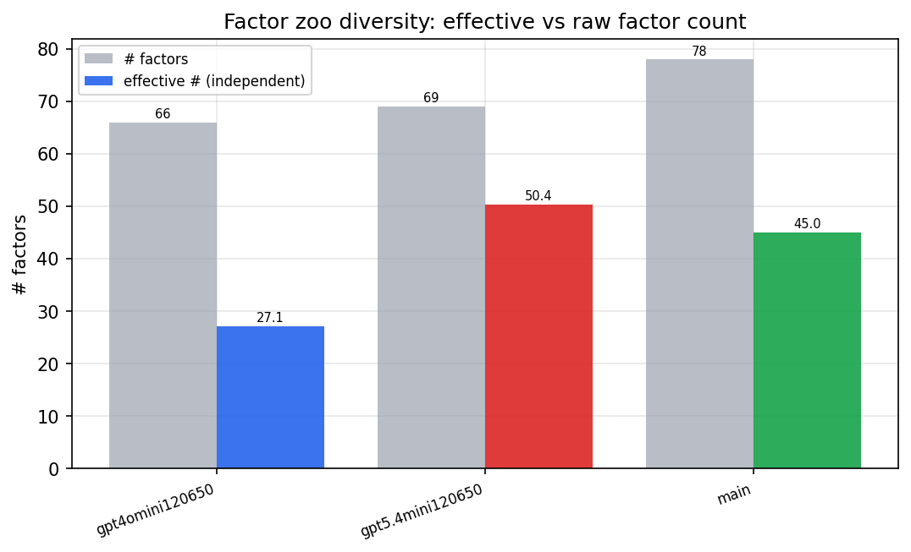

*Effective vs raw factor count per research model*

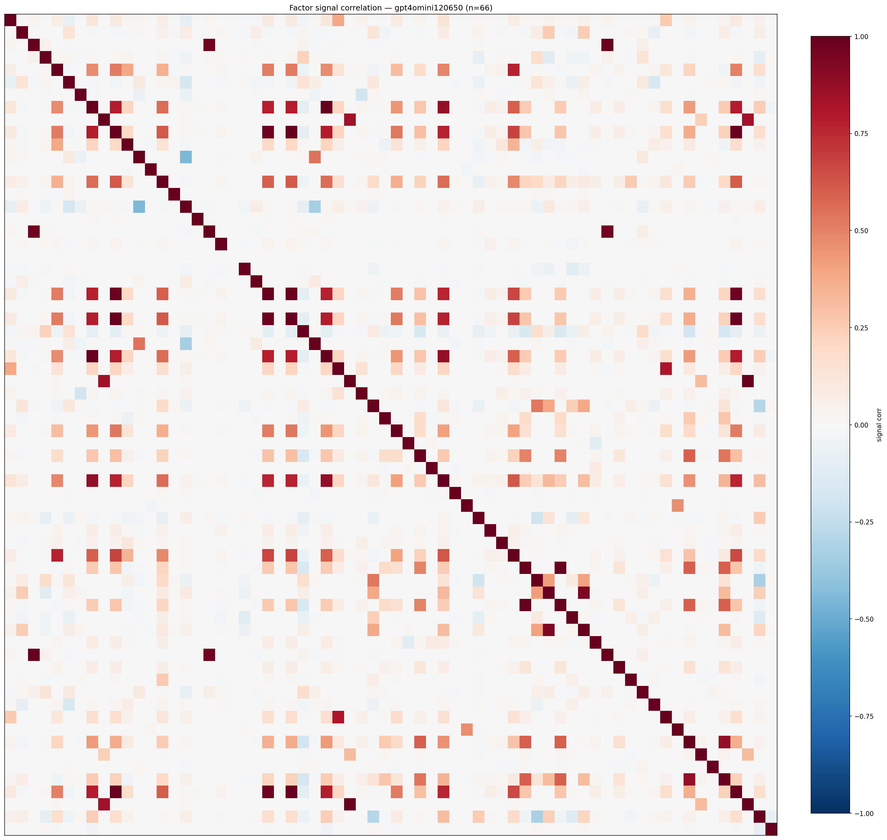

*Signal correlation matrix — gpt4omini120650*

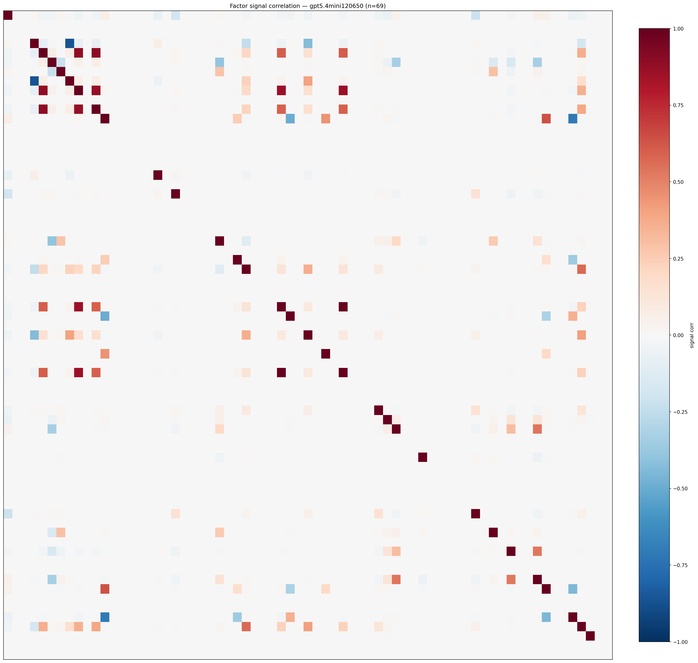

*Signal correlation matrix — gpt5.4mini120650*

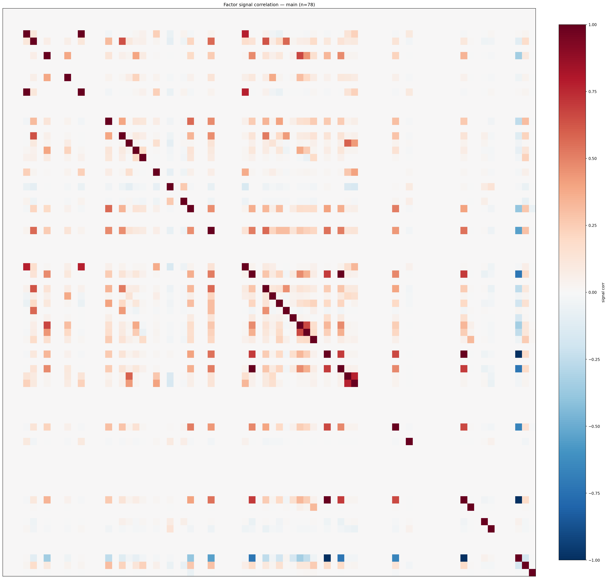

*Signal correlation matrix — main*

## 3. Deflation & model-based importance

`deflated_best_ic` haircuts each zoo's best |IC| for the number of factors tried (`ic_n_tested`) — a bigger zoo's best factor is more likely to be lucky. `lasso_n_nonzero` / `lasso_sparsity` show how many factors a sparse linear model actually keeps (model-view redundancy).

| prerun | best_ic | deflated_best_ic | deflated_best_t | ic_n_tested | ic_n_obs | lasso_n_nonzero | lasso_sparsity |
| --- | --- | --- | --- | --- | --- | --- | --- |
| gpt4omini120650 | 0.0166 | 0.0091 | 3.456 | 64 | 145078 | 0 | 1.0 |
| gpt5.4mini120650 | 0.0178 | 0.0109 | 4.1599 | 31 | 145078 | 1 | 0.9855 |
| main | 0.022 | 0.015 | 5.6949 | 38 | 145078 | 0 | 1.0 |

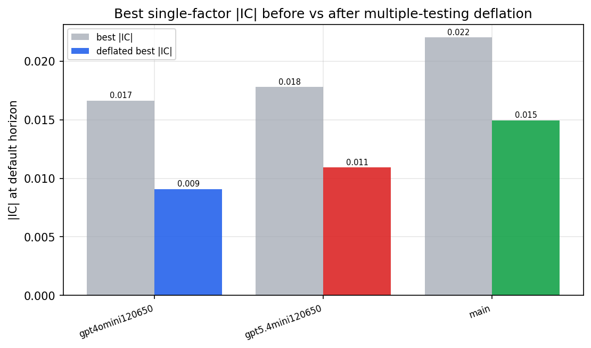

*Best |IC| before vs after multiple-testing deflation*

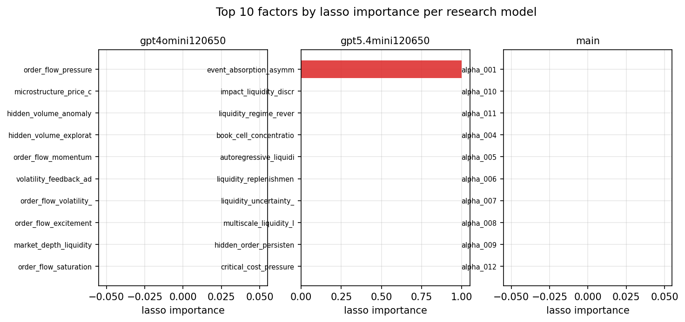

*Top factors by lasso importance per zoo*

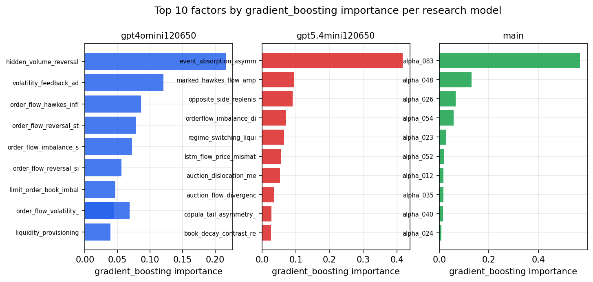

*Top factors by gradient_boosting importance per zoo*

## 4. ML-combined signal — per-underlying vectorised backtest

Each model combines a prerun's factors into ONE signal (fit `factors → forward return` on IS, predict per (bar, underlying)), then that combined signal is run through a simple vectorised backtest — `position(signal) × the underlying's own forward return` — on the held-out OOS tail (+ an equal-weight ensemble). No cross-sectional ranking.

> Config: position=**threshold** (t=1.0, z-score `expanding`), aggregation=**portfolio**, fit-standardise=**per_underlying**, horizon=6.

| prerun | model | n_factors_used | oos_ic | oos_sharpe | is_sharpe | oos_ann_return | oos_max_drawdown |
| --- | --- | --- | --- | --- | --- | --- | --- |
| gpt4omini120650 | linear_regression | 66 | -0.0055 | 0.541 | 6.2402 | 0.0791 | -0.0454 |
| gpt4omini120650 | ridge | 66 | -0.0051 | 0.0979 | 6.3085 | 0.0143 | -0.0442 |
| gpt4omini120650 | lasso | 66 | nan | nan | nan | nan | nan |
| gpt4omini120650 | elastic_net | 66 | nan | nan | nan | nan | nan |
| gpt4omini120650 | random_forest | 66 | -0.0101 | 4.887 | 10.9969 | 0.4124 | -0.0161 |
| gpt4omini120650 | gradient_boosting | 66 | -0.0038 | 4.7545 | 9.7831 | 0.2765 | -0.0035 |
| gpt4omini120650 | xgboost | 66 | -0.0059 | 0.7592 | 12.0418 | 0.0498 | -0.0153 |
| gpt4omini120650 | lightgbm | 66 | -0.0013 | 7.5621 | 17.4393 | 0.5943 | -0.0077 |
| gpt4omini120650 | ensemble | 66 | -0.0077 | 4.9157 | 12.9171 | 0.4718 | -0.0155 |
| gpt5.4mini120650 | linear_regression | 69 | -0.0033 | -2.2224 | 3.5636 | -0.0468 | -0.0061 |
| gpt5.4mini120650 | ridge | 69 | -0.002 | -5.1463 | 2.9713 | -0.1006 | -0.0095 |
| gpt5.4mini120650 | lasso | 69 | nan | nan | nan | nan | nan |
| gpt5.4mini120650 | elastic_net | 69 | nan | nan | nan | nan | nan |
| gpt5.4mini120650 | random_forest | 69 | 0.0059 | 1.6737 | 11.5417 | 0.0715 | -0.0087 |
| gpt5.4mini120650 | gradient_boosting | 69 | 0.0059 | -2.5712 | 8.3022 | -0.0196 | -0.0041 |
| gpt5.4mini120650 | xgboost | 69 | 0.0093 | -0.024 | 14.122 | -0.0009 | -0.0131 |
| gpt5.4mini120650 | lightgbm | 69 | 0.0088 | -0.3792 | 18.9961 | -0.012 | -0.008 |
| gpt5.4mini120650 | ensemble | 69 | 0.0009 | -2.2595 | 6.9048 | -0.0162 | -0.0022 |
| main | linear_regression | 78 | 0.0055 | 0.7551 | 8.8525 | 0.0126 | -0.0033 |
| main | ridge | 78 | 0.0083 | 0.6527 | 8.3917 | 0.0103 | -0.0027 |
| main | lasso | 78 | nan | nan | nan | nan | nan |
| main | elastic_net | 78 | nan | nan | nan | nan | nan |
| main | random_forest | 78 | 0.0012 | 6.0317 | 12.3274 | 0.4322 | -0.0087 |
| main | gradient_boosting | 78 | -0.0004 | 3.616 | 11.8379 | 0.1895 | -0.0079 |
| main | xgboost | 78 | -0.001 | 4.2699 | 16.0379 | 0.3163 | -0.0075 |
| main | lightgbm | 78 | -0.0063 | 0.3851 | 17.6867 | 0.0153 | -0.008 |
| main | ensemble | 78 | -0.0051 | 3.5056 | 11.887 | 0.0826 | -0.0032 |

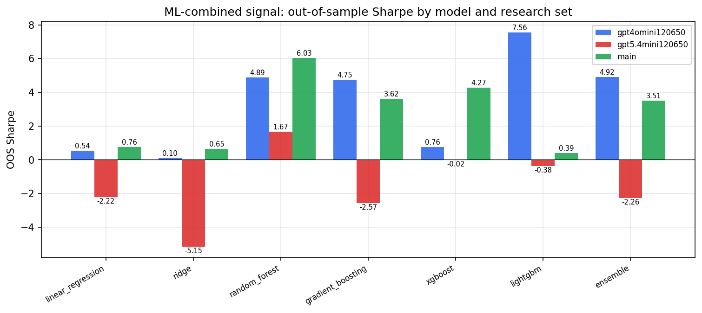

*ML-combined OOS Sharpe by model and research set*

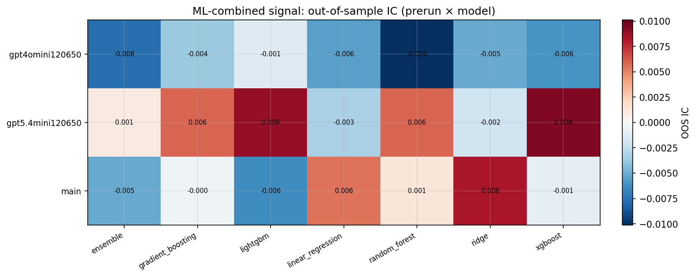

*ML-combined OOS IC (prerun × model)*

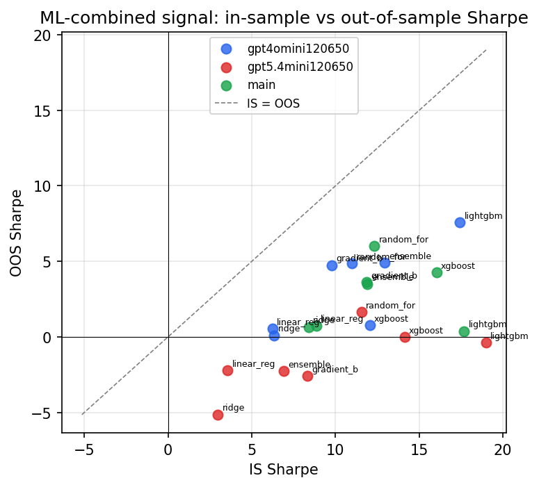

*IS vs OOS Sharpe (overfitting diagnostic)*

---
*Generated by `run_model_comparison.py`. Tables: `*.csv`; interactive: `comparison.ipynb`.*
