# Research-LLM factor comparison — `2025-06`

Comparing the **factor output of different research LLMs** on three axes (raw factor quality → factors as ML features → factors through the full agentic fund). The panel, IS/OOS split, horizon and model hyper-parameters are held identical across preruns — the *only* variable is the factor set.

## Preruns compared

| prerun | research_model | usable_factors | dropped_factors |
| --- | --- | --- | --- |
| gpt4omini120650 | gpt-4o-mini | 66 | 0 |
| gpt5.4mini120650 | gpt-5.4-mini | 69 | 0 |
| main | seed library | 78 | 10 |

> Dropped factors declare fields the current data doesn't have yet (e.g. fundamentals); they light up unchanged once that data is downloaded.

*Usable vs awaiting-data factors per research model*

## Key findings

- **Best ML-combined OOS Sharpe:** `gpt5.4mini120650` with `random_forest` (OOS Sharpe = 3.895).
- **Mean OOS Sharpe across models, by research set:** `gpt4omini120650` = 1.450, `gpt5.4mini120650` = -0.349, `main` = -0.450.
- **Highest mean single-factor |IC| (h=6):** `gpt5.4mini120650` (mean |IC| = 0.0058).
- **Most diverse zoo (highest effective/raw factor ratio):** `gpt5.4mini120650` (eff 50.3 of 69, ratio 0.73).
- **Best selection-deflated single-factor |IC|:** `gpt4omini120650` (deflated |IC| = 0.0139 from 64 factors tried).

## 1. Single-factor IC (raw factor quality)

Per-underlying time-series Spearman rank-IC of every researched factor, recomputed on the shared panel at horizons h=1, h=6, h=60. The per-underlying IC correlates each factor's value vector with the underlying's own forward-return vector (pooled across underlyings); the cross-sectional IC ranks across underlyings per timestamp.

| prerun | n_factors | mean_abs_ic_1 | mean_abs_ic_6 | mean_abs_ic_60 | mean_abs_icir_6 | best_factor_h6 | best_abs_ic_h6 |
| --- | --- | --- | --- | --- | --- | --- | --- |
| gpt4omini120650 | 66 | 0.003 | 0.0033 | 0.0074 | 0.1729 | order_flow_skewness_indicator | 0.0216 |
| gpt5.4mini120650 | 69 | 0.0035 | 0.0058 | 0.0077 | 0.3513 | local_impact_decay_asymmetry | 0.0167 |
| main | 78 | 0.0073 | 0.0049 | 0.0069 | 0.3364 | alpha_066 | 0.0119 |

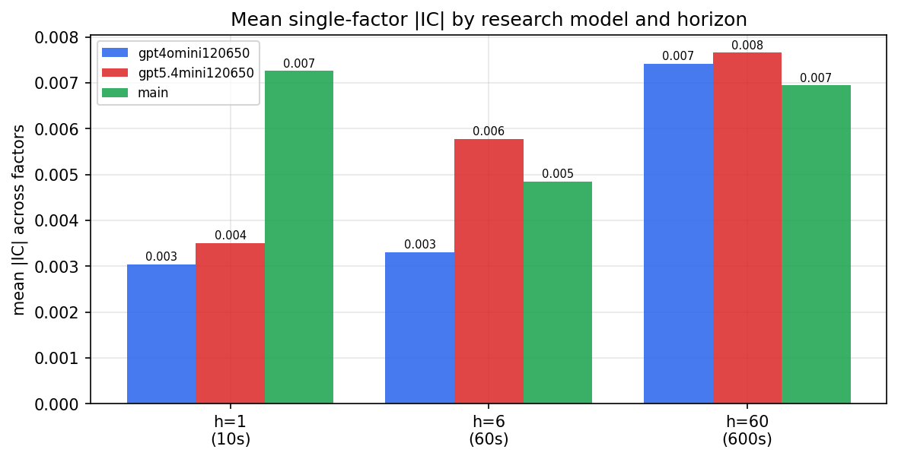

*Mean |IC| by research model and horizon*

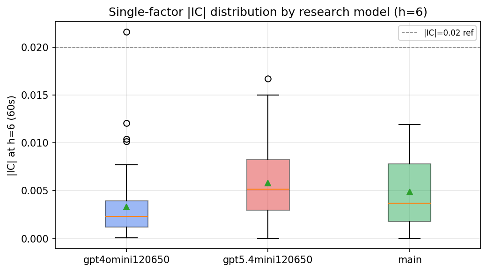

*Per-factor |IC| distribution by research model*

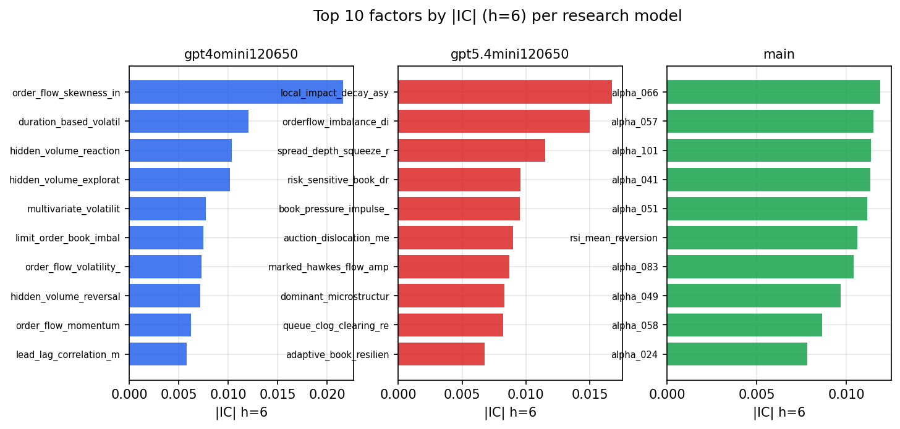

*Top factors by |IC| per research model*

## 2. Factor diversity & redundancy

Pairwise correlation of each zoo's *signals*. `eff_n_factors` is the effective number of independent factors (participation ratio of the correlation eigenvalues); `eff_ratio` and `redundancy` summarise how much unique information the zoo holds vs. how much is duplicated; `n_clusters` groups factors at |corr| ≥ 0.7.

| prerun | n_factors | eff_n_factors | eff_ratio | mean_abs_corr | n_clusters | redundancy |
| --- | --- | --- | --- | --- | --- | --- |
| gpt4omini120650 | 66 | 28.0355 | 0.4248 | 0.0494 | 52 | 0.5752 |
| gpt5.4mini120650 | 69 | 50.3286 | 0.7294 | 0.0125 | 63 | 0.2706 |
| main | 78 | 45.3523 | 0.5814 | 0.0249 | 71 | 0.4186 |

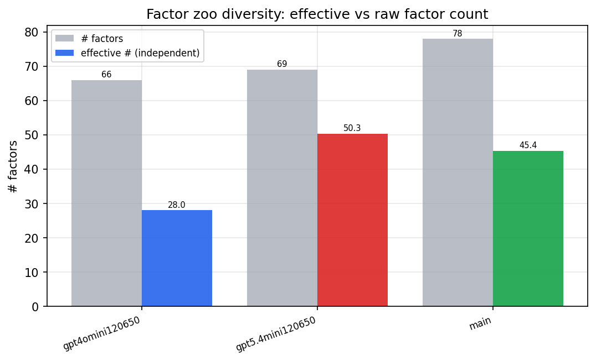

*Effective vs raw factor count per research model*

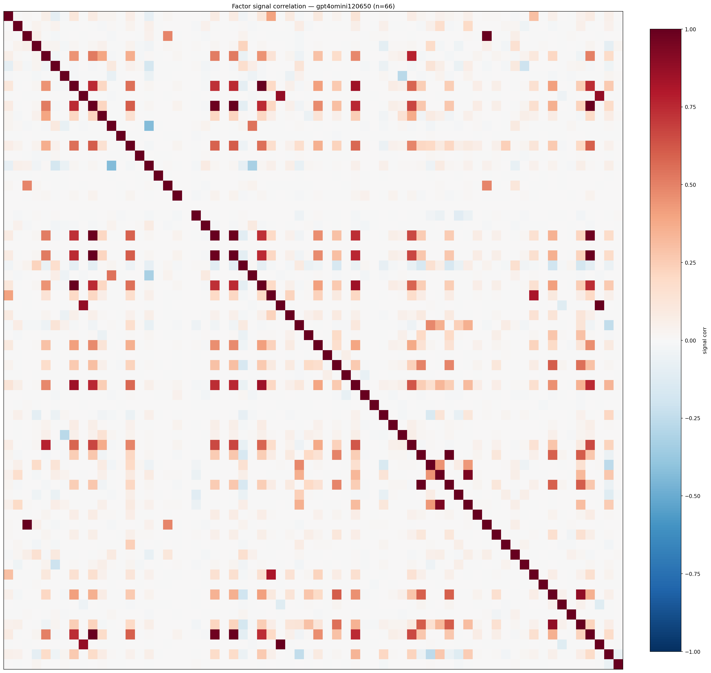

*Signal correlation matrix — gpt4omini120650*

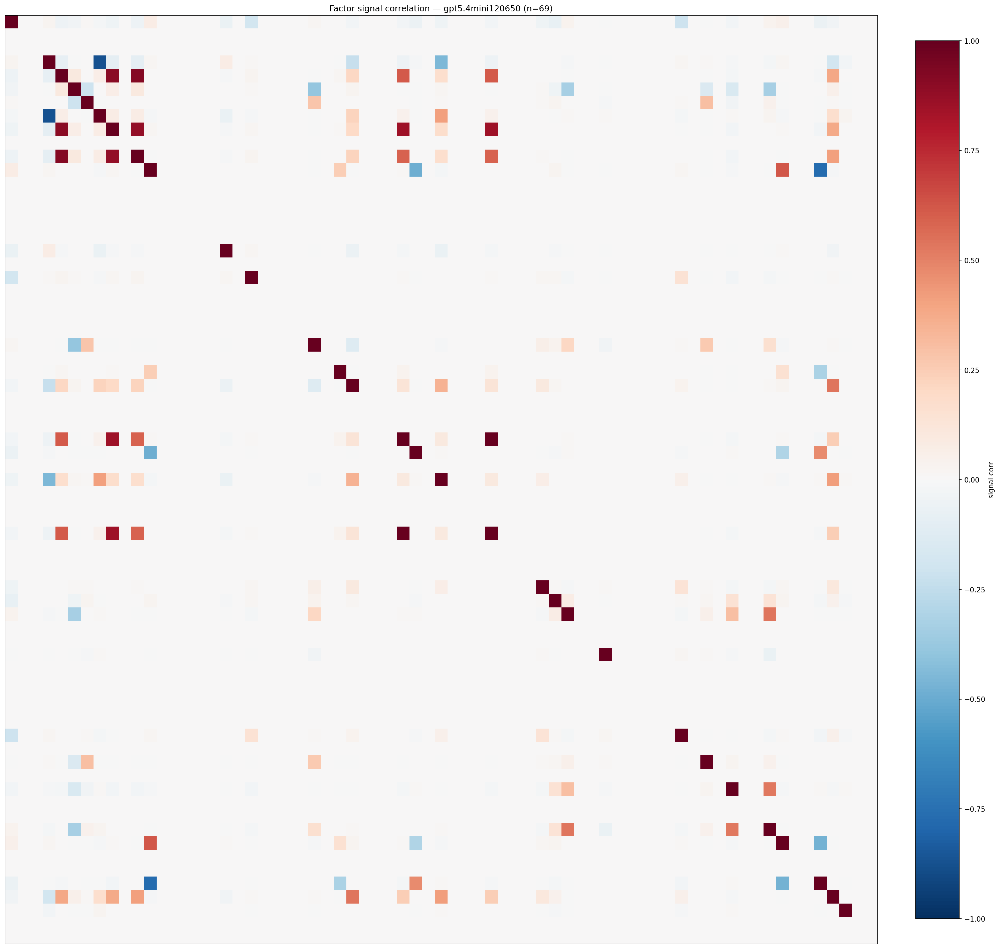

*Signal correlation matrix — gpt5.4mini120650*

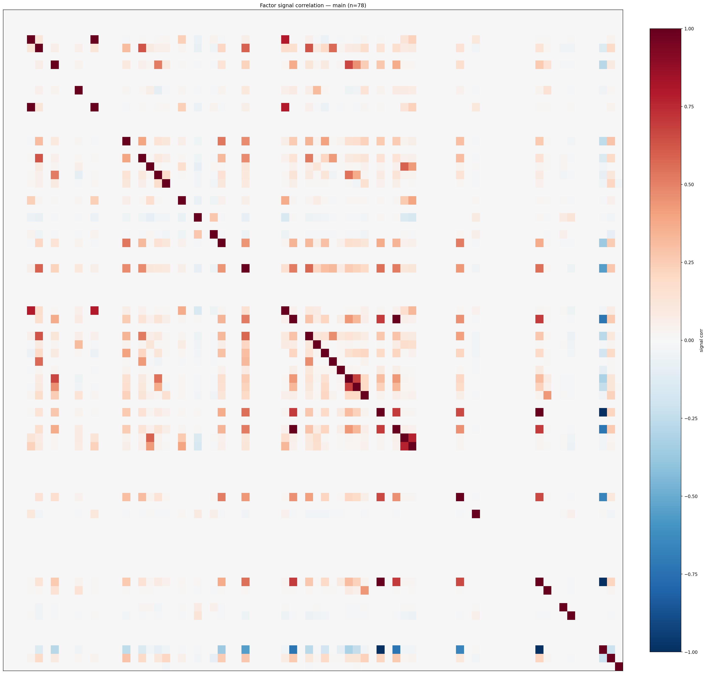

*Signal correlation matrix — main*

## 3. Deflation & model-based importance

`deflated_best_ic` haircuts each zoo's best |IC| for the number of factors tried (`ic_n_tested`) — a bigger zoo's best factor is more likely to be lucky. `lasso_n_nonzero` / `lasso_sparsity` show how many factors a sparse linear model actually keeps (model-view redundancy).

| prerun | best_ic | deflated_best_ic | deflated_best_t | ic_n_tested | ic_n_obs | lasso_n_nonzero | lasso_sparsity |
| --- | --- | --- | --- | --- | --- | --- | --- |
| gpt4omini120650 | 0.0216 | 0.0139 | 5.2671 | 64 | 142738 | 5 | 0.9242 |
| gpt5.4mini120650 | 0.0167 | 0.0098 | 3.6933 | 31 | 142738 | 1 | 0.9855 |
| main | 0.0119 | 0.0048 | 1.8005 | 38 | 142738 | 0 | 1.0 |

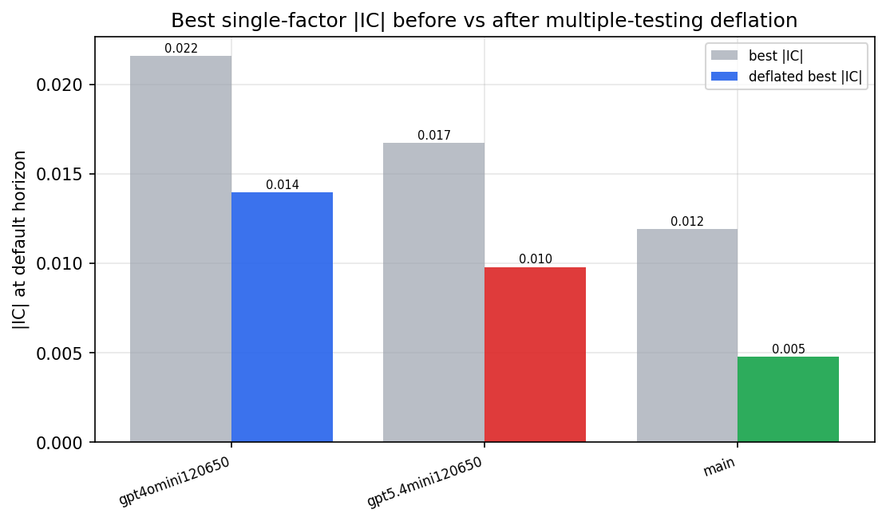

*Best |IC| before vs after multiple-testing deflation*

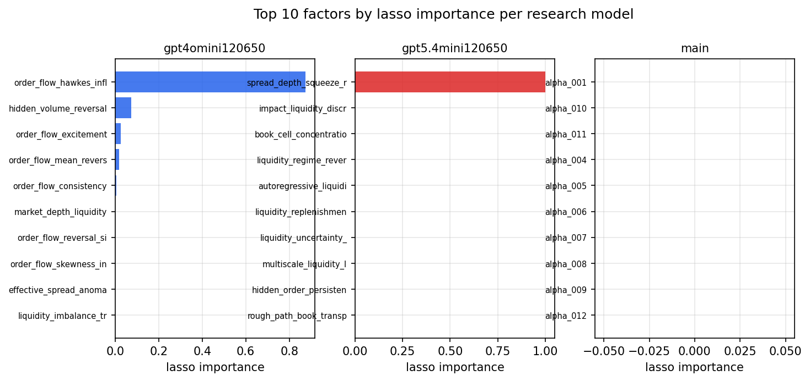

*Top factors by lasso importance per zoo*

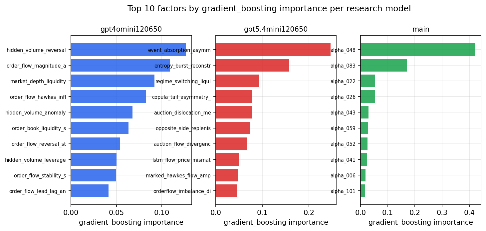

*Top factors by gradient_boosting importance per zoo*

## 4. ML-combined signal — per-underlying vectorised backtest

Each model combines a prerun's factors into ONE signal (fit `factors → forward return` on IS, predict per (bar, underlying)), then that combined signal is run through a simple vectorised backtest — `position(signal) × the underlying's own forward return` — on the held-out OOS tail (+ an equal-weight ensemble). No cross-sectional ranking.

> Config: position=**threshold** (t=1.0, z-score `expanding`), aggregation=**portfolio**, fit-standardise=**per_underlying**, horizon=6.

| prerun | model | n_factors_used | oos_ic | oos_sharpe | is_sharpe | oos_ann_return | oos_max_drawdown |
| --- | --- | --- | --- | --- | --- | --- | --- |
| gpt4omini120650 | linear_regression | 66 | 0.013 | -0.3945 | 7.2643 | -0.0463 | -0.0432 |
| gpt4omini120650 | ridge | 66 | 0.0148 | -0.3689 | 7.4277 | -0.0432 | -0.0426 |
| gpt4omini120650 | lasso | 66 | nan | nan | nan | nan | nan |
| gpt4omini120650 | elastic_net | 66 | nan | nan | nan | nan | nan |
| gpt4omini120650 | random_forest | 66 | 0.0009 | 3.6938 | 10.6624 | 0.1782 | -0.005 |
| gpt4omini120650 | gradient_boosting | 66 | -0.0 | 0.1615 | 9.4444 | 0.0033 | -0.0038 |
| gpt4omini120650 | xgboost | 66 | 0.0004 | 1.559 | 11.4215 | 0.0658 | -0.0047 |
| gpt4omini120650 | lightgbm | 66 | -0.001 | 3.2986 | 13.3126 | 0.1815 | -0.0048 |
| gpt4omini120650 | ensemble | 66 | 0.0148 | 2.2018 | 12.3202 | 0.1345 | -0.0109 |
| gpt5.4mini120650 | linear_regression | 69 | 0.0002 | -3.5047 | 1.2964 | -0.0429 | -0.0042 |
| gpt5.4mini120650 | ridge | 69 | 0.0032 | -3.0123 | 2.8378 | -0.036 | -0.0036 |
| gpt5.4mini120650 | lasso | 69 | nan | nan | nan | nan | nan |
| gpt5.4mini120650 | elastic_net | 69 | nan | nan | nan | nan | nan |
| gpt5.4mini120650 | random_forest | 69 | 0.0043 | 3.8949 | 12.1631 | 0.1831 | -0.0095 |
| gpt5.4mini120650 | gradient_boosting | 69 | 0.0047 | -1.8138 | 8.5417 | -0.0217 | -0.0033 |
| gpt5.4mini120650 | xgboost | 69 | 0.0044 | 0.1916 | 13.1432 | 0.0071 | -0.0093 |
| gpt5.4mini120650 | lightgbm | 69 | -0.0012 | 1.2029 | 14.5458 | 0.0512 | -0.0151 |
| gpt5.4mini120650 | ensemble | 69 | 0.0149 | 0.5998 | 13.181 | 0.0169 | -0.0067 |
| main | linear_regression | 78 | -0.0033 | 2.1323 | 9.1016 | 0.0509 | -0.006 |
| main | ridge | 78 | -0.003 | 3.2991 | 9.3067 | 0.0539 | -0.0035 |
| main | lasso | 78 | nan | nan | nan | nan | nan |
| main | elastic_net | 78 | nan | nan | nan | nan | nan |
| main | random_forest | 78 | 0.0058 | 0.57 | 13.0465 | 0.0346 | -0.0179 |
| main | gradient_boosting | 78 | 0.0124 | -0.6878 | 13.8466 | -0.031 | -0.0158 |
| main | xgboost | 78 | 0.0017 | -2.3241 | 14.9129 | -0.1248 | -0.0164 |
| main | lightgbm | 78 | 0.0041 | -3.162 | 16.1209 | -0.1515 | -0.0161 |
| main | ensemble | 78 | -0.002 | -2.9761 | 10.1396 | -0.0309 | -0.0038 |

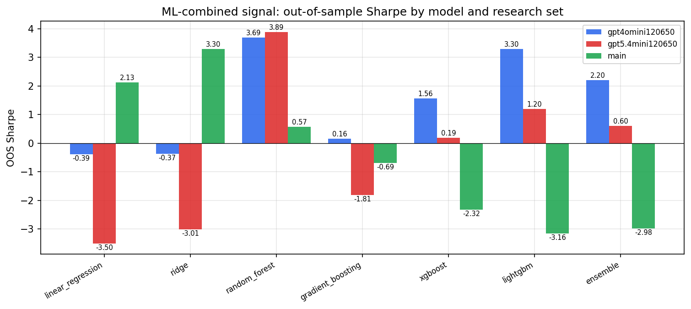

*ML-combined OOS Sharpe by model and research set*

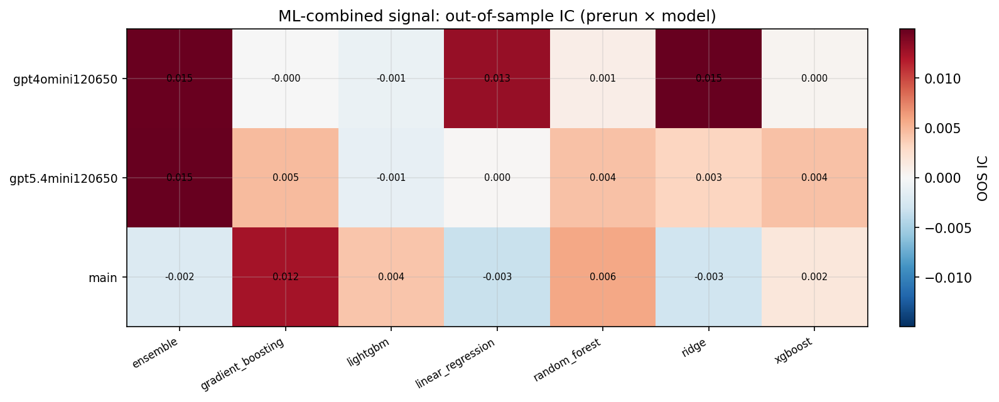

*ML-combined OOS IC (prerun × model)*

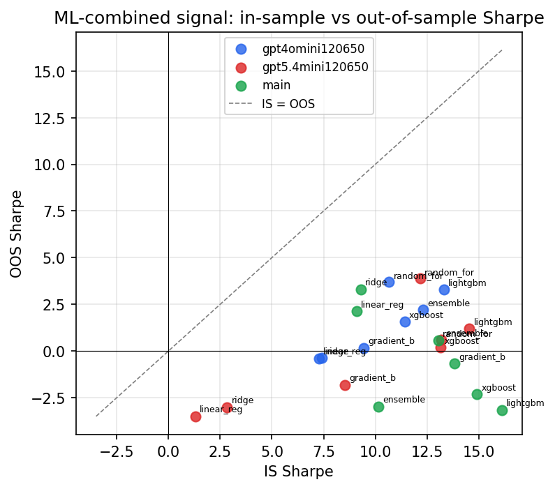

*IS vs OOS Sharpe (overfitting diagnostic)*

---
*Generated by `run_model_comparison.py`. Tables: `*.csv`; interactive: `comparison.ipynb`.*
