# Research-LLM factor comparison — `2025-07`

Comparing the **factor output of different research LLMs** on three axes (raw factor quality → factors as ML features → factors through the full agentic fund). The panel, IS/OOS split, horizon and model hyper-parameters are held identical across preruns — the *only* variable is the factor set.

## Preruns compared

| prerun | research_model | usable_factors | dropped_factors |
| --- | --- | --- | --- |
| gpt4omini120650 | gpt-4o-mini | 66 | 0 |
| gpt5.4mini120650 | gpt-5.4-mini | 69 | 0 |
| main | seed library | 78 | 10 |

> Dropped factors declare fields the current data doesn't have yet (e.g. fundamentals); they light up unchanged once that data is downloaded.

*Usable vs awaiting-data factors per research model*

## Key findings

- **Best ML-combined OOS Sharpe:** `main` with `random_forest` (OOS Sharpe = 2.927).
- **Mean OOS Sharpe across models, by research set:** `main` = 1.330, `gpt5.4mini120650` = -2.491, `gpt4omini120650` = -2.839.
- **Highest mean single-factor |IC| (h=6):** `main` (mean |IC| = 0.0102).
- **Most diverse zoo (highest effective/raw factor ratio):** `gpt5.4mini120650` (eff 50.4 of 69, ratio 0.73).
- **Best selection-deflated single-factor |IC|:** `main` (deflated |IC| = 0.0165 from 38 factors tried).

## 1. Single-factor IC (raw factor quality)

Per-underlying time-series Spearman rank-IC of every researched factor, recomputed on the shared panel at horizons h=1, h=6, h=60. The per-underlying IC correlates each factor's value vector with the underlying's own forward-return vector (pooled across underlyings); the cross-sectional IC ranks across underlyings per timestamp.

| prerun | n_factors | mean_abs_ic_1 | mean_abs_ic_6 | mean_abs_ic_60 | mean_abs_icir_6 | best_factor_h6 | best_abs_ic_h6 |
| --- | --- | --- | --- | --- | --- | --- | --- |
| gpt4omini120650 | 66 | 0.0065 | 0.0055 | 0.0083 | 0.3152 | order_flow_momentum | 0.0181 |
| gpt5.4mini120650 | 69 | 0.0073 | 0.0081 | 0.008 | 0.418 | orderflow_imbalance_divergence | 0.0195 |
| main | 78 | 0.0155 | 0.0102 | 0.0097 | 0.5695 | rsi_mean_reversion | 0.0236 |

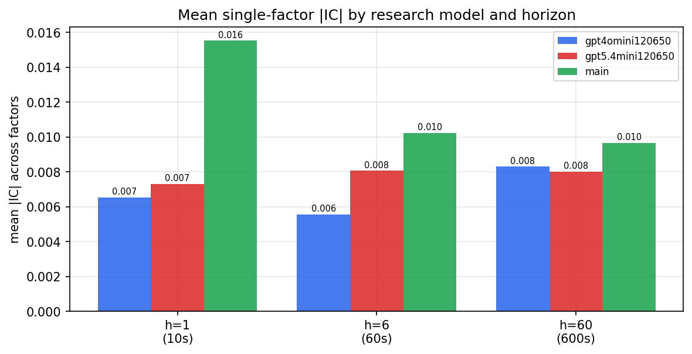

*Mean |IC| by research model and horizon*

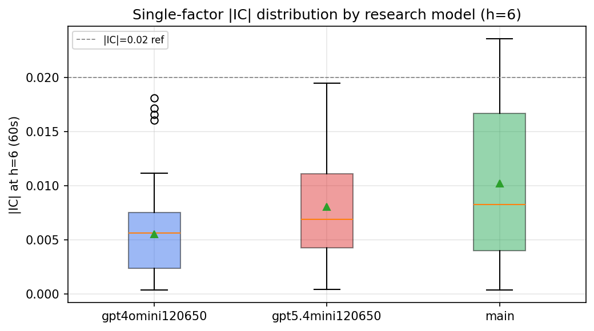

*Per-factor |IC| distribution by research model*

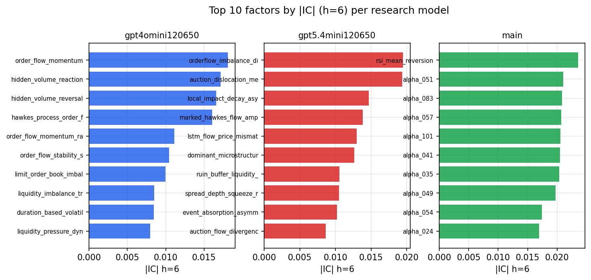

*Top factors by |IC| per research model*

## 2. Factor diversity & redundancy

Pairwise correlation of each zoo's *signals*. `eff_n_factors` is the effective number of independent factors (participation ratio of the correlation eigenvalues); `eff_ratio` and `redundancy` summarise how much unique information the zoo holds vs. how much is duplicated; `n_clusters` groups factors at |corr| ≥ 0.7.

| prerun | n_factors | eff_n_factors | eff_ratio | mean_abs_corr | n_clusters | redundancy |
| --- | --- | --- | --- | --- | --- | --- |
| gpt4omini120650 | 66 | 27.4373 | 0.4157 | 0.0499 | 52 | 0.5843 |
| gpt5.4mini120650 | 69 | 50.4385 | 0.731 | 0.0131 | 63 | 0.269 |
| main | 78 | 44.8552 | 0.5751 | 0.0258 | 71 | 0.4249 |

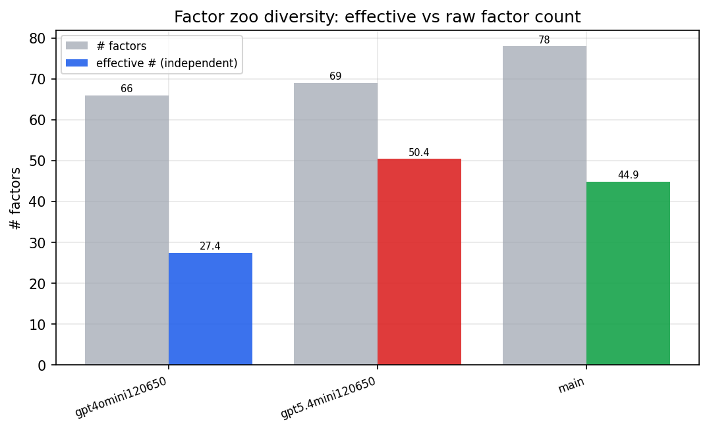

*Effective vs raw factor count per research model*

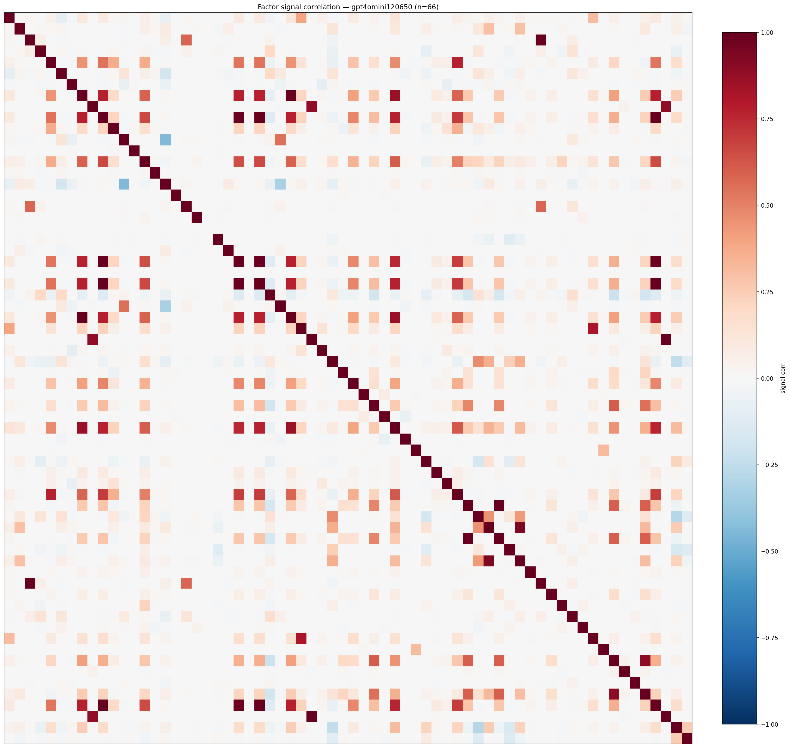

*Signal correlation matrix — gpt4omini120650*

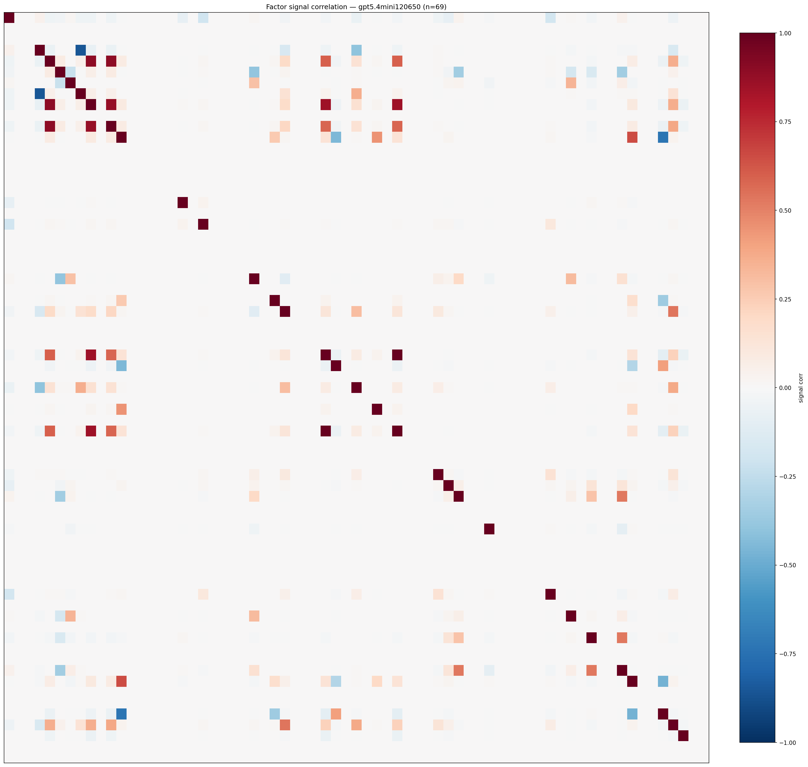

*Signal correlation matrix — gpt5.4mini120650*

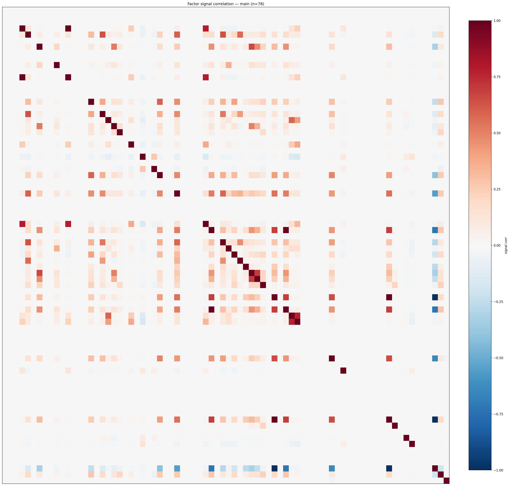

*Signal correlation matrix — main*

## 3. Deflation & model-based importance

`deflated_best_ic` haircuts each zoo's best |IC| for the number of factors tried (`ic_n_tested`) — a bigger zoo's best factor is more likely to be lucky. `lasso_n_nonzero` / `lasso_sparsity` show how many factors a sparse linear model actually keeps (model-view redundancy).

| prerun | best_ic | deflated_best_ic | deflated_best_t | ic_n_tested | ic_n_obs | lasso_n_nonzero | lasso_sparsity |
| --- | --- | --- | --- | --- | --- | --- | --- |
| gpt4omini120650 | 0.0181 | 0.0105 | 3.9964 | 64 | 143999 | 0 | 1.0 |
| gpt5.4mini120650 | 0.0195 | 0.0129 | 4.8805 | 24 | 143999 | 0 | 1.0 |
| main | 0.0236 | 0.0165 | 6.248 | 38 | 143999 | 0 | 1.0 |

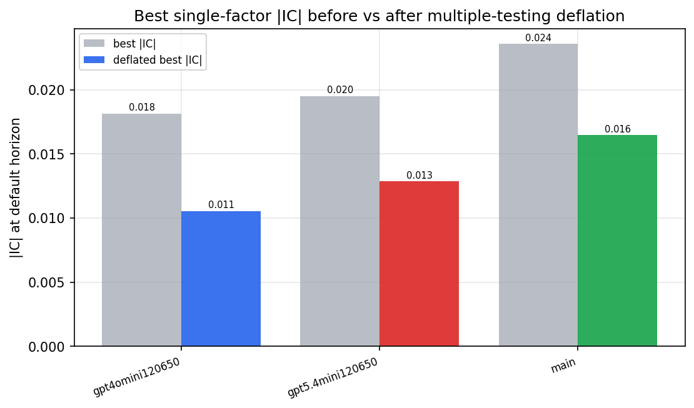

*Best |IC| before vs after multiple-testing deflation*

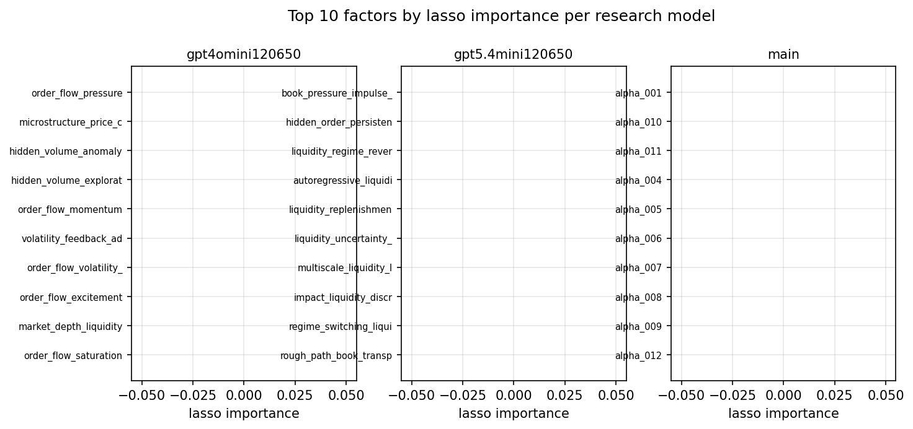

*Top factors by lasso importance per zoo*

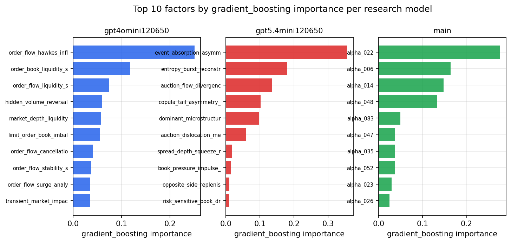

*Top factors by gradient_boosting importance per zoo*

## 4. ML-combined signal — per-underlying vectorised backtest

Each model combines a prerun's factors into ONE signal (fit `factors → forward return` on IS, predict per (bar, underlying)), then that combined signal is run through a simple vectorised backtest — `position(signal) × the underlying's own forward return` — on the held-out OOS tail (+ an equal-weight ensemble). No cross-sectional ranking.

> Config: position=**threshold** (t=1.0, z-score `expanding`), aggregation=**portfolio**, fit-standardise=**per_underlying**, horizon=6.

| prerun | model | n_factors_used | oos_ic | oos_sharpe | is_sharpe | oos_ann_return | oos_max_drawdown |
| --- | --- | --- | --- | --- | --- | --- | --- |
| gpt4omini120650 | linear_regression | 66 | 0.0006 | -4.4243 | 4.8438 | -0.2941 | -0.0322 |
| gpt4omini120650 | ridge | 66 | 0.0002 | -4.0289 | 4.3845 | -0.2712 | -0.0308 |
| gpt4omini120650 | lasso | 66 | 0.0194 | -1.4291 | 2.3152 | -0.0813 | -0.0189 |
| gpt4omini120650 | elastic_net | 66 | 0.0194 | -1.4501 | 2.3107 | -0.0825 | -0.0191 |
| gpt4omini120650 | random_forest | 66 | -0.0126 | -1.14 | 8.8822 | -0.0527 | -0.0117 |
| gpt4omini120650 | gradient_boosting | 66 | -0.0107 | -3.1314 | 8.6993 | -0.0956 | -0.0121 |
| gpt4omini120650 | xgboost | 66 | -0.0095 | -4.6621 | 9.8635 | -0.1568 | -0.0153 |
| gpt4omini120650 | lightgbm | 66 | -0.0072 | -2.4027 | 11.3502 | -0.1252 | -0.0207 |
| gpt4omini120650 | ensemble | 66 | 0.0049 | -2.882 | 10.5679 | -0.1555 | -0.0198 |
| gpt5.4mini120650 | linear_regression | 69 | 0.0156 | -1.1776 | 1.4172 | -0.0201 | -0.0057 |
| gpt5.4mini120650 | ridge | 69 | 0.0173 | -1.5038 | 1.4308 | -0.0317 | -0.0072 |
| gpt5.4mini120650 | lasso | 69 | 0.0171 | -2.8818 | 4.1191 | -0.2285 | -0.0356 |
| gpt5.4mini120650 | elastic_net | 69 | 0.0171 | -2.8925 | 4.2152 | -0.2292 | -0.0356 |
| gpt5.4mini120650 | random_forest | 69 | 0.0126 | -2.3826 | 10.2077 | -0.1747 | -0.0309 |
| gpt5.4mini120650 | gradient_boosting | 69 | 0.0149 | -2.8514 | 8.4919 | -0.0713 | -0.0116 |
| gpt5.4mini120650 | xgboost | 69 | 0.0145 | -2.8156 | 11.5344 | -0.1388 | -0.021 |
| gpt5.4mini120650 | lightgbm | 69 | 0.0177 | -3.1114 | 12.2505 | -0.0982 | -0.0134 |
| gpt5.4mini120650 | ensemble | 69 | 0.0156 | -2.8063 | 9.8267 | -0.2089 | -0.0338 |
| main | linear_regression | 78 | 0.008 | 1.0942 | 8.9115 | 0.0524 | -0.0162 |
| main | ridge | 78 | 0.0087 | -0.2383 | 8.6465 | -0.0104 | -0.0178 |
| main | lasso | 78 | nan | nan | nan | nan | nan |
| main | elastic_net | 78 | nan | nan | nan | nan | nan |
| main | random_forest | 78 | 0.0133 | 2.9268 | 11.0591 | 0.0775 | -0.0049 |
| main | gradient_boosting | 78 | 0.0069 | 0.6528 | 10.0983 | 0.0083 | -0.003 |
| main | xgboost | 78 | 0.0087 | 1.0117 | 11.3492 | 0.0157 | -0.004 |
| main | lightgbm | 78 | 0.0083 | 2.3067 | 12.3997 | 0.0552 | -0.0032 |
| main | ensemble | 78 | 0.0077 | 1.5565 | 10.0434 | 0.0162 | -0.0023 |

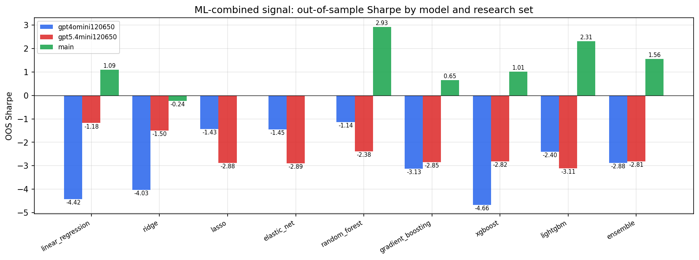

*ML-combined OOS Sharpe by model and research set*

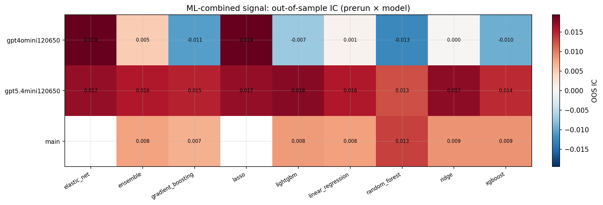

*ML-combined OOS IC (prerun × model)*

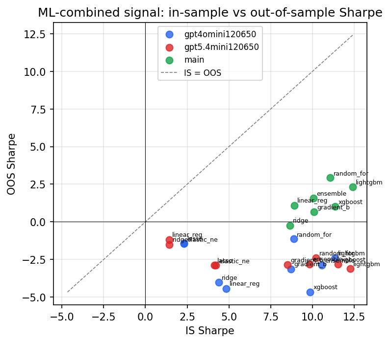

*IS vs OOS Sharpe (overfitting diagnostic)*

---
*Generated by `run_model_comparison.py`. Tables: `*.csv`; interactive: `comparison.ipynb`.*
