# Research-LLM factor comparison — `2025-08`

Comparing the **factor output of different research LLMs** on three axes (raw factor quality → factors as ML features → factors through the full agentic fund). The panel, IS/OOS split, horizon and model hyper-parameters are held identical across preruns — the *only* variable is the factor set.

## Preruns compared

| prerun | research_model | usable_factors | dropped_factors |
| --- | --- | --- | --- |
| gpt4omini120650 | gpt-4o-mini | 66 | 0 |
| gpt5.4mini120650 | gpt-5.4-mini | 69 | 0 |
| main | seed library | 78 | 10 |

> Dropped factors declare fields the current data doesn't have yet (e.g. fundamentals); they light up unchanged once that data is downloaded.

*Usable vs awaiting-data factors per research model*

## Key findings

- **Best ML-combined OOS Sharpe:** `gpt5.4mini120650` with `random_forest` (OOS Sharpe = 5.906).
- **Mean OOS Sharpe across models, by research set:** `gpt5.4mini120650` = 2.720, `main` = 2.568, `gpt4omini120650` = -2.617.
- **Highest mean single-factor |IC| (h=6):** `main` (mean |IC| = 0.0132).
- **Most diverse zoo (highest effective/raw factor ratio):** `gpt5.4mini120650` (eff 52.2 of 69, ratio 0.76).
- **Best selection-deflated single-factor |IC|:** `main` (deflated |IC| = 0.0229 from 38 factors tried).

## 1. Single-factor IC (raw factor quality)

Per-underlying time-series Spearman rank-IC of every researched factor, recomputed on the shared panel at horizons h=1, h=6, h=60. The per-underlying IC correlates each factor's value vector with the underlying's own forward-return vector (pooled across underlyings); the cross-sectional IC ranks across underlyings per timestamp.

| prerun | n_factors | mean_abs_ic_1 | mean_abs_ic_6 | mean_abs_ic_60 | mean_abs_icir_6 | best_factor_h6 | best_abs_ic_h6 |
| --- | --- | --- | --- | --- | --- | --- | --- |
| gpt4omini120650 | 66 | 0.0076 | 0.0095 | 0.0068 | 0.5357 | order_flow_momentum | 0.0248 |
| gpt5.4mini120650 | 69 | 0.006 | 0.0075 | 0.0057 | 0.5643 | auction_dislocation_mean_reversion | 0.0232 |
| main | 78 | 0.0188 | 0.0132 | 0.0086 | 0.7896 | alpha_035 | 0.0299 |

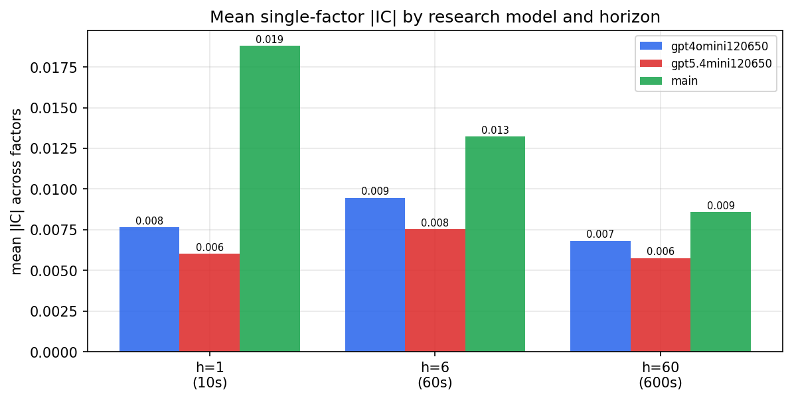

*Mean |IC| by research model and horizon*

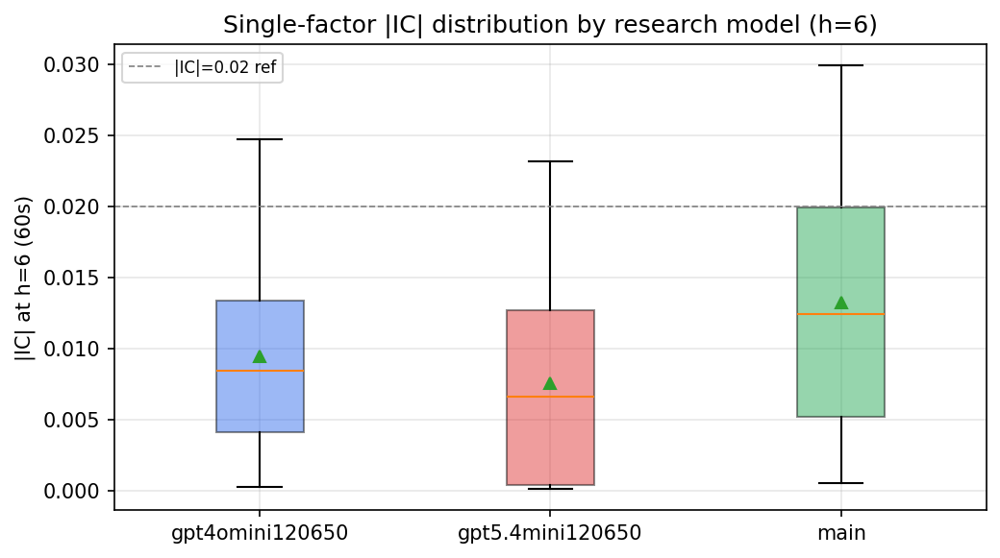

*Per-factor |IC| distribution by research model*

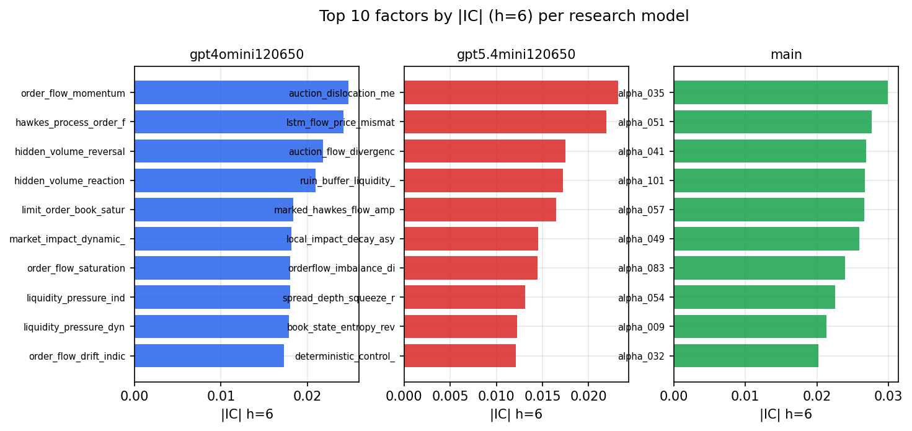

*Top factors by |IC| per research model*

## 2. Factor diversity & redundancy

Pairwise correlation of each zoo's *signals*. `eff_n_factors` is the effective number of independent factors (participation ratio of the correlation eigenvalues); `eff_ratio` and `redundancy` summarise how much unique information the zoo holds vs. how much is duplicated; `n_clusters` groups factors at |corr| ≥ 0.7.

| prerun | n_factors | eff_n_factors | eff_ratio | mean_abs_corr | n_clusters | redundancy |
| --- | --- | --- | --- | --- | --- | --- |
| gpt4omini120650 | 66 | 28.13 | 0.4262 | 0.0494 | 52 | 0.5738 |
| gpt5.4mini120650 | 69 | 52.2287 | 0.7569 | 0.0119 | 63 | 0.2431 |
| main | 78 | 44.6923 | 0.573 | 0.0263 | 72 | 0.427 |

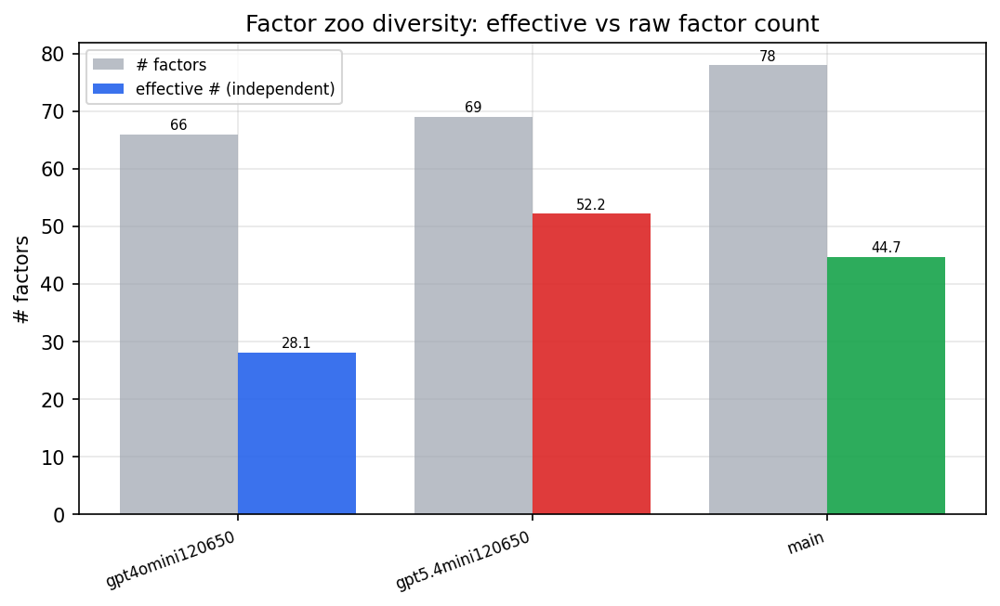

*Effective vs raw factor count per research model*

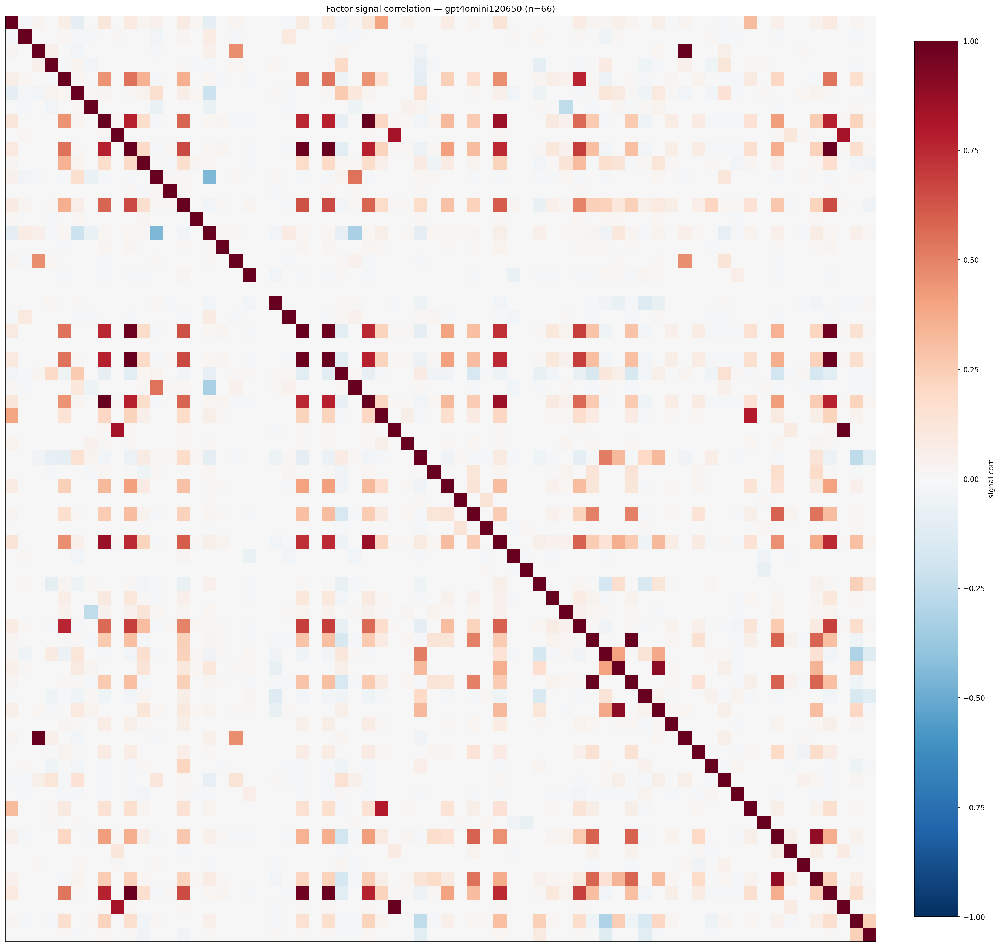

*Signal correlation matrix — gpt4omini120650*

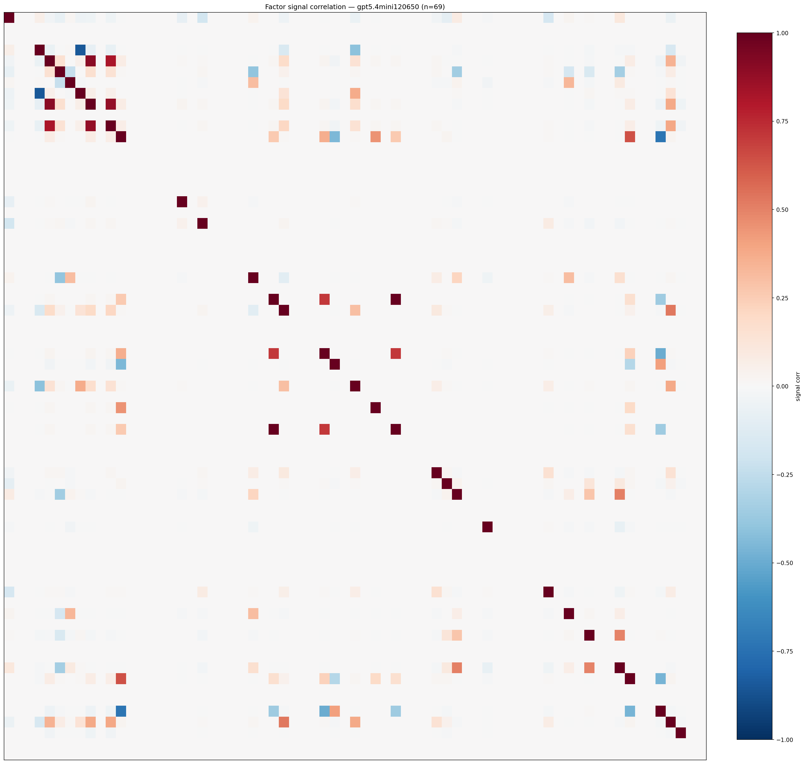

*Signal correlation matrix — gpt5.4mini120650*

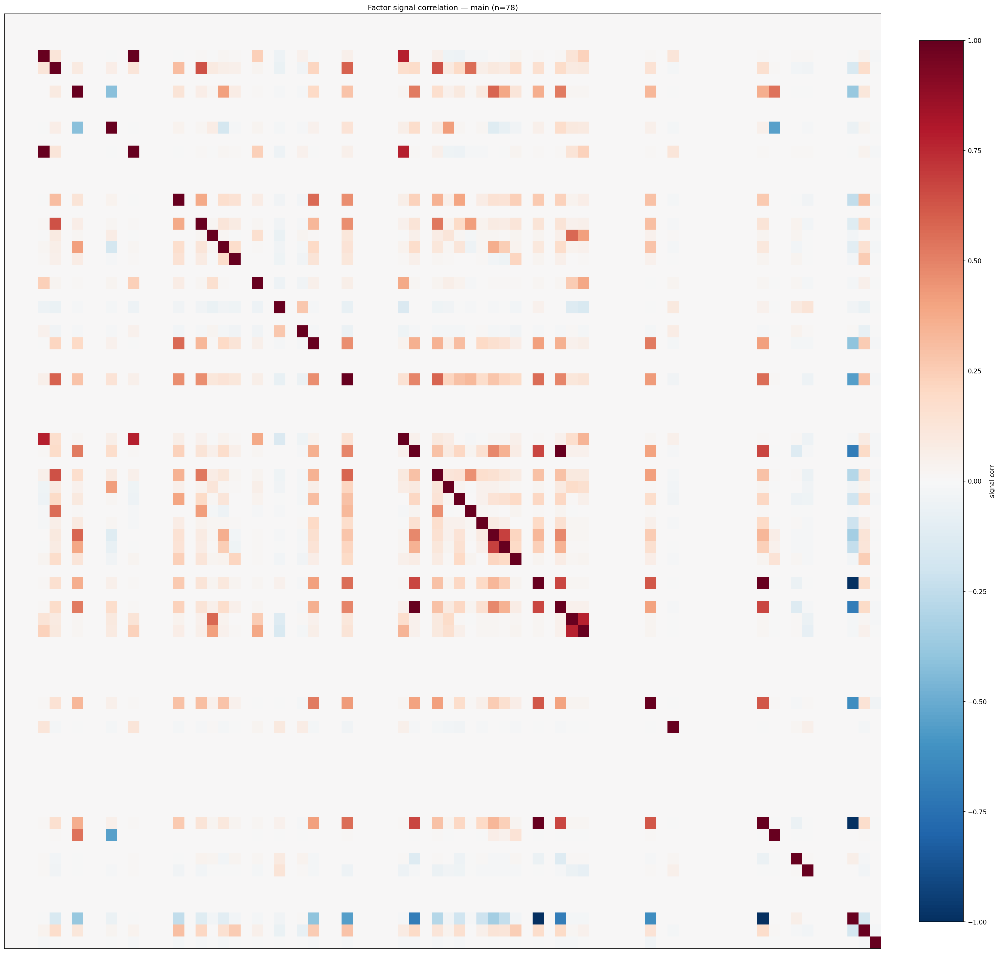

*Signal correlation matrix — main*

## 3. Deflation & model-based importance

`deflated_best_ic` haircuts each zoo's best |IC| for the number of factors tried (`ic_n_tested`) — a bigger zoo's best factor is more likely to be lucky. `lasso_n_nonzero` / `lasso_sparsity` show how many factors a sparse linear model actually keeps (model-view redundancy).

| prerun | best_ic | deflated_best_ic | deflated_best_t | ic_n_tested | ic_n_obs | lasso_n_nonzero | lasso_sparsity |
| --- | --- | --- | --- | --- | --- | --- | --- |
| gpt4omini120650 | 0.0248 | 0.0172 | 6.5881 | 64 | 146339 | 0 | 1.0 |
| gpt5.4mini120650 | 0.0232 | 0.0164 | 6.2552 | 31 | 146339 | 0 | 1.0 |
| main | 0.0299 | 0.0229 | 8.7461 | 38 | 146339 | 4 | 0.9487 |

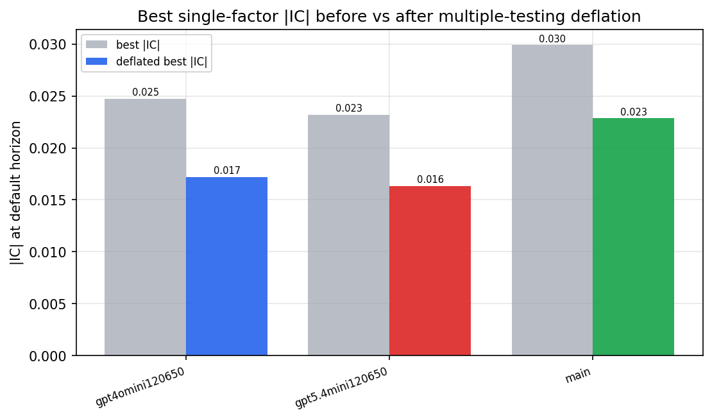

*Best |IC| before vs after multiple-testing deflation*

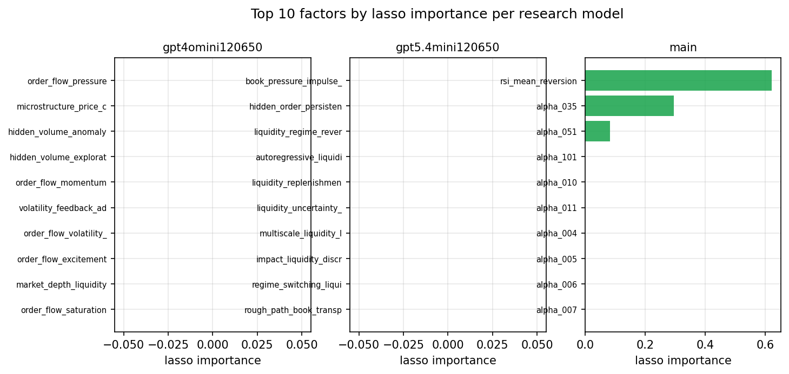

*Top factors by lasso importance per zoo*

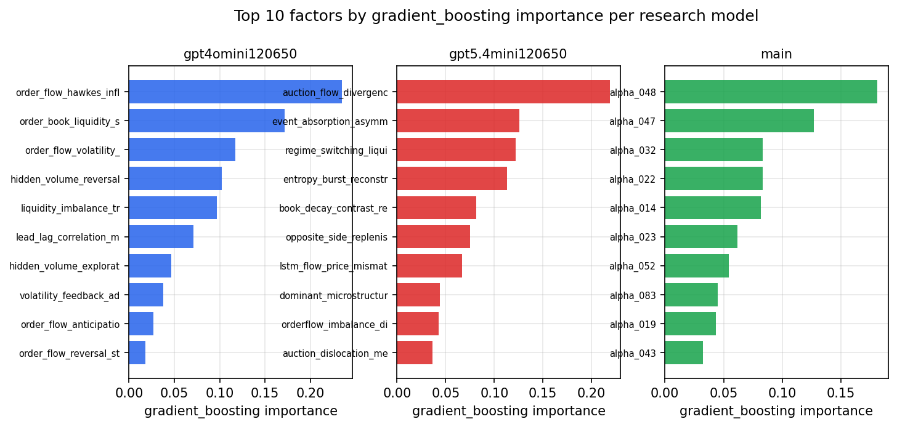

*Top factors by gradient_boosting importance per zoo*

## 4. ML-combined signal — per-underlying vectorised backtest

Each model combines a prerun's factors into ONE signal (fit `factors → forward return` on IS, predict per (bar, underlying)), then that combined signal is run through a simple vectorised backtest — `position(signal) × the underlying's own forward return` — on the held-out OOS tail (+ an equal-weight ensemble). No cross-sectional ranking.

> Config: position=**threshold** (t=1.0, z-score `expanding`), aggregation=**portfolio**, fit-standardise=**per_underlying**, horizon=6.

| prerun | model | n_factors_used | oos_ic | oos_sharpe | is_sharpe | oos_ann_return | oos_max_drawdown |
| --- | --- | --- | --- | --- | --- | --- | --- |
| gpt4omini120650 | linear_regression | 66 | 0.0062 | -1.8059 | 7.8786 | -0.0533 | -0.0106 |
| gpt4omini120650 | ridge | 66 | 0.0159 | 1.829 | 6.2155 | 0.0593 | -0.0081 |
| gpt4omini120650 | lasso | 66 | nan | nan | nan | nan | nan |
| gpt4omini120650 | elastic_net | 66 | nan | nan | nan | nan | nan |
| gpt4omini120650 | random_forest | 66 | -0.0025 | -3.084 | 10.0301 | -0.0883 | -0.0114 |
| gpt4omini120650 | gradient_boosting | 66 | -0.0119 | -1.2085 | 9.3047 | -0.0143 | -0.0037 |
| gpt4omini120650 | xgboost | 66 | 0.0003 | -5.5003 | 11.4382 | -0.1382 | -0.0128 |
| gpt4omini120650 | lightgbm | 66 | -0.0007 | -3.876 | 14.8326 | -0.078 | -0.0093 |
| gpt4omini120650 | ensemble | 66 | -0.0021 | -4.6755 | 12.1908 | -0.1053 | -0.0104 |
| gpt5.4mini120650 | linear_regression | 69 | 0.017 | 3.9258 | 5.6639 | 0.1362 | -0.0111 |
| gpt5.4mini120650 | ridge | 69 | 0.0187 | 4.5194 | 5.3746 | 0.156 | -0.0091 |
| gpt5.4mini120650 | lasso | 69 | nan | nan | nan | nan | nan |
| gpt5.4mini120650 | elastic_net | 69 | nan | nan | nan | nan | nan |
| gpt5.4mini120650 | random_forest | 69 | 0.0059 | 5.9063 | 10.8501 | 0.1106 | -0.0027 |
| gpt5.4mini120650 | gradient_boosting | 69 | 0.0069 | -1.9051 | 8.2178 | -0.013 | -0.0025 |
| gpt5.4mini120650 | xgboost | 69 | 0.0052 | 1.5474 | 11.5252 | 0.0222 | -0.0029 |
| gpt5.4mini120650 | lightgbm | 69 | 0.0063 | 0.6621 | 13.2393 | 0.0061 | -0.0022 |
| gpt5.4mini120650 | ensemble | 69 | 0.0188 | 4.3845 | 10.5886 | 0.0794 | -0.0027 |
| main | linear_regression | 78 | 0.0136 | 5.148 | 8.8092 | 0.1462 | -0.0053 |
| main | ridge | 78 | 0.0132 | 4.7649 | 7.879 | 0.1336 | -0.0049 |
| main | lasso | 78 | -0.0011 | 2.61 | 6.4157 | 0.0805 | -0.0076 |
| main | elastic_net | 78 | -0.0011 | 2.61 | 6.4157 | 0.0805 | -0.0076 |
| main | random_forest | 78 | 0.003 | -1.4782 | 10.2375 | -0.0283 | -0.0042 |
| main | gradient_boosting | 78 | -0.0002 | 3.7222 | 8.233 | 0.0316 | -0.0019 |
| main | xgboost | 78 | -0.0052 | 1.9774 | 9.9306 | 0.0269 | -0.0037 |
| main | lightgbm | 78 | -0.0087 | 0.2464 | 13.1336 | 0.0036 | -0.0037 |
| main | ensemble | 78 | 0.0031 | 3.5147 | 12.1497 | 0.0945 | -0.0061 |

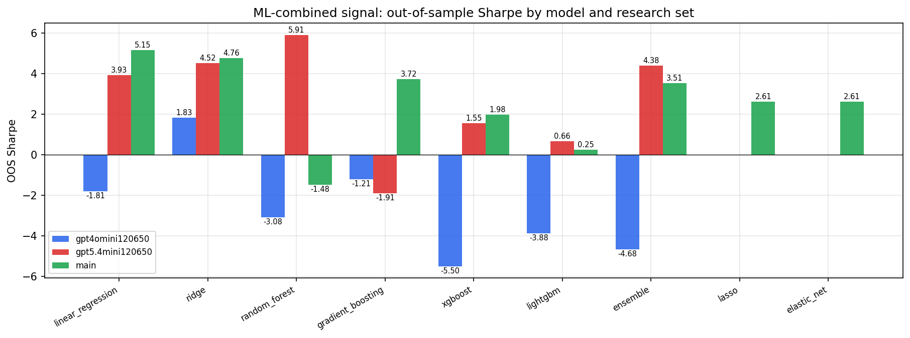

*ML-combined OOS Sharpe by model and research set*

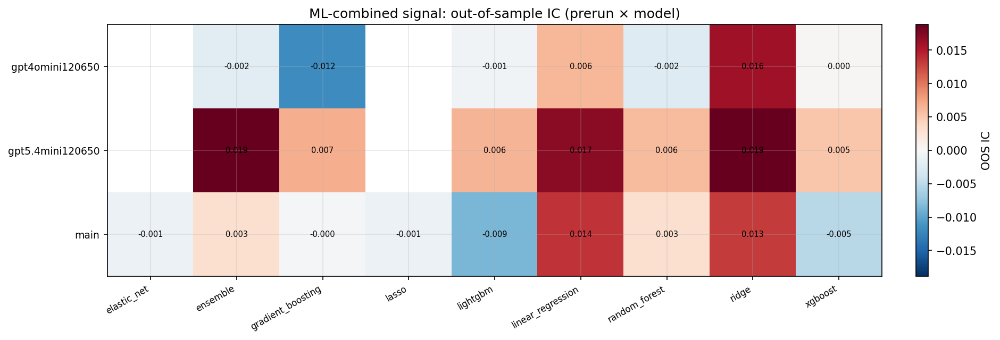

*ML-combined OOS IC (prerun × model)*

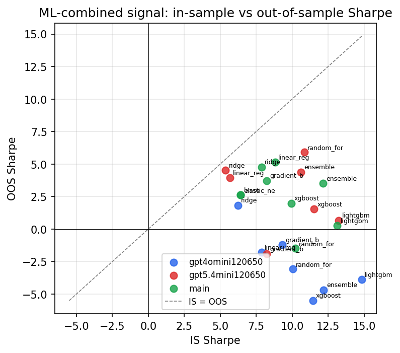

*IS vs OOS Sharpe (overfitting diagnostic)*

---
*Generated by `run_model_comparison.py`. Tables: `*.csv`; interactive: `comparison.ipynb`.*
