# Research-LLM factor comparison — `2025-09`

Comparing the **factor output of different research LLMs** on three axes (raw factor quality → factors as ML features → factors through the full agentic fund). The panel, IS/OOS split, horizon and model hyper-parameters are held identical across preruns — the *only* variable is the factor set.

## Preruns compared

| prerun | research_model | usable_factors | dropped_factors |
| --- | --- | --- | --- |
| gpt4omini120650 | gpt-4o-mini | 66 | 0 |
| gpt5.4mini120650 | gpt-5.4-mini | 69 | 0 |
| main | seed library | 78 | 10 |

> Dropped factors declare fields the current data doesn't have yet (e.g. fundamentals); they light up unchanged once that data is downloaded.

*Usable vs awaiting-data factors per research model*

## Key findings

- **Best ML-combined OOS Sharpe:** `gpt5.4mini120650` with `random_forest` (OOS Sharpe = 5.935).
- **Mean OOS Sharpe across models, by research set:** `gpt5.4mini120650` = 4.339, `main` = 1.985, `gpt4omini120650` = -4.017.
- **Highest mean single-factor |IC| (h=6):** `main` (mean |IC| = 0.0115).
- **Most diverse zoo (highest effective/raw factor ratio):** `gpt5.4mini120650` (eff 55.7 of 69, ratio 0.81).
- **Best selection-deflated single-factor |IC|:** `main` (deflated |IC| = 0.0182 from 38 factors tried).

## 1. Single-factor IC (raw factor quality)

Per-underlying time-series Spearman rank-IC of every researched factor, recomputed on the shared panel at horizons h=1, h=6, h=60. The per-underlying IC correlates each factor's value vector with the underlying's own forward-return vector (pooled across underlyings); the cross-sectional IC ranks across underlyings per timestamp.

| prerun | n_factors | mean_abs_ic_1 | mean_abs_ic_6 | mean_abs_ic_60 | mean_abs_icir_6 | best_factor_h6 | best_abs_ic_h6 |
| --- | --- | --- | --- | --- | --- | --- | --- |
| gpt4omini120650 | 66 | 0.0069 | 0.0078 | 0.0078 | 0.4532 | hidden_volume_reversal_strength | 0.0232 |
| gpt5.4mini120650 | 69 | 0.0053 | 0.007 | 0.0099 | 0.4409 | auction_dislocation_mean_reversion | 0.0207 |
| main | 78 | 0.0157 | 0.0115 | 0.0061 | 0.6945 | alpha_051 | 0.0252 |

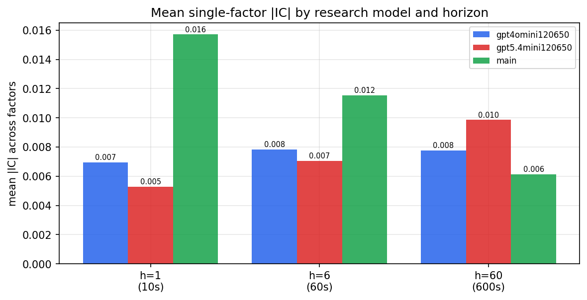

*Mean |IC| by research model and horizon*

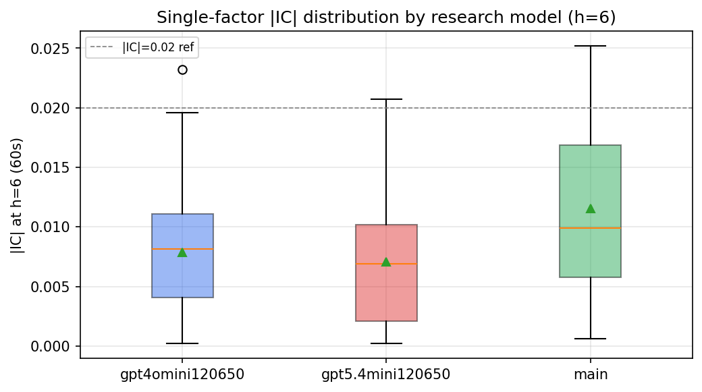

*Per-factor |IC| distribution by research model*

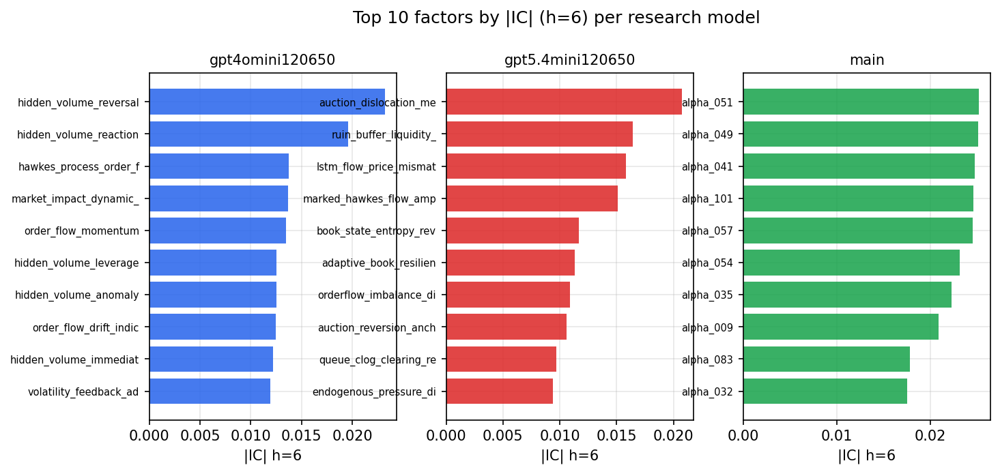

*Top factors by |IC| per research model*

## 2. Factor diversity & redundancy

Pairwise correlation of each zoo's *signals*. `eff_n_factors` is the effective number of independent factors (participation ratio of the correlation eigenvalues); `eff_ratio` and `redundancy` summarise how much unique information the zoo holds vs. how much is duplicated; `n_clusters` groups factors at |corr| ≥ 0.7.

| prerun | n_factors | eff_n_factors | eff_ratio | mean_abs_corr | n_clusters | redundancy |
| --- | --- | --- | --- | --- | --- | --- |
| gpt4omini120650 | 66 | 27.9886 | 0.4241 | 0.0496 | 50 | 0.5759 |
| gpt5.4mini120650 | 69 | 55.7075 | 0.8074 | 0.0098 | 65 | 0.1926 |
| main | 78 | 44.036 | 0.5646 | 0.0267 | 71 | 0.4354 |

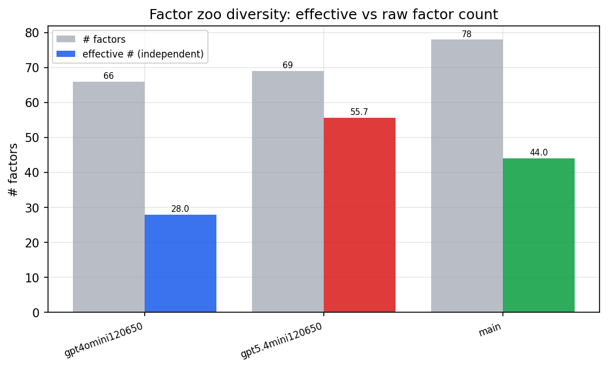

*Effective vs raw factor count per research model*

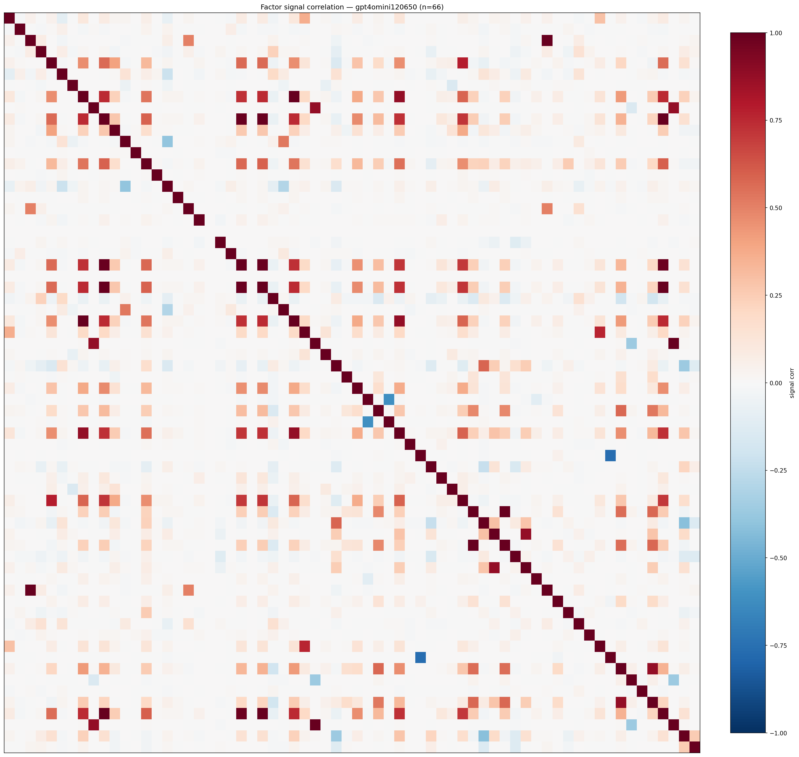

*Signal correlation matrix — gpt4omini120650*

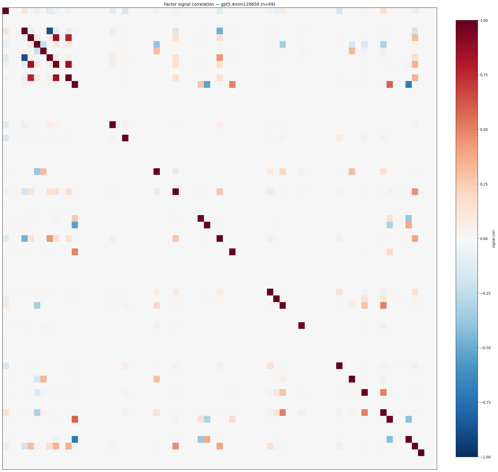

*Signal correlation matrix — gpt5.4mini120650*

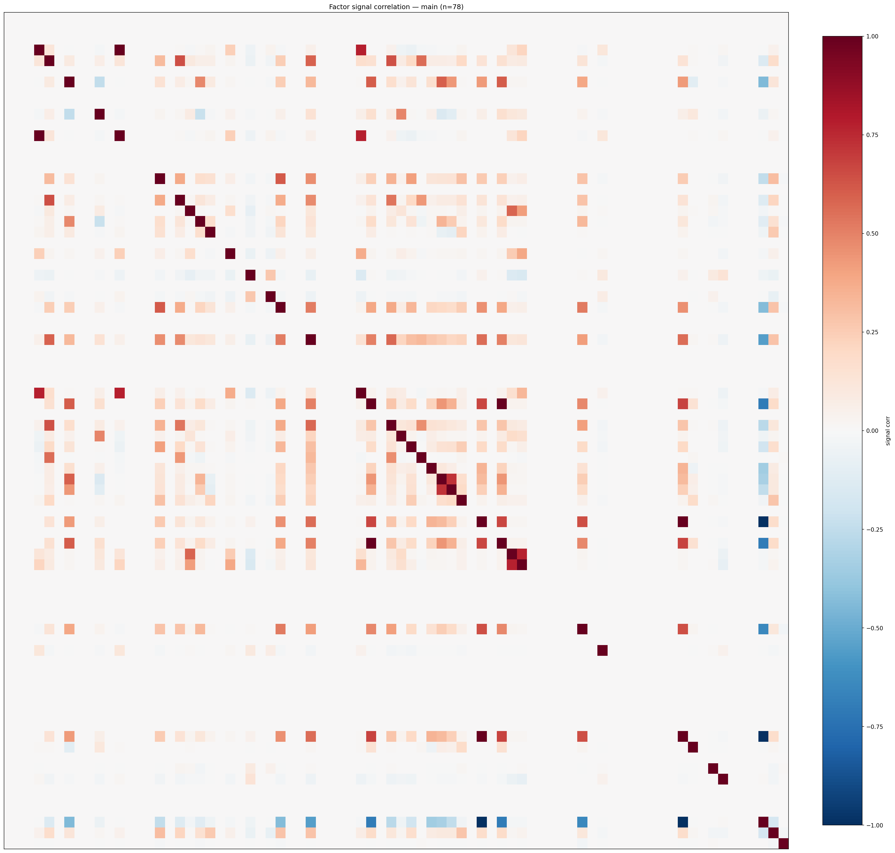

*Signal correlation matrix — main*

## 3. Deflation & model-based importance

`deflated_best_ic` haircuts each zoo's best |IC| for the number of factors tried (`ic_n_tested`) — a bigger zoo's best factor is more likely to be lucky. `lasso_n_nonzero` / `lasso_sparsity` show how many factors a sparse linear model actually keeps (model-view redundancy).

| prerun | best_ic | deflated_best_ic | deflated_best_t | ic_n_tested | ic_n_obs | lasso_n_nonzero | lasso_sparsity |
| --- | --- | --- | --- | --- | --- | --- | --- |
| gpt4omini120650 | 0.0232 | 0.0157 | 6.0697 | 64 | 148679 | 0 | 1.0 |
| gpt5.4mini120650 | 0.0207 | 0.0139 | 5.3757 | 31 | 148679 | 2 | 0.971 |
| main | 0.0252 | 0.0182 | 7.0103 | 38 | 148679 | 1 | 0.9872 |

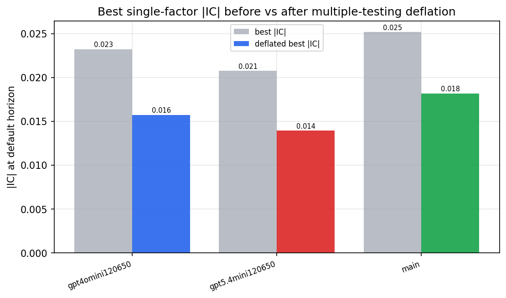

*Best |IC| before vs after multiple-testing deflation*

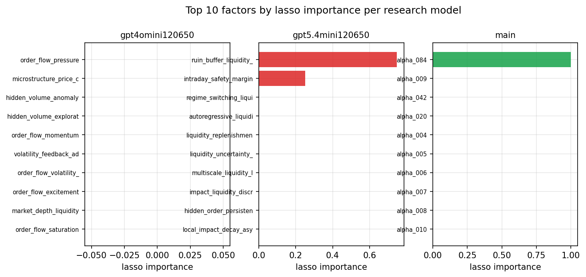

*Top factors by lasso importance per zoo*

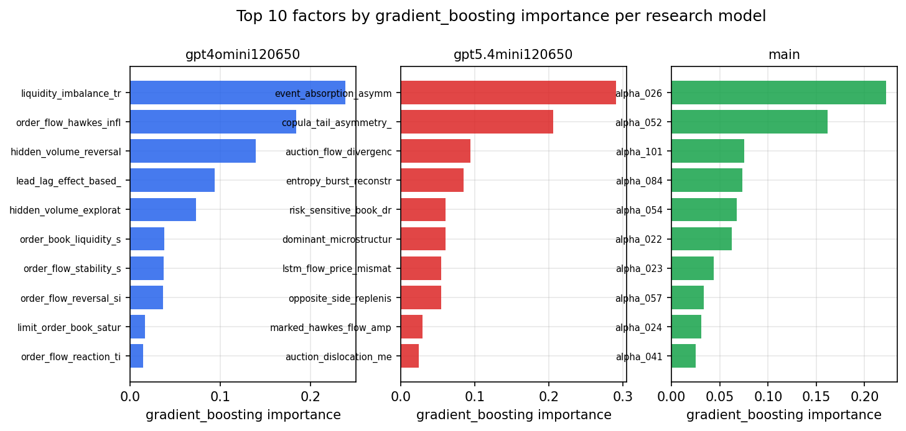

*Top factors by gradient_boosting importance per zoo*

## 4. ML-combined signal — per-underlying vectorised backtest

Each model combines a prerun's factors into ONE signal (fit `factors → forward return` on IS, predict per (bar, underlying)), then that combined signal is run through a simple vectorised backtest — `position(signal) × the underlying's own forward return` — on the held-out OOS tail (+ an equal-weight ensemble). No cross-sectional ranking.

> Config: position=**threshold** (t=1.0, z-score `expanding`), aggregation=**portfolio**, fit-standardise=**per_underlying**, horizon=6.

| prerun | model | n_factors_used | oos_ic | oos_sharpe | is_sharpe | oos_ann_return | oos_max_drawdown |
| --- | --- | --- | --- | --- | --- | --- | --- |
| gpt4omini120650 | linear_regression | 66 | -0.0182 | -1.6544 | 8.887 | -0.1138 | -0.0253 |
| gpt4omini120650 | ridge | 66 | -0.0174 | -1.1349 | 9.24 | -0.0782 | -0.023 |
| gpt4omini120650 | lasso | 66 | nan | nan | nan | nan | nan |
| gpt4omini120650 | elastic_net | 66 | nan | nan | nan | nan | nan |
| gpt4omini120650 | random_forest | 66 | -0.0083 | -1.9614 | 12.6304 | -0.1649 | -0.0325 |
| gpt4omini120650 | gradient_boosting | 66 | -0.0017 | -6.5835 | 11.3437 | -0.3027 | -0.0262 |
| gpt4omini120650 | xgboost | 66 | -0.0086 | -4.7847 | 14.9349 | -0.2464 | -0.0219 |
| gpt4omini120650 | lightgbm | 66 | -0.0031 | -6.4662 | 18.1846 | -0.4735 | -0.0406 |
| gpt4omini120650 | ensemble | 66 | -0.0133 | -5.5334 | 15.2893 | -0.4204 | -0.0412 |
| gpt5.4mini120650 | linear_regression | 69 | -0.0042 | 3.0727 | 7.0344 | 0.2636 | -0.0191 |
| gpt5.4mini120650 | ridge | 69 | -0.0046 | 3.1224 | 6.556 | 0.2765 | -0.0193 |
| gpt5.4mini120650 | lasso | 69 | nan | nan | nan | nan | nan |
| gpt5.4mini120650 | elastic_net | 69 | nan | nan | nan | nan | nan |
| gpt5.4mini120650 | random_forest | 69 | -0.0079 | 5.9354 | 10.0608 | 0.4846 | -0.0105 |
| gpt5.4mini120650 | gradient_boosting | 69 | -0.0078 | 4.4285 | 8.9088 | 0.1403 | -0.0035 |
| gpt5.4mini120650 | xgboost | 69 | -0.0053 | 4.5022 | 12.0674 | 0.1791 | -0.006 |
| gpt5.4mini120650 | lightgbm | 69 | 0.0055 | 4.8905 | 15.7496 | 0.1677 | -0.0054 |
| gpt5.4mini120650 | ensemble | 69 | -0.0058 | 4.4221 | 12.3671 | 0.3958 | -0.0174 |
| main | linear_regression | 78 | -0.0136 | 0.615 | 10.363 | 0.0389 | -0.0337 |
| main | ridge | 78 | -0.009 | 0.508 | 10.9204 | 0.0298 | -0.0322 |
| main | lasso | 78 | nan | nan | nan | nan | nan |
| main | elastic_net | 78 | nan | nan | nan | nan | nan |
| main | random_forest | 78 | 0.0028 | 5.0296 | 14.2435 | 0.3283 | -0.017 |
| main | gradient_boosting | 78 | 0.0083 | 2.9105 | 13.6251 | 0.1477 | -0.0189 |
| main | xgboost | 78 | -0.0088 | 0.9611 | 16.1141 | 0.0466 | -0.0181 |
| main | lightgbm | 78 | -0.0021 | 1.8256 | 18.4724 | 0.0982 | -0.0151 |
| main | ensemble | 78 | -0.0077 | 2.0427 | 15.7465 | 0.1316 | -0.0241 |

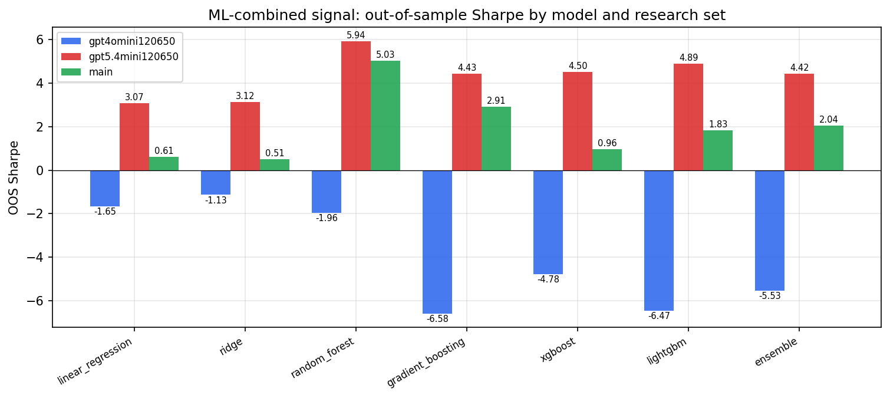

*ML-combined OOS Sharpe by model and research set*

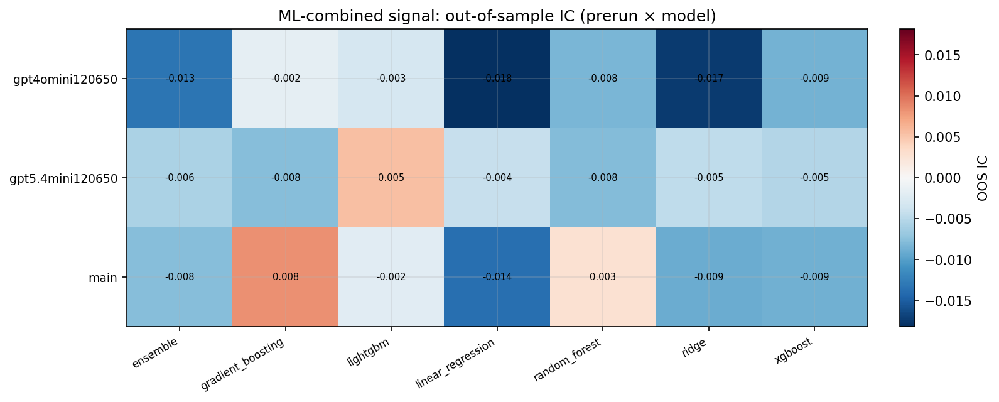

*ML-combined OOS IC (prerun × model)*

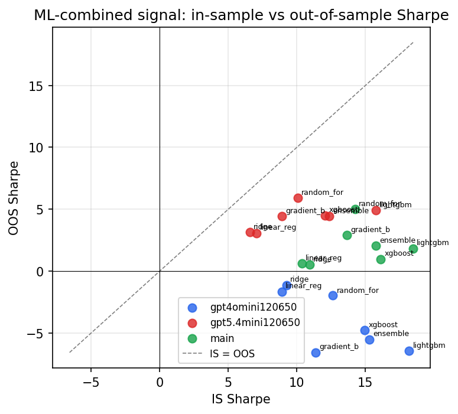

*IS vs OOS Sharpe (overfitting diagnostic)*

---
*Generated by `run_model_comparison.py`. Tables: `*.csv`; interactive: `comparison.ipynb`.*
