# Research-LLM factor comparison — `2025-10`

Comparing the **factor output of different research LLMs** on three axes (raw factor quality → factors as ML features → factors through the full agentic fund). The panel, IS/OOS split, horizon and model hyper-parameters are held identical across preruns — the *only* variable is the factor set.

## Preruns compared

| prerun | research_model | usable_factors | dropped_factors |
| --- | --- | --- | --- |
| gpt4omini120650 | gpt-4o-mini | 66 | 0 |
| gpt5.4mini120650 | gpt-5.4-mini | 69 | 0 |
| main | seed library | 78 | 10 |

> Dropped factors declare fields the current data doesn't have yet (e.g. fundamentals); they light up unchanged once that data is downloaded.

*Usable vs awaiting-data factors per research model*

## Key findings

- **Best ML-combined OOS Sharpe:** `main` with `ensemble` (OOS Sharpe = 7.994).
- **Mean OOS Sharpe across models, by research set:** `gpt5.4mini120650` = 4.275, `main` = 4.097, `gpt4omini120650` = 0.649.
- **Highest mean single-factor |IC| (h=6):** `main` (mean |IC| = 0.0081).
- **Most diverse zoo (highest effective/raw factor ratio):** `gpt5.4mini120650` (eff 54.5 of 69, ratio 0.79).
- **Best selection-deflated single-factor |IC|:** `main` (deflated |IC| = 0.0104 from 38 factors tried).

## 1. Single-factor IC (raw factor quality)

Per-underlying time-series Spearman rank-IC of every researched factor, recomputed on the shared panel at horizons h=1, h=6, h=60. The per-underlying IC correlates each factor's value vector with the underlying's own forward-return vector (pooled across underlyings); the cross-sectional IC ranks across underlyings per timestamp.

| prerun | n_factors | mean_abs_ic_1 | mean_abs_ic_6 | mean_abs_ic_60 | mean_abs_icir_6 | best_factor_h6 | best_abs_ic_h6 |
| --- | --- | --- | --- | --- | --- | --- | --- |
| gpt4omini120650 | 66 | 0.0044 | 0.0051 | 0.0089 | 0.3143 | hidden_volume_reversal_strength | 0.0167 |
| gpt5.4mini120650 | 69 | 0.0043 | 0.0062 | 0.0132 | 0.2884 | auction_dislocation_mean_reversion | 0.015 |
| main | 78 | 0.0087 | 0.0081 | 0.0061 | 0.6081 | alpha_059 | 0.0173 |

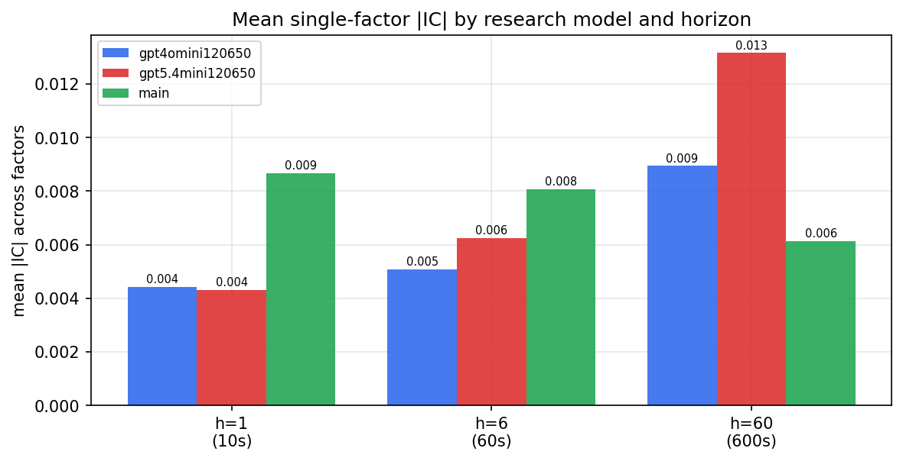

*Mean |IC| by research model and horizon*

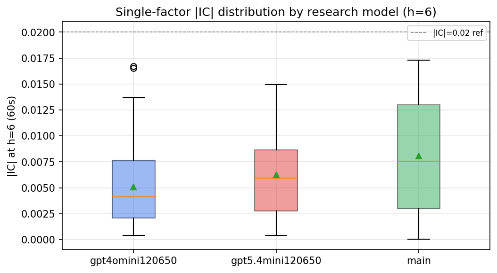

*Per-factor |IC| distribution by research model*

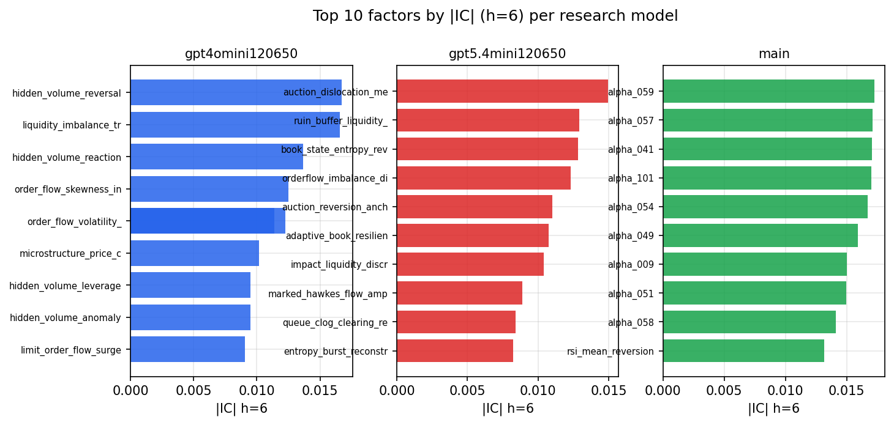

*Top factors by |IC| per research model*

## 2. Factor diversity & redundancy

Pairwise correlation of each zoo's *signals*. `eff_n_factors` is the effective number of independent factors (participation ratio of the correlation eigenvalues); `eff_ratio` and `redundancy` summarise how much unique information the zoo holds vs. how much is duplicated; `n_clusters` groups factors at |corr| ≥ 0.7.

| prerun | n_factors | eff_n_factors | eff_ratio | mean_abs_corr | n_clusters | redundancy |
| --- | --- | --- | --- | --- | --- | --- |
| gpt4omini120650 | 66 | 28.5467 | 0.4325 | 0.0494 | 52 | 0.5675 |
| gpt5.4mini120650 | 69 | 54.5401 | 0.7904 | 0.0104 | 66 | 0.2096 |
| main | 78 | 45.3568 | 0.5815 | 0.0259 | 72 | 0.4185 |

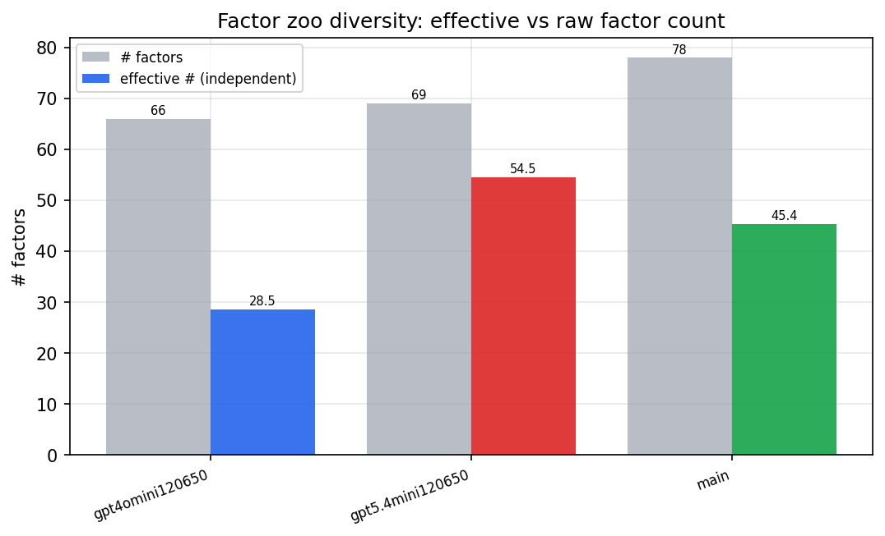

*Effective vs raw factor count per research model*

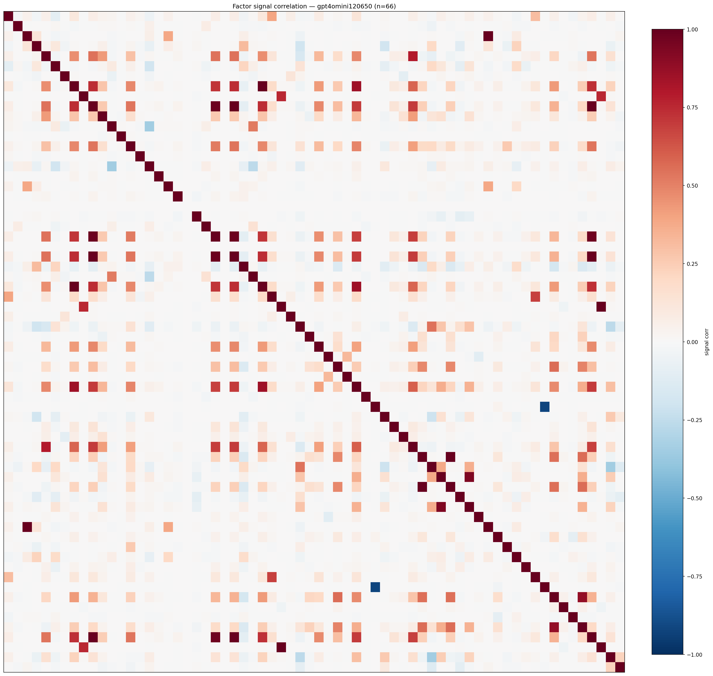

*Signal correlation matrix — gpt4omini120650*

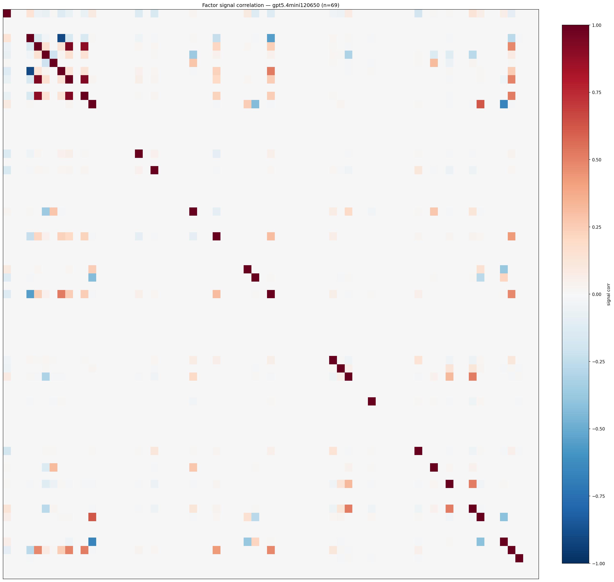

*Signal correlation matrix — gpt5.4mini120650*

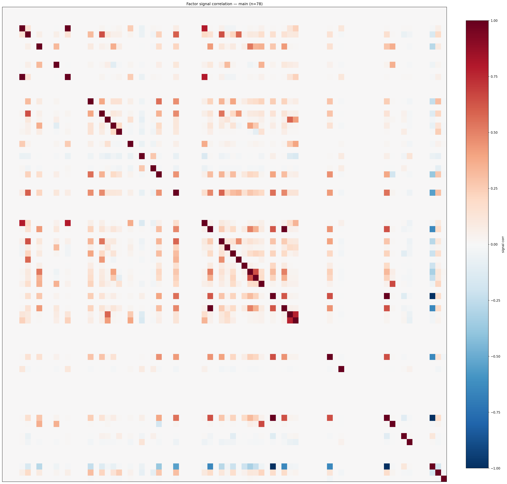

*Signal correlation matrix — main*

## 3. Deflation & model-based importance

`deflated_best_ic` haircuts each zoo's best |IC| for the number of factors tried (`ic_n_tested`) — a bigger zoo's best factor is more likely to be lucky. `lasso_n_nonzero` / `lasso_sparsity` show how many factors a sparse linear model actually keeps (model-view redundancy).

| prerun | best_ic | deflated_best_ic | deflated_best_t | ic_n_tested | ic_n_obs | lasso_n_nonzero | lasso_sparsity |
| --- | --- | --- | --- | --- | --- | --- | --- |
| gpt4omini120650 | 0.0167 | 0.0093 | 3.6398 | 64 | 152099 | 0 | 1.0 |
| gpt5.4mini120650 | 0.015 | 0.0082 | 3.213 | 31 | 152099 | 0 | 1.0 |
| main | 0.0173 | 0.0104 | 4.0412 | 38 | 152099 | 18 | 0.7692 |

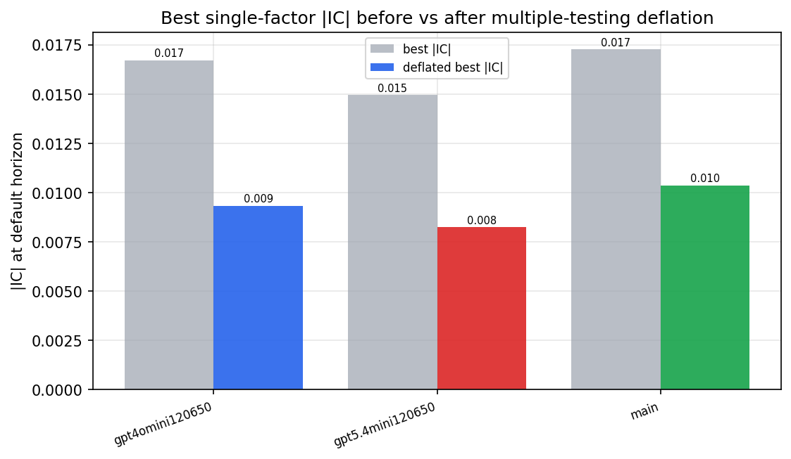

*Best |IC| before vs after multiple-testing deflation*

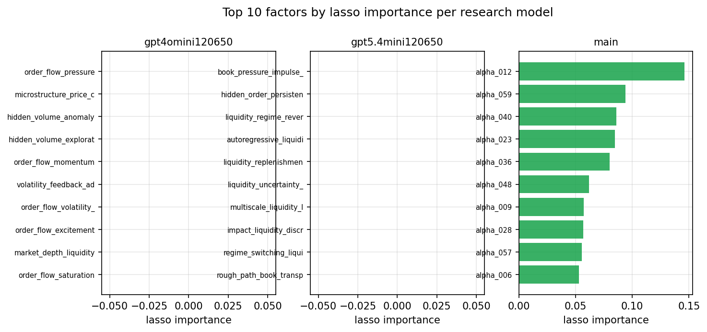

*Top factors by lasso importance per zoo*

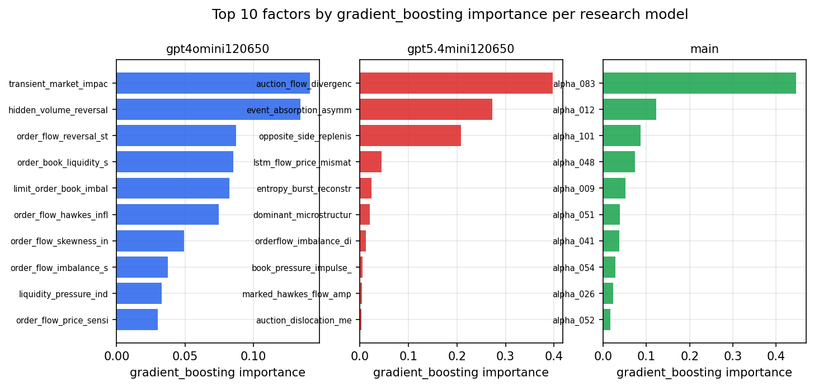

*Top factors by gradient_boosting importance per zoo*

## 4. ML-combined signal — per-underlying vectorised backtest

Each model combines a prerun's factors into ONE signal (fit `factors → forward return` on IS, predict per (bar, underlying)), then that combined signal is run through a simple vectorised backtest — `position(signal) × the underlying's own forward return` — on the held-out OOS tail (+ an equal-weight ensemble). No cross-sectional ranking.

> Config: position=**threshold** (t=1.0, z-score `expanding`), aggregation=**portfolio**, fit-standardise=**per_underlying**, horizon=6.

| prerun | model | n_factors_used | oos_ic | oos_sharpe | is_sharpe | oos_ann_return | oos_max_drawdown |
| --- | --- | --- | --- | --- | --- | --- | --- |
| gpt4omini120650 | linear_regression | 66 | -0.0013 | 0.3113 | 8.5532 | 0.0456 | -0.0581 |
| gpt4omini120650 | ridge | 66 | -0.0017 | -0.0872 | 8.5294 | -0.0127 | -0.0581 |
| gpt4omini120650 | lasso | 66 | nan | nan | nan | nan | nan |
| gpt4omini120650 | elastic_net | 66 | -0.0058 | 0.181 | 8.6242 | 0.025 | -0.0555 |
| gpt4omini120650 | random_forest | 66 | 0.0015 | 0.5869 | 10.9015 | 0.1196 | -0.0711 |
| gpt4omini120650 | gradient_boosting | 66 | -0.0001 | 0.8008 | 12.291 | 0.0708 | -0.0244 |
| gpt4omini120650 | xgboost | 66 | 0.0084 | 2.0342 | 15.5972 | 0.2871 | -0.0435 |
| gpt4omini120650 | lightgbm | 66 | 0.0096 | 1.0309 | 21.8289 | 0.1035 | -0.0301 |
| gpt4omini120650 | ensemble | 66 | -0.0036 | 0.336 | 11.0418 | 0.0429 | -0.0452 |
| gpt5.4mini120650 | linear_regression | 69 | 0.0053 | 5.2483 | 7.1043 | 0.7003 | -0.0369 |
| gpt5.4mini120650 | ridge | 69 | 0.0055 | 4.738 | 7.2691 | 0.745 | -0.0448 |
| gpt5.4mini120650 | lasso | 69 | 0.004 | 7.4905 | 7.1817 | 1.0413 | -0.0262 |
| gpt5.4mini120650 | elastic_net | 69 | 0.004 | 7.4905 | 7.1817 | 1.0413 | -0.0262 |
| gpt5.4mini120650 | random_forest | 69 | 0.0073 | 1.9616 | 12.304 | 0.2793 | -0.0347 |
| gpt5.4mini120650 | gradient_boosting | 69 | 0.0079 | 0.6443 | 8.6984 | 0.0129 | -0.0059 |
| gpt5.4mini120650 | xgboost | 69 | 0.0055 | 2.4447 | 16.2819 | 0.261 | -0.0248 |
| gpt5.4mini120650 | lightgbm | 69 | 0.0038 | 3.261 | 21.6748 | 0.3372 | -0.0209 |
| gpt5.4mini120650 | ensemble | 69 | 0.0055 | 5.1974 | 14.093 | 0.7864 | -0.0232 |
| main | linear_regression | 78 | -0.0012 | 2.1269 | 13.9101 | 0.1353 | -0.014 |
| main | ridge | 78 | -0.0017 | 0.7131 | 12.6725 | 0.0354 | -0.0131 |
| main | lasso | 78 | nan | nan | nan | nan | nan |
| main | elastic_net | 78 | nan | nan | nan | nan | nan |
| main | random_forest | 78 | 0.0134 | 7.821 | 17.5705 | 0.8634 | -0.0142 |
| main | gradient_boosting | 78 | 0.0083 | 0.8473 | 14.1062 | 0.1235 | -0.0503 |
| main | xgboost | 78 | 0.0084 | 4.3366 | 17.8851 | 0.2193 | -0.006 |
| main | lightgbm | 78 | 0.0192 | 4.8412 | 23.3924 | 0.5809 | -0.0138 |
| main | ensemble | 78 | 0.0098 | 7.994 | 21.1786 | 0.8409 | -0.0124 |

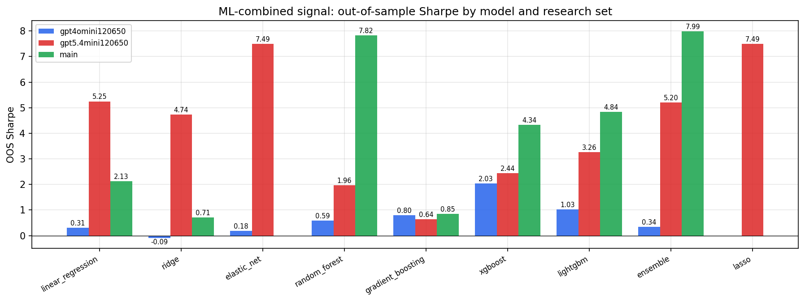

*ML-combined OOS Sharpe by model and research set*

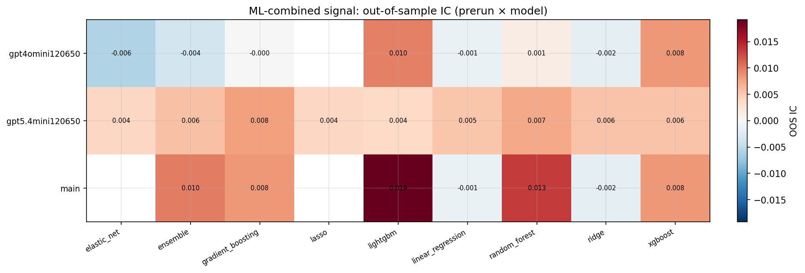

*ML-combined OOS IC (prerun × model)*

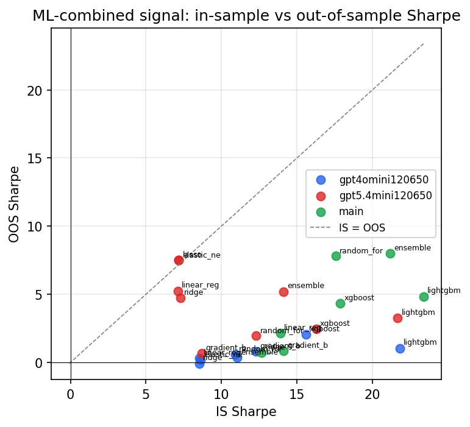

*IS vs OOS Sharpe (overfitting diagnostic)*

---
*Generated by `run_model_comparison.py`. Tables: `*.csv`; interactive: `comparison.ipynb`.*
