# Research-LLM factor comparison — `2025-11`

Comparing the **factor output of different research LLMs** on three axes (raw factor quality → factors as ML features → factors through the full agentic fund). The panel, IS/OOS split, horizon and model hyper-parameters are held identical across preruns — the *only* variable is the factor set.

## Preruns compared

| prerun | research_model | usable_factors | dropped_factors |
| --- | --- | --- | --- |
| gpt4omini120650 | gpt-4o-mini | 66 | 0 |
| gpt5.4mini120650 | gpt-5.4-mini | 69 | 0 |
| main | seed library | 78 | 10 |

> Dropped factors declare fields the current data doesn't have yet (e.g. fundamentals); they light up unchanged once that data is downloaded.

*Usable vs awaiting-data factors per research model*

## Key findings

- **Best ML-combined OOS Sharpe:** `gpt4omini120650` with `ensemble` (OOS Sharpe = 5.758).
- **Mean OOS Sharpe across models, by research set:** `gpt4omini120650` = 4.234, `gpt5.4mini120650` = -0.196, `main` = -0.599.
- **Highest mean single-factor |IC| (h=6):** `main` (mean |IC| = 0.0077).
- **Most diverse zoo (highest effective/raw factor ratio):** `gpt5.4mini120650` (eff 50.4 of 69, ratio 0.73).
- **Best selection-deflated single-factor |IC|:** `gpt4omini120650` (deflated |IC| = 0.0109 from 64 factors tried).

## 1. Single-factor IC (raw factor quality)

Per-underlying time-series Spearman rank-IC of every researched factor, recomputed on the shared panel at horizons h=1, h=6, h=60. The per-underlying IC correlates each factor's value vector with the underlying's own forward-return vector (pooled across underlyings); the cross-sectional IC ranks across underlyings per timestamp.

| prerun | n_factors | mean_abs_ic_1 | mean_abs_ic_6 | mean_abs_ic_60 | mean_abs_icir_6 | best_factor_h6 | best_abs_ic_h6 |
| --- | --- | --- | --- | --- | --- | --- | --- |
| gpt4omini120650 | 66 | 0.0032 | 0.0054 | 0.0067 | 0.2802 | liquidity_imbalance_trend | 0.0184 |
| gpt5.4mini120650 | 69 | 0.0046 | 0.0063 | 0.0123 | 0.3542 | orderflow_imbalance_divergence | 0.0173 |
| main | 78 | 0.0074 | 0.0077 | 0.0073 | 0.5095 | alpha_057 | 0.016 |

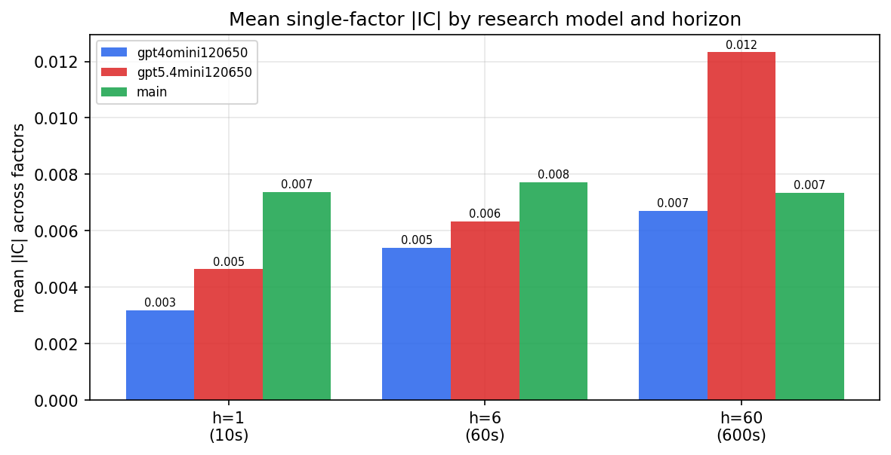

*Mean |IC| by research model and horizon*

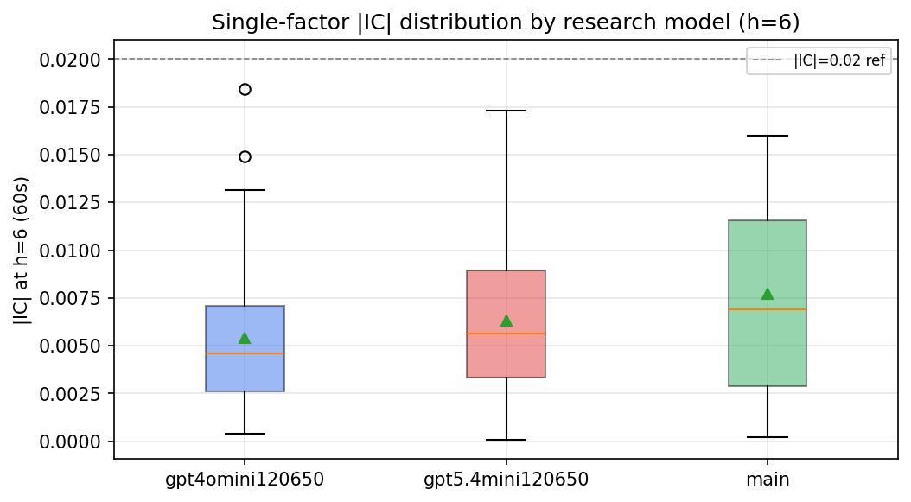

*Per-factor |IC| distribution by research model*

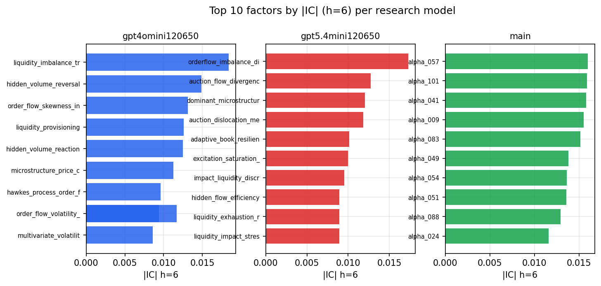

*Top factors by |IC| per research model*

## 2. Factor diversity & redundancy

Pairwise correlation of each zoo's *signals*. `eff_n_factors` is the effective number of independent factors (participation ratio of the correlation eigenvalues); `eff_ratio` and `redundancy` summarise how much unique information the zoo holds vs. how much is duplicated; `n_clusters` groups factors at |corr| ≥ 0.7.

| prerun | n_factors | eff_n_factors | eff_ratio | mean_abs_corr | n_clusters | redundancy |
| --- | --- | --- | --- | --- | --- | --- |
| gpt4omini120650 | 66 | 27.5193 | 0.417 | 0.051 | 52 | 0.583 |
| gpt5.4mini120650 | 69 | 50.4381 | 0.731 | 0.0127 | 63 | 0.269 |
| main | 78 | 44.1639 | 0.5662 | 0.0268 | 72 | 0.4338 |

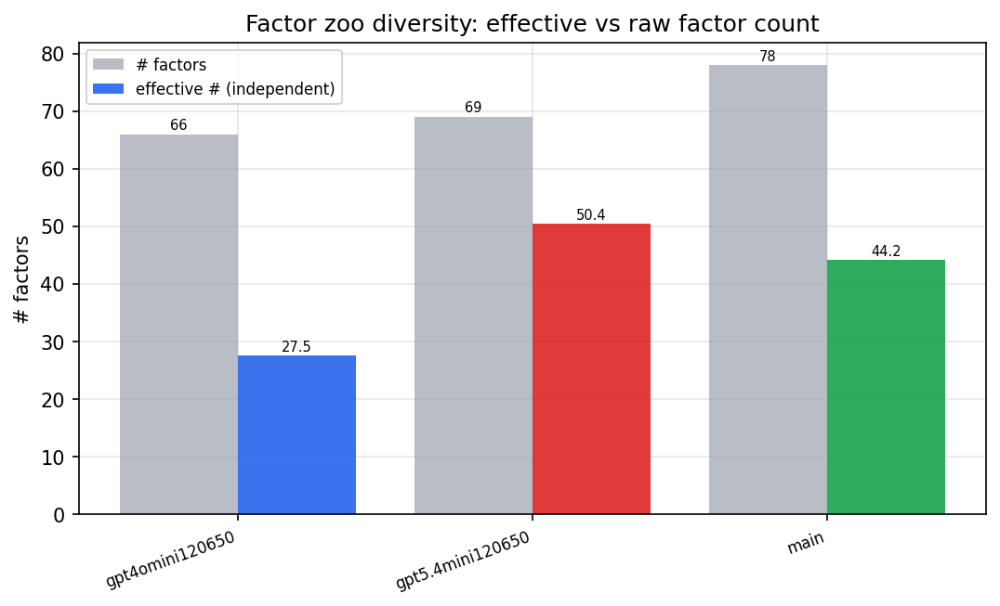

*Effective vs raw factor count per research model*

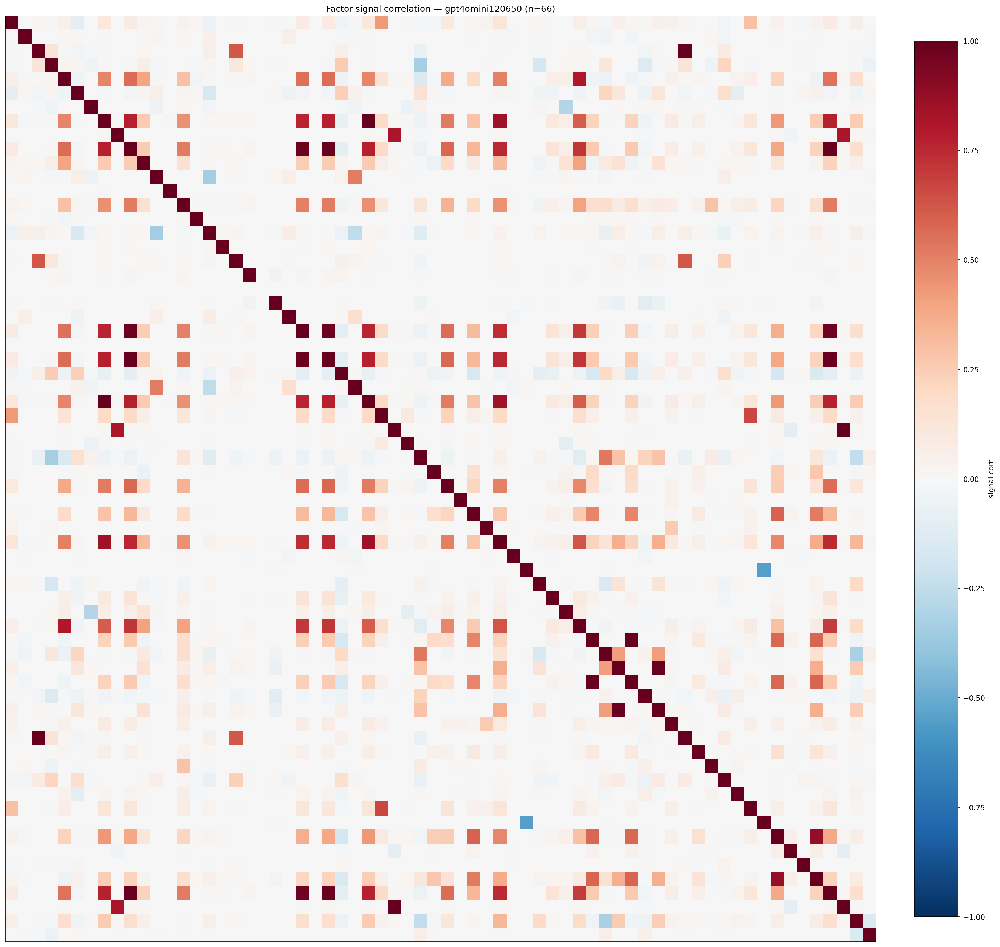

*Signal correlation matrix — gpt4omini120650*

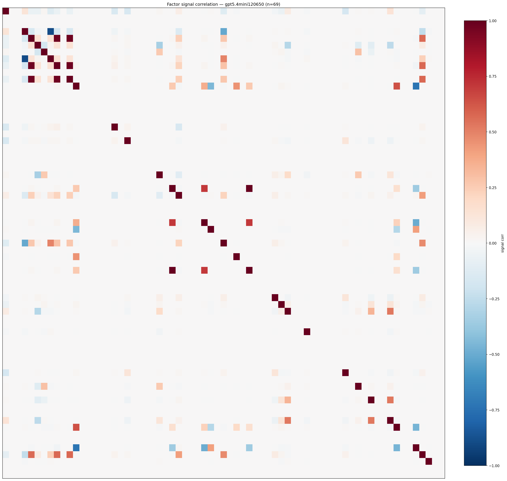

*Signal correlation matrix — gpt5.4mini120650*

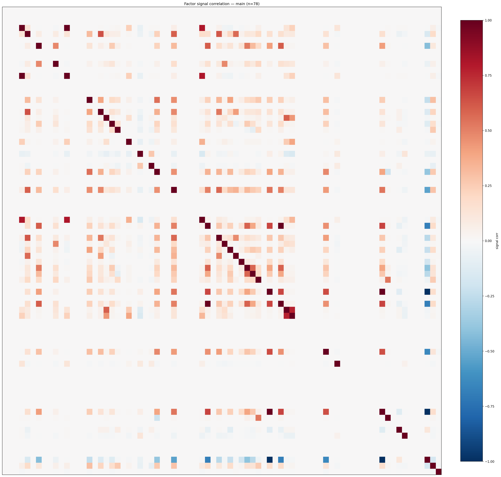

*Signal correlation matrix — main*

## 3. Deflation & model-based importance

`deflated_best_ic` haircuts each zoo's best |IC| for the number of factors tried (`ic_n_tested`) — a bigger zoo's best factor is more likely to be lucky. `lasso_n_nonzero` / `lasso_sparsity` show how many factors a sparse linear model actually keeps (model-view redundancy).

| prerun | best_ic | deflated_best_ic | deflated_best_t | ic_n_tested | ic_n_obs | lasso_n_nonzero | lasso_sparsity |
| --- | --- | --- | --- | --- | --- | --- | --- |
| gpt4omini120650 | 0.0184 | 0.0109 | 4.1613 | 64 | 146339 | 0 | 1.0 |
| gpt5.4mini120650 | 0.0173 | 0.0104 | 3.9928 | 31 | 146339 | 0 | 1.0 |
| main | 0.016 | 0.0089 | 3.4153 | 38 | 146339 | 0 | 1.0 |

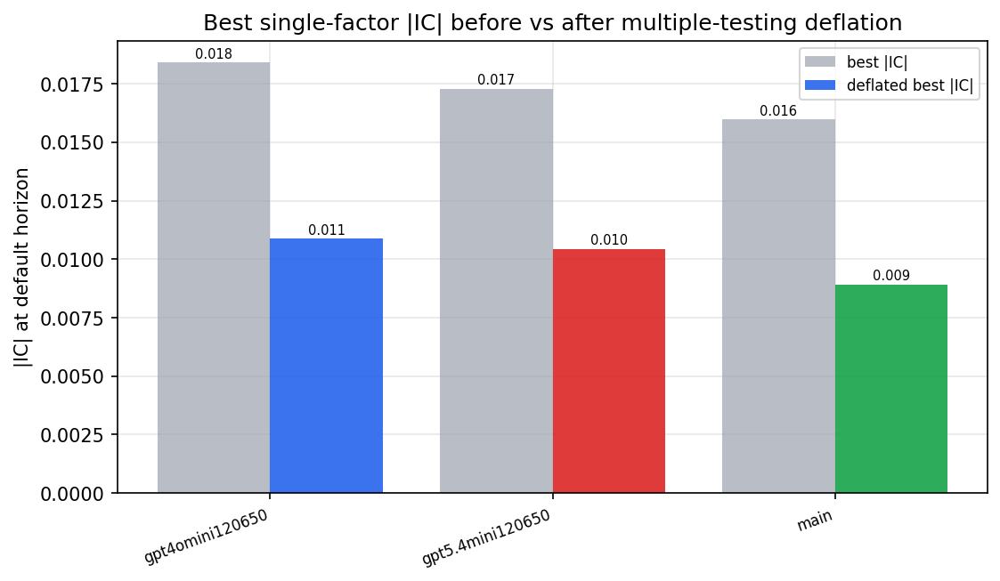

*Best |IC| before vs after multiple-testing deflation*

*Top factors by lasso importance per zoo*

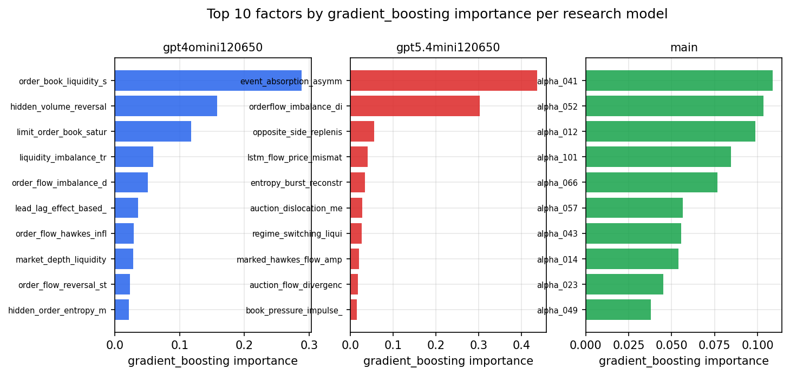

*Top factors by gradient_boosting importance per zoo*

## 4. ML-combined signal — per-underlying vectorised backtest

Each model combines a prerun's factors into ONE signal (fit `factors → forward return` on IS, predict per (bar, underlying)), then that combined signal is run through a simple vectorised backtest — `position(signal) × the underlying's own forward return` — on the held-out OOS tail (+ an equal-weight ensemble). No cross-sectional ranking.

> Config: position=**threshold** (t=1.0, z-score `expanding`), aggregation=**portfolio**, fit-standardise=**per_underlying**, horizon=6.

| prerun | model | n_factors_used | oos_ic | oos_sharpe | is_sharpe | oos_ann_return | oos_max_drawdown |
| --- | --- | --- | --- | --- | --- | --- | --- |
| gpt4omini120650 | linear_regression | 66 | 0.0079 | 5.5624 | 8.8319 | 0.2688 | -0.0094 |
| gpt4omini120650 | ridge | 66 | 0.0057 | 5.5503 | 8.2189 | 0.434 | -0.0094 |
| gpt4omini120650 | lasso | 66 | nan | nan | nan | nan | nan |
| gpt4omini120650 | elastic_net | 66 | nan | nan | nan | nan | nan |
| gpt4omini120650 | random_forest | 66 | 0.0126 | 5.1222 | 11.3297 | 0.2307 | -0.0125 |
| gpt4omini120650 | gradient_boosting | 66 | 0.009 | 0.2436 | 6.7471 | 0.0021 | -0.0017 |
| gpt4omini120650 | xgboost | 66 | 0.0171 | 1.8747 | 11.307 | 0.0488 | -0.0064 |
| gpt4omini120650 | lightgbm | 66 | 0.0057 | 5.5273 | 17.3554 | 0.3644 | -0.0096 |
| gpt4omini120650 | ensemble | 66 | 0.0066 | 5.7577 | 11.4125 | 0.2377 | -0.0069 |
| gpt5.4mini120650 | linear_regression | 69 | 0.0138 | 1.0935 | 6.8191 | 0.145 | -0.0312 |
| gpt5.4mini120650 | ridge | 69 | 0.0142 | 0.6949 | 6.6232 | 0.0914 | -0.032 |
| gpt5.4mini120650 | lasso | 69 | nan | nan | nan | nan | nan |
| gpt5.4mini120650 | elastic_net | 69 | nan | nan | nan | nan | nan |
| gpt5.4mini120650 | random_forest | 69 | 0.0151 | -1.2903 | 11.1912 | -0.0775 | -0.0232 |
| gpt5.4mini120650 | gradient_boosting | 69 | 0.0198 | 3.2769 | 6.2181 | 0.0223 | -0.0011 |
| gpt5.4mini120650 | xgboost | 69 | 0.0205 | -3.6877 | 11.3355 | -0.0758 | -0.0084 |
| gpt5.4mini120650 | lightgbm | 69 | 0.0204 | 1.0028 | 15.7084 | 0.0279 | -0.0095 |
| gpt5.4mini120650 | ensemble | 69 | 0.0117 | -2.4598 | 7.691 | -0.0473 | -0.0067 |
| main | linear_regression | 78 | 0.0056 | 2.1658 | 9.4497 | 0.1776 | -0.0169 |
| main | ridge | 78 | 0.0114 | 3.0287 | 9.1781 | 0.2437 | -0.0151 |
| main | lasso | 78 | 0.0106 | 1.5137 | 7.579 | 0.0721 | -0.0142 |
| main | elastic_net | 78 | 0.0105 | 1.546 | 7.4914 | 0.0738 | -0.0154 |
| main | random_forest | 78 | 0.0015 | -3.6594 | 8.6496 | -0.0766 | -0.0124 |
| main | gradient_boosting | 78 | -0.0007 | -5.9517 | 3.9537 | -0.0314 | -0.0031 |
| main | xgboost | 78 | 0.0006 | -4.2516 | 9.1074 | -0.0399 | -0.0046 |
| main | lightgbm | 78 | -0.0001 | -1.2532 | 13.8483 | -0.0194 | -0.0048 |
| main | ensemble | 78 | 0.0101 | 1.4663 | 10.4263 | 0.0469 | -0.0082 |

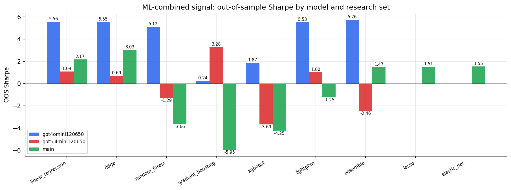

*ML-combined OOS Sharpe by model and research set*

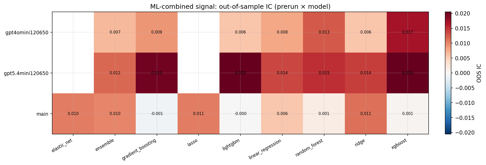

*ML-combined OOS IC (prerun × model)*

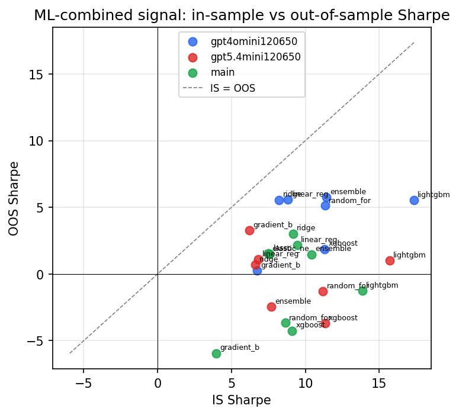

*IS vs OOS Sharpe (overfitting diagnostic)*

---
*Generated by `run_model_comparison.py`. Tables: `*.csv`; interactive: `comparison.ipynb`.*
