# Research-LLM factor comparison — `2026-01`

Comparing the **factor output of different research LLMs** on three axes (raw factor quality → factors as ML features → factors through the full agentic fund). The panel, IS/OOS split, horizon and model hyper-parameters are held identical across preruns — the *only* variable is the factor set.

## Preruns compared

| prerun | research_model | usable_factors | dropped_factors |
| --- | --- | --- | --- |
| gpt4omini120650 | gpt-4o-mini | 66 | 0 |
| gpt5.4mini120650 | gpt-5.4-mini | 69 | 0 |
| main | seed library | 78 | 10 |

> Dropped factors declare fields the current data doesn't have yet (e.g. fundamentals); they light up unchanged once that data is downloaded.

*Usable vs awaiting-data factors per research model*

## Key findings

- **Best ML-combined OOS Sharpe:** `gpt5.4mini120650` with `xgboost` (OOS Sharpe = 6.239).
- **Mean OOS Sharpe across models, by research set:** `gpt5.4mini120650` = 4.442, `gpt4omini120650` = 2.040, `main` = -0.934.
- **Highest mean single-factor |IC| (h=6):** `main` (mean |IC| = 0.0092).
- **Most diverse zoo (highest effective/raw factor ratio):** `gpt5.4mini120650` (eff 50.8 of 69, ratio 0.74).
- **Best selection-deflated single-factor |IC|:** `main` (deflated |IC| = 0.0167 from 38 factors tried).

## 1. Single-factor IC (raw factor quality)

Per-underlying time-series Spearman rank-IC of every researched factor, recomputed on the shared panel at horizons h=1, h=6, h=60. The per-underlying IC correlates each factor's value vector with the underlying's own forward-return vector (pooled across underlyings); the cross-sectional IC ranks across underlyings per timestamp.

| prerun | n_factors | mean_abs_ic_1 | mean_abs_ic_6 | mean_abs_ic_60 | mean_abs_icir_6 | best_factor_h6 | best_abs_ic_h6 |
| --- | --- | --- | --- | --- | --- | --- | --- |
| gpt4omini120650 | 66 | 0.0029 | 0.0047 | 0.0076 | 0.267 | hidden_volume_reversal_strength | 0.0174 |
| gpt5.4mini120650 | 69 | 0.0039 | 0.0058 | 0.0125 | 0.3325 | spread_depth_squeeze_reversion | 0.0179 |
| main | 78 | 0.0097 | 0.0092 | 0.0074 | 0.5563 | alpha_052 | 0.0239 |

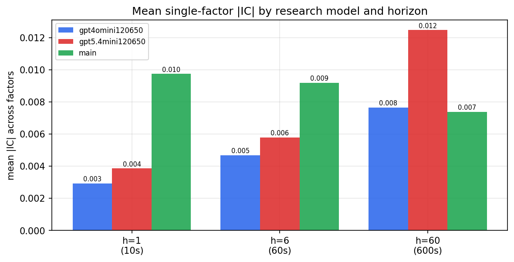

*Mean |IC| by research model and horizon*

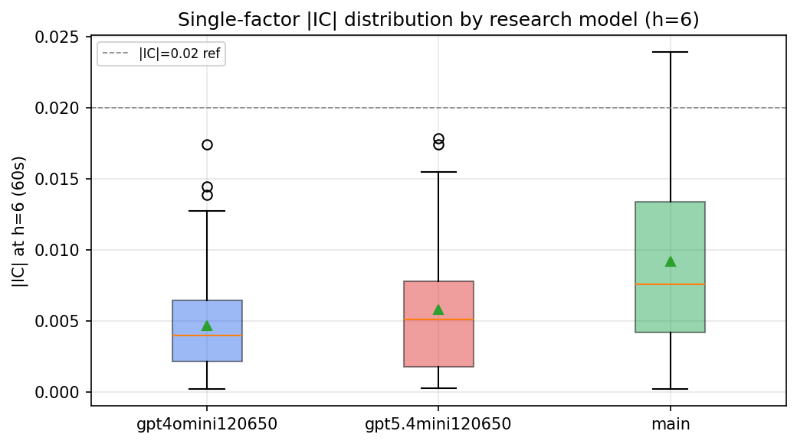

*Per-factor |IC| distribution by research model*

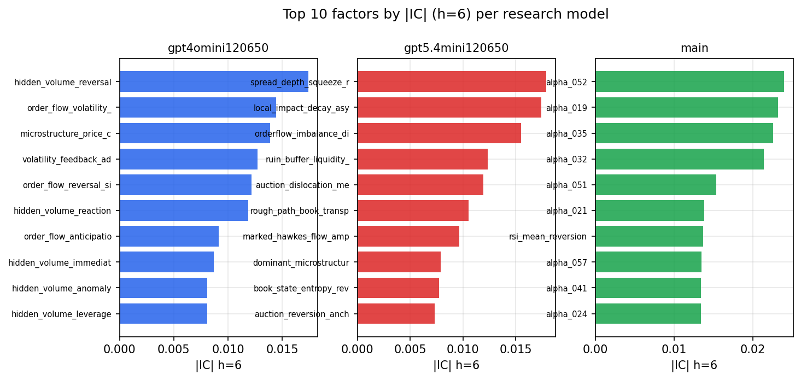

*Top factors by |IC| per research model*

## 2. Factor diversity & redundancy

Pairwise correlation of each zoo's *signals*. `eff_n_factors` is the effective number of independent factors (participation ratio of the correlation eigenvalues); `eff_ratio` and `redundancy` summarise how much unique information the zoo holds vs. how much is duplicated; `n_clusters` groups factors at |corr| ≥ 0.7.

| prerun | n_factors | eff_n_factors | eff_ratio | mean_abs_corr | n_clusters | redundancy |
| --- | --- | --- | --- | --- | --- | --- |
| gpt4omini120650 | 66 | 27.6967 | 0.4196 | 0.0486 | 51 | 0.5804 |
| gpt5.4mini120650 | 69 | 50.8446 | 0.7369 | 0.012 | 62 | 0.2631 |
| main | 78 | 45.1428 | 0.5788 | 0.0256 | 72 | 0.4212 |

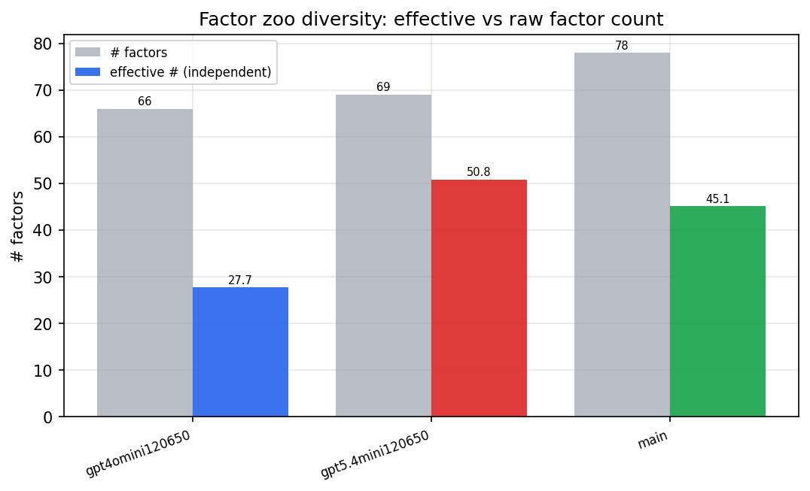

*Effective vs raw factor count per research model*

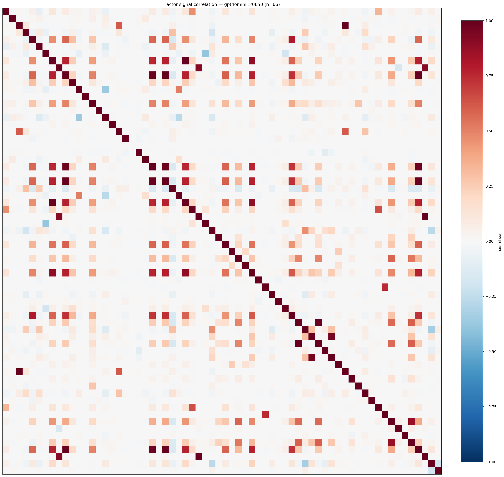

*Signal correlation matrix — gpt4omini120650*

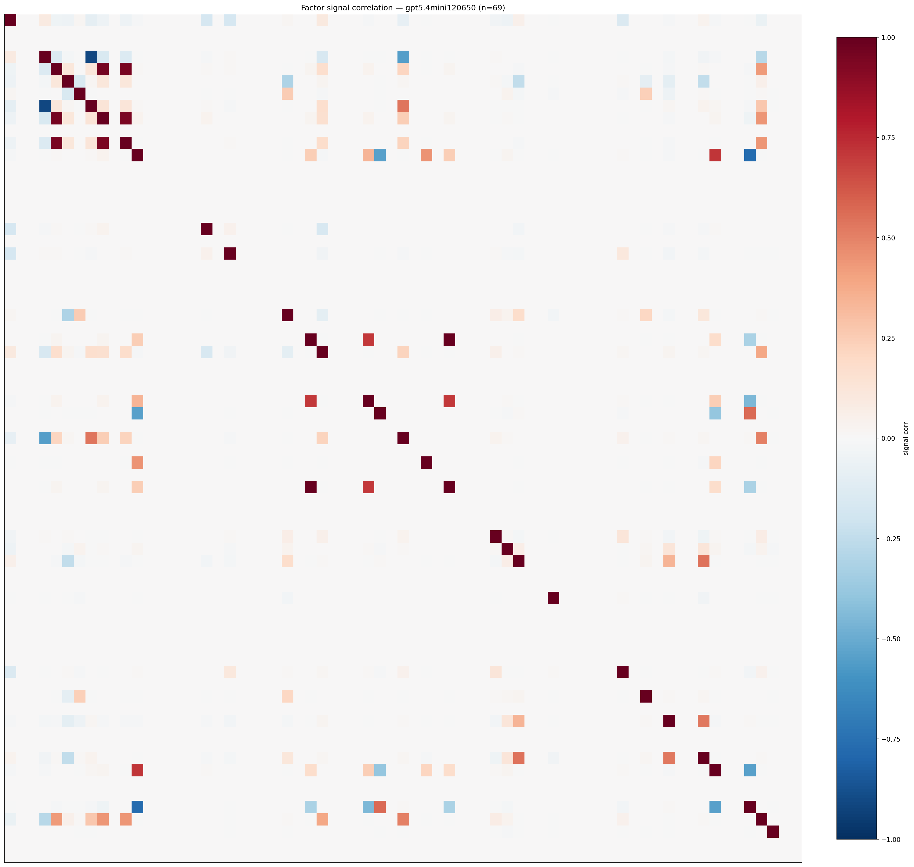

*Signal correlation matrix — gpt5.4mini120650*

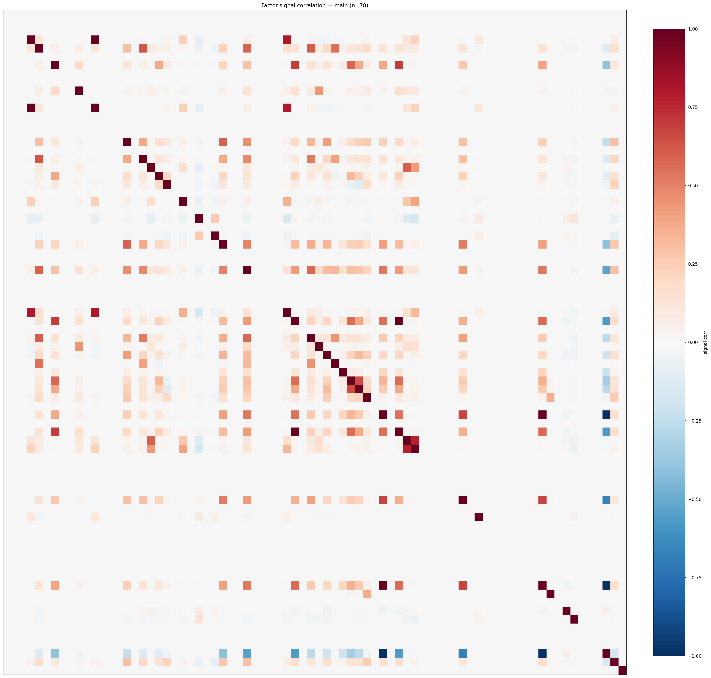

*Signal correlation matrix — main*

## 3. Deflation & model-based importance

`deflated_best_ic` haircuts each zoo's best |IC| for the number of factors tried (`ic_n_tested`) — a bigger zoo's best factor is more likely to be lucky. `lasso_n_nonzero` / `lasso_sparsity` show how many factors a sparse linear model actually keeps (model-view redundancy).

| prerun | best_ic | deflated_best_ic | deflated_best_t | ic_n_tested | ic_n_obs | lasso_n_nonzero | lasso_sparsity |
| --- | --- | --- | --- | --- | --- | --- | --- |
| gpt4omini120650 | 0.0174 | 0.0097 | 3.6424 | 64 | 140579 | 0 | 1.0 |
| gpt5.4mini120650 | 0.0179 | 0.0109 | 4.0824 | 31 | 140579 | 0 | 1.0 |
| main | 0.0239 | 0.0167 | 6.2711 | 38 | 140579 | 0 | 1.0 |

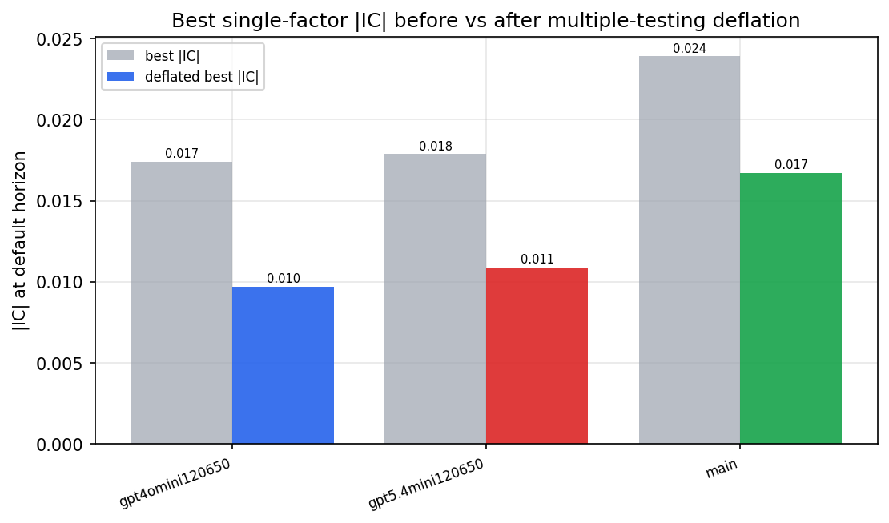

*Best |IC| before vs after multiple-testing deflation*

*Top factors by lasso importance per zoo*

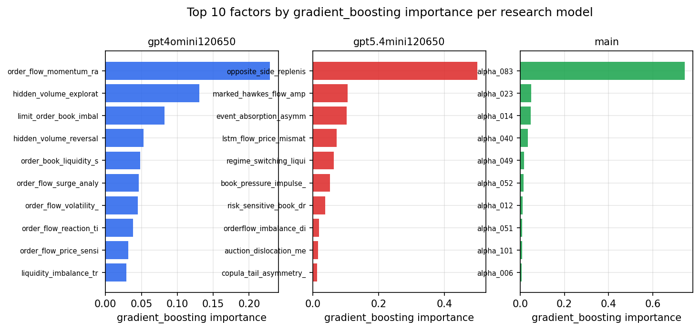

*Top factors by gradient_boosting importance per zoo*

## 4. ML-combined signal — per-underlying vectorised backtest

Each model combines a prerun's factors into ONE signal (fit `factors → forward return` on IS, predict per (bar, underlying)), then that combined signal is run through a simple vectorised backtest — `position(signal) × the underlying's own forward return` — on the held-out OOS tail (+ an equal-weight ensemble). No cross-sectional ranking.

> Config: position=**threshold** (t=1.0, z-score `expanding`), aggregation=**portfolio**, fit-standardise=**per_underlying**, horizon=6.

| prerun | model | n_factors_used | oos_ic | oos_sharpe | is_sharpe | oos_ann_return | oos_max_drawdown |
| --- | --- | --- | --- | --- | --- | --- | --- |
| gpt4omini120650 | linear_regression | 66 | 0.0129 | 2.0253 | 9.815 | 0.5351 | -0.1022 |
| gpt4omini120650 | ridge | 66 | 0.0128 | 1.969 | 10.158 | 0.5232 | -0.109 |
| gpt4omini120650 | lasso | 66 | nan | nan | nan | nan | nan |
| gpt4omini120650 | elastic_net | 66 | nan | nan | nan | nan | nan |
| gpt4omini120650 | random_forest | 66 | 0.0146 | 1.4918 | 10.186 | 0.3629 | -0.0826 |
| gpt4omini120650 | gradient_boosting | 66 | 0.01 | 0.7306 | 8.5486 | 0.1346 | -0.0656 |
| gpt4omini120650 | xgboost | 66 | 0.0204 | 3.0245 | 11.1299 | 0.5744 | -0.0589 |
| gpt4omini120650 | lightgbm | 66 | 0.0133 | 5.1166 | 15.3376 | 0.9289 | -0.0481 |
| gpt4omini120650 | ensemble | 66 | 0.019 | -0.078 | 9.1583 | -0.0182 | -0.1024 |
| gpt5.4mini120650 | linear_regression | 69 | -0.0033 | 2.7653 | 7.7412 | 0.4688 | -0.0372 |
| gpt5.4mini120650 | ridge | 69 | -0.0022 | 3.3233 | 7.5366 | 0.5593 | -0.0365 |
| gpt5.4mini120650 | lasso | 69 | nan | nan | nan | nan | nan |
| gpt5.4mini120650 | elastic_net | 69 | nan | nan | nan | nan | nan |
| gpt5.4mini120650 | random_forest | 69 | -0.0162 | 3.7591 | 9.6135 | 0.3345 | -0.0174 |
| gpt5.4mini120650 | gradient_boosting | 69 | -0.0174 | 4.8009 | 7.9202 | 0.3855 | -0.0102 |
| gpt5.4mini120650 | xgboost | 69 | -0.0144 | 6.2392 | 10.674 | 0.4582 | -0.0165 |
| gpt5.4mini120650 | lightgbm | 69 | -0.0078 | 5.5991 | 12.9431 | 0.4274 | -0.0132 |
| gpt5.4mini120650 | ensemble | 69 | -0.0099 | 4.6106 | 10.9181 | 0.5129 | -0.0187 |
| main | linear_regression | 78 | 0.0029 | 2.3575 | 9.0216 | 0.4848 | -0.0456 |
| main | ridge | 78 | -0.0015 | 3.4202 | 11.3641 | 0.8779 | -0.0319 |
| main | lasso | 78 | nan | nan | nan | nan | nan |
| main | elastic_net | 78 | nan | nan | nan | nan | nan |
| main | random_forest | 78 | -0.0143 | -1.9331 | 10.7353 | -0.5545 | -0.1375 |
| main | gradient_boosting | 78 | -0.0096 | -2.7705 | 6.3862 | -0.5548 | -0.1033 |
| main | xgboost | 78 | -0.0097 | -3.7783 | 13.8167 | -0.4389 | -0.0657 |
| main | lightgbm | 78 | -0.0078 | -1.3804 | 17.7358 | -0.1867 | -0.0797 |
| main | ensemble | 78 | -0.0126 | -2.4565 | 8.8103 | -0.5979 | -0.1292 |

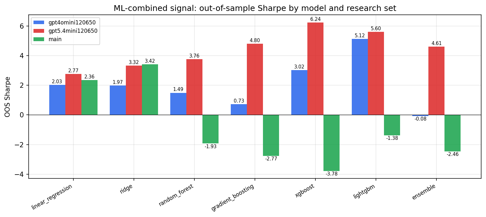

*ML-combined OOS Sharpe by model and research set*

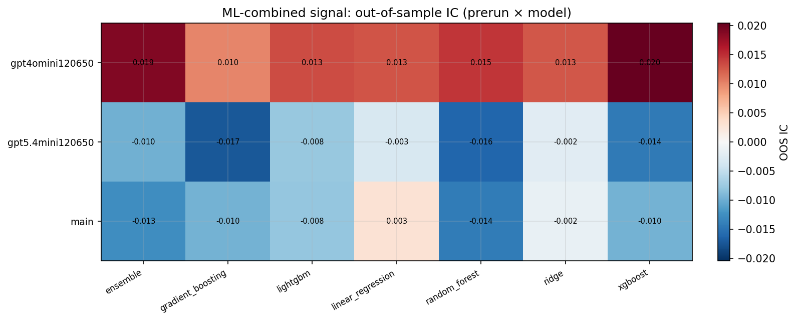

*ML-combined OOS IC (prerun × model)*

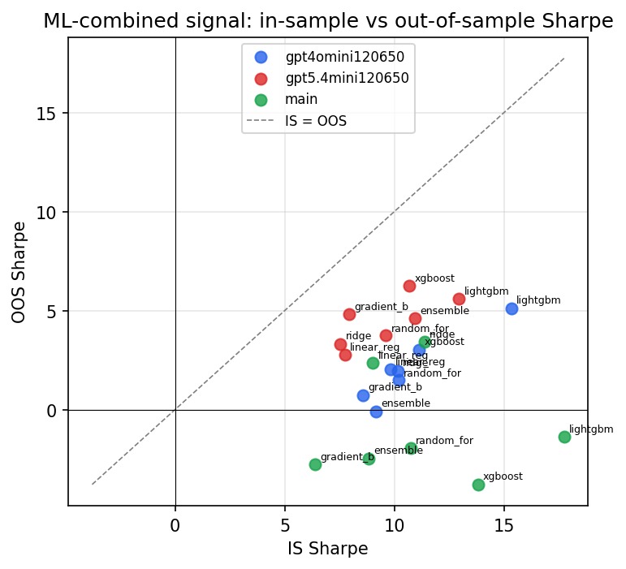

*IS vs OOS Sharpe (overfitting diagnostic)*

---
*Generated by `run_model_comparison.py`. Tables: `*.csv`; interactive: `comparison.ipynb`.*
