# Research-LLM factor comparison — `2026-02`

Comparing the **factor output of different research LLMs** on three axes (raw factor quality → factors as ML features → factors through the full agentic fund). The panel, IS/OOS split, horizon and model hyper-parameters are held identical across preruns — the *only* variable is the factor set.

## Preruns compared

| prerun | research_model | usable_factors | dropped_factors |
| --- | --- | --- | --- |
| gpt4omini120650 | gpt-4o-mini | 66 | 0 |
| gpt5.4mini120650 | gpt-5.4-mini | 69 | 0 |
| main | seed library | 78 | 10 |

> Dropped factors declare fields the current data doesn't have yet (e.g. fundamentals); they light up unchanged once that data is downloaded.

*Usable vs awaiting-data factors per research model*

## Key findings

- **Best ML-combined OOS Sharpe:** `gpt4omini120650` with `random_forest` (OOS Sharpe = 3.774).
- **Mean OOS Sharpe across models, by research set:** `gpt4omini120650` = 0.653, `main` = -1.817, `gpt5.4mini120650` = -2.225.
- **Highest mean single-factor |IC| (h=6):** `main` (mean |IC| = 0.0074).
- **Most diverse zoo (highest effective/raw factor ratio):** `gpt5.4mini120650` (eff 55.1 of 69, ratio 0.80).
- **Best selection-deflated single-factor |IC|:** `main` (deflated |IC| = 0.0154 from 38 factors tried).

## 1. Single-factor IC (raw factor quality)

Per-underlying time-series Spearman rank-IC of every researched factor, recomputed on the shared panel at horizons h=1, h=6, h=60. The per-underlying IC correlates each factor's value vector with the underlying's own forward-return vector (pooled across underlyings); the cross-sectional IC ranks across underlyings per timestamp.

| prerun | n_factors | mean_abs_ic_1 | mean_abs_ic_6 | mean_abs_ic_60 | mean_abs_icir_6 | best_factor_h6 | best_abs_ic_h6 |
| --- | --- | --- | --- | --- | --- | --- | --- |
| gpt4omini120650 | 66 | 0.0027 | 0.0052 | 0.0067 | 0.3256 | order_flow_stability_score | 0.0129 |
| gpt5.4mini120650 | 69 | 0.0031 | 0.0065 | 0.0102 | 0.3638 | liquidity_impact_stress_ratio | 0.0151 |
| main | 78 | 0.0093 | 0.0074 | 0.0069 | 0.4582 | alpha_019 | 0.0226 |

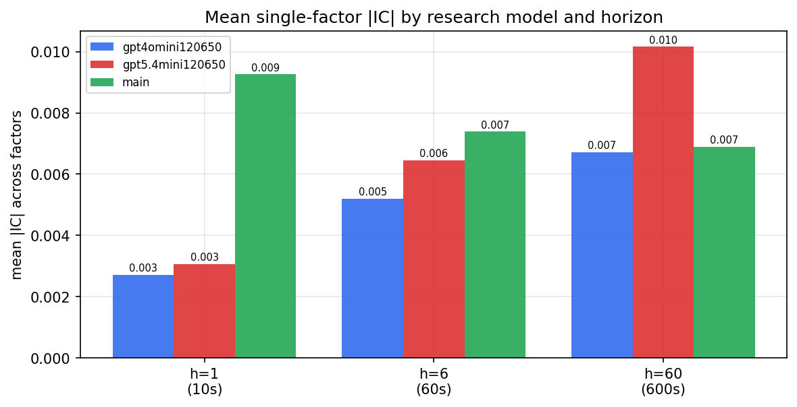

*Mean |IC| by research model and horizon*

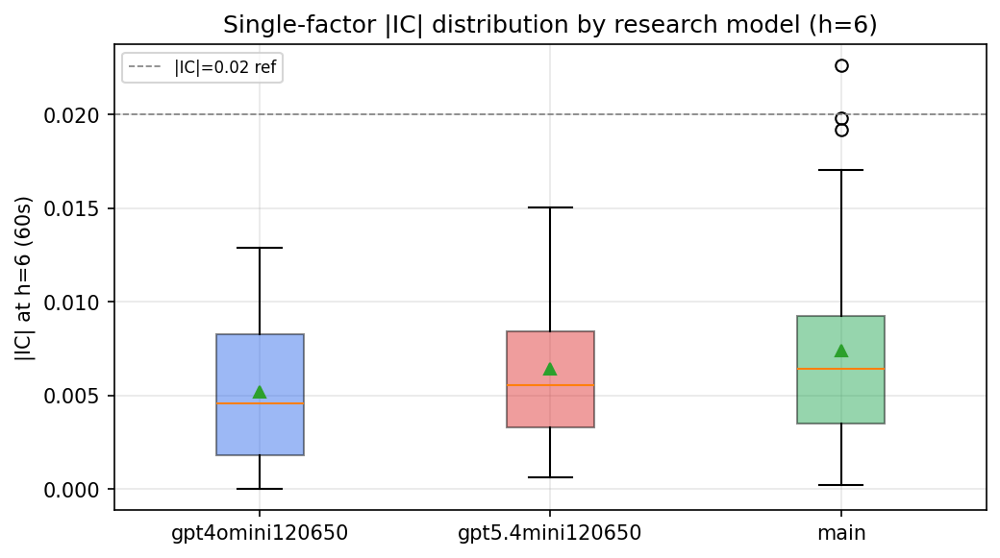

*Per-factor |IC| distribution by research model*

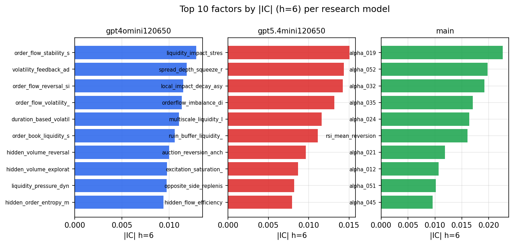

*Top factors by |IC| per research model*

## 2. Factor diversity & redundancy

Pairwise correlation of each zoo's *signals*. `eff_n_factors` is the effective number of independent factors (participation ratio of the correlation eigenvalues); `eff_ratio` and `redundancy` summarise how much unique information the zoo holds vs. how much is duplicated; `n_clusters` groups factors at |corr| ≥ 0.7.

| prerun | n_factors | eff_n_factors | eff_ratio | mean_abs_corr | n_clusters | redundancy |
| --- | --- | --- | --- | --- | --- | --- |
| gpt4omini120650 | 66 | 28.4579 | 0.4312 | 0.0475 | 53 | 0.5688 |
| gpt5.4mini120650 | 69 | 55.1384 | 0.7991 | 0.01 | 64 | 0.2009 |
| main | 78 | 45.445 | 0.5826 | 0.0253 | 72 | 0.4174 |

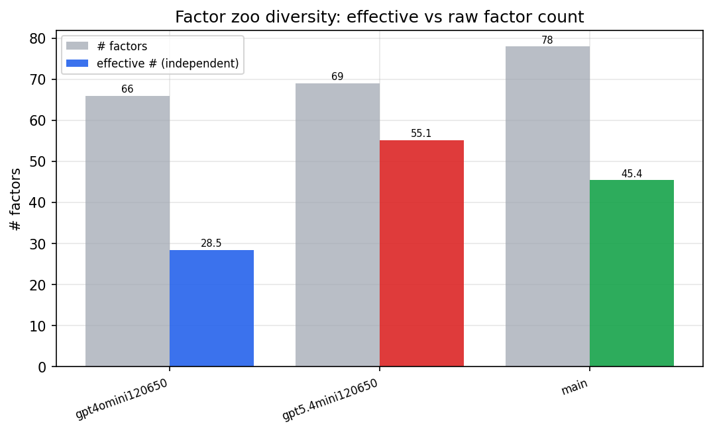

*Effective vs raw factor count per research model*

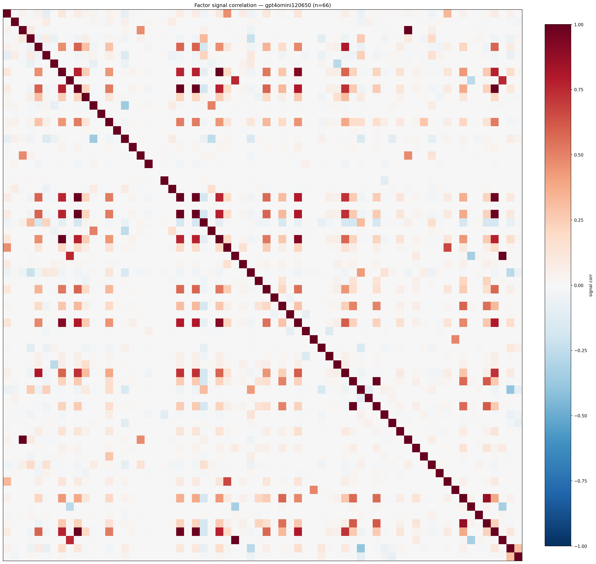

*Signal correlation matrix — gpt4omini120650*

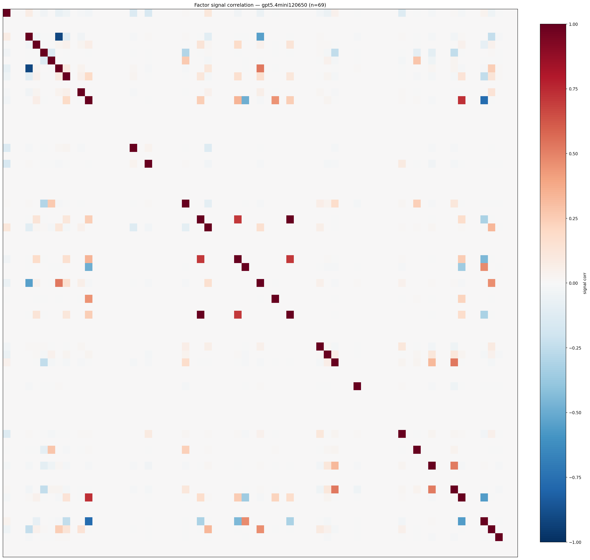

*Signal correlation matrix — gpt5.4mini120650*

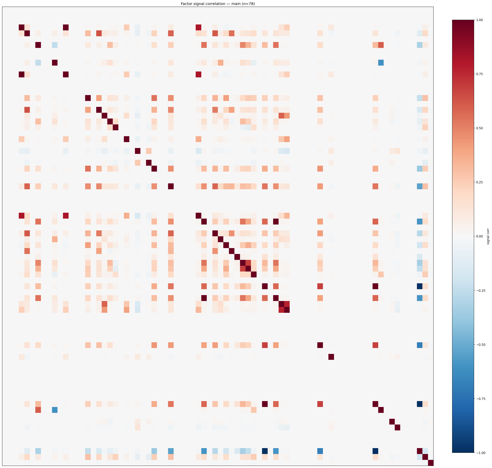

*Signal correlation matrix — main*

## 3. Deflation & model-based importance

`deflated_best_ic` haircuts each zoo's best |IC| for the number of factors tried (`ic_n_tested`) — a bigger zoo's best factor is more likely to be lucky. `lasso_n_nonzero` / `lasso_sparsity` show how many factors a sparse linear model actually keeps (model-view redundancy).

| prerun | best_ic | deflated_best_ic | deflated_best_t | ic_n_tested | ic_n_obs | lasso_n_nonzero | lasso_sparsity |
| --- | --- | --- | --- | --- | --- | --- | --- |
| gpt4omini120650 | 0.0129 | 0.0052 | 1.9602 | 64 | 141659 | 0 | 1.0 |
| gpt5.4mini120650 | 0.0151 | 0.0081 | 3.0487 | 31 | 141659 | 0 | 1.0 |
| main | 0.0226 | 0.0154 | 5.8148 | 38 | 141659 | 0 | 1.0 |

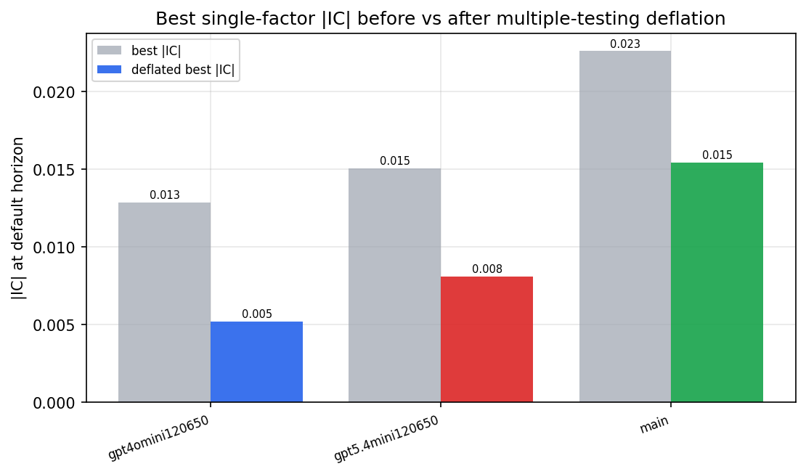

*Best |IC| before vs after multiple-testing deflation*

*Top factors by lasso importance per zoo*

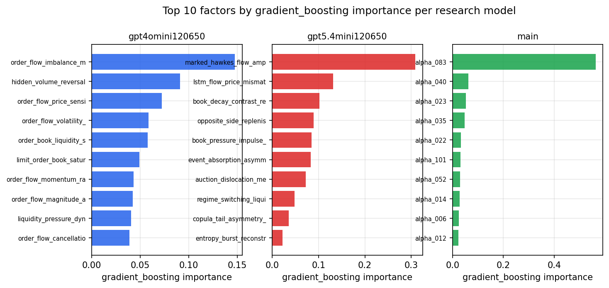

*Top factors by gradient_boosting importance per zoo*

## 4. ML-combined signal — per-underlying vectorised backtest

Each model combines a prerun's factors into ONE signal (fit `factors → forward return` on IS, predict per (bar, underlying)), then that combined signal is run through a simple vectorised backtest — `position(signal) × the underlying's own forward return` — on the held-out OOS tail (+ an equal-weight ensemble). No cross-sectional ranking.

> Config: position=**threshold** (t=1.0, z-score `expanding`), aggregation=**portfolio**, fit-standardise=**per_underlying**, horizon=6.

| prerun | model | n_factors_used | oos_ic | oos_sharpe | is_sharpe | oos_ann_return | oos_max_drawdown |
| --- | --- | --- | --- | --- | --- | --- | --- |
| gpt4omini120650 | linear_regression | 66 | -0.0062 | 1.6331 | 5.2546 | 0.1072 | -0.01 |
| gpt4omini120650 | ridge | 66 | -0.0092 | 2.4948 | 4.7264 | 0.1627 | -0.01 |
| gpt4omini120650 | lasso | 66 | nan | nan | nan | nan | nan |
| gpt4omini120650 | elastic_net | 66 | nan | nan | nan | nan | nan |
| gpt4omini120650 | random_forest | 66 | -0.0109 | 3.7736 | 9.6277 | 0.4654 | -0.0188 |
| gpt4omini120650 | gradient_boosting | 66 | -0.0145 | -0.1699 | 11.778 | -0.0085 | -0.0134 |
| gpt4omini120650 | xgboost | 66 | -0.0016 | 0.9493 | 15.6985 | 0.1235 | -0.0232 |
| gpt4omini120650 | lightgbm | 66 | -0.0034 | -4.7421 | 21.1299 | -0.744 | -0.0665 |
| gpt4omini120650 | ensemble | 66 | -0.0109 | 0.6302 | 15.9121 | 0.0772 | -0.0231 |
| gpt5.4mini120650 | linear_regression | 69 | 0.0055 | -1.3541 | 5.0053 | -0.2601 | -0.0518 |
| gpt5.4mini120650 | ridge | 69 | 0.006 | -2.0677 | 4.4993 | -0.4488 | -0.0604 |
| gpt5.4mini120650 | lasso | 69 | nan | nan | nan | nan | nan |
| gpt5.4mini120650 | elastic_net | 69 | nan | nan | nan | nan | nan |
| gpt5.4mini120650 | random_forest | 69 | 0.011 | -4.6699 | 10.1097 | -1.1776 | -0.1017 |
| gpt5.4mini120650 | gradient_boosting | 69 | 0.0068 | -4.128 | 9.4539 | -0.1919 | -0.0181 |
| gpt5.4mini120650 | xgboost | 69 | 0.0061 | 1.0542 | 13.9112 | 0.0895 | -0.0231 |
| gpt5.4mini120650 | lightgbm | 69 | 0.0063 | -1.2497 | 17.7678 | -0.1482 | -0.0255 |
| gpt5.4mini120650 | ensemble | 69 | 0.0052 | -3.1567 | 13.7934 | -0.8088 | -0.0813 |
| main | linear_regression | 78 | 0.0008 | -3.9733 | 6.6056 | -0.6045 | -0.066 |
| main | ridge | 78 | 0.0019 | -2.8254 | 6.4121 | -0.4353 | -0.0552 |
| main | lasso | 78 | nan | nan | nan | nan | nan |
| main | elastic_net | 78 | nan | nan | nan | nan | nan |
| main | random_forest | 78 | 0.0017 | -2.8979 | 9.029 | -0.397 | -0.0414 |
| main | gradient_boosting | 78 | -0.0015 | 1.405 | 7.8286 | 0.0281 | -0.0044 |
| main | xgboost | 78 | 0.0045 | -0.7088 | 15.4476 | -0.0658 | -0.0258 |
| main | lightgbm | 78 | -0.0009 | -0.8327 | 18.8191 | -0.0615 | -0.0221 |
| main | ensemble | 78 | 0.0066 | -2.8835 | 13.1156 | -0.418 | -0.0477 |

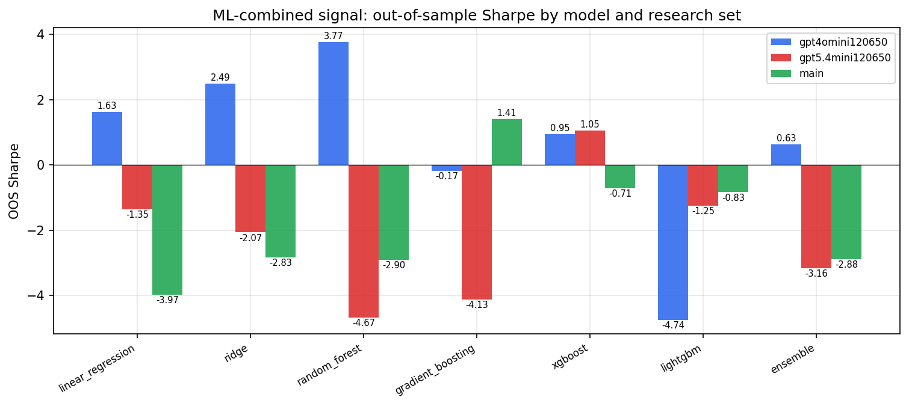

*ML-combined OOS Sharpe by model and research set*

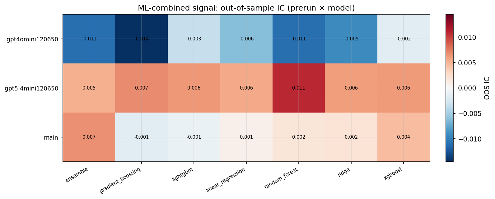

*ML-combined OOS IC (prerun × model)*

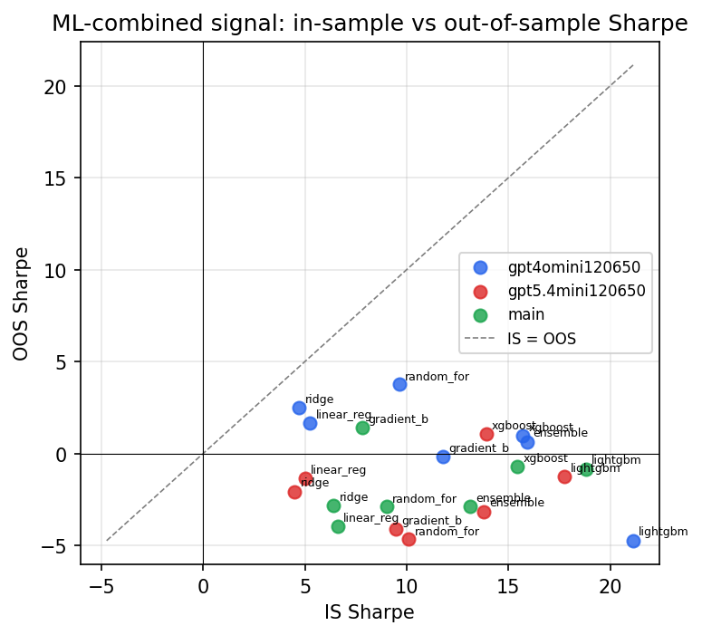

*IS vs OOS Sharpe (overfitting diagnostic)*

---
*Generated by `run_model_comparison.py`. Tables: `*.csv`; interactive: `comparison.ipynb`.*
