# Research-LLM factor comparison — `2026-03`

Comparing the **factor output of different research LLMs** on three axes (raw factor quality → factors as ML features → factors through the full agentic fund). The panel, IS/OOS split, horizon and model hyper-parameters are held identical across preruns — the *only* variable is the factor set.

## Preruns compared

| prerun | research_model | usable_factors | dropped_factors |
| --- | --- | --- | --- |
| gpt4omini120650 | gpt-4o-mini | 66 | 0 |
| gpt5.4mini120650 | gpt-5.4-mini | 69 | 0 |
| main | seed library | 78 | 10 |

> Dropped factors declare fields the current data doesn't have yet (e.g. fundamentals); they light up unchanged once that data is downloaded.

*Usable vs awaiting-data factors per research model*

## Key findings

- **Best ML-combined OOS Sharpe:** `main` with `ensemble` (OOS Sharpe = 5.794).
- **Mean OOS Sharpe across models, by research set:** `main` = 3.833, `gpt5.4mini120650` = -2.340, `gpt4omini120650` = -5.038.
- **Highest mean single-factor |IC| (h=6):** `main` (mean |IC| = 0.0063).
- **Most diverse zoo (highest effective/raw factor ratio):** `gpt5.4mini120650` (eff 55.0 of 69, ratio 0.80).
- **Best selection-deflated single-factor |IC|:** `main` (deflated |IC| = 0.0110 from 38 factors tried).

## 1. Single-factor IC (raw factor quality)

Per-underlying time-series Spearman rank-IC of every researched factor, recomputed on the shared panel at horizons h=1, h=6, h=60. The per-underlying IC correlates each factor's value vector with the underlying's own forward-return vector (pooled across underlyings); the cross-sectional IC ranks across underlyings per timestamp.

| prerun | n_factors | mean_abs_ic_1 | mean_abs_ic_6 | mean_abs_ic_60 | mean_abs_icir_6 | best_factor_h6 | best_abs_ic_h6 |
| --- | --- | --- | --- | --- | --- | --- | --- |
| gpt4omini120650 | 66 | 0.0032 | 0.004 | 0.0066 | 0.2848 | multivariate_volatility_correlation_strength | 0.0126 |
| gpt5.4mini120650 | 69 | 0.0035 | 0.0045 | 0.0071 | 0.3106 | orderflow_imbalance_divergence | 0.016 |
| main | 78 | 0.0101 | 0.0063 | 0.0059 | 0.4913 | rsi_mean_reversion | 0.0181 |

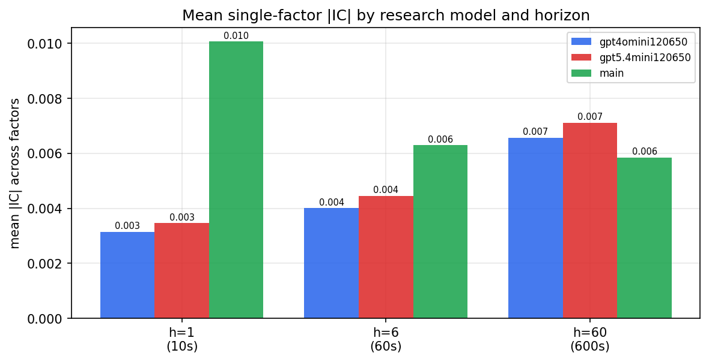

*Mean |IC| by research model and horizon*

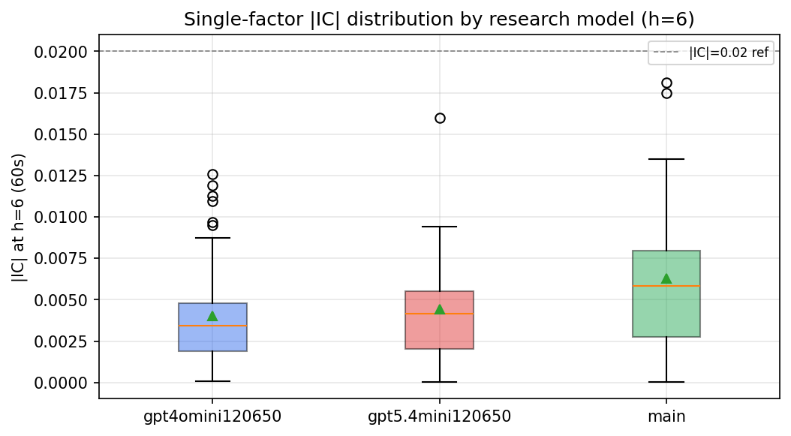

*Per-factor |IC| distribution by research model*

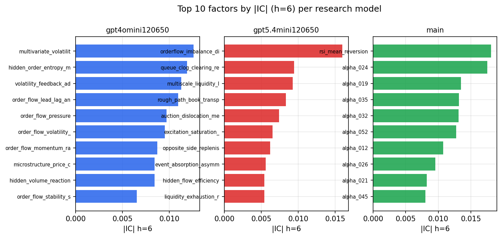

*Top factors by |IC| per research model*

## 2. Factor diversity & redundancy

Pairwise correlation of each zoo's *signals*. `eff_n_factors` is the effective number of independent factors (participation ratio of the correlation eigenvalues); `eff_ratio` and `redundancy` summarise how much unique information the zoo holds vs. how much is duplicated; `n_clusters` groups factors at |corr| ≥ 0.7.

| prerun | n_factors | eff_n_factors | eff_ratio | mean_abs_corr | n_clusters | redundancy |
| --- | --- | --- | --- | --- | --- | --- |
| gpt4omini120650 | 66 | 28.5296 | 0.4323 | 0.0466 | 53 | 0.5677 |
| gpt5.4mini120650 | 69 | 55.0369 | 0.7976 | 0.01 | 64 | 0.2024 |
| main | 78 | 44.737 | 0.5736 | 0.0259 | 72 | 0.4264 |

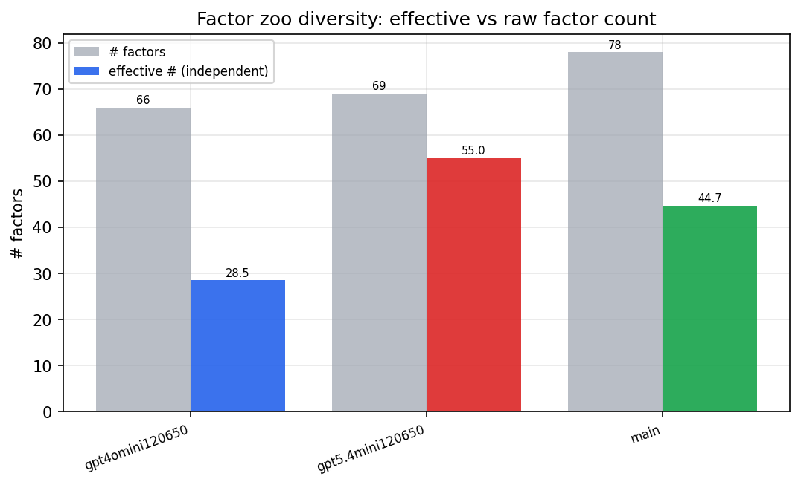

*Effective vs raw factor count per research model*

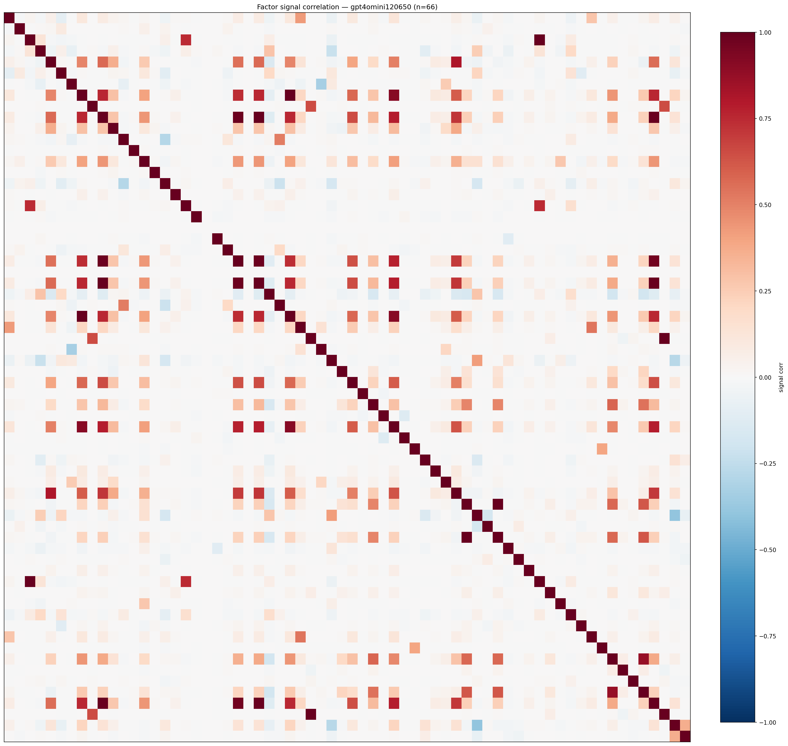

*Signal correlation matrix — gpt4omini120650*

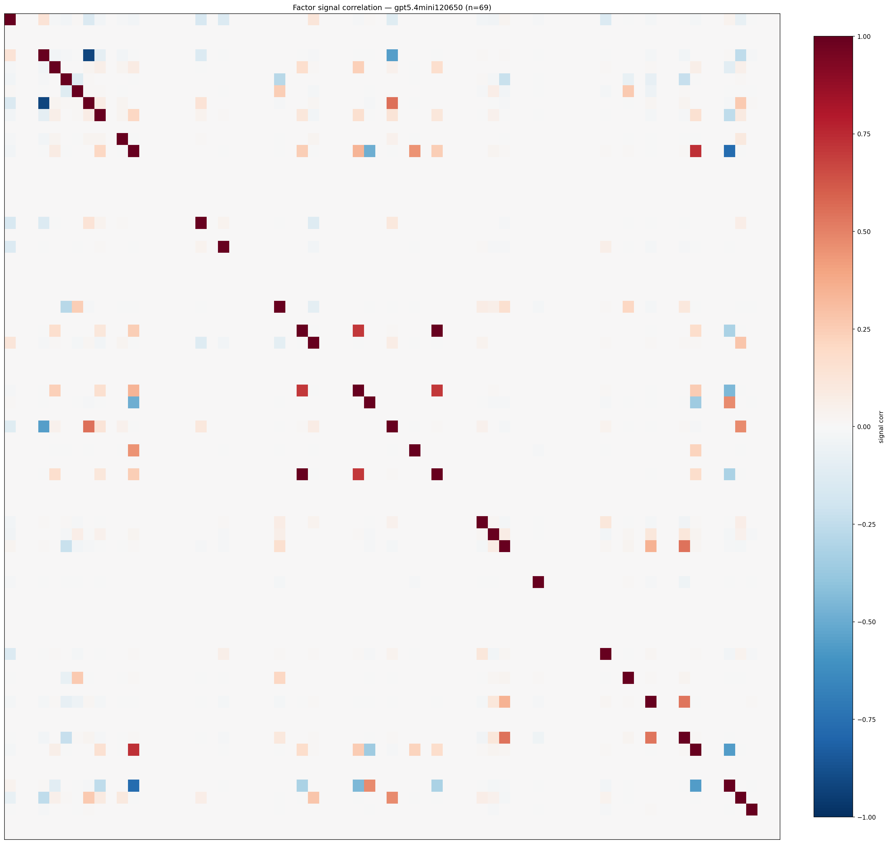

*Signal correlation matrix — gpt5.4mini120650*

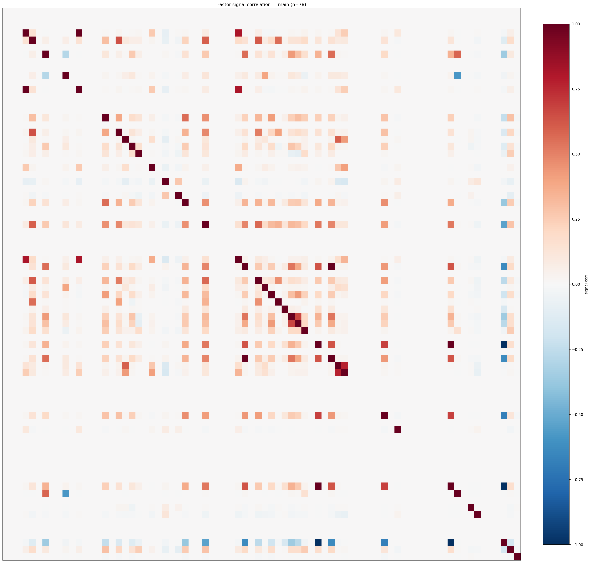

*Signal correlation matrix — main*

## 3. Deflation & model-based importance

`deflated_best_ic` haircuts each zoo's best |IC| for the number of factors tried (`ic_n_tested`) — a bigger zoo's best factor is more likely to be lucky. `lasso_n_nonzero` / `lasso_sparsity` show how many factors a sparse linear model actually keeps (model-view redundancy).

| prerun | best_ic | deflated_best_ic | deflated_best_t | ic_n_tested | ic_n_obs | lasso_n_nonzero | lasso_sparsity |
| --- | --- | --- | --- | --- | --- | --- | --- |
| gpt4omini120650 | 0.0126 | 0.005 | 1.8746 | 64 | 142739 | 0 | 1.0 |
| gpt5.4mini120650 | 0.016 | 0.009 | 3.4114 | 31 | 142739 | 0 | 1.0 |
| main | 0.0181 | 0.011 | 4.1402 | 38 | 142739 | 0 | 1.0 |

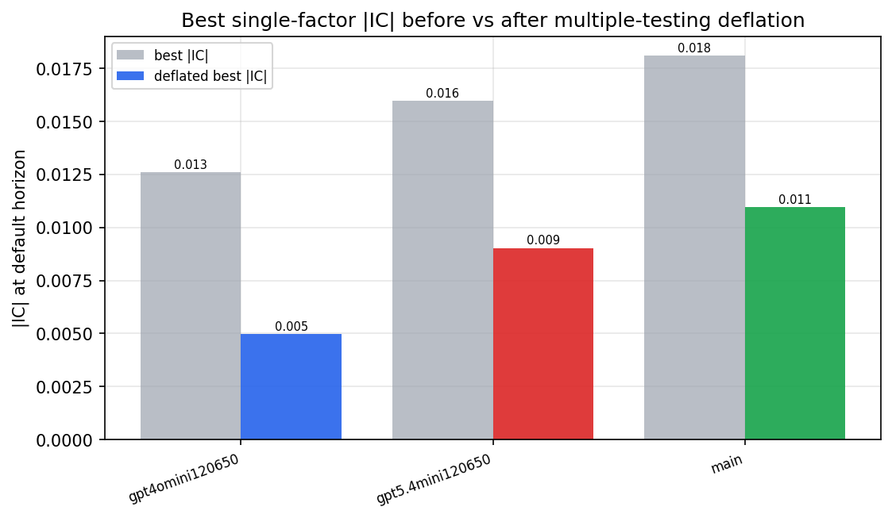

*Best |IC| before vs after multiple-testing deflation*

*Top factors by lasso importance per zoo*

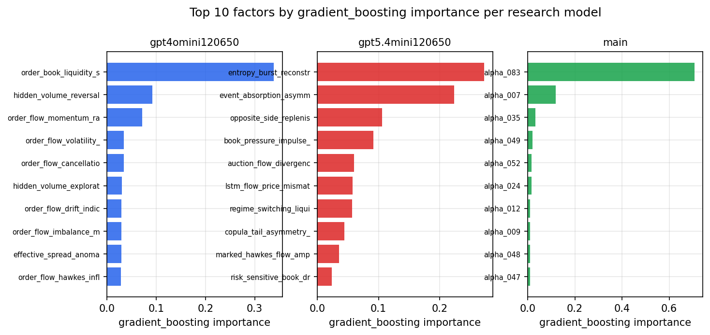

*Top factors by gradient_boosting importance per zoo*

## 4. ML-combined signal — per-underlying vectorised backtest

Each model combines a prerun's factors into ONE signal (fit `factors → forward return` on IS, predict per (bar, underlying)), then that combined signal is run through a simple vectorised backtest — `position(signal) × the underlying's own forward return` — on the held-out OOS tail (+ an equal-weight ensemble). No cross-sectional ranking.

> Config: position=**threshold** (t=1.0, z-score `expanding`), aggregation=**portfolio**, fit-standardise=**per_underlying**, horizon=6.

| prerun | model | n_factors_used | oos_ic | oos_sharpe | is_sharpe | oos_ann_return | oos_max_drawdown |
| --- | --- | --- | --- | --- | --- | --- | --- |
| gpt4omini120650 | linear_regression | 66 | -0.0045 | -3.2962 | 7.0942 | -0.8747 | -0.1266 |
| gpt4omini120650 | ridge | 66 | -0.0021 | -4.1869 | 6.041 | -1.0928 | -0.1266 |
| gpt4omini120650 | lasso | 66 | nan | nan | nan | nan | nan |
| gpt4omini120650 | elastic_net | 66 | nan | nan | nan | nan | nan |
| gpt4omini120650 | random_forest | 66 | 0.0054 | -4.7619 | 8.9574 | -0.644 | -0.0687 |
| gpt4omini120650 | gradient_boosting | 66 | -0.0077 | -5.556 | 8.9499 | -0.4562 | -0.0452 |
| gpt4omini120650 | xgboost | 66 | -0.0076 | -7.7324 | 13.2701 | -0.7731 | -0.0702 |
| gpt4omini120650 | lightgbm | 66 | -0.0037 | -3.5243 | 19.193 | -0.4491 | -0.0511 |
| gpt4omini120650 | ensemble | 66 | -0.0057 | -6.207 | 10.4452 | -0.5861 | -0.0568 |
| gpt5.4mini120650 | linear_regression | 69 | 0.0065 | 2.806 | 6.0028 | 0.4327 | -0.0314 |
| gpt5.4mini120650 | ridge | 69 | 0.0056 | 2.868 | 6.8822 | 0.4857 | -0.0318 |
| gpt5.4mini120650 | lasso | 69 | nan | nan | nan | nan | nan |
| gpt5.4mini120650 | elastic_net | 69 | nan | nan | nan | nan | nan |
| gpt5.4mini120650 | random_forest | 69 | -0.003 | -0.7518 | 10.9655 | -0.0529 | -0.0193 |
| gpt5.4mini120650 | gradient_boosting | 69 | -0.0055 | -6.9494 | 11.9486 | -0.1343 | -0.0139 |
| gpt5.4mini120650 | xgboost | 69 | -0.0042 | -2.4655 | 14.6897 | -0.1135 | -0.0164 |
| gpt5.4mini120650 | lightgbm | 69 | -0.0035 | -4.7283 | 16.6187 | -0.1255 | -0.0133 |
| gpt5.4mini120650 | ensemble | 69 | 0.0037 | -7.1559 | 9.1454 | -0.0834 | -0.008 |
| main | linear_regression | 78 | 0.0213 | 5.419 | 7.6305 | 0.6315 | -0.0234 |
| main | ridge | 78 | 0.0217 | 5.7194 | 7.4518 | 0.6385 | -0.0263 |
| main | lasso | 78 | nan | nan | nan | nan | nan |
| main | elastic_net | 78 | nan | nan | nan | nan | nan |
| main | random_forest | 78 | 0.0202 | 1.0785 | 7.3963 | 0.0352 | -0.0102 |
| main | gradient_boosting | 78 | 0.0297 | 4.2583 | 7.0425 | 0.0202 | -0.001 |
| main | xgboost | 78 | 0.0165 | 3.7424 | 12.3467 | 0.1006 | -0.0069 |
| main | lightgbm | 78 | 0.018 | 0.8188 | 16.8519 | 0.0226 | -0.0102 |
| main | ensemble | 78 | 0.0196 | 5.7943 | 7.9429 | 0.0312 | -0.001 |

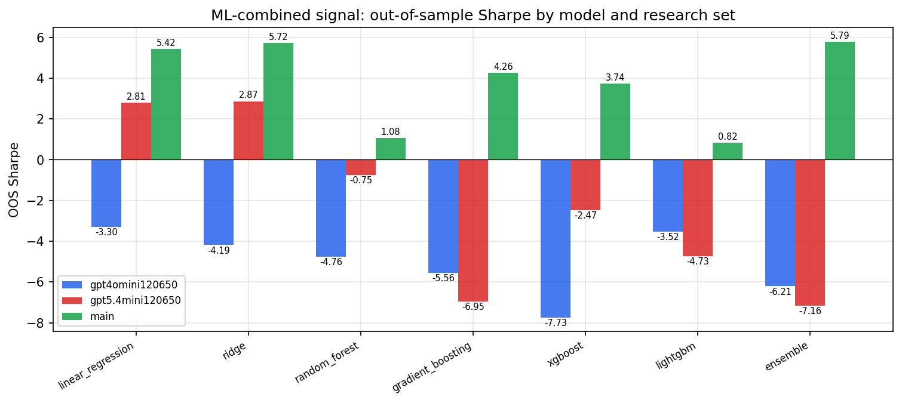

*ML-combined OOS Sharpe by model and research set*

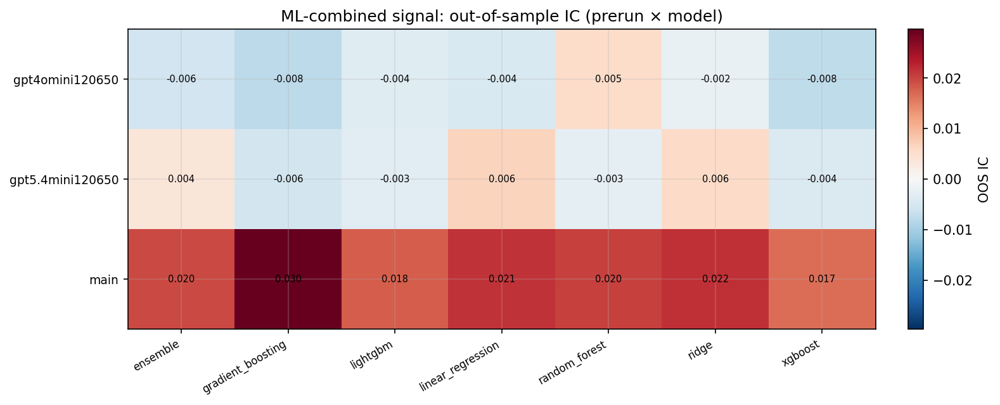

*ML-combined OOS IC (prerun × model)*

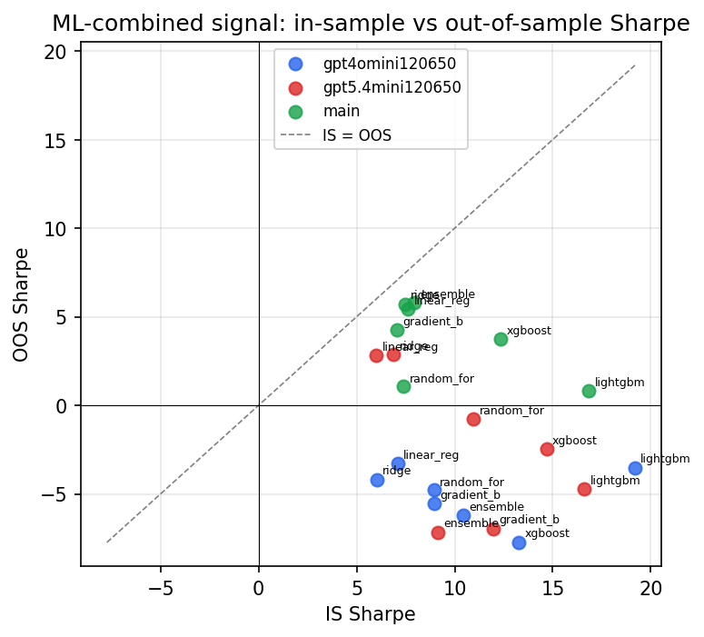

*IS vs OOS Sharpe (overfitting diagnostic)*

---
*Generated by `run_model_comparison.py`. Tables: `*.csv`; interactive: `comparison.ipynb`.*
