# Research-LLM factor comparison — `2026-04`

Comparing the **factor output of different research LLMs** on three axes (raw factor quality → factors as ML features → factors through the full agentic fund). The panel, IS/OOS split, horizon and model hyper-parameters are held identical across preruns — the *only* variable is the factor set.

## Preruns compared

| prerun | research_model | usable_factors | dropped_factors |
| --- | --- | --- | --- |
| gpt4omini120650 | gpt-4o-mini | 66 | 0 |
| gpt5.4mini120650 | gpt-5.4-mini | 69 | 0 |
| main | seed library | 78 | 10 |

> Dropped factors declare fields the current data doesn't have yet (e.g. fundamentals); they light up unchanged once that data is downloaded.

*Usable vs awaiting-data factors per research model*

## Key findings

- **Best ML-combined OOS Sharpe:** `main` with `ensemble` (OOS Sharpe = 10.351).
- **Mean OOS Sharpe across models, by research set:** `main` = 3.678, `gpt5.4mini120650` = 0.758, `gpt4omini120650` = 0.472.
- **Highest mean single-factor |IC| (h=6):** `main` (mean |IC| = 0.0069).
- **Most diverse zoo (highest effective/raw factor ratio):** `gpt5.4mini120650` (eff 55.4 of 69, ratio 0.80).
- **Best selection-deflated single-factor |IC|:** `main` (deflated |IC| = 0.0173 from 38 factors tried).

## 1. Single-factor IC (raw factor quality)

Per-underlying time-series Spearman rank-IC of every researched factor, recomputed on the shared panel at horizons h=1, h=6, h=60. The per-underlying IC correlates each factor's value vector with the underlying's own forward-return vector (pooled across underlyings); the cross-sectional IC ranks across underlyings per timestamp.

| prerun | n_factors | mean_abs_ic_1 | mean_abs_ic_6 | mean_abs_ic_60 | mean_abs_icir_6 | best_factor_h6 | best_abs_ic_h6 |
| --- | --- | --- | --- | --- | --- | --- | --- |
| gpt4omini120650 | 66 | 0.0033 | 0.0051 | 0.0092 | 0.3554 | hidden_order_entropy_magnitude_signal | 0.0133 |
| gpt5.4mini120650 | 69 | 0.0031 | 0.0042 | 0.008 | 0.2641 | orderflow_imbalance_divergence | 0.0151 |
| main | 78 | 0.0092 | 0.0069 | 0.009 | 0.471 | alpha_024 | 0.0244 |

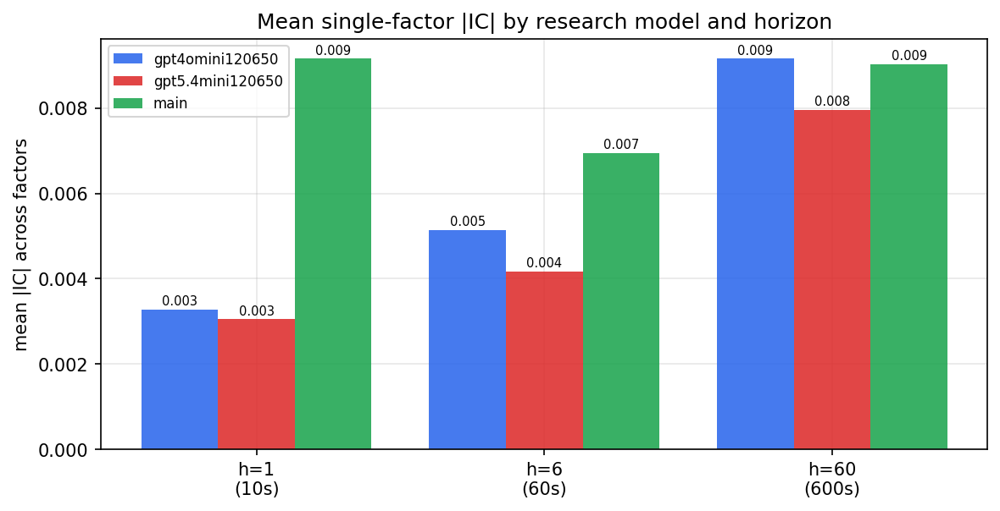

*Mean |IC| by research model and horizon*

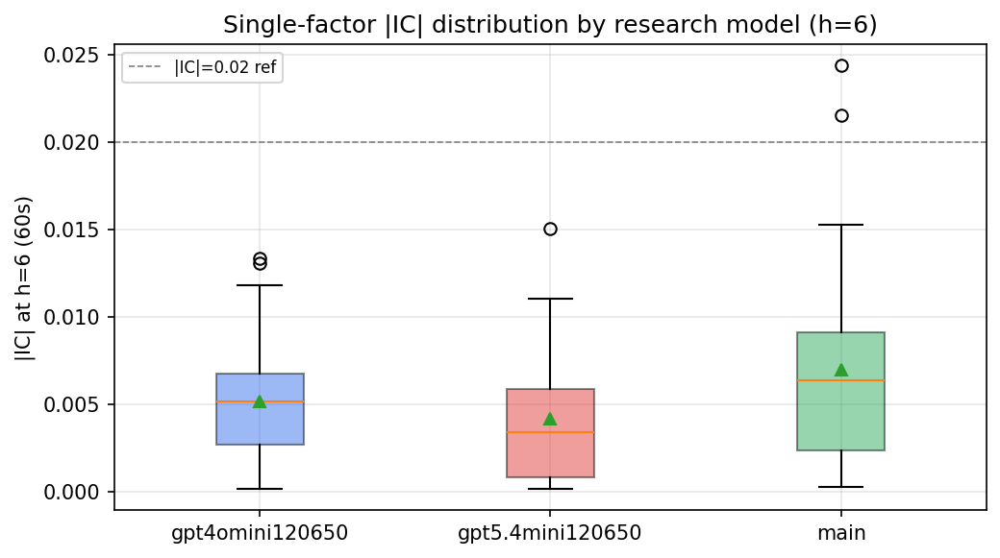

*Per-factor |IC| distribution by research model*

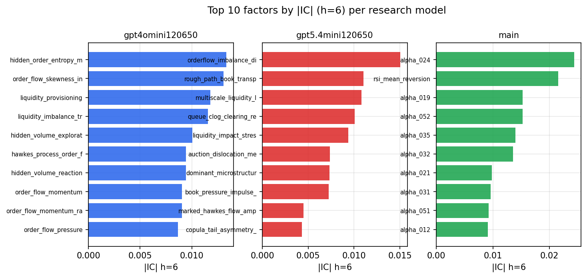

*Top factors by |IC| per research model*

## 2. Factor diversity & redundancy

Pairwise correlation of each zoo's *signals*. `eff_n_factors` is the effective number of independent factors (participation ratio of the correlation eigenvalues); `eff_ratio` and `redundancy` summarise how much unique information the zoo holds vs. how much is duplicated; `n_clusters` groups factors at |corr| ≥ 0.7.

| prerun | n_factors | eff_n_factors | eff_ratio | mean_abs_corr | n_clusters | redundancy |
| --- | --- | --- | --- | --- | --- | --- |
| gpt4omini120650 | 66 | 28.7563 | 0.4357 | 0.0466 | 51 | 0.5643 |
| gpt5.4mini120650 | 69 | 55.3514 | 0.8022 | 0.01 | 65 | 0.1978 |
| main | 78 | 44.675 | 0.5728 | 0.0263 | 72 | 0.4272 |

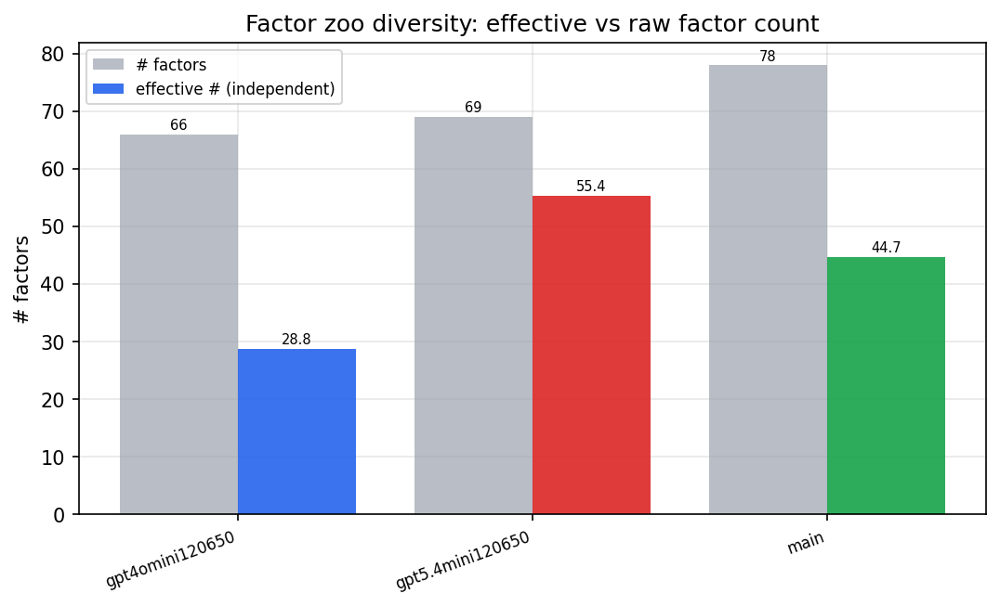

*Effective vs raw factor count per research model*

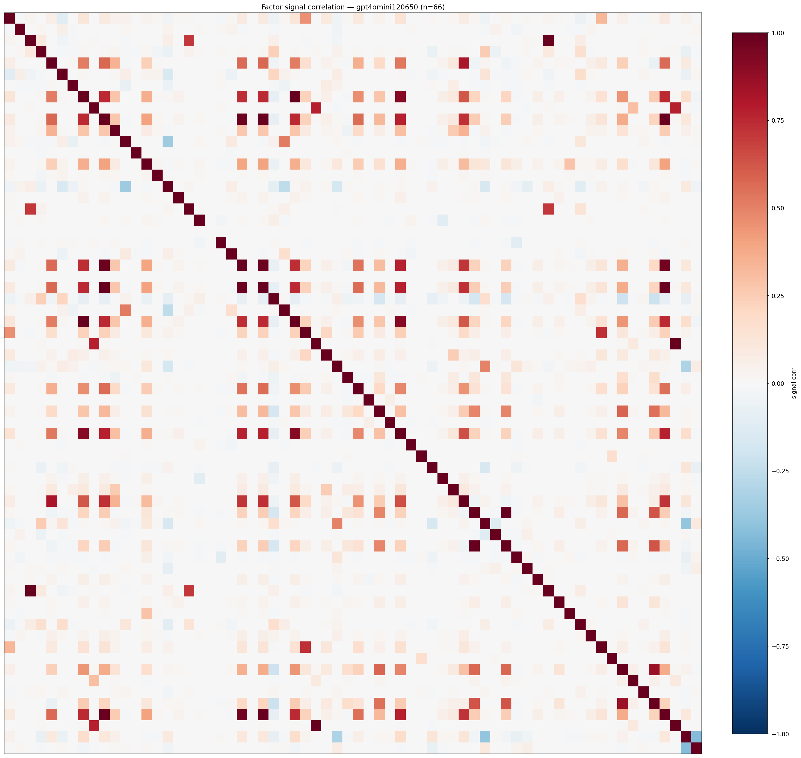

*Signal correlation matrix — gpt4omini120650*

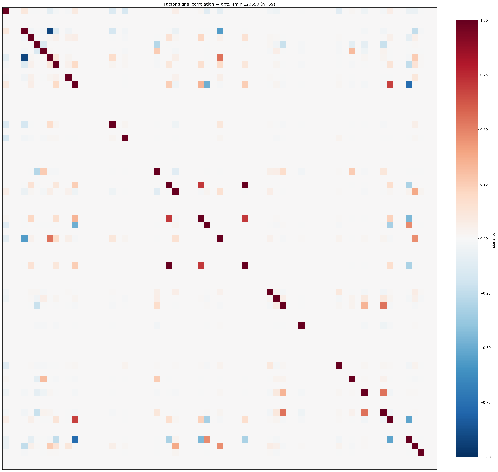

*Signal correlation matrix — gpt5.4mini120650*

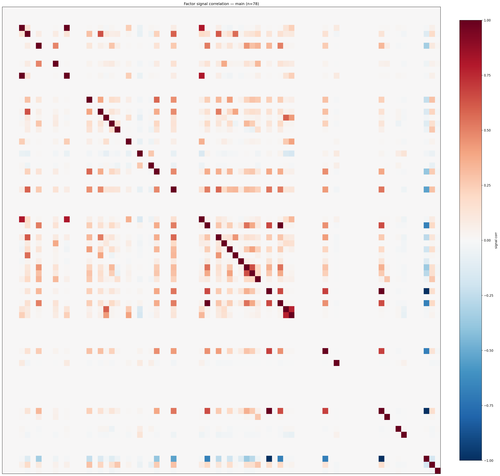

*Signal correlation matrix — main*

## 3. Deflation & model-based importance

`deflated_best_ic` haircuts each zoo's best |IC| for the number of factors tried (`ic_n_tested`) — a bigger zoo's best factor is more likely to be lucky. `lasso_n_nonzero` / `lasso_sparsity` show how many factors a sparse linear model actually keeps (model-view redundancy).

| prerun | best_ic | deflated_best_ic | deflated_best_t | ic_n_tested | ic_n_obs | lasso_n_nonzero | lasso_sparsity |
| --- | --- | --- | --- | --- | --- | --- | --- |
| gpt4omini120650 | 0.0133 | 0.0058 | 2.2004 | 64 | 145079 | 0 | 1.0 |
| gpt5.4mini120650 | 0.0151 | 0.0082 | 3.1136 | 31 | 145079 | 0 | 1.0 |
| main | 0.0244 | 0.0173 | 6.592 | 38 | 145079 | 0 | 1.0 |

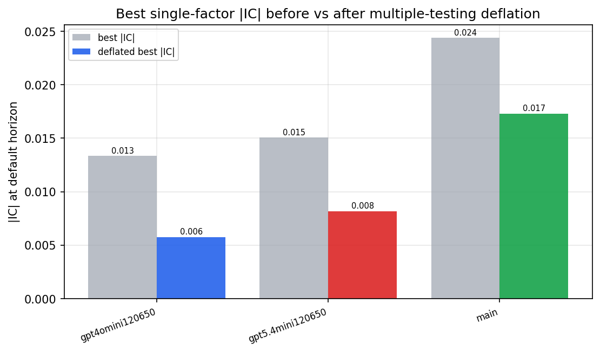

*Best |IC| before vs after multiple-testing deflation*

*Top factors by lasso importance per zoo*

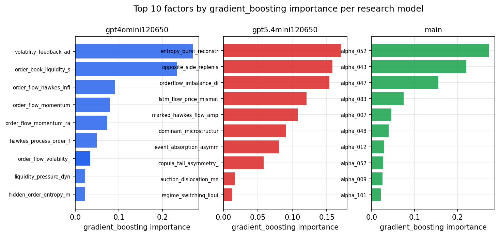

*Top factors by gradient_boosting importance per zoo*

## 4. ML-combined signal — per-underlying vectorised backtest

Each model combines a prerun's factors into ONE signal (fit `factors → forward return` on IS, predict per (bar, underlying)), then that combined signal is run through a simple vectorised backtest — `position(signal) × the underlying's own forward return` — on the held-out OOS tail (+ an equal-weight ensemble). No cross-sectional ranking.

> Config: position=**threshold** (t=1.0, z-score `expanding`), aggregation=**portfolio**, fit-standardise=**per_underlying**, horizon=6.

| prerun | model | n_factors_used | oos_ic | oos_sharpe | is_sharpe | oos_ann_return | oos_max_drawdown |
| --- | --- | --- | --- | --- | --- | --- | --- |
| gpt4omini120650 | linear_regression | 66 | 0.0272 | 5.2346 | 5.4631 | 0.4357 | -0.0125 |
| gpt4omini120650 | ridge | 66 | 0.0279 | 5.6275 | 5.4653 | 0.3795 | -0.011 |
| gpt4omini120650 | lasso | 66 | -0.0015 | -0.9603 | 1.3772 | -0.0476 | -0.0115 |
| gpt4omini120650 | elastic_net | 66 | -0.0015 | -0.9603 | 1.3772 | -0.0476 | -0.0115 |
| gpt4omini120650 | random_forest | 66 | 0.0192 | -2.9112 | 11.1144 | -0.3828 | -0.0448 |
| gpt4omini120650 | gradient_boosting | 66 | 0.0062 | -4.7832 | 7.5363 | -0.1499 | -0.0151 |
| gpt4omini120650 | xgboost | 66 | 0.0096 | 3.0777 | 9.1464 | 0.1305 | -0.008 |
| gpt4omini120650 | lightgbm | 66 | 0.0132 | 1.0267 | 14.5483 | 0.0603 | -0.0122 |
| gpt4omini120650 | ensemble | 66 | 0.0269 | -1.0992 | 11.908 | -0.095 | -0.019 |
| gpt5.4mini120650 | linear_regression | 69 | -0.0122 | -3.4456 | 3.5431 | -0.2051 | -0.03 |
| gpt5.4mini120650 | ridge | 69 | -0.0112 | -3.6574 | 3.7582 | -0.2146 | -0.0298 |
| gpt5.4mini120650 | lasso | 69 | -0.0138 | 4.5127 | -0.2715 | 0.0061 | -0.0002 |
| gpt5.4mini120650 | elastic_net | 69 | -0.0138 | 4.5127 | -0.1195 | 0.0061 | -0.0002 |
| gpt5.4mini120650 | random_forest | 69 | 0.0059 | 0.2614 | 10.7133 | 0.0204 | -0.0246 |
| gpt5.4mini120650 | gradient_boosting | 69 | 0.0099 | -4.0665 | 7.2703 | -0.0472 | -0.006 |
| gpt5.4mini120650 | xgboost | 69 | 0.0096 | 3.7205 | 10.8757 | 0.1591 | -0.0135 |
| gpt5.4mini120650 | lightgbm | 69 | 0.0049 | 5.4882 | 13.0154 | 0.3333 | -0.0068 |
| gpt5.4mini120650 | ensemble | 69 | -0.002 | -0.5008 | 9.1008 | -0.0273 | -0.0229 |
| main | linear_regression | 78 | 0.0075 | 2.5014 | 8.8697 | 0.1453 | -0.0161 |
| main | ridge | 78 | 0.0071 | 2.9893 | 9.0326 | 0.171 | -0.0151 |
| main | lasso | 78 | nan | nan | nan | nan | nan |
| main | elastic_net | 78 | nan | nan | nan | nan | nan |
| main | random_forest | 78 | 0.003 | 2.1832 | 9.8231 | 0.075 | -0.0092 |
| main | gradient_boosting | 78 | -0.007 | 7.7125 | 7.9314 | 0.0998 | -0.0032 |
| main | xgboost | 78 | -0.0061 | -1.9861 | 9.226 | -0.0556 | -0.007 |
| main | lightgbm | 78 | -0.0079 | 1.994 | 13.9685 | 0.0509 | -0.0055 |
| main | ensemble | 78 | 0.0074 | 10.3514 | 4.6735 | 0.0209 | -0.0002 |

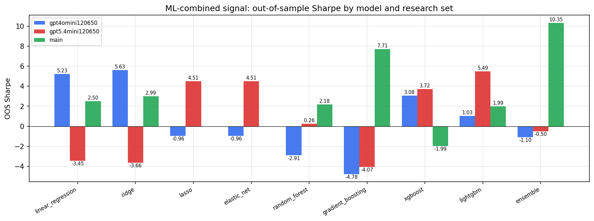

*ML-combined OOS Sharpe by model and research set*

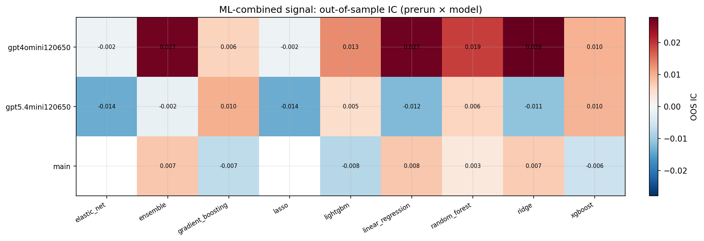

*ML-combined OOS IC (prerun × model)*

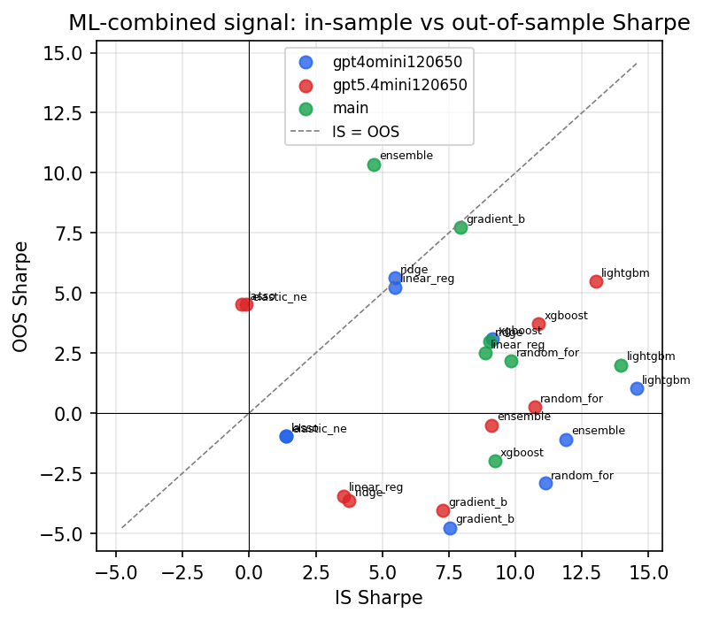

*IS vs OOS Sharpe (overfitting diagnostic)*

---
*Generated by `run_model_comparison.py`. Tables: `*.csv`; interactive: `comparison.ipynb`.*
