# Research-LLM factor comparison — `2026-05`

Comparing the **factor output of different research LLMs** on three axes (raw factor quality → factors as ML features → factors through the full agentic fund). The panel, IS/OOS split, horizon and model hyper-parameters are held identical across preruns — the *only* variable is the factor set.

## Preruns compared

| prerun | research_model | usable_factors | dropped_factors |
| --- | --- | --- | --- |
| gpt4omini120650 | gpt-4o-mini | 66 | 0 |
| gpt5.4mini120650 | gpt-5.4-mini | 69 | 0 |
| main | seed library | 78 | 10 |

> Dropped factors declare fields the current data doesn't have yet (e.g. fundamentals); they light up unchanged once that data is downloaded.

*Usable vs awaiting-data factors per research model*

## Key findings

- **Best ML-combined OOS Sharpe:** `gpt5.4mini120650` with `ridge` (OOS Sharpe = 7.818).
- **Mean OOS Sharpe across models, by research set:** `gpt5.4mini120650` = 5.147, `main` = 2.223, `gpt4omini120650` = 0.241.
- **Highest mean single-factor |IC| (h=6):** `main` (mean |IC| = 0.0094).
- **Most diverse zoo (highest effective/raw factor ratio):** `gpt5.4mini120650` (eff 51.8 of 69, ratio 0.75).
- **Best selection-deflated single-factor |IC|:** `main` (deflated |IC| = 0.0143 from 38 factors tried).

## 1. Single-factor IC (raw factor quality)

Per-underlying time-series Spearman rank-IC of every researched factor, recomputed on the shared panel at horizons h=1, h=6, h=60. The per-underlying IC correlates each factor's value vector with the underlying's own forward-return vector (pooled across underlyings); the cross-sectional IC ranks across underlyings per timestamp.

| prerun | n_factors | mean_abs_ic_1 | mean_abs_ic_6 | mean_abs_ic_60 | mean_abs_icir_6 | best_factor_h6 | best_abs_ic_h6 |
| --- | --- | --- | --- | --- | --- | --- | --- |
| gpt4omini120650 | 66 | 0.0049 | 0.0066 | 0.0086 | 0.3889 | liquidity_provisioning_fee_chasing | 0.0168 |
| gpt5.4mini120650 | 69 | 0.0036 | 0.0066 | 0.0078 | 0.3832 | orderflow_imbalance_divergence | 0.016 |
| main | 78 | 0.0114 | 0.0094 | 0.0086 | 0.6103 | alpha_035 | 0.0213 |

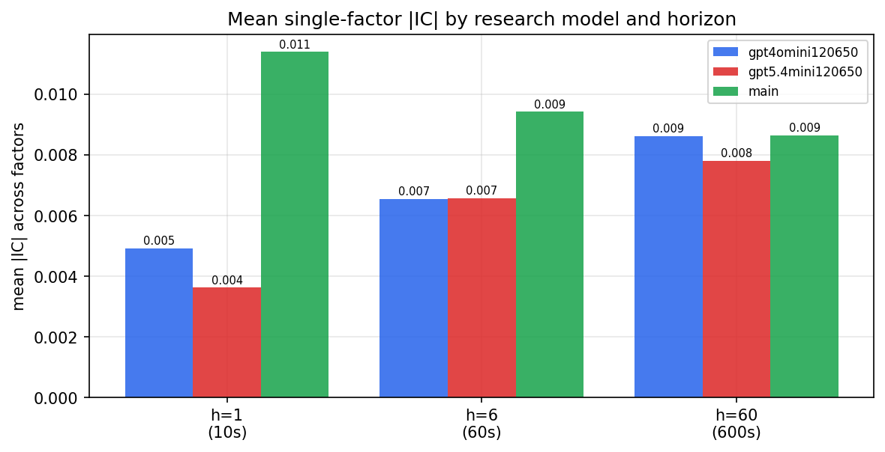

*Mean |IC| by research model and horizon*

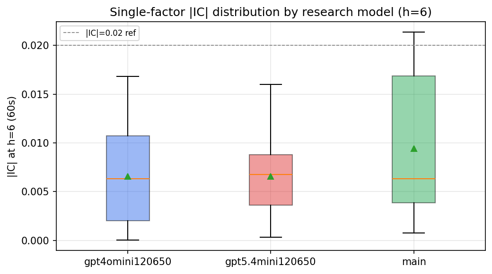

*Per-factor |IC| distribution by research model*

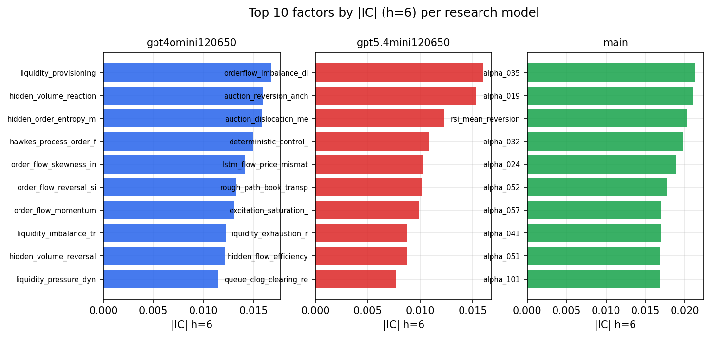

*Top factors by |IC| per research model*

## 2. Factor diversity & redundancy

Pairwise correlation of each zoo's *signals*. `eff_n_factors` is the effective number of independent factors (participation ratio of the correlation eigenvalues); `eff_ratio` and `redundancy` summarise how much unique information the zoo holds vs. how much is duplicated; `n_clusters` groups factors at |corr| ≥ 0.7.

| prerun | n_factors | eff_n_factors | eff_ratio | mean_abs_corr | n_clusters | redundancy |
| --- | --- | --- | --- | --- | --- | --- |
| gpt4omini120650 | 66 | 28.2147 | 0.4275 | 0.0487 | 52 | 0.5725 |
| gpt5.4mini120650 | 69 | 51.7746 | 0.7504 | 0.0117 | 62 | 0.2496 |
| main | 78 | 44.1766 | 0.5664 | 0.0266 | 72 | 0.4336 |

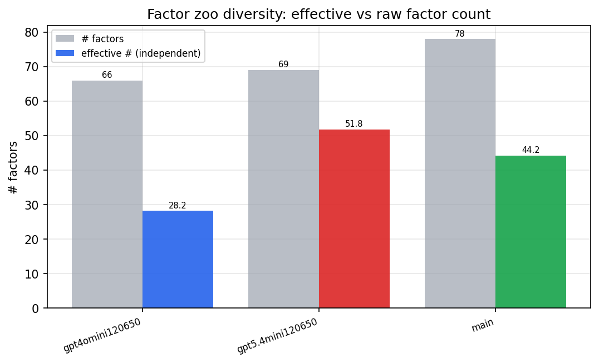

*Effective vs raw factor count per research model*

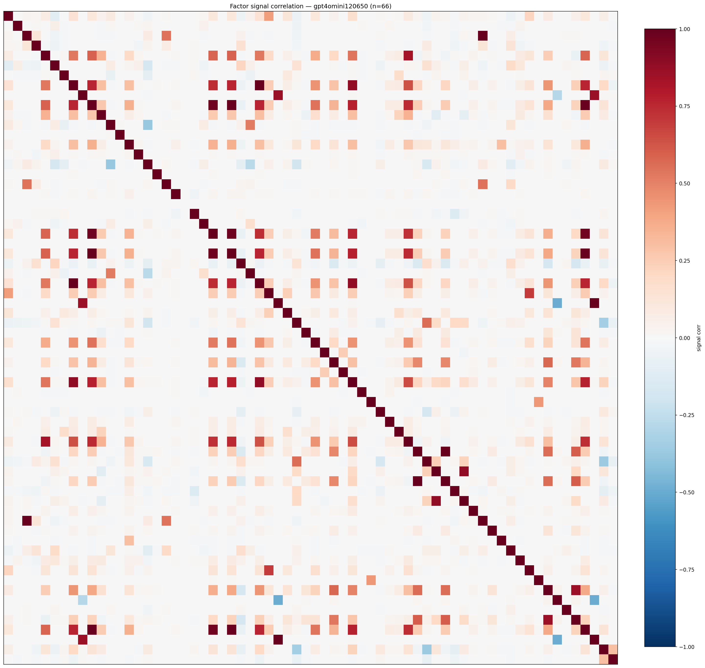

*Signal correlation matrix — gpt4omini120650*

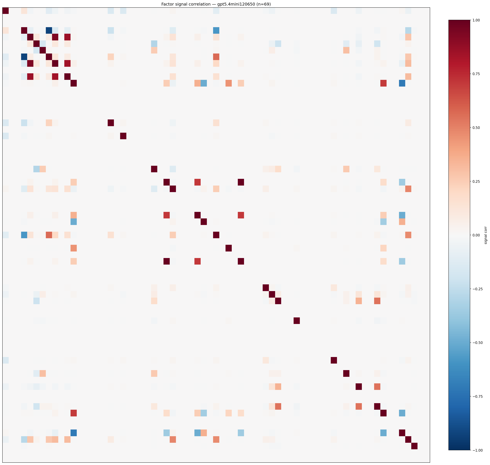

*Signal correlation matrix — gpt5.4mini120650*

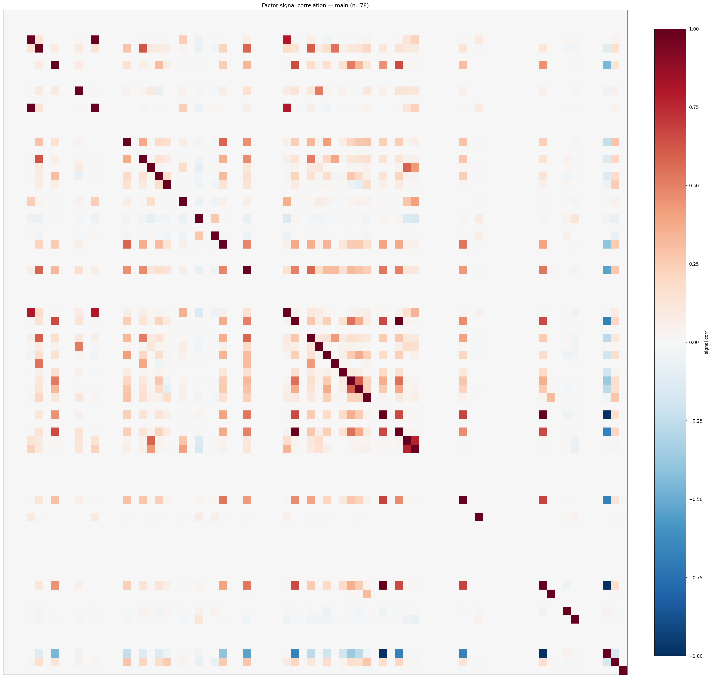

*Signal correlation matrix — main*

## 3. Deflation & model-based importance

`deflated_best_ic` haircuts each zoo's best |IC| for the number of factors tried (`ic_n_tested`) — a bigger zoo's best factor is more likely to be lucky. `lasso_n_nonzero` / `lasso_sparsity` show how many factors a sparse linear model actually keeps (model-view redundancy).

| prerun | best_ic | deflated_best_ic | deflated_best_t | ic_n_tested | ic_n_obs | lasso_n_nonzero | lasso_sparsity |
| --- | --- | --- | --- | --- | --- | --- | --- |
| gpt4omini120650 | 0.0168 | 0.0093 | 3.5692 | 64 | 147419 | 0 | 1.0 |
| gpt5.4mini120650 | 0.016 | 0.0092 | 3.5268 | 31 | 147419 | 0 | 1.0 |
| main | 0.0213 | 0.0143 | 5.4982 | 38 | 147419 | 0 | 1.0 |

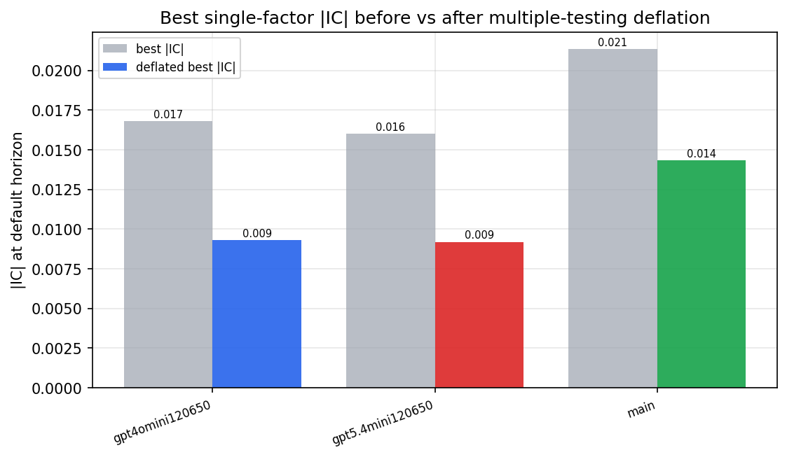

*Best |IC| before vs after multiple-testing deflation*

*Top factors by lasso importance per zoo*

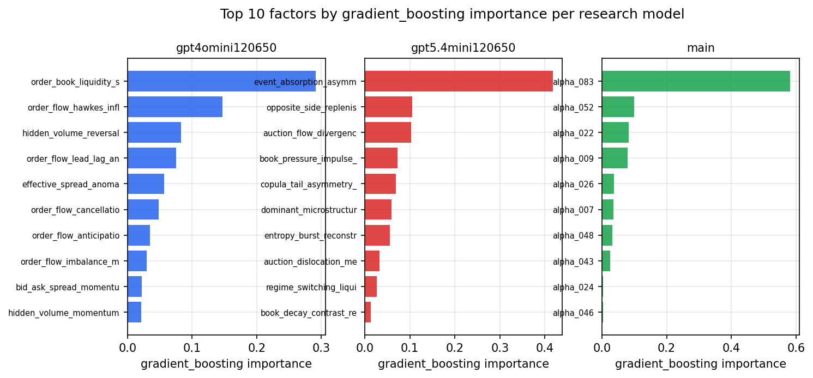

*Top factors by gradient_boosting importance per zoo*

## 4. ML-combined signal — per-underlying vectorised backtest

Each model combines a prerun's factors into ONE signal (fit `factors → forward return` on IS, predict per (bar, underlying)), then that combined signal is run through a simple vectorised backtest — `position(signal) × the underlying's own forward return` — on the held-out OOS tail (+ an equal-weight ensemble). No cross-sectional ranking.

> Config: position=**threshold** (t=1.0, z-score `expanding`), aggregation=**portfolio**, fit-standardise=**per_underlying**, horizon=6.

| prerun | model | n_factors_used | oos_ic | oos_sharpe | is_sharpe | oos_ann_return | oos_max_drawdown |
| --- | --- | --- | --- | --- | --- | --- | --- |
| gpt4omini120650 | linear_regression | 66 | 0.0262 | -1.9902 | 10.1568 | -0.1933 | -0.0329 |
| gpt4omini120650 | ridge | 66 | 0.0268 | -1.9175 | 10.0305 | -0.2161 | -0.0371 |
| gpt4omini120650 | lasso | 66 | 0.0132 | -2.3705 | 6.2998 | -0.197 | -0.0314 |
| gpt4omini120650 | elastic_net | 66 | 0.0132 | -2.3705 | 6.2998 | -0.197 | -0.0314 |
| gpt4omini120650 | random_forest | 66 | 0.0155 | 4.3469 | 10.4012 | 0.3019 | -0.0169 |
| gpt4omini120650 | gradient_boosting | 66 | 0.0146 | 1.375 | 7.9097 | 0.039 | -0.0053 |
| gpt4omini120650 | xgboost | 66 | 0.0146 | -1.5211 | 11.5103 | -0.0636 | -0.0115 |
| gpt4omini120650 | lightgbm | 66 | 0.017 | 2.8649 | 13.4414 | 0.1587 | -0.0094 |
| gpt4omini120650 | ensemble | 66 | 0.024 | 3.75 | 13.0532 | 0.187 | -0.0094 |
| gpt5.4mini120650 | linear_regression | 69 | 0.0372 | 7.7622 | 6.9317 | 0.4854 | -0.0116 |
| gpt5.4mini120650 | ridge | 69 | 0.0382 | 7.8181 | 6.4787 | 0.4943 | -0.0107 |
| gpt5.4mini120650 | lasso | 69 | nan | nan | nan | nan | nan |
| gpt5.4mini120650 | elastic_net | 69 | nan | nan | nan | nan | nan |
| gpt5.4mini120650 | random_forest | 69 | 0.0352 | 7.1462 | 10.7295 | 0.5751 | -0.0087 |
| gpt5.4mini120650 | gradient_boosting | 69 | 0.0318 | 3.2535 | 7.8578 | 0.0455 | -0.0026 |
| gpt5.4mini120650 | xgboost | 69 | 0.0297 | 7.4163 | 13.1555 | 0.4336 | -0.0083 |
| gpt5.4mini120650 | lightgbm | 69 | 0.0207 | -2.3809 | 13.6411 | -0.0932 | -0.0156 |
| gpt5.4mini120650 | ensemble | 69 | 0.0386 | 5.014 | 11.801 | 0.3347 | -0.0114 |
| main | linear_regression | 78 | 0.0072 | 0.7445 | 7.8091 | 0.0314 | -0.0175 |
| main | ridge | 78 | 0.0102 | 1.1208 | 7.5215 | 0.0477 | -0.0173 |
| main | lasso | 78 | nan | nan | nan | nan | nan |
| main | elastic_net | 78 | nan | nan | nan | nan | nan |
| main | random_forest | 78 | 0.0122 | 5.057 | 6.5617 | 0.1748 | -0.004 |
| main | gradient_boosting | 78 | 0.001 | -3.1129 | 6.3917 | -0.0339 | -0.004 |
| main | xgboost | 78 | 0.0011 | 1.3331 | 6.3829 | 0.0321 | -0.0031 |
| main | lightgbm | 78 | -0.0002 | 5.2294 | 10.8462 | 0.0927 | -0.0028 |
| main | ensemble | 78 | 0.0111 | 5.1883 | 8.9746 | 0.1315 | -0.0048 |

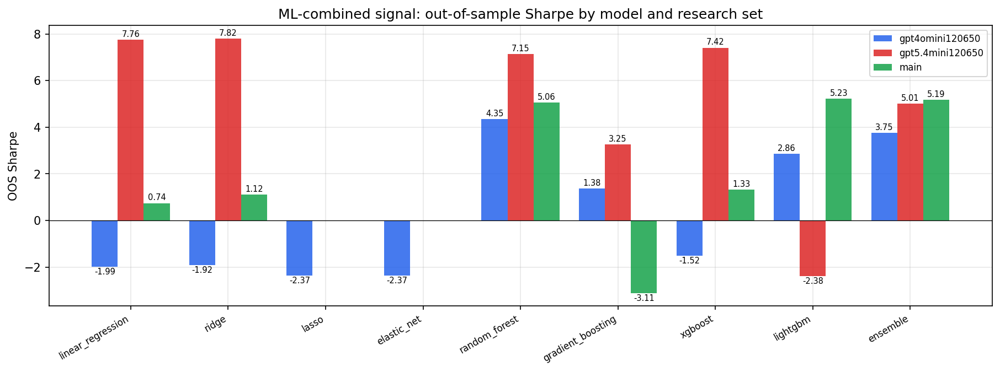

*ML-combined OOS Sharpe by model and research set*

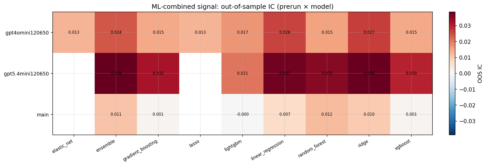

*ML-combined OOS IC (prerun × model)*

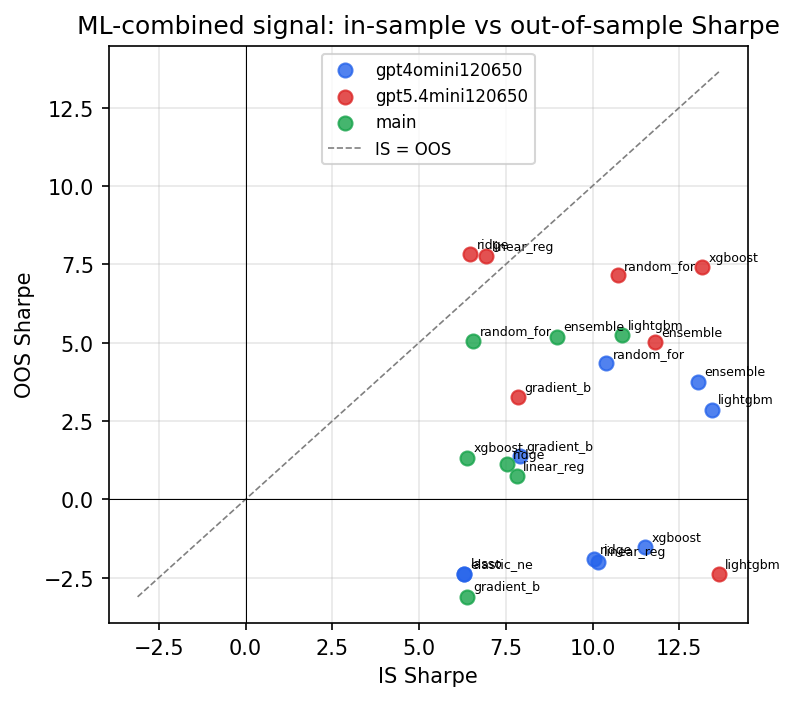

*IS vs OOS Sharpe (overfitting diagnostic)*

---
*Generated by `run_model_comparison.py`. Tables: `*.csv`; interactive: `comparison.ipynb`.*
