# Research-LLM factor comparison — `2026-06`

Comparing the **factor output of different research LLMs** on three axes (raw factor quality → factors as ML features → factors through the full agentic fund). The panel, IS/OOS split, horizon and model hyper-parameters are held identical across preruns — the *only* variable is the factor set.

## Preruns compared

| prerun | research_model | usable_factors | dropped_factors |
| --- | --- | --- | --- |
| gpt4omini120650 | gpt-4o-mini | 66 | 0 |
| gpt5.4mini120650 | gpt-5.4-mini | 69 | 0 |
| main | seed library | 78 | 10 |

> Dropped factors declare fields the current data doesn't have yet (e.g. fundamentals); they light up unchanged once that data is downloaded.

*Usable vs awaiting-data factors per research model*

## Key findings

- **Best ML-combined OOS Sharpe:** `gpt5.4mini120650` with `gradient_boosting` (OOS Sharpe = 26.732).
- **Mean OOS Sharpe across models, by research set:** `gpt5.4mini120650` = 14.215, `main` = 7.517, `gpt4omini120650` = 6.614.
- **Highest mean single-factor |IC| (h=6):** `main` (mean |IC| = 0.0147).
- **Most diverse zoo (highest effective/raw factor ratio):** `gpt5.4mini120650` (eff 50.8 of 69, ratio 0.74).
- **Best selection-deflated single-factor |IC|:** `main` (deflated |IC| = 0.0250 from 38 factors tried).

## 1. Single-factor IC (raw factor quality)

Per-underlying time-series Spearman rank-IC of every researched factor, recomputed on the shared panel at horizons h=1, h=6, h=60. The per-underlying IC correlates each factor's value vector with the underlying's own forward-return vector (pooled across underlyings); the cross-sectional IC ranks across underlyings per timestamp.

| prerun | n_factors | mean_abs_ic_1 | mean_abs_ic_6 | mean_abs_ic_60 | mean_abs_icir_6 | best_factor_h6 | best_abs_ic_h6 |
| --- | --- | --- | --- | --- | --- | --- | --- |
| gpt4omini120650 | 66 | 0.0066 | 0.01 | 0.0109 | 0.5158 | order_flow_reversal_signal | 0.024 |
| gpt5.4mini120650 | 69 | 0.0045 | 0.006 | 0.0096 | 0.4085 | lstm_flow_price_mismatch | 0.023 |
| main | 78 | 0.0133 | 0.0147 | 0.011 | 0.8695 | alpha_019 | 0.0336 |

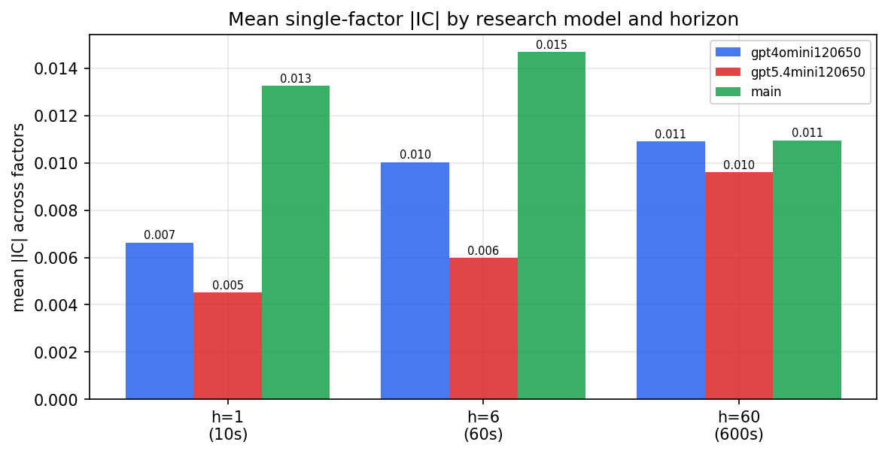

*Mean |IC| by research model and horizon*

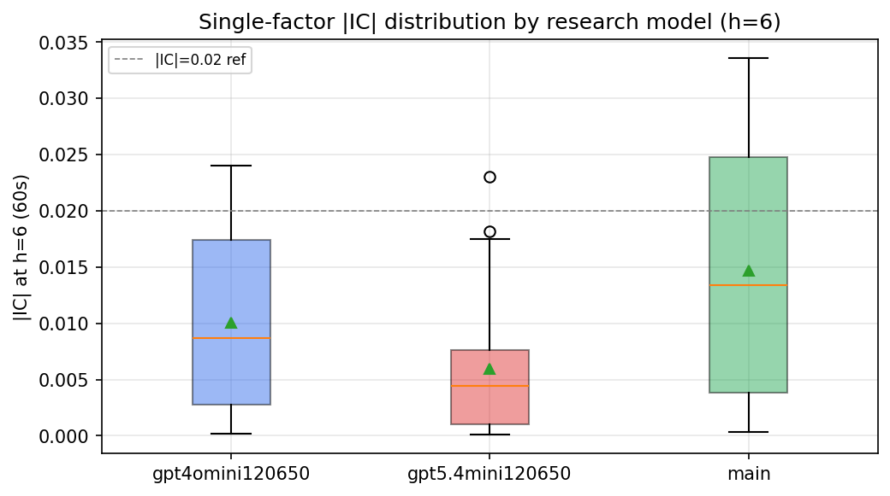

*Per-factor |IC| distribution by research model*

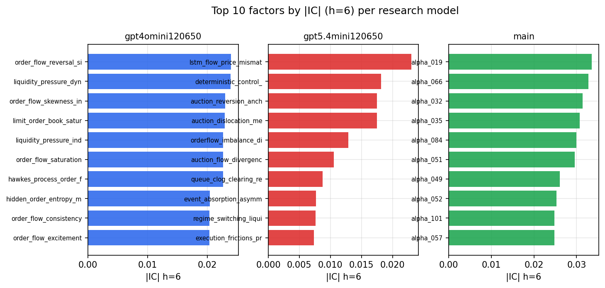

*Top factors by |IC| per research model*

## 2. Factor diversity & redundancy

Pairwise correlation of each zoo's *signals*. `eff_n_factors` is the effective number of independent factors (participation ratio of the correlation eigenvalues); `eff_ratio` and `redundancy` summarise how much unique information the zoo holds vs. how much is duplicated; `n_clusters` groups factors at |corr| ≥ 0.7.

| prerun | n_factors | eff_n_factors | eff_ratio | mean_abs_corr | n_clusters | redundancy |
| --- | --- | --- | --- | --- | --- | --- |
| gpt4omini120650 | 66 | 28.1529 | 0.4266 | 0.0492 | 51 | 0.5734 |
| gpt5.4mini120650 | 69 | 50.7669 | 0.7358 | 0.012 | 62 | 0.2642 |
| main | 78 | 44.792 | 0.5743 | 0.0263 | 72 | 0.4257 |

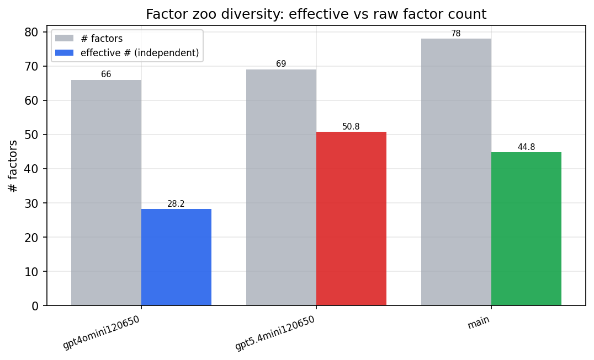

*Effective vs raw factor count per research model*

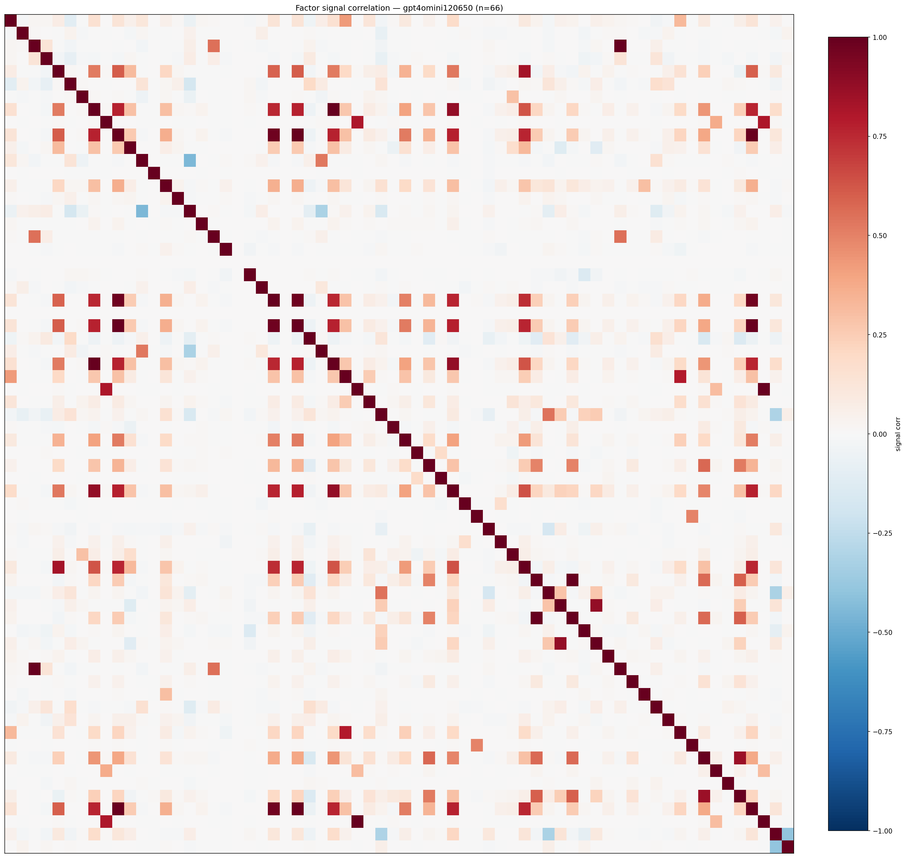

*Signal correlation matrix — gpt4omini120650*

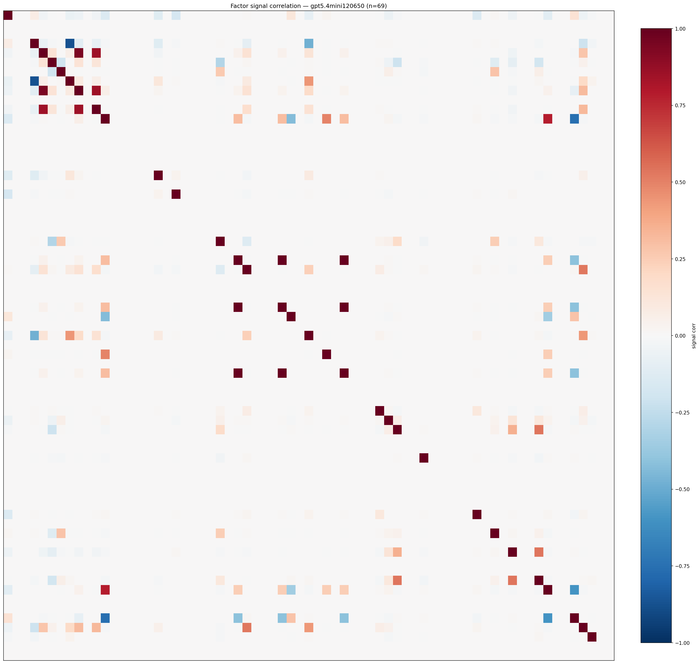

*Signal correlation matrix — gpt5.4mini120650*

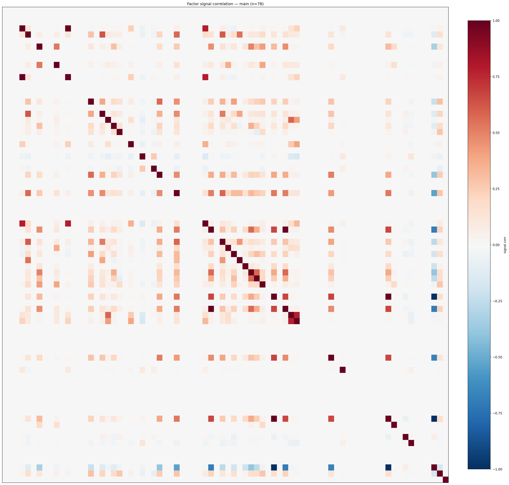

*Signal correlation matrix — main*

## 3. Deflation & model-based importance

`deflated_best_ic` haircuts each zoo's best |IC| for the number of factors tried (`ic_n_tested`) — a bigger zoo's best factor is more likely to be lucky. `lasso_n_nonzero` / `lasso_sparsity` show how many factors a sparse linear model actually keeps (model-view redundancy).

| prerun | best_ic | deflated_best_ic | deflated_best_t | ic_n_tested | ic_n_obs | lasso_n_nonzero | lasso_sparsity |
| --- | --- | --- | --- | --- | --- | --- | --- |
| gpt4omini120650 | 0.024 | 0.0148 | 4.6446 | 64 | 98279 | 0 | 1.0 |
| gpt5.4mini120650 | 0.023 | 0.0147 | 4.6023 | 31 | 98279 | 0 | 1.0 |
| main | 0.0336 | 0.025 | 7.8237 | 38 | 98279 | 15 | 0.8077 |

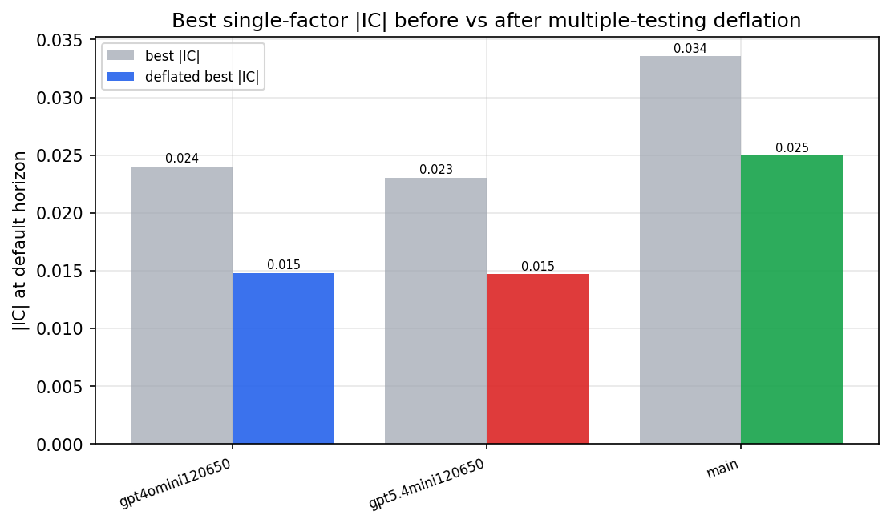

*Best |IC| before vs after multiple-testing deflation*

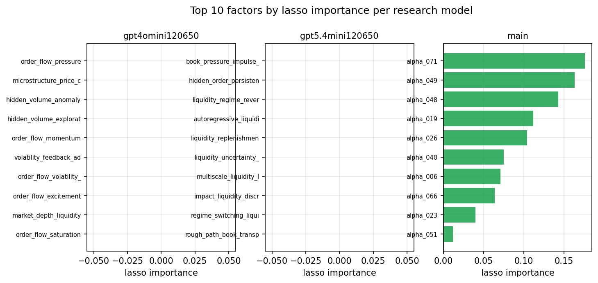

*Top factors by lasso importance per zoo*

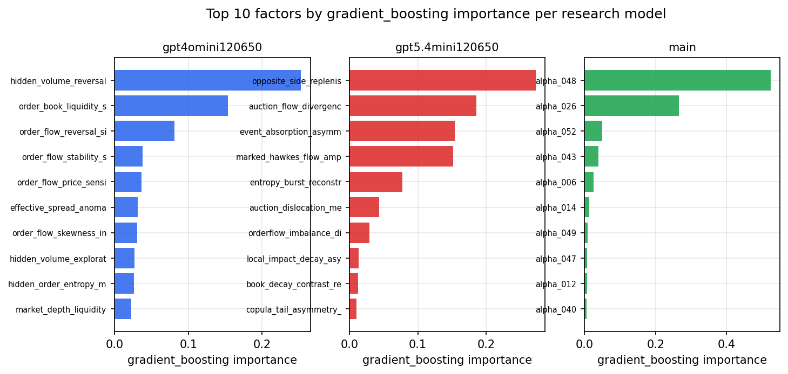

*Top factors by gradient_boosting importance per zoo*

## 4. ML-combined signal — per-underlying vectorised backtest

Each model combines a prerun's factors into ONE signal (fit `factors → forward return` on IS, predict per (bar, underlying)), then that combined signal is run through a simple vectorised backtest — `position(signal) × the underlying's own forward return` — on the held-out OOS tail (+ an equal-weight ensemble). No cross-sectional ranking.

> Config: position=**threshold** (t=1.0, z-score `expanding`), aggregation=**portfolio**, fit-standardise=**per_underlying**, horizon=6.

| prerun | model | n_factors_used | oos_ic | oos_sharpe | is_sharpe | oos_ann_return | oos_max_drawdown |
| --- | --- | --- | --- | --- | --- | --- | --- |
| gpt4omini120650 | linear_regression | 66 | -0.0208 | -12.2616 | 8.4226 | -0.4458 | -0.0031 |
| gpt4omini120650 | ridge | 66 | -0.02 | -8.8841 | 7.9678 | -0.317 | -0.0025 |
| gpt4omini120650 | lasso | 66 | nan | nan | nan | nan | nan |
| gpt4omini120650 | elastic_net | 66 | nan | nan | nan | nan | nan |
| gpt4omini120650 | random_forest | 66 | 0.0153 | 7.929 | 9.9575 | 0.2336 | -0.0022 |
| gpt4omini120650 | gradient_boosting | 66 | 0.0333 | 16.9409 | 6.6043 | 0.1353 | -0.0003 |
| gpt4omini120650 | xgboost | 66 | 0.0181 | 17.9023 | 8.6794 | 0.1113 | -0.0003 |
| gpt4omini120650 | lightgbm | 66 | 0.0096 | 21.3247 | 12.0502 | 0.1803 | -0.0004 |
| gpt4omini120650 | ensemble | 66 | -0.0124 | 3.3446 | 10.1264 | 0.0856 | -0.0022 |
| gpt5.4mini120650 | linear_regression | 69 | 0.0137 | 9.8452 | 7.0611 | 0.4712 | -0.0026 |
| gpt5.4mini120650 | ridge | 69 | 0.0193 | 17.528 | 7.4409 | 0.7963 | -0.0016 |
| gpt5.4mini120650 | lasso | 69 | nan | nan | nan | nan | nan |
| gpt5.4mini120650 | elastic_net | 69 | nan | nan | nan | nan | nan |
| gpt5.4mini120650 | random_forest | 69 | 0.0114 | 16.7974 | 11.0622 | 0.4798 | -0.0009 |
| gpt5.4mini120650 | gradient_boosting | 69 | 0.0417 | 26.732 | 10.6588 | 0.4428 | -0.0005 |
| gpt5.4mini120650 | xgboost | 69 | 0.0187 | 3.3794 | 13.349 | 0.0794 | -0.0012 |
| gpt5.4mini120650 | lightgbm | 69 | 0.0071 | 6.6352 | 14.777 | 0.1024 | -0.0009 |
| gpt5.4mini120650 | ensemble | 69 | 0.0215 | 18.5858 | 9.3907 | 0.1896 | -0.0002 |
| main | linear_regression | 78 | 0.0002 | 13.1205 | 8.8764 | 0.6026 | -0.0017 |
| main | ridge | 78 | -0.0021 | 6.5521 | 8.6457 | 0.2953 | -0.0021 |
| main | lasso | 78 | 0.018 | 1.6763 | 8.2223 | 0.0934 | -0.0029 |
| main | elastic_net | 78 | 0.0172 | 2.4507 | 8.1104 | 0.1367 | -0.0028 |
| main | random_forest | 78 | 0.0123 | 12.724 | 11.4972 | 0.3476 | -0.0013 |
| main | gradient_boosting | 78 | 0.0294 | 6.9382 | 11.3135 | 0.1077 | -0.0007 |
| main | xgboost | 78 | 0.0151 | 0.234 | 12.9676 | 0.0047 | -0.001 |
| main | lightgbm | 78 | 0.0228 | 12.0115 | 15.2321 | 0.2663 | -0.0011 |
| main | ensemble | 78 | 0.0128 | 11.9495 | 12.8843 | 0.5335 | -0.0014 |

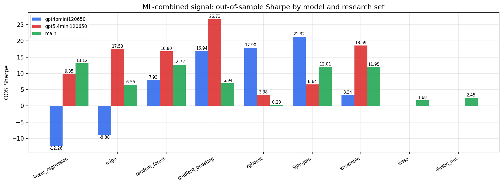

*ML-combined OOS Sharpe by model and research set*

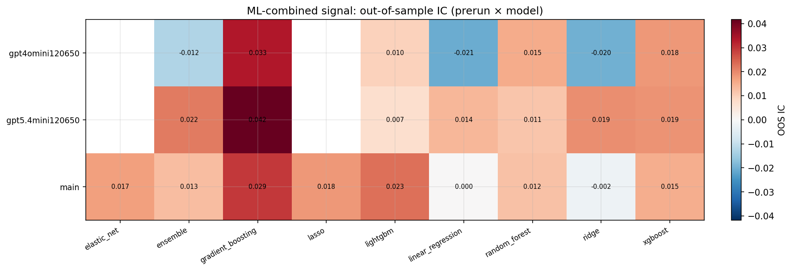

*ML-combined OOS IC (prerun × model)*

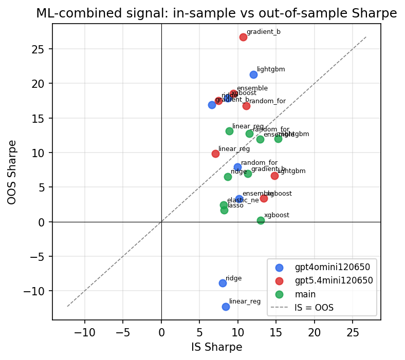

*IS vs OOS Sharpe (overfitting diagnostic)*

---
*Generated by `run_model_comparison.py`. Tables: `*.csv`; interactive: `comparison.ipynb`.*
