# Research-LLM factor comparison — `2024-03`

Comparing the **factor output of different research LLMs** on three axes (raw factor quality → factors as ML features → factors through the full agentic fund). The panel, IS/OOS split, horizon and model hyper-parameters are held identical across preruns — the *only* variable is the factor set.

## Preruns compared

| prerun | research_model | usable_factors | dropped_factors |
| --- | --- | --- | --- |
| gpt4omini120650 | gpt-4o-mini | 66 | 0 |
| gpt5.4mini120650 | gpt-5.4-mini | 69 | 0 |
| main | seed library | 78 | 10 |

> Dropped factors declare fields the current data doesn't have yet (e.g. fundamentals); they light up unchanged once that data is downloaded.

*Usable vs awaiting-data factors per research model*

## Key findings

- **Best ML-combined OOS Sharpe:** `gpt4omini120650` with `random_forest` (OOS Sharpe = 40.960).
- **Mean OOS Sharpe across models, by research set:** `gpt5.4mini120650` = 22.132, `gpt4omini120650` = 16.176, `main` = 7.223.
- **Highest mean single-factor |IC| (h=6):** `gpt4omini120650` (mean |IC| = 0.0286).
- **Most diverse zoo (highest effective/raw factor ratio):** `gpt5.4mini120650` (eff 55.2 of 69, ratio 0.80).
- **Best selection-deflated single-factor |IC|:** `gpt4omini120650` (deflated |IC| = 0.1073 from 64 factors tried).

## 1. Single-factor IC (raw factor quality)

Per-underlying time-series Spearman rank-IC of every researched factor, recomputed on the shared panel at horizons h=1, h=6, h=60. The per-underlying IC correlates each factor's value vector with the underlying's own forward-return vector (pooled across underlyings); the cross-sectional IC ranks across underlyings per timestamp.

| prerun | n_factors | mean_abs_ic_1 | mean_abs_ic_6 | mean_abs_ic_60 | mean_abs_icir_6 | best_factor_h6 | best_abs_ic_h6 |
| --- | --- | --- | --- | --- | --- | --- | --- |
| gpt4omini120650 | 66 | 0.0371 | 0.0286 | 0.0122 | 1.3758 | limit_order_book_imbalance_surge | 0.1149 |
| gpt5.4mini120650 | 69 | 0.0241 | 0.0198 | 0.0095 | 1.1481 | orderflow_imbalance_divergence | 0.1021 |
| main | 78 | 0.041 | 0.0271 | 0.0175 | 1.2495 | alpha_054 | 0.0739 |

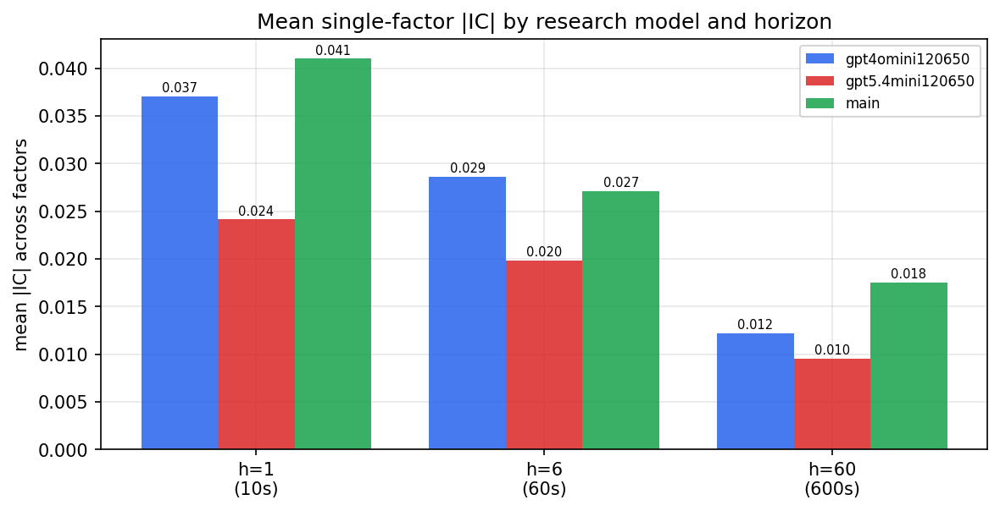

*Mean |IC| by research model and horizon*

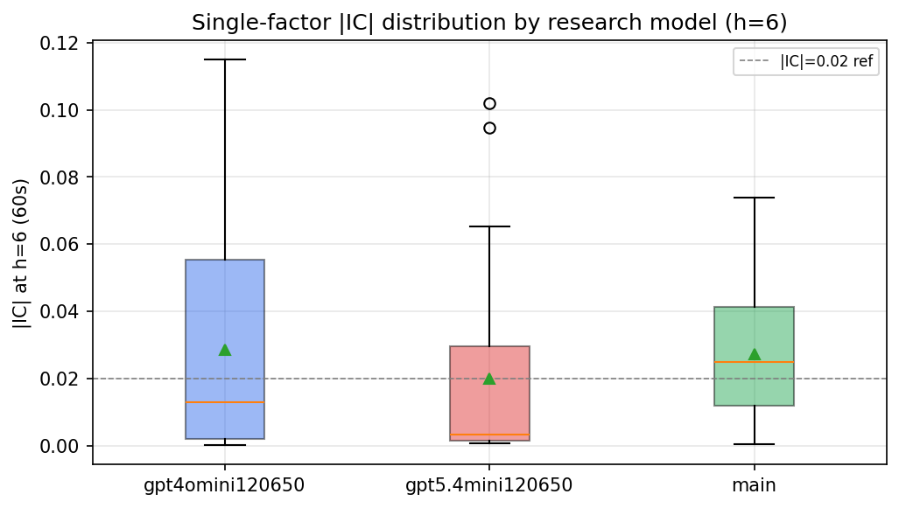

*Per-factor |IC| distribution by research model*

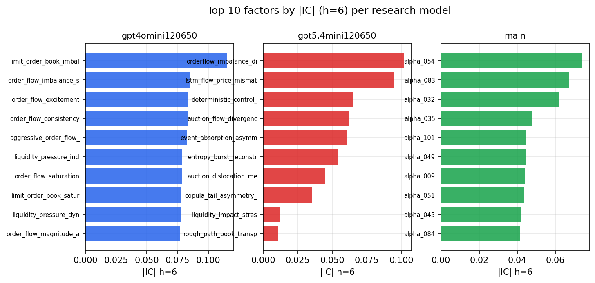

*Top factors by |IC| per research model*

## 2. Factor diversity & redundancy

Pairwise correlation of each zoo's *signals*. `eff_n_factors` is the effective number of independent factors (participation ratio of the correlation eigenvalues); `eff_ratio` and `redundancy` summarise how much unique information the zoo holds vs. how much is duplicated; `n_clusters` groups factors at |corr| ≥ 0.7.

| prerun | n_factors | eff_n_factors | eff_ratio | mean_abs_corr | n_clusters | redundancy |
| --- | --- | --- | --- | --- | --- | --- |
| gpt4omini120650 | 66 | 29.8717 | 0.4526 | 0.045 | 54 | 0.5474 |
| gpt5.4mini120650 | 69 | 55.2422 | 0.8006 | 0.0106 | 65 | 0.1994 |
| main | 78 | 37.2609 | 0.4777 | 0.0384 | 65 | 0.5223 |

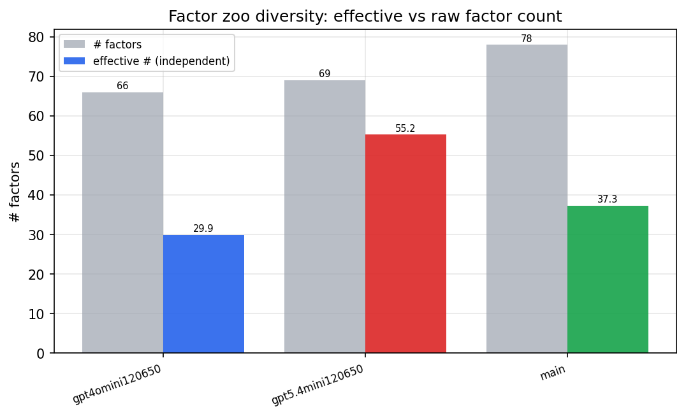

*Effective vs raw factor count per research model*

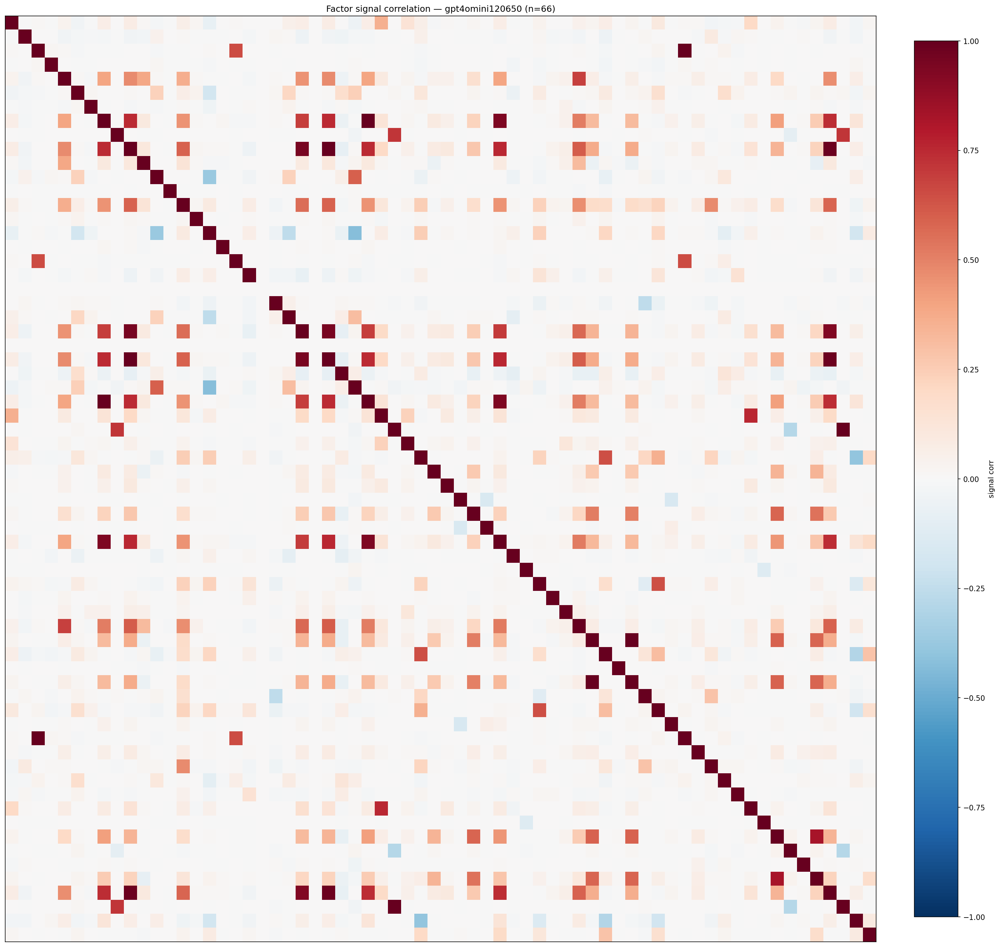

*Signal correlation matrix — gpt4omini120650*

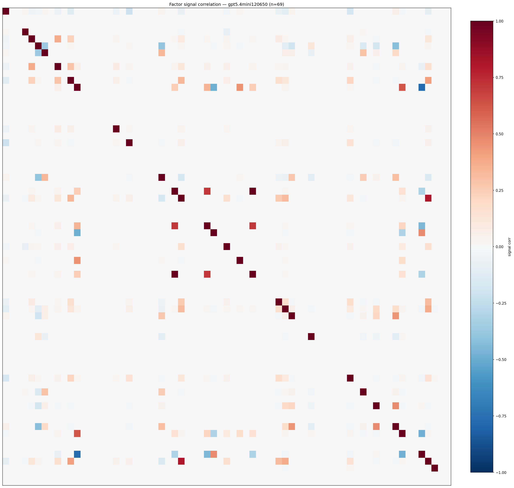

*Signal correlation matrix — gpt5.4mini120650*

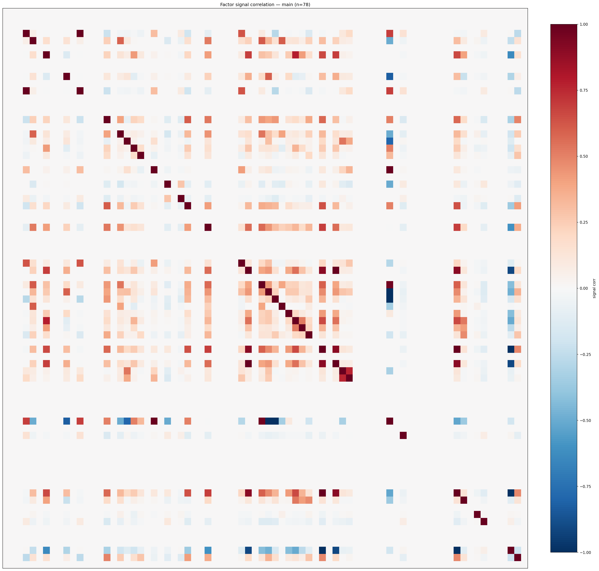

*Signal correlation matrix — main*

## 3. Deflation & model-based importance

`deflated_best_ic` haircuts each zoo's best |IC| for the number of factors tried (`ic_n_tested`) — a bigger zoo's best factor is more likely to be lucky. `lasso_n_nonzero` / `lasso_sparsity` show how many factors a sparse linear model actually keeps (model-view redundancy).

| prerun | best_ic | deflated_best_ic | deflated_best_t | ic_n_tested | ic_n_obs | lasso_n_nonzero | lasso_sparsity |
| --- | --- | --- | --- | --- | --- | --- | --- |
| gpt4omini120650 | 0.1149 | 0.1073 | 40.5444 | 64 | 142739 | 10 | 0.8485 |
| gpt5.4mini120650 | 0.1021 | 0.0952 | 35.9626 | 30 | 142739 | 11 | 0.8406 |
| main | 0.0739 | 0.0668 | 25.2377 | 37 | 142739 | 2 | 0.9744 |

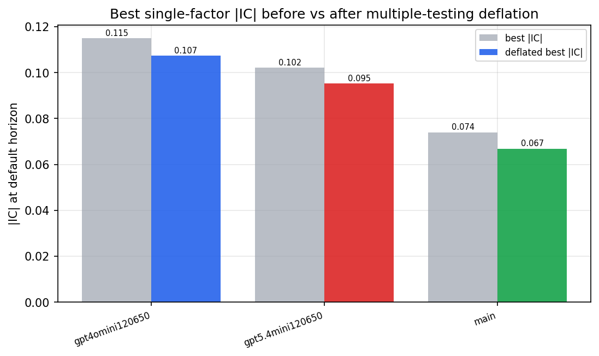

*Best |IC| before vs after multiple-testing deflation*

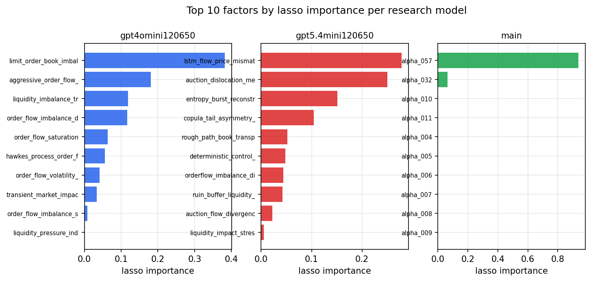

*Top factors by lasso importance per zoo*

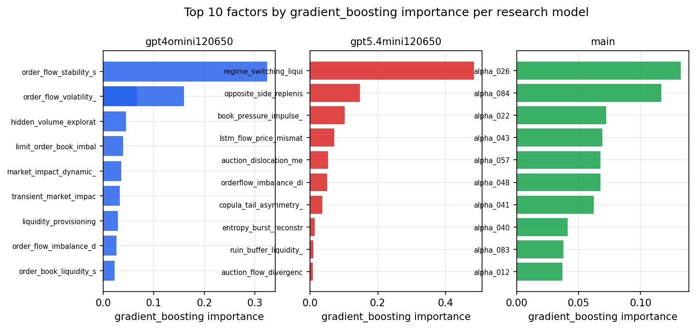

*Top factors by gradient_boosting importance per zoo*

## 4. ML-combined signal — per-underlying vectorised backtest

Each model combines a prerun's factors into ONE signal (fit `factors → forward return` on IS, predict per (bar, underlying)), then that combined signal is run through a simple vectorised backtest — `position(signal) × the underlying's own forward return` — on the held-out OOS tail (+ an equal-weight ensemble). No cross-sectional ranking.

> Config: position=**threshold** (t=1.0, z-score `expanding`), aggregation=**portfolio**, fit-standardise=**per_underlying**, horizon=6.

| prerun | model | n_factors_used | oos_ic | oos_sharpe | is_sharpe | oos_ann_return | oos_max_drawdown |
| --- | --- | --- | --- | --- | --- | --- | --- |
| gpt4omini120650 | linear_regression | 66 | 0.1536 | 4.9823 | 20.0016 | 0.0313 | -0.0007 |
| gpt4omini120650 | ridge | 66 | 0.1555 | 4.8458 | 19.5743 | 0.0306 | -0.0009 |
| gpt4omini120650 | lasso | 66 | 0.1713 | 30.2128 | 28.6594 | 0.3398 | -0.0015 |
| gpt4omini120650 | elastic_net | 66 | 0.173 | 32.1351 | 31.1682 | 0.3816 | -0.0013 |
| gpt4omini120650 | random_forest | 66 | 0.1585 | 40.9603 | 27.0574 | 0.8352 | -0.0015 |
| gpt4omini120650 | gradient_boosting | 66 | 0.1538 | 4.9127 | 10.8926 | 0.0365 | -0.0009 |
| gpt4omini120650 | xgboost | 66 | 0.1653 | 3.0385 | 15.6452 | 0.0315 | -0.002 |
| gpt4omini120650 | lightgbm | 66 | 0.1692 | 7.4251 | 17.735 | 0.1186 | -0.0019 |
| gpt4omini120650 | ensemble | 66 | 0.165 | 17.0709 | 21.0222 | 0.2847 | -0.0013 |
| gpt5.4mini120650 | linear_regression | 69 | 0.1664 | 25.6121 | 16.8787 | 0.5258 | -0.0024 |
| gpt5.4mini120650 | ridge | 69 | 0.165 | 25.5105 | 16.1091 | 0.524 | -0.0025 |
| gpt5.4mini120650 | lasso | 69 | 0.1706 | 28.9551 | 17.5284 | 0.555 | -0.0018 |
| gpt5.4mini120650 | elastic_net | 69 | 0.1727 | 30.623 | 17.4486 | 0.5674 | -0.0016 |
| gpt5.4mini120650 | random_forest | 69 | 0.1905 | 38.5965 | 23.2766 | 0.8693 | -0.0021 |
| gpt5.4mini120650 | gradient_boosting | 69 | 0.1622 | 4.7003 | 5.5466 | 0.0429 | -0.0011 |
| gpt5.4mini120650 | xgboost | 69 | 0.1995 | 8.7854 | 15.1821 | 0.1157 | -0.0007 |
| gpt5.4mini120650 | lightgbm | 69 | 0.2011 | 7.3665 | 14.5425 | 0.066 | -0.0009 |
| gpt5.4mini120650 | ensemble | 69 | 0.1962 | 29.037 | 18.2136 | 0.5251 | -0.0016 |
| main | linear_regression | 78 | 0.0205 | 3.5514 | 15.8112 | 0.0454 | -0.0027 |
| main | ridge | 78 | 0.0215 | 3.3613 | 16.4054 | 0.0447 | -0.0028 |
| main | lasso | 78 | 0.0413 | 12.6913 | 19.318 | 0.0797 | -0.0008 |
| main | elastic_net | 78 | 0.0412 | 12.6913 | 19.3594 | 0.0797 | -0.0008 |
| main | random_forest | 78 | 0.0447 | 9.1842 | 14.5423 | 0.117 | -0.0032 |
| main | gradient_boosting | 78 | 0.0405 | 5.0383 | 14.2646 | 0.0211 | -0.0007 |
| main | xgboost | 78 | 0.0385 | 5.7277 | 14.4627 | 0.0463 | -0.0011 |
| main | lightgbm | 78 | 0.0394 | 2.0576 | 16.1883 | 0.0158 | -0.0014 |
| main | ensemble | 78 | 0.0354 | 10.7006 | 16.4416 | 0.1032 | -0.0015 |

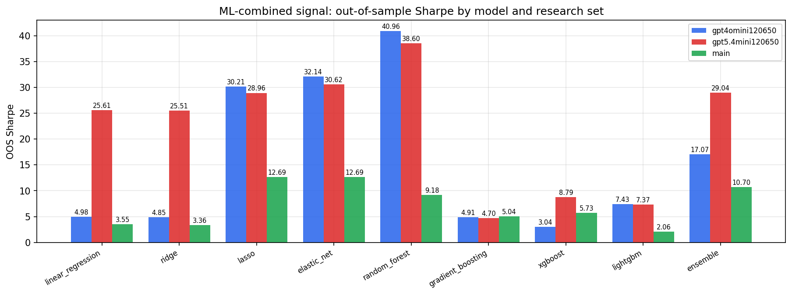

*ML-combined OOS Sharpe by model and research set*

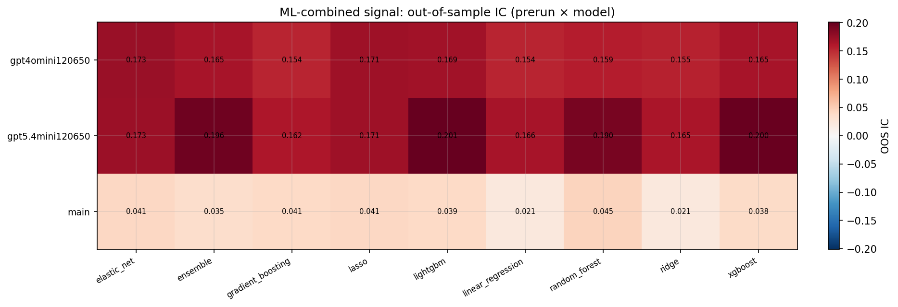

*ML-combined OOS IC (prerun × model)*

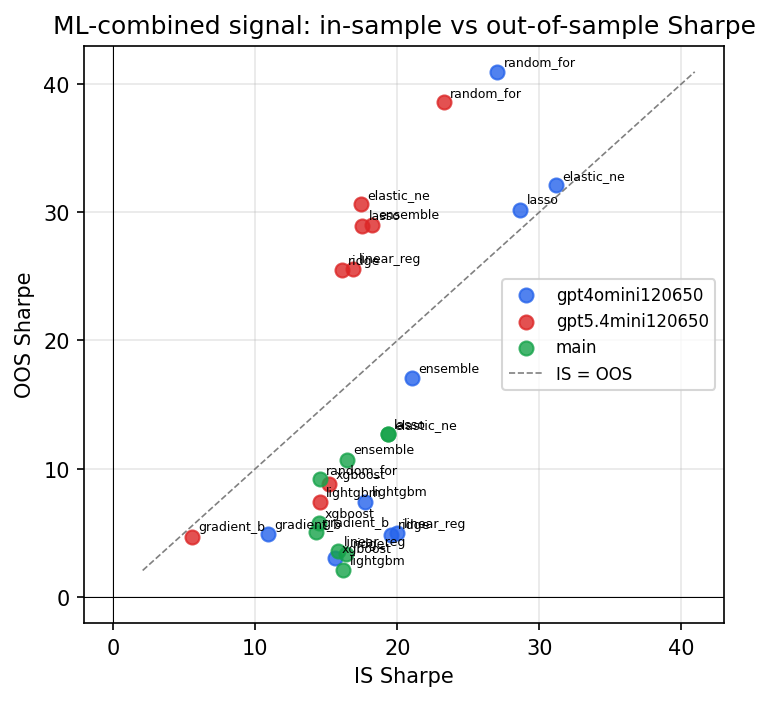

*IS vs OOS Sharpe (overfitting diagnostic)*

---
*Generated by `run_model_comparison.py`. Tables: `*.csv`; interactive: `comparison.ipynb`.*
