# Research-LLM factor comparison — `2024-05`

Comparing the **factor output of different research LLMs** on three axes (raw factor quality → factors as ML features → factors through the full agentic fund). The panel, IS/OOS split, horizon and model hyper-parameters are held identical across preruns — the *only* variable is the factor set.

## Preruns compared

| prerun | research_model | usable_factors | dropped_factors |
| --- | --- | --- | --- |
| gpt4omini120650 | gpt-4o-mini | 66 | 0 |
| gpt5.4mini120650 | gpt-5.4-mini | 69 | 0 |
| main | seed library | 78 | 10 |

> Dropped factors declare fields the current data doesn't have yet (e.g. fundamentals); they light up unchanged once that data is downloaded.

*Usable vs awaiting-data factors per research model*

## Key findings

- **Best ML-combined OOS Sharpe:** `gpt4omini120650` with `lasso` (OOS Sharpe = 32.253).
- **Mean OOS Sharpe across models, by research set:** `gpt4omini120650` = 14.429, `main` = 4.878, `gpt5.4mini120650` = 3.644.
- **Highest mean single-factor |IC| (h=6):** `gpt4omini120650` (mean |IC| = 0.0307).
- **Most diverse zoo (highest effective/raw factor ratio):** `gpt5.4mini120650` (eff 58.3 of 69, ratio 0.84).
- **Best selection-deflated single-factor |IC|:** `gpt4omini120650` (deflated |IC| = 0.1171 from 64 factors tried).

## 1. Single-factor IC (raw factor quality)

Per-underlying time-series Spearman rank-IC of every researched factor, recomputed on the shared panel at horizons h=1, h=6, h=60. The per-underlying IC correlates each factor's value vector with the underlying's own forward-return vector (pooled across underlyings); the cross-sectional IC ranks across underlyings per timestamp.

| prerun | n_factors | mean_abs_ic_1 | mean_abs_ic_6 | mean_abs_ic_60 | mean_abs_icir_6 | best_factor_h6 | best_abs_ic_h6 |
| --- | --- | --- | --- | --- | --- | --- | --- |
| gpt4omini120650 | 66 | 0.0346 | 0.0307 | 0.0119 | 1.2713 | limit_order_book_imbalance_surge | 0.1245 |
| gpt5.4mini120650 | 69 | 0.0225 | 0.0223 | 0.0133 | 1.3861 | orderflow_imbalance_divergence | 0.108 |
| main | 78 | 0.0273 | 0.0295 | 0.0199 | 1.0618 | alpha_066 | 0.117 |

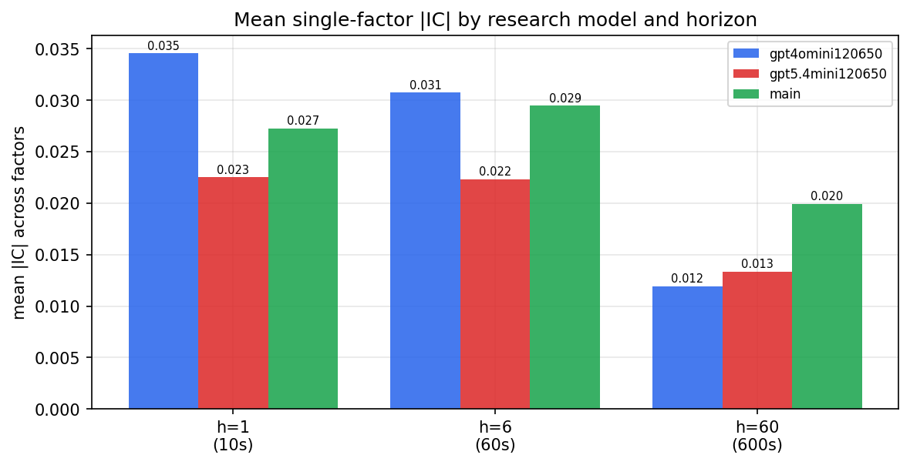

*Mean |IC| by research model and horizon*

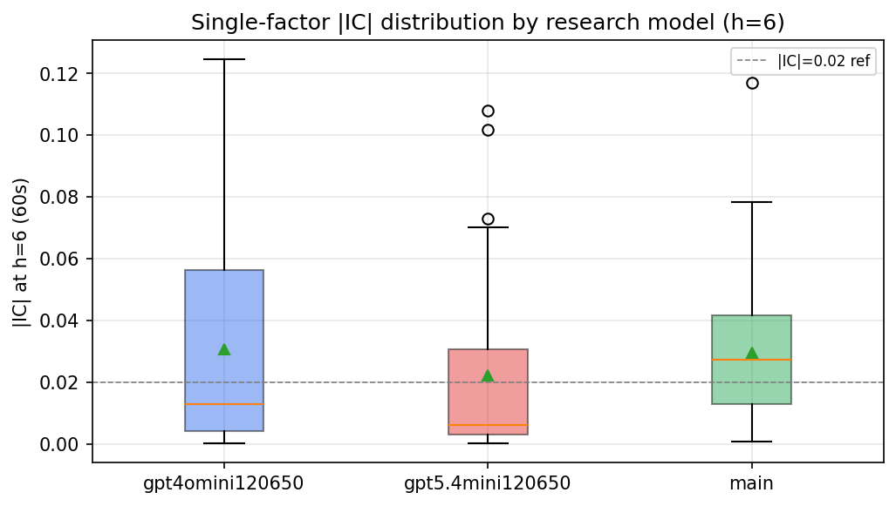

*Per-factor |IC| distribution by research model*

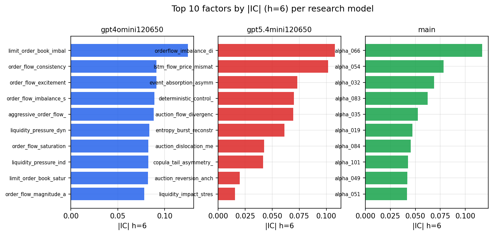

*Top factors by |IC| per research model*

## 2. Factor diversity & redundancy

Pairwise correlation of each zoo's *signals*. `eff_n_factors` is the effective number of independent factors (participation ratio of the correlation eigenvalues); `eff_ratio` and `redundancy` summarise how much unique information the zoo holds vs. how much is duplicated; `n_clusters` groups factors at |corr| ≥ 0.7.

| prerun | n_factors | eff_n_factors | eff_ratio | mean_abs_corr | n_clusters | redundancy |
| --- | --- | --- | --- | --- | --- | --- |
| gpt4omini120650 | 66 | 30.1702 | 0.4571 | 0.0464 | 55 | 0.5429 |
| gpt5.4mini120650 | 69 | 58.283 | 0.8447 | 0.0093 | 68 | 0.1553 |
| main | 78 | 36.9181 | 0.4733 | 0.0392 | 62 | 0.5267 |

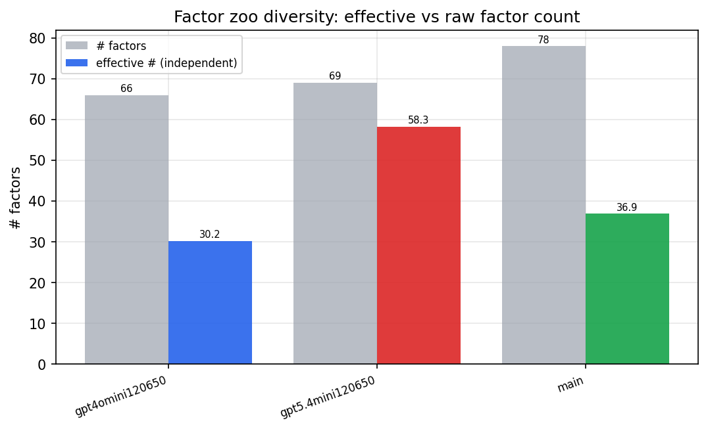

*Effective vs raw factor count per research model*

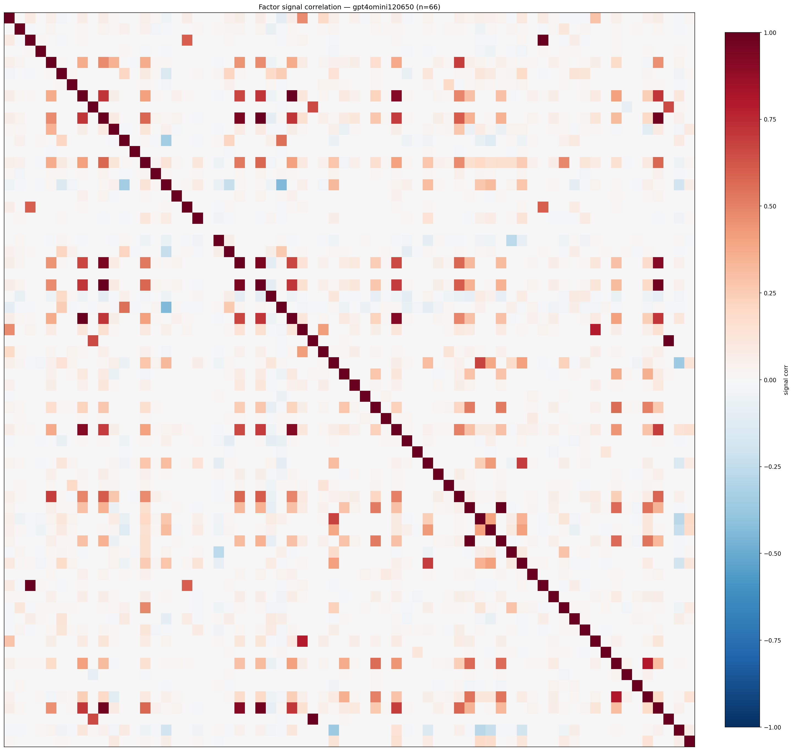

*Signal correlation matrix — gpt4omini120650*

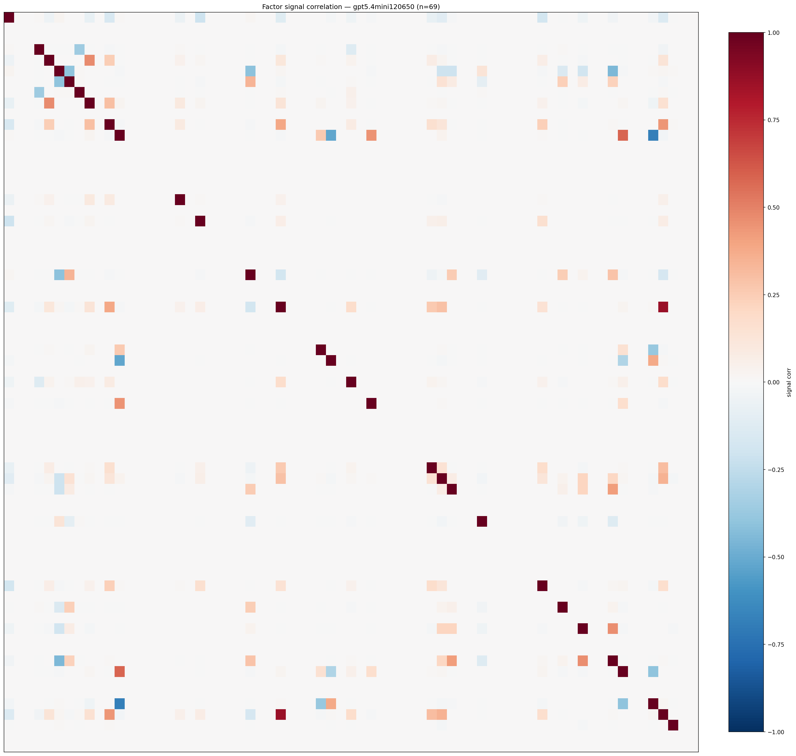

*Signal correlation matrix — gpt5.4mini120650*

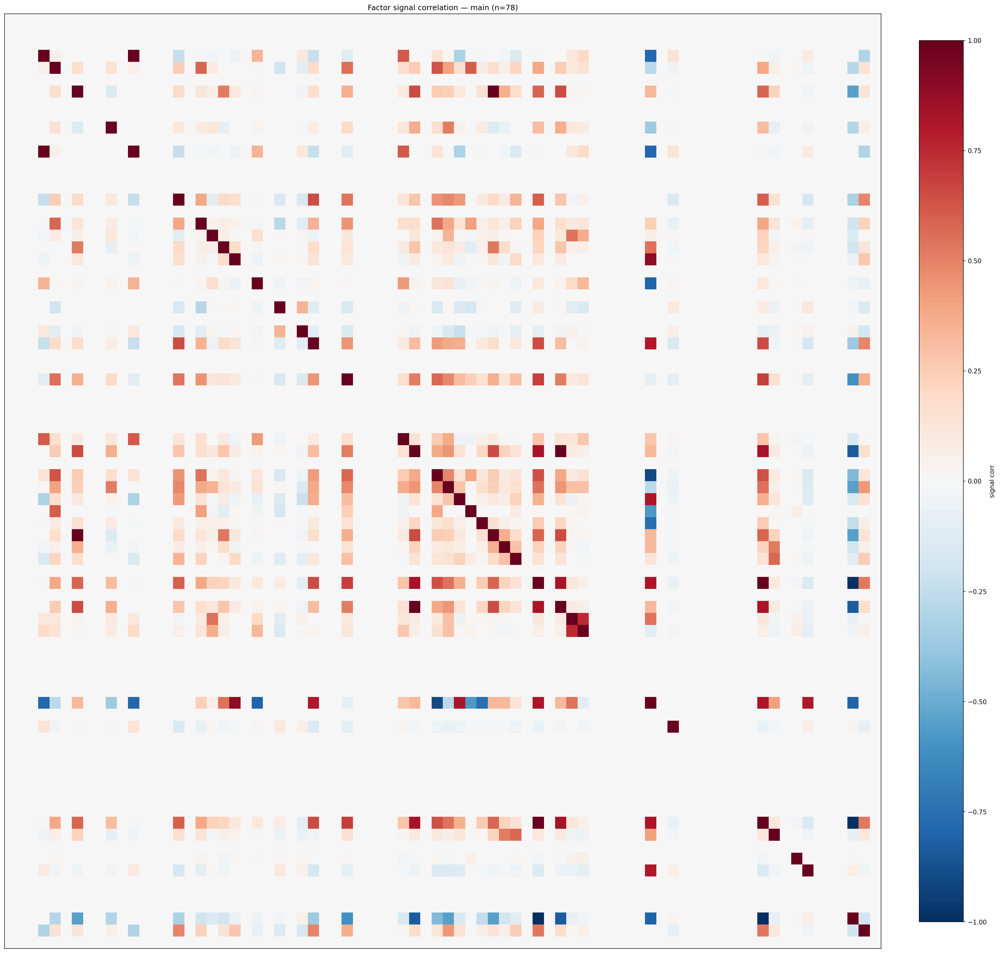

*Signal correlation matrix — main*

## 3. Deflation & model-based importance

`deflated_best_ic` haircuts each zoo's best |IC| for the number of factors tried (`ic_n_tested`) — a bigger zoo's best factor is more likely to be lucky. `lasso_n_nonzero` / `lasso_sparsity` show how many factors a sparse linear model actually keeps (model-view redundancy).

| prerun | best_ic | deflated_best_ic | deflated_best_t | ic_n_tested | ic_n_obs | lasso_n_nonzero | lasso_sparsity |
| --- | --- | --- | --- | --- | --- | --- | --- |
| gpt4omini120650 | 0.1245 | 0.1171 | 45.3095 | 64 | 149759 | 13 | 0.803 |
| gpt5.4mini120650 | 0.108 | 0.1013 | 39.1824 | 31 | 149759 | 8 | 0.8841 |
| main | 0.117 | 0.1101 | 42.6061 | 37 | 149759 | 0 | 1.0 |

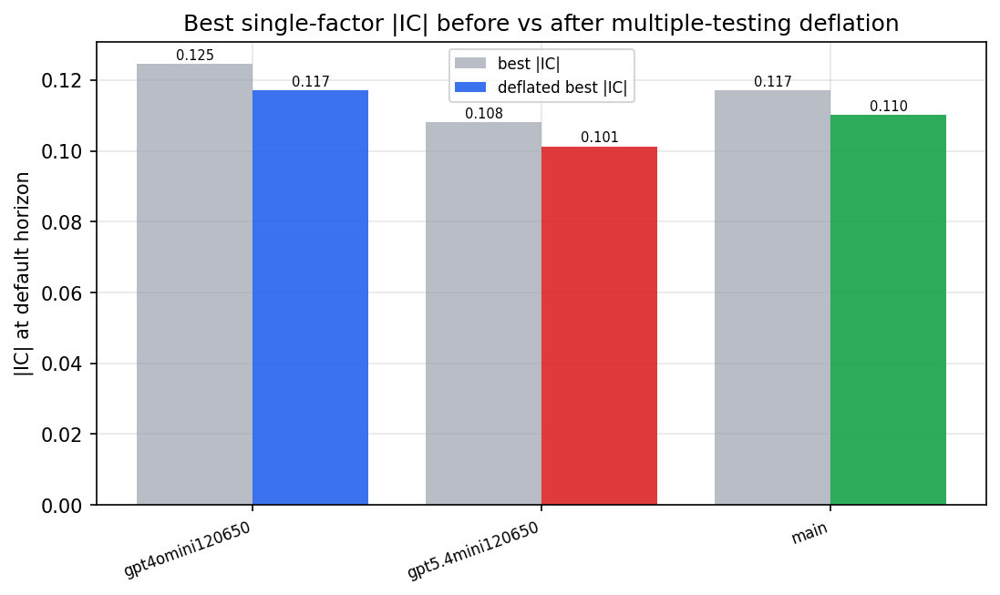

*Best |IC| before vs after multiple-testing deflation*

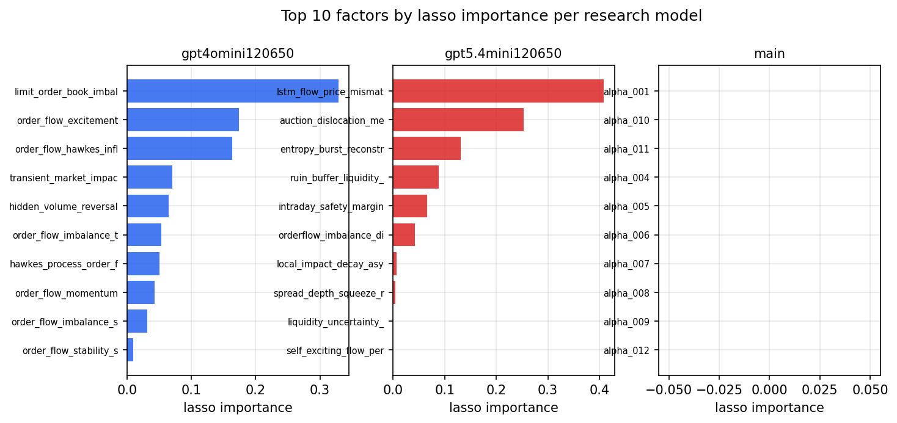

*Top factors by lasso importance per zoo*

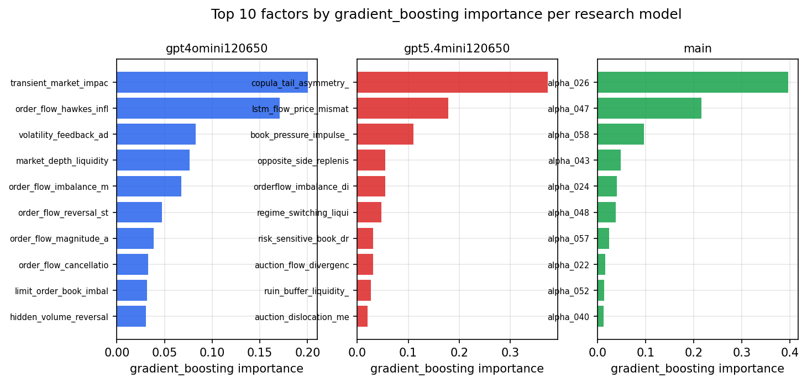

*Top factors by gradient_boosting importance per zoo*

## 4. ML-combined signal — per-underlying vectorised backtest

Each model combines a prerun's factors into ONE signal (fit `factors → forward return` on IS, predict per (bar, underlying)), then that combined signal is run through a simple vectorised backtest — `position(signal) × the underlying's own forward return` — on the held-out OOS tail (+ an equal-weight ensemble). No cross-sectional ranking.

> Config: position=**threshold** (t=1.0, z-score `expanding`), aggregation=**portfolio**, fit-standardise=**per_underlying**, horizon=6.

| prerun | model | n_factors_used | oos_ic | oos_sharpe | is_sharpe | oos_ann_return | oos_max_drawdown |
| --- | --- | --- | --- | --- | --- | --- | --- |
| gpt4omini120650 | linear_regression | 66 | 0.1351 | 21.0892 | 24.6388 | 0.3807 | -0.002 |
| gpt4omini120650 | ridge | 66 | 0.1344 | 20.8484 | 25.644 | 0.371 | -0.0022 |
| gpt4omini120650 | lasso | 66 | 0.1503 | 32.2527 | 37.3138 | 0.4956 | -0.0023 |
| gpt4omini120650 | elastic_net | 66 | 0.1478 | 30.0082 | 31.9019 | 0.4731 | -0.0025 |
| gpt4omini120650 | random_forest | 66 | 0.1422 | 14.7579 | 19.5269 | 0.27 | -0.0046 |
| gpt4omini120650 | gradient_boosting | 66 | 0.1425 | 0.0938 | 10.8144 | 0.0013 | -0.0033 |
| gpt4omini120650 | xgboost | 66 | 0.1561 | -3.5085 | 13.2466 | -0.0554 | -0.005 |
| gpt4omini120650 | lightgbm | 66 | 0.1666 | -2.9098 | 15.2413 | -0.049 | -0.0048 |
| gpt4omini120650 | ensemble | 66 | 0.149 | 17.2251 | 22.797 | 0.3218 | -0.0038 |
| gpt5.4mini120650 | linear_regression | 69 | 0.1555 | 8.5966 | 21.1485 | 0.1885 | -0.0081 |
| gpt5.4mini120650 | ridge | 69 | 0.1556 | 8.4148 | 20.2296 | 0.1845 | -0.0081 |
| gpt5.4mini120650 | lasso | 69 | 0.1588 | 6.4906 | 19.4159 | 0.1413 | -0.0084 |
| gpt5.4mini120650 | elastic_net | 69 | 0.1588 | 6.4906 | 19.4159 | 0.1413 | -0.0084 |
| gpt5.4mini120650 | random_forest | 69 | 0.1753 | 8.5408 | 17.658 | 0.1959 | -0.0074 |
| gpt5.4mini120650 | gradient_boosting | 69 | 0.1651 | -5.0891 | 9.9627 | -0.1047 | -0.0101 |
| gpt5.4mini120650 | xgboost | 69 | 0.1954 | -2.3345 | 15.1611 | -0.0552 | -0.0089 |
| gpt5.4mini120650 | lightgbm | 69 | 0.2057 | -3.8719 | 14.7193 | -0.0623 | -0.0059 |
| gpt5.4mini120650 | ensemble | 69 | 0.192 | 5.5538 | 19.0653 | 0.1197 | -0.0087 |
| main | linear_regression | 78 | 0.0398 | 5.746 | 12.6194 | 0.1218 | -0.0043 |
| main | ridge | 78 | 0.042 | 5.276 | 12.8387 | 0.1074 | -0.0044 |
| main | lasso | 78 | 0.0509 | 8.0807 | 10.9289 | 0.1653 | -0.0031 |
| main | elastic_net | 78 | 0.0518 | 8.5601 | 10.5812 | 0.1747 | -0.0031 |
| main | random_forest | 78 | 0.046 | -0.5187 | 11.8471 | -0.0101 | -0.0046 |
| main | gradient_boosting | 78 | 0.048 | 1.4675 | 11.1247 | 0.015 | -0.0023 |
| main | xgboost | 78 | 0.0482 | 4.4082 | 13.845 | 0.0583 | -0.0038 |
| main | lightgbm | 78 | 0.0521 | 5.3311 | 16.4451 | 0.0649 | -0.0024 |
| main | ensemble | 78 | 0.0506 | 5.555 | 16.2619 | 0.1159 | -0.0053 |

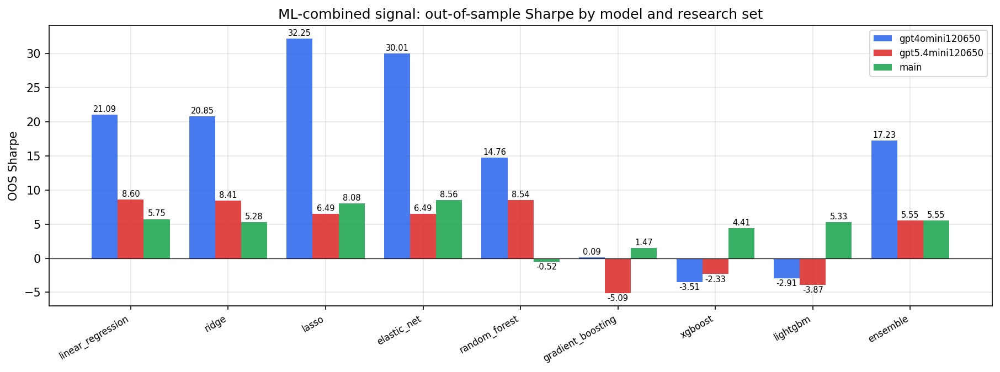

*ML-combined OOS Sharpe by model and research set*

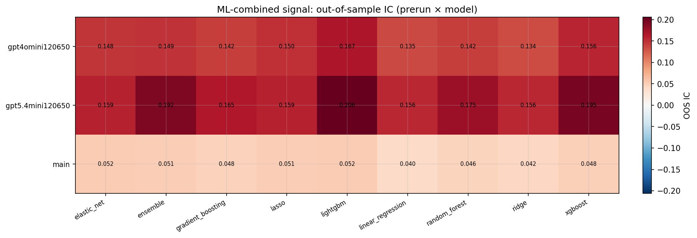

*ML-combined OOS IC (prerun × model)*

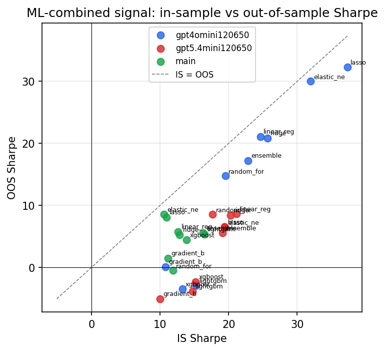

*IS vs OOS Sharpe (overfitting diagnostic)*

---
*Generated by `run_model_comparison.py`. Tables: `*.csv`; interactive: `comparison.ipynb`.*
