# Research-LLM factor comparison — `2024-06`

Comparing the **factor output of different research LLMs** on three axes (raw factor quality → factors as ML features → factors through the full agentic fund). The panel, IS/OOS split, horizon and model hyper-parameters are held identical across preruns — the *only* variable is the factor set.

## Preruns compared

| prerun | research_model | usable_factors | dropped_factors |
| --- | --- | --- | --- |
| gpt4omini120650 | gpt-4o-mini | 66 | 0 |
| gpt5.4mini120650 | gpt-5.4-mini | 69 | 0 |
| main | seed library | 78 | 10 |

> Dropped factors declare fields the current data doesn't have yet (e.g. fundamentals); they light up unchanged once that data is downloaded.

*Usable vs awaiting-data factors per research model*

## Key findings

- **Best ML-combined OOS Sharpe:** `gpt5.4mini120650` with `random_forest` (OOS Sharpe = 40.724).
- **Mean OOS Sharpe across models, by research set:** `gpt4omini120650` = 19.380, `gpt5.4mini120650` = 18.759, `main` = 2.242.
- **Highest mean single-factor |IC| (h=6):** `main` (mean |IC| = 0.0316).
- **Most diverse zoo (highest effective/raw factor ratio):** `gpt5.4mini120650` (eff 54.5 of 69, ratio 0.79).
- **Best selection-deflated single-factor |IC|:** `main` (deflated |IC| = 0.2772 from 37 factors tried).

## 1. Single-factor IC (raw factor quality)

Per-underlying time-series Spearman rank-IC of every researched factor, recomputed on the shared panel at horizons h=1, h=6, h=60. The per-underlying IC correlates each factor's value vector with the underlying's own forward-return vector (pooled across underlyings); the cross-sectional IC ranks across underlyings per timestamp.

| prerun | n_factors | mean_abs_ic_1 | mean_abs_ic_6 | mean_abs_ic_60 | mean_abs_icir_6 | best_factor_h6 | best_abs_ic_h6 |
| --- | --- | --- | --- | --- | --- | --- | --- |
| gpt4omini120650 | 66 | 0.0339 | 0.0309 | 0.0133 | 1.1972 | limit_order_book_imbalance_surge | 0.1231 |
| gpt5.4mini120650 | 69 | 0.0223 | 0.0225 | 0.0135 | 1.2741 | orderflow_imbalance_divergence | 0.1115 |
| main | 78 | 0.0229 | 0.0316 | 0.021 | 0.9468 | alpha_066 | 0.2842 |

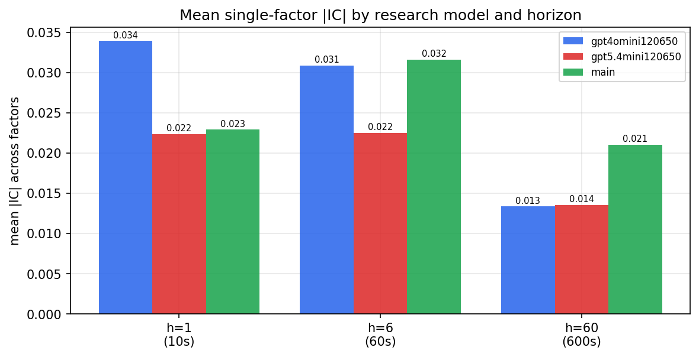

*Mean |IC| by research model and horizon*

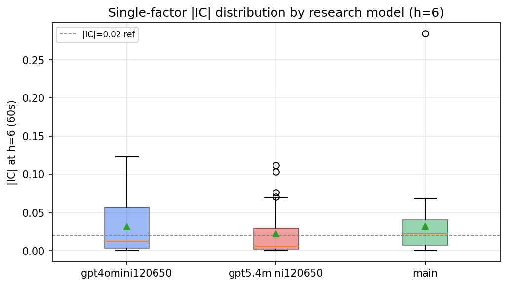

*Per-factor |IC| distribution by research model*

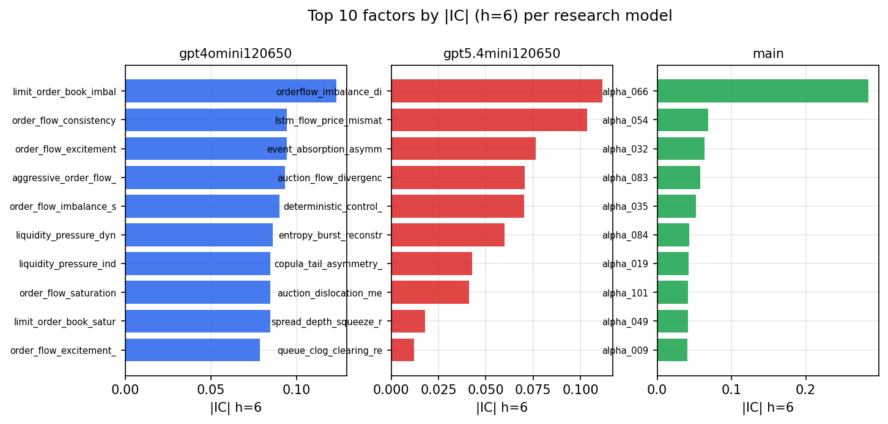

*Top factors by |IC| per research model*

## 2. Factor diversity & redundancy

Pairwise correlation of each zoo's *signals*. `eff_n_factors` is the effective number of independent factors (participation ratio of the correlation eigenvalues); `eff_ratio` and `redundancy` summarise how much unique information the zoo holds vs. how much is duplicated; `n_clusters` groups factors at |corr| ≥ 0.7.

| prerun | n_factors | eff_n_factors | eff_ratio | mean_abs_corr | n_clusters | redundancy |
| --- | --- | --- | --- | --- | --- | --- |
| gpt4omini120650 | 66 | 29.3179 | 0.4442 | 0.0471 | 53 | 0.5558 |
| gpt5.4mini120650 | 69 | 54.5491 | 0.7906 | 0.0111 | 64 | 0.2094 |
| main | 78 | 35.1045 | 0.4501 | 0.0407 | 63 | 0.5499 |

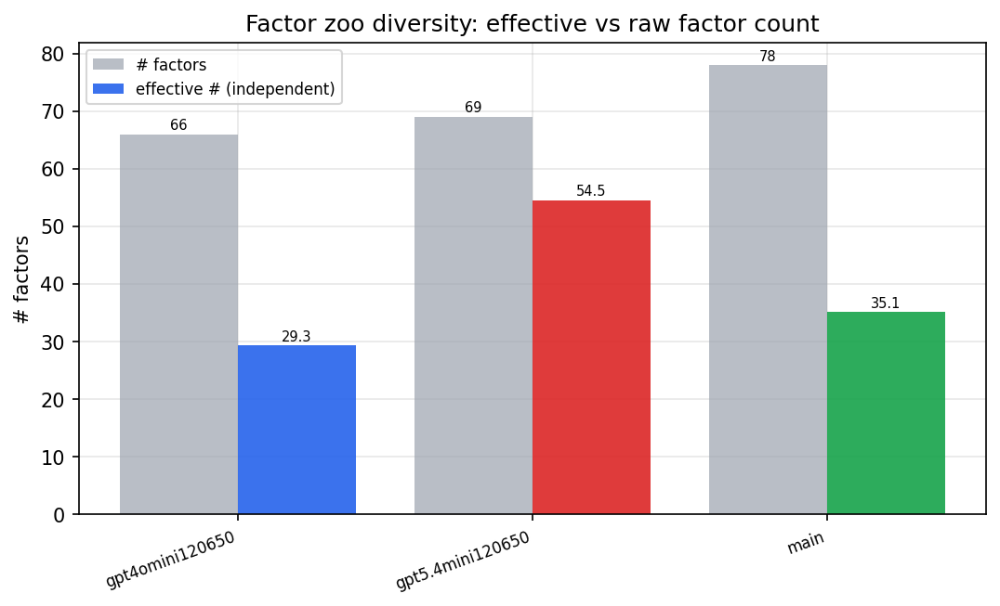

*Effective vs raw factor count per research model*

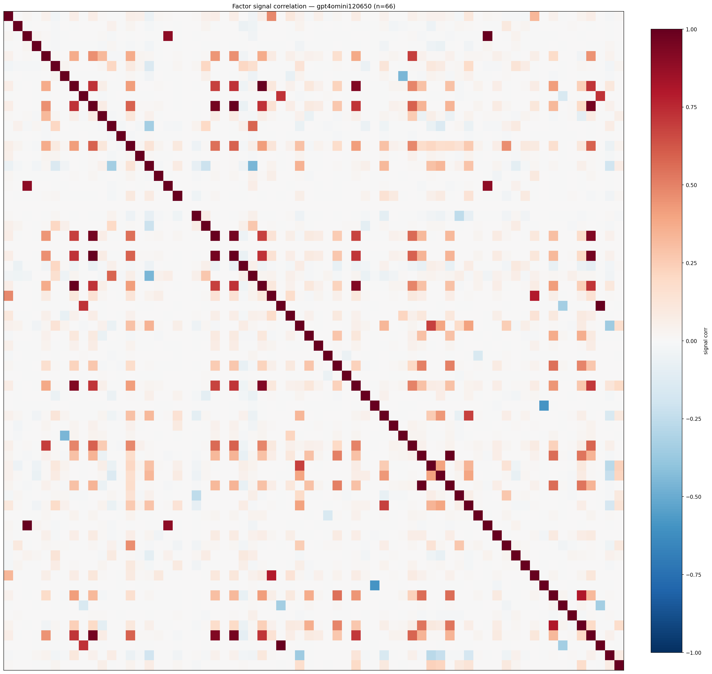

*Signal correlation matrix — gpt4omini120650*

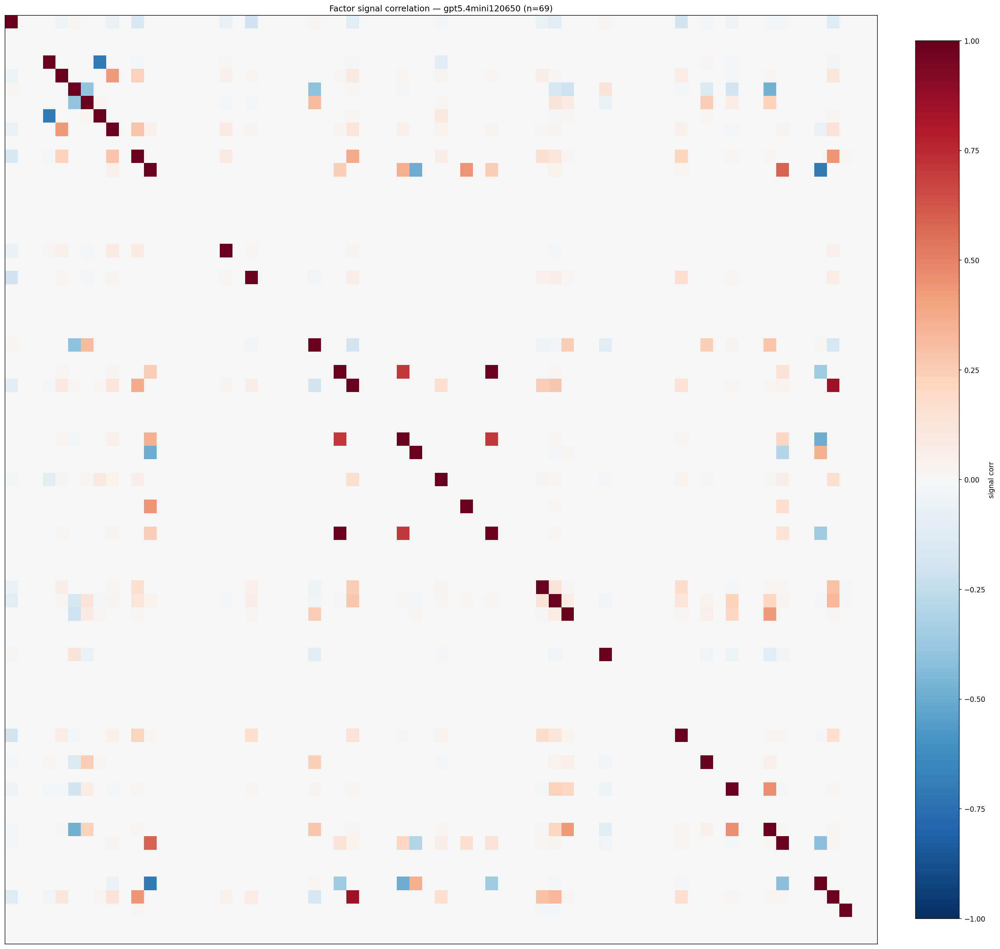

*Signal correlation matrix — gpt5.4mini120650*

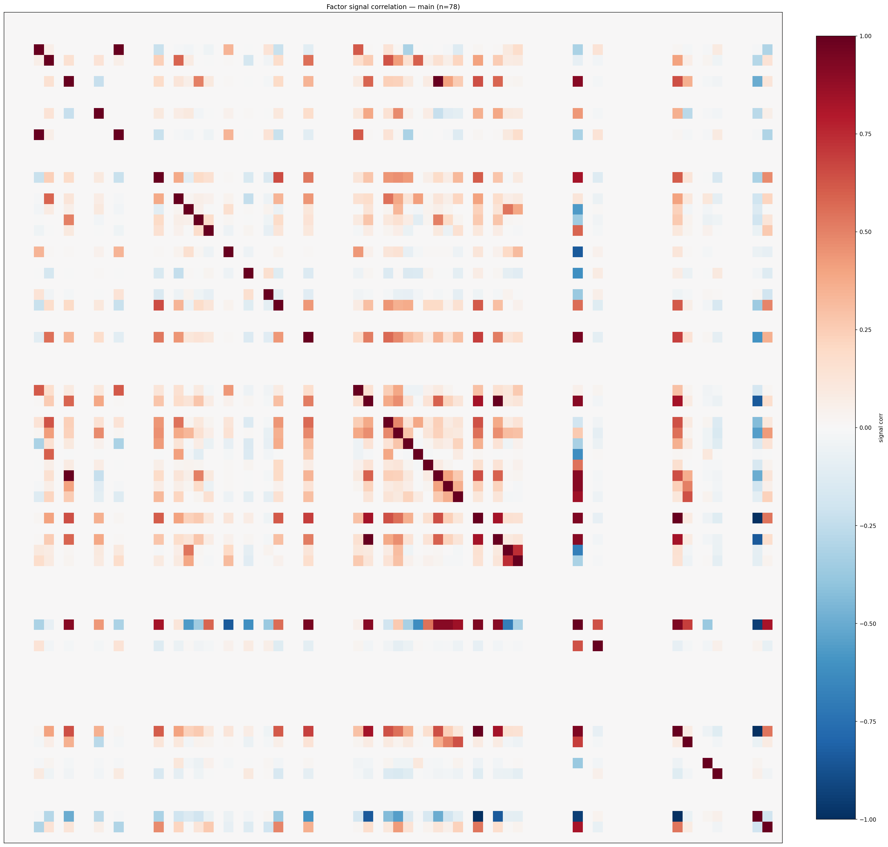

*Signal correlation matrix — main*

## 3. Deflation & model-based importance

`deflated_best_ic` haircuts each zoo's best |IC| for the number of factors tried (`ic_n_tested`) — a bigger zoo's best factor is more likely to be lucky. `lasso_n_nonzero` / `lasso_sparsity` show how many factors a sparse linear model actually keeps (model-view redundancy).

| prerun | best_ic | deflated_best_ic | deflated_best_t | ic_n_tested | ic_n_obs | lasso_n_nonzero | lasso_sparsity |
| --- | --- | --- | --- | --- | --- | --- | --- |
| gpt4omini120650 | 0.1231 | 0.1156 | 44.3727 | 64 | 147419 | 5 | 0.9242 |
| gpt5.4mini120650 | 0.1115 | 0.1047 | 40.2022 | 31 | 147419 | 9 | 0.8696 |
| main | 0.2842 | 0.2772 | 106.4426 | 37 | 147419 | 0 | 1.0 |

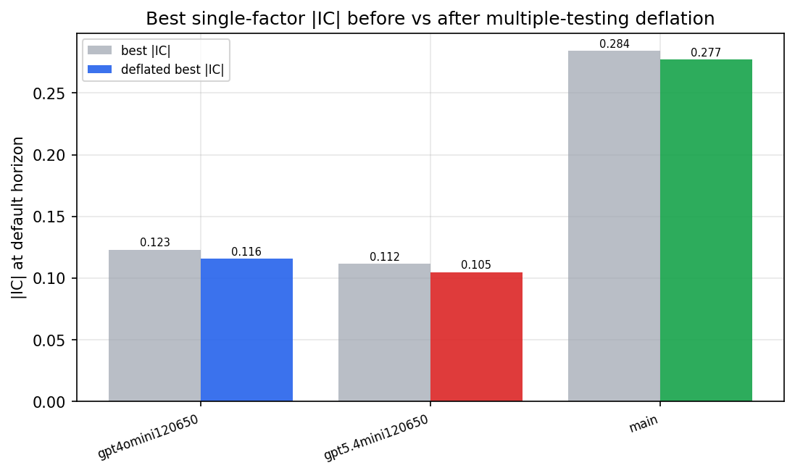

*Best |IC| before vs after multiple-testing deflation*

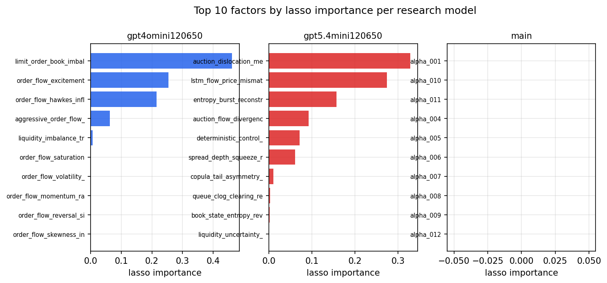

*Top factors by lasso importance per zoo*

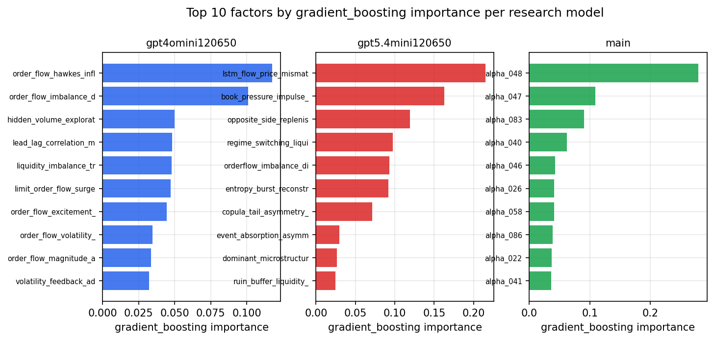

*Top factors by gradient_boosting importance per zoo*

## 4. ML-combined signal — per-underlying vectorised backtest

Each model combines a prerun's factors into ONE signal (fit `factors → forward return` on IS, predict per (bar, underlying)), then that combined signal is run through a simple vectorised backtest — `position(signal) × the underlying's own forward return` — on the held-out OOS tail (+ an equal-weight ensemble). No cross-sectional ranking.

> Config: position=**threshold** (t=1.0, z-score `expanding`), aggregation=**portfolio**, fit-standardise=**per_underlying**, horizon=6.

| prerun | model | n_factors_used | oos_ic | oos_sharpe | is_sharpe | oos_ann_return | oos_max_drawdown |
| --- | --- | --- | --- | --- | --- | --- | --- |
| gpt4omini120650 | linear_regression | 66 | 0.1656 | 31.6537 | 23.1949 | 0.5607 | -0.0017 |
| gpt4omini120650 | ridge | 66 | 0.1694 | 33.0138 | 23.9403 | 0.594 | -0.0018 |
| gpt4omini120650 | lasso | 66 | 0.1614 | 31.399 | 26.4819 | 0.5661 | -0.0031 |
| gpt4omini120650 | elastic_net | 66 | 0.1631 | 31.6847 | 26.7428 | 0.5802 | -0.0031 |
| gpt4omini120650 | random_forest | 66 | 0.1607 | 28.5316 | 22.421 | 0.4876 | -0.0019 |
| gpt4omini120650 | gradient_boosting | 66 | 0.1477 | -3.3033 | 8.34 | -0.0291 | -0.0031 |
| gpt4omini120650 | xgboost | 66 | 0.1676 | -2.3327 | 10.8176 | -0.0278 | -0.0046 |
| gpt4omini120650 | lightgbm | 66 | 0.1837 | -3.7475 | 14.7477 | -0.0611 | -0.0054 |
| gpt4omini120650 | ensemble | 66 | 0.1716 | 27.521 | 22.8159 | 0.5393 | -0.003 |
| gpt5.4mini120650 | linear_regression | 69 | 0.1739 | 26.6463 | 19.1376 | 0.5315 | -0.0029 |
| gpt5.4mini120650 | ridge | 69 | 0.1729 | 26.5816 | 18.6921 | 0.5281 | -0.0029 |
| gpt5.4mini120650 | lasso | 69 | nan | nan | nan | nan | nan |
| gpt5.4mini120650 | elastic_net | 69 | nan | nan | nan | nan | nan |
| gpt5.4mini120650 | random_forest | 69 | 0.1878 | 40.7235 | 33.5422 | 0.9753 | -0.0022 |
| gpt5.4mini120650 | gradient_boosting | 69 | 0.1676 | -5.3114 | 8.9243 | -0.0584 | -0.0053 |
| gpt5.4mini120650 | xgboost | 69 | 0.2 | 10.5366 | 15.6503 | 0.1962 | -0.0033 |
| gpt5.4mini120650 | lightgbm | 69 | 0.2126 | 1.7757 | 14.405 | 0.026 | -0.0031 |
| gpt5.4mini120650 | ensemble | 69 | 0.2091 | 30.3621 | 21.8491 | 0.6257 | -0.0023 |
| main | linear_regression | 78 | 0.0261 | 6.6678 | 15.7524 | 0.1142 | -0.0042 |
| main | ridge | 78 | 0.0278 | 7.8248 | 16.6034 | 0.1335 | -0.0039 |
| main | lasso | 78 | 0.0269 | 4.9312 | 11.7509 | 0.107 | -0.0049 |
| main | elastic_net | 78 | 0.0278 | 4.7145 | 11.2465 | 0.1014 | -0.0048 |
| main | random_forest | 78 | 0.0317 | 2.1854 | 14.6446 | 0.0404 | -0.004 |
| main | gradient_boosting | 78 | 0.0234 | -4.9557 | 7.9313 | -0.0259 | -0.003 |
| main | xgboost | 78 | 0.0285 | -2.1513 | 12.7937 | -0.0244 | -0.004 |
| main | lightgbm | 78 | 0.0204 | -1.7561 | 15.6193 | -0.0206 | -0.0049 |
| main | ensemble | 78 | 0.0294 | 2.7157 | 14.9615 | 0.0576 | -0.0051 |

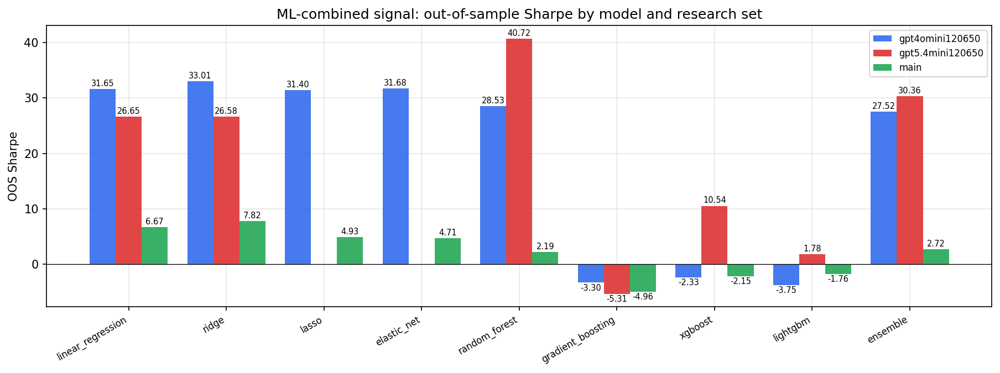

*ML-combined OOS Sharpe by model and research set*

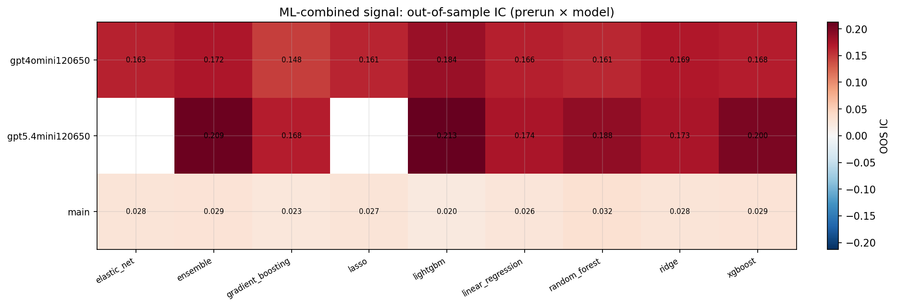

*ML-combined OOS IC (prerun × model)*

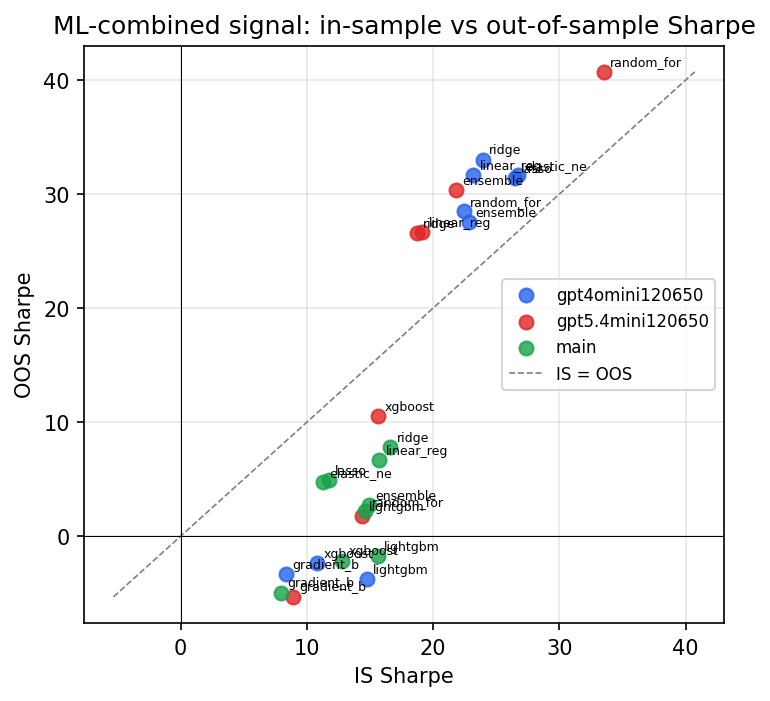

*IS vs OOS Sharpe (overfitting diagnostic)*

---
*Generated by `run_model_comparison.py`. Tables: `*.csv`; interactive: `comparison.ipynb`.*
