# Research-LLM factor comparison — `2024-07`

Comparing the **factor output of different research LLMs** on three axes (raw factor quality → factors as ML features → factors through the full agentic fund). The panel, IS/OOS split, horizon and model hyper-parameters are held identical across preruns — the *only* variable is the factor set.

## Preruns compared

| prerun | research_model | usable_factors | dropped_factors |
| --- | --- | --- | --- |
| gpt4omini120650 | gpt-4o-mini | 66 | 0 |
| gpt5.4mini120650 | gpt-5.4-mini | 69 | 0 |
| main | seed library | 78 | 10 |

> Dropped factors declare fields the current data doesn't have yet (e.g. fundamentals); they light up unchanged once that data is downloaded.

*Usable vs awaiting-data factors per research model*

## Key findings

- **Best ML-combined OOS Sharpe:** `gpt5.4mini120650` with `random_forest` (OOS Sharpe = 34.017).
- **Mean OOS Sharpe across models, by research set:** `gpt5.4mini120650` = 17.491, `gpt4omini120650` = 12.215, `main` = 8.486.
- **Highest mean single-factor |IC| (h=6):** `main` (mean |IC| = 0.0330).
- **Most diverse zoo (highest effective/raw factor ratio):** `gpt5.4mini120650` (eff 55.0 of 69, ratio 0.80).
- **Best selection-deflated single-factor |IC|:** `main` (deflated |IC| = 0.2772 from 37 factors tried).

## 1. Single-factor IC (raw factor quality)

Per-underlying time-series Spearman rank-IC of every researched factor, recomputed on the shared panel at horizons h=1, h=6, h=60. The per-underlying IC correlates each factor's value vector with the underlying's own forward-return vector (pooled across underlyings); the cross-sectional IC ranks across underlyings per timestamp.

| prerun | n_factors | mean_abs_ic_1 | mean_abs_ic_6 | mean_abs_ic_60 | mean_abs_icir_6 | best_factor_h6 | best_abs_ic_h6 |
| --- | --- | --- | --- | --- | --- | --- | --- |
| gpt4omini120650 | 66 | 0.0358 | 0.033 | 0.0168 | 1.329 | limit_order_book_imbalance_surge | 0.1301 |
| gpt5.4mini120650 | 69 | 0.0224 | 0.0238 | 0.013 | 1.3635 | orderflow_imbalance_divergence | 0.1182 |
| main | 78 | 0.0271 | 0.033 | 0.02 | 1.0968 | alpha_066 | 0.2842 |

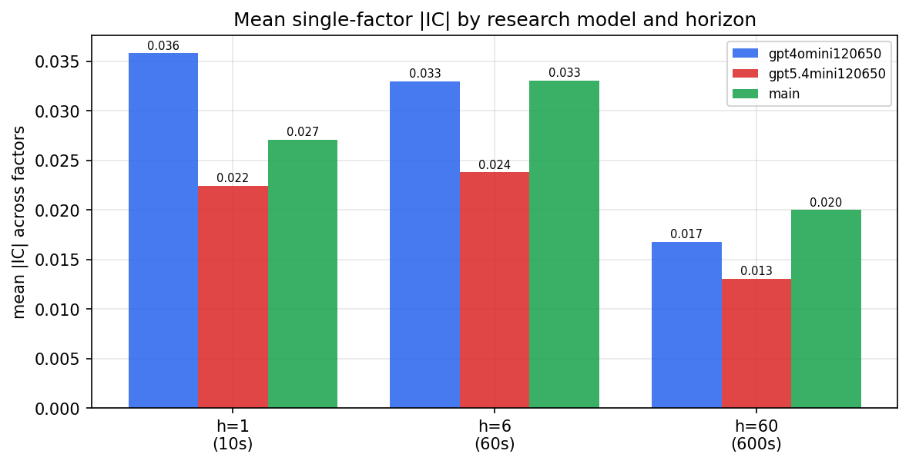

*Mean |IC| by research model and horizon*

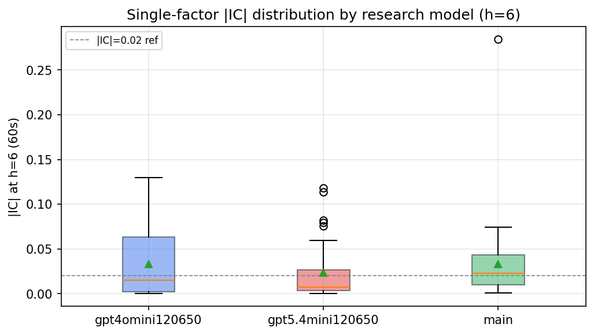

*Per-factor |IC| distribution by research model*

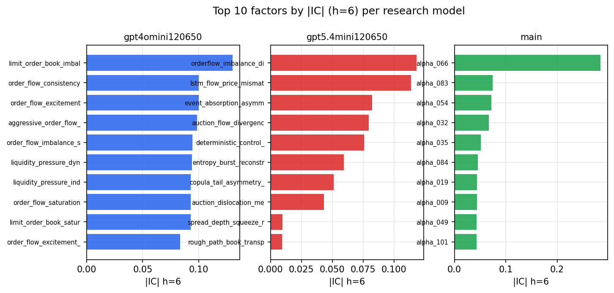

*Top factors by |IC| per research model*

## 2. Factor diversity & redundancy

Pairwise correlation of each zoo's *signals*. `eff_n_factors` is the effective number of independent factors (participation ratio of the correlation eigenvalues); `eff_ratio` and `redundancy` summarise how much unique information the zoo holds vs. how much is duplicated; `n_clusters` groups factors at |corr| ≥ 0.7.

| prerun | n_factors | eff_n_factors | eff_ratio | mean_abs_corr | n_clusters | redundancy |
| --- | --- | --- | --- | --- | --- | --- |
| gpt4omini120650 | 66 | 29.821 | 0.4518 | 0.0455 | 53 | 0.5482 |
| gpt5.4mini120650 | 69 | 54.9751 | 0.7967 | 0.0109 | 65 | 0.2033 |
| main | 78 | 38.5546 | 0.4943 | 0.0337 | 70 | 0.5057 |

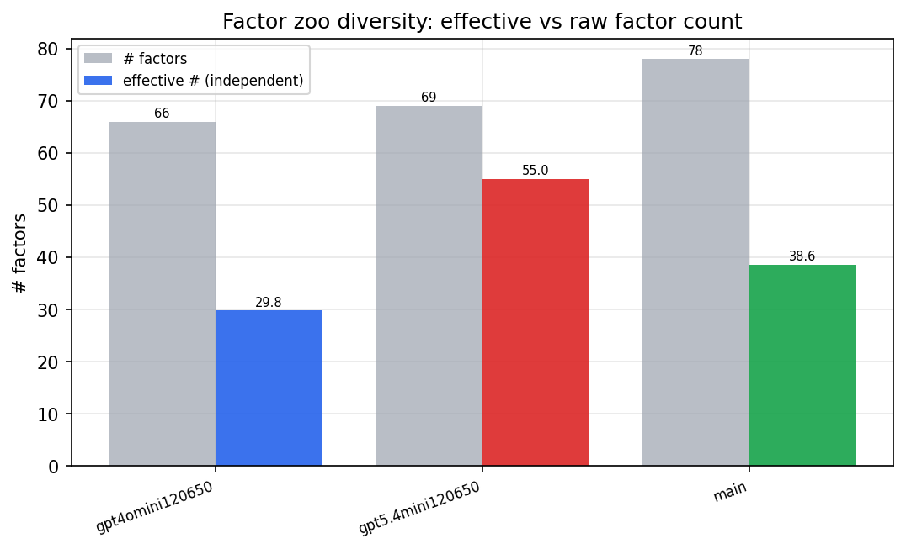

*Effective vs raw factor count per research model*

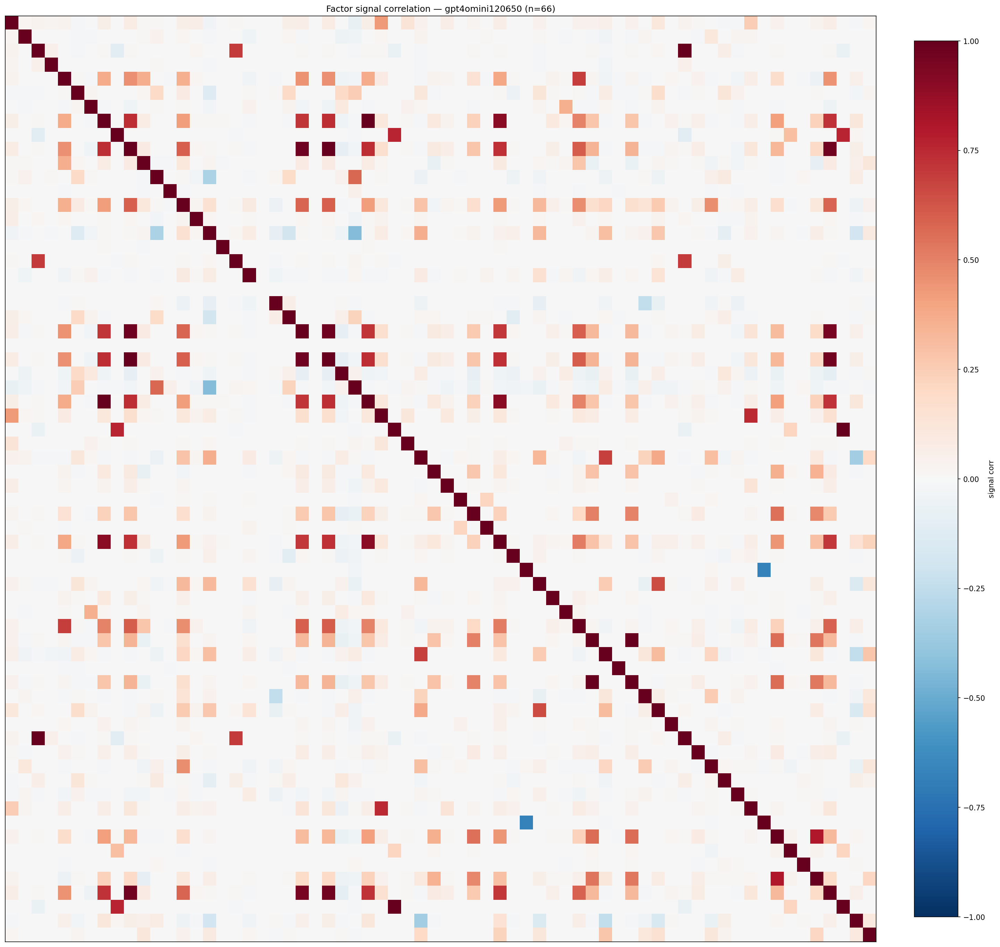

*Signal correlation matrix — gpt4omini120650*

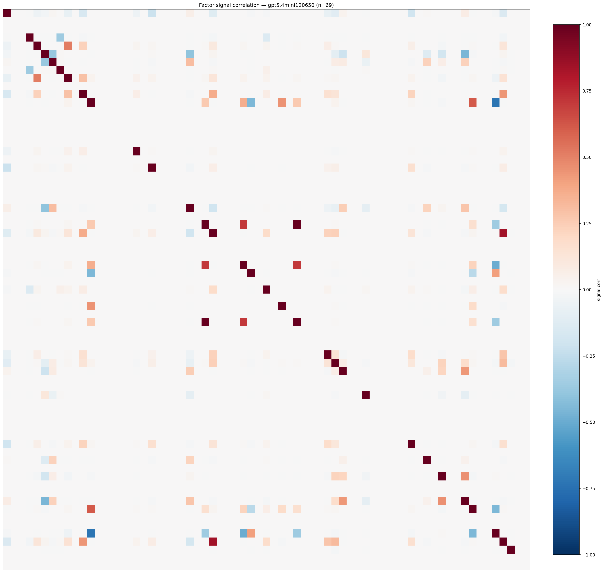

*Signal correlation matrix — gpt5.4mini120650*

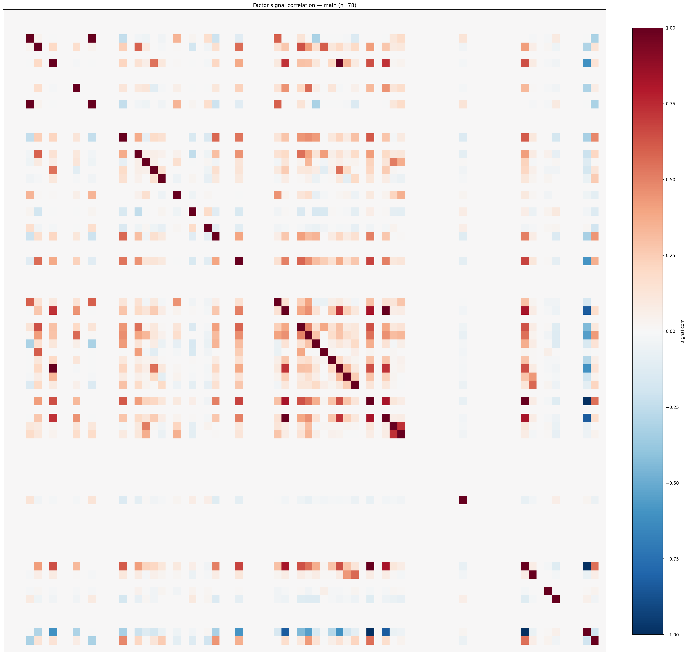

*Signal correlation matrix — main*

## 3. Deflation & model-based importance

`deflated_best_ic` haircuts each zoo's best |IC| for the number of factors tried (`ic_n_tested`) — a bigger zoo's best factor is more likely to be lucky. `lasso_n_nonzero` / `lasso_sparsity` show how many factors a sparse linear model actually keeps (model-view redundancy).

| prerun | best_ic | deflated_best_ic | deflated_best_t | ic_n_tested | ic_n_obs | lasso_n_nonzero | lasso_sparsity |
| --- | --- | --- | --- | --- | --- | --- | --- |
| gpt4omini120650 | 0.1301 | 0.1226 | 46.8901 | 64 | 146339 | 11 | 0.8333 |
| gpt5.4mini120650 | 0.1182 | 0.1113 | 42.5806 | 31 | 146339 | 13 | 0.8116 |
| main | 0.2842 | 0.2772 | 106.0421 | 37 | 146339 | 7 | 0.9103 |

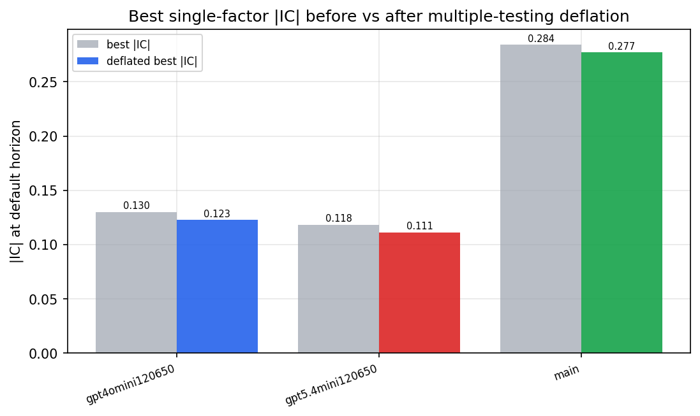

*Best |IC| before vs after multiple-testing deflation*

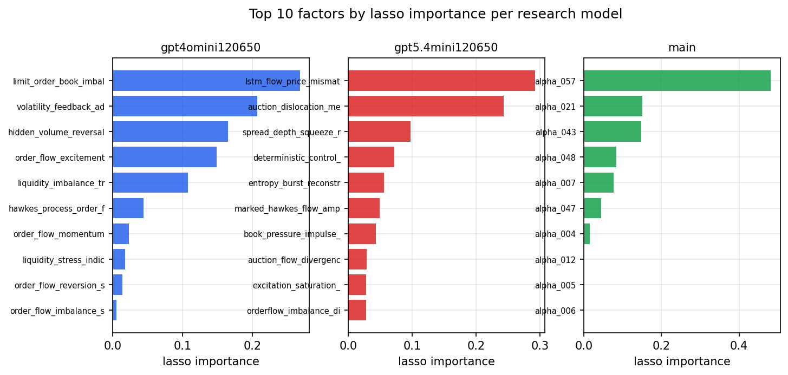

*Top factors by lasso importance per zoo*

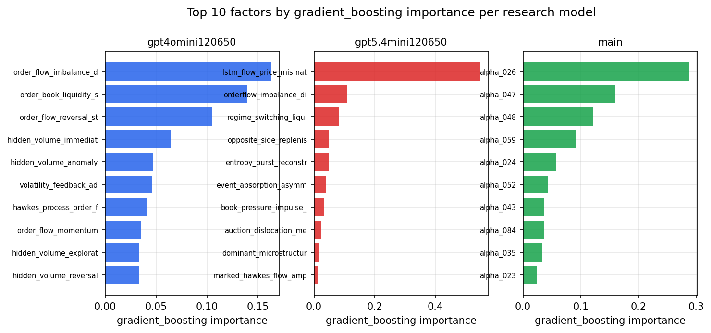

*Top factors by gradient_boosting importance per zoo*

## 4. ML-combined signal — per-underlying vectorised backtest

Each model combines a prerun's factors into ONE signal (fit `factors → forward return` on IS, predict per (bar, underlying)), then that combined signal is run through a simple vectorised backtest — `position(signal) × the underlying's own forward return` — on the held-out OOS tail (+ an equal-weight ensemble). No cross-sectional ranking.

> Config: position=**threshold** (t=1.0, z-score `expanding`), aggregation=**portfolio**, fit-standardise=**per_underlying**, horizon=6.

| prerun | model | n_factors_used | oos_ic | oos_sharpe | is_sharpe | oos_ann_return | oos_max_drawdown |
| --- | --- | --- | --- | --- | --- | --- | --- |
| gpt4omini120650 | linear_regression | 66 | 0.1375 | 12.9008 | 26.6741 | 0.4295 | -0.006 |
| gpt4omini120650 | ridge | 66 | 0.1424 | 18.9817 | 27.2784 | 0.522 | -0.0056 |
| gpt4omini120650 | lasso | 66 | 0.1493 | 26.0261 | 27.9797 | 0.6545 | -0.004 |
| gpt4omini120650 | elastic_net | 66 | 0.1493 | 26.0261 | 27.9797 | 0.6545 | -0.004 |
| gpt4omini120650 | random_forest | 66 | 0.1438 | 17.1881 | 25.6173 | 0.4914 | -0.0049 |
| gpt4omini120650 | gradient_boosting | 66 | 0.1411 | -1.7164 | 7.8266 | -0.034 | -0.0061 |
| gpt4omini120650 | xgboost | 66 | 0.1467 | -1.4101 | 15.3247 | -0.0338 | -0.0057 |
| gpt4omini120650 | lightgbm | 66 | 0.1478 | -1.9985 | 14.8763 | -0.0506 | -0.0088 |
| gpt4omini120650 | ensemble | 66 | 0.1437 | 13.9361 | 25.811 | 0.4628 | -0.0056 |
| gpt5.4mini120650 | linear_regression | 69 | 0.1525 | 22.4408 | 25.0402 | 0.6723 | -0.0038 |
| gpt5.4mini120650 | ridge | 69 | 0.1509 | 22.6015 | 23.4627 | 0.6813 | -0.0038 |
| gpt5.4mini120650 | lasso | 69 | 0.1445 | 18.8525 | 22.0754 | 0.573 | -0.0049 |
| gpt5.4mini120650 | elastic_net | 69 | 0.144 | 18.6731 | 22.013 | 0.568 | -0.0049 |
| gpt5.4mini120650 | random_forest | 69 | 0.1831 | 34.017 | 30.6682 | 0.8475 | -0.0027 |
| gpt5.4mini120650 | gradient_boosting | 69 | 0.1603 | 1.5364 | 6.239 | 0.0233 | -0.0037 |
| gpt5.4mini120650 | xgboost | 69 | 0.197 | 10.7988 | 19.4067 | 0.1773 | -0.0027 |
| gpt5.4mini120650 | lightgbm | 69 | 0.1986 | 4.4772 | 16.984 | 0.1026 | -0.0049 |
| gpt5.4mini120650 | ensemble | 69 | 0.1756 | 24.0203 | 24.1591 | 0.6824 | -0.0038 |
| main | linear_regression | 78 | 0.0056 | -2.1507 | 12.1139 | -0.0291 | -0.0038 |
| main | ridge | 78 | 0.0134 | 1.9257 | 12.0053 | 0.0259 | -0.0022 |
| main | lasso | 78 | 0.0418 | 21.5741 | 11.327 | 0.2204 | -0.001 |
| main | elastic_net | 78 | 0.0418 | 21.5741 | 11.327 | 0.2204 | -0.001 |
| main | random_forest | 78 | 0.0336 | 7.2769 | 11.2557 | 0.1575 | -0.0036 |
| main | gradient_boosting | 78 | 0.03 | 8.8486 | 8.9303 | 0.0546 | -0.0014 |
| main | xgboost | 78 | 0.0332 | 1.417 | 9.8951 | 0.01 | -0.0014 |
| main | lightgbm | 78 | 0.0355 | 2.3758 | 13.0578 | 0.0295 | -0.0029 |
| main | ensemble | 78 | 0.0297 | 13.532 | 12.2497 | 0.1549 | -0.0021 |

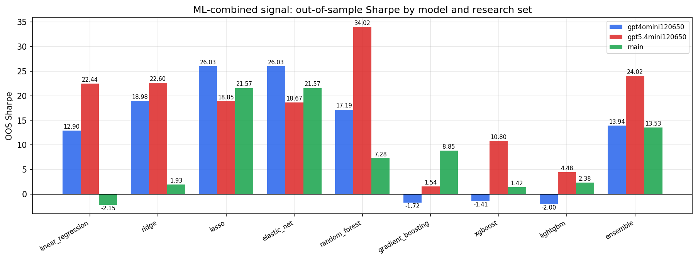

*ML-combined OOS Sharpe by model and research set*

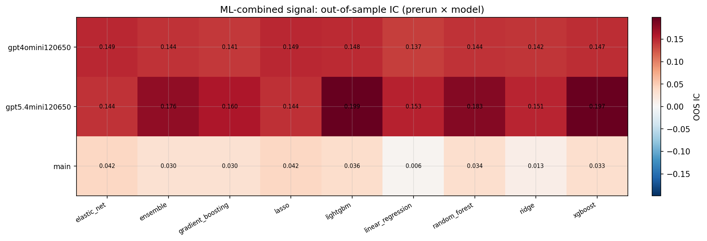

*ML-combined OOS IC (prerun × model)*

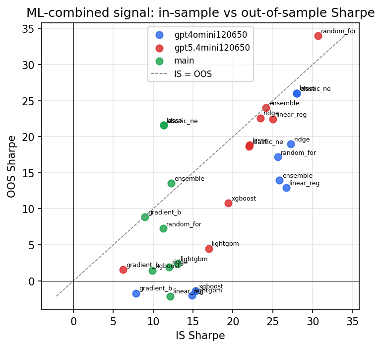

*IS vs OOS Sharpe (overfitting diagnostic)*

---
*Generated by `run_model_comparison.py`. Tables: `*.csv`; interactive: `comparison.ipynb`.*
