# Research-LLM factor comparison — `2024-08`

Comparing the **factor output of different research LLMs** on three axes (raw factor quality → factors as ML features → factors through the full agentic fund). The panel, IS/OOS split, horizon and model hyper-parameters are held identical across preruns — the *only* variable is the factor set.

## Preruns compared

| prerun | research_model | usable_factors | dropped_factors |
| --- | --- | --- | --- |
| gpt4omini120650 | gpt-4o-mini | 66 | 0 |
| gpt5.4mini120650 | gpt-5.4-mini | 69 | 0 |
| main | seed library | 78 | 10 |

> Dropped factors declare fields the current data doesn't have yet (e.g. fundamentals); they light up unchanged once that data is downloaded.

*Usable vs awaiting-data factors per research model*

## Key findings

- **Best ML-combined OOS Sharpe:** `gpt5.4mini120650` with `lasso` (OOS Sharpe = 37.359).
- **Mean OOS Sharpe across models, by research set:** `gpt5.4mini120650` = 19.593, `gpt4omini120650` = 16.078, `main` = 4.150.
- **Highest mean single-factor |IC| (h=6):** `gpt4omini120650` (mean |IC| = 0.0346).
- **Most diverse zoo (highest effective/raw factor ratio):** `gpt5.4mini120650` (eff 54.8 of 69, ratio 0.79).
- **Best selection-deflated single-factor |IC|:** `main` (deflated |IC| = 0.5489 from 37 factors tried).

## 1. Single-factor IC (raw factor quality)

Per-underlying time-series Spearman rank-IC of every researched factor, recomputed on the shared panel at horizons h=1, h=6, h=60. The per-underlying IC correlates each factor's value vector with the underlying's own forward-return vector (pooled across underlyings); the cross-sectional IC ranks across underlyings per timestamp.

| prerun | n_factors | mean_abs_ic_1 | mean_abs_ic_6 | mean_abs_ic_60 | mean_abs_icir_6 | best_factor_h6 | best_abs_ic_h6 |
| --- | --- | --- | --- | --- | --- | --- | --- |
| gpt4omini120650 | 66 | 0.038 | 0.0346 | 0.0188 | 1.5292 | limit_order_book_imbalance_surge | 0.1281 |
| gpt5.4mini120650 | 69 | 0.0236 | 0.0239 | 0.0128 | 1.3285 | lstm_flow_price_mismatch | 0.1168 |
| main | 78 | 0.0431 | 0.033 | 0.0088 | 0.7397 | alpha_066 | 0.5559 |

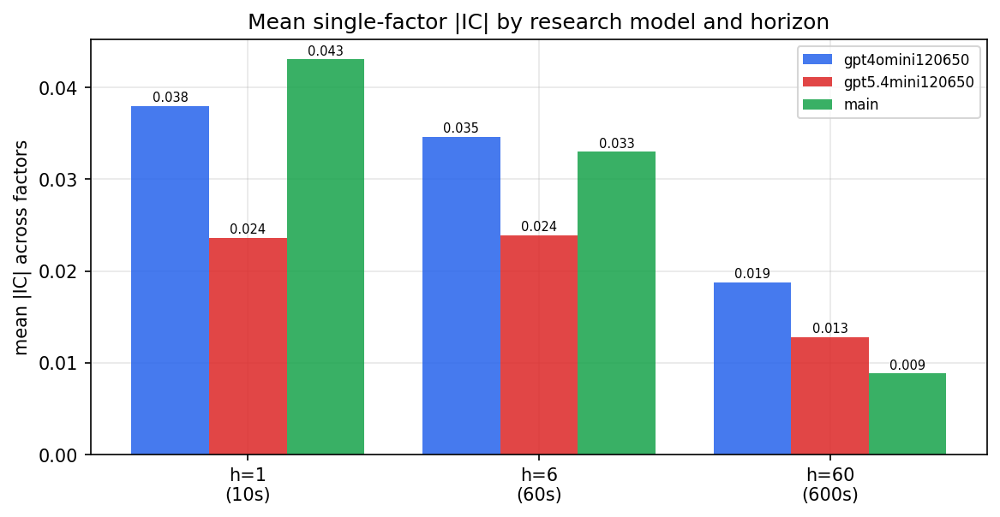

*Mean |IC| by research model and horizon*

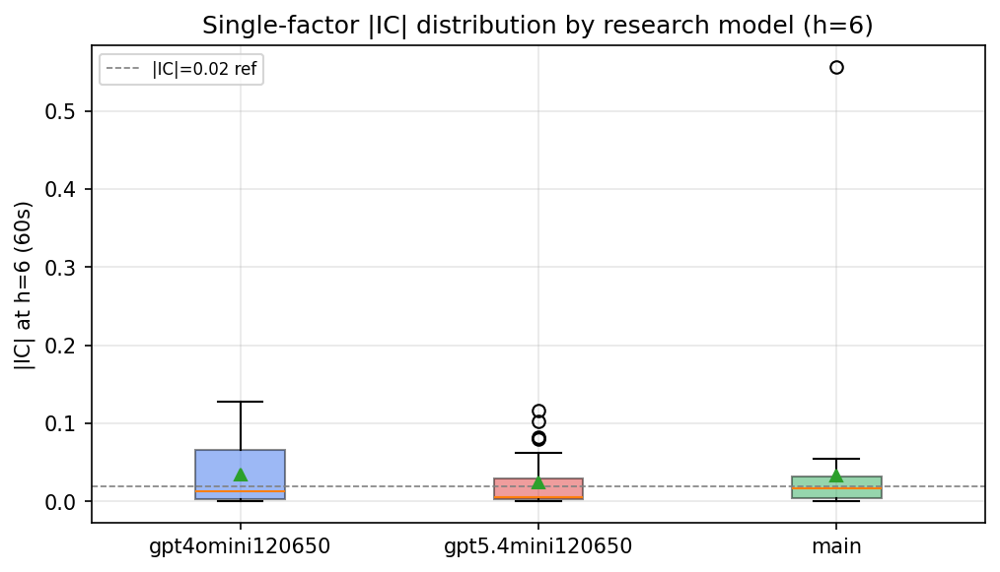

*Per-factor |IC| distribution by research model*

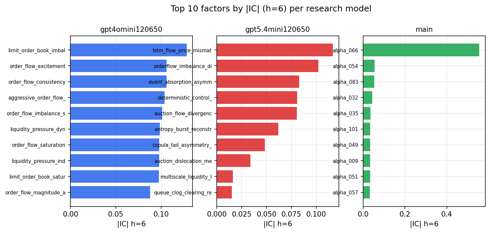

*Top factors by |IC| per research model*

## 2. Factor diversity & redundancy

Pairwise correlation of each zoo's *signals*. `eff_n_factors` is the effective number of independent factors (participation ratio of the correlation eigenvalues); `eff_ratio` and `redundancy` summarise how much unique information the zoo holds vs. how much is duplicated; `n_clusters` groups factors at |corr| ≥ 0.7.

| prerun | n_factors | eff_n_factors | eff_ratio | mean_abs_corr | n_clusters | redundancy |
| --- | --- | --- | --- | --- | --- | --- |
| gpt4omini120650 | 66 | 29.5694 | 0.448 | 0.046 | 51 | 0.552 |
| gpt5.4mini120650 | 69 | 54.8236 | 0.7945 | 0.0108 | 65 | 0.2055 |
| main | 78 | 34.3183 | 0.44 | 0.0431 | 47 | 0.56 |

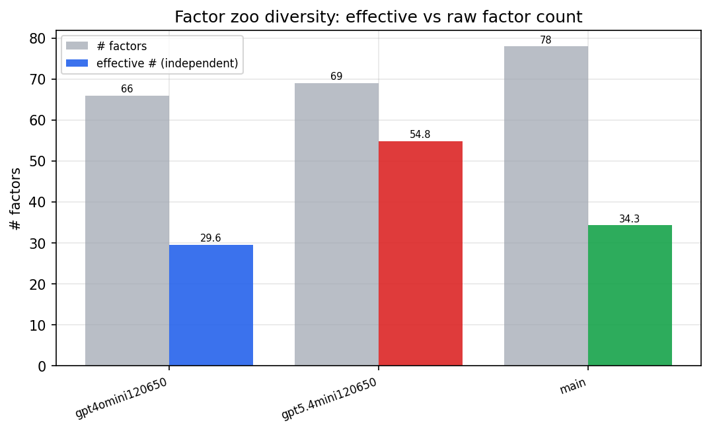

*Effective vs raw factor count per research model*

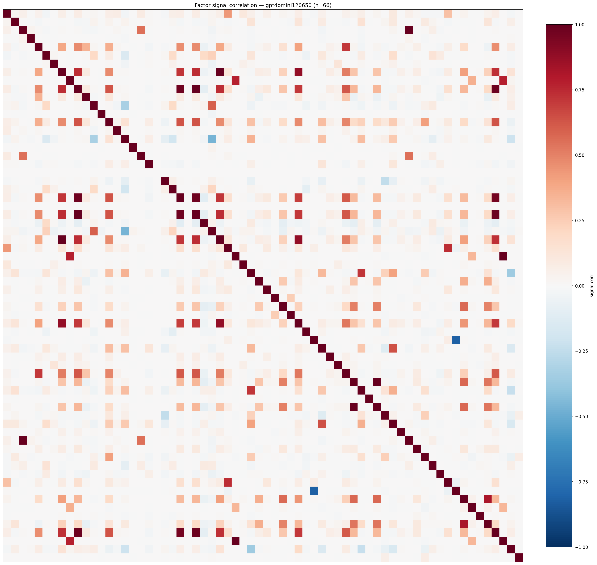

*Signal correlation matrix — gpt4omini120650*

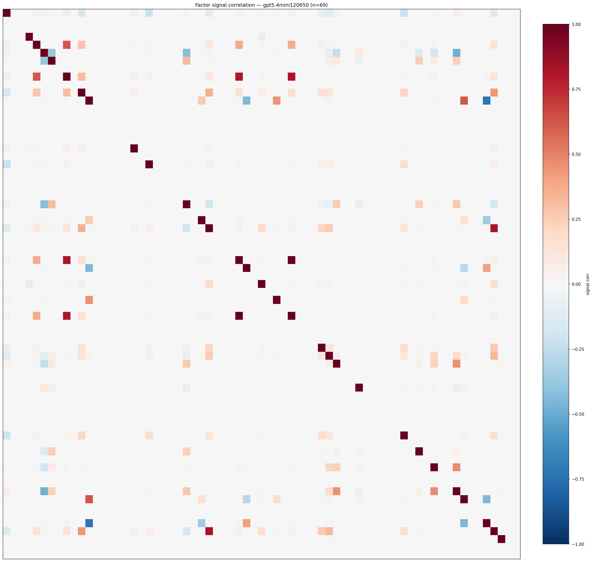

*Signal correlation matrix — gpt5.4mini120650*

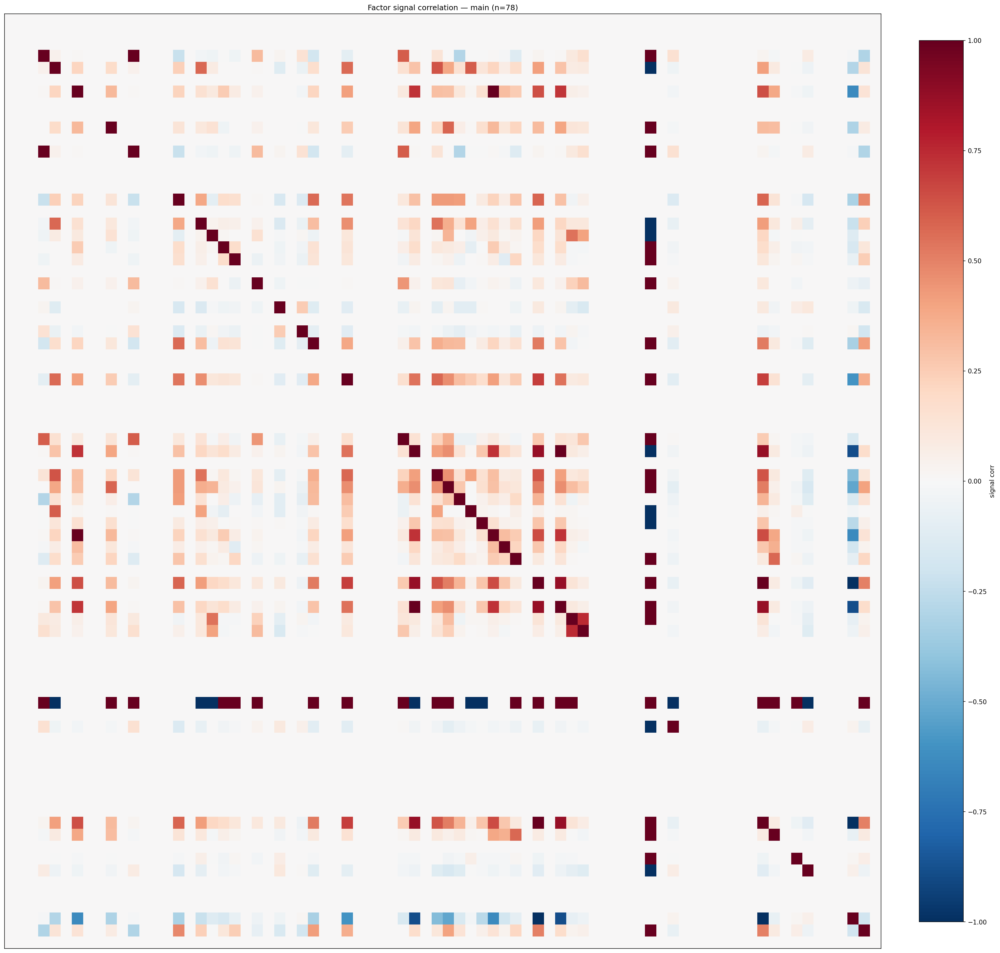

*Signal correlation matrix — main*

## 3. Deflation & model-based importance

`deflated_best_ic` haircuts each zoo's best |IC| for the number of factors tried (`ic_n_tested`) — a bigger zoo's best factor is more likely to be lucky. `lasso_n_nonzero` / `lasso_sparsity` show how many factors a sparse linear model actually keeps (model-view redundancy).

| prerun | best_ic | deflated_best_ic | deflated_best_t | ic_n_tested | ic_n_obs | lasso_n_nonzero | lasso_sparsity |
| --- | --- | --- | --- | --- | --- | --- | --- |
| gpt4omini120650 | 0.1281 | 0.1205 | 45.7108 | 64 | 143998 | 9 | 0.8636 |
| gpt5.4mini120650 | 0.1168 | 0.11 | 41.727 | 30 | 143998 | 11 | 0.8406 |
| main | 0.5559 | 0.5489 | 208.2744 | 37 | 143998 | 2 | 0.9744 |

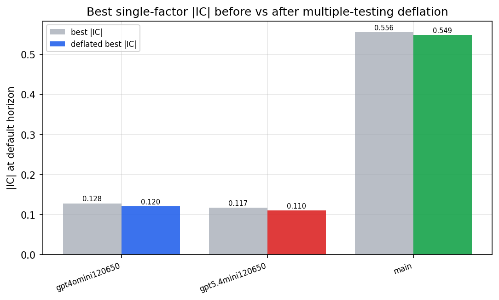

*Best |IC| before vs after multiple-testing deflation*

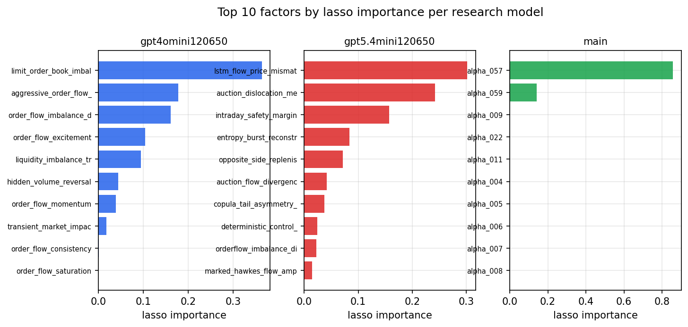

*Top factors by lasso importance per zoo*

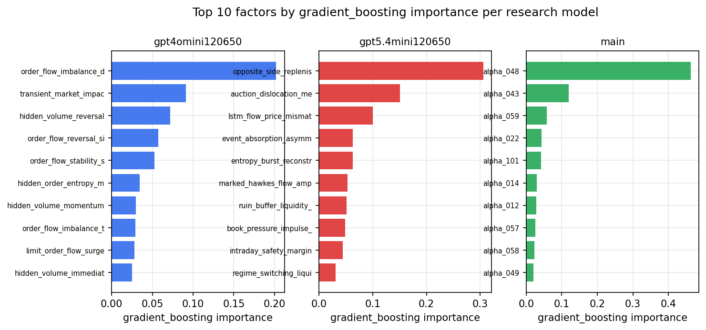

*Top factors by gradient_boosting importance per zoo*

## 4. ML-combined signal — per-underlying vectorised backtest

Each model combines a prerun's factors into ONE signal (fit `factors → forward return` on IS, predict per (bar, underlying)), then that combined signal is run through a simple vectorised backtest — `position(signal) × the underlying's own forward return` — on the held-out OOS tail (+ an equal-weight ensemble). No cross-sectional ranking.

> Config: position=**threshold** (t=1.0, z-score `expanding`), aggregation=**portfolio**, fit-standardise=**per_underlying**, horizon=6.

| prerun | model | n_factors_used | oos_ic | oos_sharpe | is_sharpe | oos_ann_return | oos_max_drawdown |
| --- | --- | --- | --- | --- | --- | --- | --- |
| gpt4omini120650 | linear_regression | 66 | 0.1558 | 9.7892 | 25.5532 | 0.2109 | -0.0025 |
| gpt4omini120650 | ridge | 66 | 0.1562 | 9.2966 | 24.2123 | 0.2008 | -0.0024 |
| gpt4omini120650 | lasso | 66 | 0.1577 | 33.0191 | 27.0912 | 0.9004 | -0.0026 |
| gpt4omini120650 | elastic_net | 66 | 0.1582 | 33.1785 | 26.907 | 0.9061 | -0.0026 |
| gpt4omini120650 | random_forest | 66 | 0.1585 | 26.4633 | 22.2236 | 0.9251 | -0.0027 |
| gpt4omini120650 | gradient_boosting | 66 | 0.1496 | 3.7623 | 12.056 | 0.0455 | -0.0019 |
| gpt4omini120650 | xgboost | 66 | 0.1684 | 3.9923 | 14.6226 | 0.0796 | -0.0028 |
| gpt4omini120650 | lightgbm | 66 | 0.1658 | 3.4969 | 13.6141 | 0.1202 | -0.0039 |
| gpt4omini120650 | ensemble | 66 | 0.1653 | 21.7076 | 21.5596 | 0.6887 | -0.0031 |
| gpt5.4mini120650 | linear_regression | 69 | 0.1534 | 13.672 | 24.1853 | 0.4517 | -0.0075 |
| gpt5.4mini120650 | ridge | 69 | 0.1522 | 17.0091 | 23.7658 | 0.5693 | -0.0076 |
| gpt5.4mini120650 | lasso | 69 | 0.1553 | 37.3591 | 20.6387 | 0.8387 | -0.0019 |
| gpt5.4mini120650 | elastic_net | 69 | 0.1539 | 32.7562 | 20.9724 | 0.8255 | -0.0036 |
| gpt5.4mini120650 | random_forest | 69 | 0.1728 | 36.4387 | 30.8616 | 0.9298 | -0.0035 |
| gpt5.4mini120650 | gradient_boosting | 69 | 0.1574 | -1.7904 | 17.1175 | -0.013 | -0.002 |
| gpt5.4mini120650 | xgboost | 69 | 0.1772 | 13.5463 | 20.7523 | 0.2072 | -0.0021 |
| gpt5.4mini120650 | lightgbm | 69 | 0.1789 | 0.6384 | 15.7523 | 0.0104 | -0.0037 |
| gpt5.4mini120650 | ensemble | 69 | 0.1773 | 26.7059 | 26.3702 | 0.8037 | -0.0055 |
| main | linear_regression | 78 | 0.0189 | 5.6773 | 12.0687 | 0.1108 | -0.0015 |
| main | ridge | 78 | 0.0201 | 6.9085 | 12.2181 | 0.1499 | -0.0021 |
| main | lasso | 78 | 0.0313 | 9.7146 | 13.5865 | 0.1727 | -0.0022 |
| main | elastic_net | 78 | 0.0313 | 9.7146 | 13.5865 | 0.1727 | -0.0022 |
| main | random_forest | 78 | 0.0196 | 2.1113 | 12.97 | 0.0483 | -0.0043 |
| main | gradient_boosting | 78 | 0.022 | -3.1018 | 6.6608 | -0.0174 | -0.002 |
| main | xgboost | 78 | 0.0128 | -1.3343 | 7.9833 | -0.0071 | -0.0019 |
| main | lightgbm | 78 | 0.0186 | 1.4356 | 13.9468 | 0.0204 | -0.002 |
| main | ensemble | 78 | 0.0205 | 6.2209 | 14.467 | 0.1351 | -0.0022 |

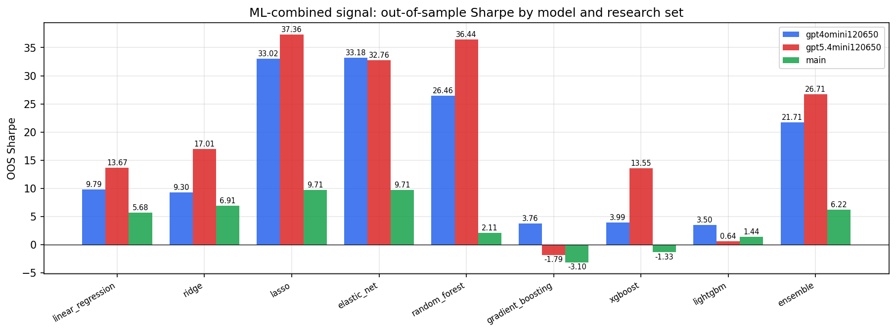

*ML-combined OOS Sharpe by model and research set*

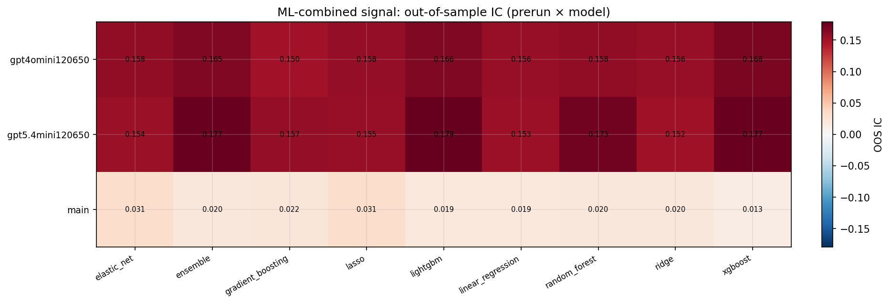

*ML-combined OOS IC (prerun × model)*

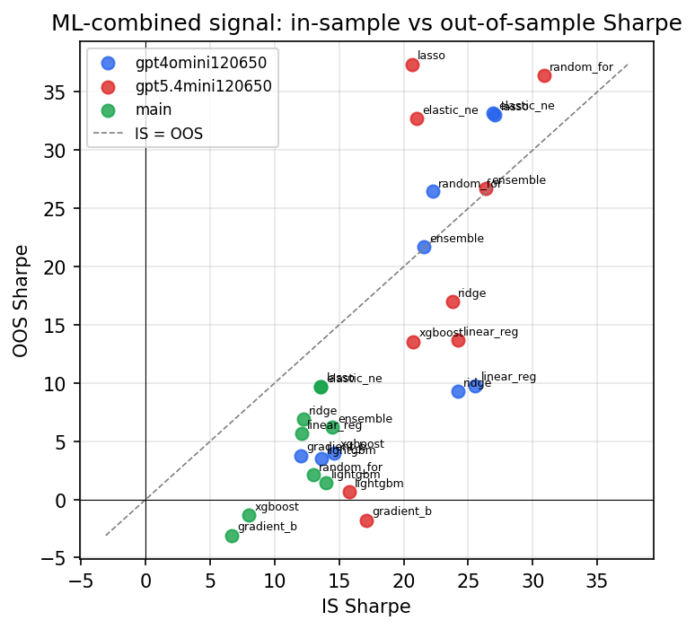

*IS vs OOS Sharpe (overfitting diagnostic)*

---
*Generated by `run_model_comparison.py`. Tables: `*.csv`; interactive: `comparison.ipynb`.*
