# Research-LLM factor comparison — `2024-09`

Comparing the **factor output of different research LLMs** on three axes (raw factor quality → factors as ML features → factors through the full agentic fund). The panel, IS/OOS split, horizon and model hyper-parameters are held identical across preruns — the *only* variable is the factor set.

## Preruns compared

| prerun | research_model | usable_factors | dropped_factors |
| --- | --- | --- | --- |
| gpt4omini120650 | gpt-4o-mini | 66 | 0 |
| gpt5.4mini120650 | gpt-5.4-mini | 69 | 0 |
| main | seed library | 78 | 10 |

> Dropped factors declare fields the current data doesn't have yet (e.g. fundamentals); they light up unchanged once that data is downloaded.

*Usable vs awaiting-data factors per research model*

## Key findings

- **Best ML-combined OOS Sharpe:** `gpt5.4mini120650` with `ensemble` (OOS Sharpe = 45.960).
- **Mean OOS Sharpe across models, by research set:** `gpt5.4mini120650` = 31.538, `gpt4omini120650` = 19.846, `main` = 3.502.
- **Highest mean single-factor |IC| (h=6):** `gpt4omini120650` (mean |IC| = 0.0336).
- **Most diverse zoo (highest effective/raw factor ratio):** `gpt5.4mini120650` (eff 53.6 of 69, ratio 0.78).
- **Best selection-deflated single-factor |IC|:** `main` (deflated |IC| = 0.1929 from 37 factors tried).

## 1. Single-factor IC (raw factor quality)

Per-underlying time-series Spearman rank-IC of every researched factor, recomputed on the shared panel at horizons h=1, h=6, h=60. The per-underlying IC correlates each factor's value vector with the underlying's own forward-return vector (pooled across underlyings); the cross-sectional IC ranks across underlyings per timestamp.

| prerun | n_factors | mean_abs_ic_1 | mean_abs_ic_6 | mean_abs_ic_60 | mean_abs_icir_6 | best_factor_h6 | best_abs_ic_h6 |
| --- | --- | --- | --- | --- | --- | --- | --- |
| gpt4omini120650 | 66 | 0.0404 | 0.0336 | 0.0148 | 1.5081 | limit_order_book_imbalance_surge | 0.1262 |
| gpt5.4mini120650 | 69 | 0.024 | 0.022 | 0.0125 | 1.2958 | lstm_flow_price_mismatch | 0.1123 |
| main | 78 | 0.0321 | 0.0231 | 0.0295 | 0.6775 | alpha_066 | 0.2 |

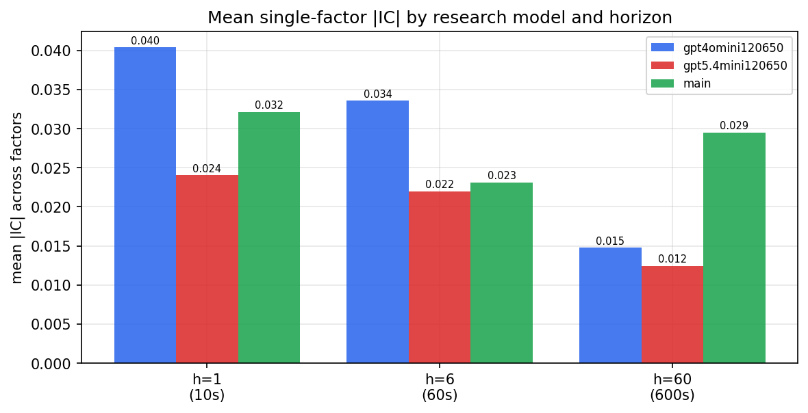

*Mean |IC| by research model and horizon*

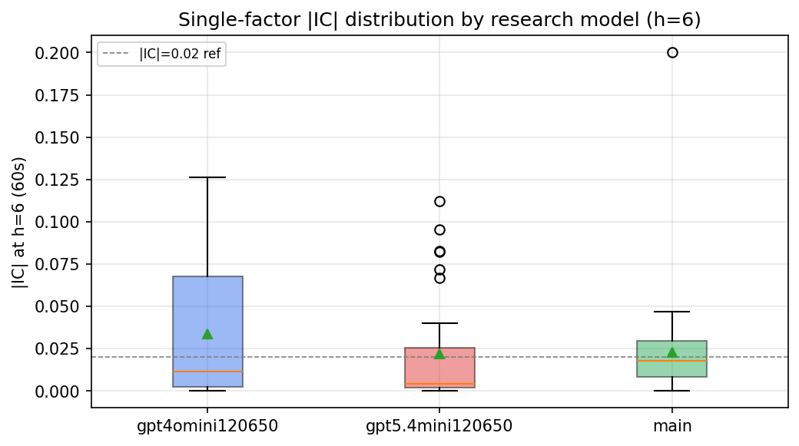

*Per-factor |IC| distribution by research model*

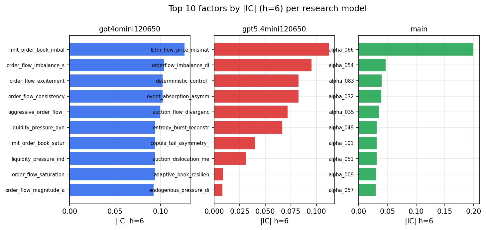

*Top factors by |IC| per research model*

## 2. Factor diversity & redundancy

Pairwise correlation of each zoo's *signals*. `eff_n_factors` is the effective number of independent factors (participation ratio of the correlation eigenvalues); `eff_ratio` and `redundancy` summarise how much unique information the zoo holds vs. how much is duplicated; `n_clusters` groups factors at |corr| ≥ 0.7.

| prerun | n_factors | eff_n_factors | eff_ratio | mean_abs_corr | n_clusters | redundancy |
| --- | --- | --- | --- | --- | --- | --- |
| gpt4omini120650 | 66 | 29.7036 | 0.4501 | 0.0466 | 54 | 0.5499 |
| gpt5.4mini120650 | 69 | 53.6411 | 0.7774 | 0.011 | 64 | 0.2226 |
| main | 78 | 34.1176 | 0.4374 | 0.044 | 49 | 0.5626 |

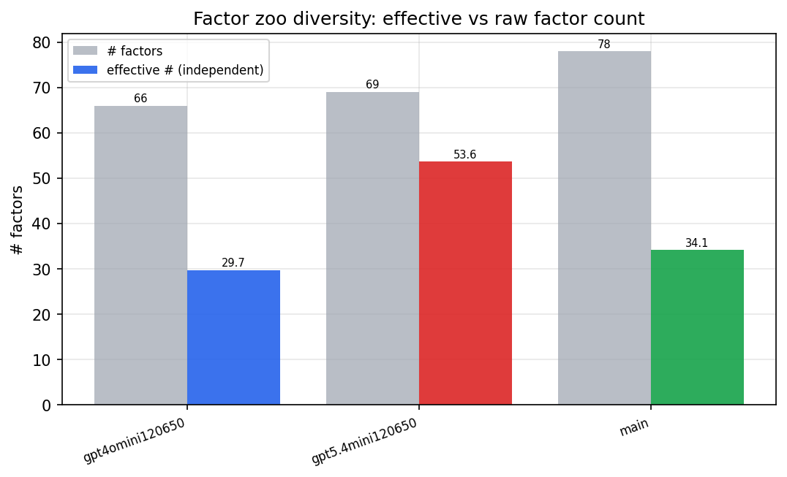

*Effective vs raw factor count per research model*

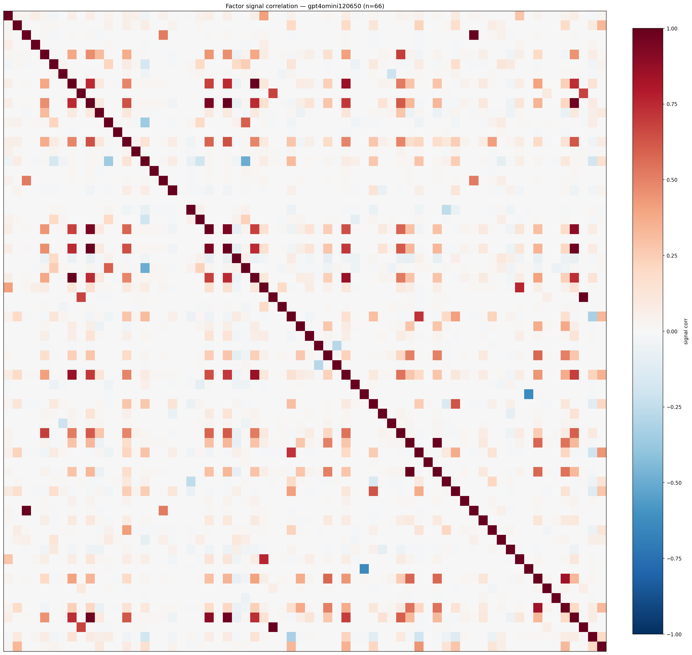

*Signal correlation matrix — gpt4omini120650*

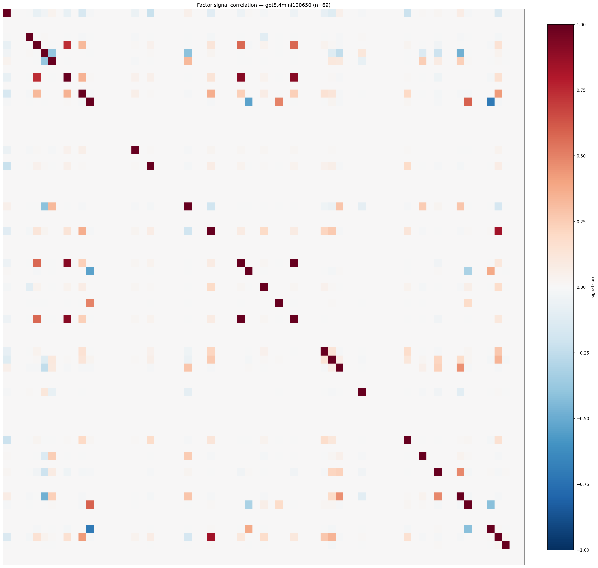

*Signal correlation matrix — gpt5.4mini120650*

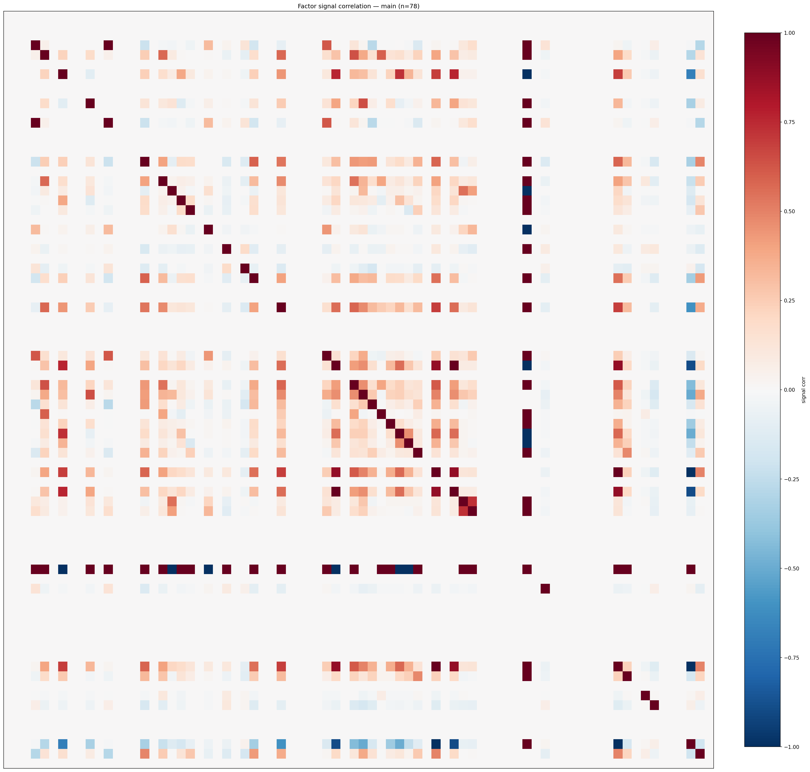

*Signal correlation matrix — main*

## 3. Deflation & model-based importance

`deflated_best_ic` haircuts each zoo's best |IC| for the number of factors tried (`ic_n_tested`) — a bigger zoo's best factor is more likely to be lucky. `lasso_n_nonzero` / `lasso_sparsity` show how many factors a sparse linear model actually keeps (model-view redundancy).

| prerun | best_ic | deflated_best_ic | deflated_best_t | ic_n_tested | ic_n_obs | lasso_n_nonzero | lasso_sparsity |
| --- | --- | --- | --- | --- | --- | --- | --- |
| gpt4omini120650 | 0.1262 | 0.1186 | 44.9932 | 64 | 143997 | 8 | 0.8788 |
| gpt5.4mini120650 | 0.1123 | 0.1054 | 40.0038 | 30 | 143997 | 18 | 0.7391 |
| main | 0.2 | 0.1929 | 73.2065 | 37 | 143997 | 4 | 0.9487 |

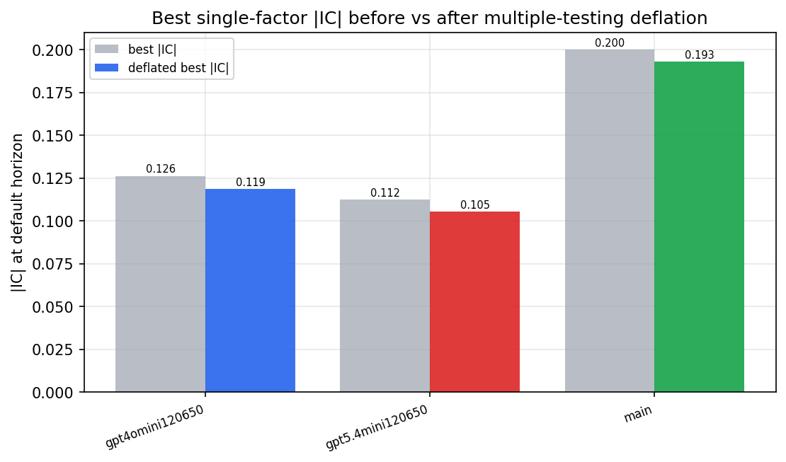

*Best |IC| before vs after multiple-testing deflation*

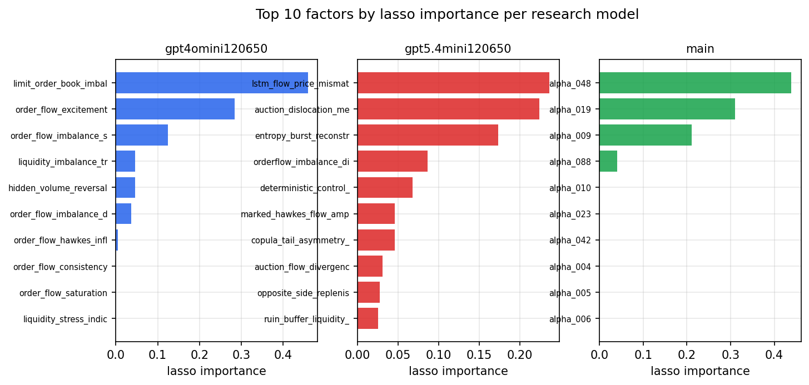

*Top factors by lasso importance per zoo*

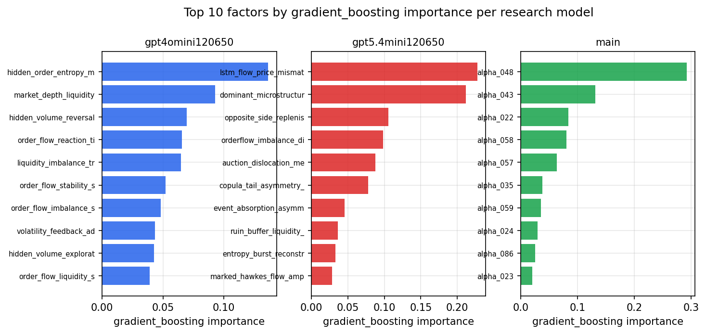

*Top factors by gradient_boosting importance per zoo*

## 4. ML-combined signal — per-underlying vectorised backtest

Each model combines a prerun's factors into ONE signal (fit `factors → forward return` on IS, predict per (bar, underlying)), then that combined signal is run through a simple vectorised backtest — `position(signal) × the underlying's own forward return` — on the held-out OOS tail (+ an equal-weight ensemble). No cross-sectional ranking.

> Config: position=**threshold** (t=1.0, z-score `expanding`), aggregation=**portfolio**, fit-standardise=**per_underlying**, horizon=6.

| prerun | model | n_factors_used | oos_ic | oos_sharpe | is_sharpe | oos_ann_return | oos_max_drawdown |
| --- | --- | --- | --- | --- | --- | --- | --- |
| gpt4omini120650 | linear_regression | 66 | 0.1534 | 27.045 | 21.4446 | 0.5954 | -0.0027 |
| gpt4omini120650 | ridge | 66 | 0.1536 | 27.5058 | 21.5255 | 0.5864 | -0.0028 |
| gpt4omini120650 | lasso | 66 | 0.1559 | 27.2965 | 21.6493 | 0.5781 | -0.0027 |
| gpt4omini120650 | elastic_net | 66 | 0.1564 | 27.6764 | 21.574 | 0.5734 | -0.0027 |
| gpt4omini120650 | random_forest | 66 | 0.1546 | 44.8781 | 28.1493 | 0.7764 | -0.0018 |
| gpt4omini120650 | gradient_boosting | 66 | 0.1527 | -0.0329 | 8.0172 | -0.0002 | -0.0024 |
| gpt4omini120650 | xgboost | 66 | 0.1562 | 3.515 | 12.0835 | 0.0528 | -0.0026 |
| gpt4omini120650 | lightgbm | 66 | 0.1594 | -4.5206 | 14.1685 | -0.0866 | -0.0076 |
| gpt4omini120650 | ensemble | 66 | 0.1632 | 25.2537 | 22.0443 | 0.5177 | -0.0027 |
| gpt5.4mini120650 | linear_regression | 69 | 0.155 | 30.8323 | 19.7276 | 0.5119 | -0.0014 |
| gpt5.4mini120650 | ridge | 69 | 0.155 | 30.2277 | 20.0479 | 0.5122 | -0.0016 |
| gpt5.4mini120650 | lasso | 69 | 0.1559 | 41.1955 | 24.3854 | 0.85 | -0.002 |
| gpt5.4mini120650 | elastic_net | 69 | 0.1559 | 41.1955 | 24.3854 | 0.85 | -0.002 |
| gpt5.4mini120650 | random_forest | 69 | 0.1808 | 43.0905 | 29.7622 | 0.9453 | -0.002 |
| gpt5.4mini120650 | gradient_boosting | 69 | 0.1733 | -0.9436 | 9.0141 | -0.0062 | -0.0017 |
| gpt5.4mini120650 | xgboost | 69 | 0.1833 | 34.9807 | 21.5596 | 0.5626 | -0.0015 |
| gpt5.4mini120650 | lightgbm | 69 | 0.1894 | 17.3017 | 15.3741 | 0.1906 | -0.0021 |
| gpt5.4mini120650 | ensemble | 69 | 0.1787 | 45.9596 | 26.8204 | 0.878 | -0.0014 |
| main | linear_regression | 78 | 0.0226 | 6.022 | 12.6474 | 0.0919 | -0.0026 |
| main | ridge | 78 | 0.0244 | 6.287 | 12.5889 | 0.0924 | -0.0031 |
| main | lasso | 78 | 0.0328 | 7.5842 | 10.9778 | 0.1113 | -0.0031 |
| main | elastic_net | 78 | 0.0328 | 7.5842 | 10.9778 | 0.1113 | -0.0031 |
| main | random_forest | 78 | 0.0174 | 2.599 | 15.8082 | 0.0503 | -0.006 |
| main | gradient_boosting | 78 | 0.0144 | -1.6525 | 11.3475 | -0.0238 | -0.0062 |
| main | xgboost | 78 | 0.0149 | -0.7417 | 14.4971 | -0.0125 | -0.0069 |
| main | lightgbm | 78 | 0.019 | -0.3247 | 17.2981 | -0.0047 | -0.0065 |
| main | ensemble | 78 | 0.0232 | 4.1606 | 16.5266 | 0.0788 | -0.0052 |

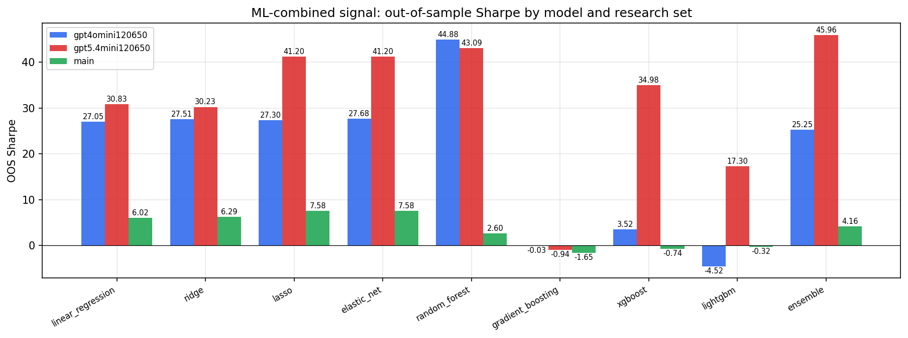

*ML-combined OOS Sharpe by model and research set*

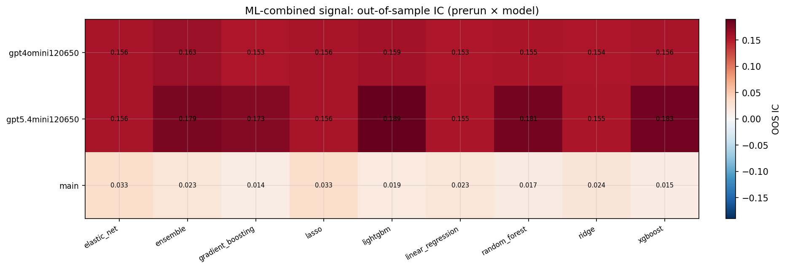

*ML-combined OOS IC (prerun × model)*

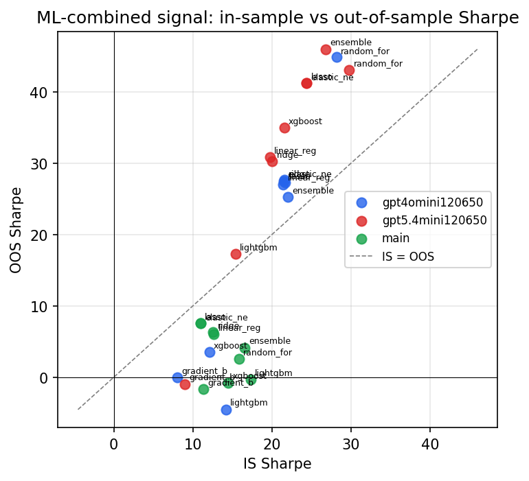

*IS vs OOS Sharpe (overfitting diagnostic)*

---
*Generated by `run_model_comparison.py`. Tables: `*.csv`; interactive: `comparison.ipynb`.*
