# Research-LLM factor comparison — `2024-10`

Comparing the **factor output of different research LLMs** on three axes (raw factor quality → factors as ML features → factors through the full agentic fund). The panel, IS/OOS split, horizon and model hyper-parameters are held identical across preruns — the *only* variable is the factor set.

## Preruns compared

| prerun | research_model | usable_factors | dropped_factors |
| --- | --- | --- | --- |
| gpt4omini120650 | gpt-4o-mini | 66 | 0 |
| gpt5.4mini120650 | gpt-5.4-mini | 69 | 0 |
| main | seed library | 78 | 10 |

> Dropped factors declare fields the current data doesn't have yet (e.g. fundamentals); they light up unchanged once that data is downloaded.

*Usable vs awaiting-data factors per research model*

## Key findings

- **Best ML-combined OOS Sharpe:** `gpt5.4mini120650` with `random_forest` (OOS Sharpe = 44.750).
- **Mean OOS Sharpe across models, by research set:** `gpt5.4mini120650` = 26.875, `gpt4omini120650` = 17.227, `main` = 2.537.
- **Highest mean single-factor |IC| (h=6):** `gpt4omini120650` (mean |IC| = 0.0377).
- **Most diverse zoo (highest effective/raw factor ratio):** `gpt5.4mini120650` (eff 54.1 of 69, ratio 0.78).
- **Best selection-deflated single-factor |IC|:** `main` (deflated |IC| = 0.1930 from 37 factors tried).

## 1. Single-factor IC (raw factor quality)

Per-underlying time-series Spearman rank-IC of every researched factor, recomputed on the shared panel at horizons h=1, h=6, h=60. The per-underlying IC correlates each factor's value vector with the underlying's own forward-return vector (pooled across underlyings); the cross-sectional IC ranks across underlyings per timestamp.

| prerun | n_factors | mean_abs_ic_1 | mean_abs_ic_6 | mean_abs_ic_60 | mean_abs_icir_6 | best_factor_h6 | best_abs_ic_h6 |
| --- | --- | --- | --- | --- | --- | --- | --- |
| gpt4omini120650 | 66 | 0.0435 | 0.0377 | 0.016 | 1.677 | limit_order_book_imbalance_surge | 0.1268 |
| gpt5.4mini120650 | 69 | 0.0261 | 0.0249 | 0.0119 | 1.4029 | lstm_flow_price_mismatch | 0.1306 |
| main | 78 | 0.0302 | 0.0201 | 0.0289 | 0.5905 | alpha_066 | 0.2 |

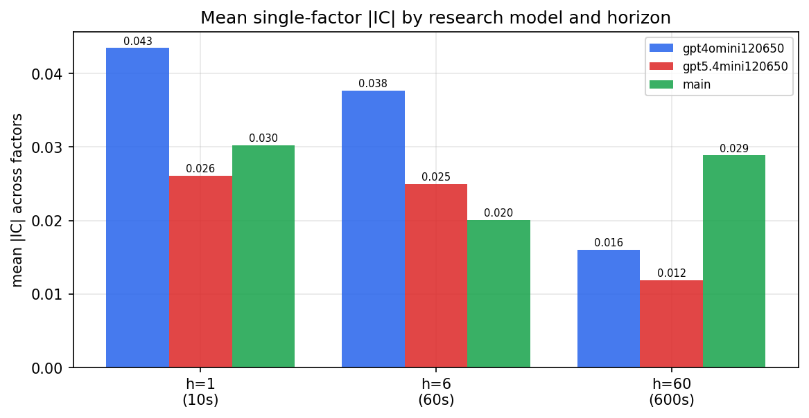

*Mean |IC| by research model and horizon*

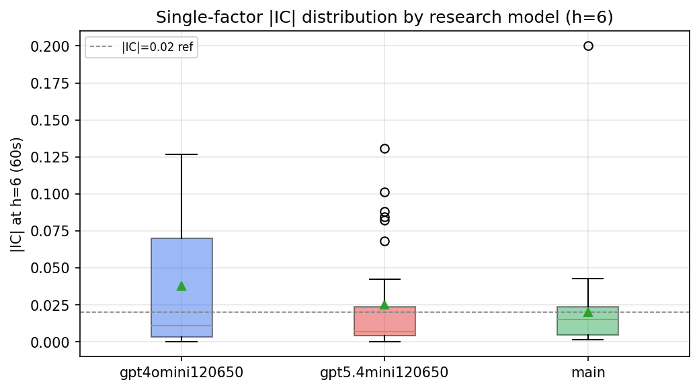

*Per-factor |IC| distribution by research model*

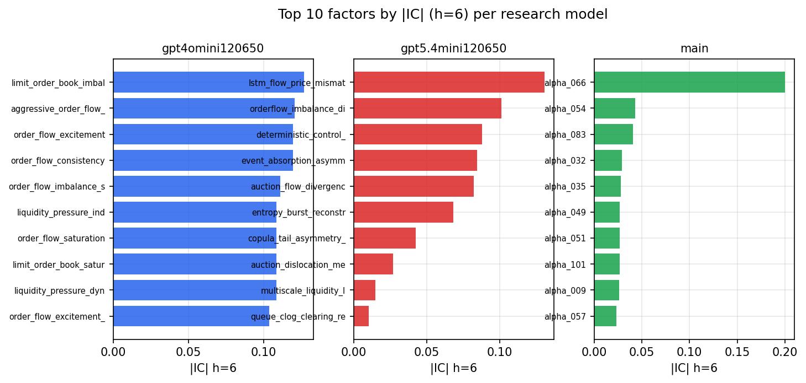

*Top factors by |IC| per research model*

## 2. Factor diversity & redundancy

Pairwise correlation of each zoo's *signals*. `eff_n_factors` is the effective number of independent factors (participation ratio of the correlation eigenvalues); `eff_ratio` and `redundancy` summarise how much unique information the zoo holds vs. how much is duplicated; `n_clusters` groups factors at |corr| ≥ 0.7.

| prerun | n_factors | eff_n_factors | eff_ratio | mean_abs_corr | n_clusters | redundancy |
| --- | --- | --- | --- | --- | --- | --- |
| gpt4omini120650 | 66 | 29.5982 | 0.4485 | 0.0456 | 53 | 0.5515 |
| gpt5.4mini120650 | 69 | 54.1444 | 0.7847 | 0.0103 | 66 | 0.2153 |
| main | 78 | 38.1627 | 0.4893 | 0.0349 | 69 | 0.5107 |

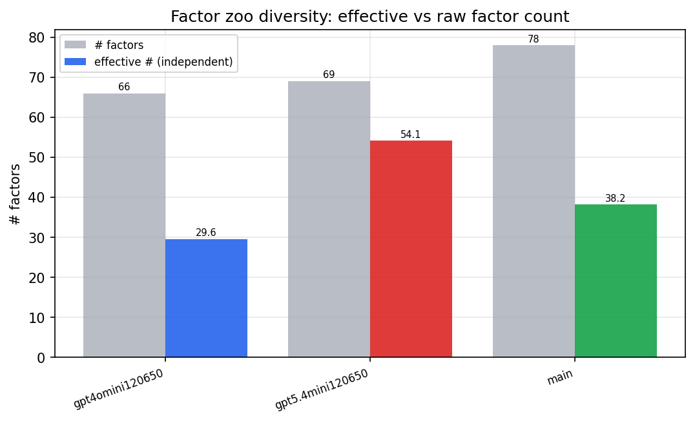

*Effective vs raw factor count per research model*

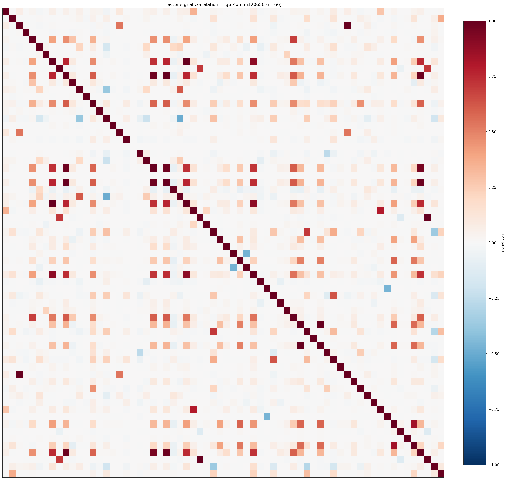

*Signal correlation matrix — gpt4omini120650*

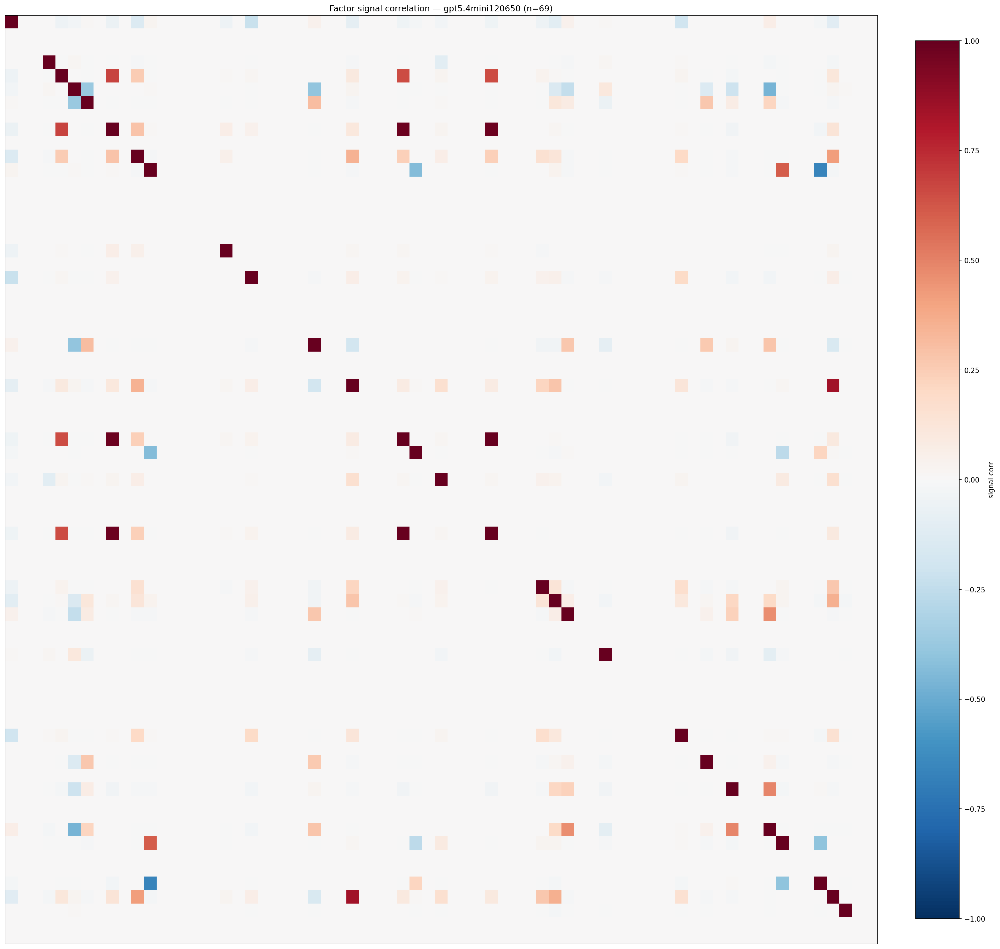

*Signal correlation matrix — gpt5.4mini120650*

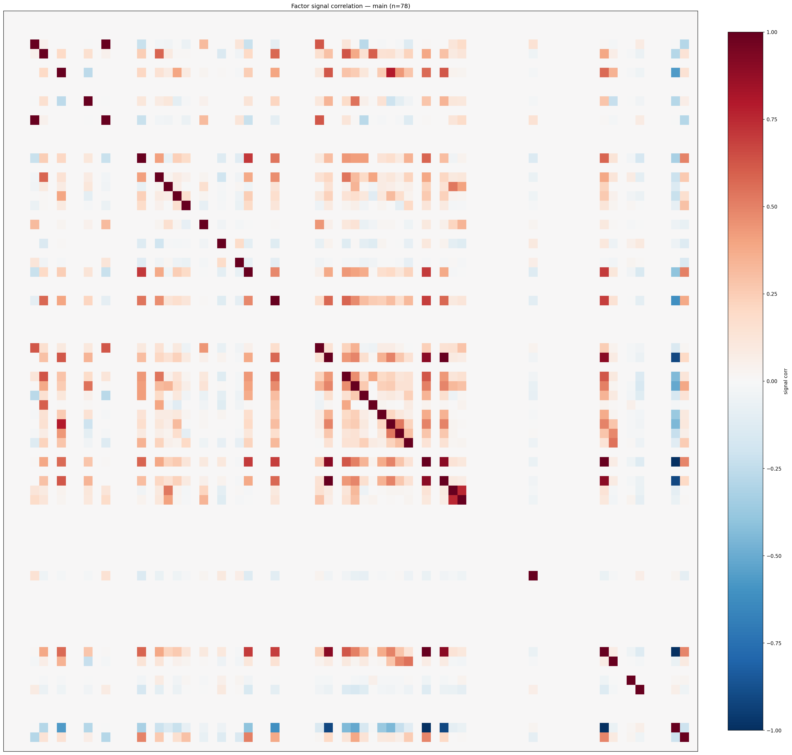

*Signal correlation matrix — main*

## 3. Deflation & model-based importance

`deflated_best_ic` haircuts each zoo's best |IC| for the number of factors tried (`ic_n_tested`) — a bigger zoo's best factor is more likely to be lucky. `lasso_n_nonzero` / `lasso_sparsity` show how many factors a sparse linear model actually keeps (model-view redundancy).

| prerun | best_ic | deflated_best_ic | deflated_best_t | ic_n_tested | ic_n_obs | lasso_n_nonzero | lasso_sparsity |
| --- | --- | --- | --- | --- | --- | --- | --- |
| gpt4omini120650 | 0.1268 | 0.1193 | 45.8188 | 64 | 147417 | 4 | 0.9394 |
| gpt5.4mini120650 | 0.1306 | 0.1238 | 47.5504 | 30 | 147417 | 7 | 0.8986 |
| main | 0.2 | 0.193 | 74.1025 | 37 | 147417 | 0 | 1.0 |

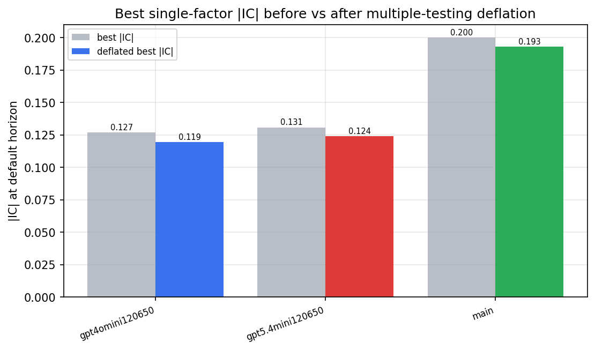

*Best |IC| before vs after multiple-testing deflation*

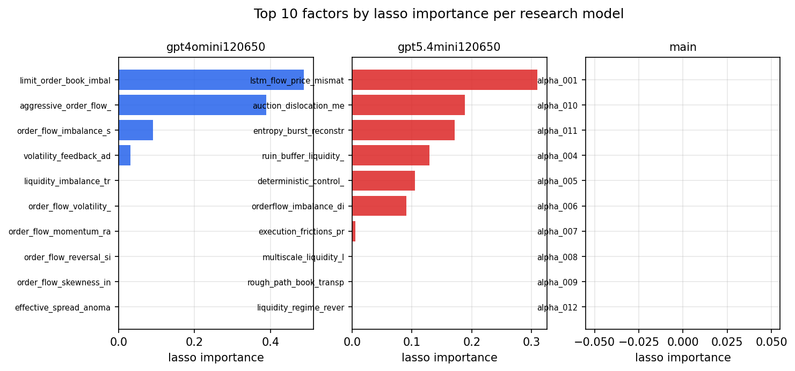

*Top factors by lasso importance per zoo*

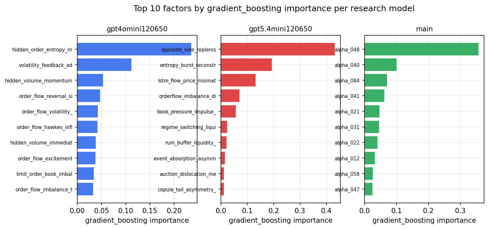

*Top factors by gradient_boosting importance per zoo*

## 4. ML-combined signal — per-underlying vectorised backtest

Each model combines a prerun's factors into ONE signal (fit `factors → forward return` on IS, predict per (bar, underlying)), then that combined signal is run through a simple vectorised backtest — `position(signal) × the underlying's own forward return` — on the held-out OOS tail (+ an equal-weight ensemble). No cross-sectional ranking.

> Config: position=**threshold** (t=1.0, z-score `expanding`), aggregation=**portfolio**, fit-standardise=**per_underlying**, horizon=6.

| prerun | model | n_factors_used | oos_ic | oos_sharpe | is_sharpe | oos_ann_return | oos_max_drawdown |
| --- | --- | --- | --- | --- | --- | --- | --- |
| gpt4omini120650 | linear_regression | 66 | 0.1784 | -0.3053 | 21.1535 | -0.0009 | -0.0009 |
| gpt4omini120650 | ridge | 66 | 0.1795 | -2.6415 | 20.2749 | -0.0279 | -0.0047 |
| gpt4omini120650 | lasso | 66 | 0.1764 | 37.6586 | 43.8004 | 0.6877 | -0.0023 |
| gpt4omini120650 | elastic_net | 66 | 0.1769 | 38.2675 | 35.9256 | 0.6968 | -0.0031 |
| gpt4omini120650 | random_forest | 66 | 0.1786 | 38.6626 | 34.586 | 0.9182 | -0.0032 |
| gpt4omini120650 | gradient_boosting | 66 | 0.1685 | -2.8366 | 7.1529 | -0.0236 | -0.0029 |
| gpt4omini120650 | xgboost | 66 | 0.1789 | 5.3796 | 8.6322 | 0.0804 | -0.0034 |
| gpt4omini120650 | lightgbm | 66 | 0.1863 | 5.1348 | 13.5863 | 0.1241 | -0.0037 |
| gpt4omini120650 | ensemble | 66 | 0.1834 | 35.7268 | 25.1398 | 0.6933 | -0.0035 |
| gpt5.4mini120650 | linear_regression | 69 | 0.1875 | 26.4042 | 25.6235 | 0.7311 | -0.0046 |
| gpt5.4mini120650 | ridge | 69 | 0.1855 | 25.7592 | 24.4388 | 0.7168 | -0.0046 |
| gpt5.4mini120650 | lasso | 69 | 0.1901 | 27.9875 | 28.3614 | 0.78 | -0.0045 |
| gpt5.4mini120650 | elastic_net | 69 | 0.1901 | 27.9875 | 28.3614 | 0.78 | -0.0045 |
| gpt5.4mini120650 | random_forest | 69 | 0.2076 | 44.7497 | 38.5524 | 1.0832 | -0.0031 |
| gpt5.4mini120650 | gradient_boosting | 69 | 0.1966 | 2.4161 | 7.9152 | 0.0267 | -0.0028 |
| gpt5.4mini120650 | xgboost | 69 | 0.2111 | 33.5297 | 19.8975 | 0.5982 | -0.0019 |
| gpt5.4mini120650 | lightgbm | 69 | 0.2085 | 18.8027 | 15.8629 | 0.275 | -0.0024 |
| gpt5.4mini120650 | ensemble | 69 | 0.2084 | 34.2345 | 30.2463 | 0.8837 | -0.0043 |
| main | linear_regression | 78 | 0.0131 | 2.2884 | 6.3292 | 0.0233 | -0.0037 |
| main | ridge | 78 | 0.0137 | 1.8986 | 6.9087 | 0.02 | -0.0034 |
| main | lasso | 78 | 0.0262 | 9.1218 | 7.6252 | 0.2875 | -0.0053 |
| main | elastic_net | 78 | 0.0267 | 8.7039 | 7.6193 | 0.2706 | -0.0055 |
| main | random_forest | 78 | 0.0223 | -1.7517 | 13.9153 | -0.0228 | -0.006 |
| main | gradient_boosting | 78 | 0.0175 | 2.6522 | 14.499 | 0.0354 | -0.0031 |
| main | xgboost | 78 | 0.0178 | -0.7868 | 15.5341 | -0.0112 | -0.0057 |
| main | lightgbm | 78 | 0.0152 | -1.173 | 19.7336 | -0.0122 | -0.004 |
| main | ensemble | 78 | 0.0206 | 1.8753 | 15.755 | 0.0303 | -0.006 |

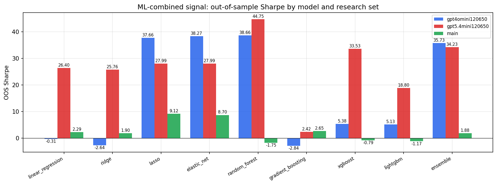

*ML-combined OOS Sharpe by model and research set*

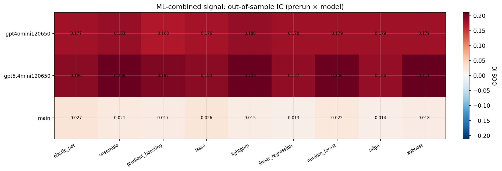

*ML-combined OOS IC (prerun × model)*

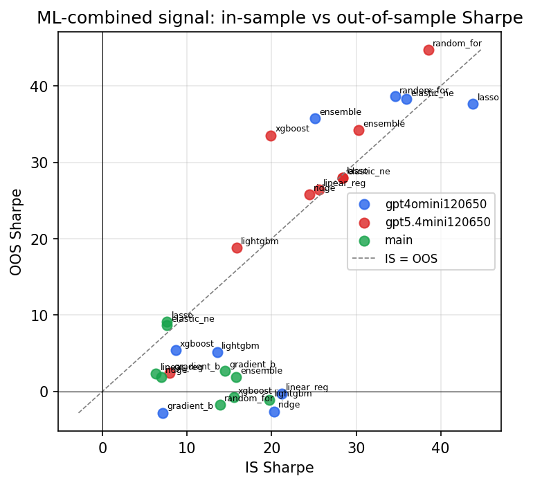

*IS vs OOS Sharpe (overfitting diagnostic)*

---
*Generated by `run_model_comparison.py`. Tables: `*.csv`; interactive: `comparison.ipynb`.*
