# Research-LLM factor comparison — `2024-11`

Comparing the **factor output of different research LLMs** on three axes (raw factor quality → factors as ML features → factors through the full agentic fund). The panel, IS/OOS split, horizon and model hyper-parameters are held identical across preruns — the *only* variable is the factor set.

## Preruns compared

| prerun | research_model | usable_factors | dropped_factors |
| --- | --- | --- | --- |
| gpt4omini120650 | gpt-4o-mini | 66 | 0 |
| gpt5.4mini120650 | gpt-5.4-mini | 69 | 0 |
| main | seed library | 78 | 10 |

> Dropped factors declare fields the current data doesn't have yet (e.g. fundamentals); they light up unchanged once that data is downloaded.

*Usable vs awaiting-data factors per research model*

## Key findings

- **Best ML-combined OOS Sharpe:** `gpt5.4mini120650` with `random_forest` (OOS Sharpe = 41.373).
- **Mean OOS Sharpe across models, by research set:** `gpt5.4mini120650` = 30.255, `gpt4omini120650` = 12.199, `main` = 0.775.
- **Highest mean single-factor |IC| (h=6):** `gpt4omini120650` (mean |IC| = 0.0364).
- **Most diverse zoo (highest effective/raw factor ratio):** `gpt5.4mini120650` (eff 54.3 of 69, ratio 0.79).
- **Best selection-deflated single-factor |IC|:** `gpt5.4mini120650` (deflated |IC| = 0.1220 from 30 factors tried).

## 1. Single-factor IC (raw factor quality)

Per-underlying time-series Spearman rank-IC of every researched factor, recomputed on the shared panel at horizons h=1, h=6, h=60. The per-underlying IC correlates each factor's value vector with the underlying's own forward-return vector (pooled across underlyings); the cross-sectional IC ranks across underlyings per timestamp.

| prerun | n_factors | mean_abs_ic_1 | mean_abs_ic_6 | mean_abs_ic_60 | mean_abs_icir_6 | best_factor_h6 | best_abs_ic_h6 |
| --- | --- | --- | --- | --- | --- | --- | --- |
| gpt4omini120650 | 66 | 0.0454 | 0.0364 | 0.0149 | 1.8268 | limit_order_book_imbalance_surge | 0.1197 |
| gpt5.4mini120650 | 69 | 0.0274 | 0.024 | 0.0108 | 1.6052 | lstm_flow_price_mismatch | 0.1289 |
| main | 78 | 0.0214 | 0.0121 | 0.0071 | 0.4926 | alpha_083 | 0.0417 |

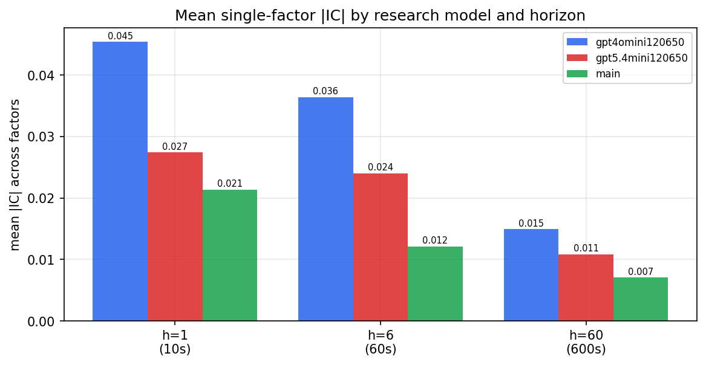

*Mean |IC| by research model and horizon*

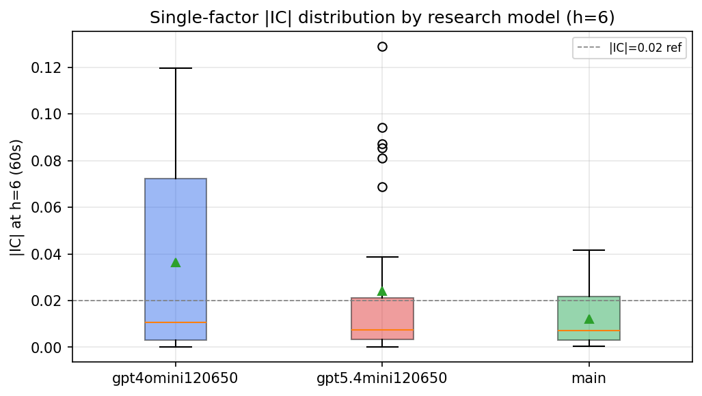

*Per-factor |IC| distribution by research model*

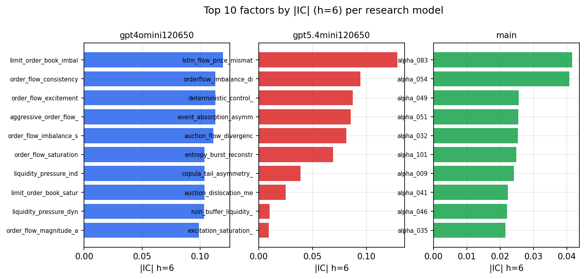

*Top factors by |IC| per research model*

## 2. Factor diversity & redundancy

Pairwise correlation of each zoo's *signals*. `eff_n_factors` is the effective number of independent factors (participation ratio of the correlation eigenvalues); `eff_ratio` and `redundancy` summarise how much unique information the zoo holds vs. how much is duplicated; `n_clusters` groups factors at |corr| ≥ 0.7.

| prerun | n_factors | eff_n_factors | eff_ratio | mean_abs_corr | n_clusters | redundancy |
| --- | --- | --- | --- | --- | --- | --- |
| gpt4omini120650 | 66 | 29.5551 | 0.4478 | 0.0445 | 54 | 0.5522 |
| gpt5.4mini120650 | 69 | 54.2757 | 0.7866 | 0.0106 | 65 | 0.2134 |
| main | 78 | 37.6367 | 0.4825 | 0.0353 | 70 | 0.5175 |

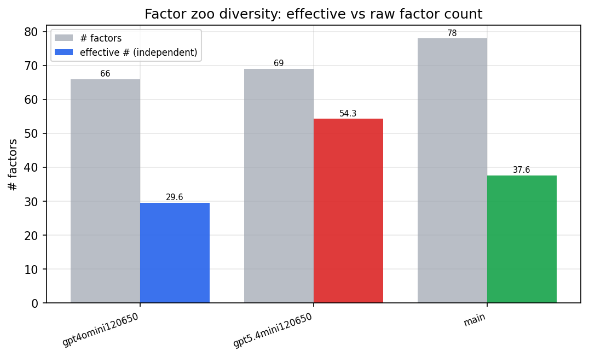

*Effective vs raw factor count per research model*

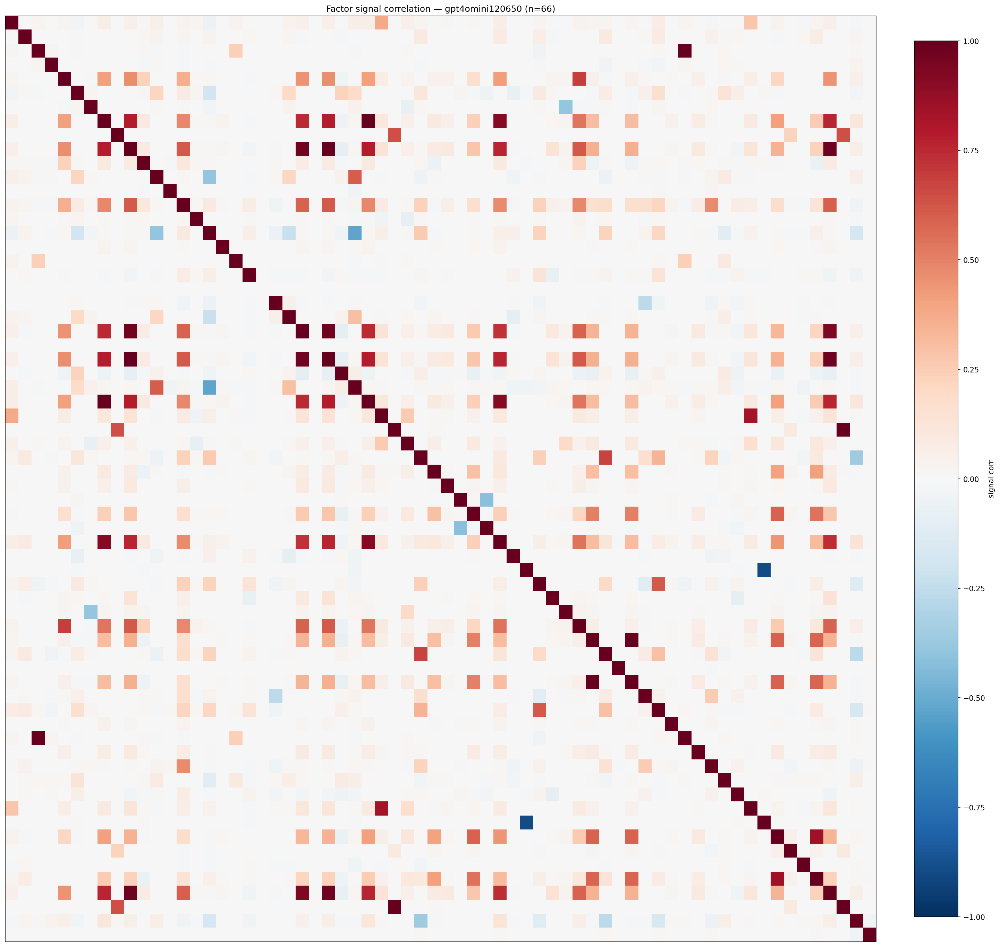

*Signal correlation matrix — gpt4omini120650*

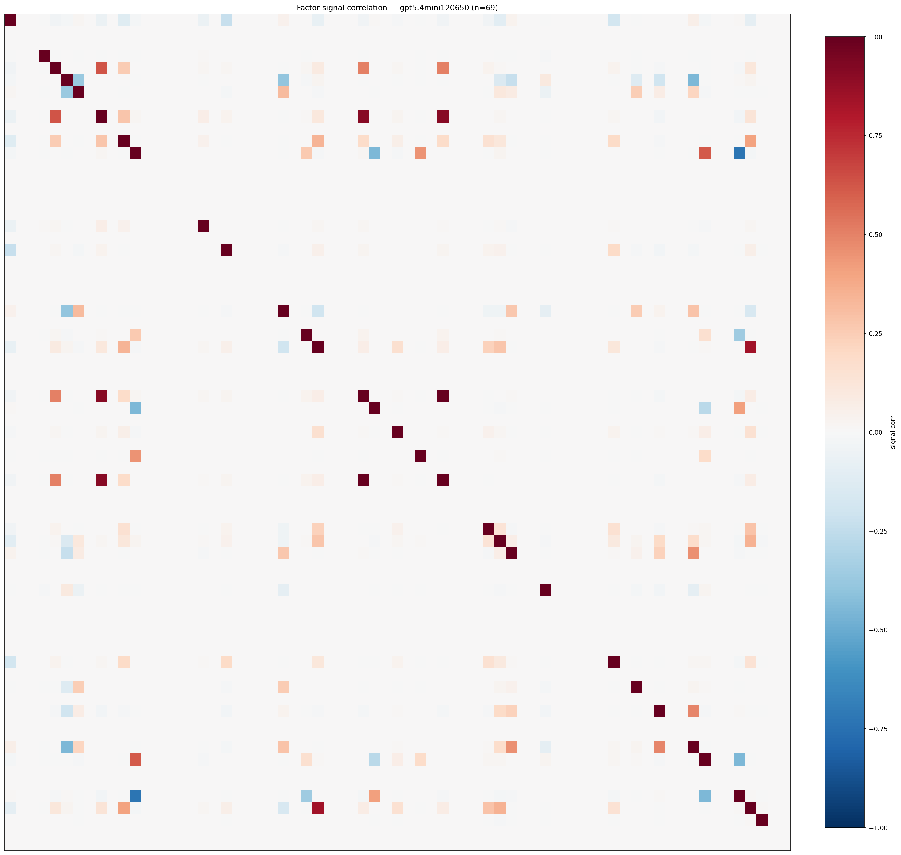

*Signal correlation matrix — gpt5.4mini120650*

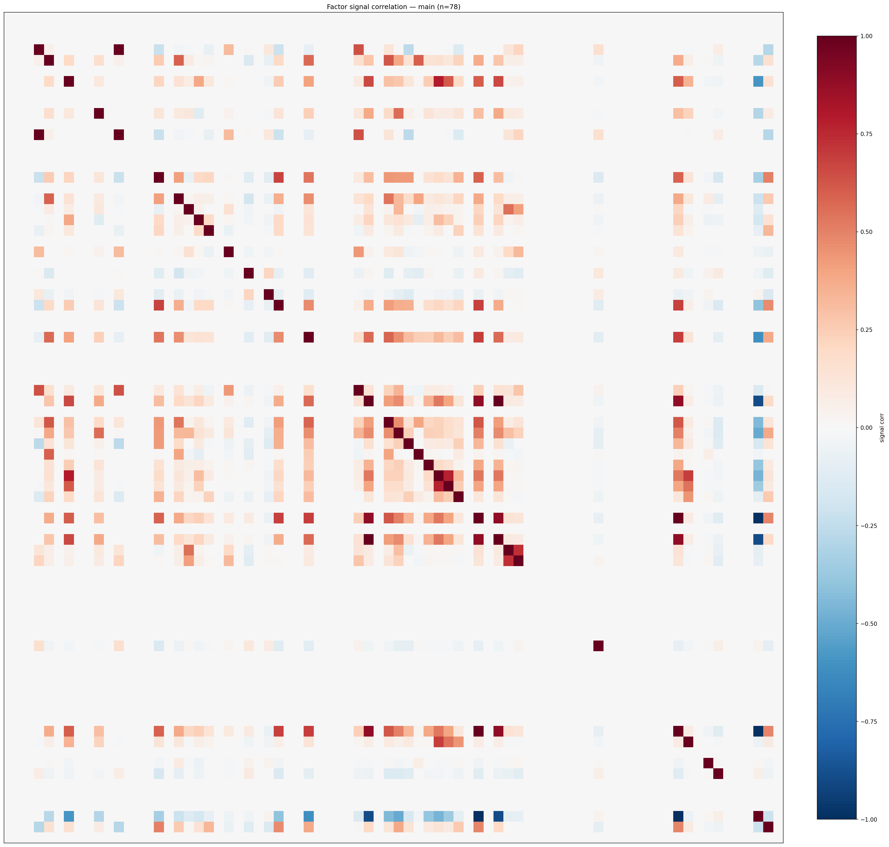

*Signal correlation matrix — main*

## 3. Deflation & model-based importance

`deflated_best_ic` haircuts each zoo's best |IC| for the number of factors tried (`ic_n_tested`) — a bigger zoo's best factor is more likely to be lucky. `lasso_n_nonzero` / `lasso_sparsity` show how many factors a sparse linear model actually keeps (model-view redundancy).

| prerun | best_ic | deflated_best_ic | deflated_best_t | ic_n_tested | ic_n_obs | lasso_n_nonzero | lasso_sparsity |
| --- | --- | --- | --- | --- | --- | --- | --- |
| gpt4omini120650 | 0.1197 | 0.1121 | 42.5409 | 64 | 143998 | 2 | 0.9697 |
| gpt5.4mini120650 | 0.1289 | 0.122 | 46.2897 | 30 | 143998 | 11 | 0.8406 |
| main | 0.0417 | 0.0346 | 13.1316 | 36 | 143998 | 0 | 1.0 |

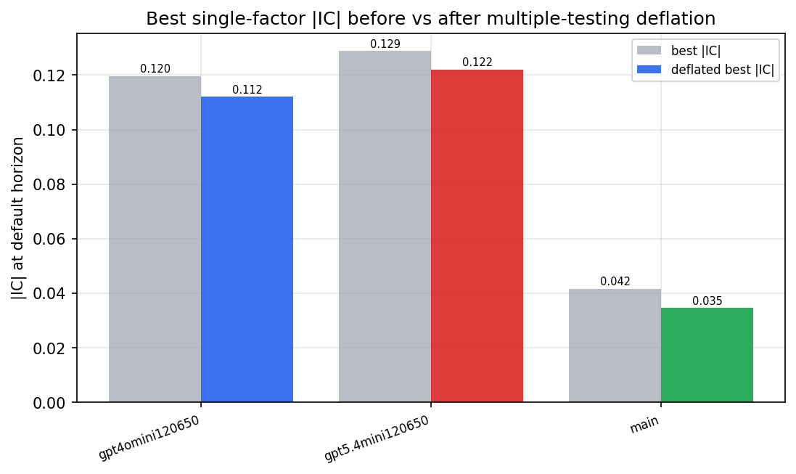

*Best |IC| before vs after multiple-testing deflation*

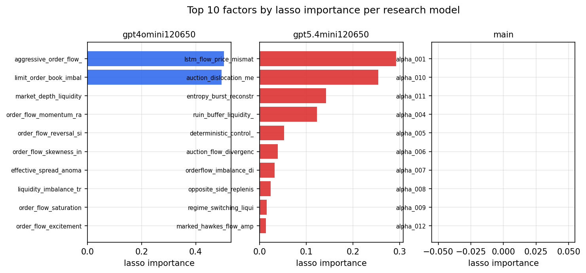

*Top factors by lasso importance per zoo*

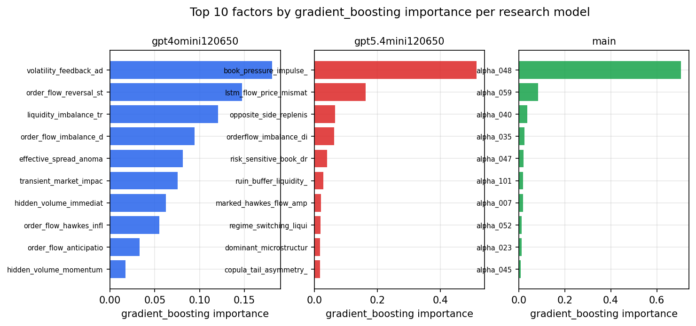

*Top factors by gradient_boosting importance per zoo*

## 4. ML-combined signal — per-underlying vectorised backtest

Each model combines a prerun's factors into ONE signal (fit `factors → forward return` on IS, predict per (bar, underlying)), then that combined signal is run through a simple vectorised backtest — `position(signal) × the underlying's own forward return` — on the held-out OOS tail (+ an equal-weight ensemble). No cross-sectional ranking.

> Config: position=**threshold** (t=1.0, z-score `expanding`), aggregation=**portfolio**, fit-standardise=**per_underlying**, horizon=6.

| prerun | model | n_factors_used | oos_ic | oos_sharpe | is_sharpe | oos_ann_return | oos_max_drawdown |
| --- | --- | --- | --- | --- | --- | --- | --- |
| gpt4omini120650 | linear_regression | 66 | 0.1362 | 17.7482 | 26.1711 | 0.6527 | -0.0035 |
| gpt4omini120650 | ridge | 66 | 0.1434 | 16.744 | 26.4556 | 0.6692 | -0.0035 |
| gpt4omini120650 | lasso | 66 | 0.1408 | 23.6253 | 30.2335 | 0.7329 | -0.0024 |
| gpt4omini120650 | elastic_net | 66 | 0.1448 | 18.1324 | 29.3463 | 0.7287 | -0.0047 |
| gpt4omini120650 | random_forest | 66 | 0.1453 | 21.2555 | 38.158 | 0.9111 | -0.0047 |
| gpt4omini120650 | gradient_boosting | 66 | 0.1398 | -0.336 | 10.8036 | -0.0099 | -0.0071 |
| gpt4omini120650 | xgboost | 66 | 0.1505 | 1.2455 | 14.2333 | 0.0607 | -0.0089 |
| gpt4omini120650 | lightgbm | 66 | 0.158 | -3.0781 | 16.401 | -0.0934 | -0.0112 |
| gpt4omini120650 | ensemble | 66 | 0.1494 | 14.4556 | 28.2893 | 0.6079 | -0.0046 |
| gpt5.4mini120650 | linear_regression | 69 | 0.1477 | 17.2311 | 16.3015 | 0.3685 | -0.0048 |
| gpt5.4mini120650 | ridge | 69 | 0.1478 | 16.9115 | 16.752 | 0.3612 | -0.0048 |
| gpt5.4mini120650 | lasso | 69 | 0.1568 | 35.1736 | 35.248 | 0.8995 | -0.0023 |
| gpt5.4mini120650 | elastic_net | 69 | 0.1568 | 35.1736 | 35.248 | 0.8995 | -0.0023 |
| gpt5.4mini120650 | random_forest | 69 | 0.157 | 41.3731 | 43.325 | 0.9024 | -0.0025 |
| gpt5.4mini120650 | gradient_boosting | 69 | 0.1553 | 35.5221 | 39.8096 | 0.6025 | -0.0013 |
| gpt5.4mini120650 | xgboost | 69 | 0.1685 | 36.4645 | 40.101 | 0.8013 | -0.0013 |
| gpt5.4mini120650 | lightgbm | 69 | 0.1694 | 13.7983 | 29.2733 | 0.2673 | -0.0028 |
| gpt5.4mini120650 | ensemble | 69 | 0.1728 | 40.6452 | 42.3979 | 0.9347 | -0.0021 |
| main | linear_regression | 78 | 0.0017 | -0.7598 | 7.1951 | -0.0019 | -0.0006 |
| main | ridge | 78 | 0.0029 | -3.8167 | 6.5909 | -0.0107 | -0.0012 |
| main | lasso | 78 | 0.003 | -1.9645 | 6.7552 | -0.0171 | -0.0021 |
| main | elastic_net | 78 | 0.003 | -1.9645 | 6.7552 | -0.0171 | -0.0021 |
| main | random_forest | 78 | 0.0074 | 2.45 | 13.9984 | 0.0524 | -0.0046 |
| main | gradient_boosting | 78 | 0.0047 | 3.7636 | 7.4877 | 0.0301 | -0.0005 |
| main | xgboost | 78 | 0.006 | 5.332 | 10.5306 | 0.0481 | -0.0013 |
| main | lightgbm | 78 | 0.0122 | 1.335 | 18.1085 | 0.0188 | -0.0029 |
| main | ensemble | 78 | 0.0066 | 2.6039 | 10.9728 | 0.025 | -0.0018 |

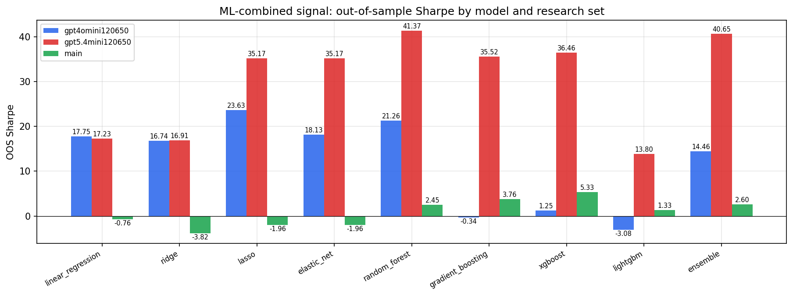

*ML-combined OOS Sharpe by model and research set*

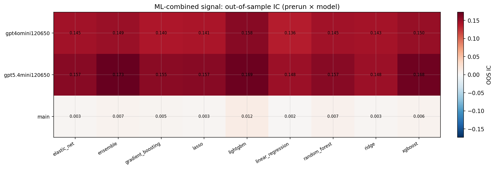

*ML-combined OOS IC (prerun × model)*

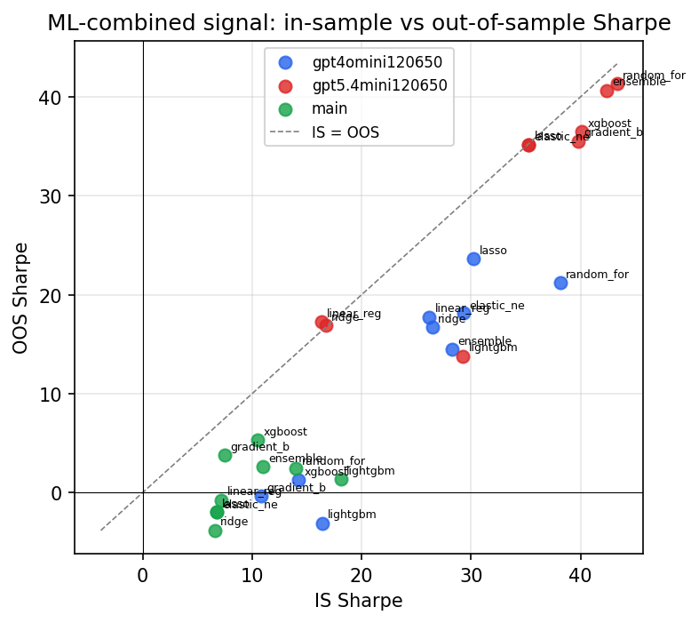

*IS vs OOS Sharpe (overfitting diagnostic)*

---
*Generated by `run_model_comparison.py`. Tables: `*.csv`; interactive: `comparison.ipynb`.*
