# Research-LLM factor comparison — `2024-12`

Comparing the **factor output of different research LLMs** on three axes (raw factor quality → factors as ML features → factors through the full agentic fund). The panel, IS/OOS split, horizon and model hyper-parameters are held identical across preruns — the *only* variable is the factor set.

## Preruns compared

| prerun | research_model | usable_factors | dropped_factors |
| --- | --- | --- | --- |
| gpt4omini120650 | gpt-4o-mini | 66 | 0 |
| gpt5.4mini120650 | gpt-5.4-mini | 69 | 0 |
| main | seed library | 78 | 10 |

> Dropped factors declare fields the current data doesn't have yet (e.g. fundamentals); they light up unchanged once that data is downloaded.

*Usable vs awaiting-data factors per research model*

## Key findings

- **Best ML-combined OOS Sharpe:** `gpt5.4mini120650` with `random_forest` (OOS Sharpe = 66.581).
- **Mean OOS Sharpe across models, by research set:** `gpt4omini120650` = 30.188, `gpt5.4mini120650` = 29.190, `main` = 2.060.
- **Highest mean single-factor |IC| (h=6):** `gpt4omini120650` (mean |IC| = 0.0382).
- **Most diverse zoo (highest effective/raw factor ratio):** `gpt5.4mini120650` (eff 55.5 of 69, ratio 0.80).
- **Best selection-deflated single-factor |IC|:** `gpt5.4mini120650` (deflated |IC| = 0.1312 from 30 factors tried).

## 1. Single-factor IC (raw factor quality)

Per-underlying time-series Spearman rank-IC of every researched factor, recomputed on the shared panel at horizons h=1, h=6, h=60. The per-underlying IC correlates each factor's value vector with the underlying's own forward-return vector (pooled across underlyings); the cross-sectional IC ranks across underlyings per timestamp.

| prerun | n_factors | mean_abs_ic_1 | mean_abs_ic_6 | mean_abs_ic_60 | mean_abs_icir_6 | best_factor_h6 | best_abs_ic_h6 |
| --- | --- | --- | --- | --- | --- | --- | --- |
| gpt4omini120650 | 66 | 0.0469 | 0.0382 | 0.0149 | 1.783 | limit_order_book_imbalance_surge | 0.1232 |
| gpt5.4mini120650 | 69 | 0.028 | 0.0255 | 0.0133 | 1.479 | lstm_flow_price_mismatch | 0.1379 |
| main | 78 | 0.0237 | 0.0144 | 0.0057 | 0.6217 | alpha_054 | 0.0563 |

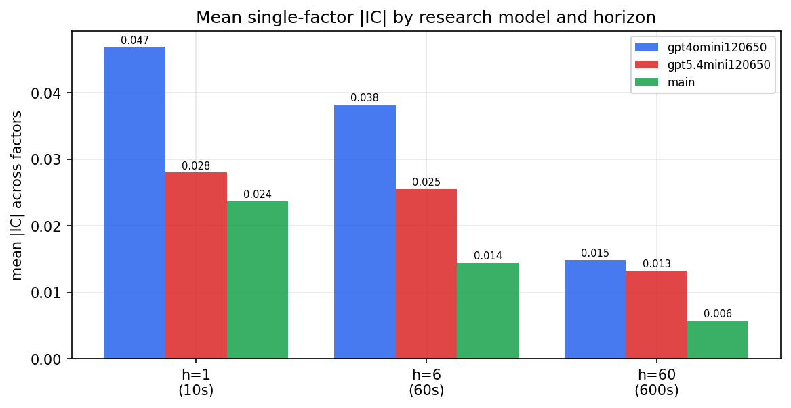

*Mean |IC| by research model and horizon*

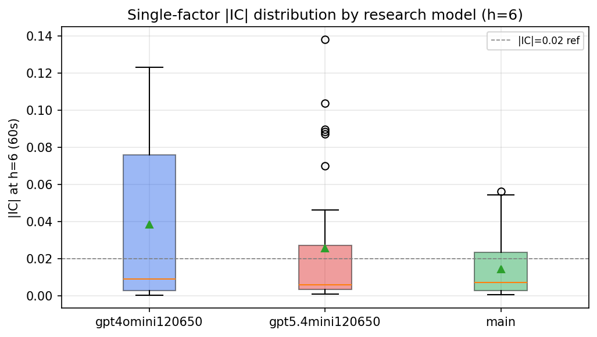

*Per-factor |IC| distribution by research model*

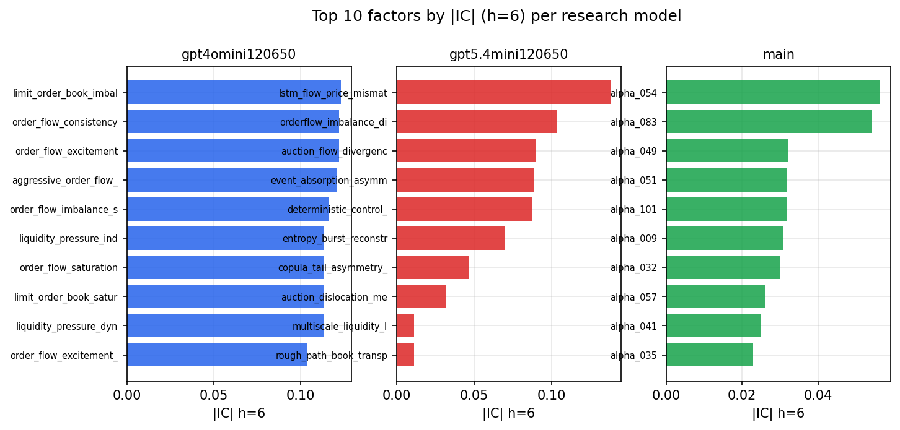

*Top factors by |IC| per research model*

## 2. Factor diversity & redundancy

Pairwise correlation of each zoo's *signals*. `eff_n_factors` is the effective number of independent factors (participation ratio of the correlation eigenvalues); `eff_ratio` and `redundancy` summarise how much unique information the zoo holds vs. how much is duplicated; `n_clusters` groups factors at |corr| ≥ 0.7.

| prerun | n_factors | eff_n_factors | eff_ratio | mean_abs_corr | n_clusters | redundancy |
| --- | --- | --- | --- | --- | --- | --- |
| gpt4omini120650 | 66 | 29.1653 | 0.4419 | 0.0451 | 52 | 0.5581 |
| gpt5.4mini120650 | 69 | 55.4925 | 0.8042 | 0.0102 | 65 | 0.1958 |
| main | 78 | 33.0182 | 0.4233 | 0.0445 | 50 | 0.5767 |

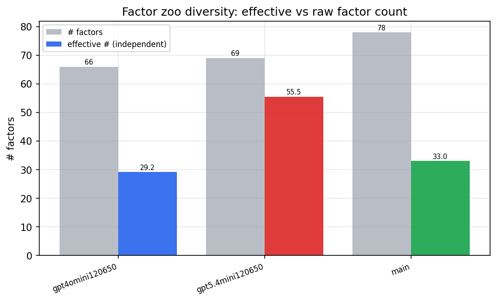

*Effective vs raw factor count per research model*

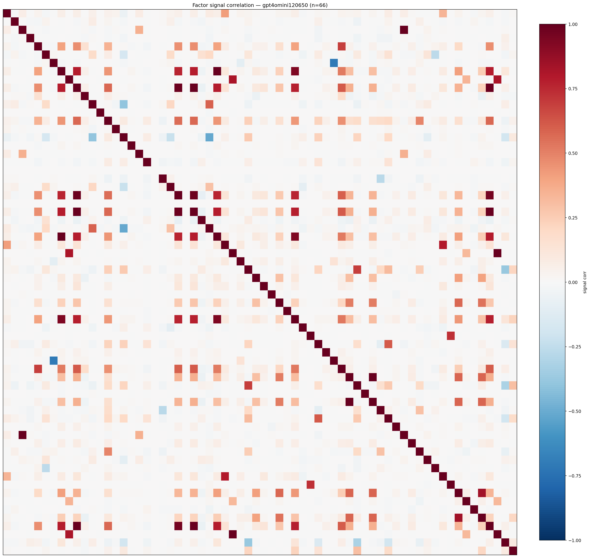

*Signal correlation matrix — gpt4omini120650*

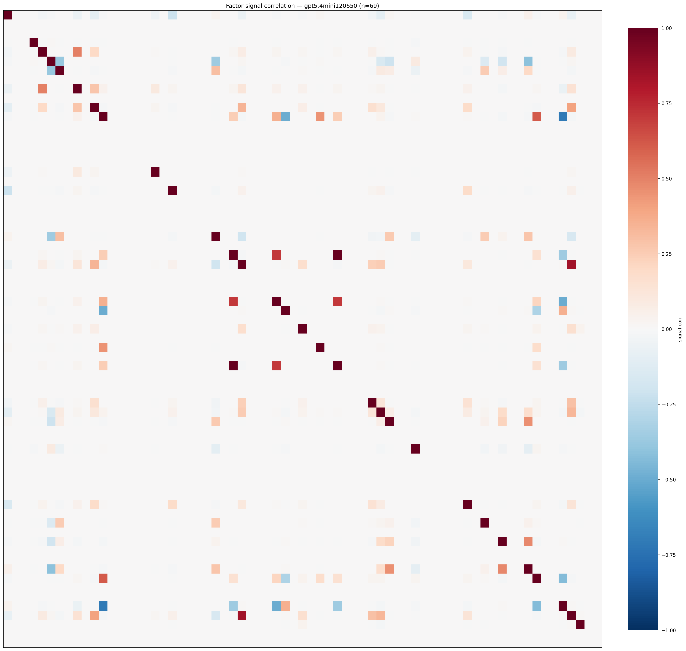

*Signal correlation matrix — gpt5.4mini120650*

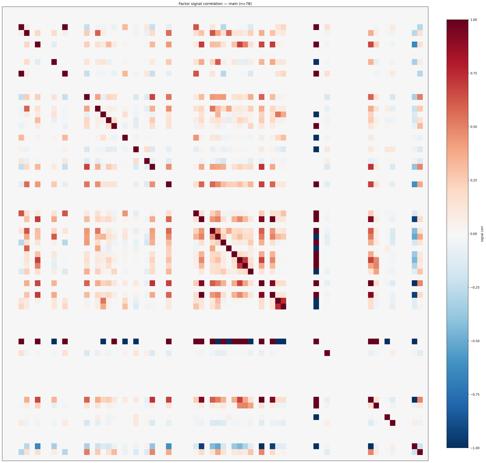

*Signal correlation matrix — main*

## 3. Deflation & model-based importance

`deflated_best_ic` haircuts each zoo's best |IC| for the number of factors tried (`ic_n_tested`) — a bigger zoo's best factor is more likely to be lucky. `lasso_n_nonzero` / `lasso_sparsity` show how many factors a sparse linear model actually keeps (model-view redundancy).

| prerun | best_ic | deflated_best_ic | deflated_best_t | ic_n_tested | ic_n_obs | lasso_n_nonzero | lasso_sparsity |
| --- | --- | --- | --- | --- | --- | --- | --- |
| gpt4omini120650 | 0.1232 | 0.1156 | 44.4294 | 64 | 147599 | 5 | 0.9242 |
| gpt5.4mini120650 | 0.1379 | 0.1312 | 50.3865 | 30 | 147599 | 9 | 0.8696 |
| main | 0.0563 | 0.0493 | 18.946 | 36 | 147599 | 1 | 0.9872 |

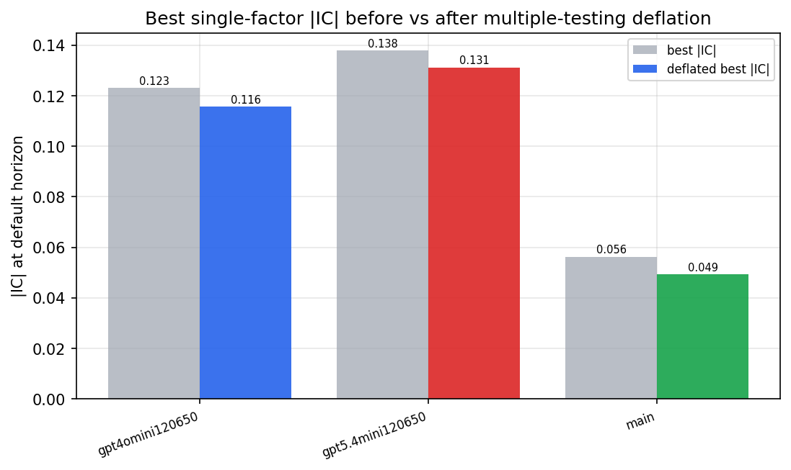

*Best |IC| before vs after multiple-testing deflation*

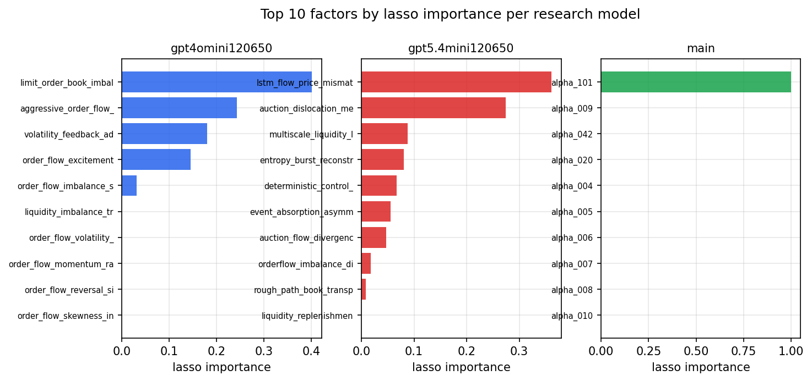

*Top factors by lasso importance per zoo*

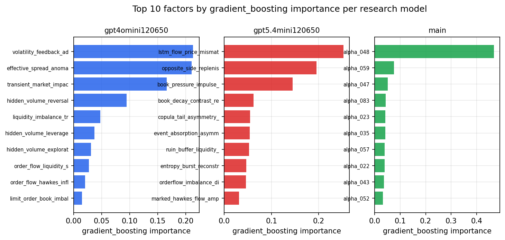

*Top factors by gradient_boosting importance per zoo*

## 4. ML-combined signal — per-underlying vectorised backtest

Each model combines a prerun's factors into ONE signal (fit `factors → forward return` on IS, predict per (bar, underlying)), then that combined signal is run through a simple vectorised backtest — `position(signal) × the underlying's own forward return` — on the held-out OOS tail (+ an equal-weight ensemble). No cross-sectional ranking.

> Config: position=**threshold** (t=1.0, z-score `expanding`), aggregation=**portfolio**, fit-standardise=**per_underlying**, horizon=6.

| prerun | model | n_factors_used | oos_ic | oos_sharpe | is_sharpe | oos_ann_return | oos_max_drawdown |
| --- | --- | --- | --- | --- | --- | --- | --- |
| gpt4omini120650 | linear_regression | 66 | 0.1835 | 43.6756 | 33.0368 | 0.8241 | -0.002 |
| gpt4omini120650 | ridge | 66 | 0.184 | 42.5138 | 32.6875 | 0.8371 | -0.002 |
| gpt4omini120650 | lasso | 66 | 0.1772 | 51.9185 | 40.2899 | 0.9303 | -0.0017 |
| gpt4omini120650 | elastic_net | 66 | 0.1795 | 51.5028 | 36.208 | 0.9071 | -0.0017 |
| gpt4omini120650 | random_forest | 66 | 0.161 | 41.5398 | 26.5914 | 0.8557 | -0.0026 |
| gpt4omini120650 | gradient_boosting | 66 | 0.1545 | -0.3308 | 7.2973 | -0.0025 | -0.0014 |
| gpt4omini120650 | xgboost | 66 | 0.1792 | 0.5911 | 8.8308 | 0.0061 | -0.0029 |
| gpt4omini120650 | lightgbm | 66 | 0.1906 | -4.8485 | 13.0492 | -0.0702 | -0.0071 |
| gpt4omini120650 | ensemble | 66 | 0.1802 | 45.1309 | 24.6029 | 0.7526 | -0.0018 |
| gpt5.4mini120650 | linear_regression | 69 | 0.1841 | 31.8909 | 23.6409 | 0.6807 | -0.0017 |
| gpt5.4mini120650 | ridge | 69 | 0.183 | 32.5443 | 24.2586 | 0.6791 | -0.0018 |
| gpt5.4mini120650 | lasso | 69 | 0.186 | 30.2762 | 23.0258 | 0.6773 | -0.0028 |
| gpt5.4mini120650 | elastic_net | 69 | 0.185 | 32.333 | 24.0231 | 0.7025 | -0.0022 |
| gpt5.4mini120650 | random_forest | 69 | 0.2089 | 66.5809 | 34.2422 | 1.1412 | -0.0012 |
| gpt5.4mini120650 | gradient_boosting | 69 | 0.1967 | 0.4619 | 9.1402 | 0.0062 | -0.0037 |
| gpt5.4mini120650 | xgboost | 69 | 0.2185 | 20.806 | 16.9457 | 0.3487 | -0.0032 |
| gpt5.4mini120650 | lightgbm | 69 | 0.2197 | 0.84 | 12.4746 | 0.012 | -0.0041 |
| gpt5.4mini120650 | ensemble | 69 | 0.2124 | 46.9732 | 24.5956 | 0.8658 | -0.0023 |
| main | linear_regression | 78 | 0.0105 | 2.5515 | 7.2297 | 0.0552 | -0.0039 |
| main | ridge | 78 | 0.0152 | 3.3966 | 8.2306 | 0.072 | -0.004 |
| main | lasso | 78 | nan | nan | nan | nan | nan |
| main | elastic_net | 78 | nan | nan | nan | nan | nan |
| main | random_forest | 78 | 0.0268 | 1.959 | 8.4832 | 0.028 | -0.0027 |
| main | gradient_boosting | 78 | 0.0175 | -0.2208 | 8.8773 | -0.0013 | -0.0012 |
| main | xgboost | 78 | 0.0207 | 0.1241 | 8.7822 | 0.0011 | -0.0026 |
| main | lightgbm | 78 | 0.0179 | 2.7363 | 12.1284 | 0.0225 | -0.0019 |
| main | ensemble | 78 | 0.0176 | 3.8701 | 11.0834 | 0.0564 | -0.0018 |

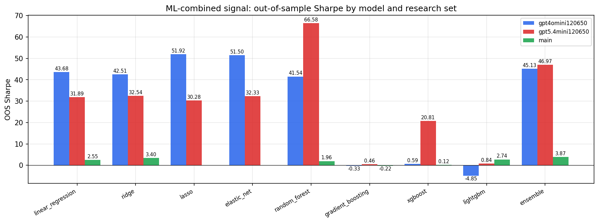

*ML-combined OOS Sharpe by model and research set*

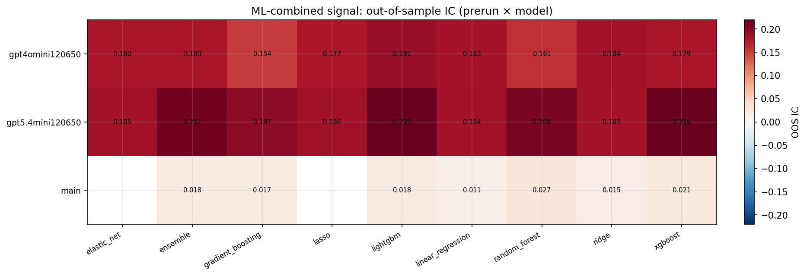

*ML-combined OOS IC (prerun × model)*

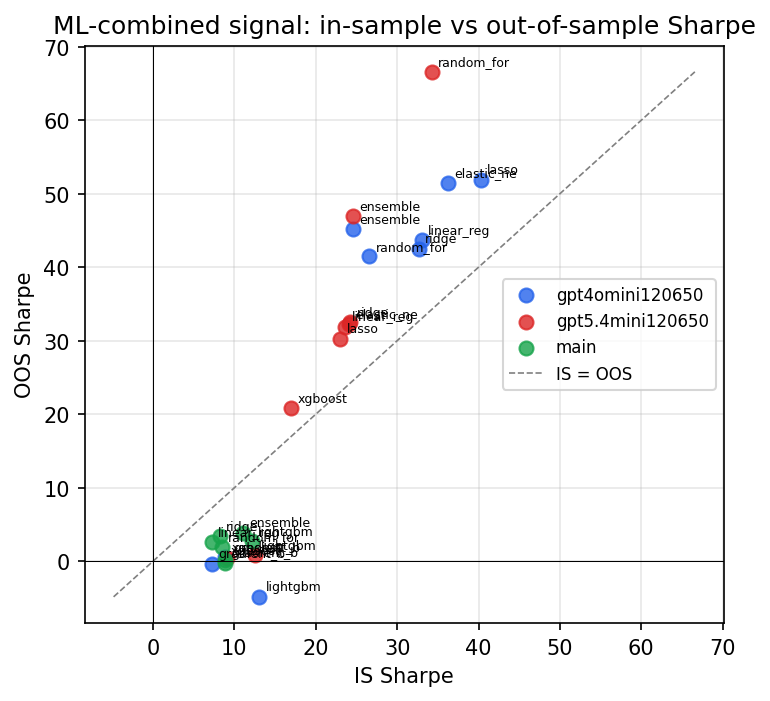

*IS vs OOS Sharpe (overfitting diagnostic)*

---
*Generated by `run_model_comparison.py`. Tables: `*.csv`; interactive: `comparison.ipynb`.*
