# Research-LLM factor comparison — `2025-01`

Comparing the **factor output of different research LLMs** on three axes (raw factor quality → factors as ML features → factors through the full agentic fund). The panel, IS/OOS split, horizon and model hyper-parameters are held identical across preruns — the *only* variable is the factor set.

## Preruns compared

| prerun | research_model | usable_factors | dropped_factors |
| --- | --- | --- | --- |
| gpt4omini120650 | gpt-4o-mini | 66 | 0 |
| gpt5.4mini120650 | gpt-5.4-mini | 69 | 0 |
| main | seed library | 78 | 10 |

> Dropped factors declare fields the current data doesn't have yet (e.g. fundamentals); they light up unchanged once that data is downloaded.

*Usable vs awaiting-data factors per research model*

## Key findings

- **Best ML-combined OOS Sharpe:** `gpt5.4mini120650` with `ensemble` (OOS Sharpe = 75.997).
- **Mean OOS Sharpe across models, by research set:** `gpt5.4mini120650` = 48.893, `gpt4omini120650` = 37.706, `main` = 0.918.
- **Highest mean single-factor |IC| (h=6):** `gpt4omini120650` (mean |IC| = 0.0418).
- **Most diverse zoo (highest effective/raw factor ratio):** `gpt5.4mini120650` (eff 55.3 of 69, ratio 0.80).
- **Best selection-deflated single-factor |IC|:** `gpt5.4mini120650` (deflated |IC| = 0.1431 from 30 factors tried).

## 1. Single-factor IC (raw factor quality)

Per-underlying time-series Spearman rank-IC of every researched factor, recomputed on the shared panel at horizons h=1, h=6, h=60. The per-underlying IC correlates each factor's value vector with the underlying's own forward-return vector (pooled across underlyings); the cross-sectional IC ranks across underlyings per timestamp.

| prerun | n_factors | mean_abs_ic_1 | mean_abs_ic_6 | mean_abs_ic_60 | mean_abs_icir_6 | best_factor_h6 | best_abs_ic_h6 |
| --- | --- | --- | --- | --- | --- | --- | --- |
| gpt4omini120650 | 66 | 0.0499 | 0.0418 | 0.0144 | 1.8641 | order_flow_excitement | 0.1313 |
| gpt5.4mini120650 | 69 | 0.0292 | 0.0258 | 0.0114 | 1.5098 | lstm_flow_price_mismatch | 0.1501 |
| main | 78 | 0.0204 | 0.0125 | 0.0067 | 0.5326 | alpha_054 | 0.0554 |

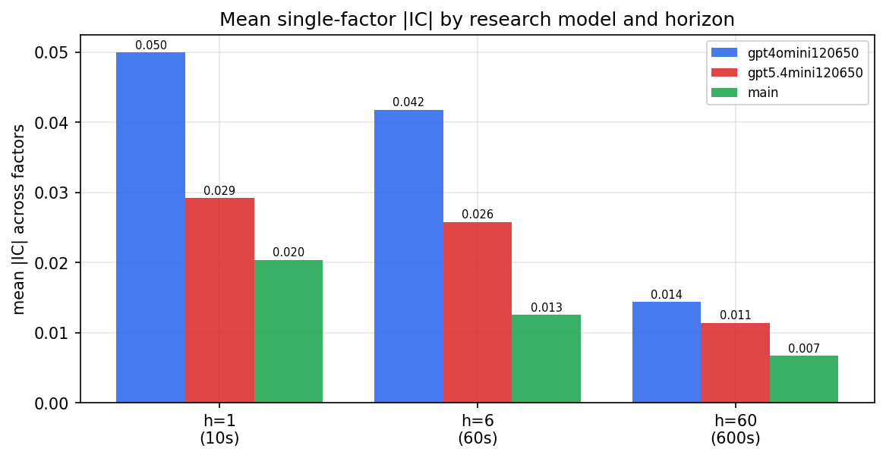

*Mean |IC| by research model and horizon*

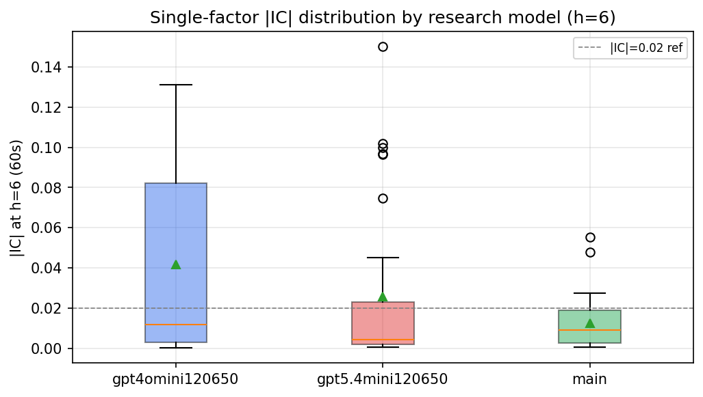

*Per-factor |IC| distribution by research model*

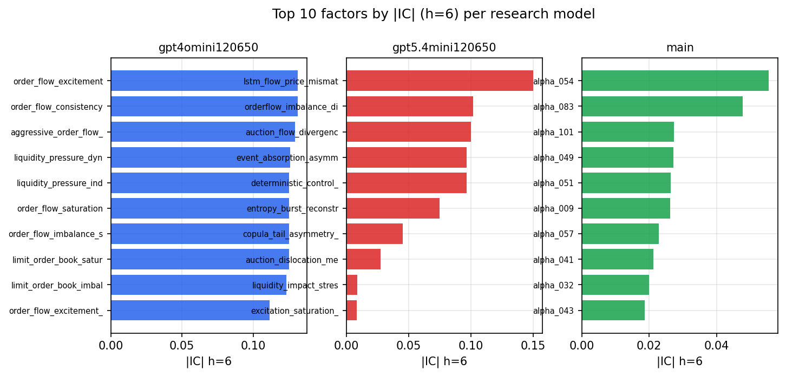

*Top factors by |IC| per research model*

## 2. Factor diversity & redundancy

Pairwise correlation of each zoo's *signals*. `eff_n_factors` is the effective number of independent factors (participation ratio of the correlation eigenvalues); `eff_ratio` and `redundancy` summarise how much unique information the zoo holds vs. how much is duplicated; `n_clusters` groups factors at |corr| ≥ 0.7.

| prerun | n_factors | eff_n_factors | eff_ratio | mean_abs_corr | n_clusters | redundancy |
| --- | --- | --- | --- | --- | --- | --- |
| gpt4omini120650 | 66 | 29.334 | 0.4445 | 0.0449 | 53 | 0.5555 |
| gpt5.4mini120650 | 69 | 55.255 | 0.8008 | 0.0102 | 65 | 0.1992 |
| main | 78 | 39.3384 | 0.5043 | 0.0334 | 72 | 0.4957 |

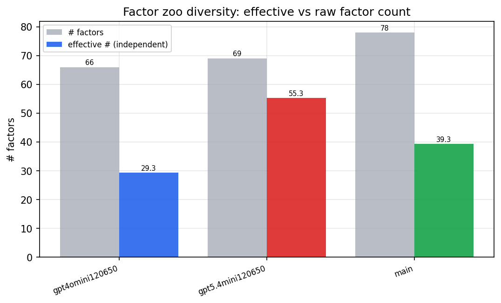

*Effective vs raw factor count per research model*

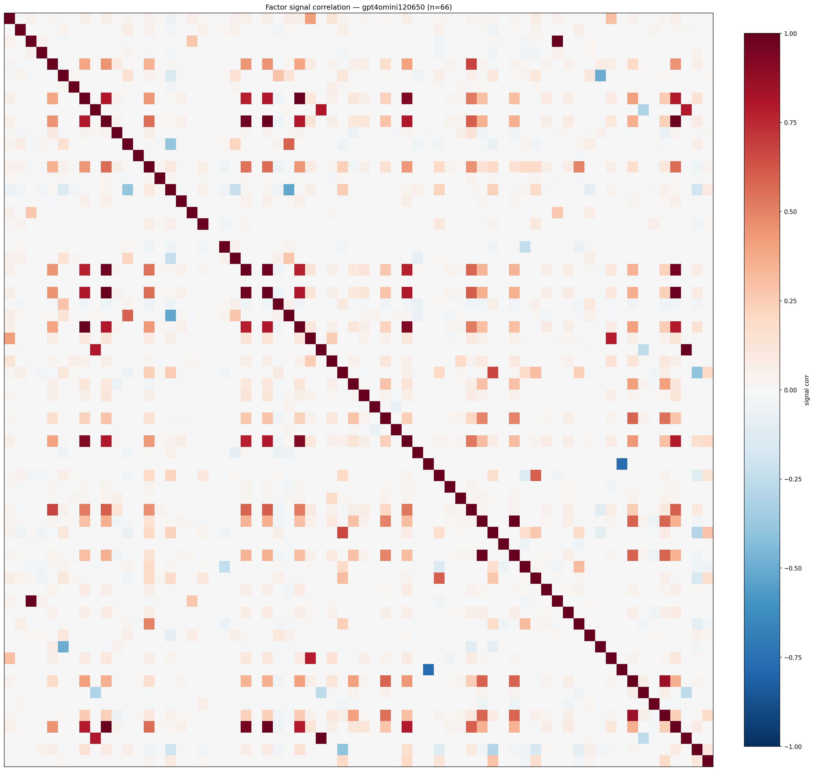

*Signal correlation matrix — gpt4omini120650*

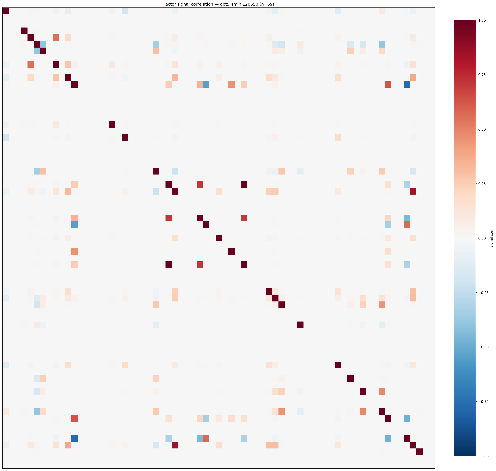

*Signal correlation matrix — gpt5.4mini120650*

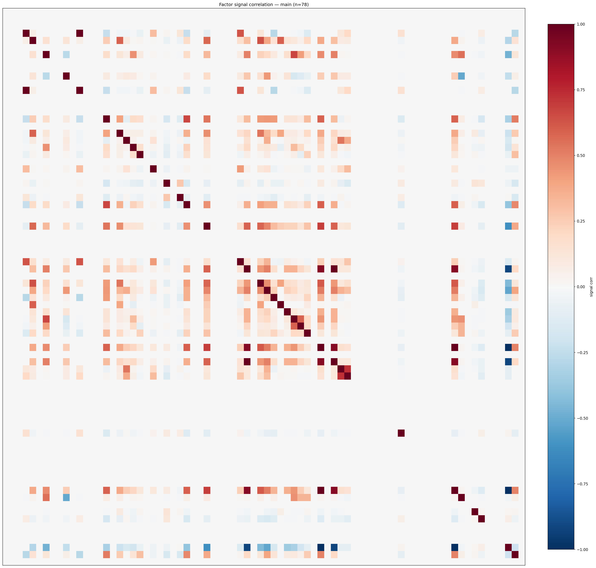

*Signal correlation matrix — main*

## 3. Deflation & model-based importance

`deflated_best_ic` haircuts each zoo's best |IC| for the number of factors tried (`ic_n_tested`) — a bigger zoo's best factor is more likely to be lucky. `lasso_n_nonzero` / `lasso_sparsity` show how many factors a sparse linear model actually keeps (model-view redundancy).

| prerun | best_ic | deflated_best_ic | deflated_best_t | ic_n_tested | ic_n_obs | lasso_n_nonzero | lasso_sparsity |
| --- | --- | --- | --- | --- | --- | --- | --- |
| gpt4omini120650 | 0.1313 | 0.1236 | 46.3444 | 64 | 140579 | 5 | 0.9242 |
| gpt5.4mini120650 | 0.1501 | 0.1431 | 53.6523 | 30 | 140579 | 7 | 0.8986 |
| main | 0.0554 | 0.0483 | 18.1049 | 36 | 140579 | 8 | 0.8974 |

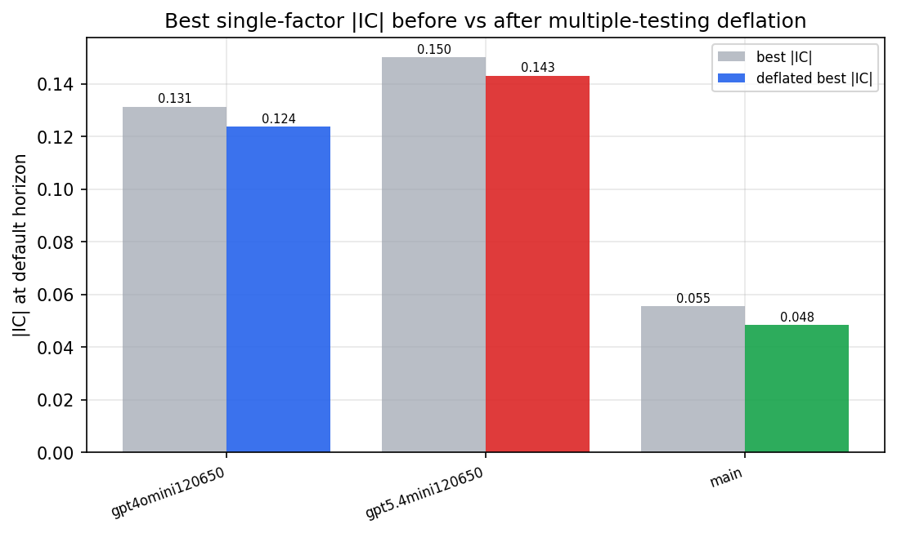

*Best |IC| before vs after multiple-testing deflation*

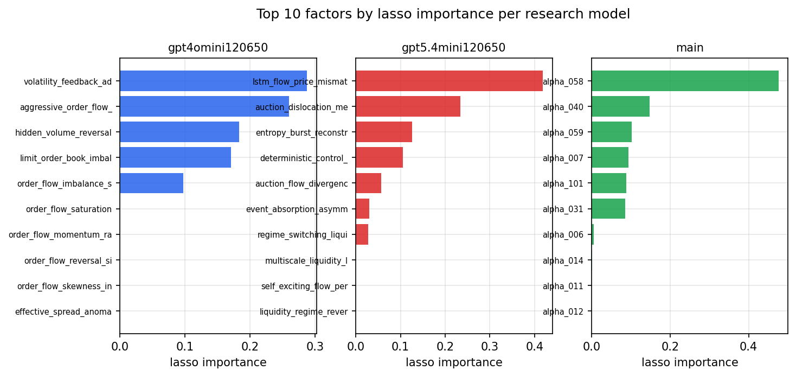

*Top factors by lasso importance per zoo*

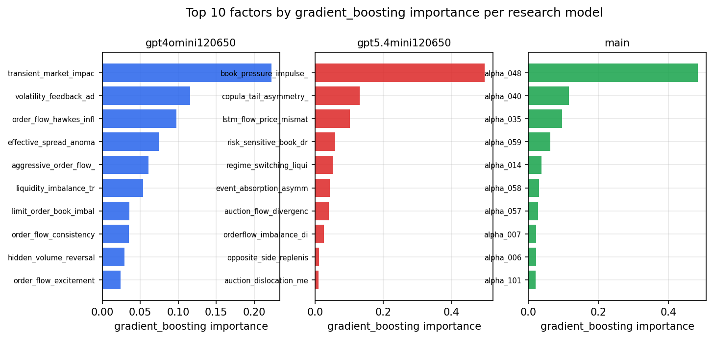

*Top factors by gradient_boosting importance per zoo*

## 4. ML-combined signal — per-underlying vectorised backtest

Each model combines a prerun's factors into ONE signal (fit `factors → forward return` on IS, predict per (bar, underlying)), then that combined signal is run through a simple vectorised backtest — `position(signal) × the underlying's own forward return` — on the held-out OOS tail (+ an equal-weight ensemble). No cross-sectional ranking.

> Config: position=**threshold** (t=1.0, z-score `expanding`), aggregation=**portfolio**, fit-standardise=**per_underlying**, horizon=6.

| prerun | model | n_factors_used | oos_ic | oos_sharpe | is_sharpe | oos_ann_return | oos_max_drawdown |
| --- | --- | --- | --- | --- | --- | --- | --- |
| gpt4omini120650 | linear_regression | 66 | 0.1939 | 52.6727 | 29.1777 | 0.9908 | -0.0036 |
| gpt4omini120650 | ridge | 66 | 0.1945 | 57.5084 | 29.5107 | 1.0137 | -0.0037 |
| gpt4omini120650 | lasso | 66 | 0.1898 | 53.2637 | 46.32 | 1.032 | -0.0011 |
| gpt4omini120650 | elastic_net | 66 | 0.1898 | 53.2637 | 46.32 | 1.032 | -0.0011 |
| gpt4omini120650 | random_forest | 66 | 0.1905 | 52.581 | 32.075 | 1.2616 | -0.001 |
| gpt4omini120650 | gradient_boosting | 66 | 0.1843 | 0.1313 | 8.8211 | 0.0006 | -0.0012 |
| gpt4omini120650 | xgboost | 66 | 0.1947 | 5.9383 | 8.0934 | 0.0521 | -0.0025 |
| gpt4omini120650 | lightgbm | 66 | 0.2018 | 6.1363 | 12.8703 | 0.0945 | -0.0015 |
| gpt4omini120650 | ensemble | 66 | 0.1982 | 57.8541 | 23.7816 | 1.0436 | -0.0029 |
| gpt5.4mini120650 | linear_regression | 69 | 0.1942 | 62.8991 | 36.694 | 0.9269 | -0.0013 |
| gpt5.4mini120650 | ridge | 69 | 0.196 | 62.9824 | 39.2594 | 0.9468 | -0.0013 |
| gpt5.4mini120650 | lasso | 69 | 0.2001 | 62.4419 | 31.7676 | 0.9676 | -0.0013 |
| gpt5.4mini120650 | elastic_net | 69 | 0.2002 | 65.626 | 31.7912 | 0.9847 | -0.0013 |
| gpt5.4mini120650 | random_forest | 69 | 0.2188 | 67.5756 | 36.7082 | 1.4542 | -0.0015 |
| gpt5.4mini120650 | gradient_boosting | 69 | 0.2089 | 4.4442 | 7.2094 | 0.0166 | -0.0003 |
| gpt5.4mini120650 | xgboost | 69 | 0.2219 | 33.0196 | 17.2064 | 0.7103 | -0.005 |
| gpt5.4mini120650 | lightgbm | 69 | 0.2215 | 5.0499 | 12.3114 | 0.0837 | -0.0042 |
| gpt5.4mini120650 | ensemble | 69 | 0.2197 | 75.9968 | 26.6048 | 1.1367 | -0.0013 |
| main | linear_regression | 78 | 0.0048 | 3.8933 | 6.3366 | 0.0523 | -0.0044 |
| main | ridge | 78 | 0.0131 | 6.8374 | 6.4765 | 0.1508 | -0.0043 |
| main | lasso | 78 | nan | nan | nan | nan | nan |
| main | elastic_net | 78 | nan | nan | nan | nan | nan |
| main | random_forest | 78 | 0.0123 | -5.6506 | 10.5961 | -0.057 | -0.0068 |
| main | gradient_boosting | 78 | 0.0049 | -1.0202 | 7.0364 | -0.0078 | -0.004 |
| main | xgboost | 78 | 0.0062 | 1.3001 | 9.2601 | 0.0136 | -0.0037 |
| main | lightgbm | 78 | 0.0049 | 0.8553 | 12.9289 | 0.0074 | -0.0023 |
| main | ensemble | 78 | 0.0125 | 0.2099 | 10.417 | 0.002 | -0.004 |

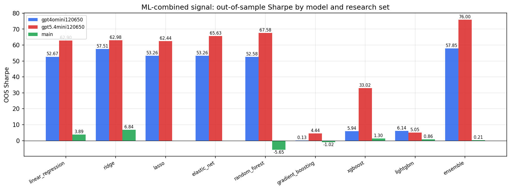

*ML-combined OOS Sharpe by model and research set*

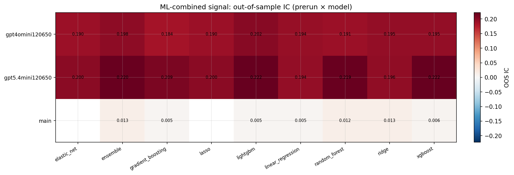

*ML-combined OOS IC (prerun × model)*

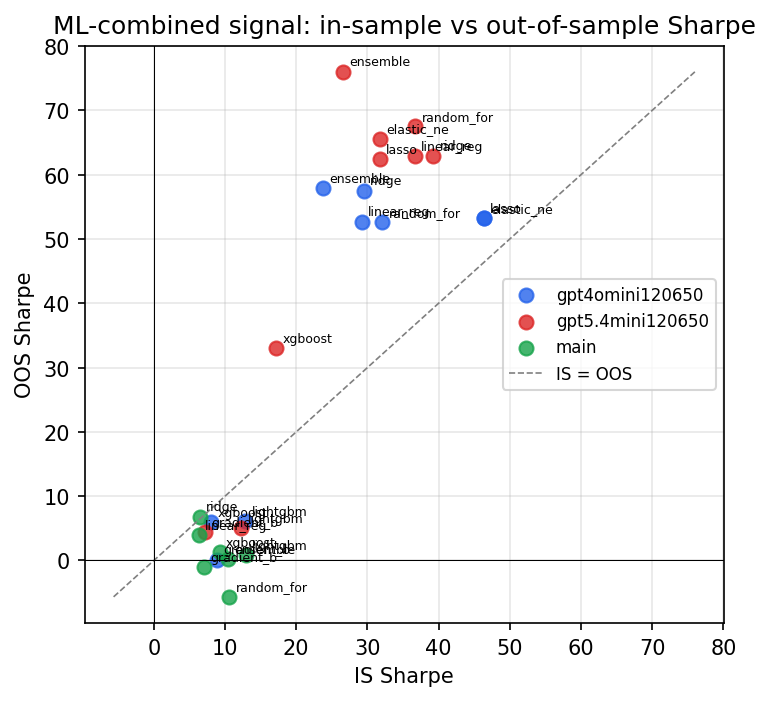

*IS vs OOS Sharpe (overfitting diagnostic)*

---
*Generated by `run_model_comparison.py`. Tables: `*.csv`; interactive: `comparison.ipynb`.*
