# Research-LLM factor comparison — `2025-02`

Comparing the **factor output of different research LLMs** on three axes (raw factor quality → factors as ML features → factors through the full agentic fund). The panel, IS/OOS split, horizon and model hyper-parameters are held identical across preruns — the *only* variable is the factor set.

## Preruns compared

| prerun | research_model | usable_factors | dropped_factors |
| --- | --- | --- | --- |
| gpt4omini120650 | gpt-4o-mini | 66 | 0 |
| gpt5.4mini120650 | gpt-5.4-mini | 69 | 0 |
| main | seed library | 78 | 10 |

> Dropped factors declare fields the current data doesn't have yet (e.g. fundamentals); they light up unchanged once that data is downloaded.

*Usable vs awaiting-data factors per research model*

## Key findings

- **Best ML-combined OOS Sharpe:** `gpt5.4mini120650` with `random_forest` (OOS Sharpe = 40.867).
- **Mean OOS Sharpe across models, by research set:** `gpt5.4mini120650` = 24.601, `gpt4omini120650` = 16.212, `main` = 11.330.
- **Highest mean single-factor |IC| (h=6):** `gpt4omini120650` (mean |IC| = 0.0442).
- **Most diverse zoo (highest effective/raw factor ratio):** `gpt5.4mini120650` (eff 54.0 of 69, ratio 0.78).
- **Best selection-deflated single-factor |IC|:** `main` (deflated |IC| = 0.9139 from 37 factors tried).

## 1. Single-factor IC (raw factor quality)

Per-underlying time-series Spearman rank-IC of every researched factor, recomputed on the shared panel at horizons h=1, h=6, h=60. The per-underlying IC correlates each factor's value vector with the underlying's own forward-return vector (pooled across underlyings); the cross-sectional IC ranks across underlyings per timestamp.

| prerun | n_factors | mean_abs_ic_1 | mean_abs_ic_6 | mean_abs_ic_60 | mean_abs_icir_6 | best_factor_h6 | best_abs_ic_h6 |
| --- | --- | --- | --- | --- | --- | --- | --- |
| gpt4omini120650 | 66 | 0.0517 | 0.0442 | 0.0158 | 1.8987 | order_flow_excitement | 0.1358 |
| gpt5.4mini120650 | 69 | 0.0312 | 0.028 | 0.0126 | 1.5536 | lstm_flow_price_mismatch | 0.158 |
| main | 78 | 0.0357 | 0.0426 | 0.0367 | 0.815 | alpha_066 | 0.9211 |

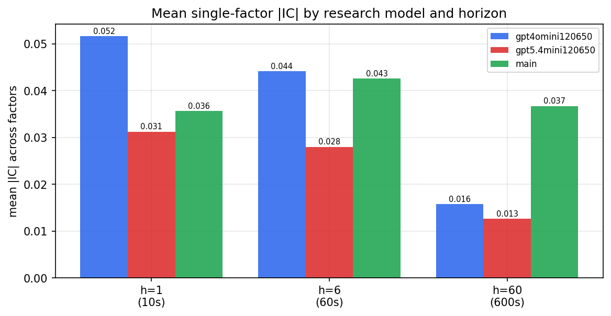

*Mean |IC| by research model and horizon*

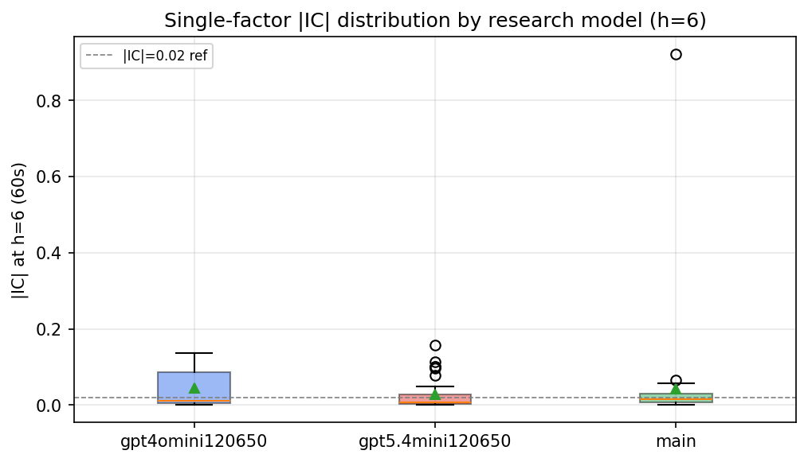

*Per-factor |IC| distribution by research model*

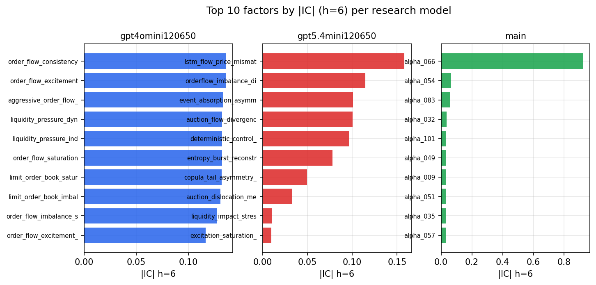

*Top factors by |IC| per research model*

## 2. Factor diversity & redundancy

Pairwise correlation of each zoo's *signals*. `eff_n_factors` is the effective number of independent factors (participation ratio of the correlation eigenvalues); `eff_ratio` and `redundancy` summarise how much unique information the zoo holds vs. how much is duplicated; `n_clusters` groups factors at |corr| ≥ 0.7.

| prerun | n_factors | eff_n_factors | eff_ratio | mean_abs_corr | n_clusters | redundancy |
| --- | --- | --- | --- | --- | --- | --- |
| gpt4omini120650 | 66 | 29.0287 | 0.4398 | 0.0462 | 54 | 0.5602 |
| gpt5.4mini120650 | 69 | 54.0235 | 0.7829 | 0.0103 | 65 | 0.2171 |
| main | 78 | 33.7153 | 0.4322 | 0.0433 | 55 | 0.5678 |

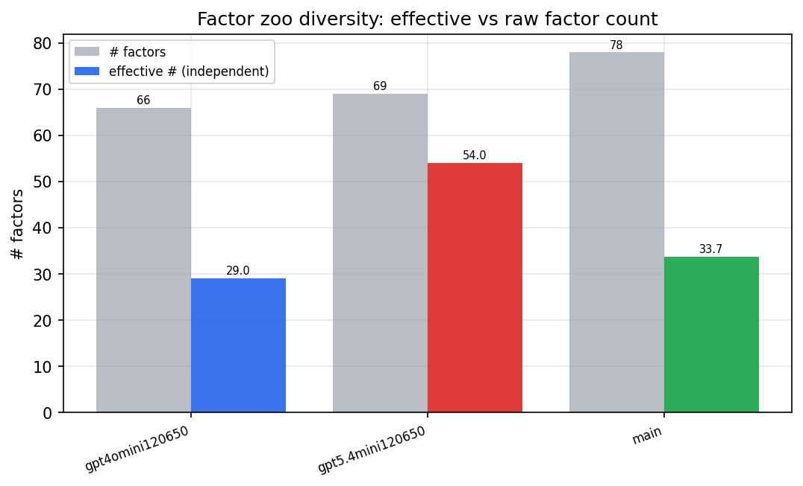

*Effective vs raw factor count per research model*

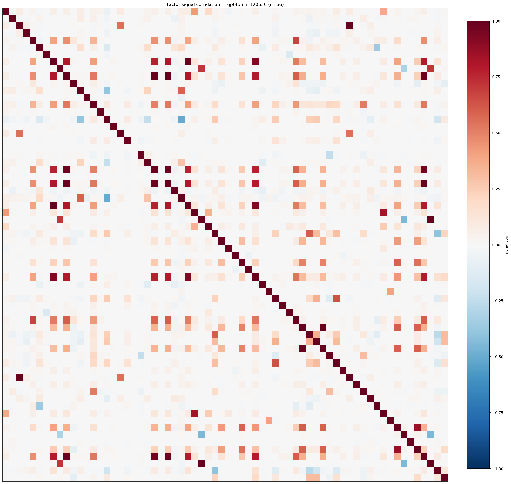

*Signal correlation matrix — gpt4omini120650*

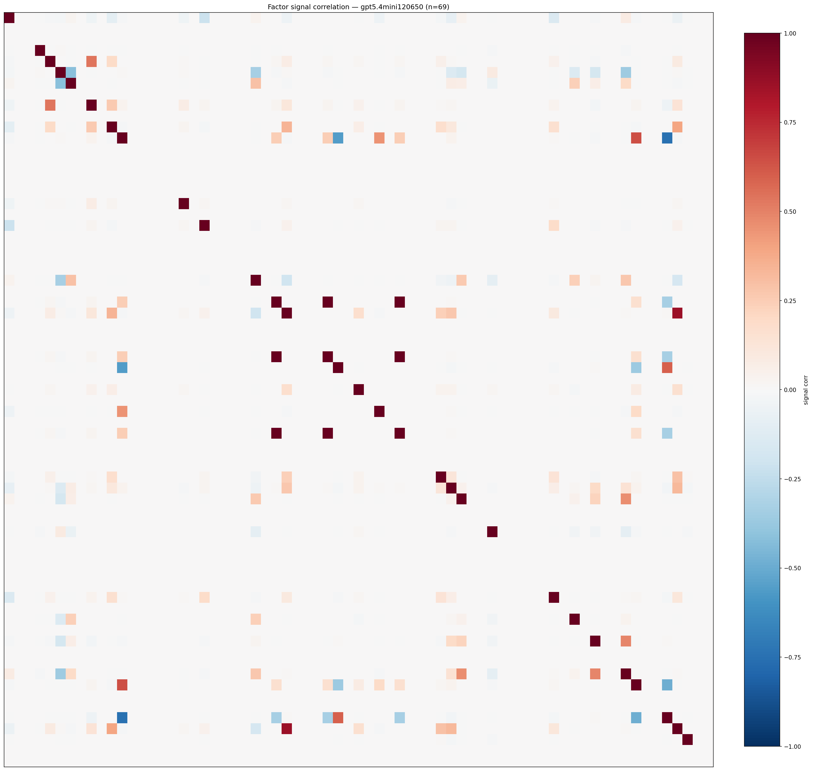

*Signal correlation matrix — gpt5.4mini120650*

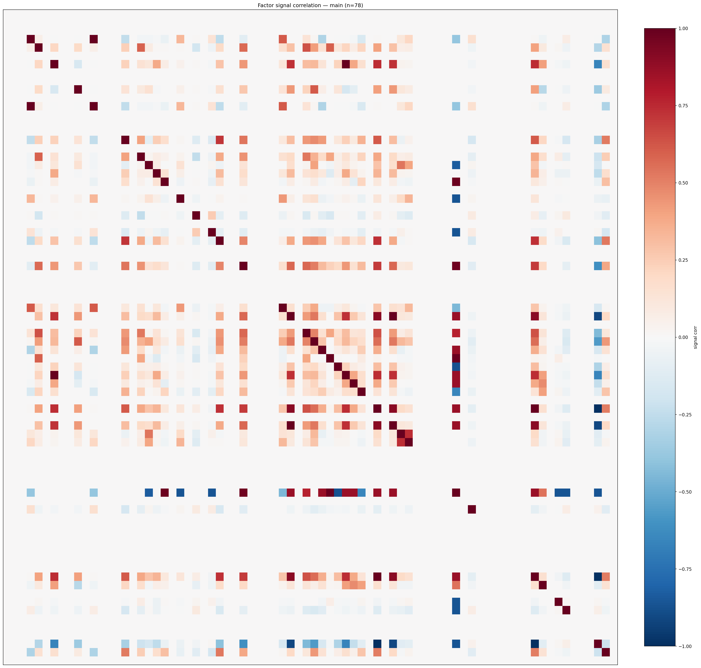

*Signal correlation matrix — main*

## 3. Deflation & model-based importance

`deflated_best_ic` haircuts each zoo's best |IC| for the number of factors tried (`ic_n_tested`) — a bigger zoo's best factor is more likely to be lucky. `lasso_n_nonzero` / `lasso_sparsity` show how many factors a sparse linear model actually keeps (model-view redundancy).

| prerun | best_ic | deflated_best_ic | deflated_best_t | ic_n_tested | ic_n_obs | lasso_n_nonzero | lasso_sparsity |
| --- | --- | --- | --- | --- | --- | --- | --- |
| gpt4omini120650 | 0.1358 | 0.1281 | 47.8107 | 64 | 139319 | 15 | 0.7727 |
| gpt5.4mini120650 | 0.158 | 0.151 | 56.3745 | 30 | 139319 | 13 | 0.8116 |
| main | 0.9211 | 0.9139 | 341.0998 | 37 | 139319 | 2 | 0.9744 |

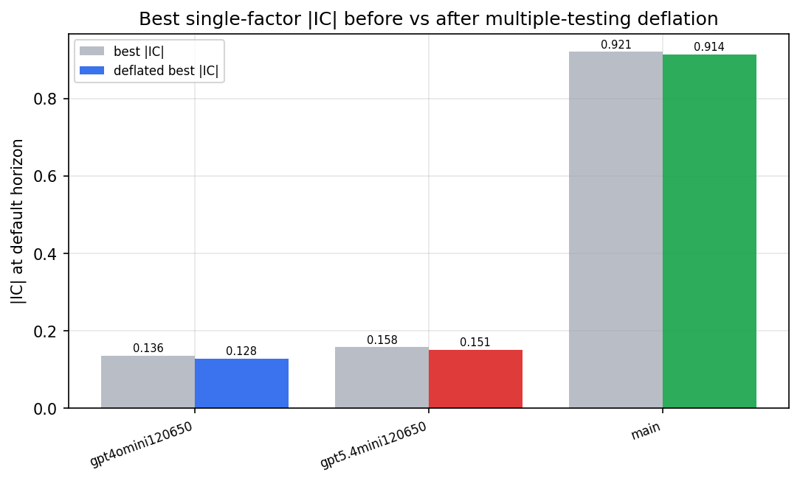

*Best |IC| before vs after multiple-testing deflation*

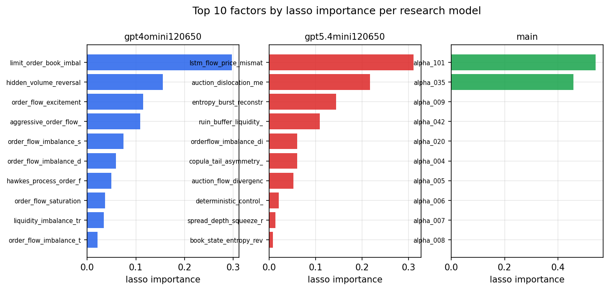

*Top factors by lasso importance per zoo*

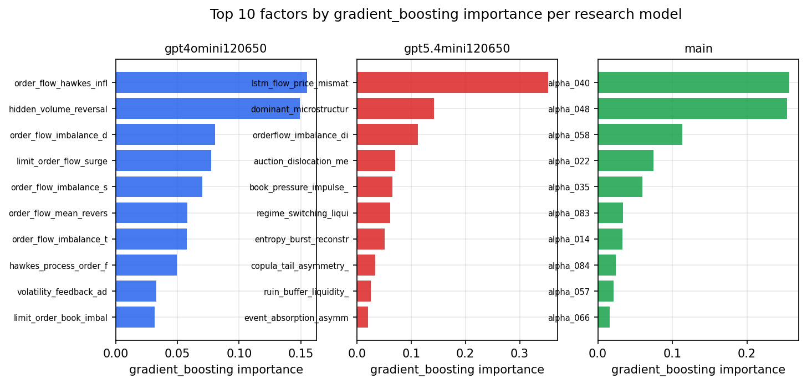

*Top factors by gradient_boosting importance per zoo*

## 4. ML-combined signal — per-underlying vectorised backtest

Each model combines a prerun's factors into ONE signal (fit `factors → forward return` on IS, predict per (bar, underlying)), then that combined signal is run through a simple vectorised backtest — `position(signal) × the underlying's own forward return` — on the held-out OOS tail (+ an equal-weight ensemble). No cross-sectional ranking.

> Config: position=**threshold** (t=1.0, z-score `expanding`), aggregation=**portfolio**, fit-standardise=**per_underlying**, horizon=6.

| prerun | model | n_factors_used | oos_ic | oos_sharpe | is_sharpe | oos_ann_return | oos_max_drawdown |
| --- | --- | --- | --- | --- | --- | --- | --- |
| gpt4omini120650 | linear_regression | 66 | 0.1623 | 18.09 | 50.9449 | 0.6467 | -0.0044 |
| gpt4omini120650 | ridge | 66 | 0.162 | 18.8175 | 47.8611 | 0.6572 | -0.0035 |
| gpt4omini120650 | lasso | 66 | 0.1582 | 20.5164 | 53.9899 | 0.6494 | -0.0067 |
| gpt4omini120650 | elastic_net | 66 | 0.1582 | 20.5164 | 53.9899 | 0.6494 | -0.0067 |
| gpt4omini120650 | random_forest | 66 | 0.1604 | 31.2505 | 42.2228 | 0.8663 | -0.0029 |
| gpt4omini120650 | gradient_boosting | 66 | 0.1558 | 3.19 | 13.619 | 0.0531 | -0.0028 |
| gpt4omini120650 | xgboost | 66 | 0.1669 | 10.0945 | 17.1389 | 0.2058 | -0.0025 |
| gpt4omini120650 | lightgbm | 66 | 0.1679 | -1.4371 | 16.9697 | -0.0157 | -0.0041 |
| gpt4omini120650 | ensemble | 66 | 0.1578 | 24.8741 | 32.7575 | 0.8205 | -0.0023 |
| gpt5.4mini120650 | linear_regression | 69 | 0.1669 | 21.6981 | 38.7276 | 0.7502 | -0.0035 |
| gpt5.4mini120650 | ridge | 69 | 0.1667 | 21.6977 | 38.7922 | 0.7502 | -0.0035 |
| gpt5.4mini120650 | lasso | 69 | 0.1678 | 21.4871 | 38.9283 | 0.743 | -0.0035 |
| gpt5.4mini120650 | elastic_net | 69 | 0.1677 | 20.6792 | 38.8932 | 0.7407 | -0.0043 |
| gpt5.4mini120650 | random_forest | 69 | 0.1883 | 40.8667 | 51.2021 | 1.0033 | -0.0026 |
| gpt5.4mini120650 | gradient_boosting | 69 | 0.1912 | 21.9937 | 37.2873 | 0.6576 | -0.0028 |
| gpt5.4mini120650 | xgboost | 69 | 0.2006 | 30.0643 | 39.4162 | 0.8095 | -0.0045 |
| gpt5.4mini120650 | lightgbm | 69 | 0.1995 | 18.5308 | 25.4252 | 0.3581 | -0.0026 |
| gpt5.4mini120650 | ensemble | 69 | 0.1923 | 24.3909 | 36.2732 | 0.8763 | -0.0043 |
| main | linear_regression | 78 | 0.0383 | 13.4154 | 9.5501 | 0.3151 | -0.0015 |
| main | ridge | 78 | 0.0399 | 14.8285 | 9.4853 | 0.3574 | -0.0015 |
| main | lasso | 78 | 0.0347 | 15.6802 | 15.3128 | 0.1948 | -0.0024 |
| main | elastic_net | 78 | 0.0347 | 15.6802 | 15.3128 | 0.1948 | -0.0024 |
| main | random_forest | 78 | 0.0401 | 12.0741 | 11.9522 | 0.1412 | -0.0024 |
| main | gradient_boosting | 78 | 0.0339 | 3.6432 | 9.2915 | 0.0329 | -0.0013 |
| main | xgboost | 78 | 0.0378 | 10.3653 | 14.4732 | 0.1614 | -0.0026 |
| main | lightgbm | 78 | 0.0317 | 0.1762 | 17.4345 | 0.0021 | -0.0026 |
| main | ensemble | 78 | 0.0428 | 16.1049 | 15.391 | 0.2242 | -0.002 |

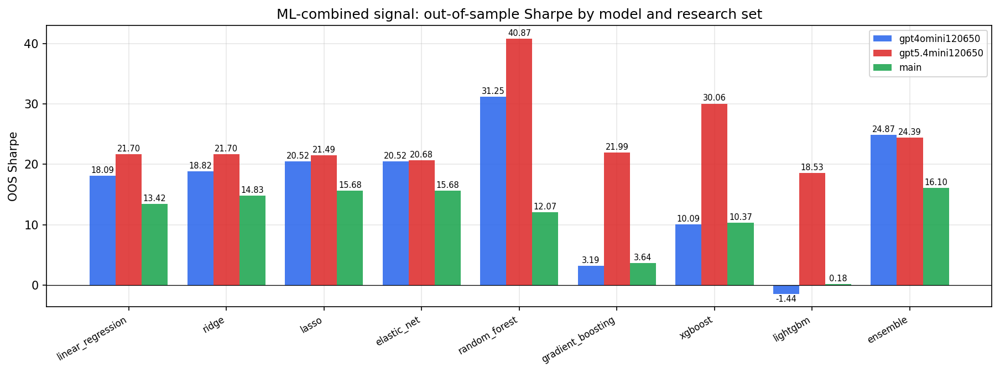

*ML-combined OOS Sharpe by model and research set*

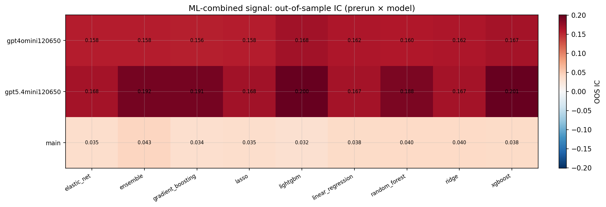

*ML-combined OOS IC (prerun × model)*

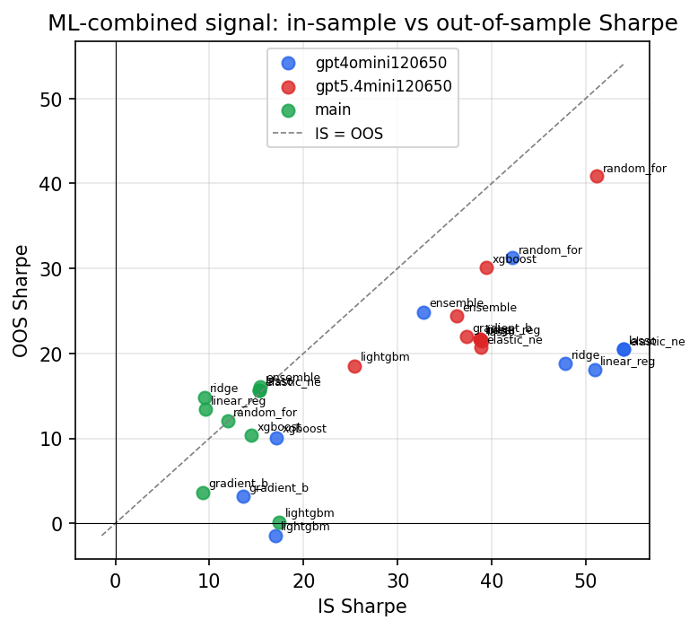

*IS vs OOS Sharpe (overfitting diagnostic)*

---
*Generated by `run_model_comparison.py`. Tables: `*.csv`; interactive: `comparison.ipynb`.*
