# Research-LLM factor comparison — `2025-03`

Comparing the **factor output of different research LLMs** on three axes (raw factor quality → factors as ML features → factors through the full agentic fund). The panel, IS/OOS split, horizon and model hyper-parameters are held identical across preruns — the *only* variable is the factor set.

## Preruns compared

| prerun | research_model | usable_factors | dropped_factors |
| --- | --- | --- | --- |
| gpt4omini120650 | gpt-4o-mini | 66 | 0 |
| gpt5.4mini120650 | gpt-5.4-mini | 69 | 0 |
| main | seed library | 78 | 10 |

> Dropped factors declare fields the current data doesn't have yet (e.g. fundamentals); they light up unchanged once that data is downloaded.

*Usable vs awaiting-data factors per research model*

## Key findings

- **Best ML-combined OOS Sharpe:** `gpt5.4mini120650` with `random_forest` (OOS Sharpe = 47.725).
- **Mean OOS Sharpe across models, by research set:** `gpt5.4mini120650` = 22.194, `gpt4omini120650` = 20.591, `main` = -1.277.
- **Highest mean single-factor |IC| (h=6):** `gpt4omini120650` (mean |IC| = 0.0378).
- **Most diverse zoo (highest effective/raw factor ratio):** `gpt5.4mini120650` (eff 54.8 of 69, ratio 0.79).
- **Best selection-deflated single-factor |IC|:** `gpt5.4mini120650` (deflated |IC| = 0.1256 from 30 factors tried).

## 1. Single-factor IC (raw factor quality)

Per-underlying time-series Spearman rank-IC of every researched factor, recomputed on the shared panel at horizons h=1, h=6, h=60. The per-underlying IC correlates each factor's value vector with the underlying's own forward-return vector (pooled across underlyings); the cross-sectional IC ranks across underlyings per timestamp.

| prerun | n_factors | mean_abs_ic_1 | mean_abs_ic_6 | mean_abs_ic_60 | mean_abs_icir_6 | best_factor_h6 | best_abs_ic_h6 |
| --- | --- | --- | --- | --- | --- | --- | --- |
| gpt4omini120650 | 66 | 0.0464 | 0.0378 | 0.0139 | 1.338 | limit_order_book_imbalance_surge | 0.123 |
| gpt5.4mini120650 | 69 | 0.028 | 0.0245 | 0.0122 | 1.1369 | lstm_flow_price_mismatch | 0.1325 |
| main | 78 | 0.0216 | 0.017 | 0.0139 | 0.7954 | alpha_054 | 0.0584 |

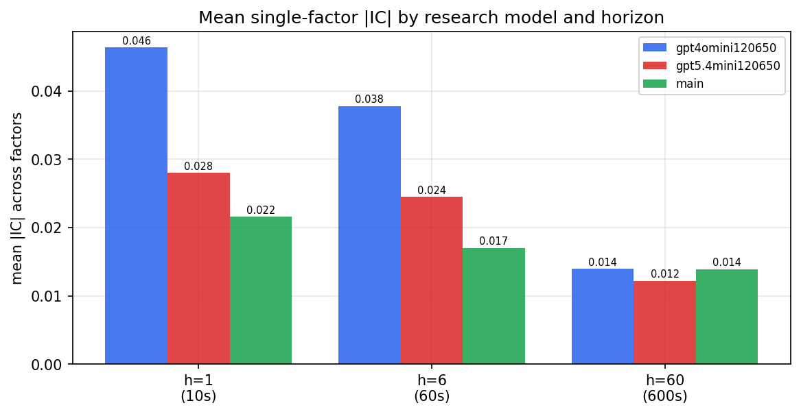

*Mean |IC| by research model and horizon*

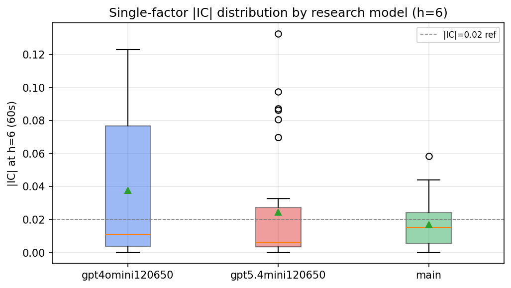

*Per-factor |IC| distribution by research model*

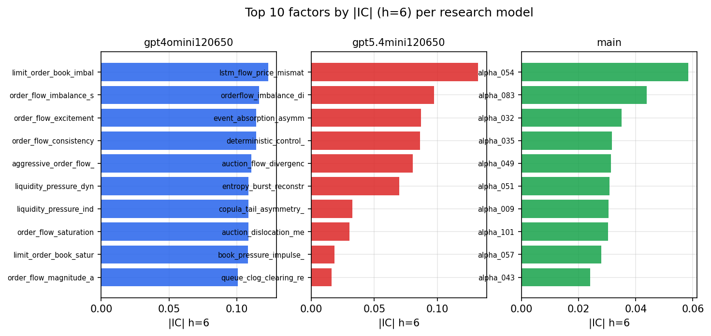

*Top factors by |IC| per research model*

## 2. Factor diversity & redundancy

Pairwise correlation of each zoo's *signals*. `eff_n_factors` is the effective number of independent factors (participation ratio of the correlation eigenvalues); `eff_ratio` and `redundancy` summarise how much unique information the zoo holds vs. how much is duplicated; `n_clusters` groups factors at |corr| ≥ 0.7.

| prerun | n_factors | eff_n_factors | eff_ratio | mean_abs_corr | n_clusters | redundancy |
| --- | --- | --- | --- | --- | --- | --- |
| gpt4omini120650 | 66 | 28.9074 | 0.438 | 0.0468 | 54 | 0.562 |
| gpt5.4mini120650 | 69 | 54.7905 | 0.7941 | 0.0106 | 65 | 0.2059 |
| main | 78 | 35.4648 | 0.4547 | 0.0407 | 56 | 0.5453 |

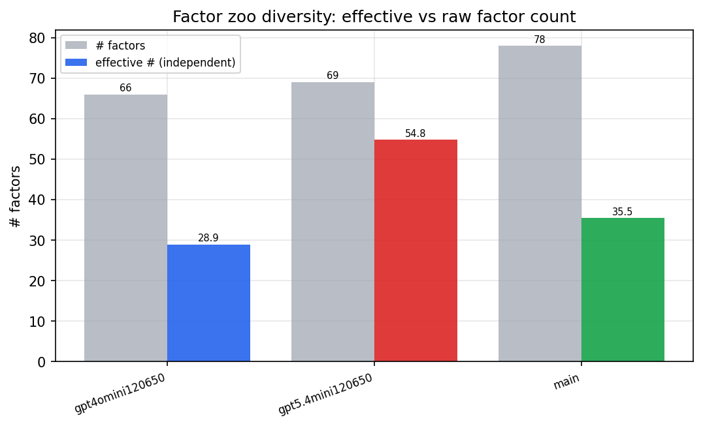

*Effective vs raw factor count per research model*

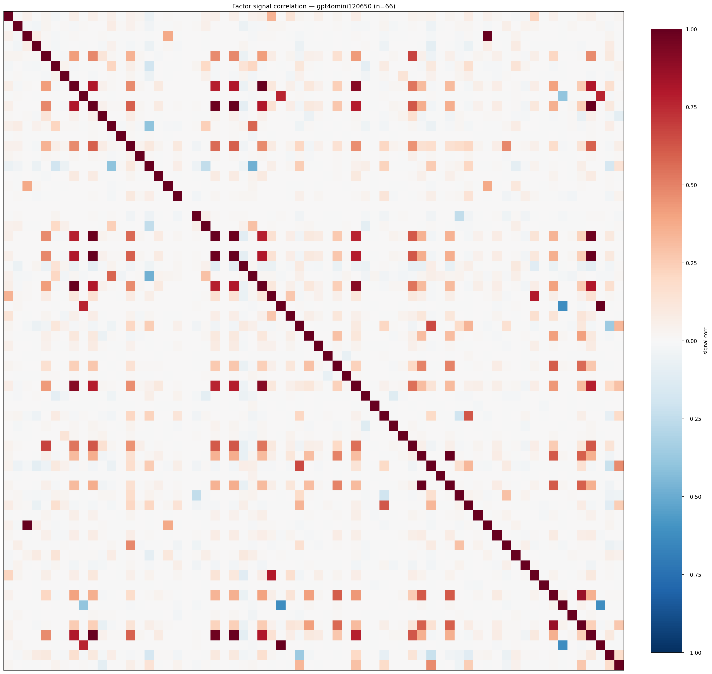

*Signal correlation matrix — gpt4omini120650*

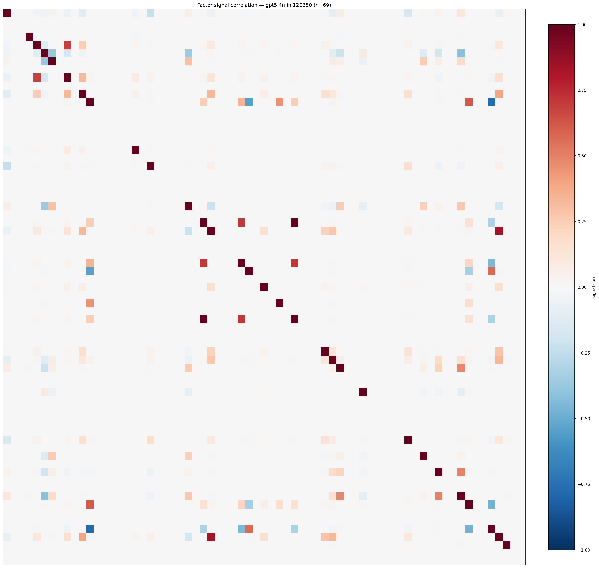

*Signal correlation matrix — gpt5.4mini120650*

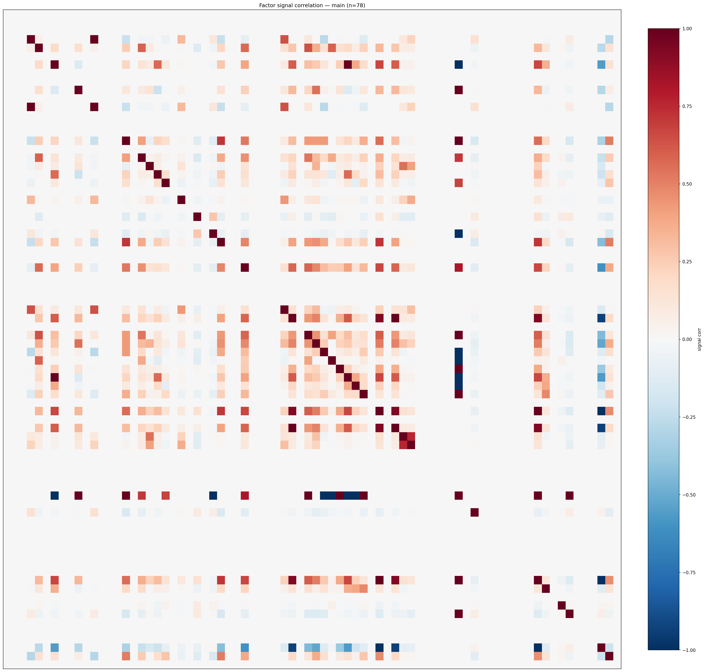

*Signal correlation matrix — main*

## 3. Deflation & model-based importance

`deflated_best_ic` haircuts each zoo's best |IC| for the number of factors tried (`ic_n_tested`) — a bigger zoo's best factor is more likely to be lucky. `lasso_n_nonzero` / `lasso_sparsity` show how many factors a sparse linear model actually keeps (model-view redundancy).

| prerun | best_ic | deflated_best_ic | deflated_best_t | ic_n_tested | ic_n_obs | lasso_n_nonzero | lasso_sparsity |
| --- | --- | --- | --- | --- | --- | --- | --- |
| gpt4omini120650 | 0.123 | 0.1153 | 43.2001 | 64 | 140399 | 7 | 0.8939 |
| gpt5.4mini120650 | 0.1325 | 0.1256 | 47.0485 | 30 | 140399 | 29 | 0.5797 |
| main | 0.0584 | 0.0513 | 19.2128 | 37 | 140399 | 0 | 1.0 |

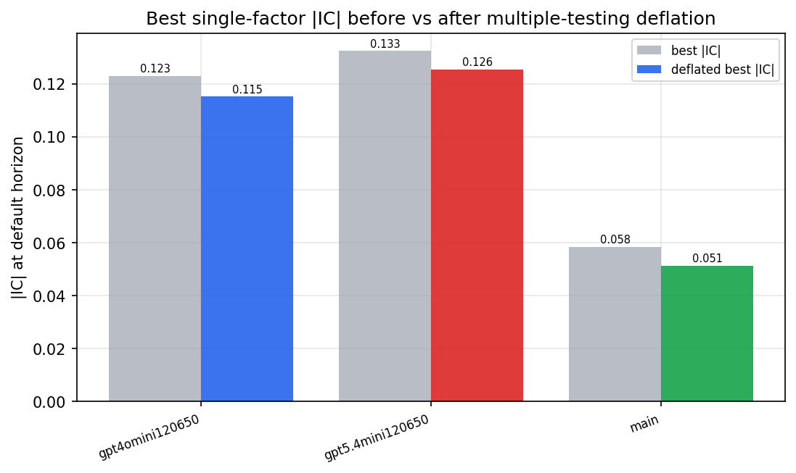

*Best |IC| before vs after multiple-testing deflation*

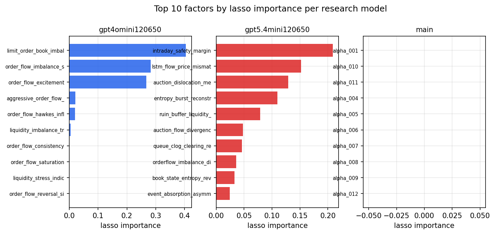

*Top factors by lasso importance per zoo*

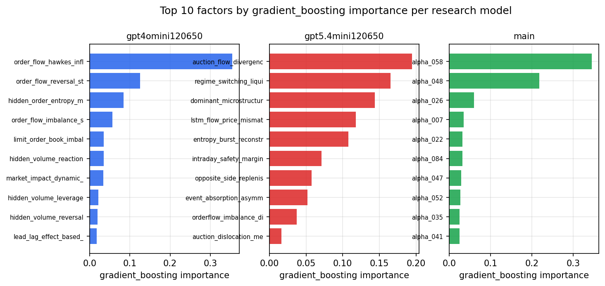

*Top factors by gradient_boosting importance per zoo*

## 4. ML-combined signal — per-underlying vectorised backtest

Each model combines a prerun's factors into ONE signal (fit `factors → forward return` on IS, predict per (bar, underlying)), then that combined signal is run through a simple vectorised backtest — `position(signal) × the underlying's own forward return` — on the held-out OOS tail (+ an equal-weight ensemble). No cross-sectional ranking.

> Config: position=**threshold** (t=1.0, z-score `expanding`), aggregation=**portfolio**, fit-standardise=**per_underlying**, horizon=6.

| prerun | model | n_factors_used | oos_ic | oos_sharpe | is_sharpe | oos_ann_return | oos_max_drawdown |
| --- | --- | --- | --- | --- | --- | --- | --- |
| gpt4omini120650 | linear_regression | 66 | 0.138 | 30.9752 | 35.0241 | 0.7494 | -0.0032 |
| gpt4omini120650 | ridge | 66 | 0.136 | 31.905 | 32.7106 | 0.7803 | -0.0031 |
| gpt4omini120650 | lasso | 66 | 0.1261 | 31.3214 | 33.1683 | 0.7461 | -0.0029 |
| gpt4omini120650 | elastic_net | 66 | 0.126 | 31.3091 | 33.1437 | 0.747 | -0.0029 |
| gpt4omini120650 | random_forest | 66 | 0.1227 | 39.768 | 35.183 | 0.828 | -0.0019 |
| gpt4omini120650 | gradient_boosting | 66 | 0.1215 | -0.9793 | 9.5072 | -0.0079 | -0.0028 |
| gpt4omini120650 | xgboost | 66 | 0.1286 | -0.8767 | 13.2987 | -0.0175 | -0.0065 |
| gpt4omini120650 | lightgbm | 66 | 0.1304 | -4.6708 | 14.4454 | -0.1036 | -0.01 |
| gpt4omini120650 | ensemble | 66 | 0.1266 | 26.5688 | 26.4566 | 0.6587 | -0.0048 |
| gpt5.4mini120650 | linear_regression | 69 | 0.1194 | 25.8599 | 27.2908 | 0.6525 | -0.0022 |
| gpt5.4mini120650 | ridge | 69 | 0.1193 | 26.0282 | 27.4452 | 0.6576 | -0.0022 |
| gpt5.4mini120650 | lasso | 69 | 0.1196 | 26.9916 | 27.3238 | 0.6866 | -0.0022 |
| gpt5.4mini120650 | elastic_net | 69 | 0.1192 | 26.9011 | 27.4296 | 0.6859 | -0.0022 |
| gpt5.4mini120650 | random_forest | 69 | 0.1353 | 47.7246 | 39.6906 | 0.949 | -0.0018 |
| gpt5.4mini120650 | gradient_boosting | 69 | 0.128 | -4.8492 | 14.5262 | -0.0417 | -0.004 |
| gpt5.4mini120650 | xgboost | 69 | 0.1467 | 18.7895 | 32.395 | 0.2374 | -0.0022 |
| gpt5.4mini120650 | lightgbm | 69 | 0.1434 | -1.5583 | 17.3602 | -0.0291 | -0.0059 |
| gpt5.4mini120650 | ensemble | 69 | 0.1379 | 33.863 | 33.0317 | 0.666 | -0.0026 |
| main | linear_regression | 78 | 0.0237 | -0.629 | 9.0449 | -0.0185 | -0.006 |
| main | ridge | 78 | 0.0265 | -0.7984 | 9.3864 | -0.0241 | -0.0067 |
| main | lasso | 78 | 0.0275 | -1.257 | 8.1095 | -0.0341 | -0.009 |
| main | elastic_net | 78 | 0.0275 | -1.2604 | 8.141 | -0.0342 | -0.009 |
| main | random_forest | 78 | 0.0289 | -1.5568 | 12.6218 | -0.0346 | -0.0098 |
| main | gradient_boosting | 78 | 0.0266 | -2.8805 | 10.1073 | -0.0549 | -0.0085 |
| main | xgboost | 78 | 0.0269 | -1.8153 | 13.7749 | -0.0371 | -0.006 |
| main | lightgbm | 78 | 0.0232 | -1.6241 | 14.1326 | -0.0165 | -0.003 |
| main | ensemble | 78 | 0.0263 | 0.3272 | 13.9203 | 0.008 | -0.0053 |

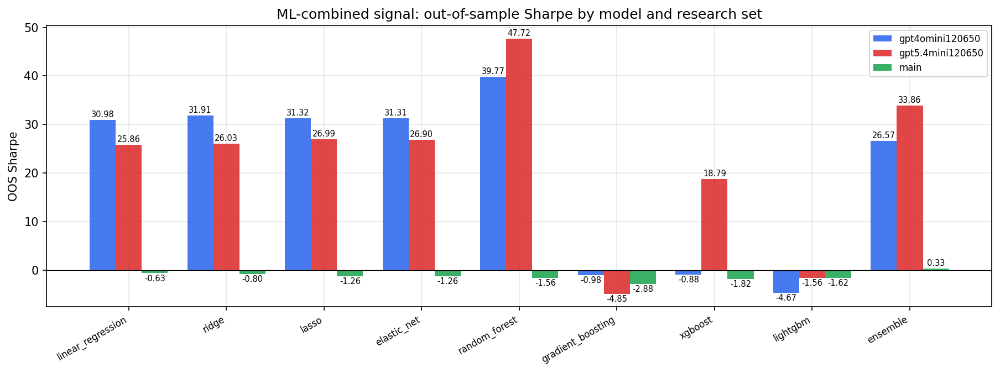

*ML-combined OOS Sharpe by model and research set*

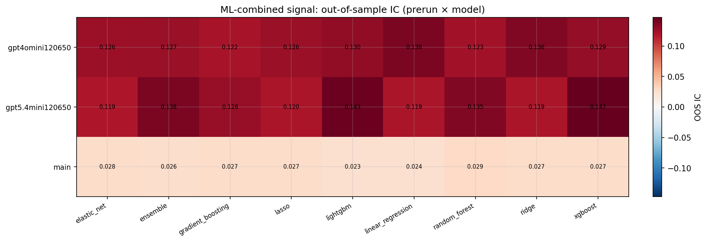

*ML-combined OOS IC (prerun × model)*

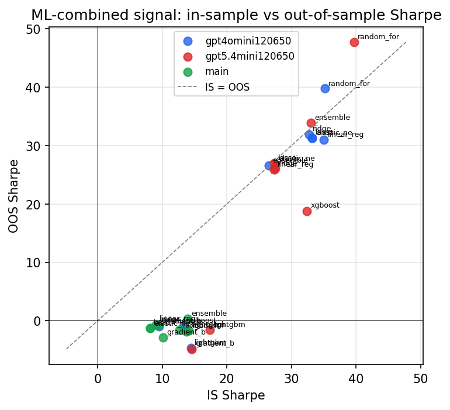

*IS vs OOS Sharpe (overfitting diagnostic)*

---
*Generated by `run_model_comparison.py`. Tables: `*.csv`; interactive: `comparison.ipynb`.*
